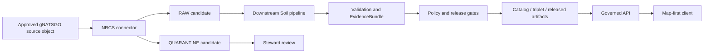

<!-- [KFM_META_BLOCK_V2]
doc_id: kfm://doc/connectors-nrcs-gnatsgo-readme
title: connectors/nrcs/gnatsgo/ — NRCS gNATSGO Product-Identity and Source-Admission Boundary
type: readme
version: v0.2
status: draft
owners: OWNER_TBD — Source steward · Connector steward · NRCS steward · Soil steward · Agriculture steward · Hydrology steward · Rights reviewer · Sensitivity reviewer · Security steward · Validation steward · Schema steward · CI steward · Docs steward
created: 2026-06-19
updated: 2026-07-15
policy_label: "public-doctrine; connector-boundary; nested-product-lane; nrcs; gnatsgo; national-gridded-soil; product-identity-unsettled; source-inactive; no-network-by-default; raw-quarantine-only; descriptor-gated; resolution-aware; support-type-aware; lineage-preserving; fixture-first; not-field-verification; no-publication; rollback-aware; no-secrets"
current_path: connectors/nrcs/gnatsgo/README.md
truth_posture: CONFIRMED repository path and prior v0.1 README, NRCS family/source/package/test README scaffolds, kfm-connector-nrcs 0.0.0 metadata, empty package initializer, minimal PROPOSED nrcs-gnatsgo registry placeholder, empty source-authority register, draft NRCS family catalog and gSSURGO product-page references to gNATSGO, TODO-only connector workflow, and bounded absence of a dedicated gNATSGO product page, alternate flat or gnatssgo connector lane, central products/gnatsgo.py module, gNATSGO tests, gNATSGO pipeline/spec, and gNATSGO source-descriptor schema / PROPOSED product-identity contract, request and package profile, raster and attribute preservation rules, support-type and source-role resolution, admission candidates, finite connector-local outcomes, fixture taxonomy, negative tests, implementation sequence, correction, deprecation, and rollback / CONFLICTED family documentation that recognizes gNATSGO but does not index it consistently, observed versus modeled characteristics, and gSSURGO versus gNATSGO relationship language / UNKNOWN accepted upstream product identifier, active SourceDescriptor, approved source surfaces, current package formats, native CRS and resolution, band and attribute structure, fill/generalization lineage, rights, executable behavior, fixtures, tests, CI enforcement, schedules, receipts, deployment, downstream consumers, and runtime health / NEEDS VERIFICATION owners, product doctrine, naming decision, source identity and activation, rights and attribution, source-role/support-type vocabulary, endpoint allowlist, package profile, schemas, validators, fixtures, CI, lifecycle routing, correction, deprecation, and rollback automation
evidence_snapshot:
  repository: bartytime4life/Kansas-Frontier-Matrix
  repository_id: "1059091169"
  visibility: public
  base_ref: main
  base_commit: ee77864fff2c28994ab8dc07723955d1ece3dbdb
  prior_blob: 54e4ced2c1b23ffddc45c7cef0d8d0fa33952a3e
  nrcs_family_blob: 888236f218fc0892c54c947c0c2651b34ca5137b
  nrcs_source_root_blob: 3b26759548ddaf52eb5b6de0e25dfa354e1d62ec
  nrcs_package_readme_blob: 3e022257cc553e8661b988e9e01c61cccc1fddc8
  nrcs_tests_blob: 7c65ba6ef85a8369e17c40d5e3fbc388b04a306b
  package_metadata_blob: c6bb1565db7df490bee52a597d04d694e2b9f8a4
  package_initializer_blob: e69de29bb2d1d6434b8b29ae775ad8c2e48c5391
  registry_placeholder_blob: 273a0e2567ffc23cd5880c475fda50e05cca39d8
  source_authority_register_blob: 82c23722520922f5ca0dad7f37ed794d1c2edf81
  source_catalog_index_blob: 917a7cacc18f53fccfcff6bc5dd5cedc9435b995
  gssurgo_product_page_blob: e3a8a053889e31437c6d900cfd7f7ef0a2f08442
  connector_gate_workflow_blob: fc36ecced55bb0b4002d551cb28addfff0be918a
  directory_rules_blob: 2affb080e6f0043867c64c7f06c1ca52030fbd55
  bounded_path_checks:
    - connectors/nrcs/gnatsgo/README.md exists at v0.1 before this revision
    - connectors/nrcs-gnatsgo/README.md was not found
    - connectors/nrcs/gnatssgo/README.md was not found
    - docs/sources/catalog/nrcs/gnatsgo.md was not found
    - connectors/nrcs/src/nrcs/__init__.py is empty
    - connectors/nrcs/src/nrcs/products/gnatsgo.py was not found
    - connectors/nrcs/tests/test_gnatsgo.py was not found
    - connectors/nrcs/tests/test_gnatsgo_metadata.py was not found
    - connectors/nrcs/pyproject.toml contains only project name and version 0.0.0
    - data/registry/sources/soil/nrcs-gnatsgo.yaml is a minimal PROPOSED placeholder
    - control_plane/source_authority_register.yaml is PROPOSED and entries is empty
    - schemas/contracts/v1/domains/soil/gnatsgo_source_descriptor.schema.json was not found
    - pipelines/domains/soil/gnatsgo_ingest/README.md was not found
    - pipeline_specs/soil/gnatsgo_ingest.yaml was not found
    - .github/workflows/connector-gate.yml contains TODO echo steps
related:
  - ../README.md
  - ../src/README.md
  - ../src/nrcs/README.md
  - ../tests/README.md
  - ../gssurgo/README.md
  - ../ssurgo/README.md
  - ../sda/README.md
  - ../pyproject.toml
  - ../../../docs/doctrine/directory-rules.md
  - ../../../docs/adr/ADR-0017-source-descriptor-admission-process.md
  - ../../../docs/sources/catalog/nrcs.md
  - ../../../docs/sources/catalog/nrcs/README.md
  - ../../../docs/sources/catalog/nrcs/gssurgo.md
  - ../../../docs/sources/catalog/nrcs/ssurgo.md
  - ../../../docs/sources/catalog/nrcs/soil-data-access.md
  - ../../../control_plane/source_authority_register.yaml
  - ../../../data/registry/sources/soil/nrcs-gnatsgo.yaml
  - ../../../contracts/domains/soil/soil_map_unit.md
  - ../../../contracts/domains/soil/soil_property.md
  - ../../../contracts/domains/soil/soil_time_caveat.md
  - ../../../data/raw/
  - ../../../data/quarantine/
  - ../../../data/receipts/
  - ../../../data/proofs/
  - ../../../policy/rights/
  - ../../../policy/sensitivity/
  - ../../../release/
  - ../../../.github/workflows/connector-gate.yml
tags: [kfm, connectors, nrcs, gnatsgo, national-gridded-soil, gridded-derivative, raster, grid, resolution, crs, nodata, band-identity, product-native-join, source-vintage, generalization, fill-lineage, raw, quarantine, no-network, fixture-first, anti-collapse, correction, rollback]
notes:
  - "This revision changes only connectors/nrcs/gnatsgo/README.md."
  - "The nested path is repository-present, but path presence does not establish an accepted product identity, active source, executable implementation, or publication readiness."
  - "The current NRCS source catalog recognizes gNATSGO as a distinct candidate while the connector-family product table does not list it; product indexing remains inconsistent."
  - "The only inspected gNATSGO registry record is a minimal PROPOSED inventory placeholder, and the source-authority register has no entries."
  - "The gSSURGO product page references a missing gNATSGO product page and describes observed plus modeled characteristics; an accepted SourceDescriptor must pin source role, support type, and fill/generalization lineage."
  - "External details such as current source URLs, package names, formats, CRS, resolution, bands, attributes, fill sources, rights, and refresh cadence are version-sensitive and are not asserted here as implementation facts."
  - "A gNATSGO record remains product-, package-, grid-, band-, attribute-, resolution-, CRS-, vintage-, lineage-, and correction-scoped."
  - "Connector activity is limited to explicit source admission and RAW or QUARANTINE handoff."
[/KFM_META_BLOCK_V2] -->

<a id="top"></a>

# NRCS gNATSGO Product-Identity and Source-Admission Boundary

`connectors/nrcs/gnatsgo/`

> Repository-present nested boundary for candidate USDA NRCS gNATSGO source admission. Current evidence establishes a README-only lane—not an active source, approved acquisition profile, runnable connector, tested parser, validated schema, or release-ready national soil-grid workflow.


**Quick links:** [Purpose](#purpose) · [Status](#status-and-evidence) · [Authority](#authority-boundary) · [Directory basis](#directory-rules-basis) · [Identity](#product-identity-and-naming) · [Invariants](#keystone-invariants) · [Inputs](#explicit-input-contract) · [Transport](#transport-and-security) · [Package](#package-file-and-integrity-contract) · [Grid](#grid-crs-resolution-band-and-nodata-contract) · [Attributes](#attributes-joins-and-lineage) · [Time](#time-vintage-correction-and-supersession) · [Products](#product-and-support-type-separation) · [Rights](#rights-sensitivity-and-public-safety) · [Admission](#source-admission-handoff) · [Outcomes](#connector-outcomes-and-reason-codes) · [Testing](#testing-and-fixtures) · [Pipeline](#pipeline-catalog-and-publication-separation) · [Implementation](#smallest-sound-implementation-sequence) · [Done](#definition-of-done) · [Open](#verification-register) · [Rollback](#rollback-correction-deprecation-and-migration)

> [!IMPORTANT]
> **This README is not a source activation, product naming, or implementation decision.** It does not establish an accepted upstream identifier, active SourceDescriptor, approved endpoint, current package profile, source role, support type, parser, schema, fixtures, tests, receipts, schedule, deployment, or release state.

> [!CAUTION]
> **A national soil grid is not parcel truth, survey full fidelity, or current field verification.** A connector may preserve a source package and its native lineage. It may not silently convert grid cells into point observations, map units into parcels, generalized or filled values into direct observations, or connector success into public release.

---

<a id="purpose"></a>

## Purpose

This README defines the allowed boundary for candidate gNATSGO source admission under the established NRCS connector family.

A future implementation may exist only after governance verifies product identity, creates or accepts product doctrine, activates a SourceDescriptor, and approves the source profile. Any implementation must remain:

- subordinate to `connectors/nrcs/`;
- explicit about product identity and package profile;
- descriptor-gated and source-activation-aware;
- no-network by default;
- fixture-first and deterministic;
- bounded in redirects, timeouts, retries, rate, pagination, payload size, archive members, and decompression;
- lossless about package, file, grid, CRS, transform, resolution, band, nodata, attributes, product-native joins, source vintage, fill/generalization lineage, rights, and correction context;
- limited to RAW or QUARANTINE admission candidates;
- separate from normalization, reprojection, resampling, aggregation, modeling, interpretation, catalog closure, evidence closure, release, public API, UI, map, and AI behavior.

This lane must not become an alternate NRCS family root, source registry, mutable endpoint catalog, general raster-processing package, Soil normalization pipeline, policy engine, proof service, release service, or public surface.

[Back to top](#top)

---

<a id="status-and-evidence"></a>

## Status and evidence

| Surface | Status | Safe conclusion |
|---|---:|---|
| This README | **CONFIRMED v0.1 before revision** | A nested documentation boundary exists. |
| Flat `connectors/nrcs-gnatsgo/` | **NOT FOUND** | No competing flat lane was established. |
| Alternate `connectors/nrcs/gnatssgo/` | **NOT FOUND** | No alternate double-`s` path was established. |
| NRCS family root | **CONFIRMED** | `connectors/nrcs/` is the family spine. |
| NRCS connector-family product table | **CONFIRMED but incomplete** | It lists gSSURGO and STATSGO2, but not gNATSGO. |
| NRCS source-catalog index | **CONFIRMED draft** | It recognizes `nrcs.gnatsgo` with unresolved observed/modeled characteristics. |
| Dedicated gNATSGO product page | **NOT FOUND** | Product doctrine is incomplete. |
| gSSURGO product page | **CONFIRMED draft** | It references gNATSGO and warns against resolution collapse. |
| NRCS package metadata | **CONFIRMED `0.0.0`** | Package presence does not prove product support. |
| NRCS package initializer | **CONFIRMED empty** | No runtime behavior is exposed. |
| Future `products/gnatsgo.py` | **NOT FOUND** | No executable adapter is established. |
| Future gNATSGO tests | **NOT FOUND** | No product-specific tests are established. |
| gNATSGO registry record | **Minimal `PROPOSED` placeholder** | Inventory presence is not activation. |
| Source-authority register | **`PROPOSED`, `entries: []`** | Source activation is not established. |
| Product-specific schema | **NOT FOUND** | No gNATSGO machine shape is established. |
| Product-specific pipeline/spec | **NOT FOUND** | No dedicated downstream implementation is established. |
| Connector workflow | **TODO-only** | A green run cannot prove output or receipt behavior. |

### Truth posture

**CONFIRMED:** path presence, parent family boundary, placeholder package, empty initializer, minimal registry pointer, empty authority register, source-catalog recognition, gSSURGO cross-reference, and RAW/QUARANTINE connector law.

**PROPOSED:** the contracts, finite outcomes, reason codes, fixture classes, tests, implementation sequence, and rollback procedures in this README.

**CONFLICTED:** family indexing, observed-versus-modeled characteristics, `gnatsgo` versus legacy `gnatssgo` wording, and relationship language such as national counterpart, seamless layer, gridded derivative, or filled/generalized product.

**UNKNOWN:** accepted upstream branding, approved endpoints, packages, bands, attributes, CRS, resolution, fill rules, rights, cadence, implementation, deployment, and runtime health.

**NEEDS VERIFICATION:** owners, product doctrine, source identity, activation, role/support vocabulary, rights, request/package profiles, schemas, validators, fixtures, CI, pipeline, catalog, evidence, release, correction, and rollback wiring.

[Back to top](#top)

---

<a id="authority-boundary"></a>

## Authority boundary

```text
MAY:
  discover an approved source object
  retrieve explicitly
  preserve response and package identity
  verify size and digest
  inspect an approved archive safely
  preserve grid, CRS, resolution, bands, nodata, attributes, and lineage
  produce a RAW or QUARANTINE admission candidate
  emit finite connector-local outcomes

MUST NOT:
  activate a source
  define product doctrine
  assign final source role or support type
  silently resample or reproject
  normalize Soil objects
  infer field conditions
  create parcel, regulatory, engineering, crop/yield, or hydrology truth
  close EvidenceBundles
  create canonical catalog/triplet truth
  publish tiles, APIs, UI state, reports, or AI answers
  approve release, correction, or rollback
```

Receipts document actions; they do not grant authority. Generated language summarizes evidence; it does not replace it.

[Back to top](#top)

---

<a id="directory-rules-basis"></a>

## Directory Rules basis

`connectors/` owns source-specific fetch, integrity inspection, parser handoff, and admission-candidate behavior. Directory Rules require connector output to stop at:

```text
data/raw/<domain>/<source_id>/<run_id>/
data/quarantine/<domain>/<source_id>/<run_id>/
```

The parent `connectors/nrcs/` lane is the appropriate responsibility root. This README does not create a new root or ratify any missing code, schema, product page, or pipeline path.

Responsibility remains separated:

| Responsibility | Owning root |
|---|---|
| Human product explanation | `docs/` |
| Operational source identity and activation | `data/registry/`, `control_plane/`, policy/review surfaces |
| Object meaning | `contracts/` |
| Machine shape | `schemas/` |
| Fetch/admission | `connectors/` |
| Declarative execution intent | `pipeline_specs/` |
| Executable normalization | `pipelines/` |
| Admissibility and sensitivity | `policy/` |
| Release/correction/rollback | `release/` and correction roots |
| Public access | governed API and released artifacts |

[Back to top](#top)

---

<a id="product-identity-and-naming"></a>

## Product identity and naming

The repository currently uses:

```text
path:      connectors/nrcs/gnatsgo/
short ref: nrcs.gnatsgo
registry:  data/registry/sources/soil/nrcs-gnatsgo.yaml
```

These are repository references, not proof that upstream naming, capitalization, source ID, package identity, or access profile has been approved.

### Freeze-by-default rule

Until an accepted descriptor and product page resolve identity:

- do not create a second `gnatssgo` or flat connector implementation;
- do not create parallel source IDs for the same upstream product;
- do not enable schedules or live acquisition;
- do not create public catalog collections or API identifiers;
- do not infer aliases from filename similarity;
- do not migrate this path by documentation alone.

A naming decision must specify canonical product name, upstream identifier, KFM source ID, aliases, slug, module name, registry path, receipt namespace, catalog identity, migration plan, and rollback target.

[Back to top](#top)

---

<a id="keystone-invariants"></a>

## Keystone invariants

1. Source activation is external and must be explicit.
2. Network access is off by default.
3. Import performs no network, secret reads, or lifecycle writes.
4. Product identity is preserved and never inferred from a generic soil-grid label.
5. Source bytes and package metadata remain immutable evidence.
6. Every file has source locator, retrieval time, size, and digest.
7. Archive extraction is bounded and traversal-safe.
8. Native CRS, transform, extent, resolution, dimensions, bands, and nodata remain explicit.
9. Reprojection and resampling are downstream transforms with receipts.
10. Product-native attributes and joins remain source-scoped.
11. MUKEY, when present, is a join value—not proof of full SSURGO fidelity.
12. Filled, generalized, interpolated, or blended values retain derivative lineage.
13. Observed, modeled, aggregate, and administrative support cannot collapse.
14. gNATSGO, gSSURGO, SSURGO, STATSGO2, SDA, SoilGrids, SMAP, and station data remain distinct.
15. A grid cell is not parcel truth or current field verification.
16. Soil interpretations are not legal or regulatory determinations.
17. Connector success is not validation, evidence closure, or publication.
18. Uncertainty routes to QUARANTINE or abstention.
19. Corrections create new versions and supersession links; they do not rewrite history.
20. Rollback must preserve evidence resolution and audit history.

[Back to top](#top)

---

<a id="explicit-input-contract"></a>

## Explicit input contract

A future connector call must receive reviewed configuration rather than discovering mutable state implicitly.

Illustrative, non-canonical request profile:

```yaml
source_descriptor_ref: kfm://source/NEEDS-VERIFICATION
product_id: NEEDS-VERIFICATION
source_object:
  locator: https://approved-host.example/path/object
  expected_media_type: NEEDS-VERIFICATION
  expected_size_max: NEEDS-VERIFICATION
network:
  enabled: false
  allowed_schemes: [https]
  allowed_hosts: []
  follow_redirects: false
  timeout_seconds: NEEDS-VERIFICATION
  retries: 0
limits:
  response_bytes: NEEDS-VERIFICATION
  archive_members: NEEDS-VERIFICATION
  expanded_bytes: NEEDS-VERIFICATION
output:
  mode: admission_candidate_only
```

The real profile must pin descriptor reference, approved locator pattern, product/package identity, rights posture, timeout/retry policy, limits, expected media/file profile, and RAW/QUARANTINE handoff contract.

[Back to top](#top)

---

<a id="transport-and-security"></a>

## Transport and security

Required controls include:

- HTTPS-only unless policy explicitly approves otherwise;
- exact host allowlist and bounded path/query patterns;
- no user-controlled arbitrary URLs;
- DNS/IP validation against loopback, link-local, private, metadata, and disallowed ranges;
- redirect disabled by default or revalidated at every hop;
- bounded connection/read/total timeouts;
- bounded retries with backoff and no retry storms;
- rate and concurrency limits;
- response and decompression limits;
- content-type and file-signature checks;
- no ambient credentials, cookies, or session reuse;
- redacted logs with no query secrets or private headers;
- safe archive paths with no absolute paths, `..`, links, devices, or extraction escape;
- deterministic failure on truncated, malformed, oversized, or unsupported inputs.

Security failures route to QUARANTINE or `ERROR`; they never relax a gate automatically.

[Back to top](#top)

---

<a id="package-file-and-integrity-contract"></a>

## Package, file, and integrity contract

For every retrieved object, preserve:

- source descriptor and product references;
- requested and final locators after approved redirects;
- retrieval timestamp and response metadata;
- upstream file/package name exactly as supplied;
- media type, compression/container type, byte size, and digest;
- ETag/Last-Modified or equivalent when present;
- package/release/version identifiers when source-supported;
- archive member inventory and per-member digest when extraction occurs;
- parser/profile version;
- warnings, quarantine reasons, and correction links.

Do not silently rename, drop, recompress, normalize, or overwrite source files. Derived convenience files are separate artifacts with transform receipts.

[Back to top](#top)

---

<a id="grid-crs-resolution-band-and-nodata-contract"></a>

## Grid, CRS, resolution, band, and nodata contract

A parser must preserve, where source-supported:

| Dimension | Required preservation |
|---|---|
| Product identity | Product/package/release identity and source-native labels |
| CRS | Native CRS identifier, WKT/proj definition as appropriate, and axis/order assumptions |
| Transform | Native affine/geotransform and pixel interpretation |
| Resolution | Native x/y cell size and units |
| Extent | Native bounds, dimensions, and alignment |
| Bands | Band count, names, indices, data types, units, scale/offset, and descriptions |
| Nodata | Source nodata/mask semantics distinct from valid zero or class values |
| Overviews | Source-provided overviews distinct from generated pyramids |
| Attributes | Raster attribute tables, sidecars, code lists, and join references |
| Quality | Quality/mask flags and completeness notes |
| Vintage | Product release, source-survey vintage, retrieval time, and correction state |

### Forbidden implicit transforms

The connector must not silently:

- reproject;
- resample;
- snap to another grid;
- change cell size;
- replace nodata;
- cast data types with loss;
- merge or split bands;
- fill gaps;
- generalize classes;
- calculate zonal statistics;
- produce COG, tile, PMTiles, GeoParquet, or web-map artifacts.

Those are downstream transforms with explicit contracts, receipts, validation, and release gates.

[Back to top](#top)

---

<a id="attributes-joins-and-lineage"></a>

## Attributes, joins, and lineage

Preserve product-native attribute structures without claiming SSURGO-level relational completeness.

Required context includes:

- attribute table/file identity;
- field names, types, units, code lists, and null semantics;
- join-key names, values, cardinality expectations, and uniqueness findings;
- MUKEY where present, with source/product scope;
- any source-native cell/value identifier;
- table and grid version alignment;
- unmatched, duplicate, orphan, or ambiguous joins;
- source documentation reference;
- parser assumptions and validation findings.

### Fill and generalization lineage

If source documentation indicates that a national layer combines, fills, generalizes, harmonizes, or derives from multiple soil products, preserve:

- each source family and version where available;
- geographic or logical fill rule;
- precedence rule;
- gap or fallback semantics;
- resampling/generalization method if source-provided;
- attribute availability differences;
- confidence, caveat, or quality fields;
- areas where support is observed, modeled, generalized, or unknown.

Do not flatten mixed support into one unqualified `observed` label. The accepted SourceDescriptor and downstream contracts must define machine semantics.

[Back to top](#top)

---

<a id="time-vintage-correction-and-supersession"></a>

## Time, vintage, correction, and supersession

Keep distinct:

- upstream product/release time;
- source-survey or contributing-data vintage;
- file/package modification time;
- retrieval time;
- parser/validation time;
- valid time when defined;
- correction/supersession time;
- public release time downstream.

A new download with the same filename is not assumed identical. Compare digest, size, metadata, package inventory, grid profile, bands, attributes, and documented version.

Corrections must create new immutable identities and links such as:

```text
supersedes -> prior candidate/version
superseded_by -> corrected candidate/version
correction_notice_ref -> governed correction record
```

[Back to top](#top)

---

<a id="product-and-support-type-separation"></a>

## Product and support-type separation

| Product/support | What it may support | Must not collapse into |
|---|---|---|
| SSURGO | Survey-area vector/tabular soil evidence | gNATSGO national grid or current field observation |
| gSSURGO | Gridded representation tied to SSURGO mapping | gNATSGO fill/generalization semantics |
| gNATSGO | National gridded soil candidate under verified profile | SSURGO full relational fidelity, parcel truth, point observation |
| STATSGO2 | Broad generalized soil context | Detailed county/parcel-scale proof |
| SDA | Receipted query response | Full package or national grid without query scope |
| Web Soil Survey | Human-facing discovery/download/citation surface | Silent canonical source identity |
| SoilGrids | Separate modeled global soil product | NRCS source authority |
| SMAP | Satellite soil-moisture product | Static survey or national soil classification |
| SCAN/Mesonet/USCRN | Station observations | National grid cell or static survey truth |
| KFM-derived raster | Modeled/aggregate derivative with receipts | Upstream observed source artifact |

Cross-product comparisons, fusions, rollups, resampling, and public layers belong downstream and require model/aggregation/representation receipts.

[Back to top](#top)

---

<a id="rights-sensitivity-and-public-safety"></a>

## Rights, sensitivity, and public safety

Before live use, verify and record:

- publisher and steward identity;
- license/terms and redistribution posture;
- attribution/citation requirements;
- derivative and caching permissions;
- access constraints;
- review date and evidence reference.

Public source material can still become sensitive when joined with private land, producer/program, cultural, archaeological, rare-species, or precise-location data. The connector may flag review needs but does not decide release.

This product is not a life-safety, regulatory, engineering, compliance, crop-management, or property-boundary authority. Public answers must use governed released evidence and cite-or-abstain.

[Back to top](#top)

---

<a id="source-admission-handoff"></a>

## Source-admission handoff

A future successful parser returns an admission candidate, not canonical truth.

Illustrative shape:

```yaml
candidate_type: source_admission_candidate
source_descriptor_ref: kfm://source/NEEDS-VERIFICATION
product_id: NEEDS-VERIFICATION
source_object:
  locator: redacted-or-approved
  retrieved_at: 2026-07-15T00:00:00Z
  bytes: 0
  digest: sha256:...
package_profile:
  native_crs: NEEDS-VERIFICATION
  resolution: NEEDS-VERIFICATION
  bands: []
  nodata: NEEDS-VERIFICATION
lineage:
  contributing_products: []
  fill_generalization: NEEDS-VERIFICATION
rights_status: NEEDS-VERIFICATION
sensitivity_status: NEEDS-VERIFICATION
proposed_lane: quarantine
reasons:
  - SOURCE_INACTIVE
```

Allowed destinations are RAW or QUARANTINE candidate handoffs only. The connector does not write WORK, PROCESSED, CATALOG, TRIPLET, PUBLISHED, release, public API, UI, or tile stores.

[Back to top](#top)

---

<a id="connector-outcomes-and-reason-codes"></a>

## Connector outcomes and reason codes

These are **PROPOSED connector-local outcomes**, not canonical `PolicyDecision` or release outcomes.

| Outcome | Meaning |
|---|---|
| `ADMIT_RAW_CANDIDATE` | Source and integrity gates passed for downstream review. |
| `QUARANTINE_CANDIDATE` | Bytes were preserved but identity, rights, profile, lineage, or validation remains unresolved. |
| `SKIP_NO_CHANGE` | A governed identity/digest comparison proved no material source change. |
| `ABSTAIN_UNSUPPORTED` | Source/package/profile is outside accepted scope. |
| `RETRY_LATER` | A bounded transient condition occurred and policy permits retry. |
| `ERROR` | Deterministic execution or security failure. |

Proposed reason-code families:

- `SOURCE_INACTIVE`, `DESCRIPTOR_MISSING`, `PRODUCT_ID_UNRESOLVED`, `PRODUCT_PAGE_MISSING`;
- `RIGHTS_UNKNOWN`, `ATTRIBUTION_UNRESOLVED`, `SENSITIVITY_REVIEW_REQUIRED`;
- `HOST_NOT_ALLOWED`, `SCHEME_NOT_ALLOWED`, `REDIRECT_DENIED`, `SSRF_BLOCKED`;
- `TIMEOUT`, `RATE_LIMITED`, `RETRY_EXHAUSTED`, `RESPONSE_TOO_LARGE`;
- `MEDIA_TYPE_UNSUPPORTED`, `ARCHIVE_UNSAFE`, `ARCHIVE_LIMIT_EXCEEDED`, `DIGEST_MISMATCH`;
- `PACKAGE_PROFILE_UNKNOWN`, `CRS_MISSING`, `RESOLUTION_MISSING`, `BAND_PROFILE_UNKNOWN`;
- `NODATA_UNRESOLVED`, `ATTRIBUTE_PROFILE_UNKNOWN`, `JOIN_AMBIGUOUS`, `LINEAGE_MISSING`;
- `FILL_RULE_UNKNOWN`, `MIXED_SUPPORT_UNRESOLVED`, `VINTAGE_UNKNOWN`, `SCHEMA_DRIFT`;
- `MALFORMED_INPUT`, `UNSUPPORTED_VERSION`, `NO_MATERIAL_CHANGE`, `INTERNAL_ERROR`.

Reason codes must be finite, stable, testable, and safe for logs.

[Back to top](#top)

---

<a id="testing-and-fixtures"></a>

## Testing and fixtures

Default tests must be offline and deterministic. Live tests, if ever approved, must be separately marked, skipped by default, descriptor-gated, rate-limited, non-mutating, and excluded from normal CI.

### Fixture classes

| Class | Purpose |
|---|---|
| Synthetic valid | Minimal valid package/profile behavior |
| Synthetic malformed | Parser and structural failures |
| Minimized public snapshot | Approved source-derived structure with rights/digest metadata |
| Archive attack | Traversal, links, bombs, excessive members, oversized expansion |
| Grid profile | CRS, transform, resolution, bands, nodata, extent |
| Attribute/join | Valid, duplicate, orphan, ambiguous, and mismatched joins |
| Mixed lineage | Observed/generalized/filled/modeled support separation |
| Drifted profile | Changed filenames, bands, schema, metadata, or package version |
| Correction pair | Supersession and correction behavior |
| Oversized simulation | Resource-limit enforcement without large repository files |

Every fixture requires purpose, origin or synthetic declaration, creation/retrieval date, digest, rights/sensitivity review, minimization note, expected outcome, and safe-use rationale.

### Required negative tests

Tests must reject:

- network access by default;
- import-time side effects;
- unapproved hosts and redirect escapes;
- archive traversal and decompression bombs;
- missing or mismatched digest;
- silent reprojection/resampling;
- missing CRS/resolution/band/nodata metadata;
- product-identity collapse;
- gNATSGO/gSSURGO/SSURGO/STATSGO2 collapse;
- mixed observed/modeled support collapse;
- grid-cell-as-point or parcel claims;
- connector writes beyond RAW/QUARANTINE;
- public tiles, APIs, UI, release manifests, or evidence closure from connector tests.

The current test README is planning evidence only; named gNATSGO tests were not found.

[Back to top](#top)

---

<a id="pipeline-catalog-and-publication-separation"></a>

## Pipeline, catalog, and publication separation

A governed future flow may resemble:



This diagram is illustrative. No dedicated gNATSGO pipeline, spec, catalog collection, release, or public consumer was verified.

Connectors preserve source evidence. Pipelines transform. Validators test. Catalogs describe governed artifacts. EvidenceBundles support claims. Policy decides admissibility. Release authorizes publication. Public clients use governed interfaces only.

[Back to top](#top)

---

<a id="smallest-sound-implementation-sequence"></a>

## Smallest sound implementation sequence

1. **Resolve product identity.** Verify upstream naming, scope, product relationships, and accepted KFM source ID.
2. **Create/approve product doctrine.** Document authority, caveats, fill/generalization posture, rights, and product separation under `docs/`.
3. **Realize SourceDescriptor and activation.** Pin role, support type, source surfaces, rights, sensitivity, cadence, profile, and review state.
4. **Define contracts and schemas.** Add semantic and machine profiles without parallel schema homes.
5. **Approve fixtures.** Add synthetic/minimized cases and rights metadata.
6. **Implement import-safe parser.** Parse supplied fixtures and package profiles before any live client.
7. **Implement bounded transport.** Add allowlists, limits, SSRF defense, digests, and archive safety.
8. **Implement RAW/QUARANTINE candidates.** No later-lifecycle writes.
9. **Add product tests and real CI gates.** Prove anti-collapse and negative paths.
10. **Integrate downstream separately.** Pipeline, receipts, evidence, catalog, release, public API, and rollback each require their own verified changes.

Stop if identity, rights, role/support semantics, package profile, or ownership is unresolved. Quarantine is a valid outcome; optimistic continuation is not.

[Back to top](#top)

---

<a id="definition-of-done"></a>

## Definition of done

- [ ] Owners are assigned.
- [ ] Product name, upstream identifier, KFM source ID, slug, and aliases are accepted.
- [ ] Dedicated product doctrine exists and is reviewed.
- [ ] SourceDescriptor is complete and active.
- [ ] Rights, citation, attribution, redistribution, and sensitivity posture are approved.
- [ ] Source role, support type, and fill/generalization semantics are pinned.
- [ ] Approved host/path/profile and network limits are configured externally.
- [ ] Package, grid, band, nodata, attribute, join, and lineage profiles are defined.
- [ ] Import-safe product module exists.
- [ ] Parser is deterministic and fixture-first.
- [ ] Transport and archive security controls are implemented.
- [ ] Digests and immutable source identities are preserved.
- [ ] RAW/QUARANTINE-only handoff is enforced.
- [ ] Negative tests cover product, resolution, support, security, and lifecycle collapse.
- [ ] Product-specific tests are collected in CI.
- [ ] Connector-gate performs real validation rather than TODO echoes.
- [ ] Dedicated pipeline/spec ownership is resolved if needed.
- [ ] Receipts, evidence, catalog, release, correction, and rollback paths are verified.
- [ ] Public clients use released artifacts through governed APIs only.
- [ ] Rollback drill succeeds without losing audit history.

[Back to top](#top)

---

<a id="verification-register"></a>

## Verification register

| ID | Verification item | Status |
|---|---|---|
| GNAT-001 | Assign owners | NEEDS VERIFICATION |
| GNAT-002 | Verify accepted upstream product name | NEEDS VERIFICATION |
| GNAT-003 | Resolve `gnatsgo` / `gnatssgo` alias posture | NEEDS VERIFICATION |
| GNAT-004 | Approve KFM source ID and slug | NEEDS VERIFICATION |
| GNAT-005 | Add/review dedicated product page | NEEDS VERIFICATION |
| GNAT-006 | Reconcile connector-family product index | NEEDS VERIFICATION |
| GNAT-007 | Complete SourceDescriptor | NEEDS VERIFICATION |
| GNAT-008 | Record source activation decision | NEEDS VERIFICATION |
| GNAT-009 | Pin source role and role authority | NEEDS VERIFICATION |
| GNAT-010 | Pin support type and mixed-support semantics | NEEDS VERIFICATION |
| GNAT-011 | Verify fill/generalization lineage | NEEDS VERIFICATION |
| GNAT-012 | Verify rights and attribution | NEEDS VERIFICATION |
| GNAT-013 | Verify approved source surfaces | NEEDS VERIFICATION |
| GNAT-014 | Verify current package names and formats | NEEDS VERIFICATION |
| GNAT-015 | Verify native CRS, transform, and extent | NEEDS VERIFICATION |
| GNAT-016 | Verify native resolution and alignment | NEEDS VERIFICATION |
| GNAT-017 | Verify bands, data types, units, scale/offset | NEEDS VERIFICATION |
| GNAT-018 | Verify nodata and mask semantics | NEEDS VERIFICATION |
| GNAT-019 | Verify attributes and join fields | NEEDS VERIFICATION |
| GNAT-020 | Verify vintage and correction markers | NEEDS VERIFICATION |
| GNAT-021 | Define request/transport profile | NEEDS VERIFICATION |
| GNAT-022 | Define package/parser profile | NEEDS VERIFICATION |
| GNAT-023 | Create semantic contract | NEEDS VERIFICATION |
| GNAT-024 | Create machine schema | NEEDS VERIFICATION |
| GNAT-025 | Approve fixture inventory | NEEDS VERIFICATION |
| GNAT-026 | Implement import-safe product module | NEEDS VERIFICATION |
| GNAT-027 | Implement bounded client | NEEDS VERIFICATION |
| GNAT-028 | Implement digest and archive safety | NEEDS VERIFICATION |
| GNAT-029 | Implement grid metadata parser | NEEDS VERIFICATION |
| GNAT-030 | Implement attribute/join parser | NEEDS VERIFICATION |
| GNAT-031 | Implement lineage validator | NEEDS VERIFICATION |
| GNAT-032 | Implement RAW/QUARANTINE envelopes | NEEDS VERIFICATION |
| GNAT-033 | Implement finite outcomes/reasons | NEEDS VERIFICATION |
| GNAT-034 | Add product-specific tests | NEEDS VERIFICATION |
| GNAT-035 | Add SSRF/archive/resource tests | NEEDS VERIFICATION |
| GNAT-036 | Add resolution/resampling denial tests | NEEDS VERIFICATION |
| GNAT-037 | Add mixed-support anti-collapse tests | NEEDS VERIFICATION |
| GNAT-038 | Wire real connector CI | NEEDS VERIFICATION |
| GNAT-039 | Define live-test isolation | NEEDS VERIFICATION |
| GNAT-040 | Resolve dedicated pipeline/spec | NEEDS VERIFICATION |
| GNAT-041 | Verify receipt contract and paths | NEEDS VERIFICATION |
| GNAT-042 | Verify EvidenceBundle/catalog handoff | NEEDS VERIFICATION |
| GNAT-043 | Verify release/public API separation | NEEDS VERIFICATION |
| GNAT-044 | Define correction/supersession workflow | NEEDS VERIFICATION |
| GNAT-045 | Define deprecation/naming migration | NEEDS VERIFICATION |
| GNAT-046 | Inventory downstream consumers | NEEDS VERIFICATION |
| GNAT-047 | Verify emergency disable | NEEDS VERIFICATION |
| GNAT-048 | Exercise rollback drill | NEEDS VERIFICATION |

[Back to top](#top)

---

<a id="rollback-correction-deprecation-and-migration"></a>

## Rollback, correction, deprecation, and migration

### Documentation rollback

This revision changes one README only. Revert the documentation commit or restore the prior blob recorded in the meta block. Preserve review discussion and do not delete related source history.

### Implementation rollback

A future rollback must identify code commit, package/config/descriptor versions, fixture/test/CI versions, last known safe behavior, affected candidate runs, quarantine actions, and rollback owner.

### Data correction

Do not delete or rewrite admitted source bytes. A correction creates a new source/package identity, digest, correction notice, supersession links, impacted-artifact inventory, revalidation record, and new release decision when public artifacts are affected.

### Naming migration

If accepted spelling or slug changes:

- record an ADR or migration note;
- define old and new identifiers and aliases;
- update descriptor, module, fixtures, tests, pipeline, receipts, catalog, and release references together;
- avoid two active implementations;
- preserve audit history and rollback instructions.

### Emergency disable

Live acquisition must be externally disableable without deleting code, source history, receipts, or evidence references. Scheduling and activation therefore remain external to this README and any parser module.

[Back to top](#top)

---

## Status summary

`connectors/nrcs/gnatsgo/` is a repository-present but implementation-unproved product boundary for candidate gNATSGO source admission under the NRCS family.

It is not an active source, settled product doctrine, executable connector, general raster transformer, SSURGO or gSSURGO, parcel or field truth, regulatory or engineering authority, schema or policy authority, evidence/proof closure, release authority, or public map/API/UI/AI surface.

Until the verification register closes, the safe posture is:

```text
README-only
source inactive
product identity needs verification
network off by default
fixtures first
RAW or QUARANTINE only
cite or abstain
no publication
```

<p align="right"><a href="#top">Back to top</a></p>
