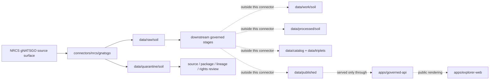

<!-- [KFM_META_BLOCK_V2]
doc_id: kfm://doc/connectors-nrcs-gnatsgo-readme
title: connectors/nrcs/gnatsgo/ — NRCS gNATSGO Connector Lane
type: readme
version: v0.1
status: draft
owners: OWNER_TBD — Source steward · Connector steward · NRCS steward · Soil steward · Agriculture steward · Hydrology steward · Data steward · Validation steward · Docs steward
created: 2026-06-19
updated: 2026-06-19
policy_label: public; gridded-soil-source; not-field-verification
related:
  - ../README.md
  - ../../../docs/doctrine/directory-rules.md
  - ../../../docs/sources/catalog/nrcs.md
  - ../../../docs/sources/catalog/nrcs/README.md
  - ../../../docs/sources/catalog/nrcs/gssurgo.md
  - ../../../docs/sources/catalog/nrcs/ssurgo.md
  - ../../../docs/sources/catalog/nrcs/web-soil-survey.md
  - ../../../pipelines/domains/soil/ssurgo_ingest/README.md
  - ../../../docs/domains/soil/README.md
  - ../../../docs/domains/agriculture/README.md
  - ../../../docs/domains/hydrology/README.md
  - ../../../data/registry/sources/
  - ../../../data/raw/
  - ../../../data/quarantine/
  - ../../../data/receipts/
  - ../../../data/proofs/
  - ../../../policy/rights/
  - ../../../policy/sensitivity/
  - ../../../release/
tags: [kfm, connectors, nrcs, gnatsgo, gnatssgo, gssurgo, ssurgo, soil-survey, gridded-soil, national-soil, soil, agriculture, hydrology, map-unit, mukey, source-admission, raw, quarantine, governance]
notes:
  - "Nested connector lane for NRCS gNATSGO source intake and admission helpers under the canonical connectors/nrcs/ family."
  - "This README defines a connector/source-admission boundary, not source-family truth, product doctrine, Soil domain truth, or public release."
  - "The gNATSGO product-page path is referenced from docs/sources/catalog/nrcs/gssurgo.md, but docs/sources/catalog/nrcs/gnatsgo.md was not found in this session; product doctrine remains NEEDS VERIFICATION."
  - "Connector output may enter raw or quarantine admission lanes only."
  - "gNATSGO must not be collapsed with SSURGO, gSSURGO, STATSGO2, Soil Data Access, SoilGrids, SMAP, or field observations."
  - "Native grid, resolution, CRS, package vintage, source URL, digest, MUKEY or product-native join fields, and derivative/generalization caveats must be preserved."
[/KFM_META_BLOCK_V2] -->

<a id="top"></a>

# NRCS gNATSGO Connector

> Nested source-specific intake and admission lane for NRCS gNATSGO gridded/national soil source material under the canonical `connectors/nrcs/` connector family.

<p>
  
  
  
  
  
  
</p>

`connectors/nrcs/gnatsgo/`

## Quick jumps

[Scope](#scope) · [Repo fit](#repo-fit) · [Relationship to NRCS soil products](#relationship-to-nrcs-soil-products) · [Lifecycle sketch](#lifecycle-sketch) · [Authority boundary](#authority-boundary) · [Inputs](#inputs) · [Exclusions](#exclusions) · [Admission posture](#admission-posture) · [Anti-collapse posture](#anti-collapse-posture) · [Validation](#validation) · [Definition of done](#definition-of-done)

---

## Scope

`connectors/nrcs/gnatsgo/` is a nested product-specific connector lane for NRCS gNATSGO source intake and admission helpers.

This folder may contain connector-local documentation, source-admission helpers, product manifest builders, package download helpers, raster/package metadata parsers, checksum/digest helpers, no-network fixture pointers, and raw/quarantine output adapters for gNATSGO source material.

It must not become NRCS source-family truth, gNATSGO product doctrine, Soil domain doctrine, SSURGO normalization, parcel truth, field verification, crop/yield truth, hydrology truth, conservation-compliance authority, engineering design authority, regulatory determination authority, policy authority, schema authority, catalog/triplet authority, proof authority, release authority, pipeline authority, public API behavior, or public UI behavior.

> [!IMPORTANT]
> **Status:** draft / `NEEDS VERIFICATION`  
> **Owner:** `OWNER_TBD`  
> **Path:** `connectors/nrcs/gnatsgo/`  
> **Truth posture:** the path exists in the repository as this README; source activation, endpoint behavior, product package handling, tests, fixtures, CI wiring, rights status, parser behavior, checksum handling, gNATSGO product-page doctrine, and release behavior remain `NEEDS VERIFICATION`.

---

## Repo fit

```text
connectors/
└── nrcs/
    ├── README.md
    └── gnatsgo/
        └── README.md
```

Related responsibility roots:

```text
connectors/nrcs/                         # canonical NRCS connector-family lane
connectors/nrcs/gnatsgo/                 # nested gNATSGO connector lane
docs/sources/catalog/nrcs.md             # NRCS source-family profile
docs/sources/catalog/nrcs/               # NRCS source-family/product docs when present
docs/sources/catalog/nrcs/gssurgo.md     # gSSURGO page that references gNATSGO as sibling/counterpart
docs/sources/catalog/nrcs/gnatsgo.md     # PROPOSED / not found in this session; product doctrine needs verification
pipelines/domains/soil/                  # downstream executable soil pipelines, not connector-owned
docs/domains/soil/                       # soil domain meaning and lifecycle context
docs/domains/agriculture/                # agricultural suitability context
docs/domains/hydrology/                  # drainage, runoff, hydric soils, and water-context interpretation
data/registry/sources/                   # source descriptors and activation state
data/raw/soil/                           # raw staged source package outputs
data/quarantine/soil/                    # held material requiring source/role/rights/lineage review
data/receipts/                           # ingest, checksum, package, transform, and aggregation receipts
data/proofs/                             # EvidenceBundles and proof packs
policy/rights/                           # terms, attribution, and source-use review
policy/sensitivity/                      # parcel-like, ecology, cultural, and release rules
release/                                 # release decisions, manifests, rollback, correction state
apps/governed-api/                       # downstream public trust membrane, not connector-owned
apps/explorer-web/                       # downstream map UI, never direct RAW/QUARANTINE access
```

---

## Relationship to NRCS soil products

The NRCS connector family is multi-product. This lane exists under the canonical NRCS family and must keep gNATSGO separate from related soil products.

| Product lane | Relationship | Connector posture |
|---|---|---|
| SSURGO | Source soil survey spatial/tabular product. | Do not treat gNATSGO as a full-fidelity replacement for SSURGO tables or component/horizon joins. |
| gSSURGO | Gridded SSURGO product referenced in repo docs as a sibling of gNATSGO. | Preserve product identity, native grid, resolution, CRS, and derivative/generalization caveats separately. |
| gNATSGO | National-scale gridded counterpart referenced by repo gSSURGO docs. | This lane is draft until product doctrine, source descriptor, rights, endpoint, and package structure are verified. |
| STATSGO2 | Broad regional context product. | Do not collapse gNATSGO with STATSGO2 or use either as parcel-scale proof. |
| Soil Data Access | Query-backed soil attributes. | Do not replace receipted SDA query results with gNATSGO package fields without explicit source-role and lineage decisions. |
| Web Soil Survey | Human-facing AOI/session surface with open disposition in repo docs. | Do not use WSS session exports as silent gNATSGO source truth. |
| SoilGrids / SMAP / station observations | Non-NRCS or observation/model products in the broader soil stack. | Do not resample or compare as equivalent without downstream model/transform receipts. |

---

## Lifecycle sketch



> [!CAUTION]
> Connector code admits source packages. It does not normalize soil records into domain truth, publish map layers, answer public claims, decide policy, or decide release state. Promotion remains a governed state transition, not a file move.

---

## Authority boundary

```text
OUTPUT LIMIT:
  data/raw/soil/<source_id>/<run_id>/
  data/quarantine/soil/<source_id>/<run_id>/

NOT HERE:
  NRCS source-family truth
  gNATSGO product doctrine
  Soil domain object meaning
  executable normalization pipeline
  parcel ownership or tax truth
  field verification
  crop/yield truth
  hydrology truth
  engineering design truth
  conservation-compliance authority
  regulatory determination authority
  source descriptor authority
  rights or sensitivity policy
  processed soil records
  catalog records
  triplet records
  public tiles or map artifacts
  receipts/proofs as authority
  release decisions
  published artifacts
  public API behavior
  public UI behavior
```

---

## Inputs

| Accepted item | Required posture |
|---|---|
| Product manifest helper | Preserve product name, source URL, package date, file names, size, compression, checksum, and retrieval time. |
| Package download helper | Preserve source URL, response status, file identity, compression, and content digest. |
| Raster/package metadata helper | Preserve native CRS, native resolution, grid extent, nodata values, raster band identity, and package metadata. |
| Attribute/join helper | Preserve product-native join keys, MUKEY if present, attribute table identity, and source-table relationship context. |
| Metadata parser | Preserve product documentation links, package version, source vintage, and product structure assumptions. |
| Lineage helper | Preserve relationship to SSURGO, gSSURGO, STATSGO2, and any generalized/filled national soil mapping inputs where documented. |
| Rights/citation helper | Preserve source terms, citation, attribution posture, and review status. |
| Test references | Point to owning fixture/test roots; fixtures do not become source authority. |

---

## Exclusions

| Do not store here | Correct home |
|---|---|
| NRCS source-family doctrine | `docs/sources/catalog/nrcs.md` and `docs/sources/catalog/nrcs/` |
| gNATSGO product doctrine | `docs/sources/catalog/nrcs/gnatsgo.md` if created and accepted |
| SSURGO, gSSURGO, or gNATSGO normalization logic | `pipelines/domains/soil/` or accepted pipeline home |
| Authoritative `SourceDescriptor` records | `data/registry/sources/` |
| Soil, Agriculture, or Hydrology doctrine | `docs/domains/` under owning domain lanes |
| Rights, sensitivity, or release policy | `policy/`, `policy/sensitivity/`, `release/` |
| Processed soil records or derived rollups | `data/processed/` |
| Catalog or triplet records | `data/catalog/`, `data/triplets/` |
| Public map artifacts | `data/published/` after governed release |
| Receipts and proof packs as authority | `data/receipts/`, `data/proofs/` |
| Schemas or semantic contracts | `schemas/`, `contracts/` |
| Generated reports | `artifacts/` |
| Public UI or API behavior | `apps/governed-api/`, `apps/explorer-web/` |

---

## Admission posture

gNATSGO intake should preserve:

- source identity and source surface;
- source descriptor reference and source activation state;
- product name, package date, package vintage, and source URL;
- package files, compression, file identity, size, checksum, and retrieval time;
- raster layer names, CRS, native resolution, grid extent, nodata values, and band identity;
- product-native join keys, MUKEY where present, attribute table names, field names, encoding, and row counts when available;
- relationship to SSURGO, gSSURGO, STATSGO2, and any generalized/filled national soil mapping inputs where documented;
- scale, resolution, intended-use caveats, and source documentation references;
- rights/citation/attribution posture;
- domain-lane routing hint such as soil, agriculture, or hydrology;
- sensitivity limitation notes for parcel-like, ecology, cultural, or precise-location use cases;
- quarantine reason when review is required.

---

## Anti-collapse posture

gNATSGO has high-risk interpretation boundaries. Keep them visible at connector admission time.

| Rule | Connector implication |
|---|---|
| Product package is not processed soil truth. | Admit source packages only; domain normalization belongs downstream. |
| National grid is not parcel truth. | Do not imply ownership, tax, access, zoning, or legal boundary truth. |
| Grid cell is not field verification. | Do not treat a cell as proof of current observed condition at a point. |
| Resolution matters. | Preserve native resolution, CRS, and intended-use caveats; do not silently resample. |
| gNATSGO is not gSSURGO. | Preserve product identity and do not collapse national-scale and statewide gridded products. |
| gNATSGO is not SSURGO full fidelity. | Do not replace component/horizon table fidelity without explicit lineage and downstream gates. |
| Soil interpretation is not regulatory determination. | Farmland, hydric, limitation, or engineering ratings need proper context and downstream gates. |
| Public display is downstream. | The connector must not build public tiles, UI layers, soil claims, compliance claims, or release payloads. |

---

## Validation

Before relying on this connector, verify:

- the nested path is intentional and documented by ADR, migration note, or updated Directory Rules;
- a gNATSGO product-page document exists or is intentionally created under `docs/sources/catalog/nrcs/`;
- source descriptors exist and are active for gNATSGO source surfaces;
- NRCS rights, citation, attribution, endpoint, and distribution posture are captured in source descriptors;
- current package download behavior, product inventory, file formats, metadata links, table names, raster bands, CRS, native resolution, and relationship files are re-verified;
- package digests and source-vintage handling are implemented;
- parsers preserve product identity, native grid, relationship keys, row counts, scale caveats, and source vintage;
- product is not silently resampled or compared with gSSURGO, SoilGrids, SMAP, or station observations without downstream receipts;
- output paths are limited to raw/quarantine admission lanes;
- downstream receipts, proofs, catalog/triplet records, public map artifacts, and release records are produced only outside this connector;
- public products are released only through governed publication controls and never as field verification, parcel truth, compliance truth, or regulatory truth without separate evidence.

---

## Definition of done

- [ ] Owners are confirmed and `OWNER_TBD` is replaced.
- [ ] Nested placement is ratified or recorded in the drift/open-question register.
- [ ] Actual connector contents are inventoried.
- [ ] gNATSGO source-product doctrine exists and is linked, or its absence is recorded as an open documentation task.
- [ ] NRCS gNATSGO `SourceDescriptor` IDs and source-family activation are verified.
- [ ] NRCS rights, citation, attribution, source terms, endpoint, package, and product posture are documented.
- [ ] Manifest builders preserve source URL, product identity, package date, package vintage, file identity, size, compression, native CRS, native resolution, and digest.
- [ ] Parsers preserve raster layer identity, table names, relationship files, MUKEY or product-native join fields, row counts, scale caveats, and source documentation references.
- [ ] Tests prevent silent conversion of gNATSGO packages into parcel truth, field verification, crop/yield truth, hydrology truth, compliance determinations, engineering design truth, or public release.
- [ ] Outputs are verified to enter only raw or quarantine admission lanes.
- [ ] No source-family, domain, processed, catalog, triplet, published, release, schema, policy, proof, receipt, registry, fixture, report, API, UI, tile, parcel, compliance, or regulatory authority lives here.
- [ ] Tests, fixtures, and CI behavior are verified or marked `NEEDS VERIFICATION`.

---

## Status summary

`connectors/nrcs/gnatsgo/` is for NRCS gNATSGO source-admission code only. It is not source-family truth, gNATSGO product doctrine, Soil domain truth, parcel truth, field verification, crop/yield truth, hydrology truth, engineering design truth, conservation-compliance authority, regulatory authority, policy authority, schema authority, catalog/triplet authority, proof closure, release authority, public map authority, public API behavior, public UI behavior, or pipeline authority.

<p align="right"><a href="#top">Back to top</a></p>
