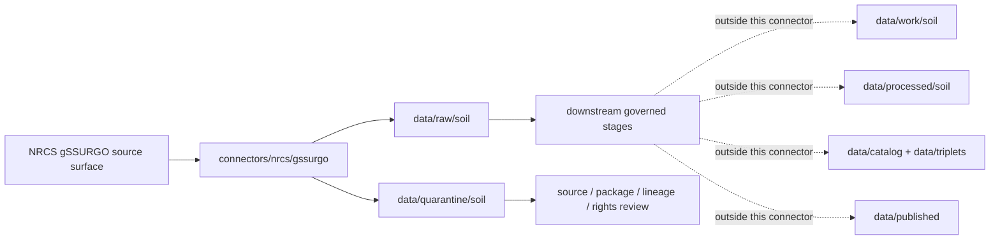

<!-- [KFM_META_BLOCK_V2]
doc_id: kfm://doc/connectors-nrcs-gssurgo-readme
title: connectors/nrcs/gssurgo/ — NRCS gSSURGO Connector Lane
type: readme
version: v0.1
status: draft
owners: OWNER_TBD — Source steward · Connector steward · NRCS steward · Soil steward · Agriculture steward · Hydrology steward · Data steward · Validation steward · Docs steward
created: 2026-06-19
updated: 2026-06-19
policy_label: public; gridded-soil-source; not-field-verification
related:
  - ../README.md
  - ../../../docs/doctrine/directory-rules.md
  - ../../../docs/sources/catalog/nrcs.md
  - ../../../docs/sources/catalog/nrcs/README.md
  - ../../../docs/sources/catalog/nrcs/gssurgo.md
  - ../../../docs/sources/catalog/nrcs/ssurgo.md
  - ../../../connectors/nrcs/gnatsgo/README.md
  - ../../../connectors/nrcs-ssurgo/README.md
  - ../../../pipelines/domains/soil/ssurgo_ingest/README.md
  - ../../../docs/domains/soil/README.md
  - ../../../data/registry/sources/
  - ../../../data/raw/
  - ../../../data/quarantine/
  - ../../../data/receipts/
  - ../../../data/proofs/
  - ../../../policy/rights/
  - ../../../policy/sensitivity/
  - ../../../release/
tags: [kfm, connectors, nrcs, gssurgo, ssurgo, gnatsgo, soil-survey, gridded-soil, raster, soil, agriculture, hydrology, map-unit, mukey, source-admission, raw, quarantine, governance]
notes:
  - "Nested connector lane for NRCS gSSURGO source intake and admission helpers under the canonical connectors/nrcs/ family."
  - "This README defines a connector/source-admission boundary, not source-family truth, product doctrine, Soil domain truth, or public release."
  - "Product doctrine exists at docs/sources/catalog/nrcs/gssurgo.md; source descriptors remain the authority for role, rights, cadence, sensitivity, and activation state."
  - "Connector output may enter raw or quarantine admission lanes only."
  - "gSSURGO is a gridded SSURGO derivative and must not be collapsed with SSURGO vector packages, gNATSGO, STATSGO2, Soil Data Access, SoilGrids, SMAP, SCAN, USCRN, or field observations."
[/KFM_META_BLOCK_V2] -->

<a id="top"></a>

# NRCS gSSURGO Connector

> Nested source-specific intake and admission lane for NRCS gSSURGO gridded soil-survey source material under the canonical `connectors/nrcs/` connector family.

<p>
  
  
  
  
  
  
</p>

`connectors/nrcs/gssurgo/`

## Scope

`connectors/nrcs/gssurgo/` is a nested product-specific connector lane for NRCS gSSURGO source intake and admission helpers.

This folder may contain connector-local documentation, source-admission helpers, product manifest builders, package download helpers, raster/package metadata parsers, checksum/digest helpers, no-network fixture pointers, and raw/quarantine output adapters for gSSURGO source material.

It must not become NRCS source-family truth, gSSURGO product doctrine, Soil domain doctrine, SSURGO normalization, field verification, crop/yield truth, hydrology truth, engineering design authority, regulatory determination authority, policy authority, schema authority, catalog/triplet authority, proof authority, release authority, pipeline authority, public API behavior, or public UI behavior.

> [!IMPORTANT]
> **Status:** draft / `NEEDS VERIFICATION`  
> **Owner:** `OWNER_TBD`  
> **Path:** `connectors/nrcs/gssurgo/`  
> **Truth posture:** the path exists in the repository as this README; source activation, endpoint behavior, product package handling, tests, fixtures, CI wiring, rights status, parser behavior, checksum handling, and release behavior remain `NEEDS VERIFICATION`.

---

## Repo fit

```text
connectors/
└── nrcs/
    ├── README.md
    ├── gnatsgo/
    │   └── README.md
    └── gssurgo/
        └── README.md
```

Related responsibility roots:

```text
connectors/nrcs/                         # canonical NRCS connector-family lane
connectors/nrcs/gssurgo/                 # nested gSSURGO connector lane
docs/sources/catalog/nrcs/gssurgo.md     # gSSURGO product doctrine and source-role caveats
docs/sources/catalog/nrcs/ssurgo.md      # vector/static SSURGO counterpart
connectors/nrcs/gnatsgo/                 # nested gNATSGO connector lane
pipelines/domains/soil/                  # downstream executable soil pipelines, not connector-owned
data/registry/sources/                   # source descriptors and activation state
data/raw/soil/                           # raw staged source package outputs
data/quarantine/soil/                    # held material requiring source/role/rights/lineage review
data/receipts/                           # ingest, checksum, package, transform, and aggregation receipts
data/proofs/                             # EvidenceBundles and proof packs
policy/rights/                           # terms, attribution, and source-use review
policy/sensitivity/                      # release and sensitivity review rules
release/                                 # release decisions, manifests, rollback, correction state
```

---

## Relationship to NRCS soil products

| Product lane | Relationship | Connector posture |
|---|---|---|
| SSURGO | Vector/static soil survey source packages and tabular source of record. | gSSURGO joins back to SSURGO tabular attributes by `MUKEY`; do not replace component/horizon fidelity without downstream lineage checks. |
| gSSURGO | Gridded raster form of SSURGO map-unit mapping. | Preserve product identity, native grid, resolution, CRS, MUKEY, source vintage, and SoilTimeCaveat. |
| gNATSGO | National-scale gridded counterpart referenced by repo gSSURGO docs. | Preserve separate source descriptors and product caveats. |
| Soil Data Access | Query-backed soil attributes and cross-check surface. | Preserve query receipts separately; do not silently replace SDA result lineage with gSSURGO package fields. |
| SoilGrids / SMAP / SCAN / USCRN | Non-gSSURGO soil-grid, model, remote-sensing, or station-observation products. | Do not resample or compare as equivalent without downstream model/transform receipts. |

---

## Lifecycle sketch



> [!CAUTION]
> Connector code admits source packages. It does not normalize soil records into domain truth, publish map layers, answer public claims, decide policy, or decide release state. Promotion remains a governed state transition, not a file move.

---

## Authority boundary

```text
OUTPUT LIMIT:
  data/raw/soil/<source_id>/<run_id>/
  data/quarantine/soil/<source_id>/<run_id>/

NOT HERE:
  NRCS source-family truth
  gSSURGO product doctrine
  Soil domain object meaning
  executable normalization pipeline
  field verification
  crop/yield truth
  hydrology truth
  engineering design truth
  regulatory determination authority
  source descriptor authority
  rights or sensitivity policy
  processed soil records
  catalog records
  triplet records
  public map artifacts
  receipts/proofs as authority
  release decisions
  public API behavior
  public UI behavior
```

---

## Inputs

| Accepted item | Required posture |
|---|---|
| Product manifest helper | Preserve product name, source URL, package date, file names, size, compression, checksum, and retrieval time. |
| Package download helper | Preserve source URL, response status, file identity, compression, and content digest. |
| Raster/package metadata helper | Preserve native CRS, native resolution, grid extent, nodata values, raster band identity, and package metadata. |
| Attribute/join helper | Preserve MUKEY, map-unit symbol, attribute table identity, source-table relationship context, and join assumptions. |
| Metadata parser | Preserve product documentation links, package version, source vintage, and product structure assumptions. |
| SoilTimeCaveat helper | Preserve source-survey vintage and warn when cells inherit survey vintages that differ across areas. |
| Rights/citation helper | Preserve source terms, citation, attribution posture, and review status. |

---

## Exclusions

| Do not store here | Correct home |
|---|---|
| NRCS source-family doctrine | `docs/sources/catalog/nrcs.md` and `docs/sources/catalog/nrcs/` |
| gSSURGO product doctrine | `docs/sources/catalog/nrcs/gssurgo.md` |
| SSURGO, gSSURGO, or gNATSGO normalization logic | `pipelines/domains/soil/` or accepted pipeline home |
| Authoritative `SourceDescriptor` records | `data/registry/sources/` |
| Rights, sensitivity, or release policy | `policy/`, `policy/sensitivity/`, `release/` |
| Processed soil records or derived rollups | `data/processed/` |
| Catalog or triplet records | `data/catalog/`, `data/triplets/` |
| Public map artifacts | `data/published/` after governed release |
| Receipts and proof packs as authority | `data/receipts/`, `data/proofs/` |
| Schemas or semantic contracts | `schemas/`, `contracts/` |
| Public UI or API behavior | `apps/governed-api/`, `apps/explorer-web/` |

---

## Admission posture

gSSURGO intake should preserve source identity, source descriptor reference, product name, package date, package vintage, source URL, package files, checksum, retrieval time, raster layer names, CRS, native resolution, grid extent, nodata values, band identity, MUKEY, map-unit symbol where present, table names, field names, row counts when available, relationship to SSURGO source-survey mapping, SoilTimeCaveat, scale and intended-use caveats, rights/citation posture, and quarantine reason when review is required.

---

## Anti-collapse posture

| Rule | Connector implication |
|---|---|
| Product package is not processed soil truth. | Admit source packages only; domain normalization belongs downstream. |
| Raster cell is not finer-than-survey observation. | Preserve that the grid carries SSURGO mapping precision, not sub-map-unit or field-observed detail. |
| Grid cell is not field verification. | Do not treat a cell as proof of current observed condition at a point. |
| Resolution matters. | Preserve native resolution, CRS, source-survey vintage, and intended-use caveats; do not silently resample. |
| gSSURGO is not SSURGO full fidelity. | Preserve MUKEY joins but do not replace component/horizon table fidelity without explicit lineage and downstream gates. |
| gSSURGO is not gNATSGO. | Preserve product identity and do not collapse statewide/gridded SSURGO and national-scale products. |
| gSSURGO is not soil moisture or soil condition. | Keep SCAN, SMAP, USCRN, Mesonet, and similar observations/models separate. |
| Public display is downstream. | The connector must not build public tiles, UI layers, soil claims, compliance claims, or release payloads. |

---

## Validation

Before relying on this connector, verify source descriptors, rights/citation posture, product endpoint behavior, package digests, parser behavior, CRS/native resolution handling, MUKEY preservation, no-network tests, raw/quarantine-only output paths, and downstream release gates.

---

## Definition of done

- [ ] Owners are confirmed and `OWNER_TBD` is replaced.
- [ ] Nested placement is ratified or recorded in the drift/open-question register.
- [ ] Actual connector contents are inventoried.
- [ ] NRCS gSSURGO `SourceDescriptor` IDs and source-family activation are verified.
- [ ] NRCS rights, citation, attribution, source terms, endpoint, package, and product posture are documented.
- [ ] Manifest builders preserve source URL, product identity, package date, package vintage, file identity, size, compression, native CRS, native resolution, and digest.
- [ ] Parsers preserve raster layer identity, table names, relationship files, MUKEY, map-unit symbol, row counts, SoilTimeCaveat, scale caveats, and source documentation references.
- [ ] Tests prevent silent conversion of gSSURGO packages into field verification, crop/yield truth, hydrology truth, engineering design truth, or public release.
- [ ] Outputs are verified to enter only raw or quarantine admission lanes.
- [ ] No source-family, domain, processed, catalog, triplet, published, release, schema, policy, proof, receipt, registry, fixture, report, API, UI, tile, compliance, or regulatory authority lives here.
- [ ] Tests, fixtures, and CI behavior are verified or marked `NEEDS VERIFICATION`.

---

## Status summary

`connectors/nrcs/gssurgo/` is for NRCS gSSURGO source-admission code only. It is not source-family truth, gSSURGO product doctrine, Soil domain truth, field verification, crop/yield truth, hydrology truth, engineering design truth, regulatory authority, policy authority, schema authority, catalog/triplet authority, proof closure, release authority, public map authority, public API behavior, public UI behavior, or pipeline authority.

<p align="right"><a href="#top">Back to top</a></p>
