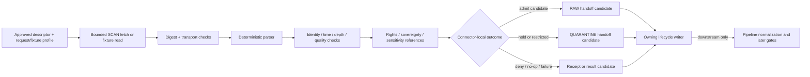

<!-- [KFM_META_BLOCK_V2]
doc_id: kfm://doc/connectors-nrcs-scan-nested-readme
title: connectors/nrcs/scan/ — NRCS SCAN Nested Source-Admission Boundary
type: readme
version: v0.2
status: draft; repository-grounded; nested-product-lane; implementation-placeholder; non-authoritative
owners: OWNER_TBD — Source steward · Connector steward · NRCS steward · Soil steward · Hydrology steward · Agriculture steward · Atmosphere/Climate steward · Tribal/sovereignty reviewer · Rights reviewer · Sensitivity reviewer · Security steward · Validation steward · Migration steward · CI steward · Docs steward
created: 2026-06-20
updated: 2026-07-15
supersedes: v0.1 planning-oriented nested connector guide (2026-06-20)
policy_label: "public-doctrine; connector-boundary; nested-product-lane; nrcs; scan; awdb; station-observation; depth-aware; cadence-aware; freshness-aware; tribal-review; placement-conflicted; source-inactive; no-network-by-default; raw-quarantine-only; descriptor-gated; rights-aware; sensitivity-aware; provenance-preserving; correction-aware; fixture-first; not-life-safety; no-publication; rollback-aware; no-secrets"
current_path: connectors/nrcs/scan/README.md
truth_posture: CONFIRMED target path and prior v0.1 README, canonical NRCS family README, connector-root contract, NRCS source-root/package/test README scaffolds, flat sibling SCAN v0.2 compatibility boundary, kfm-connector-nrcs 0.0.0 metadata, empty central package initializer, bounded absence of products/scan.py and SCAN-specific tests, NRCS SCAN product-page doctrine, minimal PROPOSED soil registry placeholder, empty PROPOSED source-authority register, draft downstream scan_awdb_ingest pipeline README, absent pipeline spec, and TODO-only connector-gate workflow / PROPOSED nested canonical-family candidate contract, explicit request/transport profiles, station-record preservation contract, finite connector-local outcomes, fixture taxonomy, product-specific tests, implementation sequence, migration plan, correction, deprecation, supersession, and rollback / CONFLICTED nested connectors/nrcs/scan versus flat connectors/nrcs-scan placement, observed source-role versus candidate watcher-role vocabulary, source registry and descriptor home references, SCAN versus Tribal SCAN release posture, and documentation-rich boundaries versus absent executable implementation / UNKNOWN accepted canonical path, active SourceDescriptor, approved endpoints, current response formats, station inventory, variables, units, depths, cadences, timezone and quality vocabularies, rights, executable parser behavior, fixtures, tests, CI enforcement, live retrieval, schedules, receipts, deployment, downstream consumers, and runtime health / NEEDS VERIFICATION accepted owners, placement ADR or migration note, compatibility classification, source identity and activation, rights and attribution, Tribal/sovereignty review rules, endpoint allowlist, report/query profile, network and retry policy, parser contracts, validators, fixture approval, test collection, CI gates, lifecycle routing, correction and supersession, deprecation, and rollback automation
evidence_snapshot:
  repository: bartytime4life/Kansas-Frontier-Matrix
  repository_id: "1059091169"
  visibility: public
  base_ref: main
  base_commit: 4ba3a0abec525a17955ff0175bdefc4455080c96
  prior_blob: 3e5b8e6bc980b8d3e1c1078a4dac4f121c1fa2d3
  nrcs_family_blob: 888236f218fc0892c54c947c0c2651b34ca5137b
  connector_root_blob: bdd50032bed62ac36964c79f16cf5541b21759a6
  nrcs_source_root_blob: 3b26759548ddaf52eb5b6de0e25dfa354e1d62ec
  nrcs_package_readme_blob: 3e022257cc553e8661b988e9e01c61cccc1fddc8
  nrcs_tests_blob: 7c65ba6ef85a8369e17c40d5e3fbc388b04a306b
  package_metadata_blob: c6bb1565db7df490bee52a597d04d694e2b9f8a4
  package_initializer_blob: e69de29bb2d1d6434b8b29ae775ad8c2e48c5391
  sibling_scan_blob: e4e5ffe1a64ec533f4ff15503270e7cd570432b6
  product_page_blob: e9460e920b2f58f154f6c8f1ac0ba38b17cafa15
  soil_registry_placeholder_blob: 8e9a441cd3adeac6c2a73b5f2f6e2a874ed13d8d
  source_authority_register_blob: 82c23722520922f5ca0dad7f37ed794d1c2edf81
  downstream_pipeline_readme_blob: 1915d19e0c283453a47227740cdfdf13544dbb5a
  connector_gate_workflow_blob: fc36ecced55bb0b4002d551cb28addfff0be918a
  source_admission_adr_blob: 0e8d03786bcc99b19f179680890df9e30a27633a
  bounded_path_checks:
    - connectors/nrcs/scan/README.md exists at v0.1 before this revision
    - connectors/nrcs-scan/README.md exists at v0.2 as a placement-conflicted sibling compatibility boundary
    - connectors/nrcs/src/nrcs/__init__.py is empty
    - connectors/nrcs/src/nrcs/products/scan.py was not found
    - connectors/nrcs/tests/test_scan.py was not found
    - connectors/nrcs/tests/test_scan_parser.py was not found
    - connectors/nrcs/pyproject.toml contains only project name and version 0.0.0
    - data/registry/sources/soil/nrcs-scan.yaml is a minimal PROPOSED placeholder
    - control_plane/source_authority_register.yaml is PROPOSED and entries is empty
    - pipelines/domains/soil/scan_awdb_ingest/README.md exists as a draft documentation-led pipeline boundary
    - pipeline_specs/soil/scan_awdb_ingest.yaml was not found
    - .github/workflows/connector-gate.yml contains TODO echo steps
related:
  - ../README.md
  - ../src/README.md
  - ../src/nrcs/README.md
  - ../tests/README.md
  - ../pyproject.toml
  - ../../nrcs-scan/README.md
  - ../../../docs/doctrine/directory-rules.md
  - ../../../docs/adr/ADR-0017-source-descriptor-admission-process.md
  - ../../../docs/sources/catalog/nrcs.md
  - ../../../docs/sources/catalog/nrcs/README.md
  - ../../../docs/sources/catalog/nrcs/scan-soil-climate.md
  - ../../../docs/domains/soil/README.md
  - ../../../docs/domains/hydrology/README.md
  - ../../../docs/domains/agriculture/README.md
  - ../../../docs/domains/atmosphere/README.md
  - ../../../control_plane/source_authority_register.yaml
  - ../../../data/registry/sources/soil/nrcs-scan.yaml
  - ../../../pipelines/domains/soil/scan_awdb_ingest/README.md
  - ../../../data/raw/
  - ../../../data/quarantine/
  - ../../../data/receipts/
  - ../../../data/proofs/
  - ../../../contracts/
  - ../../../schemas/
  - ../../../policy/rights/
  - ../../../policy/sensitivity/
  - ../../../release/
  - ../../../.github/workflows/connector-gate.yml
tags: [kfm, connectors, nrcs, scan, tribal-scan, awdb, nwcc, station-observation, soil-moisture, soil-temperature, depth-aware, cadence-aware, heartbeat-freshness, source-admission, raw, quarantine, provenance, no-network, fixture-first, anti-collapse, tribal-review, migration, correction, supersession, rollback]
notes:
  - "This revision changes only connectors/nrcs/scan/README.md."
  - "The nested path is a strong responsibility-root fit under the canonical connectors/nrcs/ family, but this README does not ratify migration or deprecate the flat sibling lane."
  - "The central NRCS package remains a 0.0.0 empty shell, and the proposed products/scan.py module and SCAN-specific tests were not found."
  - "The inspected SCAN registry record is a minimal inventory placeholder and the source-authority register has no entries; source activation is not established."
  - "The source product page uses observed record and candidate watcher vocabulary; the accepted descriptor and machine contracts must preserve that distinction."
  - "External details such as endpoints, station inventory, variables, units, sensor depths, cadences, timezone behavior, quality flags, rights, and attribution are version-sensitive and are not pinned here as implementation facts."
  - "A SCAN record remains source-, network-, station-, variable-, time-, cadence-, unit-, quality-, and where applicable depth-scoped. It is not area, soil-column, compliance, water-rights, forecast, alert, or management truth."
  - "Connector activity is limited to explicit source admission and RAW or QUARANTINE handoff."
[/KFM_META_BLOCK_V2] -->

<a id="top"></a>

# NRCS SCAN Nested Source-Admission Boundary

`connectors/nrcs/scan/`

> Repository-present nested boundary for candidate USDA NRCS Soil Climate Analysis Network source admission under the canonical NRCS connector family. Current evidence establishes a README-only lane—not an active source, approved endpoint profile, runnable connector, tested parser, validated station contract, or release-ready observation workflow.


**Quick links:** [Purpose](#purpose) · [Status](#status-and-evidence) · [Authority](#authority-boundary) · [Directory basis](#directory-rules-basis) · [Topology](#topology-and-compatibility) · [Context](#bounded-context) · [Invariants](#keystone-invariants) · [Inputs](#explicit-input-contract) · [Transport](#transport-and-security) · [Identity](#source-network-station-and-record-identity) · [Time](#time-cadence-freshness-and-vintage) · [Parsing](#parsing-and-preservation-contract) · [Quality](#quality-missingness-and-uncertainty) · [Depth](#sensor-depth-and-soil-variable-boundary) · [Tribal](#tribal-scan-rights-sovereignty-and-sensitivity) · [Admission](#source-admission-handoff) · [Outcomes](#connector-outcomes-and-reason-codes) · [Testing](#testing-and-fixtures) · [Pipeline](#watcher-pipeline-and-publication-separation) · [Implementation](#smallest-sound-implementation-sequence) · [Done](#definition-of-done) · [Open](#open-verification-register) · [Rollback](#rollback-correction-deprecation-and-supersession) · [Ledger](#evidence-ledger)

> [!IMPORTANT]
> **This README is not an activation, endpoint, or placement decision.** Path presence does not establish a canonical executable implementation, active SourceDescriptor, approved source surface, parser, fixtures, tests, receipts, schedule, CI enforcement, deployment, or publication readiness.

> [!CAUTION]
> **A SCAN station record is not an area claim or operational advisory.** A connector may preserve a station reading and its metadata. It may not silently interpolate, aggregate, substitute depths, collapse cadences, claim conservation compliance or water-rights status, issue management advice, or publish a public result.

---

<a id="purpose"></a>

## Purpose

This README defines the allowed source-edge boundary for candidate SCAN work under the established [`connectors/nrcs/`](../README.md) family root.

A future implementation associated with this nested lane may exist only after governance resolves the placement conflict and verifies:

1. the active SourceDescriptor and source/collection identity;
2. approved source surfaces, request profiles, rights, attribution, and rate posture;
3. SCAN versus Tribal SCAN network treatment;
4. station identity, variable, unit, depth, cadence, time, quality, missingness, freshness, and correction contracts;
5. no-network fixtures and deterministic parsers;
6. finite connector-local outcomes and reason codes;
7. RAW or QUARANTINE handoff only;
8. migration or compatibility treatment for [`connectors/nrcs-scan/`](../../nrcs-scan/README.md);
9. tests and substantive CI enforcement;
10. correction, deprecation, supersession, and rollback behavior.

Any allowed implementation must remain:

- subordinate to the `connectors/` source-admission responsibility root;
- subordinate to the NRCS family boundary;
- descriptor-gated and source-activation-aware;
- no-network by default;
- fixture-first and deterministic;
- explicit about approved source locators and request/report profiles;
- bounded in timeouts, retries, redirects, pagination, payload size, archive handling, and decompression;
- lossless about source, network, station, report/query, record, variable, time, cadence, units, quality, missingness, depth, freshness, and correction context;
- rights-, sovereignty-, and sensitivity-aware without becoming policy authority;
- limited to RAW or QUARANTINE admission candidates;
- separate from normalization, aggregation, modeling, evidence closure, release, public API, UI, map, notification, and AI behavior.

It must not become:

- an NRCS or SCAN doctrine home;
- a SourceDescriptor or authority register;
- an endpoint catalog embedded in prose;
- a watcher or scheduler authority;
- a Soil, Hydrology, Agriculture, or Atmosphere truth resolver;
- a compliance, water-rights, drought, forecast, alert, or management-advice service;
- an evidence, policy, proof, release, or publication system;
- a public API, UI, map, search, notification, or generated-answer surface.

[Back to top](#top)

---

<a id="status-and-evidence"></a>

## Status and evidence

### Current repository state

| Surface | Status | Safe conclusion |
|---|---:|---|
| `connectors/nrcs/scan/README.md` | **CONFIRMED v0.1 before this revision** | The nested documentation boundary exists. |
| [`connectors/nrcs/README.md`](../README.md) | **CONFIRMED v0.1** | `connectors/nrcs/` is documented as the canonical NRCS family spine and SCAN placement remains unresolved. |
| [`connectors/README.md`](../../README.md) | **CONFIRMED v0.3** | Connectors are source-admission implementation and may hand off RAW, QUARANTINE, and receipts only. |
| [`connectors/nrcs-scan/README.md`](../../nrcs-scan/README.md) | **CONFIRMED v0.2** | A flat sibling compatibility boundary also exists; it does not ratify placement. |
| [`connectors/nrcs/src/README.md`](../src/README.md) | **CONFIRMED v0.1** | A central NRCS source-root boundary exists. |
| [`connectors/nrcs/src/nrcs/README.md`](../src/nrcs/README.md) | **CONFIRMED v0.1** | A proposed central Python package boundary exists. |
| [`connectors/nrcs/pyproject.toml`](../pyproject.toml) | **CONFIRMED minimal placeholder** | It declares `kfm-connector-nrcs` version `0.0.0` only. |
| `connectors/nrcs/src/nrcs/__init__.py` | **CONFIRMED empty** | Import marker only; no public implementation is established. |
| `connectors/nrcs/src/nrcs/products/scan.py` | **NOT FOUND in bounded check** | The proposed central SCAN parser module is not established. |
| `connectors/nrcs/tests/test_scan.py` | **NOT FOUND in bounded check** | Product-specific tests are not established at that path. |
| `connectors/nrcs/tests/test_scan_parser.py` | **NOT FOUND in bounded check** | Parser tests are not established at that path. |
| [`connectors/nrcs/tests/README.md`](../tests/README.md) | **CONFIRMED v0.1** | Test doctrine exists, but executable test inventory is not proven. |
| [`docs/sources/catalog/nrcs/scan-soil-climate.md`](../../../docs/sources/catalog/nrcs/scan-soil-climate.md) | **CONFIRMED draft v0.2** | Human source-product doctrine exists and marks the source pre-activation. |
| [`data/registry/sources/soil/nrcs-scan.yaml`](../../../data/registry/sources/soil/nrcs-scan.yaml) | **CONFIRMED minimal PROPOSED placeholder** | It is not an admitted SourceDescriptor. |
| [`control_plane/source_authority_register.yaml`](../../../control_plane/source_authority_register.yaml) | **CONFIRMED PROPOSED and empty** | No source-authority entry establishes SCAN activation. |
| [`pipelines/domains/soil/scan_awdb_ingest/README.md`](../../../pipelines/domains/soil/scan_awdb_ingest/README.md) | **CONFIRMED draft README** | A downstream executable boundary is documented; implementation remains unproven. |
| `pipeline_specs/soil/scan_awdb_ingest.yaml` | **NOT FOUND in bounded check** | No declarative pipeline spec is established at that path. |
| [`.github/workflows/connector-gate.yml`](../../../.github/workflows/connector-gate.yml) | **CONFIRMED TODO-only workflow** | Workflow execution does not prove connector behavior. |

### Truth summary

| Label | Current statement |
|---|---|
| **CONFIRMED** | Both nested and flat README boundaries exist; the NRCS family/source/test scaffolds exist; project metadata is `0.0.0`; the initializer is empty; the registry and authority register do not establish activation; the downstream pipeline is documentation-led; connector CI is TODO-only. |
| **PROPOSED** | Nested-lane source-admission contract, request/transport profiles, parser interfaces, reason codes, fixtures, tests, migration sequence, and rollback design in this README. |
| **CONFLICTED** | Nested versus flat placement; observed record role versus candidate watcher role; source registry/descriptor references; Tribal SCAN release posture; documentation richness versus implementation absence. |
| **UNKNOWN** | Active endpoint behavior, station inventory, variables, units, sensor depths, cadences, timezone behavior, quality flags, rights, live retrieval, schedules, consumers, runtime health, and deployment. |
| **NEEDS VERIFICATION** | Owners, accepted path, descriptor identity, activation, rights, attribution, endpoint allowlist, request profile, schemas, parser, fixtures, tests, CI, receipts, correction, and rollback automation. |

[Back to top](#top)

---

<a id="authority-boundary"></a>

## Authority boundary

This lane may prepare source-admission candidates. It has no authority over source truth, domain truth, evidence closure, policy, release, publication, or public behavior.

| Concern | Authority here |
|---|---|
| Approved source identity | **None.** SourceDescriptor, authority register, and activation decision own it. |
| Current endpoint and request profile | **None until accepted.** Connector configuration may consume a pinned profile. |
| Source role | **None.** Accepted descriptor and contracts own role. |
| Rights, attribution, and allowed use | **None.** Rights assessment and policy own decisions. |
| Tribal/sovereignty and sensitivity posture | **None.** Policy and designated reviewers own decisions. |
| Station observation parsing | **Supporting only.** A future parser may preserve source fields and return issues. |
| Station aggregation or interpolation | **None.** Downstream pipelines and receipts own derivatives. |
| Evidence closure | **None.** EvidenceBundle workflows own closure. |
| Release and publication | **None.** Release records, reviews, correction, and rollback own publication state. |
| Public map, API, UI, alerts, or advice | **None.** Governed downstream interfaces own public behavior. |

```text
ALLOWED OUTPUT CLASSES
  admission candidate for data/raw/<domain>/<source_id>/<run_id>/
  quarantine candidate for data/quarantine/<domain>/<source_id>/<run_id>/
  connector-local no-op / deny / failure / rate-limit result
  receipt candidate or receipt handoff metadata

FORBIDDEN OUTPUT CLASSES
  data/work or data/processed records
  catalog or triplet assertions
  EvidenceBundle closure
  release decisions or manifests
  published layers, tiles, alerts, advisories, or public claims
  direct API, UI, map, notification, or generated-answer output
```

Connector success means only that a bounded source interaction or fixture parse completed under the supplied profile. It does not mean that a record is current, correct, representative, rights-cleared, policy-cleared, evidence-closed, or publishable.

[Back to top](#top)

---

<a id="directory-rules-basis"></a>

## Directory Rules basis

The target remains in the existing `connectors/` responsibility root because its primary responsibility is source-specific fetch and admission support.

| Responsibility | Owning root | Rule for this lane |
|---|---|---|
| Source-specific fetch, probe, parse, and admission support | `connectors/` | May live here after descriptor, rights, sensitivity, and placement review. |
| NRCS source-family and SCAN product doctrine | `docs/sources/catalog/` | Referenced, not duplicated. |
| SourceDescriptor and activation state | `data/registry/sources/` plus accepted authority/decision homes | Consumed by reference; never authored here. |
| Rights and sensitivity decisions | `policy/rights/`, `policy/sensitivity/` | Fail closed when unresolved. |
| Meaning and machine shape | `contracts/`, `schemas/` | Connector code must be profile-pinned; no parallel schema home. |
| Executable normalization | `pipelines/` | SCAN/AWDB Soil normalization remains downstream. |
| Lifecycle data | `data/<phase>/` | Connector may prepare RAW/QUARANTINE handoffs only. |
| Receipts and proofs | `data/receipts/`, `data/proofs/` | Connector supplies receipt inputs; these homes retain audit authority. |
| Release, corrections, and rollback | `release/` and accepted correction homes | Connector cannot approve public state. |
| Public API and UI | governed app/UI roots | Public clients never call connector internals as authority. |

### Placement test

A file may belong in this lane only when its primary responsibility is SCAN-specific source-edge admission and it remains subordinate to the central NRCS implementation boundary.

Do not place here:

- domain normalization;
- station interpolation or gridding;
- soil-moisture fusion;
- drought or crop advice;
- source descriptors;
- policy rules;
- schemas or semantic contracts;
- lifecycle datasets;
- proofs, release manifests, public APIs, UI components, or map styles.

[Back to top](#top)

---

<a id="topology-and-compatibility"></a>

## Topology and compatibility

The repository currently contains two SCAN documentation lanes:

| Path | Evidence status | Safe posture |
|---|---:|---|
| `connectors/nrcs/scan/` | **CONFIRMED nested README lane** | Strong responsibility-root fit under the canonical NRCS family; candidate future product boundary. |
| `connectors/nrcs-scan/` | **CONFIRMED flat sibling README lane** | Placement-conflicted compatibility boundary; do not add a second implementation by default. |

### Freeze-by-default rule

Until an accepted ADR or migration note resolves placement:

- do not create separate live clients in both lanes;
- do not create duplicate SourceDescriptors, endpoint profiles, fixtures, parsers, tests, schedules, or receipts;
- do not move, delete, rename, redirect, or deprecate either path silently;
- route any executable implementation through one reviewed ownership point;
- use adapters only when they preserve one implementation and one source identity;
- record the rollback target before changing topology.

### Preferred direction — PROPOSED

Because `connectors/nrcs/` is documented as the NRCS family spine, the smallest coherent future direction is:

```text
connectors/nrcs/scan/                 # product boundary and docs
connectors/nrcs/src/nrcs/products/scan.py  # central implementation, if admitted
connectors/nrcs/tests/test_scan*.py   # central product tests, if admitted
connectors/nrcs-scan/                 # temporary compatibility/docs lane or retired by accepted migration
```

This is a **PROPOSED direction**, not an implementation fact. An accepted migration decision must state:

- canonical path;
- compatibility period;
- import and file redirects, if any;
- descriptor and schedule ownership;
- receipt continuity;
- deprecation notice;
- rollback target;
- deletion conditions.

[Back to top](#top)

---

<a id="bounded-context"></a>

## Bounded context

This lane is bounded to SCAN source admission.

### Ubiquitous language

| Term | Meaning here |
|---|---|
| **Source surface** | An approved, descriptor-pinned external SCAN/AWDB report, API, file, or equivalent acquisition surface. |
| **Request profile** | Accepted endpoint family, method, parameters, format, timeout, retry, redirect, and pagination limits. |
| **Station** | Source-native observation location identified by network and station identifier. |
| **Observation record** | One source-scoped variable value at one station, time, cadence, unit, quality state, and where applicable depth. |
| **Watcher signal** | Pre-RAW candidate indicating source activity or staleness; never an observed record or publication. |
| **Observed record** | A record admitted under an accepted descriptor with preserved source context. |
| **Depth** | Sensor position or source depth dimension; not interchangeable across sensors or records. |
| **Cadence** | Source/report temporal granularity or aggregation duration; not a cosmetic label. |
| **Freshness** | Relationship between observation/report time, retrieval time, expected heartbeat, and accepted tolerance. |
| **Quality flag** | Source-native or accepted mapped indicator; absence or ambiguity may require quarantine. |
| **Missingness** | Source-native missing code, null semantics, no-report condition, or parse absence; never silently converted to zero. |
| **Tribal SCAN posture** | Explicit sovereignty, rights, sensitivity, attribution, and release review context. |
| **Admission candidate** | Connector-local candidate for RAW or QUARANTINE handoff; not a normalized domain record. |
| **Receipt candidate** | Deterministic metadata needed for an owning receipt writer; not evidence closure. |

### Explicit non-goals

This lane does not:

- define SCAN as a source;
- decide source activation;
- define station or observation object meaning;
- normalize records into Soil domain objects;
- calculate county, watershed, field, or raster conditions;
- issue forecasts, alerts, advisories, or management recommendations;
- determine conservation compliance or water rights;
- decide Tribal data release posture;
- publish or serve records.

[Back to top](#top)

---

<a id="keystone-invariants"></a>

## Keystone invariants

A conforming future implementation must preserve all of these invariants.

1. **Descriptor before live access.** No live fetch without an accepted source identity and activation state.
2. **Fixture before connector.** No live implementation before synthetic or approved no-network fixtures and negative tests.
3. **No network by default.** Import, unit tests, and ordinary local use must not contact external systems.
4. **One source identity.** Nested and flat lanes must not create parallel descriptor or endpoint authority.
5. **Watcher is not publisher.** Watcher output remains candidate evidence only.
6. **Station is not area.** No county, watershed, field, pixel, or regional truth without downstream method and receipts.
7. **Depth is semantic.** Depth-specific readings never collapse into a generic soil-column value.
8. **Cadence is semantic.** Hourly, daily, monthly, seasonal, annual, and custom-duration records remain distinct.
9. **Units are explicit.** No unit inference or conversion without accepted profile and receipt context.
10. **Time is explicit.** Observation, report-period, source-update, retrieval, parse, and processing times remain distinct.
11. **Quality is preserved.** Source flags and preliminary/final/corrected posture are not discarded.
12. **Missing is not zero.** Missing codes remain missing and are auditable.
13. **Freshness is bounded.** Near-current use requires an accepted heartbeat and tolerance profile.
14. **Network identity is preserved.** SCAN, Tribal SCAN, SNOTEL, USCRN, Mesonet, and other networks are never silently merged.
15. **Rights and sovereignty fail closed.** Unknown posture routes to quarantine or denial.
16. **RAW/QUARANTINE only.** Connector output does not skip lifecycle stages.
17. **Promotion is external.** No connector-local promotion, release, or publication.
18. **Evidence is external.** Connector receipts support later evidence; they are not EvidenceBundle closure.
19. **Finite outcomes.** All failures and holds map to stable connector-local result classes and reason codes.
20. **Reversible topology.** Any nested/flat migration has a documented compatibility and rollback path.

[Back to top](#top)

---

<a id="explicit-input-contract"></a>

## Explicit input contract

The examples below are **PROPOSED interface shapes**, not implemented types.

### Request profile

```yaml
source_descriptor_ref: kfm://source/nrcs.scan/<version>
activation_decision_ref: kfm://source-activation/<id>
network_profile: scan | tribal_scan | accepted_other
source_surface_id: <approved-profile-id>
request:
  method: GET
  locator_ref: <allowlisted-locator-reference>
  parameters:
    station_ids: [<source-native-id>]
    elements: [<source-native-element>]
    duration: <source-native-or-profile-value>
    begin: <timestamp-or-date>
    end: <timestamp-or-date>
    format: <accepted-format>
transport:
  network_enabled: false
  timeout_seconds: <bounded-positive-integer>
  max_retries: <bounded-nonnegative-integer>
  max_redirects: <bounded-nonnegative-integer>
  max_response_bytes: <bounded-positive-integer>
  rate_limit_profile_ref: <profile-ref>
rights_assessment_ref: <ref>
sensitivity_assessment_ref: <ref>
request_id: <deterministic-or-receiptable-id>
```

Requirements:

- caller supplies descriptor and activation references;
- caller selects an accepted source-surface profile;
- default `network_enabled` is false;
- raw URLs and secrets are not embedded in public logs or fixtures;
- request parameters remain visible and receiptable;
- station, variable, period, duration, and format are explicit;
- transport limits are finite;
- rights and sensitivity references are supplied, not decided by connector code.

### Fixture parse profile

```yaml
fixture_ref: fixtures://connectors/nrcs/scan/<fixture-id>
fixture_digest: sha256:<hex>
source_descriptor_ref: kfm://source/nrcs.scan/<version>
network_profile: scan | tribal_scan
format_profile: <accepted-parser-profile>
expected:
  outcome: parsed | quarantined | denied | failed | no_op
  record_count: <integer-or-range>
  reason_codes: [<stable-code>]
```

### Rejected implicit inputs

A conforming implementation must reject or quarantine:

- ambient credentials;
- hidden global endpoint configuration;
- unapproved URLs;
- station IDs inferred from filenames or UI state;
- missing network identity;
- ambiguous timezone;
- unknown unit semantics;
- depth inference from column order alone;
- values without quality/missingness context when required by profile;
- records supplied only as generated text or screenshots;
- requests that would bypass descriptor, rights, sensitivity, or rate limits.

[Back to top](#top)

---

<a id="transport-and-security"></a>

## Transport and security

### No-network default

Imports, unit tests, documentation builds, fixture parsing, and local validation must not perform live source access.

Live access, if admitted, requires all of:

- accepted SourceDescriptor;
- active source state allowing the requested use;
- accepted source-surface and request profile;
- explicit network opt-in;
- bounded timeout, retry, redirect, and payload policy;
- rate-limit behavior;
- rights and sensitivity references;
- receipt destination or receipt handoff;
- sanitized logging.

### Transport limits

| Risk | Required control |
|---|---|
| Endpoint drift | Profile-pinned locator identity and response-format check. |
| Redirect abuse | Small redirect limit; reject cross-profile destination drift. |
| Unbounded retry | Fixed retry count and backoff ceiling. |
| Rate limiting | Finite rate-limit outcome; no retry storm. |
| Oversized response | Maximum compressed and decoded byte limits. |
| Decompression bomb | Bounded expansion ratio and record count. |
| Pagination loop | Page/record ceiling and repeated-token detection. |
| Slow response | Connect/read/total timeout policy. |
| Secret leakage | Header/query/body redaction and structured safe logs. |
| Untrusted content | Parse as data; never execute source-provided code or templates. |
| HTML/error substitution | Content-type and parser-profile verification. |

### Logging posture

Logs may include:

- request ID;
- source/profile IDs;
- station-count and record-count summaries;
- retrieval and duration metrics;
- response status class;
- content digest;
- finite outcome and reason codes.

Logs must not include:

- credentials, cookies, tokens, or authorization headers;
- unrestricted raw query strings containing sensitive parameters;
- full sensitive station coordinates;
- protected Tribal context;
- full raw payloads;
- generated private explanations or chain-of-thought.

[Back to top](#top)

---

<a id="source-network-station-and-record-identity"></a>

## Source, network, station, and record identity

Identity must be deterministic where practical and preserve source-native identifiers.

### Identity layers

| Layer | Required dimensions |
|---|---|
| Source | Descriptor version, activation decision, source family, source product. |
| Source surface | Approved locator/profile ID, report/query profile, response format. |
| Network | SCAN, Tribal SCAN, or other accepted network identifier. |
| Station | Network + source-native station ID; aliases remain separate metadata. |
| Sensor | Station + source-native sensor/element identity + depth when applicable. |
| Observation | Station + variable/element + observation time + cadence/duration + depth + source revision. |
| Retrieval | Request profile + retrieval time + response digest. |
| Correction | Superseded record/ref + replacement record/ref + correction reason and time. |

### Station identity rules

- station name is not a stable identifier;
- station ID without network identity is incomplete;
- reused or retired station identifiers require temporal context;
- station aliases must not overwrite source-native IDs;
- latitude/longitude are metadata, not identity by themselves;
- location changes require explicit versioning or correction handling;
- Tribal SCAN classification is not inferred from station name alone;
- station status, start/end dates, and decommission context remain visible when supplied.

### Record identity candidate

```text
record_key = hash(
  source_descriptor_version,
  network_id,
  station_id,
  variable_id,
  depth_profile,
  observation_time,
  cadence_or_duration,
  source_revision_marker
)
```

The exact algorithm and canonicalization are **NEEDS VERIFICATION**. The invariant is that correction, duplicate detection, and supersession must not depend on mutable display names or retrieval order.

[Back to top](#top)

---

<a id="time-cadence-freshness-and-vintage"></a>

## Time, cadence, freshness, and vintage

SCAN records are time-sensitive. A conforming connector must keep distinct time kinds rather than flattening them into one timestamp.

| Time kind | Meaning |
|---|---|
| Observation time | Time associated with the measured value. |
| Report-period start/end | Window represented by an aggregate or report. |
| Source update time | Upstream publication or correction time, when available. |
| Retrieval time | When the connector obtained the response. |
| Parse time | When the payload was interpreted. |
| Processing time | Downstream normalization time; outside this connector. |
| Freshness evaluation time | Time against which the accepted heartbeat/tolerance is evaluated. |
| Correction/supersession time | Time a source revision or KFM correction became effective. |

### Cadence rules

- hourly is not daily;
- daily source aggregates are not equivalent to locally computed daily aggregates;
- monthly, seasonal, annual, and custom report durations remain distinct;
- source-native duration/function fields must be preserved;
- aggregation requires a downstream method and receipt;
- timezone and daylight-saving behavior require an accepted profile;
- naive timestamps are rejected or quarantined unless the profile supplies an unambiguous interpretation.

### Freshness rules

Freshness is profile-specific and must consider:

- expected observation/report cadence;
- station operational status;
- observation time;
- retrieval time;
- source update/correction markers;
- tolerated latency;
- missing intervals;
- preliminary/final posture.

A stale record may still be historically valid. Staleness blocks claims of current context; it does not automatically erase historical evidence.

### Proposed freshness outcomes

```text
CURRENT_WITHIN_PROFILE
STALE_HEARTBEAT
SOURCE_LAG_UNKNOWN
STATION_INACTIVE
TIMEZONE_AMBIGUOUS
REPORT_PERIOD_UNRESOLVED
CORRECTION_PENDING
```

These names are **PROPOSED** until an accepted contract establishes the vocabulary.

[Back to top](#top)

---

<a id="parsing-and-preservation-contract"></a>

## Parsing and preservation contract

A future parser must be deterministic for the same payload, parser profile, and configuration.

### Preserve when available

- source descriptor and activation references;
- source-surface/profile ID;
- request parameters and report/query identity;
- response status and content type;
- source payload digest;
- network identity;
- station ID and source-native station metadata;
- station status, start/end dates, and update markers;
- observation timestamp and timezone context;
- report period, cadence, duration, and function;
- source-native element/variable identifier;
- value type;
- raw value representation;
- parsed numeric or categorical value;
- source-native and accepted unit identity;
- sensor depth and depth unit where applicable;
- quality flags;
- missing-value code and semantics;
- preliminary/final/corrected posture where supplied;
- retrieval and parse times;
- rights, attribution, sensitivity, and Tribal review references;
- parser profile and version;
- warnings, errors, quarantine reasons, and correction links.

### Do not silently perform

- unit conversion;
- timezone conversion;
- depth normalization;
- station deduplication across networks;
- variable alias collapse;
- missing-code replacement;
- quality-flag removal;
- outlier deletion;
- interpolation;
- resampling;
- aggregation;
- correction selection;
- geospatial generalization;
- public-safe transformation.

Each transformation belongs in an accepted downstream process or explicit adapter with versioned rules and receipt context.

### Raw and parsed value separation

A safe record candidate retains both source representation and parsed representation:

```yaml
value:
  raw: "<source-token>"
  parsed: <number-string-null-or-categorical-value>
  source_unit: <source-unit-or-null>
  normalized_unit: <accepted-unit-or-null>
  conversion_ref: <transform-receipt-ref-or-null>
missingness:
  source_code: <source-code-or-null>
  class: present | missing | trace | invalid | censored | unknown
quality:
  source_flags: [<flag>]
  mapped_flags: [<accepted-flag>]
  mapping_profile_ref: <profile-ref-or-null>
```

A connector may populate normalized fields only when an accepted profile explicitly authorizes the mapping. Otherwise it preserves source fields and records an issue.

[Back to top](#top)

---

<a id="quality-missingness-and-uncertainty"></a>

## Quality, missingness, and uncertainty

### Quality posture

Source quality flags are evidence about a record; they are not optional decoration.

A future parser must distinguish:

- source flag absent;
- source flag present and recognized;
- source flag present but unmapped;
- record preliminary;
- record final;
- record corrected;
- source-declared invalid;
- locally unparsable;
- locally suspicious but source-valid.

Local suspicion does not authorize deleting or rewriting the source record. It may create a quarantine candidate or downstream validation issue.

### Missingness posture

Missingness must never be silently converted to:

- zero;
- previous value;
- interpolation;
- station mean;
- network mean;
- field/county/watershed value;
- generated estimate.

### Uncertainty posture

Connector-level uncertainty may include:

- ambiguous timezone;
- unknown depth unit;
- unrecognized variable;
- quality flag not mapped;
- missing report duration;
- uncertain station status;
- stale heartbeat;
- source correction pending;
- rights or Tribal review unresolved;
- source format drift;
- duplicate or conflicting record identity.

The connector records uncertainty and routes it. It does not resolve scientific, policy, or release uncertainty by fluent explanation.

[Back to top](#top)

---

<a id="sensor-depth-and-soil-variable-boundary"></a>

## Sensor depth and soil-variable boundary

Depth-aware variables require explicit depth context.

### Required distinctions

```text
soil moisture at depth A != soil moisture at depth B
soil temperature at depth A != soil temperature at depth B
source-reported profile value != KFM-computed profile aggregate
station reading != soil map unit property
station reading != satellite pixel
station reading != modeled root-zone estimate
```

### Depth profile candidate

```yaml
depth:
  source_value: <value-or-null>
  source_unit: <unit-or-null>
  reference: surface | sensor_installation | source_defined | unknown
  normalized_value: <value-or-null>
  normalized_unit: <unit-or-null>
  transform_ref: <ref-or-null>
```

Requirements:

- unknown depth remains unknown;
- depth text is preserved when numeric parsing fails;
- unit inference is denied by default;
- depth conversion requires an accepted profile and transform reference;
- records with required but missing depth route to quarantine or a finite hold outcome;
- cross-depth aggregation belongs downstream and requires a method and receipt.

### Variable identity

Source-native element codes, names, functions, value types, and units must remain visible. Aliases may be added, but they must not erase source identity.

Variables from ancillary climate observations may be admitted only under an accepted scope and must not silently become Soil-domain primary truth.

[Back to top](#top)

---

<a id="tribal-scan-rights-sovereignty-and-sensitivity"></a>

## Tribal SCAN, rights, sovereignty, and sensitivity

Tribal SCAN requires explicit review. This README does not define Tribal data policy or release rules.

### Fail-closed posture

When network, rights, sovereignty, attribution, station-location sensitivity, or audience permissions are unclear:

- do not infer ordinary public treatment;
- do not expose precise station coordinates through logs, fixtures, examples, errors, or public responses;
- do not substitute a generic SCAN profile;
- do not remove network identity;
- do not publish or link out automatically;
- route to QUARANTINE, restriction, or denial with a reason code;
- preserve reviewer and assessment references.

### Required review questions

1. Is the network classification verified from the accepted descriptor/profile?
2. What rights and attribution obligations apply to retrieval, storage, derivative use, and display?
3. Are station locations already public, and does KFM publication create additional sensitivity or reconstruction risk?
4. Does a Tribal authority, sovereignty reviewer, or designated steward need to approve use or display?
5. Are variable, station, or temporal details subject to audience restrictions?
6. Is generalization, coordinate withholding, delayed release, or restricted access required?
7. What correction and withdrawal process applies?

### Fixture rule

Tribal SCAN fixtures must be synthetic, minimized, or explicitly approved. Real station identifiers or coordinates must not be committed merely because they can be found publicly.

[Back to top](#top)

---

<a id="source-admission-handoff"></a>

## Source-admission handoff

The connector may prepare handoff candidates; an owning runner or lifecycle writer performs controlled persistence and receipt creation.



### Admission candidate minimum

```yaml
outcome: admit_candidate | quarantine_candidate | denied | no_op | rate_limited | failed
reason_codes: [<stable-code>]
source_descriptor_ref: <ref>
activation_decision_ref: <ref>
source_surface_profile_ref: <ref>
request_id: <id>
request_fingerprint: <digest>
retrieved_at: <timestamp>
payload_digest: sha256:<hex>
parser_profile_ref: <ref>
network_id: <id>
station_count: <integer>
record_count: <integer>
record_refs: [<candidate-ref>]
rights_assessment_ref: <ref>
sensitivity_assessment_ref: <ref>
tribal_review_ref: <ref-or-null>
warnings: [<bounded-safe-message>]
quarantine_reasons: [<stable-code>]
receipt_inputs:
  transport_summary: <bounded-object>
  parser_summary: <bounded-object>
  validation_summary: <bounded-object>
```

### Handoff constraints

- connector functions should return values, not write arbitrary lifecycle paths;
- caller supplies explicit output target and run identity;
- write operations are atomic or transactionally recoverable;
- content digest is verified after write;
- partial runs are distinguishable from complete runs;
- duplicate/no-op behavior is deterministic;
- correction and supersession references are preserved;
- public release fields are absent or explicitly false at this stage.

[Back to top](#top)

---

<a id="connector-outcomes-and-reason-codes"></a>

## Connector outcomes and reason codes

The following vocabulary is **PROPOSED** until accepted contracts and schemas establish it.

### Finite outcomes

| Outcome | Meaning | Allowed handoff |
|---|---|---|
| `ADMIT_CANDIDATE` | Source interaction and local checks support RAW admission candidate. | RAW candidate + receipt inputs. |
| `QUARANTINE_CANDIDATE` | Material is preserved but identity, rights, sensitivity, quality, freshness, schema, or lineage requires review. | QUARANTINE candidate + receipt inputs. |
| `DENIED` | Policy/profile/source state forbids the operation or material. | Denial result/receipt only. |
| `NO_OP` | No new or changed admissible material under the profile. | No-op result/receipt only. |
| `RATE_LIMITED` | Source interaction was bounded by upstream or local rate policy. | Rate-limit result/receipt only. |
| `FAILED` | Transport, integrity, parse, or local execution failure. | Failure result/receipt only. |

### Reason-code families

```text
SCAN.PLACEMENT.*
SCAN.DESCRIPTOR.*
SCAN.ACTIVATION.*
SCAN.RIGHTS.*
SCAN.TRIBAL.*
SCAN.SENSITIVITY.*
SCAN.TRANSPORT.*
SCAN.RATE_LIMIT.*
SCAN.CONTENT_TYPE.*
SCAN.INTEGRITY.*
SCAN.SCHEMA.*
SCAN.NETWORK.*
SCAN.STATION.*
SCAN.VARIABLE.*
SCAN.UNIT.*
SCAN.DEPTH.*
SCAN.TIME.*
SCAN.CADENCE.*
SCAN.FRESHNESS.*
SCAN.QUALITY.*
SCAN.MISSINGNESS.*
SCAN.CORRECTION.*
SCAN.DUPLICATE.*
SCAN.OUTPUT.*
SCAN.INTERNAL.*
```

### Example codes

```text
SCAN.PLACEMENT.UNRESOLVED
SCAN.DESCRIPTOR.MISSING
SCAN.ACTIVATION.NOT_ACTIVE
SCAN.RIGHTS.UNRESOLVED
SCAN.TRIBAL.REVIEW_REQUIRED
SCAN.TRANSPORT.NETWORK_DISABLED
SCAN.TRANSPORT.TIMEOUT
SCAN.TRANSPORT.REDIRECT_DRIFT
SCAN.RATE_LIMIT.UPSTREAM
SCAN.INTEGRITY.DIGEST_MISMATCH
SCAN.SCHEMA.UNSUPPORTED_FORMAT
SCAN.NETWORK.UNKNOWN
SCAN.STATION.ID_MISSING
SCAN.VARIABLE.UNKNOWN
SCAN.UNIT.UNKNOWN
SCAN.DEPTH.REQUIRED_MISSING
SCAN.TIME.TIMEZONE_AMBIGUOUS
SCAN.CADENCE.UNRESOLVED
SCAN.FRESHNESS.STALE_HEARTBEAT
SCAN.QUALITY.FLAG_UNMAPPED
SCAN.MISSINGNESS.UNKNOWN_CODE
SCAN.CORRECTION.SUPERSESSION_UNRESOLVED
SCAN.DUPLICATE.NO_CHANGE
SCAN.OUTPUT.NON_RAW_TARGET_DENIED
```

Reason codes must be stable, reviewable, safe for logs, and mapped to finite caller behavior. Free-form exception text must not be the only machine signal.

[Back to top](#top)

---

<a id="testing-and-fixtures"></a>

## Testing and fixtures

Current evidence does not establish SCAN test files. The following suite is **PROPOSED**.

### Fixture taxonomy

```text
fixtures/connectors/nrcs/scan/
├── synthetic/
│   ├── station_metadata_minimal.*
│   ├── observations_multi_depth.*
│   ├── observations_multi_cadence.*
│   └── tribal_scan_redacted.*
├── valid/
│   ├── observed_records.*
│   └── no_change_response.*
├── invalid/
│   ├── missing_station_id.*
│   ├── ambiguous_timezone.*
│   ├── unknown_depth_unit.*
│   ├── malformed_value.*
│   └── digest_mismatch.*
├── quarantine/
│   ├── unmapped_quality_flag.*
│   ├── stale_heartbeat.*
│   ├── tribal_review_required.*
│   └── rights_unresolved.*
└── drift/
    ├── new_column.*
    ├── renamed_element.*
    └── changed_missing_code.*
```

This is a placement proposal only. The accepted fixture root must be verified before files are added.

### Required tests

| Test group | Required proof |
|---|---|
| Import safety | Import performs no network, secret reads, lifecycle writes, or public output. |
| Descriptor gate | Live access denied without accepted descriptor and activation state. |
| Placement safety | Nested and flat lanes do not create two live implementations. |
| Request construction | Parameters, station IDs, variables, period, format, and limits are deterministic. |
| Transport bounds | Timeout, retry, redirect, pagination, size, and rate outcomes are finite. |
| Parser determinism | Same payload/profile produces same candidates, digests, warnings, and reason codes. |
| Station identity | Network + station ID remains explicit; name/location do not replace identity. |
| Depth preservation | Multi-depth records remain distinct; missing required depth fails closed. |
| Cadence preservation | Hourly/daily/monthly/custom durations do not collapse. |
| Time semantics | Observation, report, retrieval, parse, freshness, and correction times remain distinct. |
| Unit handling | Unknown units do not convert; accepted conversions require profile/ref. |
| Quality handling | Flags are preserved; unknown flags quarantine or emit issues. |
| Missingness | Missing codes do not become zero or inferred values. |
| Freshness | Stale heartbeat blocks current-context posture without deleting historical record. |
| Tribal review | Tribal SCAN posture fails closed and fixtures do not expose real sensitive details. |
| Source-role separation | Watcher candidate does not become observed record; modeled/aggregate stays separate. |
| Station-as-area denial | Connector never emits county, watershed, field, or raster truth. |
| Rights/sensitivity | Unknown posture produces quarantine or denial. |
| RAW/QUARANTINE boundary | Non-RAW target is denied; direct processed/catalog/published writes are impossible. |
| Correction/supersession | Revised records preserve old refs and replacement links. |
| Safe logging | Secrets, raw sensitive coordinates, and payload bodies are not logged. |

### Live tests

Live integration tests, if ever admitted, must be:

- opt-in;
- descriptor-gated;
- read-only and non-mutating;
- rate-limited;
- excluded from default CI;
- safe under endpoint outage;
- bounded to minimal responses;
- prohibited from committing live payloads automatically;
- separately receipted.

### Current CI truth

The inspected connector workflow runs TODO echo commands. A green workflow currently proves orchestration only, not SCAN behavior, fixture coverage, or RAW/QUARANTINE enforcement.

[Back to top](#top)

---

<a id="watcher-pipeline-and-publication-separation"></a>

## Watcher, pipeline, and publication separation

### Watcher boundary

A watcher may report:

- source reachable/unreachable;
- new observation/report candidate;
- station heartbeat stale;
- schema or source-format drift;
- correction or update marker observed.

A watcher may not:

- create observed records directly;
- normalize station data;
- aggregate values;
- publish a map or alert;
- determine source truth or policy;
- close an EvidenceBundle.

### Pipeline boundary

The documented downstream [`scan_awdb_ingest`](../../../pipelines/domains/soil/scan_awdb_ingest/README.md) lane owns or may own normalization of admitted lifecycle inputs. It does not own live NRCS fetching.

Connector responsibilities end after source-edge handoff:

```text
external source / approved fixture
  -> connector result and RAW / QUARANTINE candidate
  -> owning lifecycle writer + receipt
  -> downstream pipeline normalization
  -> validation / evidence / policy / catalog / review
  -> release candidate
  -> published artifact
  -> governed API / UI
```

### Publication boundary

A public SCAN-derived artifact requires, as appropriate:

- source identity and activation;
- rights, attribution, sovereignty, and sensitivity closure;
- station/time/depth/cadence/quality preservation;
- validation and EvidenceBundle closure;
- derivative method and aggregation/model receipts;
- source-role and support-type correctness;
- freshness evaluation;
- catalog/triplet closure;
- review and release state;
- correction and rollback targets;
- governed API serialization.

Connector success satisfies none of those later gates by itself.

[Back to top](#top)

---

<a id="smallest-sound-implementation-sequence"></a>

## Smallest sound implementation sequence

Do not begin by writing a live client. Admit the package in reversible stages.

### Stage 0 — topology decision

- classify nested and flat paths;
- select canonical implementation ownership;
- record compatibility, deprecation, and rollback posture;
- prohibit duplicate live code.

### Stage 1 — source admission package

- accept or revise SourceDescriptor;
- complete rights and sensitivity assessments;
- add authority-register entry and activation decision;
- pin source surface and request profiles;
- define re-review cadence.

### Stage 2 — contracts and reason codes

- accept station/observation/admission result contracts;
- define machine schemas;
- define source-role, watcher-role, network, variable, unit, depth, cadence, time, quality, missingness, and correction vocabularies;
- define stable reason-code families.

### Stage 3 — no-network fixtures

- create synthetic/minimized fixtures;
- document fixture provenance and safety;
- add valid, invalid, quarantine, drift, and Tribal review cases;
- validate digests and expected outcomes.

### Stage 4 — parser only

- implement deterministic fixture parser;
- preserve raw and parsed fields;
- emit candidate records and issues;
- no network and no lifecycle writes.

### Stage 5 — admission envelope

- implement descriptor, rights, sensitivity, freshness, integrity, and output gates;
- produce finite outcomes;
- create RAW/QUARANTINE handoff candidates;
- test no-op, correction, and supersession behavior.

### Stage 6 — bounded client

- add explicit network opt-in;
- enforce endpoint profile, timeouts, retry, redirect, pagination, size, rate, and logging controls;
- emit transport and retrieval receipt inputs;
- retain offline default.

### Stage 7 — lifecycle integration

- integrate one owning runner/writer;
- verify atomic handoff and digests;
- emit receipts;
- prohibit direct downstream stage writes.

### Stage 8 — downstream proof slice

- run approved fixture through connector and pipeline;
- prove station/depth/cadence/quality preservation;
- prove watcher-as-non-publisher and station-as-area denial;
- verify correction and rollback.

### Stage 9 — CI and operations

- replace TODO workflows with substantive tests;
- add source/profile drift checks;
- add safe operational telemetry;
- document incident, endpoint drift, rights change, and retirement runbooks.

Each stage should be independently reviewable and reversible. A failed later stage must not require deleting the preserved source-admission evidence from earlier stages.

[Back to top](#top)

---

<a id="definition-of-done"></a>

## Definition of done

The nested lane is not implementation-ready until all applicable items are closed.

### Governance and placement

- [ ] Owners and reviewers are accepted.
- [ ] Nested versus flat placement is decided by ADR or migration note.
- [ ] One canonical implementation and one descriptor identity are established.
- [ ] Compatibility, deprecation, and rollback rules are recorded.
- [ ] Directory Rules and root ownership are reviewed.

### Source activation

- [ ] SourceDescriptor is accepted and versioned.
- [ ] Source-authority register entry exists.
- [ ] Activation decision is accepted.
- [ ] Rights, attribution, sensitivity, and Tribal/sovereignty reviews are accepted.
- [ ] Approved source surfaces and request profiles are pinned.
- [ ] Re-review and retirement cadence are defined.

### Contracts and schemas

- [ ] Source/network/station/record identities are accepted.
- [ ] Observation, report, retrieval, freshness, and correction time kinds are accepted.
- [ ] Variable, unit, depth, cadence, quality, missingness, and correction profiles are accepted.
- [ ] Connector result and admission candidate contracts are accepted.
- [ ] Reason codes are stable and machine-validated.
- [ ] Schema drift and backward-compatibility behavior are defined.

### Implementation

- [ ] Project metadata declares build/install behavior and dependencies.
- [ ] Public imports are deliberate and documented.
- [ ] Import is side-effect-free.
- [ ] Parser is deterministic and fixture-first.
- [ ] Network is disabled by default.
- [ ] Live client is bounded and descriptor-gated.
- [ ] Logging is safe.
- [ ] RAW/QUARANTINE handoff is the only lifecycle output.
- [ ] Correction, duplicate, no-op, and supersession behavior is deterministic.

### Tests and CI

- [ ] SCAN-specific fixture inventory exists and is reviewed.
- [ ] Valid, invalid, quarantine, drift, stale, correction, and Tribal cases exist.
- [ ] Station-as-area, depth-collapse, cadence-collapse, role-collapse, and public-release misuse tests fail closed.
- [ ] Tests verify rights, sensitivity, freshness, integrity, and output gates.
- [ ] Tests verify no network, secrets, or lifecycle writes by default.
- [ ] CI executes substantive tests rather than TODO echoes.
- [ ] Live checks are opt-in and separated from default CI.

### Downstream and operations

- [ ] Pipeline input contract matches connector output contract.
- [ ] Receipt writers and evidence references resolve.
- [ ] Public consumers use governed released artifacts only.
- [ ] Endpoint/profile drift and rights changes trigger review.
- [ ] Correction and withdrawal propagate downstream.
- [ ] Rollback drill is documented and tested.

[Back to top](#top)

---

<a id="open-verification-register"></a>

## Open verification register

| ID | Item | Status | Required evidence |
|---|---|---:|---|
| `SCAN-OPEN-001` | Canonical nested versus flat path | **OPEN / CONFLICTED** | Accepted ADR or migration note. |
| `SCAN-OPEN-002` | Canonical implementation module | **NEEDS VERIFICATION** | Repo path, imports, tests, and owner decision. |
| `SCAN-OPEN-003` | Package build/install behavior | **UNKNOWN** | Accepted `pyproject.toml`, build test, install test. |
| `SCAN-OPEN-004` | Public import surface | **UNKNOWN** | Export policy and import compatibility tests. |
| `SCAN-OPEN-005` | Active SourceDescriptor ID/version | **UNKNOWN** | Accepted descriptor. |
| `SCAN-OPEN-006` | Authority-register entry | **NOT ESTABLISHED** | Accepted append-only entry. |
| `SCAN-OPEN-007` | Activation status | **UNKNOWN** | SourceActivationDecision. |
| `SCAN-OPEN-008` | Approved source surfaces | **UNKNOWN** | Endpoint/report profile and verification receipt. |
| `SCAN-OPEN-009` | Current response formats | **UNKNOWN** | Profile-pinned sample/fixture and parser contract. |
| `SCAN-OPEN-010` | Station inventory and identity rules | **UNKNOWN** | Accepted station profile and fixture coverage. |
| `SCAN-OPEN-011` | SCAN versus Tribal SCAN classification | **NEEDS VERIFICATION** | Descriptor and sovereignty/sensitivity review. |
| `SCAN-OPEN-012` | Rights and attribution | **UNKNOWN** | Rights assessment and citation profile. |
| `SCAN-OPEN-013` | Precise station-location release posture | **UNKNOWN** | Sensitivity/geoprivacy decision. |
| `SCAN-OPEN-014` | Variable/element vocabulary | **UNKNOWN** | Accepted mapping profile. |
| `SCAN-OPEN-015` | Unit vocabulary and conversions | **UNKNOWN** | Accepted unit profile and transform contract. |
| `SCAN-OPEN-016` | Sensor-depth profile | **UNKNOWN** | Accepted depth contract and fixtures. |
| `SCAN-OPEN-017` | Timezone/DST behavior | **UNKNOWN** | Accepted time profile and negative tests. |
| `SCAN-OPEN-018` | Cadence and report-duration semantics | **UNKNOWN** | Accepted cadence profile and fixtures. |
| `SCAN-OPEN-019` | Quality-flag vocabulary | **UNKNOWN** | Accepted mapping profile and drift tests. |
| `SCAN-OPEN-020` | Missing-value vocabulary | **UNKNOWN** | Accepted missingness profile and tests. |
| `SCAN-OPEN-021` | Preliminary/final/corrected posture | **UNKNOWN** | Source/version profile and correction contract. |
| `SCAN-OPEN-022` | Heartbeat freshness tolerance | **UNKNOWN** | Accepted station/network freshness policy. |
| `SCAN-OPEN-023` | Record identity and canonicalization | **UNKNOWN** | Contract, algorithm, duplicate tests. |
| `SCAN-OPEN-024` | Correction and supersession handling | **UNKNOWN** | Contract, receipts, downstream invalidation proof. |
| `SCAN-OPEN-025` | Connector-local result contract | **PROPOSED** | Accepted contract/schema. |
| `SCAN-OPEN-026` | Stable reason codes | **PROPOSED** | Accepted registry/schema and tests. |
| `SCAN-OPEN-027` | Fixture home and approval process | **UNKNOWN** | Directory decision and fixture review records. |
| `SCAN-OPEN-028` | SCAN parser implementation | **NOT FOUND** | Source file, tests, code review. |
| `SCAN-OPEN-029` | SCAN-specific tests | **NOT FOUND** | Test files and CI collection proof. |
| `SCAN-OPEN-030` | Pipeline declarative spec | **NOT FOUND** | Accepted spec in confirmed home. |
| `SCAN-OPEN-031` | Connector-to-pipeline contract | **UNKNOWN** | Integration test and schema compatibility proof. |
| `SCAN-OPEN-032` | Substantive connector CI | **NOT ESTABLISHED** | Workflow running real tests/gates. |
| `SCAN-OPEN-033` | Runtime schedule and watcher ownership | **UNKNOWN** | Schedule config, owner, logs, receipts. |
| `SCAN-OPEN-034` | Rate-limit and retry policy | **UNKNOWN** | Accepted transport profile and tests. |
| `SCAN-OPEN-035` | Observability and safe logging | **UNKNOWN** | Telemetry contract and redaction tests. |
| `SCAN-OPEN-036` | Downstream consumers | **UNKNOWN** | Import/call graph or integration evidence. |
| `SCAN-OPEN-037` | Public release eligibility | **UNKNOWN** | Evidence, policy, catalog, review, release closure. |
| `SCAN-OPEN-038` | Retirement/deprecation plan | **UNKNOWN** | Migration note and rollback target. |
| `SCAN-OPEN-039` | Rollback automation | **UNKNOWN** | Tested rollback procedure. |
| `SCAN-OPEN-040` | Operational health | **UNKNOWN** | Runtime logs, dashboards, incident evidence. |

[Back to top](#top)

---

<a id="rollback-correction-deprecation-and-supersession"></a>

## Rollback, correction, deprecation, and supersession

### Documentation-only rollback

For this README change, rollback is a transparent restoration of the prior blob or revert of the merge commit. No source data, implementation, schema, policy, receipt, proof, release, or deployment rollback is required.

Prior target blob:

```text
3e5b8e6bc980b8d3e1c1078a4dac4f121c1fa2d3
```

### Future implementation rollback triggers

Rollback or disablement is required when:

- nested and flat lanes both perform live access;
- source descriptor or activation state becomes invalid;
- rights, sovereignty, or sensitivity posture changes;
- endpoint profile or response format drifts beyond accepted compatibility;
- parser drops station, network, time, cadence, unit, quality, missingness, or depth context;
- missing values become zeros or inferred values;
- watcher signals become observed or published records;
- station readings become area truth without downstream receipts;
- connector writes beyond RAW/QUARANTINE/receipt handoff;
- public output bypasses evidence, policy, review, and release;
- secrets or protected station details leak;
- correction/supersession does not propagate.

### Correction posture

A corrected upstream record must not silently overwrite the prior admitted record.

Required behavior:

1. preserve prior record/ref and digest;
2. admit the corrected source record as a new version or replacement candidate;
3. link correction/supersession reason and source marker;
4. emit correction receipt inputs;
5. trigger downstream invalidation/recompute review;
6. preserve published correction and rollback paths where applicable.

### Deprecation and migration posture

If one SCAN path is retired:

- publish an accepted migration note;
- identify canonical implementation and descriptor ownership;
- preserve imports or redirects for the compatibility window when needed;
- block new independent implementation in the retired lane;
- preserve historical receipts and references;
- define removal criteria;
- test rollback to the pre-migration topology.

[Back to top](#top)

---

<a id="evidence-ledger"></a>

## Evidence ledger

| Evidence | Status | Supports | Limits |
|---|---:|---|---|
| Current target `connectors/nrcs/scan/README.md` | **CONFIRMED** | Nested SCAN documentation boundary and prior v0.1 content. | Does not prove implementation or activation. |
| [`connectors/README.md`](../../README.md) | **CONFIRMED** | Connector-root source-admission and RAW/QUARANTINE/receipt boundary. | Does not prove child behavior. |
| [`connectors/nrcs/README.md`](../README.md) | **CONFIRMED** | NRCS family spine, multi-product anti-collapse posture, unresolved SCAN placement. | Does not resolve topology. |
| [`connectors/nrcs-scan/README.md`](../../nrcs-scan/README.md) | **CONFIRMED v0.2** | Flat sibling compatibility and implementation-gap evidence. | Does not ratify sibling or nested path. |
| [`connectors/nrcs/src/README.md`](../src/README.md) | **CONFIRMED** | Central source-root and no-network/import-safety intent. | Planning-oriented; implementation absent. |
| [`connectors/nrcs/src/nrcs/README.md`](../src/nrcs/README.md) | **CONFIRMED** | Proposed central package and SCAN parser location. | Proposed modules are not implementation proof. |
| [`connectors/nrcs/tests/README.md`](../tests/README.md) | **CONFIRMED** | No-network, fixture, anti-collapse, and test-boundary doctrine. | Actual SCAN tests are absent at checked paths. |
| [`connectors/nrcs/pyproject.toml`](../pyproject.toml) | **CONFIRMED** | Distribution name and version `0.0.0`. | No build backend, dependencies, Python version, or installability. |
| Empty `src/nrcs/__init__.py` | **CONFIRMED** | Package marker exists. | No exports or behavior. |
| Missing `products/scan.py` and SCAN tests | **CONFIRMED bounded absence** | No central SCAN implementation established. | Bounded exact-path check, not exhaustive proof of all possible code. |
| [`scan-soil-climate.md`](../../../docs/sources/catalog/nrcs/scan-soil-climate.md) | **CONFIRMED draft v0.2** | Product doctrine, observed record role, candidate watcher role, station-not-area, pre-activation posture. | External details and activation remain unverified. |
| [`nrcs-scan.yaml`](../../../data/registry/sources/soil/nrcs-scan.yaml) | **CONFIRMED placeholder** | Inventory path exists. | Not a descriptor or activation record. |
| [`source_authority_register.yaml`](../../../control_plane/source_authority_register.yaml) | **CONFIRMED empty PROPOSED register** | Authority register surface exists. | No SCAN entry or activation proof. |
| [`scan_awdb_ingest/README.md`](../../../pipelines/domains/soil/scan_awdb_ingest/README.md) | **CONFIRMED draft** | Downstream pipeline boundary and anti-collapse intent. | Does not prove executable pipeline. |
| Missing `pipeline_specs/soil/scan_awdb_ingest.yaml` | **CONFIRMED bounded absence** | Declarative spec not established at checked path. | Does not rule out other spec locations. |
| [`ADR-0017`](../../../docs/adr/ADR-0017-source-descriptor-admission-process.md) | **CONFIRMED proposed ADR** | Descriptor-first, fixture-before-live, RAW/QUARANTINE, activation-not-release posture. | ADR remains proposed; implementation homes require evidence. |
| [`.github/workflows/connector-gate.yml`](../../../.github/workflows/connector-gate.yml) | **CONFIRMED TODO-only** | Workflow scaffold exists. | Green execution is not behavior proof. |

### Current conclusion

**CONFIRMED:** `connectors/nrcs/scan/` is a repository-present nested documentation lane under the NRCS connector family.

**PROPOSED:** It is the strongest future product-boundary candidate because it follows the documented family spine, while executable code would remain centralized under the NRCS package.

**CONFLICTED:** The flat sibling lane remains present, and no accepted ADR or migration note selects one topology.

**UNKNOWN:** Active source identity, endpoint profile, rights, parser, fixtures, tests, schedules, deployment, runtime behavior, and public eligibility.

[Back to top](#top)

---

## Maintainer checklist

Before changing this lane:

- [ ] Re-pin the repository base and target blob.
- [ ] Check both nested and flat SCAN lanes.
- [ ] Check Directory Rules and accepted ADRs/migration notes.
- [ ] Check the SourceDescriptor, authority register, and activation decision.
- [ ] Check rights, sensitivity, and Tribal/sovereignty reviews.
- [ ] Check endpoint/report profiles and source drift.
- [ ] Check package metadata, implementation modules, imports, tests, and fixtures.
- [ ] Check the downstream pipeline contract and declarative spec.
- [ ] Check connector workflow steps for substantive assertions.
- [ ] Preserve station, network, variable, time, cadence, units, quality, missingness, depth, freshness, and correction context.
- [ ] Preserve RAW/QUARANTINE-only source-edge behavior.
- [ ] Add validation, correction, migration, and rollback notes for material changes.
- [ ] Do not publish or imply operational readiness from documentation alone.

---

## Status summary

`connectors/nrcs/scan/` is a nested, documentation-only candidate boundary for NRCS SCAN source admission. It is not an active source, approved endpoint profile, runnable parser, source registry, station-area truth engine, Tribal release authority, normalization pipeline, evidence system, policy system, release system, public API, UI, map, alert, advisory, or publication path.

<p align="right"><a href="#top">Back to top</a></p>
