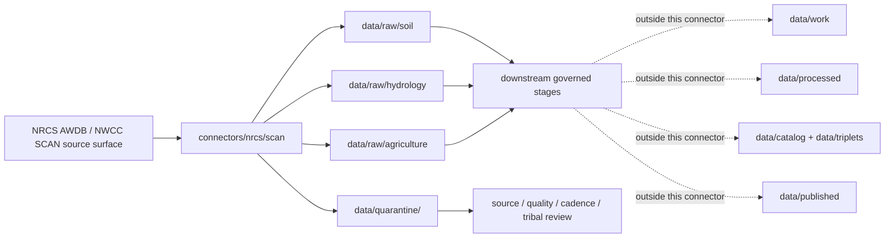

<!-- [KFM_META_BLOCK_V2]
doc_id: kfm://doc/connectors-nrcs-scan-nested-readme
title: connectors/nrcs/scan/ — NRCS SCAN Nested Connector Lane
type: readme
version: v0.1
status: draft
owners: OWNER_TBD — Source steward · Connector steward · NRCS steward · Soil steward · Hydrology steward · Agriculture steward · Climate steward · Data steward · Validation steward · Docs steward
created: 2026-06-20
updated: 2026-06-20
policy_label: public; observation-source; tribal-review; not-life-safety
related:
  - ../README.md
  - ../../../connectors/nrcs-scan/README.md
  - ../../../docs/doctrine/directory-rules.md
  - ../../../docs/sources/catalog/nrcs.md
  - ../../../docs/sources/catalog/nrcs/README.md
  - ../../../docs/sources/catalog/nrcs/scan-soil-climate.md
  - ../../../docs/sources/catalog/nrcs/ssurgo.md
  - ../../../docs/sources/catalog/nrcs/gssurgo.md
  - ../../../pipelines/domains/soil/scan_awdb_ingest/README.md
  - ../../../docs/domains/soil/README.md
  - ../../../docs/domains/hydrology/README.md
  - ../../../docs/domains/agriculture/README.md
  - ../../../docs/domains/atmosphere/README.md
  - ../../../data/registry/sources/
  - ../../../data/raw/
  - ../../../data/quarantine/
  - ../../../data/receipts/
  - ../../../data/proofs/
  - ../../../policy/rights/
  - ../../../policy/sensitivity/
  - ../../../release/
tags: [kfm, connectors, nrcs, scan, tribal-scan, awdb, nwcc, soil-climate, soil-moisture, soil-temperature, station-observation, hydrology, agriculture, climate, source-admission, raw, quarantine, governance]
notes:
  - "Nested connector lane for NRCS Soil Climate Analysis Network intake under the canonical connectors/nrcs/ family."
  - "This file does not delete, move, or supersede the draft sibling connectors/nrcs-scan/README.md; sibling versus nested placement remains an ADR or migration-note question."
  - "Source-product doctrine exists at docs/sources/catalog/nrcs/scan-soil-climate.md; source descriptors remain the authority for role, rights, cadence, sensitivity, and activation state."
  - "Connector output may enter raw or quarantine admission lanes only."
  - "SCAN records are station observations and watcher candidate signals, not county/regional truth, conservation-compliance proof, water-rights proof, forecasts, alerts, or field verification."
  - "Station ID, network, timestamp, sensor depth, variable, units, quality flags, cadence, freshness, Tribal SCAN status, source URL, and digest must be preserved."
[/KFM_META_BLOCK_V2] -->

<a id="top"></a>

# NRCS SCAN Nested Connector

> Nested source-specific intake and admission lane for NRCS Soil Climate Analysis Network station-observation source material under the canonical `connectors/nrcs/` connector family.

<p>
  
  
  
  
  
  
  
</p>

`connectors/nrcs/scan/`

## Scope

`connectors/nrcs/scan/` is the nested product-specific connector lane for NRCS SCAN source intake and admission helpers.

This folder may contain connector-local documentation, source-admission helpers, AWDB/NWCC report manifest helpers, station metadata parsers, observation-table parsers, sensor-depth handlers, quality-flag handlers, no-network fixture pointers, checksum/digest helpers, and raw/quarantine output adapters for SCAN and Tribal SCAN records.

It must not become NRCS source-family truth, SCAN product doctrine, station-as-area truth, county soil-climate truth, conservation-compliance authority, water-rights authority, regulatory determination authority, forecast authority, alert authority, policy authority, schema authority, catalog/triplet authority, proof authority, release authority, pipeline authority, public API behavior, or public UI behavior.

> [!IMPORTANT]
> **Status:** draft / `NEEDS VERIFICATION`  
> **Owner:** `OWNER_TBD`  
> **Path:** `connectors/nrcs/scan/`  
> **Truth posture:** the path exists in the repository as this README; source activation, AWDB/NWCC endpoint behavior, station inventory, tests, fixtures, CI wiring, rights status, parser behavior, quality-flag handling, Tribal SCAN review, sibling-lane migration, and release behavior remain `NEEDS VERIFICATION`.

---

## Repo fit

```text
connectors/
└── nrcs/
    ├── README.md
    └── scan/
        └── README.md
```

Related responsibility roots:

```text
connectors/nrcs/                              # canonical NRCS connector-family lane
connectors/nrcs/scan/                         # nested SCAN connector lane
connectors/nrcs-scan/                         # draft sibling lane; placement/migration question
docs/sources/catalog/nrcs/scan-soil-climate.md # SCAN source-product doctrine and source-role caveats
docs/sources/catalog/nrcs.md                  # NRCS source-family profile
docs/domains/soil/                            # soil moisture / soil temperature context
docs/domains/hydrology/                       # water and climate support context
docs/domains/agriculture/                     # agriculture and conservation context
docs/domains/atmosphere/                      # weather/climate station context
pipelines/domains/soil/scan_awdb_ingest/      # downstream executable ingest, not connector-owned
data/registry/sources/                        # source descriptors and activation state
data/raw/                                     # raw staged source outputs by owning domain
data/quarantine/                              # held material requiring source/role/rights/sensitivity review
data/receipts/                                # ingest, checksum, station metadata, transform, and aggregation receipts
data/proofs/                                  # EvidenceBundles and proof packs
policy/rights/                                # terms, attribution, and source-use review
policy/sensitivity/                           # Tribal, public-safety, station-location, and release rules
release/                                      # release decisions, manifests, rollback, correction state
```

---

## Relationship to sibling lane

This nested lane exists because `connectors/nrcs/` is the canonical NRCS connector-family home and the family README allows nested product-specific lanes if placement is ratified by Directory Rules, ADR, or migration note.

| Path | Status | Use |
|---|---|---|
| `connectors/nrcs/README.md` | `CONFIRMED` parent family README | NRCS connector-family boundary and product-lane index. |
| `connectors/nrcs/scan/README.md` | `CONFIRMED` after this update | Nested product-lane boundary for SCAN under the NRCS family. |
| `connectors/nrcs-scan/README.md` | Existing draft sibling lane | Keep as draft/sibling reference until ADR or migration note decides final placement. |

No move, delete, rename, redirect, or deprecation is implied by this README.

---

## Lifecycle sketch



> [!CAUTION]
> Connector code admits source material. It does not interpolate stations into surfaces, turn point observations into county truth, certify conservation compliance, publish layers, answer public claims, or decide release state. Promotion remains a governed state transition, not a file move.

---

## Authority boundary

```text
OUTPUT LIMIT:
  data/raw/<domain>/<source_id>/<run_id>/
  data/quarantine/<domain>/<source_id>/<run_id>/

NOT HERE:
  NRCS source-family truth
  SCAN product doctrine
  station-as-area truth
  field verification
  conservation-compliance authority
  water-rights authority
  forecast or alert authority
  source descriptor authority
  rights or sensitivity policy
  processed station derivatives
  catalog records
  triplet records
  public map artifacts
  receipts/proofs as authority
  release decisions
  public API behavior
  public UI behavior
```

---

## Inputs

| Accepted item | Required posture |
|---|---|
| Report manifest helper | Preserve source URL, network, station ID, element, duration, function, value type, time period, output format, checksum, and retrieval time. |
| Station metadata parser | Preserve station ID, name, network, state, county, elevation, latitude, longitude, HUC fields, report timezone, SHEF ID, start date, and end date where available. |
| Observation parser | Preserve timestamp, element, depth, value type, function, value, units, quality flags, and missing-value conventions. |
| Soil-depth helper | Preserve soil moisture or soil temperature depth as a required dimension; never collapse depths. |
| Cadence helper | Preserve hourly, daily, monthly, seasonal, annual, and report-duration semantics as source-significant metadata. |
| Network helper | Preserve `SCAN` versus `TRIBAL SCAN` network identity and review posture. |
| Freshness helper | Preserve heartbeat/freshness expectations and route stale source conditions to review. |
| Rights/citation helper | Preserve source terms, citation, attribution posture, and review status. |

---

## Exclusions

| Do not store here | Correct home |
|---|---|
| NRCS source-family doctrine | `docs/sources/catalog/nrcs.md` and `docs/sources/catalog/nrcs/` |
| SCAN source-product doctrine | `docs/sources/catalog/nrcs/scan-soil-climate.md` |
| SCAN/AWDB executable ingest pipeline | `pipelines/domains/soil/scan_awdb_ingest/` or accepted pipeline home |
| Authoritative `SourceDescriptor` records | `data/registry/sources/` |
| Soil, Hydrology, Agriculture, or Atmosphere doctrine | `docs/domains/` under owning domain lanes |
| Rights, sensitivity, Tribal review, or release policy | `policy/`, `policy/sensitivity/`, `release/` |
| Processed station derivatives or interpolations | `data/processed/` |
| Catalog or triplet records | `data/catalog/`, `data/triplets/` |
| Public map artifacts | `data/published/` after governed release |
| Receipts and proof packs as authority | `data/receipts/`, `data/proofs/` |
| Schemas or semantic contracts | `schemas/`, `contracts/` |
| Public UI or API behavior | `apps/governed-api/`, `apps/explorer-web/` |

---

## Admission posture

SCAN intake should preserve source identity, source descriptor reference, network identity, station ID, station name, location, elevation, HUC, timezone, start/end date, status fields, element, sensor depth, function, value type, value, units, quality flags, missing-value code, report duration, observation time, retrieval time, source URL/query, output format, content digest, raw/derived status, rights/citation posture, public-safety limitation notes, Tribal review posture, and quarantine reason when review is required.

---

## Anti-collapse posture

| Rule | Connector implication |
|---|---|
| Station reading is not area truth. | Do not emit county, watershed, region, or raster values without downstream aggregation or modeling receipts. |
| Depth matters. | Soil moisture and soil temperature depths must stay distinct. |
| Network identity matters. | `TRIBAL SCAN` records require explicit review and must not be treated as ordinary public context by default. |
| Cadence matters. | Hourly, daily, monthly, seasonal, annual, and report-duration outputs are distinct artifacts. |
| Quality flags matter. | Do not drop QC flags, missing codes, or calculated-value conditions. |
| Watcher signal is not publication. | Pre-RAW candidate signals only indicate source activity or staleness; they are not public truth. |
| Near-real-time can be stale. | Preserve retrieval time and report period; public products need freshness gates. |
| Public display is downstream. | The connector must not build public tiles, UI layers, climate claims, compliance claims, or alert payloads. |

---

## Validation

Before relying on this connector, verify source descriptors, current endpoint behavior, station inventory, sensor-depth schema, timezone behavior, QA-flag vocabulary, Tribal SCAN review posture, no-network fixtures, raw/quarantine-only output paths, downstream receipts/proofs, and release gates.

---

## Definition of done

- [ ] Owners are confirmed and `OWNER_TBD` is replaced.
- [ ] Nested versus sibling placement is resolved or recorded in the drift/open-question register.
- [ ] Actual connector contents are inventoried.
- [ ] NRCS SCAN and Tribal SCAN `SourceDescriptor` IDs and source-family activation are verified.
- [ ] NRCS/NWCC rights, citation, attribution, source terms, endpoint, station inventory, sensor-depth schema, and current report posture are documented.
- [ ] Manifest builders preserve source URL/query, network, station ID, element, depth, duration, value type, format, and digest.
- [ ] Parsers preserve station metadata, timestamp, element, value, units, quality flags, missing codes, soil depth, raw/derived status, freshness, and product vintage.
- [ ] Tests prevent silent conversion of station readings into area truth, depth-collapsed values, cadence-collapsed values, conservation-compliance determinations, water-rights claims, or alerts.
- [ ] Outputs are verified to enter only raw or quarantine admission lanes.
- [ ] No source-family, domain, processed, catalog, triplet, published, release, schema, policy, proof, receipt, registry, fixture, report, API, UI, tile, alert, area-truth, compliance, or regulatory authority lives here.
- [ ] Tests, fixtures, and CI behavior are verified or marked `NEEDS VERIFICATION`.

---

## Status summary

`connectors/nrcs/scan/` is for nested NRCS SCAN source-admission code only. It is not source-family truth, regional soil-climate truth, forecast authority, alert authority, conservation-compliance authority, water-rights authority, policy authority, schema authority, catalog/triplet authority, proof closure, release authority, public map authority, public API behavior, public UI behavior, or pipeline authority.

<p align="right"><a href="#top">Back to top</a></p>
