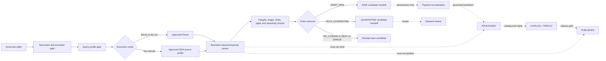

<!-- [KFM_META_BLOCK_V2]
doc_id: kfm://doc/connectors-nrcs-sda-readme
title: connectors/nrcs/sda/ — NRCS Soil Data Access Query-Admission Boundary
type: readme
version: v0.2
status: draft; repository-grounded; nested-product-lane; implementation-placeholder; source-inactive; non-authoritative
owners: OWNER_TBD — Source steward · Connector steward · NRCS steward · Soil steward · Agriculture steward · Hydrology steward · Query-profile steward · Rights reviewer · Sensitivity reviewer · Security steward · Validation steward · Schema steward · Receipt steward · CI steward · Docs steward
created: 2026-06-20
updated: 2026-07-15
supersedes: v0.1 planning-oriented SDA connector guide (2026-06-20)
policy_label: "public-doctrine; connector-boundary; nested-product-lane; nrcs; sda; soil-data-access; query-source; source-inactive; profile-gated; read-only; no-free-form-live-sql; no-network-by-default; raw-quarantine-only; receipt-required; schema-drift-aware; cardinality-aware; fixture-first; no-publication; rollback-aware; no-secrets"
current_path: connectors/nrcs/sda/README.md
truth_posture: CONFIRMED target path and prior v0.1 README, connectors root contract, canonical NRCS family README, NRCS source-root/package/test README scaffolds, kfm-connector-nrcs 0.0.0 metadata, empty central package initializer, bounded absence of products/sda.py and SDA-specific tests, draft SDA product-page doctrine, minimal PROPOSED SDA registry placeholder, empty PROPOSED source-authority register, bounded absence of a flat SDA compatibility lane, SDA-specific pipeline README/spec, and accepted SDA-specific query-profile/schema/validator/fixture surfaces in the checked search, plus TODO-only connector-gate workflow / PROPOSED profile-gated read-only request contract, query/request/response/result-set identities, deterministic digests, bounded parameters, schema and cardinality expectations, connector-local finite outcomes, fixture taxonomy, negative tests, implementation sequence, correction, deprecation, and rollback / CONFLICTED product-page proposed authority/cadence claims versus inactive registry evidence, exact query text preservation versus minimization and sensitive parameter handling, generic NRCS package plans versus absent SDA implementation, and documentation-rich boundaries versus absent executable enforcement / UNKNOWN active SourceDescriptor, approved source surfaces, current protocols and formats, query language/version, allowed query profiles, parameter vocabulary, response limits, result schemas, column types, null and sentinel conventions, ordering guarantees, rights, executable behavior, fixtures, tests, CI enforcement, schedules, receipts, deployment, downstream consumers, and runtime health / NEEDS VERIFICATION accepted owners, source and collection identity, activation, rights and attribution, query-profile registry, endpoint allowlist, read-only policy, parameter binding, expected schemas, row/cell/byte limits, parser contracts, validators, fixture approval, test collection, CI gates, lifecycle routing, correction and supersession, deprecation, and rollback automation
evidence_snapshot:
  repository: bartytime4life/Kansas-Frontier-Matrix
  repository_id: "1059091169"
  visibility: public
  base_ref: main
  base_commit: 9ede51fb0999fcda37e3335a4cf747850908510c
  prior_blob: 05359af717802d271ec72fe12d3aa7298cc5aa26
  connector_root_blob: bdd50032bed62ac36964c79f16cf5541b21759a6
  nrcs_family_blob: 888236f218fc0892c54c947c0c2651b34ca5137b
  nrcs_source_root_blob: 3b26759548ddaf52eb5b6de0e25dfa354e1d62ec
  nrcs_package_readme_blob: 3e022257cc553e8661b988e9e01c61cccc1fddc8
  nrcs_tests_blob: 7c65ba6ef85a8369e17c40d5e3fbc388b04a306b
  package_metadata_blob: c6bb1565db7df490bee52a597d04d694e2b9f8a4
  package_initializer_blob: e69de29bb2d1d6434b8b29ae775ad8c2e48c5391
  product_page_blob: 70aca5f334199e2f7e50246feb9fb6d24a989df3
  soil_registry_placeholder_blob: 2af133bca4afa9b0e7e825d9f9429127dca4b275
  source_authority_register_blob: 82c23722520922f5ca0dad7f37ed794d1c2edf81
  source_admission_adr_blob: 0e8d03786bcc99b19f179680890df9e30a27633a
  directory_rules_blob: 2affb080e6f0043867c64c7f06c1ca52030fbd55
  connector_gate_workflow_blob: fc36ecced55bb0b4002d551cb28addfff0be918a
  bounded_path_checks:
    - connectors/nrcs/sda/README.md exists at v0.1 before this revision
    - connectors/nrcs-sda/README.md was not found
    - connectors/nrcs/src/nrcs/__init__.py is empty
    - connectors/nrcs/src/nrcs/products/sda.py was not found
    - connectors/nrcs/tests/test_sda.py was not found
    - connectors/nrcs/tests/test_sda_parser.py was not found
    - connectors/nrcs/pyproject.toml contains only project name and version 0.0.0
    - data/registry/sources/soil/nrcs-sda.yaml is a minimal PROPOSED placeholder
    - control_plane/source_authority_register.yaml is PROPOSED and entries is empty
    - pipelines/domains/soil/sda_ingest/README.md was not found
    - pipeline_specs/soil/sda_ingest.yaml was not found
    - no accepted SDA-specific query-profile, schema, validator, or fixture surface was identified in the bounded repository search
    - .github/workflows/connector-gate.yml contains TODO echo steps
related:
  - ../README.md
  - ../src/README.md
  - ../src/nrcs/README.md
  - ../tests/README.md
  - ../pyproject.toml
  - ../../../docs/doctrine/directory-rules.md
  - ../../../docs/adr/ADR-0017-source-descriptor-admission-process.md
  - ../../../docs/sources/catalog/nrcs.md
  - ../../../docs/sources/catalog/nrcs/README.md
  - ../../../docs/sources/catalog/nrcs/soil-data-access.md
  - ../../../docs/domains/soil/README.md
  - ../../../docs/domains/agriculture/README.md
  - ../../../docs/domains/hydrology/README.md
  - ../../../control_plane/source_authority_register.yaml
  - ../../../data/registry/sources/soil/nrcs-sda.yaml
  - ../../../data/raw/soil/README.md
  - ../../../data/receipts/soil/README.md
  - ../../../contracts/
  - ../../../schemas/
  - ../../../policy/rights/
  - ../../../policy/sensitivity/
  - ../../../release/
  - ../../../.github/workflows/connector-gate.yml
tags: [kfm, connectors, nrcs, sda, soil-data-access, soil-data-mart, query-profile, read-only-query, parameters, result-set, table, column, ordering, nulls, schema-drift, cardinality, mukey, digest, receipt, source-admission, raw, quarantine, no-network, fixture-first, anti-collapse, correction, rollback]
notes:
  - "This revision changes only connectors/nrcs/sda/README.md."
  - "The nested SDA path is a strong responsibility-root fit under the canonical connectors/nrcs/ family, and no flat SDA compatibility lane was found."
  - "The central NRCS package remains a 0.0.0 empty shell; the proposed products/sda.py module and SDA-specific tests were not found."
  - "The inspected SDA registry record is a minimal inventory placeholder and the source-authority register has no entries; source activation is not established."
  - "The SDA product page is a draft scaffold and includes proposed source-role and cadence language that is not treated here as runtime or descriptor fact."
  - "A future connector must execute only accepted, versioned, read-only query profiles with bounded parameters; free-form user-, UI-, or model-generated live SQL is denied by default."
  - "A query result remains source-, descriptor-, endpoint-profile-, query-profile-, parameter-, request-, response-, table-, column-, row-order-, key-, time-, digest-, and correction-scoped."
  - "Connector activity is limited to explicit source admission and RAW or QUARANTINE handoff."
[/KFM_META_BLOCK_V2] -->

<a id="top"></a>

# NRCS Soil Data Access Query-Admission Boundary

`connectors/nrcs/sda/`

> Repository-present nested boundary for candidate USDA NRCS Soil Data Access source admission under the canonical NRCS connector family. Current evidence establishes a README-only lane—not an active source, approved query profile, runnable client, tested parser, validated result contract, or release-ready soil-data workflow.


**Quick links:** [Purpose](#purpose) · [Status](#status-and-evidence) · [Authority](#authority-boundary) · [Directory basis](#directory-rules-basis) · [Context](#bounded-context) · [Invariants](#keystone-invariants) · [Product separation](#product-and-authority-separation) · [Activation](#source-activation-and-admission-gate) · [Profiles](#query-profile-contract) · [Identity](#query-request-response-and-result-identity) · [Parameters](#parameter-and-binding-contract) · [Transport](#transport-security-and-resource-bounds) · [Response](#response-and-result-set-contract) · [Types](#types-nulls-sentinels-and-encoding) · [Joins](#keys-joins-cardinality-and-coverage) · [Time](#time-freshness-corrections-and-replay) · [Rights](#rights-sensitivity-and-disclosure) · [Inputs](#explicit-input-contract) · [Outcomes](#connector-outcomes-and-reason-codes) · [Lifecycle](#source-admission-handoff) · [Evidence](#receipts-evidence-and-proof-boundary) · [Pipeline](#pipeline-catalog-release-and-public-interface-separation) · [AI](#public-api-ui-and-ai-boundary) · [Testing](#testing-and-fixtures) · [Implementation](#smallest-sound-implementation-sequence) · [Done](#definition-of-done) · [Open](#open-verification-register) · [Validation](#validation-commands) · [Ledger](#evidence-ledger) · [Checklist](#maintainer-checklist) · [Rollback](#rollback-correction-deprecation-and-supersession)

> [!IMPORTANT]
> **This README is not a source activation, endpoint allowlist, or query-profile approval.** Path presence does not establish an active `SourceDescriptor`, approved SDA surface, supported protocol or format, accepted query template, parser, fixtures, tests, receipts, schedule, CI enforcement, deployment, or publication readiness.

> [!CAUTION]
> **A successful query is not soil truth.** A connector may preserve a bounded query and its response. It may not silently treat a query result as a complete SSURGO package, current field observation, parcel or ownership fact, conservation-compliance determination, engineering conclusion, hydrologic conclusion, or public release.

> [!WARNING]
> **Free-form live query execution is denied by default.** User-, UI-, notebook-, agent-, or model-generated query text must not be transmitted to an external source merely because it parses. Live execution requires an accepted, versioned, read-only query profile with explicit parameters, limits, rights posture, expected result shape, and reviewable provenance.

---

<a id="purpose"></a>

## Purpose

This README defines the allowed source-edge boundary for candidate Soil Data Access work under the established [`connectors/nrcs/`](../README.md) family root.

A future implementation associated with this lane may exist only after governance verifies:

1. the active source descriptor and source or collection identity;
2. approved source surfaces, protocols, operations, rights, attribution, and rate posture;
3. an accepted query-profile registry or equivalent governed configuration;
4. read-only statement templates and bounded parameter schemas;
5. expected response media types, encodings, result-set shapes, columns, types, ordering, keys, and cardinalities;
6. byte, row, cell, column, table, time, retry, and redirect limits;
7. deterministic query, request, response, and fixture digests;
8. no-network fixtures and deterministic parsers;
9. finite connector-local outcomes and reason codes;
10. RAW or QUARANTINE handoff only;
11. substantive tests and CI enforcement;
12. correction, deprecation, supersession, replay, and rollback behavior.

Any allowed implementation must remain:

- subordinate to the `connectors/` source-admission responsibility root;
- subordinate to the NRCS family boundary;
- descriptor-gated and source-activation-aware;
- query-profile-gated rather than free-form;
- read-only by contract;
- no-network by default;
- fixture-first and deterministic;
- explicit about approved endpoint and operation profiles;
- bounded in timeouts, retries, redirects, pagination, response bytes, rows, cells, columns, tables, and decompression;
- lossless about source, query profile, parameters, request, response, tables, columns, values, units, missingness, ordering, joins, time, digests, and corrections;
- rights- and sensitivity-aware without becoming policy authority;
- limited to RAW or QUARANTINE admission candidates;
- separate from normalization, domain interpretation, catalog closure, evidence closure, release, public API, UI, map, notification, and generated-answer behavior.

It must not become:

- NRCS or SDA doctrine;
- a `SourceDescriptor`, source-authority register, or query-profile authority embedded in prose;
- a general SQL console or public query proxy;
- a credential, token, cookie, or private-session store;
- a Soil, Agriculture, or Hydrology truth resolver;
- a parcel, ownership, compliance, regulatory, engineering, agronomic, hydrologic, or field-verification service;
- a schema, contract, policy, proof, receipt, release, or publication authority;
- a public API, UI, map, search, export, notification, or AI answer surface.

[Back to top](#top)

---

<a id="status-and-evidence"></a>

## Status and evidence

### Current repository state

| Surface | Status | Safe conclusion |
|---|---:|---|
| `connectors/nrcs/sda/README.md` | **CONFIRMED v0.1 before this revision** | The nested documentation boundary exists. |
| [`connectors/README.md`](../../README.md) | **CONFIRMED v0.3** | Connectors are source-admission implementation support and may hand off RAW, QUARANTINE, and receipt inputs only. |
| [`connectors/nrcs/README.md`](../README.md) | **CONFIRMED v0.1** | `connectors/nrcs/` is documented as the canonical NRCS family spine. |
| Flat `connectors/nrcs-sda/README.md` | **NOT FOUND in bounded check** | No competing flat SDA compatibility lane was identified. |
| [`connectors/nrcs/src/README.md`](../src/README.md) | **CONFIRMED draft** | A source-root boundary exists; implementation is not proven. |
| [`connectors/nrcs/src/nrcs/README.md`](../src/nrcs/README.md) | **CONFIRMED draft** | The central package boundary proposes product modules, including SDA. |
| [`connectors/nrcs/pyproject.toml`](../pyproject.toml) | **CONFIRMED `0.0.0` placeholder** | Distribution identity exists; buildability and dependencies are not established. |
| `connectors/nrcs/src/nrcs/__init__.py` | **CONFIRMED empty** | No exports or runtime behavior are established. |
| `connectors/nrcs/src/nrcs/products/sda.py` | **NOT FOUND in bounded check** | No central SDA implementation is established. |
| `connectors/nrcs/tests/test_sda.py` | **NOT FOUND in bounded check** | No SDA request/admission test is established. |
| `connectors/nrcs/tests/test_sda_parser.py` | **NOT FOUND in bounded check** | No SDA parser test is established. |
| [`connectors/nrcs/tests/README.md`](../tests/README.md) | **CONFIRMED draft** | No-network product-test expectations exist; concrete SDA coverage is absent. |
| [`docs/sources/catalog/nrcs/soil-data-access.md`](../../../docs/sources/catalog/nrcs/soil-data-access.md) | **CONFIRMED draft scaffold** | Reader-oriented product doctrine exists; live details and proposed cadence/role remain unverified. |
| [`data/registry/sources/soil/nrcs-sda.yaml`](../../../data/registry/sources/soil/nrcs-sda.yaml) | **CONFIRMED minimal `PROPOSED` placeholder** | Source activation, rights, roles, endpoints, and obligations are not established. |
| [`control_plane/source_authority_register.yaml`](../../../control_plane/source_authority_register.yaml) | **CONFIRMED `PROPOSED`, empty entries** | No SDA authority entry is established. |
| SDA-specific pipeline README | **NOT FOUND at `pipelines/domains/soil/sda_ingest/README.md`** | No SDA-specific downstream executable lane is established at that path. |
| SDA-specific pipeline spec | **NOT FOUND at `pipeline_specs/soil/sda_ingest.yaml`** | No declarative SDA run profile is established at that path. |
| Accepted SDA query-profile/schema/validator/fixture surface | **NOT IDENTIFIED in bounded search** | Do not claim a canonical query or response contract. |
| [Connector gate workflow](../../../.github/workflows/connector-gate.yml) | **CONFIRMED TODO-only scaffold** | CI orchestration exists; connector behavior is not enforced by this workflow. |

### Maturity statement

The lane is **documentation-present and implementation-absent at the checked surfaces**.

That means:

- importability is not proven;
- installability is not proven;
- live access is not approved;
- query profiles are not accepted;
- free-form query execution is not allowed;
- parser behavior is not established;
- result schemas are not established;
- fixtures and tests are not established;
- receipt emission is not established;
- schedules and watchers are not established;
- deployment and runtime health are unknown;
- public use is denied.

### Truth labels used in this README

| Label | Meaning here |
|---|---|
| **CONFIRMED** | Verified from current-session repository evidence. |
| **PROPOSED** | Recommended future contract, implementation, or governance behavior. |
| **CONFLICTED** | Current repository evidence or documentation points in incompatible directions. |
| **UNKNOWN** | Not resolved from current-session evidence. |
| **NEEDS VERIFICATION** | Checkable before implementation or activation, but not yet proved. |

[Back to top](#top)

---

<a id="authority-boundary"></a>

## Authority boundary

`connectors/nrcs/sda/` may eventually implement a narrow external-source adapter. It has **no authority** to decide what a soil field means, whether a query is authoritative for a claim, whether a source may be activated, whether a result may be published, or whether a public client may see it.

| Concern | Authority in this lane |
|---|---|
| Source-family meaning | **None.** NRCS source doctrine and accepted descriptors own it. |
| SDA product meaning | **None.** Product doctrine and accepted source contracts own it. |
| Source activation | **None.** Source admission governance and authority records own it. |
| Query-profile approval | **None.** An accepted configuration/contract and steward review must own it. |
| Query execution | **Supporting only.** Execute an accepted, read-only, bounded profile after explicit activation and caller authorization. |
| Response parsing | **Supporting only.** Parse the declared profile without inventing semantics. |
| Soil object meaning | **None.** Domain contracts own object meaning. |
| Machine shape | **None.** Accepted schemas own machine shape. |
| Rights and sensitivity | **None.** Policy and source decisions own allow, restrict, hold, deny, and obligations. |
| Evidence closure | **None.** EvidenceRef-to-EvidenceBundle resolution remains external. |
| Lifecycle promotion | **None.** Promotion is governed outside the connector. |
| Catalog and triplet closure | **None.** Downstream catalog/triplet workflows own closure. |
| Release and publication | **None.** Release manifests and review records own publication state. |
| Public API, UI, map, export, or AI answer | **None.** Governed public interfaces consume released artifacts only. |

A response status of `200`, a nonempty row set, a matching digest, or a schema-shaped record does not transfer authority into this connector.

[Back to top](#top)

---

<a id="directory-rules-basis"></a>

## Directory Rules basis

The existing path passes the responsibility-root test:

```text
connectors/             source-specific fetch, probe, parse, and admission support
└── nrcs/               canonical NRCS connector-family boundary
    └── sda/            nested Soil Data Access product boundary
        └── README.md   this file
```

The path is appropriate because the primary responsibility is source-edge query admission, not generic SQL tooling, Soil-domain normalization, source doctrine, policy, or release.

### Responsibility split

| Responsibility | Owning root or surface | This lane's posture |
|---|---|---|
| Human source/product explanation | `docs/sources/catalog/nrcs/` | Link; do not duplicate descriptor authority. |
| Source descriptor and activation | `data/registry/sources/`, `control_plane/`, policy decision records | Consume references; never author activation implicitly. |
| Query-profile meaning and machine shape | Accepted `contracts/`, `schemas/`, or governed configuration home | **NEEDS VERIFICATION**; do not invent a parallel home here. |
| Source access and parsing | `connectors/nrcs/sda/` plus accepted central package module | Allowed only after activation and contract admission. |
| Generic NRCS client/package code | `connectors/nrcs/src/nrcs/` | Reuse; do not fork a second implementation. |
| Tests and fixtures | Accepted `tests/` and `fixtures/` homes | Product-specific, no-network, reviewed. |
| Normalization and domain processing | `pipelines/`, `packages/domains/soil/` as appropriate | Outside connector authority. |
| Lifecycle records | `data/<phase>/soil/` | Connector prepares admission candidates; orchestration owns writes. |
| Receipts and proofs | `data/receipts/`, `data/proofs/` | Connector supplies receipt inputs; does not own proof closure. |
| Rights and sensitivity | `policy/rights/`, `policy/sensitivity/` | Consume decisions and fail closed. |
| Release, correction, rollback | `release/`, `data/rollback/` or accepted homes | Outside connector authority. |
| Public interfaces | Governed app, API, UI, map, and export roots | No direct connector access. |

No new root, schema home, query-profile authority, source registry, pipeline lane, or receipt family is created by this README.

[Back to top](#top)

---

<a id="bounded-context"></a>

## Bounded context

### Ubiquitous language

| Term | Meaning in this README |
|---|---|
| **SDA source surface** | An externally governed Soil Data Access interface identified by an accepted endpoint/operation profile. |
| **Source descriptor** | The governed record that identifies the source, activation state, authority use, rights, sensitivity, cadence, and obligations. |
| **Query profile** | A versioned, reviewed, read-only statement/template plus parameter schema, expected result shape, limits, and provenance requirements. |
| **Query template** | The immutable or versioned statement text associated with a query profile. |
| **Query parameters** | Bounded typed values supplied to an accepted template. They are not arbitrary query fragments. |
| **Query identity** | The profile ID/version, canonical template digest, parameter digest, endpoint/operation profile, and relevant caller/tool versions. |
| **Request identity** | The exact outbound method/operation, sanitized headers, body or parameter representation, attempt, and retrieval context. |
| **Response identity** | Status, useful headers, media type, encoding, byte digest, retrieval time, and source correction/version context. |
| **Result set** | One named or indexed table-like response unit, including columns, rows, order posture, types, and keys. |
| **Schema expectation** | The profile-pinned expected tables, columns, types, nullability, units, order, keys, and cardinality constraints. |
| **Schema drift** | A material difference between the expected and observed response shape. |
| **Admission candidate** | A bounded connector result proposed for RAW or QUARANTINE handoff. |
| **Quarantine** | A held outcome requiring review because identity, rights, shape, limits, freshness, or integrity is unresolved. |
| **Receipt input** | Deterministic metadata sufficient for an owning receipt workflow to record what happened. It is not itself proof closure. |
| **Correction** | A source or KFM change that produces a new immutable result and invalidation/supersession links rather than silent overwrite. |

### Boundary test

A behavior belongs here only when it:

1. interacts with an approved SDA source profile or approved fixture;
2. executes or simulates an accepted read-only query profile;
3. preserves request and response identity;
4. parses without inventing domain meaning;
5. applies connector-local integrity, shape, and resource checks;
6. returns a finite admission outcome;
7. prepares RAW or QUARANTINE handoff and receipt inputs;
8. does not normalize, interpret, publish, or answer claims.

[Back to top](#top)

---

<a id="keystone-invariants"></a>

## Keystone invariants

1. **Descriptor before live access.** No active descriptor or equivalent activation decision means no live request.
2. **Profile before query.** No accepted query profile means no live query.
3. **Read-only means read-only.** Mutation, DDL, DML, administrative statements, multi-statement payloads, and hidden side effects are denied.
4. **Parameters are values, not query fragments.** Dynamic identifiers, clauses, joins, ordering, limits, and expressions require profile review.
5. **No network at import time.** Importing any module must not connect, probe, authenticate, fetch, mutate, cache, or write.
6. **No free-form live SQL.** User-, UI-, notebook-, script-, or model-provided arbitrary query text is denied by default.
7. **Query identity is explicit.** Profile, version, template digest, parameter digest, endpoint profile, and tool version remain traceable.
8. **Query digest and response digest are distinct.**
9. **Response success is not schema compatibility.**
10. **Row presence is not coverage proof.**
11. **Row order is not stable unless the profile requires and verifies an explicit ordering contract.**
12. **Null, omitted, blank, zero, and source sentinel are distinct until an accepted transform says otherwise.**
13. **Join keys do not prove join cardinality.**
14. **SDA query output is not a complete source package.**
15. **SDA output is not field verification.**
16. **Connectors do not normalize Soil-domain meaning.**
17. **Connectors do not publish.**
18. **RAW and QUARANTINE are the only lifecycle admission destinations.**
19. **Receipts document process; they do not make claims true.**
20. **Corrections append and supersede; they do not silently rewrite prior evidence.**
21. **Rights and sensitivity uncertainty fail closed.**
22. **Limits are part of the contract, not operational suggestions.**
23. **Same declared profile and same supplied fixture must produce deterministic parser and digest results.**
24. **Generated language, including AI output, never substitutes for query profiles, source evidence, validation, or review.**

[Back to top](#top)

---

<a id="product-and-authority-separation"></a>

## Product and authority separation

| Surface or product | What it represents | Required separation |
|---|---|---|
| SDA query response | A scoped result from a declared query/request | Preserve scope, query, parameters, result shape, and digests. |
| SSURGO bulk package | A source distribution/package with its own files and lineage | SDA must not impersonate complete package lineage or coverage. |
| STATSGO2 content | Generalized soil content with scale and use caveats | Preserve product identity and deny parcel/detailed-feature overreach. |
| gSSURGO or gNATSGO | Gridded source/derivative products | Do not collapse grid cells, bands, or raster lineage into SDA query identity. |
| Web Soil Survey session/export | Human-facing AOI/session product | Do not treat session state as an SDA query profile or canonical connector input. |
| SCAN station observation | Time- and depth-scoped observed station record | Do not collapse point observations with static soil-survey query results. |
| Processed Soil object | Domain-normalized KFM record | Requires downstream contracts, transforms, validation, receipts, and evidence. |
| Public soil layer or answer | Released, policy-cleared public representation | Requires catalog, evidence, policy, review, release, correction, and rollback closure. |

### Denied authority upgrades

```text
successful request -> active source
query response -> full SSURGO package
row set -> complete coverage
MUKEY present -> valid one-to-one join
column name -> accepted Soil-domain meaning
numeric value -> usable engineering or agronomic conclusion
source query -> field verification
connector receipt -> EvidenceBundle closure
RAW capture -> processed record
processed candidate -> published artifact
generated summary -> evidence
```

Each arrow above is denied unless the downstream governed transition is separately proved.

[Back to top](#top)

---

<a id="source-activation-and-admission-gate"></a>

## Source activation and admission gate

The source-admission ADR is `proposed`, and current machine authority evidence is incomplete. A future implementation must nevertheless preserve the doctrine boundary:

```mermaid
flowchart LR
    C[Candidate source] --> D[SourceDescriptor draft]
    D --> R[Rights assessment]
    R --> S[Sensitivity assessment]
    S --> A[Authority register entry]
    A --> X[Activation decision]
    X --> Q[Accepted query profile]
    Q --> F[No-network fixture]
    F --> DRY[Connector dry run]
    DRY --> V[Validation and policy checks]
    V --> REV[Steward review]
    REV --> STATE{Activation state}
    STATE -->|inactive or denied| STOP[No live request]
    STATE -->|internal candidate| RAW[RAW or QUARANTINE only]
```



### Minimum live-access preconditions

A live request is denied unless all applicable preconditions resolve:

- source descriptor reference exists;
- activation state permits internal access;
- endpoint/operation profile is approved;
- rights and attribution obligations are resolved;
- sensitivity and public-safety posture are resolved;
- query profile ID and version are accepted;
- query template digest matches the accepted profile;
- parameters validate against the profile;
- request limits and retry policy are explicit;
- expected response contract is pinned;
- no-network fixture tests pass;
- connector dry-run and review requirements are met;
- caller is authorized to invoke live access;
- receipt destination or receipt handoff is available;
- RAW or QUARANTINE target is explicit.

Activation is not release. Internal access is not public permission.

[Back to top](#top)

---

<a id="query-profile-contract"></a>

## Query-profile contract

No accepted SDA query-profile contract was identified in the bounded repository search. The shape below is **PROPOSED** and must move to an accepted contract/schema/configuration authority before implementation relies on it.

### Minimum profile fields

| Field | Requirement |
|---|---|
| `query_profile_id` | Stable deterministic identifier. |
| `query_profile_version` | Immutable version or spec hash. |
| `source_descriptor_ref` | Reference to the activated source record. |
| `endpoint_profile_id` | Approved source surface and operation family. |
| `operation` | Explicit read-only operation. |
| `statement_template_ref` | Reference to reviewed immutable statement/template text. |
| `statement_template_digest` | Digest of canonical template bytes. |
| `parameter_schema_ref` | Accepted parameter names, types, ranges, enums, patterns, and sensitivity classes. |
| `allowed_output_formats` | Explicit accepted formats and media types. |
| `expected_result_profile_ref` | Expected result sets, columns, types, nullability, units, order, keys, and cardinality. |
| `timeout_policy` | Connection/read/total bounds. |
| `retry_policy` | Retryable conditions, attempt count, and backoff. |
| `redirect_policy` | Allowed redirect behavior and host restrictions. |
| `size_limits` | Maximum request, compressed response, decompressed response, rows, cells, columns, and tables. |
| `rate_policy` | Concurrency and pacing obligations. |
| `rights_ref` | Rights and attribution decision. |
| `sensitivity_ref` | Sensitivity and disclosure decision. |
| `receipt_profile_ref` | Required process-memory fields. |
| `correction_policy` | Source correction, replay, supersession, and invalidation behavior. |
| `status` | Draft, active internal, public candidate, retired, or accepted equivalent. |

### Profile immutability

Changing any of the following creates a new profile version:

- endpoint or operation;
- template text or canonicalization;
- parameter names, types, defaults, limits, or sensitivity;
- output format;
- expected tables, columns, types, nullability, units, order, keys, or cardinality;
- request or response limits;
- retry/redirect/rate behavior;
- rights, sensitivity, attribution, or disclosure obligations;
- correction or replay semantics.

A mutable profile that changes behavior without a version/spec-hash change is invalid.

### Illustrative non-authoritative carrier

```json
{
  "query_profile_id": "PROPOSED:kfm.nrcs.sda.example",
  "query_profile_version": "PROPOSED:1",
  "source_descriptor_ref": "NEEDS_VERIFICATION",
  "endpoint_profile_id": "NEEDS_VERIFICATION",
  "operation": "read_only_query",
  "statement_template_ref": "NEEDS_VERIFICATION",
  "statement_template_digest": "NEEDS_VERIFICATION",
  "parameter_schema_ref": "NEEDS_VERIFICATION",
  "expected_result_profile_ref": "NEEDS_VERIFICATION",
  "limits": {
    "timeout_ms": "NEEDS_VERIFICATION",
    "max_response_bytes": "NEEDS_VERIFICATION",
    "max_rows": "NEEDS_VERIFICATION",
    "max_cells": "NEEDS_VERIFICATION"
  }
}
```

This example is documentation only. It is not a schema, activation record, endpoint, executable query, or publication permission.

[Back to top](#top)

---

<a id="query-request-response-and-result-identity"></a>

## Query, request, response, and result identity

A single run has several non-interchangeable identities.

### Query identity

```text
source_descriptor_ref
+ endpoint_profile_id
+ query_profile_id
+ query_profile_version/spec_hash
+ canonical template digest
+ canonical parameter digest
+ expected result profile
+ connector/tool version
```

### Request identity

```text
query identity
+ request attempt
+ method/operation
+ sanitized headers
+ canonical body/parameter bytes
+ request timestamp
+ timeout/retry/redirect policy
```

### Response identity

```text
request identity
+ response status
+ relevant response headers
+ media type and encoding
+ compressed byte count
+ decompressed byte count
+ response byte digest
+ retrieval completion timestamp
+ source correction/version marker where available
```

### Result identity

```text
response identity
+ result-set index/name
+ observed columns and types
+ row count
+ order posture
+ key/cardinality findings
+ parser/profile version
+ canonical parsed-result digest where an accepted profile defines one
```

These identities must not be compressed into one ambiguous `digest` field.

### Deterministic digest boundaries

| Digest | Covers | Must not imply |
|---|---|---|
| Template digest | Canonical query template bytes | Parameters, request, response, or truth. |
| Parameter digest | Canonical parameter values under a declared schema | Template approval or response identity. |
| Query digest | Template/profile + parameters under a declared canonicalization | Request transport or response bytes. |
| Request digest | Canonical outbound request representation | Successful delivery or source response. |
| Response digest | Exact admitted response bytes | Parser correctness or domain meaning. |
| Parsed-result digest | Accepted canonical parsed representation | Evidence closure, policy approval, or release. |
| Fixture digest | Reviewed fixture bytes | Live source equivalence or activation. |

[Back to top](#top)

---

<a id="parameter-and-binding-contract"></a>

## Parameter and binding contract

Parameters are typed values. They are not permission to assemble arbitrary statement syntax.

### Allowed parameter characteristics

A profile may allow parameters only when it defines:

- stable parameter name;
- machine type;
- required/optional status;
- nullability;
- allowed values or bounds;
- canonical serialization;
- sensitivity classification;
- redaction/logging posture;
- default behavior;
- maximum length or collection size;
- whether order is significant;
- whether duplicates are allowed;
- interaction constraints with other parameters.

### Denied dynamic fragments

Unless separately modeled and accepted as enumerated profile choices, parameters must not supply:

- table names;
- column names;
- joins;
- operators;
- functions;
- expressions;
- clauses;
- sort directions;
- pagination syntax;
- limits;
- statement separators;
- comments;
- subqueries;
- DDL, DML, administrative, or mutation statements.

### Binding requirements

A future implementation must:

1. validate parameters before network access;
2. use the source protocol's safe binding mechanism where available;
3. reject unknown parameters;
4. reject duplicated parameters when the profile forbids them;
5. reject values outside declared limits;
6. canonicalize values for digesting without changing their source meaning;
7. keep raw sensitive values out of normal logs;
8. preserve a governed exact representation where replay obligations require it;
9. record the profile and parameter-schema versions;
10. fail closed when safe binding cannot be proved.

String interpolation is not evidence of safe binding.

[Back to top](#top)

---

<a id="transport-security-and-resource-bounds"></a>

## Transport, security, and resource bounds

### Import-time safety

Importing SDA or shared NRCS modules must perform no:

- network calls;
- DNS resolution;
- authentication;
- token, cookie, credential, or secret reads;
- filesystem writes;
- cache creation;
- lifecycle writes;
- receipt/proof/release writes;
- schedule registration;
- logging of environment secrets;
- public output generation.

### Live request controls

| Control | Required posture |
|---|---|
| Endpoint | Accepted endpoint profile; no arbitrary host or URL. |
| Scheme | Secure transport unless an accepted exception is documented and constrained. |
| Method/operation | Read-only profile only. |
| Authentication | Explicit secret reference from owning runtime; never committed or logged. |
| Timeout | Connection, read, and total limits. |
| Retry | Bounded, condition-specific, and idempotency-aware. |
| Redirect | Deny by default or restrict to accepted hosts and count. |
| Rate | Explicit concurrency and pacing. |
| Request size | Bounded before transmission. |
| Response size | Bound compressed and decompressed bytes. |
| Tables/columns/rows/cells | Bound before materialization where possible. |
| Pagination | Explicit profile; bounded page count and total results. |
| Media type | Allowlisted. |
| Encoding | Declared and validated. |
| Compression | Allowlisted and expansion-bounded. |
| Temporary storage | Explicit, permission-bounded, cleaned, and receipted where required. |
| Logging | Sanitized metadata only; no secrets or uncontrolled payload dumps. |

### Public-input prohibition

A public request, UI field, chat message, generated answer, notebook cell, or model tool call must not become live SDA query text.

A governed public/API workflow may request a known product or query-profile ID with bounded parameters. The connector resolves that request to an accepted profile; it does not accept source-language query syntax from the caller.

### Resource exhaustion posture

The connector must stop or quarantine on:

- response bytes above the profile limit;
- decompression ratio above the profile limit;
- excessive tables, columns, rows, or cells;
- excessive field length;
- excessive nesting;
- invalid or adversarial encoding;
- repeated redirect or retry loops;
- unbounded pagination;
- parser complexity beyond declared limits;
- unexpectedly large diagnostics or error bodies.

Partial results must be visibly partial and cannot silently become complete coverage.

[Back to top](#top)

---

<a id="response-and-result-set-contract"></a>

## Response and result-set contract

### Response envelope preservation

A connector-local response candidate should preserve, when available and permitted:

- source descriptor reference;
- endpoint and operation profile;
- query profile ID/version;
- query, parameter, request, and response digests;
- request and retrieval timestamps;
- response status;
- relevant rate, version, cache, or correction headers;
- media type;
- character encoding;
- compression;
- byte counts;
- parser/profile version;
- result-set count;
- observed result metadata;
- warnings and source errors;
- truncation or partial-result markers;
- rights, sensitivity, and attribution references;
- correction/supersession references;
- admission outcome and reason codes.

### Result-set preservation

For each result set, preserve:

- stable source-provided name or deterministic index;
- column sequence as observed;
- normalized column identifiers only as a separate derivative;
- source column labels;
- observed or declared types;
- nullability;
- unit metadata where source/profile supplies it;
- row count;
- column count;
- cell count;
- ordering contract;
- key candidates;
- duplicate-key findings;
- cardinality findings;
- missing/unexpected column findings;
- type-drift findings;
- truncation or pagination status;
- table/result digest when an accepted canonicalization exists.

### Schema drift classes

| Drift class | Example | Default connector posture |
|---|---|---|
| Missing expected result set | Required table absent | QUARANTINE or invalid response. |
| Unexpected result set | New table appears | Review; do not silently discard. |
| Missing expected column | Required column absent | QUARANTINE. |
| Unexpected column | New column appears | Preserve and flag; profile decides materiality. |
| Reordered columns | Same labels, different sequence | Preserve observed order and flag when order is contractual. |
| Type drift | Numeric becomes string | QUARANTINE unless profile explicitly supports both. |
| Nullability drift | Required value becomes null | Quarantine or profile-defined invalid row. |
| Unit drift | Unit changes or disappears | QUARANTINE. |
| Key drift | Expected key missing or duplicated | QUARANTINE. |
| Cardinality drift | One-to-one becomes one-to-many | QUARANTINE. |
| Ordering drift | Stable order no longer guaranteed | Require explicit ordering or treat result as unordered. |
| Truncation | Source or client returns partial output | Preserve partial marker; deny complete-coverage claims. |

Silently dropping unexpected data or filling missing required fields is prohibited.

[Back to top](#top)

---

<a id="types-nulls-sentinels-and-encoding"></a>

## Types, nulls, sentinels, and encoding

### Type preservation

The connector may map source representations into typed candidates only when the accepted profile defines:

- source representation;
- target connector-local representation;
- overflow and precision behavior;
- locale and decimal behavior;
- date/time parsing;
- boolean vocabulary;
- unit handling;
- invalid-value behavior;
- round-trip or replay expectations.

### Missingness distinctions

These states are distinct:

```text
field omitted
field present with null
empty string
whitespace-only string
zero
false
empty collection
source sentinel
parse failure
redacted value
withheld value
not applicable
not measured
unknown
```

A connector must not collapse them without an accepted transform and reason.

### Numeric posture

- No silent float conversion for identifiers.
- No silent precision reduction.
- No locale-dependent parsing.
- No implicit unit conversion.
- No silent clipping or overflow.
- No replacement of invalid numeric text with zero.
- Exact decimal/string preservation may be required for source fidelity.
- Any normalized numeric value is a derivative and must remain traceable to the source representation.

### Encoding posture

- Detect or use declared encoding according to the profile.
- Reject unsupported or conflicting encodings.
- Normalize line endings only in a declared canonicalization layer.
- Preserve exact response bytes for response digesting when rights and storage posture allow.
- Do not compute a "raw response digest" over decoded or normalized text unless the profile explicitly defines that representation.

[Back to top](#top)

---

<a id="keys-joins-cardinality-and-coverage"></a>

## Keys, joins, cardinality, and coverage

### Key preservation

Source-native identifiers such as MUKEY or other table keys must remain strings or profile-defined exact types. They must not be:

- coerced to floating point;
- trimmed without profile authorization;
- padded or reformatted silently;
- treated as globally unique without scope;
- used as parcel or ownership identifiers;
- treated as proof of current field condition.

### Join contract

A query profile that returns joined data must declare:

- participating result sets or source tables;
- join fields;
- expected key scope;
- expected cardinality;
- duplicate handling;
- null-key behavior;
- unmatched-row behavior;
- filtering effects;
- aggregation effects;
- ordering posture;
- coverage limitations;
- source product/vintage context.

### Cardinality outcomes

| Finding | Default posture |
|---|---|
| Expected one-to-one and observed one-to-one | Candidate may proceed. |
| Expected one-to-one and observed one-to-many | QUARANTINE. |
| Expected many-to-one and observed duplicate target keys | QUARANTINE. |
| Null join key | Profile-defined invalid row or QUARANTINE. |
| Unmatched source row | Preserve and flag; do not silently drop unless profile explicitly allows. |
| Unexpected row multiplication | QUARANTINE. |
| Aggregate query without accepted aggregation profile | DENY or QUARANTINE. |

### Coverage boundary

A query result can only support the scope proved by:

- source product;
- accepted query profile;
- explicit filters and parameters;
- response completeness markers;
- row/result limits;
- time/vintage context;
- geographic or identifier scope;
- joins and cardinality;
- known source limitations.

A row set must not be described as statewide, complete, current, or exhaustive unless those properties are separately supported.

[Back to top](#top)

---

<a id="time-freshness-corrections-and-replay"></a>

## Time, freshness, corrections, and replay

### Time kinds

Preserve distinct time kinds when available:

- source record effective time;
- source publication or update time;
- source dataset or survey vintage;
- query request time;
- response start and completion time;
- retrieval time;
- parser time;
- admission decision time;
- correction time;
- supersession time;
- release time, downstream only.

Do not use retrieval time as source effective time.

### Freshness posture

The current product page contains proposed cadence language, but no active descriptor or schedule proves it. Therefore:

- no watcher cadence is established here;
- no freshness tolerance is established here;
- no "current" claim follows from successful retrieval;
- conditional request behavior is not assumed;
- correction detection must be profile- and source-evidence-based.

### Replay package

A replayable run should preserve or resolve:

- source descriptor and activation decision version;
- endpoint/operation profile;
- query profile ID/version/spec hash;
- exact accepted template bytes or immutable reference;
- parameters and canonical parameter representation;
- connector/tool version;
- timeout/retry/redirect/rate profiles;
- request identity;
- exact admitted response bytes or governed immutable reference;
- response digest;
- parser/result profile version;
- parsed result and diagnostics;
- admission outcome and reasons;
- rights/sensitivity posture at run time;
- correction/supersession links.

Replayability does not guarantee the external source will return the same bytes later. It guarantees that KFM can explain what it sent, received, parsed, and decided.

### Correction behavior

A correction must:

1. create a new immutable run/result identity;
2. preserve the prior result;
3. link `corrects`, `supersedes`, or accepted equivalents;
4. identify the reason and evidence;
5. rerun affected validation and policy gates;
6. invalidate or mark downstream candidates that depend on the prior result;
7. preserve rollback targets;
8. avoid silent in-place edits.

[Back to top](#top)

---

<a id="rights-sensitivity-and-disclosure"></a>

## Rights, sensitivity, and disclosure

Current rights and source terms are **NEEDS VERIFICATION**. Source availability is not a rights grant.

### Required checks

Before live use, verify:

- permitted automated access;
- permitted query operations;
- rate and attribution obligations;
- caching and redistribution limits;
- retention requirements;
- derivative/publication conditions;
- source citation requirements;
- whether exact query text or parameters can contain restricted information;
- whether returned data can expose private, culturally sensitive, ecological, archaeological, infrastructure, or producer-related context when joined downstream;
- re-review cadence and change detection for terms.

### Query minimization

A query profile should request only fields and rows needed for its governed purpose.

Do not:

- request uncontrolled `SELECT *`-equivalent output unless an accepted inventory profile explicitly requires it;
- request sensitive joins for convenience;
- embed personal, private, secret, or restricted values in query text;
- log exact sensitive parameters;
- publish exact query or response content when disclosure posture is unresolved;
- treat public source data as automatically safe after downstream joins.

### Disclosure tiers

The connector may preserve:

- exact internal query/request/response evidence under governed storage;
- sanitized logs;
- redacted receipt summaries;
- withheld or generalized public representations downstream.

It may not decide which tier is publishable. Policy and release workflows own that decision.

[Back to top](#top)

---

<a id="explicit-input-contract"></a>

## Explicit input contract

A future connector function may accept only explicit, inspectable inputs.

| Input family | Minimum content | Connector rule |
|---|---|---|
| Source context | Descriptor ref, activation state/version, authority/use posture | Deny when inactive or unresolved. |
| Endpoint context | Approved endpoint/operation profile | No arbitrary URL or host. |
| Query profile | ID, version/spec hash, template ref/digest, expected result ref | No accepted profile means no live query. |
| Parameters | Typed values validated against accepted schema | Values only; no unreviewed syntax fragments. |
| Transport policy | Timeouts, retries, redirects, rate, limits | Required and bounded. |
| Rights/sensitivity | Decision refs and obligations | Fail closed when unresolved. |
| Execution mode | Fixture/dry-run/live internal | Live must be explicit and authorized. |
| Fixture | Reviewed bytes plus provenance and expected result | Fixture does not prove live activation. |
| Receipt context | Run ID/attempt and receipt profile/ref | Connector supplies deterministic inputs. |
| Admission targets | Explicit RAW or QUARANTINE candidate destination/context | No implicit lifecycle path. |
| Correction context | Prior result/ref and correction reason | Append/supersede; no silent overwrite. |

### Inputs the connector must not read implicitly

- UI state;
- chat history;
- model memory;
- arbitrary environment variables;
- working-directory files;
- hidden global configuration;
- credentials from source code;
- RAW, WORK, PROCESSED, CATALOG, TRIPLET, or PUBLISHED stores;
- prior public responses;
- operator clipboard or shell history;
- unsanitized user or AI query text.

[Back to top](#top)

---

<a id="connector-outcomes-and-reason-codes"></a>

## Connector outcomes and reason codes

No accepted SDA-specific outcome contract was identified. The following vocabulary is **PROPOSED** for future contract work.

### Finite outcomes

| Outcome | Meaning | Permitted next step |
|---|---|---|
| `ADMIT_RAW` | Request/response passed connector-local gates for RAW candidate handoff. | Owning orchestration may write RAW and receipt. |
| `HOLD_QUARANTINE` | Material is preserved but requires review. | Quarantine handoff and receipt. |
| `NO_CHANGE` | Accepted profile proves no material new response under its declared mechanism. | No-op receipt; no publication. |
| `DENY` | Policy, activation, profile, or security condition blocks the operation. | Denial receipt; no live request or admission. |
| `INVALID_REQUEST` | Profile, parameters, or request representation is invalid. | Correct inputs; no request or admission. |
| `INVALID_RESPONSE` | Response cannot be admitted under the declared profile. | Quarantine or source review. |
| `SCHEMA_DRIFT` | Observed result shape differs materially from the profile. | Quarantine and profile/schema review. |
| `LIMIT_EXCEEDED` | A declared resource limit was exceeded. | Abort safely; preserve bounded diagnostics. |
| `RETRYABLE_ERROR` | A profile-declared transient condition occurred. | Bounded retry or later rerun. |
| `SOURCE_ERROR` | Source returned a nonretryable or unclassified failure. | Receipt and steward review. |

### Proposed reason-code families

```text
SDA_DESCRIPTOR_MISSING
SDA_DESCRIPTOR_INACTIVE
SDA_RIGHTS_UNRESOLVED
SDA_SENSITIVITY_REVIEW_REQUIRED
SDA_ENDPOINT_PROFILE_UNKNOWN
SDA_QUERY_PROFILE_UNKNOWN
SDA_QUERY_PROFILE_RETIRED
SDA_QUERY_TEMPLATE_MISMATCH
SDA_QUERY_NOT_ALLOWLISTED
SDA_MUTATION_FORBIDDEN
SDA_MULTI_STATEMENT_FORBIDDEN
SDA_PARAMETER_UNKNOWN
SDA_PARAMETER_INVALID
SDA_PARAMETER_SENSITIVE
SDA_SAFE_BINDING_UNPROVEN
SDA_TIMEOUT
SDA_RATE_LIMITED
SDA_REDIRECT_DENIED
SDA_RESPONSE_TOO_LARGE
SDA_DECOMPRESSION_LIMIT
SDA_PAGINATION_LIMIT
SDA_MEDIA_TYPE_UNSUPPORTED
SDA_ENCODING_INVALID
SDA_RESPONSE_MALFORMED
SDA_RESULT_SET_MISSING
SDA_RESULT_SET_UNEXPECTED
SDA_COLUMN_MISSING
SDA_COLUMN_UNEXPECTED
SDA_COLUMN_ORDER_DRIFT
SDA_TYPE_DRIFT
SDA_NULLABILITY_DRIFT
SDA_UNIT_DRIFT
SDA_KEY_MISSING
SDA_DUPLICATE_KEY
SDA_JOIN_CARDINALITY_UNRESOLVED
SDA_ORDER_UNSTABLE
SDA_PARTIAL_RESULT
SDA_DIGEST_MISMATCH
SDA_RECEIPT_REQUIRED
SDA_CORRECTION_REQUIRED
SDA_QUARANTINE_REQUIRED
```

Before implementation, reason codes require an accepted contract, ownership, compatibility policy, tests, and mapping into any shared runtime envelope.

### Error hygiene

Connector diagnostics must:

- be deterministic where practical;
- avoid secrets and sensitive parameter values;
- avoid uncontrolled response-body dumps;
- identify profile and run context;
- separate retryable from nonretryable conditions;
- preserve source-provided error codes safely;
- avoid translating errors into domain claims;
- remain bounded in size.

[Back to top](#top)

---

<a id="source-admission-handoff"></a>

## Source-admission handoff



### Handoff requirements

An admission candidate should include or resolve:

- stable run and attempt identity;
- source descriptor and activation decision refs;
- endpoint/operation and query-profile refs;
- template, parameter, query, request, and response digests;
- retrieval and source time context;
- response metadata and limits;
- result-set metadata;
- observed schema/cardinality findings;
- rights, sensitivity, and attribution refs;
- finite outcome and reason codes;
- correction/supersession refs;
- intended RAW or QUARANTINE routing context;
- receipt profile/ref.

### Write ownership

The safest default is that connector code returns candidates and receipt inputs. A runner or orchestrator owns filesystem/object-store writes and records the resulting receipt.

If connector code ever writes directly, that behavior requires:

- explicit accepted contract;
- explicit destination supplied by caller;
- least-privilege access;
- atomic or recoverable writes;
- path traversal protection;
- overwrite denial by default;
- digest verification;
- receipt emission;
- cleanup/rollback behavior;
- tests and CI enforcement.

[Back to top](#top)

---

<a id="receipts-evidence-and-proof-boundary"></a>

## Receipts, evidence, and proof boundary

### Receipt input

A future SDA connector should supply deterministic data for a receipt to record:

- who/what invoked the run;
- source descriptor and activation version;
- query and endpoint profile versions;
- request attempt and timing;
- parameter and request digests;
- response status, size, media type, encoding, and digest;
- parser/profile version;
- observed result shape;
- outcome and reasons;
- retry/no-op/quarantine information;
- rights/sensitivity posture;
- correction/supersession context;
- RAW or QUARANTINE handoff refs.

### What a receipt proves

A receipt may support the statement:

> Under the recorded profile and inputs, this connector attempted or completed this bounded source interaction and produced this outcome.

It does not prove:

- source truth;
- full source coverage;
- query correctness for a domain claim;
- schema meaning;
- join validity beyond recorded checks;
- evidence sufficiency;
- rights clearance for public release;
- policy approval;
- catalog closure;
- triplet validity;
- release approval;
- currentness at later times.

### EvidenceRef and EvidenceBundle

The connector may carry evidence references supplied or created by owning workflows. It must not:

- fabricate an `EvidenceBundle`;
- claim an unresolved ref is sufficient;
- close evidence based on query success;
- use generated prose as evidence;
- bypass source-role, rights, sensitivity, validation, or release checks.

[Back to top](#top)

---

<a id="pipeline-catalog-release-and-public-interface-separation"></a>

## Pipeline, catalog, release, and public-interface separation

No SDA-specific downstream pipeline README or pipeline spec was found at the checked paths. A future downstream lane must be added under the appropriate responsibility root and must consume admitted lifecycle inputs—not invoke live SDA as an undocumented shortcut.

| Stage | Responsibility | SDA connector authority |
|---|---|---|
| Connector | Profile-gated source request, response preservation, connector-local checks | **Yes, after activation.** |
| RAW | Immutable source response/admission record | Candidate only; owning runner writes. |
| QUARANTINE | Held source material and review reasons | Candidate only; owning runner writes. |
| WORK | Normalization and repair candidates | No. |
| PROCESSED | Domain-conforming records | No. |
| CATALOG/TRIPLET | Discovery, provenance, assertions, and closure | No. |
| Evidence/proof | Claim-support resolution | No. |
| Policy | Rights, sensitivity, admissibility, disclosure | No. |
| Release | Promotion decision, manifest, correction, rollback | No. |
| PUBLISHED | Public artifacts | No. |
| Governed API/UI/map | Public access through trust membrane | No direct connector access. |

### Downstream normalization requirements

A future Soil pipeline must independently prove:

- object contract and schema;
- source-role use;
- query scope and limitations;
- field-to-domain mapping;
- key and join cardinality;
- units and conversions;
- missingness handling;
- temporal/vintage handling;
- scale and coverage caveats;
- validation results;
- transform receipts;
- evidence refs;
- rights and sensitivity;
- catalog/triplet closure;
- release and rollback readiness.

The connector must not pre-approve these decisions.

[Back to top](#top)

---

<a id="public-api-ui-and-ai-boundary"></a>

## Public API, UI, and AI boundary

### Public clients

Public clients must never:

- import connector internals;
- send SDA query text;
- provide arbitrary source URLs;
- read RAW or QUARANTINE responses;
- treat connector outcomes as public truth;
- infer source activation from connector availability;
- bypass governed APIs and release artifacts.

A public feature may request a released product or a governed internal operation by stable ID. The internal system resolves that request through accepted profiles and policy; the browser does not become a query author.

### AI systems

AI may assist with:

- drafting a proposed query profile for review;
- explaining a profile;
- summarizing a bounded fixture result;
- identifying potential schema drift;
- proposing tests;
- generating documentation.

AI must not:

- invent an active descriptor;
- select a live endpoint from memory;
- generate and execute arbitrary live SQL;
- bypass parameter schemas or limits;
- infer rights or sensitivity clearance;
- turn a result into a claim without evidence closure;
- approve release;
- expose exact restricted query parameters or responses;
- substitute fluent language for query, source, schema, validation, or receipt evidence.

Preferred governed AI order:

```text
resolve approved operation
-> resolve source descriptor
-> resolve accepted query profile
-> validate parameters and policy
-> execute bounded connector
-> preserve request/response evidence
-> normalize and validate downstream
-> resolve EvidenceBundle
-> apply release/public policy
-> answer or abstain with traceability
```

[Back to top](#top)

---

<a id="testing-and-fixtures"></a>

## Testing and fixtures

### Default test posture

- no live network;
- no credentials, tokens, cookies, or private sessions;
- no source-side mutation;
- no lifecycle writes outside isolated temporary storage;
- no publication or public API/UI artifacts;
- deterministic fixture parsing;
- explicit profile versions;
- bounded resources;
- fail-closed negative cases;
- synthetic, minimized, redacted, or explicitly approved fixtures.

### Required test groups

| Test group | Required evidence |
|---|---|
| Import safety | No network, secrets, writes, schedule registration, or public output at import. |
| Descriptor gate | Inactive/missing descriptor denies live access. |
| Query-profile gate | Unknown/retired/mismatched profile denies execution. |
| Free-form denial | Arbitrary SQL or syntax fragments are rejected. |
| Read-only enforcement | Mutation, DDL/DML, multi-statement, comments, and administrative operations are rejected. |
| Parameter validation | Unknown, duplicate, out-of-range, wrong-type, oversized, or sensitive parameters fail closed. |
| Deterministic identity | Template, parameter, query, request, response, and fixture digests are stable under declared profiles. |
| Transport bounds | Timeout, retry, redirect, rate, pagination, response, and decompression limits work. |
| Media/encoding | Unsupported media types and encodings fail closed. |
| Parser | Valid fixture produces expected result metadata without inventing semantics. |
| Empty response | Empty result is distinct from failure and complete coverage. |
| Multiple result sets | Names/indexes and shapes remain separate. |
| Schema drift | Missing/unexpected tables or columns and type/nullability/unit/order drift are detected. |
| Ordering | Unordered results are not assigned stable row identity. |
| Missingness | Null, omitted, blank, zero, false, and sentinels remain distinct. |
| Key/cardinality | Duplicate keys, null keys, unmatched rows, and row multiplication are detected. |
| Limits | Oversized bytes/rows/cells/columns/tables abort safely. |
| Partial results | Truncation/pagination markers prevent complete-coverage claims. |
| Rights/sensitivity | Unresolved posture routes to denial/quarantine. |
| Receipt handoff | Required receipt inputs are complete and sanitized. |
| RAW/QUARANTINE only | No WORK/PROCESSED/CATALOG/TRIPLET/PUBLISHED writes occur. |
| Anti-collapse | Query output cannot masquerade as full package, field truth, parcel truth, compliance, or release. |
| Correction/replay | New results supersede rather than overwrite; replay uses pinned profiles. |

### Fixture taxonomy

A reviewed fixture set should include:

```text
valid-single-result/
valid-multiple-results/
empty-result/
source-error/
retryable-error/
malformed-response/
unsupported-media-type/
invalid-encoding/
schema-missing-table/
schema-unexpected-table/
schema-missing-column/
schema-unexpected-column/
schema-column-order/
schema-type-drift/
schema-nullability-drift/
schema-unit-drift/
null-and-sentinel-values/
duplicate-keys/
null-keys/
unmatched-joins/
cardinality-explosion/
unordered-rows/
partial-or-truncated/
pagination-limit/
response-byte-limit/
decompression-limit/
rights-review-required/
sensitivity-review-required/
correction-and-supersession/
```

Names are illustrative until the fixture home and profile are accepted.

### Required fixture metadata

- fixture ID and version;
- purpose;
- synthetic or source-derived classification;
- source/profile reference;
- creation or retrieval date;
- exact byte digest;
- rights/citation posture;
- sensitivity review;
- minimization/redaction note;
- media type and encoding;
- expected parser/profile version;
- expected outcome/reason codes;
- expected result shape and cardinality;
- reason the fixture is safe for repository use.

A passing fixture does not prove a live source is active or unchanged.

### Live integration tests

If ever added, live checks must be:

- separately marked;
- opt-in;
- descriptor- and profile-gated;
- read-only;
- rate-limited;
- nonmutating;
- bounded;
- sanitized;
- excluded from default CI;
- prohibited from writing public artifacts;
- prohibited from treating source availability as truth or release readiness.

[Back to top](#top)

---

<a id="smallest-sound-implementation-sequence"></a>

## Smallest sound implementation sequence

Each stage is independently reviewable and reversible.

### Stage 0 — Resolve governance prerequisites

1. Assign owners.
2. Accept or revise the source-admission decision.
3. Establish source/collection identity.
4. Verify rights, attribution, and automated-access posture.
5. Accept endpoint/operation profiles.
6. Select query-profile, contract, schema, configuration, validator, fixture, and reason-code homes.
7. Define correction, deprecation, and rollback ownership.

**Exit condition:** accepted governance artifacts exist. No live connector yet.

### Stage 1 — Define query and result contracts

1. Define versioned query-profile shape.
2. Define parameter schemas.
3. Define expected result-set/table/column/type/order/key/cardinality profiles.
4. Define deterministic canonicalization and digests.
5. Define finite outcomes and reason codes.
6. Define resource limits and security rules.
7. Define receipt input profile.

**Exit condition:** contracts/schemas/configuration and fixtures can be validated without network.

### Stage 2 — Build fixture-only parser

1. Add central `products/sda.py` or accepted equivalent.
2. Keep imports side-effect-free.
3. Parse approved fixture bytes.
4. Preserve exact source representation and observed result metadata.
5. Implement drift, missingness, key, cardinality, and limit findings.
6. Return finite outcomes without lifecycle writes.

**Exit condition:** deterministic no-network tests pass.

### Stage 3 — Add request construction without transmission

1. Resolve accepted query profiles.
2. Validate and bind parameters.
3. Construct canonical request representation.
4. Prove read-only and free-form denial rules.
5. Compute query/request digests.
6. Test timeouts, retries, redirects, rates, and size bounds.

**Exit condition:** request dry-runs are deterministic and safe.

### Stage 4 — Internal live dry run

1. Require active-internal descriptor state.
2. Use explicit authorized live mode.
3. Execute one bounded profile.
4. Preserve response bytes/digest and sanitized metadata.
5. Parse and compare with expected result profile.
6. Route only to RAW or QUARANTINE candidate.
7. Emit receipt through owning workflow.
8. Review rights, sensitivity, limits, and source behavior.

**Exit condition:** steward-approved internal dry-run evidence exists.

### Stage 5 — Downstream pipeline integration

1. Add accepted Soil pipeline/spec separately.
2. Consume admitted lifecycle inputs, not live SDA.
3. Map fields to accepted domain contracts.
4. validate units, joins, cardinality, coverage, and time;
5. emit transform/validation receipts;
6. resolve evidence and policy;
7. build catalog/triplet candidates.

**Exit condition:** processed/catalog candidates are traceable and reversible.

### Stage 6 — Release candidate

1. Resolve EvidenceBundles.
2. Close rights, sensitivity, and source-role gates.
3. Close catalog/triplet requirements.
4. record review and separation of duties;
5. create release manifest, correction path, and rollback target;
6. publish only through governed interfaces.

**Exit condition:** release is approved by the release system—not the connector.

[Back to top](#top)

---

<a id="definition-of-done"></a>

## Definition of done

### Documentation-only v0.2 revision

- [x] Existing target path preserved.
- [x] Directory Rules responsibility root checked.
- [x] Current target and adjacent repository evidence inspected.
- [x] Implementation absence and source inactivity stated explicitly.
- [x] Query-profile gate and free-form live SQL denial documented.
- [x] Query/request/response/result identities separated.
- [x] Schema, ordering, key, cardinality, time, rights, and limit boundaries documented.
- [x] RAW/QUARANTINE-only connector posture preserved.
- [x] Tests, implementation stages, correction, and rollback documented.
- [x] No source activation, endpoint approval, path migration, schema, policy, or release decision claimed.

### Future implementation admission

- [ ] Owners are accepted and `OWNER_TBD` is removed.
- [ ] Source descriptor and authority entry are accepted.
- [ ] Rights, attribution, terms, sensitivity, and automated-access posture are reviewed.
- [ ] Endpoint/operation profiles are accepted.
- [ ] Query-profile authority and versioning are accepted.
- [ ] Parameter and expected-result schemas are accepted.
- [ ] Read-only enforcement and free-form denial are implemented.
- [ ] Import-safe central SDA module exists.
- [ ] No-network fixtures are reviewed.
- [ ] SDA-specific tests are collected and pass.
- [ ] Transport and resource bounds are enforced.
- [ ] Query/request/response/result digests are deterministic.
- [ ] Schema drift, missingness, ordering, keys, and cardinality are enforced.
- [ ] Rights and sensitivity gates fail closed.
- [ ] Receipt input and RAW/QUARANTINE routing are implemented.
- [ ] Connector CI performs substantive assertions.
- [ ] Downstream pipeline/spec are accepted separately.
- [ ] Correction, deprecation, supersession, and rollback are tested.
- [ ] No public client can submit query text or access connector internals.
- [ ] Release remains external and governed.

[Back to top](#top)

---

<a id="open-verification-register"></a>

## Open verification register

| ID | Status | Verification item | Required evidence |
|---|---|---|---|
| SDA-OPEN-001 | NEEDS VERIFICATION | Accepted owners | CODEOWNERS or reviewed ownership record. |
| SDA-OPEN-002 | NEEDS VERIFICATION | Canonical source ID | Accepted source descriptor. |
| SDA-OPEN-003 | NEEDS VERIFICATION | Collection/product identity | Descriptor/ADR and catalog identity decision. |
| SDA-OPEN-004 | NEEDS VERIFICATION | Activation state | Source activation decision and authority entry. |
| SDA-OPEN-005 | NEEDS VERIFICATION | Rights and automated access | Rights assessment and terms snapshot. |
| SDA-OPEN-006 | NEEDS VERIFICATION | Attribution obligations | Accepted citation/attribution profile. |
| SDA-OPEN-007 | NEEDS VERIFICATION | Sensitivity floor | Policy assessment and review obligations. |
| SDA-OPEN-008 | NEEDS VERIFICATION | Approved source surfaces | Endpoint/operation allowlist. |
| SDA-OPEN-009 | NEEDS VERIFICATION | Protocol and operation vocabulary | Accepted source profile. |
| SDA-OPEN-010 | NEEDS VERIFICATION | Authentication posture | Security design and secret reference. |
| SDA-OPEN-011 | NEEDS VERIFICATION | Query-profile authority home | Directory/ADR decision. |
| SDA-OPEN-012 | NEEDS VERIFICATION | Query-profile schema | Accepted machine contract. |
| SDA-OPEN-013 | NEEDS VERIFICATION | Read-only statement policy | Validator and tests. |
| SDA-OPEN-014 | NEEDS VERIFICATION | Safe parameter binding | Implementation evidence and negative tests. |
| SDA-OPEN-015 | NEEDS VERIFICATION | Parameter types and limits | Accepted parameter schemas. |
| SDA-OPEN-016 | NEEDS VERIFICATION | Query canonicalization | Standard, implementation pin, and vectors. |
| SDA-OPEN-017 | NEEDS VERIFICATION | Query/template/parameter digest vocabulary | Contract and compatibility policy. |
| SDA-OPEN-018 | NEEDS VERIFICATION | Request canonicalization | Contract and deterministic tests. |
| SDA-OPEN-019 | NEEDS VERIFICATION | Accepted response formats | Endpoint/profile evidence and fixtures. |
| SDA-OPEN-020 | NEEDS VERIFICATION | Character encodings | Profile and parser tests. |
| SDA-OPEN-021 | NEEDS VERIFICATION | Compression behavior | Profile and expansion-limit tests. |
| SDA-OPEN-022 | NEEDS VERIFICATION | Expected result sets | Accepted result profile. |
| SDA-OPEN-023 | NEEDS VERIFICATION | Expected columns/types/nullability | Schema and fixtures. |
| SDA-OPEN-024 | NEEDS VERIFICATION | Unit vocabulary | Source evidence and domain mapping contract. |
| SDA-OPEN-025 | NEEDS VERIFICATION | Missing-value and sentinel vocabulary | Source evidence and fixtures. |
| SDA-OPEN-026 | NEEDS VERIFICATION | Ordering guarantees | Query profile and tests. |
| SDA-OPEN-027 | NEEDS VERIFICATION | Key scope | Source/profile evidence. |
| SDA-OPEN-028 | NEEDS VERIFICATION | Join/cardinality expectations | Contract and negative tests. |
| SDA-OPEN-029 | NEEDS VERIFICATION | Coverage semantics | Profile, source limitations, and validation. |
| SDA-OPEN-030 | NEEDS VERIFICATION | Timeout limits | Security/performance profile. |
| SDA-OPEN-031 | NEEDS VERIFICATION | Retry and backoff | Transport profile and tests. |
| SDA-OPEN-032 | NEEDS VERIFICATION | Redirect policy | Security profile and tests. |
| SDA-OPEN-033 | NEEDS VERIFICATION | Rate and concurrency limits | Source obligations and runtime configuration. |
| SDA-OPEN-034 | NEEDS VERIFICATION | Request/response byte limits | Resource profile and tests. |
| SDA-OPEN-035 | NEEDS VERIFICATION | Row/cell/column/table limits | Resource profile and tests. |
| SDA-OPEN-036 | NEEDS VERIFICATION | Pagination behavior | Source/profile evidence and tests. |
| SDA-OPEN-037 | NEEDS VERIFICATION | Partial/truncation markers | Source/profile evidence and fixtures. |
| SDA-OPEN-038 | NEEDS VERIFICATION | Source error vocabulary | Fixtures and error mapping. |
| SDA-OPEN-039 | NEEDS VERIFICATION | Connector outcome/reason-code contract | Accepted shared or SDA-specific contract. |
| SDA-OPEN-040 | NEEDS VERIFICATION | Receipt family and schema | Accepted receipt contract and owning workflow. |
| SDA-OPEN-041 | NEEDS VERIFICATION | RAW/QUARANTINE writer ownership | Runner/orchestration design and tests. |
| SDA-OPEN-042 | NEEDS VERIFICATION | Fixture home and approval | Directory decision and reviewed fixture inventory. |
| SDA-OPEN-043 | NEEDS VERIFICATION | SDA-specific test files | Executable tests and collection evidence. |
| SDA-OPEN-044 | NEEDS VERIFICATION | Substantive connector CI | Workflow assertions, not TODO echo steps. |
| SDA-OPEN-045 | NEEDS VERIFICATION | Downstream SDA pipeline home | Directory/ADR decision. |
| SDA-OPEN-046 | NEEDS VERIFICATION | Downstream pipeline spec | Accepted declarative spec. |
| SDA-OPEN-047 | NEEDS VERIFICATION | Domain field mappings | Soil contracts, schemas, transforms, and tests. |
| SDA-OPEN-048 | NEEDS VERIFICATION | Freshness and schedule | Active descriptor/runtime evidence. |
| SDA-OPEN-049 | NEEDS VERIFICATION | Source correction/change detection | Source evidence and correction contract. |
| SDA-OPEN-050 | NEEDS VERIFICATION | Replay retention | Rights, storage, and audit policy. |
| SDA-OPEN-051 | NEEDS VERIFICATION | Public API operation mapping | Governed API contract; no query text. |
| SDA-OPEN-052 | NEEDS VERIFICATION | AI interaction policy | Tool allowlist and generated-query denial tests. |
| SDA-OPEN-053 | NEEDS VERIFICATION | Runtime/deployment health | Deployment manifests, logs, dashboards. |
| SDA-OPEN-054 | NEEDS VERIFICATION | Consumer inventory | Code search and dependency graph. |
| SDA-OPEN-055 | NEEDS VERIFICATION | Correction propagation | Dependency invalidation and release tests. |
| SDA-OPEN-056 | NEEDS VERIFICATION | Deprecation/supersession policy | Migration plan and compatibility period. |
| SDA-OPEN-057 | NEEDS VERIFICATION | Rollback automation | Tested rollback card/runbook. |

[Back to top](#top)

---

<a id="validation-commands"></a>

## Validation commands

These commands inspect repository posture; they do not activate the source.

```bash
# Current lane and central package inventory
find connectors/nrcs -maxdepth 5 -type f | sort

# Target and authority documents
git status --short -- connectors/nrcs/sda/README.md
git log -n 10 --oneline -- connectors/nrcs/sda/README.md

# Search for implementation, tests, profiles, schemas, validators, fixtures, and consumers
git grep -n \
  "nrcs.sda\|nrcs-sda\|Soil Data Access\|query_profile\|products/sda\|test_sda" \
  -- connectors docs data contracts schemas policy tests fixtures pipelines pipeline_specs tools apps 2>/dev/null || true

# Verify bounded expected paths
for p in \
  connectors/nrcs/src/nrcs/products/sda.py \
  connectors/nrcs/tests/test_sda.py \
  connectors/nrcs/tests/test_sda_parser.py \
  data/registry/sources/soil/nrcs-sda.yaml \
  pipelines/domains/soil/sda_ingest/README.md \
  pipeline_specs/soil/sda_ingest.yaml \
  .github/workflows/connector-gate.yml
do
  if test -e "$p"; then
    printf 'PRESENT %s\n' "$p"
  else
    printf 'ABSENT  %s\n' "$p"
  fi
done

# Detect free-form query hazards in future code
git grep -n \
  "execute(.*sql\|query_text\|statement_text\|SELECT \*\|DROP \|INSERT \|UPDATE \|DELETE " \
  -- connectors/nrcs tests fixtures 2>/dev/null || true

# Confirm connector code does not own downstream/public paths
git grep -n \
  "data/processed\|data/catalog\|data/triplets\|data/published\|release/\|apps/governed-api\|apps/explorer-web" \
  -- connectors/nrcs 2>/dev/null || true
```

Before live testing, add separate checks for:

- descriptor activation;
- query-profile signature/spec hash;
- secret reference resolution;
- network allowlist;
- read-only enforcement;
- request/response limits;
- no-network default;
- fixture provenance;
- receipt destination;
- isolated RAW/QUARANTINE target;
- explicit operator authorization.

[Back to top](#top)

---

<a id="evidence-ledger"></a>

## Evidence ledger

| Evidence | Status | Supports | Does not support |
|---|---:|---|---|
| Current target README blob `05359af…` | CONFIRMED | Existing v0.1 lane and preserved core boundaries. | Executable SDA behavior. |
| Connector root README `bdd50032…` | CONFIRMED | Connectors are source-admission implementation support. | SDA activation or parser maturity. |
| NRCS family README `888236f2…` | CONFIRMED | Canonical family spine and product anti-collapse. | Current endpoint/profile details. |
| NRCS source-root README `3b267595…` | CONFIRMED | Proposed central package structure and import safety. | Presence of `products/sda.py`. |
| NRCS package README `3e022257…` | CONFIRMED | Proposed product-module boundary. | Exports, dependencies, or behavior. |
| NRCS tests README `7c65ba6e…` | CONFIRMED | No-network test doctrine. | SDA test collection or results. |
| `pyproject.toml` blob `c6bb1565…` | CONFIRMED | Project name and version `0.0.0`. | Build backend, dependencies, installability. |
| Empty initializer `e69de29b…` | CONFIRMED | Import marker only. | Public API or runtime behavior. |
| SDA product page `70aca5f3…` | CONFIRMED draft | Reader-oriented source/product context and open questions. | Active descriptor, current endpoint, rights, role, cadence, or runtime. |
| SDA registry placeholder `2af133bc…` | CONFIRMED placeholder | Inventory path exists. | Source activation or complete descriptor. |
| Source authority register `82c23722…` | CONFIRMED empty | No authority entry is established. | Any approved source role or use. |
| Source-admission ADR `0e8d0378…` | CONFIRMED file, status proposed | Descriptor/record admission separation and fixture-first doctrine. | Accepted enforcement or current source activation. |
| Directory Rules `2affb080…` | CONFIRMED doctrine | Responsibility-root placement and lifecycle separation. | SDA-specific implementation. |
| Connector workflow `fc36ecce…` | CONFIRMED TODO scaffold | Workflow names and triggers exist. | Connector-output or receipt enforcement. |
| Exact missing-path checks | CONFIRMED bounded absence | No central SDA module/tests/pipeline/spec at checked paths. | Absence of every possible differently named implementation. |
| Bounded repository search | CONFIRMED search result | No accepted SDA-specific query-profile/schema/validator/fixture surface was identified. | Proof that no such artifact exists under any unsearched name. |

### Evidence limitations

- No live NRCS/SDA endpoint was queried.
- No current external terms, rights, endpoint, protocol, or format was asserted.
- No runtime logs, schedules, deployment manifests, receipts, dashboards, or data outputs were inspected.
- No implementation was executed because none was established at the checked paths.
- Search results are bounded and do not replace a full indexed repository inventory.
- Green generic workflows do not prove product-specific behavior unless their job steps perform relevant assertions.

[Back to top](#top)

---

<a id="maintainer-checklist"></a>

## Maintainer checklist

Before approving code in or for this lane, verify:

- [ ] The change's primary responsibility is SDA source admission.
- [ ] No parallel source descriptor, query-profile authority, schema home, or policy home is created.
- [ ] Live access is impossible without an active descriptor and accepted endpoint/query profile.
- [ ] Free-form query text is denied.
- [ ] Only read-only operations are accepted.
- [ ] Parameters are typed values and cannot inject query syntax.
- [ ] Import is side-effect-free.
- [ ] Network is off by default.
- [ ] Timeouts, retries, redirects, rates, bytes, rows, cells, columns, tables, and pagination are bounded.
- [ ] Query, request, response, and result identities are distinct.
- [ ] Template, parameter, request, response, and fixture digests cover declared representations.
- [ ] Expected result sets, columns, types, nullability, units, order, keys, and cardinality are pinned.
- [ ] Null, omitted, blank, zero, false, sentinel, redacted, and withheld states remain distinct.
- [ ] Source-native keys remain exact and scoped.
- [ ] Query results are not represented as complete source packages.
- [ ] Coverage claims are bounded to the query/profile/result evidence.
- [ ] Rights, sensitivity, and attribution fail closed.
- [ ] Logs contain no secrets or uncontrolled payloads.
- [ ] Fixtures are reviewed, minimized, and deterministic.
- [ ] Negative tests cover mutation, arbitrary SQL, drift, limits, cardinality, missingness, rights, and publication misuse.
- [ ] Connector output is limited to RAW or QUARANTINE candidates and receipt inputs.
- [ ] Downstream normalization, catalog, evidence, policy, release, and public behavior remain external.
- [ ] Corrections create new immutable results and supersession links.
- [ ] Rollback is defined and tested.
- [ ] Documentation is updated with behavior changes.
- [ ] No implementation claim exceeds current tests, logs, or artifacts.

[Back to top](#top)

---

<a id="rollback-correction-deprecation-and-supersession"></a>

## Rollback, correction, deprecation, and supersession

### Documentation rollback

For this documentation-only revision:

- before merge: close or abandon the branch/PR;
- after merge: transparently revert the merge or restore the prior blob;
- preserve the PR and commit as the audit record.

Prior target blob:

```text
05359af717802d271ec72fe12d3aa7298cc5aa26
```

No source data, connector code, descriptor, query profile, schema, policy, fixture, test, receipt, proof, pipeline, release, deployment, or public artifact rollback is required because this README revision changes documentation only.

### Future implementation rollback triggers

Rollback or disable live access if:

- source activation expires or is revoked;
- rights or terms change;
- endpoint identity is unresolved;
- query-profile integrity fails;
- read-only enforcement cannot be proved;
- free-form query execution becomes possible;
- parameter binding is unsafe;
- request/response limits are bypassed;
- schema, type, unit, key, order, or cardinality drift is unresolved;
- receipts are missing;
- RAW/QUARANTINE routing is bypassed;
- sensitive values leak into logs or public artifacts;
- connector output reaches processed, catalog, triplet, published, API, UI, map, or AI surfaces without governed gates;
- correction propagation or rollback cannot identify affected dependents.

### Profile deprecation

A query profile should move through explicit states such as:

```text
draft
-> active_internal
-> active_public_candidate
-> deprecated
-> retired
```

Exact vocabulary remains **NEEDS VERIFICATION**.

Deprecation must identify:

- replacement profile;
- effective date;
- compatibility period;
- affected consumers;
- replay behavior;
- migration adapter if any;
- reason;
- reviewer;
- rollback target.

Retired profiles must not execute live requests.

### Supersession

A successor README, ADR, contract, schema, descriptor, or implementation must state:

- what it supersedes;
- why;
- migration impact;
- compatibility behavior;
- validation evidence;
- correction impact;
- rollback target.

Silent replacement is not allowed.

[Back to top](#top)

---

## Status summary

`connectors/nrcs/sda/` is a repository-present, source-inactive documentation boundary for future profile-gated NRCS Soil Data Access admission. It is not a live query service, arbitrary SQL console, source descriptor, query-profile registry, Soil-domain truth engine, full SSURGO package, field verification source, compliance or regulatory authority, evidence closure system, release authority, public API, UI, map, export, notification, or AI answer surface.

The smallest sound next step is not live code. It is an accepted source activation and query-profile contract with reviewed fixtures, deterministic limits, read-only enforcement, and substantive no-network tests.

<p align="right"><a href="#top">Back to top</a></p>
