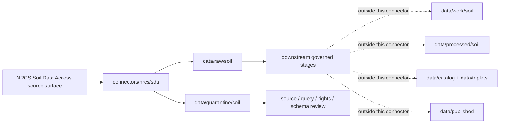

<!-- [KFM_META_BLOCK_V2]
doc_id: kfm://doc/connectors-nrcs-sda-readme
title: connectors/nrcs/sda/ — NRCS Soil Data Access Connector Lane
type: readme
version: v0.1
status: draft
owners: OWNER_TBD — Source steward · Connector steward · NRCS steward · Soil steward · Agriculture steward · Hydrology steward · Data steward · Validation steward · Docs steward
created: 2026-06-20
updated: 2026-06-20
policy_label: public; query-source; receipt-required; source-admission-only
related:
  - ../README.md
  - ../../../docs/doctrine/directory-rules.md
  - ../../../docs/sources/catalog/nrcs.md
  - ../../../docs/sources/catalog/nrcs/README.md
  - ../../../docs/sources/catalog/nrcs/soil-data-access.md
  - ../../../docs/sources/catalog/nrcs/ssurgo.md
  - ../../../docs/sources/catalog/nrcs/gssurgo.md
  - ../../../docs/sources/catalog/nrcs/web-soil-survey.md
  - ../../../connectors/nrcs-ssurgo/README.md
  - ../../../pipelines/domains/soil/ssurgo_ingest/README.md
  - ../../../docs/domains/soil/README.md
  - ../../../docs/domains/agriculture/README.md
  - ../../../docs/domains/hydrology/README.md
  - ../../../data/registry/sources/
  - ../../../data/raw/
  - ../../../data/quarantine/
  - ../../../data/receipts/
  - ../../../data/proofs/
  - ../../../policy/rights/
  - ../../../policy/sensitivity/
  - ../../../release/
tags: [kfm, connectors, nrcs, sda, soil-data-access, soil-data-mart, ssurgo, statsgo2, query, sql, rest, soil, agriculture, hydrology, source-admission, raw, quarantine, receipt, governance]
notes:
  - "Nested connector lane for NRCS Soil Data Access intake under the canonical connectors/nrcs/ family."
  - "This README defines a connector/source-admission boundary, not source-family truth, product doctrine, Soil domain truth, schema authority, policy authority, or public release."
  - "Product doctrine exists at docs/sources/catalog/nrcs/soil-data-access.md; source descriptors remain the authority for role, rights, cadence, sensitivity, and activation state."
  - "SDA query text, parameters, endpoint, result metadata, retrieval timestamp, digest, and receipt linkage must be preserved."
  - "Connector output may enter raw or quarantine admission lanes only."
  - "SDA query responses must not be collapsed with SSURGO bulk packages, gSSURGO rasters, gNATSGO products, Web Soil Survey session exports, field verification, or downstream interpreted soil claims."
[/KFM_META_BLOCK_V2] -->

<a id="top"></a>

# NRCS Soil Data Access Connector

> Nested source-specific intake and admission lane for USDA NRCS Soil Data Access query results under the canonical `connectors/nrcs/` connector family.

<p>
  
  
  
  
  
  
</p>

`connectors/nrcs/sda/`

## Scope

`connectors/nrcs/sda/` is the nested product-specific connector lane for NRCS Soil Data Access source intake and admission helpers.

This folder may contain connector-local documentation, source-admission helpers, bounded query helpers, query-manifest builders, response parsers, schema-drift checks, no-network fixture pointers, checksum/digest helpers, and raw/quarantine output adapters for SDA query results.

It must not become NRCS source-family truth, SDA product doctrine, Soil domain doctrine, SSURGO bulk package logic, field verification, crop/yield truth, hydrology truth, engineering design authority, regulatory determination authority, policy authority, schema authority, catalog/triplet authority, proof authority, release authority, pipeline authority, public API behavior, or public UI behavior.

> [!IMPORTANT]
> **Status:** draft / `NEEDS VERIFICATION`  
> **Owner:** `OWNER_TBD`  
> **Path:** `connectors/nrcs/sda/`  
> **Truth posture:** the path exists in the repository as this README; source activation, endpoint behavior, query allowlists, tests, fixtures, CI wiring, rights status, parser behavior, schema-drift handling, and release behavior remain `NEEDS VERIFICATION`.

---

## Repo fit

```text
connectors/
└── nrcs/
    ├── README.md
    └── sda/
        └── README.md
```

Related responsibility roots:

```text
connectors/nrcs/                              # canonical NRCS connector-family lane
connectors/nrcs/sda/                          # nested SDA connector lane
docs/sources/catalog/nrcs/soil-data-access.md # SDA source-product doctrine and caveats
docs/sources/catalog/nrcs.md                  # NRCS source-family profile
docs/sources/catalog/nrcs/ssurgo.md           # SSURGO source-product counterpart
docs/sources/catalog/nrcs/gssurgo.md          # gSSURGO gridded counterpart
connectors/nrcs-ssurgo/                       # draft sibling SSURGO connector lane
pipelines/domains/soil/ssurgo_ingest/         # downstream executable soil ingest, not connector-owned
docs/domains/soil/                            # soil domain meaning and lifecycle context
docs/domains/agriculture/                     # agricultural suitability context
docs/domains/hydrology/                       # drainage, runoff, hydric soils, and water-context interpretation
data/registry/sources/                        # source descriptors and activation state
data/raw/soil/                                # raw staged SDA response outputs
data/quarantine/soil/                         # held material requiring source/role/query/rights review
data/receipts/                                # query, ingest, checksum, transform, and aggregation receipts
data/proofs/                                  # EvidenceBundles and proof packs
policy/rights/                                # terms, attribution, and source-use review
policy/sensitivity/                           # parcel-like, ecology, cultural, and release rules
release/                                      # release decisions, manifests, rollback, correction state
```

---

## Relationship to NRCS soil products

| Product lane | Relationship | Connector posture |
|---|---|---|
| SDA | Programmatic query surface over the Soil Data Mart. | Preserve query text, parameters, endpoint, response metadata, timestamp, and digest as receipt-backed evidence. |
| SSURGO | Static/vector soil survey source packages. | Do not treat an SDA query response as a replacement for full SSURGO package lineage unless downstream gates accept it. |
| STATSGO2 | Generalized national soil content available through SDA surfaces. | Preserve generalized-scale caveats and do not use as parcel or detailed county-feature proof. |
| gSSURGO / gNATSGO | Gridded soil products. | Do not collapse query responses with gridded products; preserve product identity and join assumptions. |
| Web Soil Survey | Human-facing AOI/session surface. | Do not treat WSS session exports as silent SDA source truth. |

---

## Lifecycle sketch



> [!CAUTION]
> Connector code admits query responses. It does not normalize soil records into domain truth, publish map layers, answer public claims, decide policy, or decide release state. Promotion remains a governed state transition, not a file move.

---

## Authority boundary

```text
OUTPUT LIMIT:
  data/raw/soil/<source_id>/<run_id>/
  data/quarantine/soil/<source_id>/<run_id>/

NOT HERE:
  NRCS source-family truth
  SDA product doctrine
  Soil domain object meaning
  executable normalization pipeline
  field verification
  crop/yield truth
  hydrology truth
  engineering design truth
  regulatory determination authority
  source descriptor authority
  rights or sensitivity policy
  processed soil records
  catalog records
  triplet records
  public map artifacts
  receipts/proofs as authority
  release decisions
  public API behavior
  public UI behavior
```

---

## Inputs

| Accepted item | Required posture |
|---|---|
| Query manifest helper | Preserve endpoint, query text, parameters, output format, timestamp, caller/tool version, and source descriptor reference. |
| Request helper | Preserve redacted request metadata, response status, response headers when useful, retry behavior, and retrieval time. |
| Response parser | Preserve table names, field names, values, units where present, row counts, ordering assumptions, and missing-value conventions. |
| Join helper | Preserve MUKEY and other product-native keys; do not hide join assumptions. |
| Schema-drift helper | Detect changed columns, missing columns, type changes, and unexpected table shapes. |
| Digest helper | Preserve query digest, response digest, and fixture digest for receipt linkage. |
| Rights/citation helper | Preserve source terms, citation, attribution posture, and review status. |

---

## Exclusions

| Do not store here | Correct home |
|---|---|
| NRCS source-family doctrine | `docs/sources/catalog/nrcs.md` and `docs/sources/catalog/nrcs/` |
| SDA product doctrine | `docs/sources/catalog/nrcs/soil-data-access.md` |
| SSURGO/SDA normalization logic | `pipelines/domains/soil/` or accepted pipeline home |
| Authoritative `SourceDescriptor` records | `data/registry/sources/` |
| Soil, Agriculture, or Hydrology doctrine | `docs/domains/` under owning domain lanes |
| Rights, sensitivity, or release policy | `policy/`, `policy/sensitivity/`, `release/` |
| Processed soil records or derived rollups | `data/processed/` |
| Catalog or triplet records | `data/catalog/`, `data/triplets/` |
| Public map artifacts | `data/published/` after governed release |
| Receipts and proof packs as authority | `data/receipts/`, `data/proofs/` |
| Schemas or semantic contracts | `schemas/`, `contracts/` |
| Public UI or API behavior | `apps/governed-api/`, `apps/explorer-web/` |

---

## Admission posture

SDA intake should preserve source identity, source descriptor reference, endpoint, query text, parameters, output format, retrieval time, response status, response metadata, query digest, response digest, table names, field names, row counts, MUKEY or other join keys, units where present, missing-value conventions, schema-drift status, rights/citation posture, domain routing hint, and quarantine reason when review is required.

---

## Anti-collapse posture

| Rule | Connector implication |
|---|---|
| Query response is not full source package. | Preserve query scope and parameters; do not imply full SSURGO coverage. |
| Query result is not processed soil truth. | Admit source responses only; domain normalization belongs downstream. |
| Query text is evidence. | Store normalized query text or digest so the result can be traced and reviewed. |
| Join assumptions matter. | Preserve MUKEY and other keys; do not hide table-join logic. |
| Schema drift matters. | Changed fields or table shape must route to review. |
| SDA is not gSSURGO/gNATSGO. | Keep query responses separate from gridded product packages. |
| SDA is not field verification. | Do not treat query values as current point-observed field condition. |
| Public display is downstream. | The connector must not build public tiles, UI layers, soil claims, compliance claims, or release payloads. |

---

## Validation

Before relying on this connector, verify source descriptors, current endpoint behavior, query allowlists, rights/citation posture, query/response digest handling, parser behavior, schema-drift checks, row-count checks, MUKEY preservation, no-network tests, raw/quarantine-only output paths, downstream receipts/proofs, and release gates.

---

## Definition of done

- [ ] Owners are confirmed and `OWNER_TBD` is replaced.
- [ ] Nested placement is ratified or recorded in the drift/open-question register.
- [ ] Actual connector contents are inventoried.
- [ ] NRCS SDA `SourceDescriptor` IDs and source-family activation are verified.
- [ ] NRCS rights, citation, attribution, source terms, endpoint, allowed query forms, and product posture are documented.
- [ ] Query helpers preserve endpoint, query text, parameters, output format, retrieval time, response status, and digest.
- [ ] Parsers preserve table names, field names, row counts, MUKEY or product-native join fields, units, missing values, and schema-drift findings.
- [ ] Tests prevent silent conversion of SDA responses into full SSURGO package truth, field verification, crop/yield truth, hydrology truth, engineering design truth, or public release.
- [ ] Outputs are verified to enter only raw or quarantine admission lanes.
- [ ] No source-family, domain, processed, catalog, triplet, published, release, schema, policy, proof, receipt, registry, fixture, report, API, UI, tile, compliance, or regulatory authority lives here.
- [ ] Tests, fixtures, and CI behavior are verified or marked `NEEDS VERIFICATION`.

---

## Status summary

`connectors/nrcs/sda/` is for NRCS Soil Data Access source-admission code only. It is not source-family truth, SDA product doctrine, Soil domain truth, full SSURGO package truth, field verification, crop/yield truth, hydrology truth, engineering design truth, regulatory authority, policy authority, schema authority, catalog/triplet authority, proof closure, release authority, public map authority, public API behavior, public UI behavior, or pipeline authority.

<p align="right"><a href="#top">Back to top</a></p>
