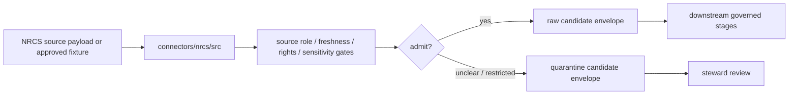

<!-- [KFM_META_BLOCK_V2]
doc_id: kfm://doc/connectors-nrcs-src-readme
title: connectors/nrcs/src/ — NRCS Connector Source Root
type: readme
version: v0.1
status: draft
owners: OWNER_TBD — Connector steward · Source steward · NRCS steward · Soil steward · Agriculture steward · Hydrology steward · Ecology steward · Climate steward · Data steward · Validation steward · Docs steward
created: 2026-06-20
updated: 2026-06-20
policy_label: public-doctrine; source-root; import-safe; source-admission-only
related:
  - ../README.md
  - ./nrcs/README.md
  - ../sda/README.md
  - ../scan/README.md
  - ../gssurgo/README.md
  - ../gnatsgo/README.md
  - ../../../connectors/nrcs-ssurgo/README.md
  - ../../../connectors/nrcs-scan/README.md
  - ../../../docs/doctrine/directory-rules.md
  - ../../../docs/sources/catalog/nrcs.md
  - ../../../docs/sources/catalog/nrcs/README.md
  - ../../../docs/sources/catalog/nrcs/soil-data-access.md
  - ../../../docs/sources/catalog/nrcs/scan-soil-climate.md
  - ../../../docs/sources/catalog/nrcs/gssurgo.md
  - ../../../docs/sources/catalog/nrcs/ssurgo.md
  - ../../../docs/domains/soil/README.md
  - ../../../docs/domains/agriculture/README.md
  - ../../../docs/domains/hydrology/README.md
  - ../../../data/registry/sources/
  - ../../../data/raw/
  - ../../../data/quarantine/
  - ../../../data/receipts/
  - ../../../data/proofs/
  - ../../../policy/rights/
  - ../../../policy/sensitivity/
  - ../../../release/
tags: [kfm, connectors, nrcs, source-root, python, source-admission, import-safe, no-network-default, ssurgo, gssurgo, gnatsgo, sda, scan, soil, agriculture, hydrology, raw, quarantine, governance]
notes:
  - "Source-code root for NRCS connector implementation under connectors/nrcs/."
  - "This README documents the source-root boundary only; actual package files, module names, tests, fixtures, package metadata, and CI wiring remain NEEDS VERIFICATION until inspected."
  - "Code below this root may prepare NRCS source material for raw or quarantine admission envelopes only."
  - "Importable package details belong in connectors/nrcs/src/nrcs/README.md."
  - "Import and module discovery must be side-effect-free: no live network calls, no secret reads, no lifecycle writes, no publication, and no public claims."
  - "Source-family and product doctrine belong under docs/sources/catalog/nrcs.md and docs/sources/catalog/nrcs/; SourceDescriptors remain authoritative for role, rights, cadence, sensitivity, and activation state."
[/KFM_META_BLOCK_V2] -->

<a id="top"></a>

# NRCS Connector Source Root

> Source-code root for NRCS connector implementation under `connectors/nrcs/`.

<p>
  
  
  
  
  
  
</p>

`connectors/nrcs/src/`

## Scope

`connectors/nrcs/src/` is the source-code root for NRCS connector implementation code.

This source root may contain the importable `nrcs` package, package-local documentation, source-admission helper code, product parser code, bounded request/client code, and internal connector modules that support raw/quarantine admission envelopes for NRCS source material.

It must not become NRCS source-family truth, NRCS product doctrine, Soil domain doctrine, source descriptor authority, schema authority, rights policy authority, sensitivity policy authority, release authority, public API behavior, public UI behavior, processed-data logic, catalog/triplet authority, proof authority, or publication authority.

> [!IMPORTANT]
> **Status:** draft / `NEEDS VERIFICATION`  
> **Owner:** `OWNER_TBD`  
> **Path:** `connectors/nrcs/src/`  
> **Truth posture:** the path exists in the repository as this README; actual source files, modules, imports, package metadata, dependency wiring, tests, fixtures, and CI behavior remain `NEEDS VERIFICATION`.

---

## Repo fit

```text
connectors/
└── nrcs/
    ├── README.md
    ├── src/
    │   ├── README.md
    │   └── nrcs/
    │       └── README.md
    ├── sda/
    │   └── README.md
    ├── scan/
    │   └── README.md
    ├── gssurgo/
    │   └── README.md
    └── gnatsgo/
        └── README.md
```

Related responsibility roots:

```text
connectors/nrcs/                         # canonical NRCS connector-family lane
connectors/nrcs/src/                     # this source-code root
connectors/nrcs/src/nrcs/                # importable package boundary
docs/sources/catalog/nrcs.md             # NRCS source-family profile
docs/sources/catalog/nrcs/               # NRCS product doctrine
data/registry/sources/                   # source descriptors and activation state
data/raw/                                # raw staged source outputs by owning domain
data/quarantine/                         # held material requiring source/role/rights/sensitivity review
data/receipts/                           # ingest, checksum, query, package, transform, and aggregation receipts
data/proofs/                             # EvidenceBundles and proof packs
policy/rights/                           # terms, attribution, and source-use review
policy/sensitivity/                      # release and sensitivity review rules
release/                                 # release decisions, manifests, rollback, correction state
```

---

## Source-root contract

Code below this root should be organized as connector implementation support. It may prepare source-admission envelopes, but it must not decide downstream truth or release.

Required behavior:

- importing modules is safe by default;
- no network calls at import time;
- no credential, token, cookie, or private session reads at import time;
- no filesystem writes at import time;
- no lifecycle writes to raw, quarantine, work, processed, catalog, triplet, published, receipt, proof, release, API, UI, or tile stores at import time;
- live source access is explicit and descriptor-gated;
- parser functions accept supplied payloads or fixtures;
- raw/quarantine handoff envelopes include source references, digests, product identity, and review flags;
- policy, schema, descriptor, proof, and release authority remain external.

---

## Expected contents

Actual contents are **NEEDS VERIFICATION**. A future source root may include:

```text
connectors/nrcs/src/
├── README.md
└── nrcs/
    ├── README.md
    ├── __init__.py
    ├── config.py
    ├── client.py
    ├── descriptors.py
    ├── source_roles.py
    ├── freshness.py
    ├── rights.py
    ├── sensitivity.py
    ├── digest.py
    ├── envelope.py
    ├── errors.py
    └── products/
        ├── sda.py
        ├── scan.py
        ├── ssurgo.py
        ├── gssurgo.py
        └── gnatsgo.py
```

Do not treat this layout as implementation proof until the repo tree, package metadata, imports, tests, and CI are inspected.

---

## Product responsibilities

| Product lane | Source-root responsibility |
|---|---|
| SDA | Preserve endpoint, query text, parameters, response metadata, table names, row counts, MUKEY/join fields, schema-drift findings, and digest. |
| SCAN | Preserve station ID, network, timestamp, sensor depth, variable, units, quality flags, cadence, freshness, Tribal SCAN posture, source URL, and digest. |
| SSURGO | Preserve survey area, package date, package files, spatial layers, table names, MUKEY/COKEY/CHKEY lineage, scale caveats, source URL, and digest. |
| gSSURGO | Preserve product identity, native grid, CRS, resolution, MUKEY joins, source-survey vintage, SoilTimeCaveat, and digest. |
| gNATSGO | Preserve product identity, native grid, CRS, resolution, product-native join fields, national-scale/generalization caveats, and digest. |

---

## Lifecycle handoff



This source root should return handoff envelopes or finite errors. It should not write lifecycle stores directly unless a connector runner owns the write and records receipts.

---

## Anti-collapse rules

| Rule | Source-root implication |
|---|---|
| NRCS-wide role collapse is forbidden. | Product-specific descriptors, roles, cadence, scale, and caveats must remain separate. |
| Import is not activation. | Importing code must not prove source activation or availability. |
| Query response is not full source package. | SDA query scope and parameters must remain visible. |
| Station is not area truth. | SCAN readings must not become county, watershed, or raster truth without downstream receipts. |
| Gridded products are not field verification. | gSSURGO/gNATSGO cells are source products, not current point-observed field conditions. |
| SSURGO package is not processed soil truth. | Normalization and release belong downstream. |
| Policy and release are external. | Code may flag review needs but must not decide public release. |

---

## Validation

Before relying on this source root, verify actual source files, package metadata, import paths, dependency configuration, no-network import behavior, descriptor gates, rights and sensitivity gates, product parsers, no-network tests, fixture approval, raw/quarantine-only envelope creation, and CI wiring.

---

## Definition of done

- [ ] Owners are confirmed and `OWNER_TBD` is replaced.
- [ ] Actual source files and package/module names are inventoried.
- [ ] Importing source modules performs no network, secret, cache, publication, or unsafe filesystem side effects.
- [ ] Source descriptors and activation decisions are required before live access.
- [ ] Rights, citation, attribution, source-role, freshness, and sensitivity gates fail closed.
- [ ] Product parsers preserve native fields, caveats, lineage, query/package/station/raster metadata, and digests.
- [ ] Output is limited to raw or quarantine admission envelopes.
- [ ] Tests cover no-network defaults, malformed inputs, stale sources, role collapse, schema drift, and public-release misuse paths.
- [ ] CI behavior is verified or marked `NEEDS VERIFICATION`.

---

## Status summary

`connectors/nrcs/src/` is for NRCS connector source code only. It is not NRCS source-family truth, product doctrine, Soil domain truth, source descriptor authority, schema authority, policy authority, proof closure, release authority, public map authority, public API behavior, public UI behavior, or pipeline authority.

<p align="right"><a href="#top">Back to top</a></p>
