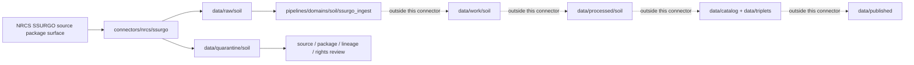

<!-- [KFM_META_BLOCK_V2]
doc_id: kfm://doc/connectors-nrcs-ssurgo-nested-readme
title: connectors/nrcs/ssurgo/ — NRCS SSURGO Nested Connector Lane
type: readme
version: v0.1
status: draft
owners: OWNER_TBD — Source steward · Connector steward · NRCS steward · Soil steward · Agriculture steward · Hydrology steward · Data steward · Validation steward · Docs steward
created: 2026-06-20
updated: 2026-06-20
policy_label: public; soil-survey-source; not-field-verification; source-admission-only
related:
  - ../README.md
  - ../../nrcs-ssurgo/README.md
  - ../../../docs/doctrine/directory-rules.md
  - ../../../docs/sources/catalog/nrcs.md
  - ../../../docs/sources/catalog/nrcs/README.md
  - ../../../docs/sources/catalog/nrcs/ssurgo.md
  - ../../../docs/sources/catalog/nrcs/soil-data-access.md
  - ../../../docs/sources/catalog/nrcs/gssurgo.md
  - ../../../connectors/nrcs/sda/README.md
  - ../../../connectors/nrcs/gssurgo/README.md
  - ../../../pipelines/domains/soil/ssurgo_ingest/README.md
  - ../../../docs/domains/soil/README.md
  - ../../../docs/domains/agriculture/README.md
  - ../../../docs/domains/hydrology/README.md
  - ../../../data/registry/sources/
  - ../../../data/raw/
  - ../../../data/quarantine/
  - ../../../data/receipts/
  - ../../../data/proofs/
  - ../../../policy/rights/
  - ../../../policy/sensitivity/
  - ../../../release/
tags: [kfm, connectors, nrcs, ssurgo, soil-survey, soil-data-access, gssurgo, soil, agriculture, hydrology, map-unit, component, horizon, mukey, cokey, chkey, source-admission, raw, quarantine, governance]
notes:
  - "Nested connector lane for NRCS SSURGO source intake under the canonical connectors/nrcs/ family."
  - "This file does not delete, move, or supersede the draft sibling connectors/nrcs-ssurgo/README.md; sibling versus nested placement remains an ADR or migration-note question."
  - "Source-product doctrine exists at docs/sources/catalog/nrcs/ssurgo.md; source descriptors remain the authority for role, rights, cadence, sensitivity, and activation state."
  - "Connector output may enter raw or quarantine admission lanes only."
  - "SSURGO source packages are official soil-survey source material, not processed Soil-domain truth, field verification, parcel truth, crop/yield truth, hydrology truth, engineering design truth, regulatory determination, or public release by themselves."
  - "Survey area, package vintage, map-unit geometry, MUKEY/COKEY/CHKEY lineage, table relationships, scale caveats, source URL, and digest must be preserved."
[/KFM_META_BLOCK_V2] -->

<a id="top"></a>

# NRCS SSURGO Nested Connector

> Nested source-specific intake and admission lane for USDA NRCS Soil Survey Geographic Database source packages under the canonical `connectors/nrcs/` connector family.

<p>
  
  
  
  
  
  
</p>

`connectors/nrcs/ssurgo/`

## Scope

`connectors/nrcs/ssurgo/` is the nested product-specific connector lane for NRCS SSURGO source intake and admission helpers.

This folder may contain connector-local documentation, source-admission helpers, survey-area manifest builders, package download helpers, package metadata parsers, spatial/tabular package inventory helpers, checksum/digest helpers, no-network fixture pointers, and raw/quarantine output adapters for SSURGO source packages.

It must not become NRCS source-family truth, SSURGO product doctrine, Soil domain doctrine, executable SSURGO normalization, field verification, crop/yield truth, hydrology truth, engineering design authority, regulatory determination authority, policy authority, schema authority, catalog/triplet authority, proof authority, release authority, pipeline authority, public API behavior, or public UI behavior.

> [!IMPORTANT]
> **Status:** draft / `NEEDS VERIFICATION`  
> **Owner:** `OWNER_TBD`  
> **Path:** `connectors/nrcs/ssurgo/`  
> **Truth posture:** the path exists in the repository as this README; source activation, endpoint behavior, package inventory, tests, fixtures, CI wiring, rights status, parser behavior, checksum handling, sibling-lane migration, and release behavior remain `NEEDS VERIFICATION`.

---

## Repo fit

```text
connectors/
└── nrcs/
    ├── README.md
    ├── ssurgo/
    │   └── README.md
    ├── sda/
    │   └── README.md
    └── gssurgo/
        └── README.md
```

Related responsibility roots:

```text
connectors/nrcs/                         # canonical NRCS connector-family lane
connectors/nrcs/ssurgo/                  # nested SSURGO connector lane
connectors/nrcs-ssurgo/                  # draft sibling lane; placement/migration question
docs/sources/catalog/nrcs/ssurgo.md      # SSURGO source-product doctrine and caveats
docs/sources/catalog/nrcs/soil-data-access.md # SDA query surface counterpart
docs/sources/catalog/nrcs/gssurgo.md     # gridded derivative counterpart
pipelines/domains/soil/ssurgo_ingest/    # downstream executable normalization, not connector-owned
data/registry/sources/                   # source descriptors and activation state
data/raw/soil/                           # raw staged source package outputs
data/quarantine/soil/                    # held material requiring source/role/rights/lineage review
data/receipts/                           # ingest, checksum, package, transform, and aggregation receipts
data/proofs/                             # EvidenceBundles and proof packs
policy/rights/                           # terms, attribution, and source-use review
policy/sensitivity/                      # release and sensitivity review rules
release/                                 # release decisions, manifests, rollback, correction state
```

---

## Relationship to sibling lane

This nested lane exists because `connectors/nrcs/` is the canonical NRCS connector-family home and the family README allows nested product-specific lanes if placement is ratified by Directory Rules, ADR, or migration note.

| Path | Status | Use |
|---|---|---|
| `connectors/nrcs/README.md` | `CONFIRMED` parent family README | NRCS connector-family boundary and product-lane index. |
| `connectors/nrcs/ssurgo/README.md` | `CONFIRMED` after this update | Nested product-lane boundary for SSURGO under the NRCS family. |
| `connectors/nrcs-ssurgo/README.md` | Existing draft sibling lane | Keep as draft/sibling reference until ADR or migration note decides final placement. |

No move, delete, rename, redirect, or deprecation is implied by this README.

---

## Relationship to NRCS soil products

| Product lane | Relationship | Connector posture |
|---|---|---|
| SSURGO | Static vector soil survey packages plus relational tabular attributes. | Preserve survey area, package vintage, spatial layers, table relationships, MUKEY/COKEY/CHKEY lineage, and scale caveats. |
| SDA | Programmatic query surface over the Soil Data Mart. | Do not treat live query results as a replacement for full SSURGO package lineage without downstream receipts. |
| gSSURGO | Gridded raster derivative of SSURGO map-unit mapping. | Preserve derivative product identity and do not collapse raster and vector/package lineages. |
| gNATSGO / STATSGO2 | National or generalized soil products. | Preserve generalized-scale caveats and do not use as detailed SSURGO package proof. |

---

## Lifecycle sketch



> [!CAUTION]
> Connector code admits source packages. It does not normalize MUKEY/COKEY/CHKEY records into domain truth, publish map layers, answer public claims, decide policy, or decide release state. Promotion remains a governed state transition, not a file move.

---

## Authority boundary

```text
OUTPUT LIMIT:
  data/raw/soil/<source_id>/<run_id>/
  data/quarantine/soil/<source_id>/<run_id>/

NOT HERE:
  NRCS source-family truth
  SSURGO product doctrine
  Soil domain object meaning
  executable normalization pipeline
  field verification
  crop/yield truth
  hydrology truth
  engineering design truth
  regulatory determination authority
  source descriptor authority
  rights or sensitivity policy
  processed soil records
  catalog records
  triplet records
  public map artifacts
  receipts/proofs as authority
  release decisions
  public API behavior
  public UI behavior
```

---

## Inputs

| Accepted item | Required posture |
|---|---|
| Survey-area manifest helper | Preserve survey area symbol/name, state, package source, package date, package URL, file names, size, and retrieval time. |
| Package download helper | Preserve source URL, response status, file identity, compression, and content digest. |
| Spatial package helper | Preserve shapefile/geodatabase identity, coordinate system, geometry layer names, map-unit keys, and source package metadata. |
| Tabular package helper | Preserve table names, relationship files, import assumptions, encoding, field names, and source package metadata. |
| Metadata parser | Preserve metadata links, survey area, source vintage, and package documentation references. |
| Lineage helper | Preserve MUKEY, COKEY, CHKEY, component-horizon relationships, and source-table relationship context. |
| Rights/citation helper | Preserve source terms, citation, attribution posture, and review status. |

---

## Exclusions

| Do not store here | Correct home |
|---|---|
| NRCS source-family doctrine | `docs/sources/catalog/nrcs.md` and `docs/sources/catalog/nrcs/` |
| SSURGO source-product doctrine | `docs/sources/catalog/nrcs/ssurgo.md` |
| SSURGO normalization logic | `pipelines/domains/soil/ssurgo_ingest/` or accepted pipeline home |
| Authoritative `SourceDescriptor` records | `data/registry/sources/` |
| Soil, Agriculture, or Hydrology doctrine | `docs/domains/` under owning domain lanes |
| Rights, sensitivity, or release policy | `policy/`, `policy/sensitivity/`, `release/` |
| Processed soil records or derived rollups | `data/processed/` |
| Catalog or triplet records | `data/catalog/`, `data/triplets/` |
| Public map artifacts | `data/published/` after governed release |
| Receipts and proof packs as authority | `data/receipts/`, `data/proofs/` |
| Schemas or semantic contracts | `schemas/`, `contracts/` |
| Public UI or API behavior | `apps/governed-api/`, `apps/explorer-web/` |

---

## Admission posture

SSURGO intake should preserve source identity, source descriptor reference, survey area symbol, survey area name, state, package date, package vintage, source URL, package files, compression, file identity, size, checksum, retrieval time, spatial layer names, coordinate system, geometry type, map-unit keys, table names, relationship files, field names, row counts when available, MUKEY, COKEY, CHKEY, component-horizon relationship context, map scale, survey-area extent, rights/citation posture, and quarantine reason when review is required.

---

## Anti-collapse posture

| Rule | Connector implication |
|---|---|
| Survey area package is not processed soil truth. | Admit source packages only; domain normalization belongs downstream. |
| Map unit is not a single soil component. | Preserve component proportions and minor components; do not collapse MUKEY directly to one soil series. |
| Component is not horizon. | Preserve COKEY/CHKEY hierarchy and component-horizon relationships. |
| Scale matters. | Preserve source scale and intended-use caveats; do not overstate precision. |
| SSURGO is not field verification. | Do not treat survey data as proof of current observed field condition at a point. |
| Soil interpretation is not regulatory determination. | Farmland, hydric, limitation, flooding-frequency, or engineering ratings need proper context and downstream gates. |
| gSSURGO and SDA are separate lanes. | Preserve raster derivative and query-response lineage separately. |
| Public display is downstream. | The connector must not build public tiles, UI layers, soil claims, compliance claims, or release payloads. |

---

## Validation

Before relying on this connector, verify source descriptors, current package source behavior, package digests, survey-area inventory, rights/citation posture, parser behavior, CRS/geometry handling, table relationship handling, MUKEY/COKEY/CHKEY preservation, no-network tests, raw/quarantine-only output paths, downstream receipts/proofs, and release gates.

---

## Definition of done

- [ ] Owners are confirmed and `OWNER_TBD` is replaced.
- [ ] Nested versus sibling placement is resolved or recorded in the drift/open-question register.
- [ ] Actual connector contents are inventoried.
- [ ] NRCS SSURGO `SourceDescriptor` IDs and source-family activation are verified.
- [ ] NRCS rights, citation, attribution, source terms, endpoint, package, and survey-area posture are documented.
- [ ] Manifest builders preserve survey area, source URL, package date, package vintage, file identity, size, compression, and digest.
- [ ] Parsers preserve geometry layers, table names, relationship files, MUKEY, COKEY, CHKEY, map scale, row counts, and source documentation references.
- [ ] Tests prevent silent conversion of SSURGO packages into field verification, crop/yield truth, hydrology truth, engineering design truth, regulatory truth, or public release.
- [ ] Outputs are verified to enter only raw or quarantine admission lanes.
- [ ] No source-family, domain, processed, catalog, triplet, published, release, schema, policy, proof, receipt, registry, fixture, report, API, UI, tile, compliance, or regulatory authority lives here.
- [ ] Tests, fixtures, and CI behavior are verified or marked `NEEDS VERIFICATION`.

---

## Status summary

`connectors/nrcs/ssurgo/` is for nested NRCS SSURGO source-admission code only. It is not source-family truth, SSURGO product doctrine, Soil domain truth, field verification, crop/yield truth, hydrology truth, engineering design truth, regulatory authority, policy authority, schema authority, catalog/triplet authority, proof closure, release authority, public map authority, public API behavior, public UI behavior, or pipeline authority.

<p align="right"><a href="#top">Back to top</a></p>
