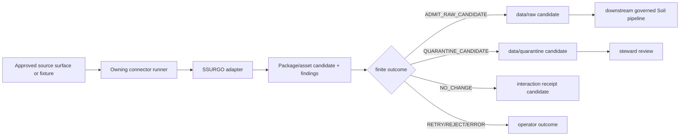

<!-- [KFM_META_BLOCK_V2]
doc_id: kfm://doc/connectors-nrcs-ssurgo-nested-readme
title: connectors/nrcs/ssurgo/ — NRCS SSURGO Nested Package-Admission and Lineage Boundary
type: readme
version: v0.2
status: draft; repository-grounded; nested-product-lane; implementation-placeholder; placement-conflicted; source-inactive; non-authoritative
owners: OWNER_TBD — Source steward · Connector steward · NRCS steward · Soil steward · Agriculture liaison · Hydrology liaison · Spatial/CRS reviewer · Rights reviewer · Sensitivity reviewer · Security steward · Validation steward · Contract steward · Schema steward · Receipt steward · Migration steward · CI steward · Docs steward
created: 2026-06-20
updated: 2026-07-15
supersedes: v0.1 planning-oriented nested SSURGO connector guide (2026-06-20)
policy_label: "public-doctrine; connector-boundary; nested-product-lane; nrcs; ssurgo; static-soil-survey; package-admission; placement-conflicted; source-inactive; descriptor-gated; no-network-by-default; fixture-first; archive-safe; lineage-preserving; scale-aware; vintage-aware; raw-quarantine-only; not-field-verification; not-parcel; no-publication; no-secrets; migration-required; rollback-aware"
current_path: connectors/nrcs/ssurgo/README.md
truth_posture: CONFIRMED target v0.1 README, merged NRCS source-root and namespace v0.2 contracts, NRCS family and test-root READMEs, kfm-connector-nrcs 0.0.0 placeholder metadata, empty package initializer, flat nrcs-ssurgo v0.2 compatibility boundary, standalone ssurgo v0.1 alias lane, draft SSURGO product page, three conflicting registry-shaped records, empty PROPOSED source-authority register, permissive empty SSURGO source-descriptor schema, missing referenced source-descriptor semantic contract, draft SoilMapUnit/SoilComponent/Horizon/ComponentHorizonJoin contracts, documentation-only downstream pipeline, absent pipeline spec, TODO-only connector workflow, and bounded absence of central SSURGO module, selected SSURGO tests, and connector-local fixture README / PROPOSED nested canonical-family candidate contract, topology freeze, acquisition/package profiles, archive safety, package and asset identity, spatial and tabular inventory, MUKEY/COKEY/CHKEY lineage checks, finite outcomes, fixture taxonomy, implementation sequence, correction, deprecation, migration, and rollback / CONFLICTED nested, flat, and standalone alias placement; source IDs and registry homes; authoritative_static_soil support label versus SourceDescriptor role vocabulary; source-descriptor schema and missing semantic contract; source-product documentation richness versus inactive machine authority; and documentation-rich package/pipeline plans versus absent executable implementation / UNKNOWN accepted canonical connector path, active SourceDescriptor, source activation, approved acquisition surfaces, package formats, current survey-area inventory, package-vintage model, rights, cadence, executable parser behavior, fixtures, tests, substantive CI, schedules, receipts, deployment, downstream consumers, and runtime health / NEEDS VERIFICATION owners, topology ADR or migration note, canonical source ID and registry home, source-role/support-type mapping, rights and attribution, acquisition allowlist, package and archive profile, spatial/tabular contracts, schemas, validators, fixture approval, test collection, CI gates, lifecycle routing, correction and supersession, deprecation, and rollback automation
evidence_snapshot:
  repository: bartytime4life/Kansas-Frontier-Matrix
  repository_id: "1059091169"
  visibility: public
  base_ref: main
  base_commit: bd957101efb7d9215719c45b107baacfd924ce79
  prior_blob: 601b919cf0627b69b21be317cd5e8086502be0bd
  flat_sibling_blob: a161b2aa80fa3192c0a007a04e000a43c07eba49
  standalone_alias_blob: bc6370b9206e22ce4f2657d9ce8fb28111244f40
  nrcs_family_blob: 888236f218fc0892c54c947c0c2651b34ca5137b
  nrcs_source_root_blob: 7edac87aec3ff4ed5621dedd5c31ebaa2b04759a
  nrcs_namespace_blob: 00d12e0f07e53cff877e9ea4d396c96b3fb03658
  nrcs_tests_blob: 7c65ba6ef85a8369e17c40d5e3fbc388b04a306b
  package_metadata_blob: c6bb1565db7df490bee52a597d04d694e2b9f8a4
  package_initializer_blob: e69de29bb2d1d6434b8b29ae775ad8c2e48c5391
  product_page_blob: 02955e076e2b2b621cf1229cd430b7094081b3a1
  soil_registry_placeholder_blob: 85fab71af52928888bc8bafb937063952a853552
  alternate_soil_registry_blob: 89da23fe70be089214de48f89ff3e56e8c6985b9
  agriculture_registry_placeholder_blob: e44bf499dd53588dd0d192a590ca97a98f7fe6e7
  source_authority_register_blob: 82c23722520922f5ca0dad7f37ed794d1c2edf81
  source_descriptor_schema_blob: 84ef1784e756c7b40874764e17fe6ae96fee98ac
  soil_map_unit_contract_blob: 9c062ace827754e328200080ad99f8dd2857dcac
  soil_component_contract_blob: abadd4efc4a68315bd3b32a035352d6ce23d1220
  horizon_contract_blob: b2af44430ed809d277d822865bc7c51e48881e40
  component_horizon_join_contract_blob: 0a7dd6ee4e11e1a8abe9adb84eebaa954e1880d9
  downstream_pipeline_readme_blob: eb457f55d6546219e0bc898dab85c4b76739a825
  source_admission_adr_blob: 0e8d03786bcc99b19f179680890df9e30a27633a
  directory_rules_blob: 2affb080e6f0043867c64c7f06c1ca52030fbd55
  connector_gate_workflow_blob: fc36ecced55bb0b4002d551cb28addfff0be918a
  bounded_path_checks:
    - connectors/nrcs/ssurgo/README.md existed at version v0.1 before this revision
    - connectors/nrcs-ssurgo/README.md exists at version v0.2 as a placement-conflicted sibling compatibility boundary
    - connectors/ssurgo/README.md exists at version v0.1 as a standalone product-name alias lane
    - connectors/nrcs/src/README.md and connectors/nrcs/src/nrcs/README.md are merged at version v0.2
    - connectors/nrcs/src/nrcs/__init__.py is empty
    - connectors/nrcs/src/nrcs/products/ssurgo.py was not found
    - connectors/nrcs/tests/test_ssurgo.py and test_ssurgo_manifest.py were not found
    - connectors/nrcs/tests/fixtures/ssurgo/README.md was not found
    - connectors/nrcs/pyproject.toml contains only project name kfm-connector-nrcs and version 0.0.0
    - data/registry/sources/soil/nrcs-ssurgo.yaml is a minimal PROPOSED placeholder
    - data/registry/soil/sources/nrcs_ssurgo.yaml is a PROPOSED/TBD template with a competing source ID and home
    - data/registry/sources/agriculture/ssurgo.yaml is a minimal PROPOSED domain inventory placeholder
    - control_plane/source_authority_register.yaml is PROPOSED and entries is empty
    - schemas/contracts/v1/domains/soil/ssurgo_source_descriptor.schema.json has properties {} and additionalProperties true
    - contracts/domains/soil/ssurgo_source_descriptor.md was not found
    - pipelines/domains/soil/ssurgo_ingest/README.md is documentation-led and draft
    - pipeline_specs/soil/ssurgo_ingest.yaml was not found
    - repository search for ssurgo_ingest returned the pipeline README and documentation references, not an executable entrypoint
    - .github/workflows/connector-gate.yml contains TODO echo steps
related:
  - ../README.md
  - ../src/README.md
  - ../src/nrcs/README.md
  - ../tests/README.md
  - ../pyproject.toml
  - ../sda/README.md
  - ../gssurgo/README.md
  - ../gnatsgo/README.md
  - ../../nrcs-ssurgo/README.md
  - ../../ssurgo/README.md
  - ../../../docs/doctrine/directory-rules.md
  - ../../../docs/adr/ADR-0017-source-descriptor-admission-process.md
  - ../../../docs/sources/catalog/nrcs/ssurgo.md
  - ../../../control_plane/source_authority_register.yaml
  - ../../../data/registry/sources/soil/nrcs-ssurgo.yaml
  - ../../../data/registry/soil/sources/nrcs_ssurgo.yaml
  - ../../../data/registry/sources/agriculture/ssurgo.yaml
  - ../../../schemas/contracts/v1/domains/soil/ssurgo_source_descriptor.schema.json
  - ../../../contracts/domains/soil/soil_map_unit.md
  - ../../../contracts/domains/soil/soil_component.md
  - ../../../contracts/domains/soil/horizon.md
  - ../../../contracts/domains/soil/component_horizon_join.md
  - ../../../pipelines/domains/soil/ssurgo_ingest/README.md
  - ../../../data/raw/
  - ../../../data/quarantine/
  - ../../../data/receipts/
  - ../../../data/proofs/
  - ../../../policy/rights/
  - ../../../policy/sensitivity/
  - ../../../release/
  - ../../../.github/workflows/connector-gate.yml
tags: [kfm, connectors, nrcs, ssurgo, soil-survey, static-vector, survey-area, package, archive, spatial, tabular, MUKEY, COKEY, CHKEY, source-vintage, scale-aware, lineage-preserving, raw, quarantine, no-network, fixture-first, anti-collapse, correction, migration, rollback]
notes:
  - "This revision changes only connectors/nrcs/ssurgo/README.md."
  - "The nested path is the strongest responsibility-root candidate under the canonical NRCS family, but this README does not ratify migration, activate a source, or deprecate either sibling documentation lane."
  - "No central SSURGO product module, selected product test, connector-local fixture README, active SourceDescriptor, approved acquisition profile, executable pipeline, or substantive connector CI is established."
  - "A SSURGO package remains source-, collection-, survey-area-, package-, asset-, geometry-, table-, relationship-, key-, scale-, vintage-, retrieval-, digest-, and correction-scoped."
  - "SSURGO support type and SourceDescriptor authority role must remain separate fields until an accepted mapping contract exists."
  - "Connector activity is limited to explicit source admission and RAW or QUARANTINE candidate handoff."
[/KFM_META_BLOCK_V2] -->

<a id="top"></a>

# NRCS SSURGO Nested Package-Admission and Lineage Boundary

`connectors/nrcs/ssurgo/`

> Repository-present nested boundary for candidate USDA NRCS Soil Survey Geographic Database package admission under the canonical NRCS connector family. Current evidence establishes a README-only product lane—not an active source, approved acquisition profile, runnable connector, tested package parser, validated source descriptor, executable pipeline, or release-ready soil-survey workflow.


**Quick links:** [Purpose](#purpose) · [Status](#status-and-evidence) · [Authority](#authority-boundary) · [Directory basis](#directory-rules-and-topology) · [Invariants](#keystone-invariants) · [Product separation](#product-and-support-type-separation) · [Activation](#source-activation-and-admission-gate) · [Acquisition](#explicit-acquisition-profile) · [Transport](#transport-archive-and-security) · [Identity](#source-collection-survey-area-and-package-identity) · [Manifest](#package-and-asset-manifest) · [Spatial](#spatial-package-contract) · [Tabular](#tabular-package-contract) · [Lineage](#mukey-cokey-chkey-and-relationship-lineage) · [Types](#types-nulls-sentinels-and-encoding) · [Time](#time-vintage-correction-and-supersession) · [Scale](#scale-geometry-and-precision-boundary) · [Rights](#rights-sensitivity-and-disclosure) · [Outcomes](#connector-outcomes-and-reason-codes) · [Lifecycle](#raw-quarantine-and-receipt-handoff) · [Evidence](#evidence-proof-and-release-boundary) · [Testing](#testing-and-fixtures) · [Implementation](#smallest-sound-implementation-sequence) · [Done](#definition-of-done) · [Open](#open-verification-register) · [Validation](#validation-commands) · [Ledger](#evidence-ledger) · [Checklist](#maintainer-checklist) · [Rollback](#rollback-correction-deprecation-and-migration)

> [!IMPORTANT]
> **This README is not a source activation, acquisition allowlist, package-format approval, or placement decision.** Path presence does not establish an active `SourceDescriptor`, accepted source ID, approved endpoint or package surface, parser, fixtures, tests, receipts, schedule, CI enforcement, deployment, or publication readiness.

> [!CAUTION]
> **SSURGO is survey evidence, not parcel or current field truth.** A connector may preserve an official source package and its native lineage. It may not turn map units into parcels, components into horizons, survey scale into point precision, interpretations into regulatory determinations, or connector success into public release.

---

<a id="purpose"></a>

## Purpose

This README defines the allowed source-edge boundary for candidate SSURGO work under the established [`connectors/nrcs/`](../README.md) family root.

A future implementation associated with this lane may exist only after governance verifies:

1. the canonical connector path and compatibility treatment for the other two SSURGO lanes;
2. the accepted source and collection identity;
3. an admitted `SourceDescriptor`, authority-register entry, and activation decision;
4. approved acquisition surfaces, transport behavior, rights, attribution, and cadence;
5. package, archive, asset, spatial, tabular, relationship, key, scale, time, and correction profiles;
6. no-network fixtures and deterministic package inspection;
7. finite connector-local outcomes and reason codes;
8. RAW or QUARANTINE candidate handoff only;
9. substantive tests and CI enforcement;
10. correction, deprecation, migration, supersession, and rollback behavior.

Any allowed implementation must remain:

- subordinate to the `connectors/` source-admission responsibility root;
- subordinate to the NRCS family boundary;
- descriptor-gated and source-activation-aware;
- no-network by default;
- fixture-first and deterministic;
- explicit about acquisition, package, archive, spatial, tabular, and relationship profiles;
- bounded in redirects, timeouts, retries, payload bytes, archive members, decompression, file count, table count, feature count, and temporary-disk use;
- lossless about source, collection, survey area, package, asset, geometry, table, relationship, source-native key, scale, vintage, retrieval, digest, and correction context;
- limited to RAW or QUARANTINE admission candidates;
- separate from Soil normalization, weighted rollups, interpretation, evidence closure, catalog/triplet closure, release, public API, UI, map, notification, export, and AI behavior.

It must not become:

- NRCS or SSURGO doctrine;
- a source registry, authority register, or activation-decision store;
- a second schema or semantic-contract home;
- a general download proxy or archive-extraction service;
- an SSURGO normalization or aggregation pipeline;
- a parcel, ownership, access, field-condition, compliance, engineering, agronomic, hydrologic, or regulatory truth service;
- a receipt, proof, policy, release, or publication authority;
- a public API, UI, map, search, export, notification, or generated-answer surface.

[Back to top](#top)

---

<a id="status-and-evidence"></a>

## Status and evidence

### Current repository state

| Surface | Status | Safe conclusion |
|---|---:|---|
| This nested README | **CONFIRMED v0.1 before revision** | A nested documentation boundary exists. |
| [`connectors/nrcs/README.md`](../README.md) | **CONFIRMED family boundary** | NRCS is the documented canonical family spine. |
| [`connectors/nrcs/src/README.md`](../src/README.md) | **CONFIRMED v0.2** | The source envelope is implementation-empty and package discovery is unratified. |
| [`connectors/nrcs/src/nrcs/README.md`](../src/nrcs/README.md) | **CONFIRMED v0.2** | The central Python namespace has no accepted API or product adapters. |
| [`connectors/nrcs-ssurgo/`](../../nrcs-ssurgo/README.md) | **CONFIRMED v0.2 sibling boundary** | A second placement-conflicted SSURGO lane exists. |
| [`connectors/ssurgo/`](../../ssurgo/README.md) | **CONFIRMED v0.1 alias boundary** | A third standalone alias lane exists and is not canonical. |
| Package metadata | **CONFIRMED `0.0.0` placeholder** | Build backend, dependencies, discovery, and installability are not established. |
| Central `products/ssurgo.py` | **NOT FOUND at bounded path** | No executable SSURGO product adapter is established. |
| Selected SSURGO tests | **NOT FOUND at bounded paths** | Package-manifest and parser behavior are not proven. |
| Connector-local fixture README | **NOT FOUND at bounded path** | No approved connector fixture lane is established. |
| SSURGO product page | **CONFIRMED draft** | Reader-oriented doctrine exists, but current endpoint, format, rights, cadence, and runtime facts remain unverified. |
| Registry-shaped records | **CONFIRMED three unresolved records** | Source ID, registry home, role, rights, cadence, and activation are not settled. |
| Source-authority register | **CONFIRMED `PROPOSED` and empty** | Source activation is not established. |
| SSURGO source-descriptor schema | **CONFIRMED permissive scaffold** | It declares no properties and cannot enforce an operational descriptor. |
| Referenced descriptor contract | **NOT FOUND** | Semantic descriptor shape is unresolved. |
| Soil object contracts | **CONFIRMED detailed drafts** | Meaning is documented; package parsing and machine validation remain separate. |
| SSURGO pipeline README | **CONFIRMED draft documentation** | Downstream intent exists; executable pipeline behavior is not proven. |
| SSURGO pipeline spec | **NOT FOUND** | Declarative run configuration is not established. |
| Connector workflow | **CONFIRMED TODO-only** | A green run cannot prove package admission or receipt behavior. |

### Truth labels

| Label | Meaning here |
|---|---|
| **CONFIRMED** | Directly verified from current repository content or exact path checks. |
| **PROPOSED** | Candidate design, vocabulary, or placement requiring implementation and review. |
| **CONFLICTED** | Multiple current paths, records, or vocabularies express competing choices. |
| **UNKNOWN** | Runtime, upstream, or governance state was not established. |
| **NEEDS VERIFICATION** | Checkable before activation or release, but unresolved. |

[Back to top](#top)

---

<a id="authority-boundary"></a>

## Authority boundary

After governance admits the source and resolves topology, this lane may support:

- source-specific discovery from an accepted acquisition profile;
- bounded package retrieval;
- raw-byte integrity checks;
- safe archive inspection and extraction into an isolated temporary workspace;
- package-member inventory;
- spatial and tabular metadata inspection;
- source-native relationship and key preservation;
- deterministic RAW or QUARANTINE candidate construction;
- receipt-ready interaction facts returned to an owning runner.

It must not own:

| Excluded responsibility | Governing surface |
|---|---|
| Canonical connector path | Accepted ADR or migration note. |
| Source identity and activation | Authoritative `SourceDescriptor`, authority register, activation decision. |
| Source and product doctrine | `docs/sources/catalog/`. |
| Soil object meaning | `contracts/domains/soil/`. |
| Machine shape | `schemas/`. |
| Rights, sensitivity, and disclosure decisions | `policy/rights/`, `policy/sensitivity/`, reviewed policy outputs. |
| SSURGO normalization and weighted derivation | `pipelines/domains/soil/ssurgo_ingest/` or accepted executable home. |
| Lifecycle persistence and receipt emission | Owning runner and lifecycle/receipt roots. |
| EvidenceBundle and proof closure | Evidence and proof systems. |
| Catalog, triplet, and release closure | Catalog, triplet, review, and release systems. |
| Public APIs, maps, exports, and generated answers | Governed interfaces over released artifacts. |

The connector may identify that a policy or evidence decision is required. It may not make that decision by itself.

[Back to top](#top)

---

<a id="directory-rules-and-topology"></a>

## Directory Rules and topology

Directory Rules place source-specific fetch, probe, parse, and admission implementation under `connectors/`. The nested path is therefore the strongest responsibility-root fit because it is subordinate to the existing NRCS family spine.

Current topology is still conflicted:

```text
connectors/
├── nrcs/
│   └── ssurgo/
│       └── README.md       # this nested product boundary
├── nrcs-ssurgo/
│   └── README.md           # flat compatibility boundary
└── ssurgo/
    └── README.md           # standalone product-name alias boundary
```

### Freeze-by-default rule

Until an ADR or migration note is accepted:

- no lane may claim canonical executable ownership;
- no second SSURGO network client may be added;
- no duplicate `SourceDescriptor`, activation record, endpoint profile, fixture corpus, schedule, cache, receipt family, or run identity may be created;
- no imports may cross between competing lanes as an undocumented compatibility shortcut;
- the central `nrcs` package must not register two adapters for the same accepted source/product identity;
- the flat and alias lanes remain documentation-only unless explicitly classified as compatibility adapters;
- deleting or redirecting a lane requires a migration map and rollback target.

### Candidate future disposition

**PROPOSED:** If governance selects the nested lane:

1. executable code lives once under the central `nrcs` package;
2. this README remains the product boundary;
3. `connectors/nrcs-ssurgo/` becomes a documented compatibility/tombstone lane with no independent network, schedule, descriptor, or receipt authority;
4. `connectors/ssurgo/` becomes an alias/tombstone or is retired through a documented migration;
5. all consumers use one accepted source identity and one adapter registration.

This is a proposal, not a current repository fact.

[Back to top](#top)

---

<a id="keystone-invariants"></a>

## Keystone invariants

1. **Import is not activation.** Importing `nrcs` or a future SSURGO adapter proves neither source admission nor availability.
2. **Path presence is not implementation.** A README, placeholder schema, or proposed tree does not prove executable behavior.
3. **One product, one executable owner.** Competing documentation lanes must not become parallel live connectors.
4. **Descriptor before live access.** An admitted descriptor, authority entry, and activation decision are prerequisites.
5. **Fixture before network.** Deterministic no-network fixtures and tests precede live retrieval.
6. **Source role and support type remain separate.** `authoritative_static_soil` cannot silently replace a SourceDescriptor authority-role field.
7. **Package is not normalized Soil truth.** Connector output remains source material or a held candidate.
8. **Map unit is not component.** `MUKEY`, `COKEY`, component percentage, and one-to-many relationships remain visible.
9. **Component is not horizon.** `COKEY` and `CHKEY` lineage and depth context remain separate.
10. **Geometry is not parcel or field truth.** Survey polygons do not prove ownership, access, legal boundaries, or current point conditions.
11. **Scale and vintage remain visible.** Neither map scale nor package date may be discarded or converted into false precision.
12. **SDA, SSURGO, gSSURGO, and gNATSGO remain distinct.** Query, vector package, raster derivative, and national generalized products keep separate identities and receipts.
13. **RAW and QUARANTINE are the connector limit.** Downstream promotion remains governed.
14. **Receipts are not evidence closure.** Retrieval and package receipts do not prove semantic correctness or release readiness.
15. **Public clients use governed interfaces.** They never read connector packages, RAW stores, or internal source files directly.
16. **Generated language is subordinate.** AI summaries never replace package bytes, manifests, evidence, policy, review, or release state.
17. **Correction is append-only and traceable.** New packages or source corrections supersede; they do not erase prior lineage.
18. **Rollback is explicit.** Topology, activation, package, parser, and public-artifact rollback targets remain inspectable.

[Back to top](#top)

---

<a id="product-and-support-type-separation"></a>

## Product and support-type separation

| Surface | Source form | Connector implication |
|---|---|---|
| SSURGO | Static survey-area spatial and relational package | Preserve package, survey-area, spatial, table, key, scale, and vintage lineage. |
| SDA | Bounded query/response surface | Preserve query profile, parameters, response shape, ordering, and coverage; never substitute for complete package lineage. |
| gSSURGO | Gridded derivative | Preserve grid, band, CRS, resolution, rasterization, source-survey vintage, and derivative support type. |
| gNATSGO | National/generalized gridded product | Preserve product-native identity, fill/generalization lineage, scale, and uncertainty. |
| SCAN | Station observations | Preserve station, sensor depth, variable, cadence, quality, and observation time. |
| KFM Soil derivatives | Normalized or interpreted outputs | Require transform receipts, evidence, policy, review, and release; not connector-owned. |

The draft product page uses `authoritative_static_soil` as a lane/support label. A registry template uses the authority-role vocabulary `primary | corroborating | context | restricted`. These are not interchangeable fields.

An accepted descriptor or contract must pin, separately:

```text
source_role: <accepted authority-role vocabulary>
support_type: <accepted static-survey support vocabulary>
product_id: <accepted SSURGO product identity>
collection_id: <accepted collection identity>
```

No connector may infer or broaden these values from prose.

[Back to top](#top)

---

<a id="source-activation-and-admission-gate"></a>

## Source activation and admission gate

ADR-0017 is `proposed`, but it documents the governing fail-closed sequence. This lane adopts that sequence as a prerequisite, not as proof that it is implemented.

Before live work:

1. resolve canonical source ID and registry home;
2. resolve canonical connector path;
3. accept a source descriptor and source-admission rules;
4. review rights, attribution, redistribution, and terms;
5. review sensitivity and disclosure posture;
6. add an authority-register entry and activation decision;
7. approve acquisition, package, archive, spatial, and tabular profiles;
8. approve minimized no-network fixtures;
9. pass deterministic connector dry-run tests;
10. confirm RAW/QUARANTINE-only runner behavior;
11. confirm receipt and correction handling;
12. review before any active state.

Fail closed when any of the following is missing or ambiguous:

- source identity;
- activation state;
- source role or support type;
- approved acquisition profile;
- rights or attribution;
- package identity or expected integrity metadata;
- archive safety;
- expected spatial/tabular members;
- key or relationship profile;
- source vintage or correction status;
- output destination;
- owning runner or receipt path.

A failed admission gate may preserve bytes in QUARANTINE when rights permit. It must not normalize, catalog, release, or publish them.

[Back to top](#top)

---

<a id="explicit-acquisition-profile"></a>

## Explicit acquisition profile

No current endpoint, URL pattern, package filename, media type, authentication mode, or cadence is ratified by this README.

A future versioned acquisition profile must declare:

| Field group | Required content |
|---|---|
| Identity | Source ID, product ID, collection ID, survey-area selector, profile ID, profile version. |
| Locator | Allowed scheme, host, path pattern, operation, and redirect policy. |
| Authentication | Explicitly `none` or an external secret-reference mechanism; never embedded credentials. |
| Method | Allowed HTTP method or non-HTTP retrieval operation. |
| Parameters | Typed selectors; no arbitrary path, URL, SQL, or shell fragments. |
| Response | Expected status classes, media types, encodings, compression, and content-disposition behavior. |
| Bounds | Timeouts, retries, redirect count, response bytes, rate limits, concurrency, and temporary storage. |
| Integrity | Expected publisher checksum when available, KFM byte digest, conditional request fields, and mismatch behavior. |
| Package | Allowed archive/container types, member roles, naming patterns, and required/optional members. |
| Rights | Terms snapshot, citation, attribution, redistribution, and re-review date. |
| Time | Package issue/vintage fields, retrieval timestamp, correction/supersession markers, and cadence posture. |
| Output | RAW or QUARANTINE candidate profile and receipt-ready facts. |

The profile must be machine-readable and reviewable outside this README. Prose is not an endpoint allowlist.

[Back to top](#top)

---

<a id="transport-archive-and-security"></a>

## Transport, archive, and security

### Import-time rules

Importing the future adapter must perform:

- no network calls;
- no DNS resolution;
- no credential, cookie, token, or private-session reads;
- no cache creation;
- no package discovery against remote systems;
- no lifecycle, receipt, proof, release, API, UI, or tile writes;
- no logging or telemetry configuration;
- no temporary-directory creation.

### Explicit transport rules

A live call must require an owning runner and immutable profiles. It must enforce:

- allowlisted source locator and operation;
- bounded connect/read/total timeouts;
- bounded retries with explicit retryable conditions;
- bounded redirects with host revalidation;
- bounded response size before and during streaming;
- bounded concurrency and rate;
- streaming digests;
- safe temporary storage;
- sanitized logs with no credentials, private query material, or sensitive local paths;
- no automatic browser, shell, or interactive session behavior.

### Archive safety

Package inspection must fail closed or quarantine on:

- absolute paths;
- `..` traversal;
- symlinks or hard links unless an accepted profile explicitly allows and safely resolves them;
- duplicate or case-colliding member names;
- Unicode-normalization collisions;
- encrypted members without an approved external key workflow;
- nested archives beyond the accepted depth;
- excessive member count;
- excessive total uncompressed bytes;
- excessive compression ratio;
- unexpected executable or device-like files;
- member paths exceeding configured length;
- checksum mismatch;
- truncated or malformed containers;
- unsupported compression or container type.

Extraction occurs only inside an isolated temporary workspace. The connector returns a candidate manifest; the runner decides lifecycle persistence.

### Parser safety

Parsers must:

- avoid shell interpolation;
- treat filenames and field values as data;
- use bounded readers;
- close file handles deterministically;
- surface encoding errors;
- preserve original bytes or byte references;
- reject silent repair of malformed packages;
- quarantine unknown member roles instead of guessing.

[Back to top](#top)

---

<a id="source-collection-survey-area-and-package-identity"></a>

## Source, collection, survey-area, and package identity

Identity is layered. A digest is not a substitute for any semantic layer.

| Layer | Minimum identity |
|---|---|
| Source | Accepted source ID and descriptor version. |
| Product | Accepted SSURGO product ID and support type. |
| Collection | Accepted collection or distribution identity. |
| Survey area | Source-native survey-area identifier and name where present. |
| Acquisition profile | Profile ID and version. |
| Retrieval | Run ID, attempt ID, start/end time, locator profile, response status. |
| Package | Package ID derived from declared source fields plus byte digest/profile. |
| Asset/member | Original member path, safe normalized path, role, byte length, digest. |
| Spatial dataset | Package, layer/member, source CRS, geometry type, feature count, extent. |
| Tabular dataset | Package, table/member, encoding, field profile, row count. |
| Relationship | Relationship/profile ID, parent table/key, child table/key, expected cardinality. |
| Record | Source table/layer plus source-native primary key or explicit row identity profile. |
| Correction | Supersedes/superseded-by refs and correction reason. |

Deterministic identity must include the declared canonicalization or digest profile. The connector must not invent identities by concatenating ambiguous display names.

[Back to top](#top)

---

<a id="package-and-asset-manifest"></a>

## Package and asset manifest

A future connector may construct a candidate package manifest. It does not own the final semantic contract or schema.

Minimum candidate facts:

```yaml
status: PROPOSED_EXAMPLE_ONLY
source_ref: "<accepted SourceDescriptor ref>"
source_role: "<accepted authority role>"
support_type: "<accepted static-survey support type>"
product_id: "<accepted product identity>"
collection_id: "<accepted collection identity>"
survey_area:
  id: "<source-native identifier>"
  name: "<source-native display name>"
acquisition_profile:
  id: "<profile id>"
  version: "<profile version>"
retrieval:
  run_id: "<deterministic or governed run id>"
  started_at: "<timestamp>"
  completed_at: "<timestamp>"
package:
  source_locator_ref: "<redacted/profile-bound locator ref>"
  source_version: "<source-declared value or null>"
  byte_length: 0
  byte_digest: "<algorithm:value>"
  publisher_digest: null
  archive_profile: "<profile id/version>"
assets:
  - original_path: "<source member path>"
    safe_path: "<normalized temporary path>"
    role: "<spatial|tabular|metadata|relationship|unknown>"
    byte_length: 0
    digest: "<algorithm:value>"
    media_type: "<detected and profile-checked>"
findings: []
candidate_outcome: "<finite outcome>"
```

This example is incomplete and inactive. It must not be copied into runtime code as an accepted contract.

Manifest rules:

- preserve source-declared names separately from normalized safe names;
- record every ignored, rejected, duplicate, or unknown member;
- separate package digest, member digest, extracted-byte digest, and parsed-content digest;
- preserve the profile used to classify members;
- never omit an unexpected member silently;
- never mark a package complete solely because the archive opens.

[Back to top](#top)

---

<a id="spatial-package-contract"></a>

## Spatial package contract

Exact formats and layer names remain **UNKNOWN** until an accepted package profile is verified.

A future spatial inspector must preserve, where source-supported:

- package and member identity;
- source layer name;
- source feature identity and key field profile;
- source CRS representation, authority/code if present, WKT/proj metadata if present, axis order, units, and vertical context if applicable;
- geometry type and dimensionality;
- source extent;
- feature count;
- null/empty geometry count;
- invalid geometry count and validator profile;
- multipart and collection counts;
- source encoding and field-name behavior;
- topology or geometry findings without silently repairing them;
- survey area and package vintage;
- digest and correction context.

Connector-local inspection must not:

- reproject to a default CRS;
- assume WGS84;
- swap axes silently;
- repair geometry;
- simplify, dissolve, snap, buffer, clip, or generalize;
- infer parcel boundaries;
- create public-safe geometry;
- turn cell size, scale, or coordinate precision into accuracy claims.

Required transformations belong downstream and require explicit profiles and receipts.

[Back to top](#top)

---

<a id="tabular-package-contract"></a>

## Tabular package contract

A future tabular inspector must preserve:

- source member and table identity;
- raw field names and field order;
- source-declared or detected encoding with confidence/finding status;
- delimiter or container profile;
- raw type representation and accepted parsing profile;
- row count and rejected-row count;
- blank, null, sentinel, and malformed-value findings;
- source-native key fields;
- relationship metadata;
- duplicate-key and orphan-key summaries;
- package and survey-area context;
- source vintage, retrieval time, and correction state.

It must not:

- trim or case-fold identifiers silently;
- coerce source keys to numbers;
- discard leading zeros;
- convert sentinel values to numeric zero;
- substitute missing component percentages;
- infer one-to-one relationships from sample data;
- aggregate component or horizon values;
- interpret ratings or classifications;
- change units;
- merge tables merely because column names match;
- ignore unknown columns or schema drift.

The connector may emit a schema-drift finding. The pipeline and contract/schema owners decide normalization.

[Back to top](#top)

---

<a id="mukey-cokey-chkey-and-relationship-lineage"></a>

## MUKEY, COKEY, CHKEY, and relationship lineage

The current Soil contracts treat map unit, component, horizon, and component-horizon join as separate semantic objects.

Connector preservation requirements:

```text
survey area
  -> package
    -> map-unit record / MUKEY
      -> component record / COKEY
        -> horizon record / CHKEY
```

The arrow above is a lineage shape, not a claim that every package or table uses exactly one physical layout. The accepted package and relationship profiles must define the actual source tables and keys.

Required checks include:

- required table/member presence;
- key-field presence;
- key value non-emptiness;
- duplicate primary-key findings;
- parent/child orphan counts;
- expected cardinality by relationship profile;
- relationship file/profile consistency;
- component percentage presence and range findings without inventing values;
- horizon depth presence, order, overlap, and gap findings without repairing values;
- cross-survey or cross-package key-collision detection;
- source-vintage consistency;
- stable source record identity;
- explicit quarantine when lineage cannot be reconstructed.

Forbidden shortcuts:

- `MUKEY -> one dominant component` without a downstream derivation profile and receipt;
- `COKEY -> one horizon`;
- horizon values copied to component or map-unit level without a reviewed aggregation;
- joins across SSURGO, SDA, gSSURGO, or gNATSGO merely because keys appear compatible;
- key retyping or whitespace normalization without recorded transform and parity tests;
- dropping minor components or null horizons to make joins convenient.

[Back to top](#top)

---

<a id="types-nulls-sentinels-and-encoding"></a>

## Types, nulls, sentinels, and encoding

The accepted package profile must define how source representations are preserved and interpreted.

Minimum rules:

- raw text/bytes remain recoverable or digest-addressable;
- parsing profile and library versions are recorded;
- source keys are treated as identifiers, not quantities;
- decimals are not silently converted through binary floating point when exactness matters;
- date/time fields retain source representation and parsed value separately;
- unknown encodings route to QUARANTINE or explicit review;
- invalid byte sequences are not silently replaced;
- blank, whitespace-only, null, unknown, not-applicable, not-rated, trace, and other sentinels remain distinguishable;
- unit fields remain attached to values;
- locale-sensitive numeric parsing is profile-controlled;
- overflow, truncation, and precision loss are findings;
- unknown columns are preserved or explicitly listed as rejected;
- schema drift never silently changes a release candidate.

A parsed null is not evidence that the source asserts zero or absence.

[Back to top](#top)

---

<a id="time-vintage-correction-and-supersession"></a>

## Time, vintage, correction, and supersession

Do not collapse these time kinds:

| Time kind | Meaning |
|---|---|
| Publisher/source time | Time declared by the source for a package, survey, asset, or record. |
| Survey-area vintage | Vintage or update context specific to a survey area. |
| Package issue/build time | Time associated with the retrieved package artifact. |
| HTTP/object modification time | Transport metadata; not automatically source vintage. |
| Retrieval time | When KFM obtained the bytes. |
| Parse/inspection time | When KFM inspected the package. |
| Valid/interpretive time | Domain meaning; generally downstream and contract-governed. |
| Release time | When a governed artifact becomes released. |
| Correction time | When correction/supersession is recorded. |

Rules:

- no annual or other cadence is asserted until the accepted descriptor pins it;
- one package-level date must not overwrite survey-area-specific vintage;
- retrieval time must not masquerade as source time;
- source correction markers and changed bytes remain visible;
- conditional request outcomes such as no-change are recorded without creating a false new package version;
- a changed package produces a new package identity and supersession relationship;
- prior RAW bytes and receipts remain auditable according to retention policy;
- downstream invalidation is a release/correction responsibility, not a connector-side deletion.

[Back to top](#top)

---

<a id="scale-geometry-and-precision-boundary"></a>

## Scale, geometry, and precision boundary

A future connector must preserve source-declared scale, resolution, coordinate precision, and intended-use caveats where present. It must not invent them when absent.

SSURGO package admission does not prove:

- parcel alignment;
- legal boundary accuracy;
- farm or field boundaries;
- exact soil conditions at a point;
- current site condition;
- engineering suitability;
- regulatory compliance;
- hydrologic or flood determination;
- crop or yield outcome;
- precision finer than the source survey and geometry support.

Downstream displays must retain source vintage and scale caveats. Connector success cannot authorize zoom-level behavior or public interpolation.

[Back to top](#top)

---

<a id="rights-sensitivity-and-disclosure"></a>

## Rights, sensitivity, and disclosure

The draft product page labels the source generally public but marks rights **NEEDS VERIFICATION**. This README therefore does not grant reuse or redistribution rights.

Before activation, verify and record:

- terms and license snapshot;
- attribution and citation;
- redistribution and derivative permissions;
- bulk-download or automated-access terms;
- rate limits and contact obligations;
- package retention requirements;
- re-review date;
- public versus internal candidate posture.

SSURGO source material may be low sensitivity in isolation, but joins can increase risk. Review is required before combining it with:

- private landowner or parcel identities;
- producer or program participation;
- conservation compliance;
- exact archaeological, cultural, ecological, rare-species, or rare-plant locations;
- infrastructure or private-well locations;
- small-area or sparse-cell statistics;
- sensitive stewardship or management records.

The connector preserves source facts and review flags. It does not compute public disclosure or geoprivacy decisions.

[Back to top](#top)

---

<a id="connector-outcomes-and-reason-codes"></a>

## Connector outcomes and reason codes

The following vocabulary is **PROPOSED** until accepted in a connector result contract.

### Candidate outcomes

```text
ADMIT_RAW_CANDIDATE
QUARANTINE_CANDIDATE
NO_CHANGE
SOURCE_INACTIVE
PROFILE_REQUIRED
RETRY_LATER
REJECT
ERROR
```

### Reason-code families

```text
NRCS_SSURGO_TOPOLOGY_*
NRCS_SSURGO_SOURCE_*
NRCS_SSURGO_ACTIVATION_*
NRCS_SSURGO_RIGHTS_*
NRCS_SSURGO_ACQUISITION_*
NRCS_SSURGO_TRANSPORT_*
NRCS_SSURGO_ARCHIVE_*
NRCS_SSURGO_PACKAGE_*
NRCS_SSURGO_ASSET_*
NRCS_SSURGO_SPATIAL_*
NRCS_SSURGO_TABULAR_*
NRCS_SSURGO_RELATIONSHIP_*
NRCS_SSURGO_KEY_*
NRCS_SSURGO_SCALE_*
NRCS_SSURGO_TIME_*
NRCS_SSURGO_CORRECTION_*
NRCS_SSURGO_RESOURCE_*
NRCS_SSURGO_INTERNAL_*
```

Reason codes must be:

- finite;
- stable once released;
- safe for logs;
- free of credentials and sensitive payloads;
- mapped to retry, quarantine, reject, or operator action;
- attached to the exact source/package/asset/profile context;
- separate from downstream validation and policy reason codes.

Exceptions are implementation details. Callers receive typed finite results.

[Back to top](#top)

---

<a id="raw-quarantine-and-receipt-handoff"></a>

## RAW, QUARANTINE, and receipt handoff



The adapter returns data. The runner owns persistence.

Receipt-ready facts may include:

- source and descriptor refs;
- activation/profile versions;
- request/response metadata safe for logging;
- run and attempt IDs;
- package and asset digests;
- bytes transferred;
- archive limits and extraction findings;
- package inventory counts;
- spatial/tabular/relationship findings;
- outcome and reason codes;
- start/end times;
- software and dependency versions;
- prior package and supersession refs.

A receipt candidate is not an `EvidenceBundle`, policy decision, release manifest, or proof of domain correctness.

[Back to top](#top)

---

<a id="evidence-proof-and-release-boundary"></a>

## Evidence, proof, and release boundary

The lifecycle remains:

```text
RAW -> WORK / QUARANTINE -> PROCESSED -> CATALOG / TRIPLET -> PUBLISHED
```

This connector participates only at the source edge.

It does not:

- normalize map units, components, horizons, or properties;
- execute weighted rollups;
- create `SoilTimeCaveat` semantic objects as authority;
- close EvidenceBundles;
- make rights or sensitivity decisions;
- generate catalog/triplet truth;
- prepare public tiles directly;
- authorize public maps, downloads, or AI answers;
- decide correction or rollback of released artifacts.

The downstream SSURGO pipeline remains documentation-led. Its existence does not prove executable transformation or release closure.

[Back to top](#top)

---

<a id="testing-and-fixtures"></a>

## Testing and fixtures

Default tests must be offline, deterministic, and isolated.

### Fixture classes

| Fixture class | Purpose |
|---|---|
| Synthetic minimal valid package | Prove package/member/relationship happy path without source data. |
| Approved minimized public snapshot | Prove source-shaped parsing when rights and sensitivity review allow. |
| Manifest-only fixture | Prove package inventory and digest logic without distributing payload bytes. |
| Malformed archive corpus | Prove traversal, collision, nesting, encryption, truncation, and bomb defenses. |
| Spatial edge corpus | Unknown CRS, invalid geometry, empty geometry, mixed geometry, extreme coordinates. |
| Tabular edge corpus | Encoding errors, unknown columns, duplicate keys, sentinels, overflow, truncation. |
| Lineage edge corpus | Missing parents, orphan `COKEY`/`CHKEY`, ambiguous relationships, cross-package collisions. |
| Time/correction corpus | Missing vintage, conflicting timestamps, changed bytes, superseded package. |
| Governance corpus | Inactive descriptor, unresolved rights, ambiguous topology, denied output path. |

### Required negative tests

Tests should prove that the implementation rejects or quarantines:

- network access during import;
- live access without descriptor and activation context;
- unapproved host, method, profile, or redirect;
- excessive response size;
- path traversal and unsafe links;
- duplicate/case-colliding members;
- excessive archive expansion;
- digest mismatch;
- missing required package members;
- unsupported or ambiguous format;
- unknown CRS where the profile requires one;
- silent reprojection or geometry repair;
- encoding replacement or key coercion;
- missing `MUKEY`/`COKEY`/`CHKEY` relationship requirements;
- orphan or duplicate keys beyond accepted profile;
- source-role/support-type collapse;
- SSURGO/SDA/gSSURGO/gNATSGO mixing;
- direct writes outside isolated temporary directories;
- direct `PROCESSED`, `CATALOG`, `PUBLISHED`, receipt, proof, or release writes;
- public API/UI/map/export generation;
- logging of credentials, full sensitive locators, or source payloads;
- parallel adapter registration across the three connector lanes.

### Fixture governance

Every fixture needs:

- purpose;
- synthetic or source-derived classification;
- source/profile reference where applicable;
- creation or retrieval date;
- digest;
- rights and attribution posture;
- sensitivity/minimization review;
- expected outcome and reason codes;
- reason repository storage is permitted;
- correction/replacement procedure.

Fixture success does not activate a source or authorize publication.

[Back to top](#top)

---

<a id="smallest-sound-implementation-sequence"></a>

## Smallest sound implementation sequence

### Stage 0 — topology and authority

- accept an ADR or migration note;
- select one executable home;
- classify the other two lanes;
- select canonical source ID and registry home;
- resolve source role and support type;
- accept owners and review duties.

### Stage 1 — descriptor and profiles

- admit the source descriptor;
- add authority-register and activation records;
- approve rights and sensitivity;
- approve acquisition, transport, package, archive, spatial, tabular, relationship, and resource profiles;
- accept finite result/reason-code contracts.

### Stage 2 — fixture-only package inspection

- add no-network fixtures;
- implement immutable types and manifest models;
- implement byte digests and safe archive inspection;
- implement package/member classification;
- implement finite results;
- prove import safety and resource limits.

### Stage 3 — spatial/tabular inventory

- implement source-profile-specific spatial metadata inspection;
- implement source-profile-specific tabular metadata inspection;
- implement relationship and key findings;
- preserve raw representations;
- add drift and negative tests.

### Stage 4 — runner handoff

- implement descriptor/profile-gated transport in the owning runner;
- stream bytes with limits and digests;
- construct RAW/QUARANTINE candidates;
- emit receipt-ready facts;
- prove no direct downstream writes.

### Stage 5 — downstream integration

- bind exactly one adapter registration;
- integrate with the accepted Soil pipeline/spec;
- validate correction and supersession propagation;
- prove evidence/policy/release separation;
- add substantive CI.

No stage authorizes public release by itself.

[Back to top](#top)

---

<a id="definition-of-done"></a>

## Definition of done

- [ ] Owners and reviewers are accepted.
- [ ] Nested/flat/alias topology is resolved by ADR or migration note.
- [ ] One executable SSURGO owner is identified.
- [ ] Competing lanes cannot register network clients, schedules, descriptors, or receipts.
- [ ] Canonical source ID and registry home are accepted.
- [ ] Source role and support type are separately defined.
- [ ] Source descriptor, authority entry, and activation decision are accepted.
- [ ] Rights, attribution, redistribution, cadence, and re-review posture are accepted.
- [ ] Acquisition and transport profiles are versioned.
- [ ] Package, archive, asset, spatial, tabular, relationship, key, time, and correction profiles are accepted.
- [ ] Package and member resource limits are enforced.
- [ ] Central `products/ssurgo.py` or the accepted equivalent exists once.
- [ ] Public exports and adapter registration are deliberate.
- [ ] Import is side-effect-free.
- [ ] No-network fixtures are approved.
- [ ] Manifest, parser, archive-security, spatial, tabular, relationship, drift, correction, and negative tests pass.
- [ ] `MUKEY`/`COKEY`/`CHKEY` lineage is preserved without silent coercion or aggregation.
- [ ] Connector output is limited to RAW or QUARANTINE candidates and receipt-ready facts.
- [ ] Runner persistence and receipt emission are tested.
- [ ] Downstream pipeline/spec ownership is accepted.
- [ ] Substantive package-specific CI exists.
- [ ] Correction, deprecation, migration, supersession, and rollback are exercised.
- [ ] Documentation and evidence snapshots are updated.

[Back to top](#top)

---

<a id="open-verification-register"></a>

## Open verification register

1. Who owns the nested SSURGO lane?
2. Which of the three connector paths is canonical?
3. What are the exact compatibility states of the other two paths?
4. What migration and rollback record is required?
5. What is the canonical source ID?
6. Which registry home is authoritative?
7. Is the Agriculture record only a domain pointer?
8. Which source-role vocabulary is accepted?
9. Which support-type vocabulary is accepted?
10. How are source role and `authoritative_static_soil` mapped?
11. Is there one collection or multiple source distributions?
12. What constitutes a survey-area identity?
13. Which source surfaces are approved?
14. What authentication posture applies?
15. What current terms, license, attribution, and redistribution rules apply?
16. What rate and cadence posture applies?
17. Which package/container types are accepted?
18. Which media types and encodings are accepted?
19. Which members are required, optional, repeatable, or forbidden?
20. Which archive limits are accepted?
21. Are nested archives ever allowed?
22. How are publisher checksums represented and verified?
23. Which KFM digest algorithms and profiles apply?
24. What package identity algorithm is accepted?
25. What asset identity algorithm is accepted?
26. Which spatial layers are expected?
27. Which CRS representations are required?
28. Which geometry validator profile applies?
29. Which topology findings quarantine versus warn?
30. Which tabular tables are expected?
31. Which encodings, field types, nulls, and sentinels are accepted?
32. Which relationship metadata is authoritative?
33. Which key fields and cardinalities are required?
34. How are duplicate and orphan keys handled?
35. How are leading zeros and whitespace in keys handled?
36. What source-package or survey-area vintage fields are authoritative?
37. How are package, survey-area, and retrieval times separated?
38. How are corrections and supersession detected?
39. How are no-change retrievals represented?
40. Which fixtures may be stored in the repository?
41. What minimization and rights review applies to fixtures?
42. What parser and dependency versions are supported?
43. What Python versions and build backend are supported?
44. What public adapter API is accepted?
45. Which runner owns live network access?
46. Which runner owns RAW/QUARANTINE persistence?
47. Which receipt family and schema applies?
48. Where is the accepted SSURGO pipeline spec?
49. Which executable pipeline consumes the candidate?
50. Which schemas enforce source descriptor and package manifest shape?
51. Which validators enforce source, archive, spatial, tabular, and lineage rules?
52. Which policy bundles govern source and joined-data sensitivity?
53. Which CI workflow proves connector behavior?
54. Which CODEOWNERS and separation-of-duty rules apply?
55. Which downstream artifacts are invalidated by a corrected package?
56. How is source retirement enforced?
57. How are consumer migrations tracked?
58. How is a bad parser release rolled back?
59. How is a bad package or source correction rolled back?
60. How are revoked public artifacts made non-resolvable?

[Back to top](#top)

---

<a id="validation-commands"></a>

## Validation commands

The following are **PROPOSED examples** after implementation exists:

```bash
python -I -c "import nrcs"
python -m pytest connectors/nrcs/tests -k "ssurgo or import_safety or descriptor"
python -m build connectors/nrcs
```

Required evidence is broader than command success:

- wheel/sdist contents include only intended package code/data;
- import tests run with network and secret access blocked;
- fixtures run offline;
- archive-security tests enforce limits;
- spatial/tabular/relationship tests are deterministic;
- identical bytes and profiles produce identical candidate manifests;
- source/profile changes alter identity predictably;
- no direct lifecycle or public writes occur;
- one adapter registration exists;
- topology conflicts fail closed;
- CI performs substantive assertions rather than TODO echoes.

[Back to top](#top)

---

<a id="evidence-ledger"></a>

## Evidence ledger

| Evidence | Status | What it supports |
|---|---:|---|
| This target at prior blob `601b919…` | **CONFIRMED** | Existing v0.1 nested boundary. |
| Flat sibling at blob `a161b2a…` | **CONFIRMED** | Placement conflict and rich compatibility contract. |
| Standalone alias at blob `bc6370b…` | **CONFIRMED** | Third documentation lane and ADR-class topology. |
| NRCS source root at blob `7edac87…` | **CONFIRMED** | Empty source scaffold and product-isolation rules. |
| NRCS namespace at blob `00d12e0…` | **CONFIRMED** | Empty central API and absent product adapters. |
| `pyproject.toml` / empty initializer | **CONFIRMED** | `0.0.0` package shell only. |
| Product page at blob `02955e0…` | **CONFIRMED draft** | SSURGO static-survey orientation; upstream details remain unverified. |
| Three registry-shaped records | **CONFIRMED conflicting placeholders** | Source ID/home/role/rights/cadence unresolved. |
| Empty authority register | **CONFIRMED** | No activation. |
| Source-descriptor schema at blob `84ef178…` | **CONFIRMED permissive scaffold** | No operational field enforcement. |
| Missing descriptor contract | **CONFIRMED absence at checked path** | Semantic descriptor gap. |
| Soil semantic contracts | **CONFIRMED drafts** | Map-unit/component/horizon/join meaning and anti-collapse boundaries. |
| Pipeline README at blob `eb457f5…` | **CONFIRMED draft** | Downstream intent only. |
| Missing pipeline spec | **CONFIRMED absence at checked path** | No active declarative run spec. |
| Missing central adapter/tests/fixture README | **CONFIRMED absences at checked paths** | No executable/tested connector. |
| TODO connector workflow | **CONFIRMED** | No substantive connector gate. |
| ADR-0017 | **CONFIRMED proposed ADR** | Descriptor/record admission sequence; not accepted implementation proof. |
| Directory Rules | **CONFIRMED doctrine** | Nested NRCS family placement is the strongest responsibility-root candidate. |

[Back to top](#top)

---

<a id="maintainer-checklist"></a>

## Maintainer checklist

Before editing this lane:

- [ ] Re-fetch latest `main`.
- [ ] Re-check all three SSURGO paths.
- [ ] Re-check source-root and namespace contracts.
- [ ] Re-check package metadata and central adapter path.
- [ ] Re-check registry records and authority entries.
- [ ] Re-check descriptor schema and contract.
- [ ] Re-check rights and upstream terms.
- [ ] Re-check package and acquisition profiles.
- [ ] Re-check tests, fixtures, validators, workflow steps, and logs.
- [ ] Re-check pipeline spec and executable consumer.
- [ ] Re-check correction and rollback records.
- [ ] Preserve one-file scope unless a governed migration is explicitly requested.
- [ ] Never infer activation or runtime health from documentation presence.
- [ ] Keep all claims truth-labeled.
- [ ] Preserve RAW/QUARANTINE-only connector posture.
- [ ] Preserve public trust-membrane separation.

[Back to top](#top)

---

<a id="rollback-correction-deprecation-and-migration"></a>

## Rollback, correction, deprecation, and migration

### Documentation-only rollback

Before merge, close the PR and abandon the branch.

After merge, use a transparent revert or restore the prior target blob:

```text
601b919cf0627b69b21be317cd5e8086502be0bd
```

No runtime rollback is required for this documentation-only revision.

### Future connector rollback

A future implementation rollback must:

1. disable discovery and scheduling;
2. block new live requests;
3. preserve source, profile, run, package, asset, and receipt history;
4. hold unresolved candidates in QUARANTINE;
5. revert to a reviewed adapter/profile version or remain disabled;
6. inventory affected RAW, WORK, PROCESSED, CATALOG, TRIPLET, PUBLISHED, cache, search, graph, export, and generated-answer artifacts;
7. issue correction, withdrawal, supersession, or rollback records;
8. invalidate unsafe downstream artifacts;
9. rerun deterministic validation and policy checks;
10. verify revoked artifacts are no longer publicly resolvable.

### Topology migration

A migration among the three lanes requires:

- accepted ADR or migration note;
- old/new path map;
- one canonical source ID;
- one adapter registration;
- one fixture/test authority;
- one schedule and cache owner;
- one receipt lineage;
- consumer inventory;
- compatibility period;
- deprecation notice;
- deletion/tombstone criteria;
- rollback target.

Do not rewrite shared history or hide prior path decisions.

[Back to top](#top)

---

`connectors/nrcs/ssurgo/` is a candidate nested SSURGO source-admission boundary. It is not an active source, package parser, source descriptor, Soil normalization pipeline, field verification service, parcel authority, regulatory authority, evidence closure system, release authority, public map, public API, public UI, or AI truth source.
