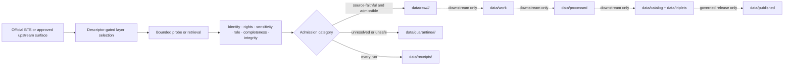

<!-- [KFM_META_BLOCK_V2]
doc_id: kfm://doc/connectors-ntad-readme
title: connectors/ntad/ — National Transportation Atlas Database Connector Lane
type: readme
version: v0.2
status: draft
owners: OWNER_TBD — Connector steward · Source steward · USDOT/BTS steward · Roads-Rail-Trade steward · Settlements-Infrastructure steward · Data steward · Rights reviewer · Sensitivity reviewer · Validation steward · Docs steward
created: 2026-06-20
updated: 2026-07-15
policy_label: public; transportation-source; layer-aggregator; source-admission-only; rights-gated; sensitivity-gated
related:
  - ../README.md
  - ../../docs/doctrine/directory-rules.md
  - ../../docs/sources/catalog/usdot/README.md
  - ../../docs/sources/catalog/usdot/ntad.md
  - ../../docs/sources/catalog/usdot/fra-gcis.md
  - ../../docs/sources/catalog/usdot/fhwa-hpms.md
  - ../../docs/sources/catalog/usdot/fhwa-nhfn.md
  - ../../docs/domains/roads-rail-trade/README.md
  - ../../docs/domains/settlements-infrastructure/README.md
  - ../../data/registry/sources/
  - ../../data/raw/
  - ../../data/quarantine/
  - ../../data/receipts/
  - ../../data/proofs/
  - ../../policy/rights/
  - ../../policy/sensitivity/
  - ../../schemas/contracts/v1/source/
  - ../../release/
tags: [kfm, connectors, ntad, usdot, bts, transportation, roads-rail-trade, settlements-infrastructure, multimodal, layer-aggregator, rail, highways, aviation, maritime, transit, pipelines, intermodal, source-admission, raw, quarantine, receipts, governance]
notes:
  - "v0.2 applies the KFM GitHub Repository Documentation Implementation Agent v3.1 connector README profile."
  - "Directory Rules v1.4 §7.3 places source-specific fetch and admission behavior under connectors/; the existence of connectors/ntad/ does not activate NTAD or any NTAD layer as a canonical source."
  - "NTAD is a layer aggregator, not one dataset. Admission must preserve curator identity, substantive upstream authority, layer identity, source role, cadence, rights, sensitivity, geometry, schema, and digest per layer."
  - "Current repository evidence confirms this README at the inspected base; connector code, tests, fixtures, SourceDescriptor activation, runtime receipts, and CI coverage remain UNKNOWN or NEEDS VERIFICATION."
  - "Official BTS source framing was rechecked 2026-07-15. The current BTS overview describes around 90 nationwide GIS datasets, FGDC metadata per database, and continuous rather than annual updates since 2016; the current per-layer inventory and automation surfaces remain version-sensitive."
  - "Connector activity is source admission only and is never publication authority."
[/KFM_META_BLOCK_V2] -->

<a id="top"></a>

# NTAD Connector Lane

> Source-specific probe, retrieval, metadata-preservation, and admission support for the National Transportation Atlas Database, handled as a governed collection of independently assessed transportation layers.

<p>
  
  
  
  
  
  
  
</p>

`connectors/ntad/`

## Quick navigation

[Status and evidence boundary](#status-and-evidence-boundary) · [Scope](#scope) · [Repository fit](#repository-fit) · [Confirmed current state](#confirmed-current-state) · [Official source surface](#official-source-surface) · [Per-layer admission model](#per-layer-admission-model) · [Authority boundary](#authority-boundary) · [Configuration](#authentication-and-configuration) · [Access behavior](#endpoints-protocols-formats-and-pagination) · [Freshness](#cadence-freshness-stale-state-and-outages) · [Lifecycle](#lifecycle-and-connector-outcomes) · [Identity](#identity-hashing-deduplication-and-replay) · [Validation](#normalization-and-validation-responsibilities) · [Receipts](#receipts-evidence-references-and-emitted-artifacts) · [Sensitivity](#rights-sensitivity-and-public-release) · [Testing](#testing-and-no-network-fixtures) · [Resilience](#rate-limits-retries-timeouts-and-circuit-breaking) · [Activation](#activation-and-promotion-gates) · [Rollback](#correction-rollback-and-deactivation) · [Directory map](#directory-map) · [Definition of done](#definition-of-done) · [Verification backlog](#verification-backlog)

---

## Status and evidence boundary

> [!IMPORTANT]
> **Document lifecycle:** `draft`  
> **Component maturity:** documentation boundary only  
> **Owner:** `OWNER_TBD`  
> **Path:** `connectors/ntad/`  
> **Placement:** consistent with [`Directory Rules` §7.3](../../docs/doctrine/directory-rules.md), which assigns source-specific fetch and admission behavior to `connectors/`  
> **Truth posture:** this README and its repository path are confirmed at the inspected base commit. Connector code, package metadata, tests, fixtures, active source descriptors, network configuration, scheduled runs, emitted receipts, CI coverage, and downstream release behavior remain `UNKNOWN` or `NEEDS VERIFICATION` until current repository evidence proves them.

This README is an implementation-boundary document. It does not activate a source, ratify a layer, assign source authority, approve rights, classify sensitivity, or authorize publication.

---

## Scope

`connectors/ntad/` is the source-edge lane for approved NTAD interaction and admission behavior.

An implemented connector may:

- inspect a steward-approved BTS NTAD collection, item, metadata, service, or downloadable distribution;
- preserve the distinction between BTS as curator/distributor and the substantive upstream agency for each layer;
- retrieve a bounded layer or package under an active source descriptor and explicit network permission;
- preserve source-native identifiers, metadata, geometry, schema, temporal fields, rights, attribution, and sensitivity signals;
- compute deterministic request, metadata, and payload digests;
- emit repository-approved probe, retrieval, no-op, failure, denial, quarantine, or admission receipts;
- hand source-faithful material to `data/raw/`, unresolved material to `data/quarantine/`, and connector run evidence to `data/receipts/`;
- support deterministic no-network tests with minimized, synthetic, redacted, or explicitly approved fixtures.

This lane must not become:

- USDOT, BTS, NTAD, or upstream-agency source doctrine;
- canonical `SourceDescriptor` or source-activation authority;
- a monolithic NTAD dataset abstraction that erases per-layer provenance;
- schema, semantic-contract, rights-policy, sensitivity-policy, or release authority;
- a processed transportation pipeline, conflation engine, routing engine, or network-analysis authority;
- a catalog, triplet, EvidenceBundle, proof-pack, publication, or rollback authority;
- a direct MapLibre, tile, public API, public UI, search, graph, dashboard, export, or AI-answer source;
- a mechanism for exposing precise security-sensitive transportation infrastructure.

---

## Repository fit

Directory Rules assign source-specific fetching and admission to `connectors/`. NTAD is a source product and distribution collection, not a new repository responsibility root.

```text
official BTS / upstream layer surface
  -> connectors/ntad/
  -> descriptor + rights + sensitivity + role + integrity gates
  -> data/raw/<domain>/<source_id>/<run_id>/
     or data/quarantine/<domain>/<source_id>/<run_id>/
  -> data/receipts/<run_id>/
  -> downstream pipelines and validators
  -> governed catalog / proof / release stages
```

Related responsibility homes:

| Responsibility | Owning home | NTAD connector relationship |
|---|---|---|
| Connector-root contract | [`connectors/README.md`](../README.md) | Parent implementation boundary. |
| USDOT source-family doctrine | [`docs/sources/catalog/usdot/`](../../docs/sources/catalog/usdot/) | Human source-family context; not duplicated here. |
| NTAD product doctrine | [`docs/sources/catalog/usdot/ntad.md`](../../docs/sources/catalog/usdot/ntad.md) | Product-level source-role, temporal, geometry, rights, and catalog guidance. |
| Source identity and activation | [`data/registry/sources/`](../../data/registry/sources/) | Canonical descriptor and activation authority consumed by the connector. |
| Rights decisions | [`policy/rights/`](../../policy/rights/) | Determines permitted acquisition, storage, transformation, attribution, and redistribution. |
| Sensitivity decisions | [`policy/sensitivity/`](../../policy/sensitivity/) | Determines restricted fields, precision, access, redaction, generalization, and denial. |
| Source/admission machine shapes | [`schemas/contracts/v1/source/`](../../schemas/contracts/v1/source/) | Governs accepted connector envelopes and receipt shapes where implemented. |
| Source-faithful handoff | [`data/raw/`](../../data/raw/) | Allowed admitted-material destination. |
| Unresolved-material handoff | [`data/quarantine/`](../../data/quarantine/) | Allowed hold destination with explicit reason. |
| Connector run evidence | [`data/receipts/`](../../data/receipts/) | Allowed receipt destination; a receipt is not proof closure. |
| Evidence closure | [`data/proofs/`](../../data/proofs/) | Downstream responsibility; connector may carry references but does not close EvidenceBundles. |
| Release, correction, withdrawal, rollback | [`release/`](../../release/) | Downstream governed state transitions only. |

> [!NOTE]
> Placement under `connectors/ntad/` is consistent with the generic connector rule in Directory Rules §7.3. That placement does **not** establish canonical source-family status, active descriptor state, per-layer authority, or release eligibility.

---

## Confirmed current state

At base commit `1a499164ea2b9b1f2392e76f4ce19a0440098fa3`:

| Item | Status | What the evidence proves | What it does not prove |
|---|---:|---|---|
| `connectors/ntad/README.md` | `CONFIRMED` | The connector-lane README exists. | No implementation, source activation, or runtime behavior follows from existence. |
| `docs/sources/catalog/usdot/ntad.md` | `CONFIRMED` | A draft NTAD product page exists and defines the per-layer anti-collapse posture. | It does not prove current endpoint, inventory, rights, or connector implementation. |
| `connectors/ntad/` implementation files beyond this README | `UNKNOWN` | Repository search used for this update found this README as the connector-lane result. | Search-result absence is not a complete recursive tree proof. |
| Active NTAD aggregator descriptor | `NEEDS VERIFICATION` | Must be resolved in `data/registry/sources/`. | This README cannot activate it. |
| Active per-layer descriptors | `NEEDS VERIFICATION` | Each admitted layer requires its own reviewed identity and role posture. | A single NTAD-wide descriptor cannot prove per-layer admissibility. |
| Connector tests and no-network fixtures | `UNKNOWN` | No current test or fixture path was verified for this lane. | This README is not test evidence. |
| CI and scheduled execution | `UNKNOWN` | No workflow run or status was inspected for NTAD. | Draft documentation does not prove automation. |
| Emitted connector receipts or artifacts | `UNKNOWN` | No current run artifact was inspected. | No ingestion or publication claim is supported. |

---

## Official source surface

The following external anchors were rechecked on **2026-07-15**:

| Official surface | Confirmed framing | Connector consequence |
|---|---|---|
| [BTS NTAD overview](https://www.bts.gov/ntad) | BTS describes NTAD as nationwide geographic databases covering transportation facilities, networks, related infrastructure, and attributes. The page states there are around 90 datasets, FGDC metadata is provided for each database, and updates have been continuous rather than annual since 2016. | Treat the collection as continuously changing and layer-specific. Never freeze the portal-level description into a permanent layer inventory. |
| [BTS Geospatial portal](https://geodata.bts.gov/) | Official current discovery/distribution entry point. | Resolve and pin the selected item, service, layer, or downloadable distribution through an active descriptor before contact. |
| [NTAD Archive](https://rosap.ntl.bts.gov/collection_ntad) | Official historical collection with persistent archive context and records across many publication years. | Use archive records for source history, supersession, and reproducibility; do not substitute an archived edition for a current layer without an explicit version decision. |
| [NTAD collection DOI](https://doi.org/10.21949/1530842) | Persistent collection-level citation. | Preserve collection-level citation in addition to per-layer attribution where applicable. |

> [!IMPORTANT]
> Portal-level facts are not per-layer authority. The current layer inventory, item identifiers, service URLs, downloadable formats, field schemas, release dates, metadata modification dates, upstream agencies, rights statements, sensitivity, and availability are version-sensitive and must be resolved per admitted layer.

---

## Per-layer admission model

NTAD must be handled as a collection of independently governed layers. A connector must not create one monolithic source object that treats every layer as having the same authority, rights, cadence, sensitivity, or freshness.

| Concern | Required posture |
|---|---|
| Collection identity | Preserve NTAD/BTS collection context and persistent collection citation. |
| Curator/distributor | Preserve BTS/USDOT as curator or distributor where the selected layer metadata supports that role. |
| Substantive upstream authority | Preserve the actual upstream agency, program, or partner identified for the layer. Do not collapse FRA, FHWA, FAA, MARAD, FMCSA, PHMSA, FTA, USACE, or partner material into BTS-only authorship. |
| Layer identity | Preserve registry-issued `source_id`, portal item or collection identifier, service identifier, layer identifier, source-native title, upstream product name, and version/vintage. |
| Source role | Resolve per layer through the source registry and review process. A collection-level role does not automatically apply to every layer. |
| Authority limit | Record what the layer can support and what it cannot prove. Inventory geometry is not direct observation, legal access, ownership, current operation, safety condition, or routing truth. |
| Rights and attribution | Preserve item- and layer-level terms, attribution, citation, redistribution, access, and derivative-use conditions. |
| Sensitivity | Classify per layer and field. Critical infrastructure, hazardous-material routes, control points, security facilities, or sensitive joins may require restricted access, field suppression, generalization, or denial. |
| Time | Preserve source publication/release time, metadata modification time, observation or valid time where present, retrieval time, admission time, and later correction/supersession references as distinct fields. |
| Geometry | Preserve geometry type, CRS, dimensionality, extent, feature count, source precision, topology warnings, invalid geometry, and generalized-versus-source geometry status. |
| Schema | Preserve source fields, types, coded domains, null/missing conventions, units, qualifiers, relationship tables, and schema-drift findings. |
| Integrity | Preserve request fingerprint, metadata digest, payload digest, size, content type, compression, and distribution identity. |
| Conflict | Record disagreement with a more specialized or current source; do not silently overwrite or treat NTAD as automatically controlling. |

---

## Authority boundary

```text
THIS LANE MAY:
  inspect an approved NTAD source surface
  retrieve a bounded approved layer or package
  preserve collection, curator, upstream, layer, version, time, rights, and sensitivity metadata
  compute request, metadata, and payload digests
  prepare source-faithful RAW candidates
  route unresolved material to QUARANTINE
  emit repository-approved connector/run receipts
  support connector-local no-network tests

THIS LANE MUST NOT:
  activate a source descriptor
  assign authoritative source role without review
  merge all NTAD layers into one authority object
  assert that administrative inventory is observation
  infer legal access, ownership, operating status, capacity, condition, safety, or route eligibility
  resolve geometry conflicts by convenience
  transform precise sensitive infrastructure into public-safe geometry without downstream policy approval
  write directly to WORK, PROCESSED, CATALOG, TRIPLET, PROOFS, PUBLISHED, or RELEASE authority
  generate public maps, tiles, APIs, dashboards, exports, or AI answers
  publish or promote anything
```

### Anti-collapse rules

| Anti-collapse rule | Connector implication |
|---|---|
| Collection is not dataset | Split by admitted layer or distribution. |
| Curator is not always substantive authority | Preserve BTS and upstream agency roles separately. |
| Administrative inventory is not direct observation | Do not label the collection or feature layer as observed merely because it contains geometry or dates. |
| Facility presence is not legal or public access | Do not infer access, ownership, permission, service, or operating status from a feature. |
| Network geometry is not routing authority | Do not emit turn-by-turn, legal-route, hazardous-material-route, clearance, capacity, or operational guidance. |
| Current portal record is not eternal truth | Preserve version, metadata date, retrieval time, stale state, and supersession. |
| NTAD does not automatically outrank specialized sources | Preserve conflicts and defer to reviewed claim-specific source-role decisions. |
| Generalized output is not proof of safe disclosure | Sensitivity review and a transformation receipt are still required downstream. |
| Successful retrieval is not publication | Connector success only supports later governed stages. |

---

## Authentication and configuration

No connector authentication method or credential variable is verified for this lane.

The public BTS overview, geospatial portal, archive, and collection DOI are accessible as public discovery surfaces, but that does not prove every automated service, item, or distribution is anonymous or unrestricted.

Required configuration posture:

- do not invent or commit credential names, tokens, API keys, cookies, signed URLs, portal sessions, or private endpoints;
- use no credentials by default for public surfaces unless the selected, activated layer explicitly requires authentication;
- when a reviewed layer requires credentials, define the environment-variable names through repository-approved configuration and secret-management conventions, never in this README as guessed values;
- keep base URLs, item IDs, service URLs, layer IDs, request bounds, output paths, and network enablement explicit and overridable;
- deny ambient credentials and unrelated network access in tests and local tools;
- never place secrets, signed links, private source URLs, restricted payload snippets, or session data in logs, fixtures, receipts, commits, or pull-request text.

| Configuration concern | Current status |
|---|---:|
| Public discovery pages | `CONFIRMED` accessible during the 2026-07-15 verification pass. |
| Automated per-layer endpoint | `NEEDS VERIFICATION` through the active descriptor. |
| Authentication requirement | `NEEDS VERIFICATION` per selected layer/distribution. |
| Environment-variable names | `UNKNOWN`; do not fabricate. |
| Network enablement control | `PROPOSED`; must default off in tests and be explicit in live operation. |

---

## Endpoints, protocols, formats, and pagination

NTAD is distributed through a changing collection of layer-specific portal items and archived records. The connector must discover and pin the exact selected distribution rather than relying on a hard-coded “NTAD endpoint.”

| Surface characteristic | Required handling |
|---|---|
| Discovery | Start from a steward-approved official BTS surface and resolve the exact item or archived record. |
| Automated service | Preserve the complete service or distribution identity in the descriptor and receipt. Exact protocol is per layer and `NEEDS VERIFICATION`. |
| Formats | Preserve the source-provided format and content type. Vector services, downloadable archives, tabular files, geodatabases, shapefiles, or other forms must not be assumed globally. |
| Metadata | Preserve FGDC or other supplied metadata, portal item metadata, service metadata, field definitions, contacts, citations, and update information. |
| Pagination | Detect service paging, record limits, continuation tokens, offsets, object-ID batching, or archive result paging. Never treat a partial page as a complete layer. |
| Spatial filters | Record exact bounding geometry, coordinate reference system, precision, and clipping behavior. Do not silently reduce a national layer to Kansas without a receipt. |
| Attribute filters | Record selected fields, predicates, coded values, and source-side versus local filtering. |
| Attachments/related tables | Discover explicitly; absence must not be inferred from the first response. |
| Download archives | Record archive filename, internal members, compression, sizes, hashes, and extraction warnings. |
| Schema drift | Compare current metadata and fields with the last accepted version and route unexplained changes to review or quarantine. |

> [!CAUTION]
> A landing page, portal item page, or first service response is not proof that a download is complete. Validate pagination and archive contents before emitting an admitted candidate.

---

## Cadence, freshness, stale state, and outages

BTS states that NTAD moved from annual releases to continuous updates in 2016. That is collection-level framing; freshness still varies by layer.

The connector must preserve, when available:

- collection or item publication date;
- source release, edition, vintage, or version;
- metadata creation and modification dates;
- upstream data currency date;
- feature-level valid or observation time where the source actually supplies it;
- retrieval and admission timestamps;
- prior accepted version and digest;
- stale, changed, missing, withdrawn, superseded, or unavailable state;
- source outage evidence and last successful contact.

Suggested stale/outage categories are semantic guidance, not verified schema enums:

| Condition | Required connector posture |
|---|---|
| Metadata unchanged and payload digest unchanged | Emit a no-material-change receipt when supported; do not duplicate the raw object unnecessarily. |
| Metadata changed | Re-resolve schema, rights, attribution, upstream authority, sensitivity, and distribution identity before admission. |
| Payload changed without corresponding metadata explanation | Quarantine or defer for source-drift review. |
| Current item missing or withdrawn | Preserve prior version; record missing/withdrawn state; do not silently substitute another layer. |
| Service temporarily unavailable | Record outage evidence and bounded retry history; retain last accepted version as stale context only if downstream policy permits. |
| Archived version selected intentionally | Record archive identifier and reason; do not describe it as current. |
| Layer cadence unknown | Mark freshness `NEEDS VERIFICATION`; do not infer annual cadence from historic NTAD practice. |

No universal stale threshold is established here. Thresholds must be defined by the source descriptor, layer-specific policy, or accepted contract.

---

## Lifecycle and connector outcomes

The KFM lifecycle remains:

```text
RAW -> WORK / QUARANTINE -> PROCESSED -> CATALOG / TRIPLET -> PUBLISHED
```

The connector owns only the source contact and admission edge.



Connector-edge semantic categories:

| Category | Meaning | Allowed handoff |
|---|---|---|
| Admit source-faithful material | Descriptor, role, rights, sensitivity, completeness, and integrity gates support RAW admission. | `data/raw/` + `data/receipts/` |
| Quarantine | Material is useful to retain but identity, rights, sensitivity, schema, completeness, integrity, attribution, or role remains unresolved. | `data/quarantine/` + `data/receipts/` |
| No material change | The selected source version is materially unchanged under the accepted comparison rule. | Receipt only, when supported. |
| Abstain or defer | The connector cannot resolve enough information to fetch or admit safely. | Receipt only; no candidate. |
| Deny | Policy, access, scope, source state, or sensitivity prohibits the operation. | Receipt only; no candidate. |
| Error | An operational failure occurred without establishing a safe admission result. | Error receipt/log under approved paths; no unsafe fallback. |

> [!NOTE]
> These are semantic categories, not claims about an implemented enum. Exact outcome names and schemas remain `NEEDS VERIFICATION` against accepted source/admission contracts.

A connector result is never a `PUBLISHED` result and never a `PromotionDecision`.

---

## Identity, hashing, deduplication, and replay

Canonical source IDs must come from the source registry or an approved deterministic allocation rule. This README does not allocate them.

For each selected layer or distribution, preserve enough information to replay and compare the run:

- collection identifier and citation;
- registry-issued aggregator and per-layer source references;
- BTS portal item, archive record, DOI, service, layer, or distribution identifiers as available;
- curator and substantive upstream identities;
- source release/vintage/version and metadata modification time;
- canonicalized request parameters, spatial bounds, selected attributes, filters, paging strategy, and headers that affect representation, excluding secrets;
- request fingerprint;
- metadata content digest;
- response or archive byte digest;
- extracted member digests where an archive is involved;
- feature/row counts and bounds;
- source schema fingerprint;
- connector/spec version and code revision where implemented;
- prior accepted digest and comparison result;
- run identifier and receipt reference.

Deduplication rules:

1. Do not deduplicate different NTAD layers merely because titles, geometries, or files are similar.
2. Do not merge curator and upstream identities.
3. Deduplicate only under a documented identity and equivalence rule.
4. Preserve aliases, supersession, and source history rather than overwriting prior versions.
5. A matching payload hash does not prove matching rights, sensitivity, metadata, or source role.
6. Replay must use pinned identifiers and recorded parameters; “latest” is not reproducible.

---

## Normalization and validation responsibilities

The connector should preserve source meaning and perform only source-edge validation needed to decide RAW versus QUARANTINE.

| Validation layer | Connector responsibility | Connector non-responsibility |
|---|---|---|
| Repository placement | Confirm work remains under the connector root and allowed handoff roots. | Does not change Directory Rules. |
| Descriptor and activation | Resolve active collection and per-layer descriptor references. | Does not create or approve descriptors. |
| Source identity | Confirm selected official surface, item/distribution identity, curator, and upstream attribution. | Does not decide claim-level authority beyond the descriptor/review decision. |
| Access completeness | Validate pagination, archive members, content length where meaningful, and partial-response warnings. | Does not infer complete data from a successful HTTP status alone. |
| Integrity | Compute and compare approved hashes; preserve file sizes and content types. | Does not turn a checksum into EvidenceBundle closure. |
| Metadata | Preserve supplied FGDC/portal/service metadata and required provenance fields. | Does not rewrite source metadata into unsupported claims. |
| Schema | Inventory fields, types, coded domains, units, nulls, relationships, and drift. | Does not define canonical domain schemas. |
| Geometry | Validate readability, CRS presence, geometry type, counts, bounds, and invalidity warnings. | Does not perform unapproved conflation, correction, snapping, routing, redaction, or generalization. |
| Time | Preserve distinct source, valid, observation, metadata, retrieval, admission, and supersession times where available. | Does not invent dates or infer currentness from retrieval time. |
| Rights | Carry reviewed rights and attribution requirements into the admission envelope. | Does not approve redistribution. |
| Sensitivity | Carry classification signals and deny/quarantine when unresolved. | Does not authorize public precision. |
| Domain routing | Attach a reviewed domain routing hint per layer. | Does not transfer domain ownership to the connector. |

Minimum quarantine reasons should be selected from repository-approved vocabulary. Likely categories include unresolved source identity, inactive descriptor, unknown upstream authority, unclear rights, sensitive exact locations, missing metadata, incomplete pagination, unsupported format, corrupt archive, schema drift, invalid geometry, digest mismatch, stale or withdrawn source, and conflicting specialized authority. Exact reason codes remain `NEEDS VERIFICATION`.

---

## Receipts, evidence references, and emitted artifacts

Every source interaction should produce an auditable result when repository contracts support it.

A connector receipt should preserve, without secrets:

- run and task identity;
- connector/spec/code version;
- source descriptor references;
- collection, item, service, layer, distribution, or archive identifiers;
- curator and upstream authority identities;
- request fingerprint and bounded scope;
- start/end times and attempt count;
- HTTP or transport result summary;
- pagination and completeness summary;
- metadata, schema, geometry, row/feature-count, and integrity summaries;
- source and payload digests;
- rights and sensitivity decision references;
- admission category and reason;
- RAW, QUARANTINE, or receipt artifact references;
- prior version/digest and material-change decision;
- warnings, errors, stale state, withdrawal, or source-drift findings.

Allowed connector emissions, subject to accepted schemas and path verification:

| Artifact | Purpose | Authority limit |
|---|---|---|
| Probe/retrieval/admission receipt | Proves what the connector attempted and decided at the source edge. | Not an EvidenceBundle, proof pack, promotion decision, or release manifest. |
| Source-faithful payload or pointer | Preserves admitted source material. | RAW only; not normalized truth. |
| Quarantine payload or pointer | Preserves unresolved material with a reason. | Not publicly usable. |
| Metadata/schema/geometry inventory | Supports review and downstream normalization. | Descriptive of the retrieved source; not domain authority. |
| Drift or no-change record | Supports watcher and maintainer review. | A watcher or connector does not auto-update schemas, policy, catalogs, or releases. |
| Evidence references | Points toward source and run evidence. | Does not close `EvidenceRef -> EvidenceBundle`. |

> [!IMPORTANT]
> Connector and watcher activity is **not publication authority**. It may create candidates and receipts; it must not promote, publish, rewrite catalog authority, or expose a public layer.

---

## Rights, sensitivity, and public release

NTAD is a mixed collection. Public discoverability is not equivalent to unrestricted acquisition, redistribution, derivative use, or precise public exposure.

Required rights posture:

- verify terms and attribution per selected item, layer, service, and distribution;
- preserve BTS collection citation and substantive upstream attribution where both apply;
- do not assume a blanket public-domain posture for every layer or attachment;
- record restrictions on redistribution, derivative products, bulk access, service use, logos, notices, and citation;
- route unclear or conflicting rights to quarantine or denial;
- preserve source notices in downstream metadata and receipts;
- do not include more third-party material in fixtures or examples than testing requires.

Required sensitivity posture:

- classify at collection, layer, field, geometry, and join level;
- treat pipelines, hazardous-material routes, military or security facilities, control points, critical bridges, terminals, energy or communications assets, and other sensitive infrastructure as review triggers rather than automatically public data;
- minimize requested geography and attributes;
- exclude precise sensitive records from fixtures, logs, screenshots, examples, issue text, pull-request text, and documentation;
- do not perform public-safe transformation inside the connector unless an accepted policy and transform contract explicitly assign that responsibility;
- preserve redaction/generalization requirements for downstream policy-aware processing;
- fail closed when rights, sensitivity, exact-location exposure, or protected joins are unresolved.

Public release requires downstream evidence closure, policy decisions, review state, validation, release manifest, correction path, and rollback target. This connector cannot satisfy that release burden by itself.

---

## Testing and no-network fixtures

Connector tests should default to no network and should prove source-edge behavior only.

Fixture families should cover:

| Fixture family | Expected purpose |
|---|---|
| Valid collection metadata | Preserve collection identity and citation without activating layers. |
| Valid per-layer metadata | Preserve curator, upstream agency, item/layer identity, dates, rights, sensitivity, schema, geometry, and distributions. |
| Paginated service | Prove every page is requested exactly once and partial results are rejected. |
| Download archive | Prove archive identity, safe extraction, expected members, sizes, and hashes. |
| No material change | Prove a stable source comparison emits a no-change result without duplicating RAW data. |
| Changed metadata | Prove re-review of schema, rights, attribution, sensitivity, and distribution identity. |
| Payload drift without metadata explanation | Prove quarantine or defer behavior. |
| Missing upstream authority | Prove the connector does not collapse attribution to BTS alone. |
| Rights unclear | Prove deny/quarantine and no RAW admission. |
| Sensitive exact location | Prove no sensitive payload enters logs, receipts, fixtures, or public paths. |
| Inactive or missing descriptor | Prove fail-closed behavior before network contact. |
| Rate limit or transient outage | Prove bounded retry, server-guidance handling, and final receipt. |
| Permanent client error | Prove no mechanical retry and no unsafe fallback. |
| Schema drift | Prove difference reporting and quarantine/review. |
| Invalid or missing CRS/geometry | Prove warning or quarantine according to accepted policy. |
| Withdrawn or missing current item | Prove prior version preservation and explicit stale/withdrawn state. |

Fixture rules:

- use synthetic, minimized, redacted, generalized, or explicitly licensed samples;
- exclude credentials, private URLs, signed URLs, cookies, and restricted content;
- exclude precise sensitive infrastructure unless a restricted fixture policy explicitly authorizes it;
- preserve the source shape needed to test parsing, not unnecessary source content;
- pin fixture provenance, intended test use, and update reason;
- update fixtures through reviewed changes when source schemas materially change;
- separate optional live-source probes from deterministic unit/integration tests;
- a passing connector suite proves bounded source-edge behavior only. It does not prove source authority, data quality, EvidenceBundle closure, release readiness, or public safety.

Exact test paths and commands remain `NEEDS VERIFICATION` until implementation files and repository-native tooling are inspected.

---

## Rate limits, retries, timeouts, and circuit breaking

No current NTAD-wide API quota, service limit, retry policy, or authentication quota is verified here. Operational behavior must be conservative and per selected distribution.

| Condition | Required behavior |
|---|---|
| `429` or server-provided throttling | Honor `Retry-After` or equivalent server guidance; use bounded backoff; record attempts. |
| Timeout, connection reset, or transient `5xx` | Retry only a small bounded number of times when the operation is idempotent; inspect partial state before retry. |
| `4xx` permission, authentication, not-found, invalid request, or semantic error | Do not retry mechanically. Re-resolve descriptor, access, identifiers, and request. |
| Ambiguous download failure | Do not accept partial bytes. Remove or quarantine the partial artifact under approved handling and record the failure. |
| Pagination loop or repeated page | Stop, record evidence, and quarantine/defer rather than producing duplicates. |
| Digest mismatch | Stop admission; quarantine or error. Never overwrite the last accepted version. |
| Schema or metadata drift | Stop automatic admission when the accepted contract requires review. |
| Repeated source outage | Open the connector circuit for the run or configured interval; preserve last-known state as stale context only. |
| Rate-limit budget exhausted | Stop cleanly and emit a receipt; do not bypass limits or fan out uncontrolled requests. |

Timeouts, retry counts, backoff schedule, concurrency, page size, and circuit-reset interval must be configuration-controlled and source-specific. This README does not invent numeric defaults.

---

## Activation and promotion gates

A connector path existing in the repository is not activation.

### Connector activation gates

Before live NTAD contact, verify:

- exact repository implementation path and owner;
- active collection-level descriptor or approved collection reference;
- active per-layer descriptor for every selected layer or a reviewed intake decision that permits descriptor creation downstream;
- official current item/service/distribution identifiers;
- curator and substantive upstream attribution;
- source role and authority limits;
- current rights, attribution, citation, and redistribution posture;
- sensitivity classification and allowed precision;
- explicit network permission and bounded request scope;
- authentication/configuration requirements;
- expected format, schema, CRS, pagination, completeness, and size controls;
- deterministic request and hashing rules;
- no-network fixtures and negative tests;
- RAW, QUARANTINE, and receipt output targets;
- timeout, retry, rate-limit, and circuit-breaker behavior;
- correction, deactivation, and replay procedures.

### Downstream promotion gates

Connector activation does not authorize movement beyond RAW/QUARANTINE. Later promotion requires downstream contracts and evidence for normalization, domain validation, rights, sensitivity, source role, proof closure, review, catalog/triplet emission, release, correction, and rollback.

> [!WARNING]
> A connector, watcher, scheduled job, successful download, checksum, pull request, commit, or merged change is not publication.

---

## Correction, rollback, and deactivation

Correction begins by preserving the existing run and identifying the affected source version, layer, candidate, receipt, and downstream artifacts.

Required operational posture:

1. stop or disable further contact through approved configuration when the source, rights, sensitivity, identifiers, or schema are unsafe or unresolved;
2. do not delete prior RAW, QUARANTINE, or receipt history merely because a newer source version exists;
3. record the reason for deactivation, hold, withdrawal, supersession, or correction;
4. preserve last known good descriptor and source version with explicit stale/withdrawn state;
5. identify every downstream candidate, processed artifact, catalog/triplet record, proof, layer, export, and release that depended on the affected run;
6. let downstream owners issue corrections, withdrawals, rebuilds, or rollback decisions through their governing roots;
7. re-enable only after descriptor, access, rights, sensitivity, schema, tests, and source state are revalidated;
8. replay from pinned source and request identifiers, not from an unqualified “latest” query.

Connector rollback means reverting connector code/configuration or deactivating the source edge. It does not rewrite published history. Published correction and rollback belong under `release/` and the owning downstream systems.

---

## Directory map

The current confirmed connector-lane inventory is bounded to this README. The following future structure is illustrative and must not be created without repository inspection and placement review:

```text
connectors/ntad/
├── README.md                    # this boundary document; CONFIRMED
├── src/                         # PROPOSED; language/package convention UNKNOWN
│   └── ntad/
│       ├── README.md
│       ├── discover.*           # resolve approved collection/item/layer/distribution
│       ├── fetch.*              # bounded idempotent retrieval
│       ├── metadata.*           # FGDC/portal/service metadata preservation
│       ├── paginate.*           # complete paging and batching
│       ├── archive.*            # safe archive inventory/extraction
│       ├── validate.*           # source-edge completeness/integrity checks
│       ├── admit.*              # RAW/QUARANTINE decision adapter
│       ├── receipts.*           # repository-approved receipt adapter
│       └── errors.*
└── tests/                       # PROPOSED; exact home and framework UNKNOWN
    ├── README.md
    └── fixtures/                # only if local convention permits; shared fixtures may live elsewhere
```

Before creating any path:

- inspect the full `connectors/ntad/` tree;
- inspect package and language conventions in adjacent active connectors;
- check path-scoped instructions and ADRs;
- avoid duplicating shared ArcGIS/service, archive, hashing, geometry, source-registry, policy, receipt, or fixture utilities;
- choose the smallest coherent, reversible implementation slice.

---

## Definition of done

### Documentation boundary

- [x] One H1 and one-line purpose are present.
- [x] Scope, repository fit, inputs, exclusions, authority limits, and lifecycle handoffs are explicit.
- [x] Directory Rules placement is reconciled without treating path existence as source activation.
- [x] NTAD is handled as a per-layer aggregator rather than one monolithic dataset.
- [x] Official BTS overview, portal, archive, continuous-update framing, and access date are recorded.
- [x] Current implementation depth is bounded to available evidence.
- [x] Authentication, endpoint, format, pagination, cadence, rate-limit, retry, timeout, and circuit-breaker unknowns are visible rather than invented.
- [x] RAW, QUARANTINE, and receipt handoffs are distinguished from downstream proof and publication authority.
- [x] No-network fixtures, sensitivity, rights, correction, rollback, deactivation, and watcher-as-non-publisher expectations are documented.

### Connector implementation

- [ ] Owners are confirmed and `OWNER_TBD` is replaced through repository-approved ownership evidence.
- [ ] The complete connector directory is inventoried.
- [ ] Package language, dependency, configuration, and shared-utility conventions are verified.
- [ ] Active collection and per-layer descriptors are verified.
- [ ] Current official item/service/distribution identifiers are pinned.
- [ ] Rights, citation, attribution, and redistribution posture are reviewed per layer.
- [ ] Sensitivity and exact-location controls are reviewed per layer and field.
- [ ] Authentication requirements and environment-variable names are verified without exposing values.
- [ ] Pagination, archive completeness, schema, CRS, geometry, counts, bounds, and digest behavior are implemented and tested.
- [ ] Deterministic request, identity, hashing, deduplication, material-change, and replay behavior are implemented and tested.
- [ ] RAW, QUARANTINE, and receipt outputs use accepted contracts and verified paths.
- [ ] No-network valid, invalid, denied, deferred, quarantined, drift, rate-limit, outage, and error fixtures exist.
- [ ] Optional live probes are explicitly separated from deterministic tests and are descriptor/policy gated.
- [ ] Connector code cannot write to WORK, PROCESSED, CATALOG, TRIPLET, PROOFS, PUBLISHED, or RELEASE authority.
- [ ] Watcher or connector activity cannot publish, promote, rewrite catalog authority, or expose public products.
- [ ] CI checks and current run receipts are verified.
- [ ] Correction, deactivation, replay, and rollback procedures are exercised.

---

## Verification backlog

| Verification item | Evidence that would settle it | Status |
|---|---|---:|
| Current files under `connectors/ntad/` | Complete tree read at the implementation branch/ref. | `NEEDS VERIFICATION` |
| Current owner/CODEOWNERS coverage | `CODEOWNERS`, team ownership docs, or reviewed maintainer assignment. | `NEEDS VERIFICATION` |
| Active NTAD collection descriptor | Canonical source-registry record and activation decision. | `NEEDS VERIFICATION` |
| Active per-layer descriptors | Registry records with source role, rights, sensitivity, cadence, and upstream authority. | `NEEDS VERIFICATION` |
| Current official layer inventory | Official BTS portal inventory captured at an access time and linked from descriptors. | `NEEDS VERIFICATION` |
| Current automated service/distribution URLs | Official item/service metadata pinned in descriptors. | `NEEDS VERIFICATION` |
| Authentication and environment variables | Reviewed configuration and secret-management contract. | `NEEDS VERIFICATION` |
| Current file/service formats and pagination | Layer metadata plus successful bounded completeness tests. | `NEEDS VERIFICATION` |
| Rights and attribution | Per-layer official terms and policy decision. | `NEEDS VERIFICATION` |
| Sensitivity and public precision | Per-layer/field policy decision and negative tests. | `NEEDS VERIFICATION` |
| Connector outcome and receipt schemas | Accepted source/admission contracts and schema validation. | `NEEDS VERIFICATION` |
| Test framework and fixture homes | Repository files and passing no-network tests. | `NEEDS VERIFICATION` |
| Rate limits and service constraints | Official service guidance or observed, reviewed connector evidence. | `NEEDS VERIFICATION` |
| CI coverage | Workflow/check configuration and successful run at the implementation commit. | `NEEDS VERIFICATION` |
| Emitted artifacts and receipts | Current run outputs with hashes and reachable provenance. | `NEEDS VERIFICATION` |
| Downstream dependency inventory | Catalog/proof/release lineage query or reviewed dependency manifest. | `NEEDS VERIFICATION` |

---

## Evidence basis

| Evidence | Role | Status | Supports | Does not prove |
|---|---|---:|---|---|
| [`Directory Rules` v1.4 §7.3](../../docs/doctrine/directory-rules.md) | Placement doctrine | `CONFIRMED` repository document | Source-specific fetch/admission belongs under `connectors/`; connector outputs are RAW/QUARANTINE with checksums and ingest receipts; connectors do not publish. | NTAD implementation, activation, or endpoint behavior. |
| [`connectors/README.md`](../README.md) | Parent implementation-root contract | `CONFIRMED` repository document | Connector boundary, allowed handoffs, exclusions, receipts, and fail-closed posture. | Child implementation completeness. |
| [`docs/sources/catalog/usdot/ntad.md`](../../docs/sources/catalog/usdot/ntad.md) | NTAD product doctrine and lineage | `CONFIRMED` draft repository document | Per-layer decomposition, curator-versus-upstream attribution, authority limits, mixed sensitivity. | Current layer inventory, rights, endpoints, or connector runtime. |
| Current `connectors/ntad/README.md` at base commit | Target implementation evidence | `CONFIRMED` | The README and lane path exist. | Additional files, tests, source activation, CI, or emitted receipts. |
| [BTS NTAD overview](https://www.bts.gov/ntad) | Official external source | `CONFIRMED` checked 2026-07-15 | Nationwide collection framing, around 90 datasets, FGDC metadata, continuous-update model since 2016. | A frozen current layer inventory or per-layer rights/authority. |
| [BTS Geospatial portal](https://geodata.bts.gov/) | Official external discovery surface | `CONFIRMED` checked 2026-07-15 | Current official discovery/distribution starting point. | A stable universal endpoint, protocol, or format. |
| [NTAD Archive](https://rosap.ntl.bts.gov/collection_ntad) and [DOI](https://doi.org/10.21949/1530842) | Official archive and persistent collection identifier | `CONFIRMED` checked 2026-07-15 | Historical records, collection citation, supersession/replay support. | Current layer status or public-release eligibility. |

---

## Status summary

`connectors/ntad/` is a governed source-admission lane for individually assessed NTAD layers. It may support bounded discovery, retrieval, metadata preservation, integrity checks, RAW/QUARANTINE handoff, and connector receipts after descriptor, rights, sensitivity, role, and network gates pass.

It is not source doctrine, descriptor authority, domain truth, routing or legal-access authority, current operational-status authority, public-safety guidance, schema or policy authority, EvidenceBundle closure, catalog/triplet authority, release authority, or public map/API/UI/AI authority.

**Connector and watcher activity is not publication authority.**

<p align="right"><a href="#top">Back to top</a></p>
