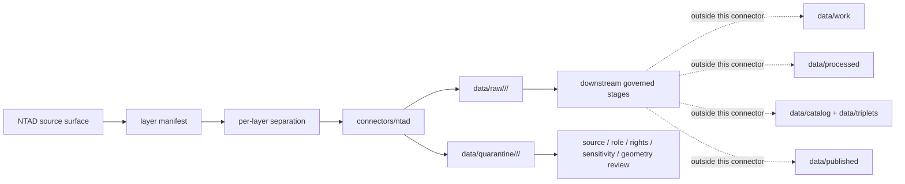

<!-- [KFM_META_BLOCK_V2]
doc_id: kfm://doc/connectors-ntad-readme
title: connectors/ntad/ — National Transportation Atlas Database Connector Lane
type: readme
version: v0.1
status: draft
owners: OWNER_TBD — Connector steward · Source steward · USDOT steward · Roads-Rail-Trade steward · Settlements-Infrastructure steward · Data steward · Validation steward · Docs steward
created: 2026-06-20
updated: 2026-06-20
policy_label: public; transportation-source; layer-aggregator; source-admission-only
related:
  - ../README.md
  - ../../docs/doctrine/directory-rules.md
  - ../../docs/sources/catalog/usdot/README.md
  - ../../docs/sources/catalog/usdot/ntad.md
  - ../../docs/sources/catalog/usdot/fra-gcis.md
  - ../../docs/sources/catalog/usdot/fhwa-hpms.md
  - ../../docs/sources/catalog/usdot/fhwa-nhfn.md
  - ../../docs/domains/roads-rail-trade/README.md
  - ../../docs/domains/settlements-infrastructure/README.md
  - ../../data/registry/sources/
  - ../../data/raw/
  - ../../data/quarantine/
  - ../../data/receipts/
  - ../../data/proofs/
  - ../../policy/rights/
  - ../../policy/sensitivity/
  - ../../release/
tags: [kfm, connectors, ntad, usdot, bts, transportation, roads-rail-trade, settlements-infrastructure, multimodal, layer-aggregator, rail, highways, aviation, maritime, intermodal, source-admission, raw, quarantine, governance]
notes:
  - "Connector lane for National Transportation Atlas Database source intake and admission helpers."
  - "Placement is draft / open: Directory Rules §7.3 does not list ntad/ in the canonical connector spine; the source catalog identifies usdot/ and connectors/ntad/ as proposed/open placement surfaces."
  - "NTAD is a layer aggregator, not a single dataset; admission must preserve per-layer source identity, upstream agency attribution, source role, cadence, sensitivity, rights, geometry, and digest."
  - "Source-family and product doctrine belongs under docs/sources/catalog/usdot/ntad.md and source descriptors, not here."
  - "Connector output may enter raw or quarantine admission lanes only."
  - "NTAD layers must not be treated as direct observations, public release, routing authority, current operational status, legal access truth, ownership truth, emergency guidance, or infrastructure-risk disclosure by themselves."
[/KFM_META_BLOCK_V2] -->

<a id="top"></a>

# NTAD Connector

> Source-specific intake and admission lane for the National Transportation Atlas Database as a per-layer transportation-source aggregator.

<p>
  
  
  
  
  
  
  
</p>

`connectors/ntad/`

## Quick jumps

[Scope](#scope) · [Repo fit](#repo-fit) · [Layer admission model](#layer-admission-model) · [Lifecycle sketch](#lifecycle-sketch) · [Authority boundary](#authority-boundary) · [Inputs](#inputs) · [Exclusions](#exclusions) · [Admission posture](#admission-posture) · [Anti-collapse posture](#anti-collapse-posture) · [Validation](#validation) · [Definition of done](#definition-of-done)

---

## Scope

`connectors/ntad/` is a draft connector lane for NTAD source intake and admission helpers.

This folder may contain connector-local documentation, source-admission helpers, per-layer manifest builders, package/download helpers, metadata parsers, geometry inventory helpers, checksum/digest helpers, no-network fixture pointers, and raw/quarantine output adapters for NTAD layers.

It must not become USDOT source-family truth, NTAD product doctrine, per-layer upstream-agency truth, domain doctrine, routing authority, current operational status authority, emergency guidance, infrastructure-risk disclosure authority, legal access authority, ownership truth, policy authority, schema authority, catalog/triplet authority, proof authority, release authority, pipeline authority, public API behavior, or public UI behavior.

> [!IMPORTANT]
> **Status:** draft / `NEEDS VERIFICATION`  
> **Owner:** `OWNER_TBD`  
> **Path:** `connectors/ntad/`  
> **Truth posture:** the path exists in the repository as this README; actual source descriptors, endpoint behavior, layer inventory, package formats, parsers, tests, fixtures, rights posture, sensitivity posture, CI wiring, and release behavior remain `NEEDS VERIFICATION`.

---

## Repo fit

```text
connectors/
└── ntad/
    └── README.md
```

Related responsibility roots:

```text
connectors/                               # source-specific fetch and admission code
connectors/ntad/                          # draft NTAD connector lane
docs/sources/catalog/usdot/ntad.md        # NTAD source-product doctrine
docs/sources/catalog/usdot/               # USDOT source-family docs
docs/domains/roads-rail-trade/            # roads, rail, freight, routing, and trade context
docs/domains/settlements-infrastructure/  # ports, airports, intermodal, and critical-facility context
data/registry/sources/                    # source descriptors and per-layer activation state
data/raw/                                 # raw staged source outputs by owning domain
data/quarantine/                          # held material requiring source/role/rights/sensitivity review
data/receipts/                            # ingest, checksum, layer, transform, and review receipts
data/proofs/                              # EvidenceBundles and proof packs
policy/rights/                            # terms, attribution, and source-use review
policy/sensitivity/                       # critical infrastructure, exact-location, and release rules
release/                                  # release decisions, manifests, rollback, correction state
```

> [!WARNING]
> `connectors/ntad/` is a draft/open connector placement. Directory Rules §7.3 does not list `ntad/` in the canonical connector spine. Keep this lane as a draft unless an ADR, migration note, or updated Directory Rules ratifies the placement.

---

## Layer admission model

NTAD must be handled as a layer aggregator. The connector must preserve per-layer identity rather than creating one monolithic NTAD source object.

| Layer concern | Required connector posture |
|---|---|
| Aggregator identity | Preserve BTS/USDOT as curator/distributor where applicable. |
| Substantive upstream | Preserve the actual upstream agency or source family per layer, such as FRA, FHWA, FAA, MARAD, FMCSA, or partner source where verified. |
| Layer identity | Preserve layer slug, title, source URL, package/file identity, version/release, geometry type, schema, and digest. |
| Source role | Assign per layer through SourceDescriptor; do not use one NTAD-wide role. |
| Sensitivity | Assign per layer; transportation infrastructure and exact-location joins may require generalization, review, or denial. |
| Cadence/freshness | Preserve layer release date, publication date, metadata update date, retrieval time, and stale/changed status. |
| Attribution | Preserve both curator and upstream attribution where both are relevant. |
| Geometry conflict | Preserve conflict status when NTAD geometry disagrees with higher-authority layer-specific sources. |

---

## Lifecycle sketch



> [!CAUTION]
> Connector code admits source material. It does not decide layer authority, resolve geometry conflicts, publish map layers, produce route guidance, expose infrastructure details, answer public claims, or decide release state. Promotion remains a governed state transition, not a file move.

---

## Authority boundary

```text
OUTPUT LIMIT:
  data/raw/<domain>/<source_id>/<run_id>/
  data/quarantine/<domain>/<source_id>/<run_id>/

NOT HERE:
  USDOT source-family truth
  NTAD product doctrine
  upstream agency authority decisions
  per-layer SourceDescriptor authority
  routing authority
  current operational status authority
  legal access or ownership truth
  infrastructure-risk disclosure authority
  rights or sensitivity policy
  processed transportation derivatives
  catalog records
  triplet records
  public map artifacts
  receipts/proofs as authority
  release decisions
  public API behavior
  public UI behavior
```

---

## Inputs

| Accepted item | Required posture |
|---|---|
| Layer manifest helper | Preserve layer id, title, mode, upstream agency, source URL, access URL, release/version, metadata date, geometry type, schema, file names, size, and retrieval time. |
| Package download helper | Preserve source URL, response status, file identity, compression, content digest, and retrieval time. |
| Metadata parser | Preserve publisher, curator, substantive upstream, abstract, spatial extent, temporal extent, update date, and contact/attribution fields where available. |
| Geometry inventory helper | Preserve geometry type, CRS, feature count, bounds, layer extent, and geometry warnings. |
| Schema helper | Preserve field names, field types, nullable/missing values, coded domains where present, and schema-drift findings. |
| Per-layer role helper | Preserve proposed source role, role basis, upstream authority, and review status. |
| Sensitivity helper | Flag critical infrastructure, exact-location, security-sensitive joins, and public-release restrictions. |
| Rights/citation helper | Preserve license/terms/citation/attribution posture per layer. |
| Test references | Point to owning fixture/test roots; fixtures do not become source authority. |

---

## Exclusions

| Do not store here | Correct home |
|---|---|
| USDOT source-family doctrine | `docs/sources/catalog/usdot/` |
| NTAD product doctrine | `docs/sources/catalog/usdot/ntad.md` |
| Authoritative `SourceDescriptor` records | `data/registry/sources/` |
| Roads, rail, trade, or infrastructure domain doctrine | `docs/domains/roads-rail-trade/`, `docs/domains/settlements-infrastructure/` |
| Rights, sensitivity, security, or release policy | `policy/`, `policy/sensitivity/`, `release/` |
| Processed transportation layers or conflation outputs | `data/processed/` |
| Catalog or triplet records | `data/catalog/`, `data/triplets/` |
| Public map artifacts | `data/published/` after governed release |
| Receipts and proof packs as authority | `data/receipts/`, `data/proofs/` |
| Schemas or semantic contracts | `schemas/`, `contracts/` |
| Public API or UI behavior | `apps/governed-api/`, `apps/explorer-web/` |

---

## Admission posture

NTAD intake should preserve:

- source identity and source surface;
- active source descriptor reference or quarantine reason;
- aggregator/curator identity and per-layer upstream agency identity;
- layer id, layer title, mode, topic, and domain routing hint;
- source URL, download URL, metadata URL, release/version, publication date, metadata date, retrieval time, file identity, file size, compression, and digest;
- geometry type, CRS, feature count, bounds, spatial extent, and geometry warning flags;
- schema fields, coded values, row/feature counts, missing-value conventions, and schema-drift status;
- proposed source role, source-role basis, sensitivity posture, rights/citation posture, attribution posture, and review status;
- known conflicts with layer-specific authority sources;
- raw/quarantine handoff envelope and receipt linkage.

---

## Anti-collapse posture

| Rule | Connector implication |
|---|---|
| NTAD is a layer aggregator, not one dataset. | Split intake and descriptors by layer. |
| BTS curator is not always substantive upstream authority. | Preserve curator and upstream attribution separately. |
| Administrative compilation is not direct observation. | Do not treat a layer as observed just because it has geometry or features. |
| Facility geometry is not legal access truth. | Do not infer public access, ownership, or operational status from feature presence. |
| Transportation infrastructure can be sensitive. | Exact-location or critical-infrastructure joins may require redaction, generalization, or denial. |
| Currentness varies by layer. | Preserve release date, metadata date, retrieval date, and stale flags per layer. |
| NTAD does not override specialized authorities. | FRA, FHWA, FAA, MARAD, or state sources may outrank NTAD for specific claim types. |
| Public display is downstream. | The connector must not build public tiles, UI layers, route claims, risk maps, or release payloads. |

---

## Validation

Before relying on this connector, verify:

- connector placement is ratified or recorded in the drift/open-question register;
- active SourceDescriptors exist for the NTAD aggregator and any admitted per-layer sources;
- current NTAD access surfaces, layer inventory, package formats, metadata fields, and update cadence are re-verified;
- per-layer upstream agency attribution is captured;
- rights, citation, attribution, and sensitivity posture are captured per layer;
- geometry, CRS, schema, feature counts, release/version, and digests are preserved;
- tests use no-network fixtures where practical;
- output paths are limited to raw/quarantine admission lanes;
- downstream receipts, proofs, catalog/triplet records, public map artifacts, and release records are produced only outside this connector;
- public products are released only through governed publication controls and never as routing, legal-access, operational-status, infrastructure-risk, or emergency-guidance truth without separate authority.

---

## Definition of done

- [ ] Owners are confirmed and `OWNER_TBD` is replaced.
- [ ] Placement is ratified by ADR, migration note, or updated Directory Rules, or recorded as open drift.
- [ ] Actual connector contents are inventoried.
- [ ] NTAD aggregator and per-layer `SourceDescriptor` IDs and source-family activation are verified.
- [ ] Current NTAD access surfaces, layer inventory, file formats, endpoint behavior, rights, citation, and attribution posture are documented.
- [ ] Per-layer manifest builders preserve layer id, title, upstream agency, source role, release/version, file identity, geometry type, schema, sensitivity posture, source URL, and digest.
- [ ] Tests prevent silent conversion of NTAD layers into observations, routing authority, legal-access truth, operational-status truth, infrastructure-risk disclosure, or public release.
- [ ] Outputs are verified to enter only raw or quarantine admission lanes.
- [ ] No source-family, domain, processed, catalog, triplet, published, release, schema, policy, proof, receipt, registry, fixture, report, API, UI, tile, route, legal-access, ownership, operational-status, emergency, or risk-disclosure authority lives here.
- [ ] Tests, fixtures, and CI behavior are verified or marked `NEEDS VERIFICATION`.

---

## Status summary

`connectors/ntad/` is for NTAD source-admission code only. It is not USDOT source-family truth, NTAD product doctrine, upstream-agency authority, routing authority, current operational-status authority, legal-access truth, infrastructure-risk disclosure authority, policy authority, schema authority, catalog/triplet authority, proof closure, release authority, public map authority, public API behavior, public UI behavior, or pipeline authority.

<p align="right"><a href="#top">Back to top</a></p>
