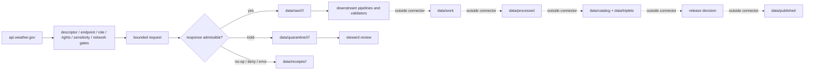

<!-- [KFM_META_BLOCK_V2]
doc_id: kfm://doc/connectors-nws-api-readme
title: connectors/nws-api/ — NOAA NWS API Connector Lane
type: readme
version: v0.2
status: draft
owners: OWNER_TBD — Connector steward · Source steward · NOAA steward · NWS steward · Hazards steward · Atmosphere steward · Data steward · Rights reviewer · Sensitivity reviewer · Safety reviewer · Validation steward · Migration steward · CI steward · Docs steward
created: 2026-06-20
updated: 2026-07-15
policy_label: public-doctrine; life-safety-sensitive; contextual-only; source-admission-only; not-alert-authority; no-network-by-default; descriptor-gated; rights-gated; sensitivity-gated; raw-quarantine-receipts-only; no-publication
current_path: connectors/nws-api/README.md
truth_posture: CONFIRMED target README and current path, Directory Rules connector responsibility, connectors root boundary, NOAA family boundary, broader NWS sibling boundary, NWS API product page, official api.weather.gov documentation and FAQ checked 2026-07-15, API base URL, required User-Agent, content negotiation, cache guidance, linked point-to-grid discovery, unpublished reasonable rate limits, seven-day alert query window, OpenAPI surfaces, and current official documentation update date / CONFLICTED canonical implementation topology across connectors/noaa, connectors/nws, and connectors/nws-api / UNKNOWN executable connector code, package imports, active SourceDescriptors, accepted adapter home, endpoint allowlist, approved User-Agent configuration, tests, fixtures, schedules, emitted receipts, CI enforcement, deployment, and downstream release state / NEEDS VERIFICATION owners, topology ADR or migration note, source activation, current endpoint schemas and feature flags, rights and attribution, rate-limit behavior, parser contracts, fixture approval, validation bindings, correction propagation, deactivation, and rollback automation
evidence_snapshot:
  repository: bartytime4life/Kansas-Frontier-Matrix
  visibility: public
  base_ref: main
  base_commit: 49e013bb3739b64928728403019ad2322d584e82
  prior_blob: 8ffa94cbdbcc2beb1ad04e0342f7928373aedd8c
  related_repository_blobs:
    directory_rules: 2affb080e6f0043867c64c7f06c1ca52030fbd55
    connectors_root_readme: bdd50032bed62ac36964c79f16cf5541b21759a6
    noaa_family_readme: d57782414d5a7a3116f1a080b8048ae0c22f69bf
    nws_sibling_readme: 053b418bef11a06059cc9320c389d62b3e90ccf4
    nws_api_product_page: 3d310e7e5ac4d746f667838cffdeb03c48fe9855
related:
  - ../README.md
  - ../noaa/README.md
  - ../nws/README.md
  - ../../docs/doctrine/directory-rules.md
  - ../../docs/sources/catalog/noaa/README.md
  - ../../docs/sources/catalog/noaa/nws-api.md
  - ../../docs/sources/catalog/noaa/storm-events.md
  - ../../docs/sources/catalog/noaa/hms-fire-smoke.md
  - ../../docs/sources/catalog/noaa/hrrr-smoke.md
  - ../../docs/sources/catalog/noaa/noaa-uscrn.md
  - ../../docs/domains/hazards/README.md
  - ../../docs/domains/atmosphere/README.md
  - ../../docs/architecture/hazards-trust-membrane.md
  - ../../docs/architecture/source-roles.md
  - ../../data/registry/sources/
  - ../../data/raw/
  - ../../data/quarantine/
  - ../../data/receipts/
  - ../../data/proofs/
  - ../../schemas/contracts/v1/source/
  - ../../policy/rights/
  - ../../policy/sensitivity/
  - ../../release/
tags: [kfm, connectors, nws-api, noaa, nws, hazards, atmosphere, alerts, warnings, watches, advisories, forecasts, observations, geojson, json-ld, cap, openapi, caching, freshness, source-admission, raw, quarantine, receipts, no-network, not-life-safety, no-publication, governance]
notes:
  - "v0.2 applies the KFM GitHub Repository Documentation Implementation Agent v3.1 connector README profile."
  - "Directory Rules v1.4 §7.3 assigns source-specific fetch and admission behavior to connectors/. The flat product path is responsibility-root compliant, but canonical NOAA/NWS implementation topology remains conflicted because connectors/noaa/, connectors/nws/, and connectors/nws-api/ coexist."
  - "This revision does not move, rename, delete, deprecate, or supersede any connector path and does not authorize duplicate clients or parsers."
  - "Official NWS API documentation and FAQ were rechecked 2026-07-15. Current operational details remain version-sensitive and must be descriptor-pinned before activation."
  - "NWS alerts remain NWS-issued public-safety communications. KFM may preserve them only as official-source-linked context and is never an alerting or life-safety authority."
  - "Connector and watcher activity is source admission only and is never publication authority."
[/KFM_META_BLOCK_V2] -->

<a id="top"></a>

# NWS API Connector Lane

> Governed, source-specific probe, retrieval, preservation, and admission support for `api.weather.gov`, with strict component-role separation, load-bearing freshness, official-source redirection, and no KFM alert authority.

<p>
  
  
  
  
  
  
  
  
</p>

`connectors/nws-api/`

## Quick navigation

[Status](#status-and-evidence-boundary) · [Purpose](#purpose) · [Repository fit](#repository-fit-and-topology) · [Current state](#confirmed-current-state) · [Official service](#official-service-surface) · [Component roles](#component-and-source-role-model) · [Life safety](#life-safety-and-official-source-boundary) · [Configuration](#authentication-headers-and-configuration) · [Endpoints](#endpoint-and-discovery-contract) · [Caching](#caching-freshness-and-temporal-semantics) · [Completeness](#pagination-filtering-and-completeness) · [Lifecycle](#lifecycle-and-finite-connector-outcomes) · [Identity](#identity-hashing-deduplication-and-replay) · [Parsing](#parsing-and-preservation-contract) · [Receipts](#receipts-evidence-references-and-emitted-artifacts) · [Rights](#rights-sensitivity-and-data-minimization) · [Testing](#testing-and-no-network-fixtures) · [Resilience](#rate-limits-retries-timeouts-and-circuit-breaking) · [Watchers](#watchers-service-change-and-drift) · [Activation](#activation-and-promotion-gates) · [Rollback](#correction-deactivation-rollback-and-supersession) · [Directory map](#directory-map-and-implementation-options) · [Done](#definition-of-done) · [Open](#verification-backlog) · [Evidence](#evidence-basis)

---

## Status and evidence boundary

> [!IMPORTANT]
> **Document lifecycle:** `draft`  
> **Component maturity:** documentation boundary; executable implementation not established  
> **Owner:** `OWNER_TBD`  
> **Path:** `connectors/nws-api/`  
> **Placement:** source-specific connector work belongs under `connectors/` per [`Directory Rules` §7.3](../../docs/doctrine/directory-rules.md)  
> **Topology:** `CONFLICTED / NEEDS VERIFICATION` because `connectors/noaa/`, `connectors/nws/`, and `connectors/nws-api/` overlap as family, broader-NWS, and API-product boundaries  
> **Truth posture:** the README and current path are confirmed at the inspected base commit. Active source descriptors, executable code, package integration, accepted topology, network configuration, tests, fixtures, schedules, emitted receipts, CI enforcement, and release behavior remain `UNKNOWN` or `NEEDS VERIFICATION`.

This README is an implementation-boundary document. It does not activate `api.weather.gov`, approve an endpoint, establish current warning state, authorize a notification, assign source authority, approve rights, classify public sensitivity, close an `EvidenceBundle`, or authorize publication.

---

## Purpose

`connectors/nws-api/` defines the source edge for approved interaction with the National Weather Service API.

An implemented connector may:

- query steward-approved `api.weather.gov` resources through an active source descriptor and explicit network permission;
- identify itself with the required, approved `User-Agent`;
- negotiate a permitted response media type;
- preserve NWS identifiers, links, component type, source role, geometry, zones, time fields, units, nulls, quality fields, cache metadata, and upstream caveats;
- distinguish alerts, forecasts, observations, metadata, and status resources before admission;
- compute deterministic request, metadata, and payload digests;
- emit repository-approved probe, retrieval, no-op, denial, quarantine, and admission receipts;
- hand source-faithful material to `data/raw/`, unresolved material to `data/quarantine/`, and connector evidence to `data/receipts/`;
- support deterministic, no-network testing with minimized, synthetic, redacted, or explicitly approved fixtures.

This lane must not become:

- an emergency-alert relay, notification service, siren, paging system, or life-safety decision engine;
- a KFM-issued warning, watch, advisory, forecast, observation, or regulatory determination;
- NOAA, NWS, or NWS API source doctrine;
- canonical `SourceDescriptor`, rights, sensitivity, schema, contract, or release authority;
- a second NOAA HTTP client, parser stack, source registry, or fixture authority created in parallel with `connectors/noaa/`;
- a processed hazards or atmosphere pipeline;
- a catalog, triplet, `EvidenceBundle`, proof-pack, publication, correction, or rollback authority;
- a direct MapLibre, tile, public API, public UI, search, graph, dashboard, export, automation, or AI-answer source.

---

## Repository fit and topology

Directory Rules establish `connectors/` as the implementation root for source-specific fetch and admission. That resolves the responsibility root. It does **not** resolve the current NOAA/NWS product topology.

```text
connectors/
├── README.md                    # connector-root contract
├── noaa/README.md               # NOAA family boundary
├── nws/README.md                # broader NWS boundary
└── nws-api/README.md            # API-specific product boundary; this file
```

### Current topology determination

| Surface | Confirmed role | Current constraint |
|---|---|---|
| [`connectors/README.md`](../README.md) | Repository-wide connector boundary. | All connector work remains source admission only. |
| [`connectors/noaa/`](../noaa/) | NOAA family documentation and placeholder package boundary. | Product topology and executable adapters remain incomplete. |
| [`connectors/nws/`](../nws/) | Broader NWS documentation boundary. | Overlaps this API-specific lane; must not grow a duplicate client or parser stack. |
| `connectors/nws-api/` | API-specific documentation boundary. | Current implementation home is not ratified beyond this README. |
| [`docs/sources/catalog/noaa/nws-api.md`](../../docs/sources/catalog/noaa/nws-api.md) | NWS API product doctrine. | Does not prove endpoint activation or runtime behavior. |
| [`data/registry/sources/`](../../data/registry/sources/) | Canonical source identity and activation authority. | Active NWS API descriptors remain `NEEDS VERIFICATION`. |

> [!WARNING]
> **Do not implement the same NWS API behavior in multiple lanes.** Before adding executable code, an ADR or migration note must select or reconcile the adapter home, import path, compatibility behavior, and rollback plan. This README does not silently choose between a flat product package and a product adapter inside the NOAA family package.

No move, rename, deletion, redirect, deprecation, or supersession is authorized by this update.

---

## Confirmed current state

At base commit `49e013bb3739b64928728403019ad2322d584e82`:

| Item | Status | What the evidence proves | What it does not prove |
|---|---:|---|---|
| `connectors/nws-api/README.md` | `CONFIRMED` | The API-specific connector boundary exists. | It does not prove code, source activation, tests, CI, or network access. |
| `connectors/noaa/README.md` | `CONFIRMED` | A rich NOAA family boundary exists. | It does not establish an executable NWS API adapter. |
| `connectors/nws/README.md` | `CONFIRMED` | A broader overlapping NWS boundary exists. | It does not decide canonical implementation topology. |
| `docs/sources/catalog/noaa/nws-api.md` | `CONFIRMED draft documentation` | Product-role, freshness, and anti-collapse doctrine are recorded. | It does not prove current endpoint schemas, rate behavior, or runtime implementation. |
| Central NOAA package metadata | `CONFIRMED placeholder` via NOAA family README | The family package is documented as version `0.0.0`. | Installability or implemented clients are not established. |
| NWS API executable files in this lane | `UNKNOWN` | Repository code search surfaced this README for the lane. | Search absence is not a complete recursive tree proof. |
| Active NWS API descriptors | `NEEDS VERIFICATION` | Must be resolved in the canonical source registry. | Documentation does not activate a source. |
| Approved endpoint and header profile | `NEEDS VERIFICATION` | Must be pinned by reviewed configuration or descriptor evidence. | Official documentation alone does not authorize a repository runtime. |
| Connector tests and no-network fixtures | `UNKNOWN` | No lane-specific executable test inventory was verified. | This README is not test evidence. |
| Scheduled runs and emitted receipts | `UNKNOWN` | No current run, scheduler, receipt, or deployment evidence was inspected. | No ingestion or current-state claim is supported. |

---

## Official service surface

Official NWS sources were checked on **2026-07-15**.

| Official surface | Current official framing | Connector consequence |
|---|---|---|
| [NWS API Web Service documentation](https://www.weather.gov/documentation/services-web-api) | The API provides forecasts, alerts, observations, and related data at `https://api.weather.gov`; the page reports an update date of 2026-03-24. | Pin the documentation access date and API base host in the descriptor or approved request profile. |
| [OpenAPI JSON](https://api.weather.gov/openapi.json) and [OpenAPI YAML](https://api.weather.gov/openapi.yaml) | NWS publishes an OpenAPI 3 service definition. | Treat the specification as a version-sensitive input for endpoint and schema drift checks, not as runtime truth by itself. |
| [NWS API general FAQ](https://weather-gov.github.io/api/general-faqs) | The API is REST-style and JSON-based; much output is GeoJSON, and selected endpoints support formats such as CAP XML. | Preserve the negotiated media type and do not assume one parser for every endpoint. |
| [NWS Service Change Notices](https://www.weather.gov/notification) | NWS communicates service changes through official notices. | Watchers may create review candidates; they must not mutate contracts, activate features, or publish automatically. |
| NWS outage guidance | The API documentation points to NCEP Senior Duty Meteorologist administrative messages for general outage information. | Operational health evidence may inform connector state but must not become public warning authority. |

Current official facts that matter to implementation:

- a `User-Agent` identifying the application is required;
- the current public service does not require an API key, while the documentation says an API-key model may replace the `User-Agent` requirement in the future;
- the rate limit is intentionally unpublished and described as reasonable for typical use;
- endpoint responses use HTTP caching metadata;
- GeoJSON is common, with JSON-LD, DWML, OXML, CAP, and Atom available for selected resources;
- feature flags are endpoint-specific and announced through service-change processes;
- all generated API times are documented as ISO 8601;
- current endpoint behavior, schemas, feature flags, limits, and known issues are version-sensitive and must be rechecked before activation.

> [!NOTE]
> These external facts support connector design and verification. They do not prove that KFM currently has permission, configuration, tests, or operational readiness to call the service.

---

## Component and source-role model

NWS API is a multi-component service. Records delivered by one host do not share one epistemic or policy role.

| Component family | Default KFM posture | Required connector preservation | Must not become |
|---|---|---|---|
| Alerts, warnings, watches, advisories | `regulatory-context`; official-source-linked and contextual only | NWS identifier and canonical link; status; message type; event; sender; sent, effective, onset, expires, and ends fields when present; severity, certainty, urgency, response, instruction, description, areas, zones, geometry, references, parameters, retrieval time, cache state, and digest | KFM-issued alert, notification trigger, life-safety instruction, or KFM regulatory determination |
| Point and grid forecasts | `modeled` | Point lookup, office, grid identifier and coordinates, generation/update time, valid time or interval, forecast period, units, values/text, geometry, source links, cache state, retrieval time, and digest | Observation or claim about current measured conditions |
| Station observations | `observation` | Station identifier, observation timestamp, variable, value, unit, null state, quality/control fields when present, geometry, source link, retrieval time, and digest | Regional truth, reference network truth, or unqualified current-condition claim |
| Offices, zones, stations, grid metadata | `context` or `administrative` according to accepted vocabulary | Identifier, type, geometry, relationship links, update metadata, retrieval time, and digest | Observation or public-access/legal-boundary truth |
| Radar resources exposed by `api.weather.gov` | Status or metadata context only | Endpoint identity, status fields, timestamps, source link, and digest | Radar imagery or display-data feed; official docs state API radar endpoints do not provide display radar data |
| Aggregates or KFM-derived rollups | `aggregate` downstream only | Underlying component references, time window, spatial scope, method, and `AggregationReceipt` | Connector-native truth or substitute for source records |
| Unknown, mixed, schema-drifted, or role-ambiguous response | `candidate` / `QUARANTINE` | Original payload or safe pointer, request profile, response metadata, reason code, and digest | Publishable or current state |

### Anti-collapse rules

| Rule | Connector requirement |
|---|---|
| NWS warning is not a KFM alert. | Preserve NWS authorship and official links; never emit KFM notification authority. |
| Expired or superseded context is not current. | Preserve all relevant times and references; route stale/superseded records away from current-state use. |
| Forecast is not observation. | Keep forecast records `modeled` even when they contain numeric values. |
| Station observation is not regional truth. | Preserve site, time, unit, QC, null, and representativeness limits. |
| Watch, warning, advisory, statement, and alert are not interchangeable. | Preserve the source event/message semantics rather than normalizing them to a generic emergency label. |
| Geometry and affected zones are not interchangeable. | Preserve both when present; absence of geometry does not mean absence of affected area. |
| API availability is not event validity. | A successful response does not prove the record is current, complete, or appropriate for public use. |
| KFM rendering is not the official source. | Downstream released context must retain an official-source link and an explicit non-authority posture. |

---

## Life-safety and official-source boundary

> [!CAUTION]
> **KFM is not an emergency alerting system and must not provide life-safety instructions.** NWS remains the issuing public-safety authority. This connector only preserves source material and connector evidence for governed downstream review.

This connector must never:

- generate, send, schedule, or trigger public emergency notifications;
- paraphrase an NWS alert into a stronger, weaker, or differently scoped directive;
- infer evacuation, sheltering, travel, school, facility, or operational actions;
- suppress, prioritize, or rank official messages as a public decision service;
- present cached, expired, superseded, cancelled, delayed, or incomplete material as current;
- merge multiple NWS products into a synthetic KFM alert;
- substitute a KFM map, summary, dashboard, AI answer, or export for official NWS channels;
- continue serving current-state claims when freshness or upstream service state cannot be established.

Downstream systems that are separately approved to show NWS context must preserve:

- NWS authorship;
- official message identifier and official-source link;
- issue, effective, onset, expiry, end, update, and retrieval times when applicable;
- source message status and references;
- explicit not-for-life-safety and official-source redirection;
- stale, unavailable, delayed, partial, and superseded states;
- correction and withdrawal lineage.

When currentness cannot be proven, the safe outcome is `ABSTAIN`, `QUARANTINE`, `DENY`, or a clearly historical/stale presentation—not a guessed current state.

---

## Authentication, headers, and configuration

### Current official authentication posture

The official documentation currently requires a `User-Agent` that identifies the application. Including a contact site or email is recommended so NWS can contact the operator about security or resource-use concerns.

KFM requirements:

- the application identity and contact posture must come from reviewed configuration;
- no personal contact value, credential, token, private URL, or secret is committed to this README, fixtures, logs, or source code;
- the exact configuration keys and environment-variable names remain `NEEDS VERIFICATION`;
- request logs and receipts must avoid exposing private contact details when a stable application identifier is sufficient;
- the implementation must be ready for the documented future transition to API-key authentication without embedding authentication logic throughout product parsers.

### Request headers

| Header concern | Required posture |
|---|---|
| `User-Agent` | Required and reviewed; identify the KFM application/operator without inventing or leaking values. |
| `Accept` | Explicit per approved endpoint/media profile; preserve the requested and returned media type. |
| Feature flags | Disabled unless explicitly approved and pinned; preserve flag names in the request fingerprint and receipt. |
| Conditional caching headers | Use repository-approved `If-None-Match` or `If-Modified-Since` behavior when supported by stored metadata. |
| Arbitrary headers | Deny unless included in an approved request profile. |
| Credentials | Not currently required by official public documentation; future changes must go through descriptor/configuration review. |

No endpoint, query, header, feature flag, or authentication mode is activated merely because it appears in official documentation.

---

## Endpoint and discovery contract

The connector should prefer NWS linked-data discovery over brittle, duplicated URL construction.

### Point-to-grid forecast flow

```text
coordinates
  -> /points/{latitude},{longitude}
  -> discover office/grid mapping and forecast links
  -> retrieve approved forecast resource
  -> preserve point response + discovered links + forecast response
```

Required controls:

- coordinates must be validated and bounded before request construction;
- the FAQ states point coordinates support no more than four decimal places; invalid precision must produce a finite connector error, not silent rounding unless a reviewed contract explicitly allows it;
- the `/points` mapping may be cached, but office/grid mappings can change and must be refreshed according to a reviewed policy;
- the discovered `forecast`, `forecastHourly`, and `forecastGridData` links must be treated as source-provided relationships;
- a cached mapping must carry its retrieval time, cache validators, and stale state;
- geocoding is outside the NWS API connector because the official API does not provide address, city, or ZIP geocoding.

### Alert resources

The official documentation describes active-alert filtering and states that the root alerts collection contains alerts issued during the past seven days.

Connector requirements:

- preserve all approved filter parameters in the request fingerprint;
- do not treat the seven-day query surface as an authoritative long-term archive;
- use an approved archival source or NCEI workflow for historical completeness;
- preserve NWS references, update/correction relationships, zones, and geometry;
- do not infer an alert's current status from collection membership alone;
- resolve currentness from the record's own fields, references, retrieval state, and downstream policy.

### Observations and stations

- station and observation resources must preserve station identity, source timestamps, units, nulls, quality fields, and upstream links;
- official documentation notes that observations may be delayed by upstream MADIS quality-control processing;
- observed time, upstream update time, API retrieval time, and KFM admission time must remain distinct;
- missing or delayed values must remain missing or delayed; do not impute inside the connector.

### Radar and other resources

- `api.weather.gov` radar endpoints are status resources, not radar display data;
- do not silently fetch separate radar display services under an NWS API descriptor;
- each additional endpoint family requires a reviewed product profile, source role, rights/sensitivity posture, fixture set, and activation decision.

### OpenAPI use

The published OpenAPI document may support:

- endpoint inventory review;
- media-type review;
- schema-drift detection;
- fixture generation planning;
- compatibility reports.

It must not:

- auto-enable endpoints;
- regenerate accepted KFM contracts without review;
- silently rewrite parsers;
- convert external schema changes into publication authority.

---

## Caching, freshness, and temporal semantics

The NWS API is cache-aware. The official FAQ recommends honoring server caching metadata and explicitly discourages cache-busting query parameters.

Connector requirements:

- preserve `Cache-Control`, `Last-Modified`, `ETag`, `Date`, `Expires`, and related headers when returned and allowed by the receipt schema;
- use conditional requests where approved;
- handle `304 Not Modified` as a finite no-change outcome with a receipt;
- never append random or unrecognized query parameters to bypass caches;
- preserve the response retrieval time independently from source-content times;
- preserve the point-to-grid mapping cache separately from forecast-content caches;
- mark cached fallback material as cached and potentially stale;
- never present cached material as current when freshness cannot be established.

### Time kinds

The connector must preserve, where present and applicable:

- message `sent`;
- issue or generation time;
- effective time;
- onset time;
- expiry time;
- end time;
- forecast valid time or interval;
- forecast cycle and lead time;
- observation time;
- upstream update time;
- HTTP response time;
- retrieval time;
- RAW admission time;
- correction, supersession, or invalidation time.

Do not collapse these into one generic timestamp.

### Freshness states

Exact enums belong to accepted contracts. The connector must at minimum distinguish the concepts of:

- current/fresh;
- not-yet-effective;
- expired;
- ended;
- superseded or updated;
- delayed;
- stale cache;
- partial;
- unavailable;
- unknown.

A freshness computation is evidence for downstream review, not public alert authority.

---

## Pagination, filtering, and completeness

Pagination and completeness behavior is endpoint-specific and must be verified against the current OpenAPI definition and response links.

A compliant implementation must:

- preserve every approved query parameter and normalized value in the request fingerprint;
- follow only source-provided or contract-approved continuation links;
- bound maximum pages, records, bytes, and elapsed time;
- detect repeated continuation links and pagination loops;
- preserve page order and per-page digests;
- emit a completeness summary;
- distinguish complete, partial, truncated, denied, rate-limited, failed, and unknown retrieval;
- never silently publish a partial collection;
- avoid unbounded national alert or observation collection when a smaller reviewed query satisfies the task;
- preserve the filter scope so a Kansas subset cannot be mistaken for a national result.

For alert history, the API's documented seven-day surface is not archival completeness. The connector must state the time window explicitly.

---

## Lifecycle and finite connector outcomes



Proposed connector-local outcomes, pending accepted contract verification:

- `ADMIT_RAW` — source-faithful material and required connector receipt are ready for RAW handoff;
- `QUARANTINE` — material was captured but role, schema, freshness, rights, sensitivity, completeness, or integrity is unresolved;
- `NO_OP` — a conditional request or digest comparison proves no material change;
- `ABSTAIN` — the connector cannot support the requested bounded claim or retrieval strongly enough;
- `DENY` — policy, activation, endpoint, scope, sensitivity, or network posture forbids the action;
- `RATE_LIMITED` — the service rejected or deferred the request due to resource limits;
- `UNAVAILABLE` — upstream service or required dependency is unavailable;
- `ERROR` — malformed response, parser failure, integrity failure, or other operational error.

These names are `PROPOSED` until matched to accepted repository contracts. Connector outcomes must not be confused with public `RuntimeResponseEnvelope` or `PolicyDecision` outcomes.

Connector output authority is limited to:

```text
data/raw/<domain>/<source_id>/<run_id>/
data/quarantine/<domain>/<source_id>/<run_id>/
data/receipts/<run_id>/
```

Writing directly to WORK, PROCESSED, CATALOG, TRIPLET, PROOFS, PUBLISHED, or RELEASE authority is forbidden.

---

## Identity, hashing, deduplication, and replay

### Request fingerprint

A deterministic request fingerprint should include, after accepted normalization:

- source descriptor identifier and version;
- API host;
- endpoint path;
- sorted, normalized query parameters;
- negotiated `Accept` media type;
- approved feature flags;
- bounded spatial and temporal scope;
- connector version or spec hash;
- request-profile version.

It must exclude secrets and avoid embedding private contact values unnecessarily.

### Source identity

Preserve source-native identifiers and canonical links as supplied. Do not replace them with hashes.

Examples of identity-bearing material may include:

- JSON-LD `@id`;
- alert or message identifier;
- canonical resource URL;
- office, zone, station, or grid identifier;
- source references and update links;
- observation identifier or timestamp-qualified source key.

The exact field mapping is endpoint-specific and `NEEDS VERIFICATION`.

### Payload and metadata digests

- compute a digest over source-faithful response bytes before lossy transformation;
- record response media type and content encoding;
- compute normalized-record hashes only under an accepted canonicalization rule;
- keep byte digest and normalized-record digest distinct;
- record page and collection digests for paginated retrievals;
- preserve prior digests for correction and replay.

### Deduplication and change detection

- repeated retrieval of identical bytes may produce `NO_OP`;
- a changed HTTP representation does not automatically mean a material domain change;
- material-change rules must be component-specific;
- alert updates, corrections, cancellations, and references must preserve lineage rather than overwrite history;
- forecast updates must not overwrite prior forecast vintages when replay or evaluation depends on them;
- observation corrections must preserve prior source state and correction time.

### Replay

A replayable connector run requires:

- immutable or reconstructable request profile;
- source descriptor reference;
- retrieval time and response metadata;
- payload digest and safe payload/pointer;
- parser and schema versions;
- connector version/spec hash;
- outcome and reason codes;
- receipt identifiers.

Replay verifies connector behavior. It does not recreate the original external service state unless the original bytes or an authoritative snapshot are retained.

---

## Parsing and preservation contract

The connector parser must be source-faithful and component-aware.

### Common preservation requirements

- preserve JSON-LD identifiers and links;
- preserve GeoJSON geometry and coordinate order;
- preserve source-provided zones and relationship links;
- preserve nulls and distinguish absent, null, zero, false, empty, and unknown;
- preserve units and quantitative-value structures;
- preserve enumerated source values before any downstream mapping;
- preserve source timestamps and intervals;
- preserve status, references, parameters, and caveat fields;
- preserve media type and source schema/version signals;
- record unknown fields or schema drift rather than silently discarding them.

### Alerts

- preserve the complete approved message payload or source-faithful archival representation;
- preserve event/message semantics without translating them into generic KFM alert classes;
- preserve instruction text as NWS-authored content but do not execute, amplify, summarize into directives, or treat it as KFM guidance inside the connector;
- preserve geometry and affected-zone references separately;
- preserve references needed to resolve updates and corrections.

### Forecasts

- preserve issue/generation, update, valid, and period times separately;
- preserve office/grid/zone relationships;
- preserve units and structured quantitative values;
- preserve narrative text without treating it as observation;
- do not fill null probability, precipitation, wind, temperature, or other values inside the connector.

### Observations

- preserve station identity and geometry;
- preserve observation time, values, units, nulls, quality fields, and upstream/provider metadata when present;
- do not infer missing values;
- do not aggregate stations inside the source connector;
- preserve upstream-delay caveats in receipts or metadata.

### Format negotiation

Each approved media type requires an explicit parser profile and fixtures. A GeoJSON parser is not automatically a CAP XML, DWML, OXML, Atom, or JSON-LD parser.

Malformed, unexpected, unsupported, or content-type-mismatched responses route to `QUARANTINE` or `ERROR` with preserved diagnostics and safe payload evidence.

---

## Receipts, evidence references, and emitted artifacts

A connector receipt should preserve, subject to accepted schema:

- connector and request-profile version;
- source descriptor reference;
- endpoint path and normalized query fingerprint;
- approved request headers without secret or unnecessary personal values;
- response status;
- response media type and content encoding;
- redirect chain when permitted;
- request start, response, and completion times;
- cache validators and cache outcome;
- rate-limit or retry evidence when present;
- payload byte count;
- payload digest;
- page count and completeness state;
- source identifiers and canonical links;
- component classification and proposed source role;
- freshness result and basis;
- rights and sensitivity references;
- output RAW or QUARANTINE pointer;
- connector outcome and reason codes;
- warnings, schema drift, parse errors, and truncation state;
- prior receipt or correction reference where applicable.

A connector receipt proves that a source interaction or bounded no-network replay occurred under a recorded configuration. It does **not** prove:

- the NWS record is currently in force;
- KFM should display it;
- a forecast is correct;
- an observation is regionally representative;
- evidence closure is complete;
- policy allows public release;
- a public claim is safe;
- an alert should trigger action.

`EvidenceRef` and downstream `EvidenceBundle` resolution remain outside this connector's authority.

---

## Rights, sensitivity, and data minimization

Official NWS API documentation describes the public API information as open data and free to use. KFM must still verify current terms, citation, attribution, source-link, and product-specific conditions through the source registry and policy surfaces.

Required controls:

- preserve NWS/NOAA attribution and canonical links;
- retain source terms and access date in the source descriptor;
- minimize requests to the approved endpoint, geography, time range, fields, pages, and bytes;
- avoid logging or committing private operator contact values from the `User-Agent`;
- do not collect unrelated national-scale records when a bounded Kansas request suffices;
- treat precise user-supplied locations as request inputs subject to logging and privacy controls;
- do not persist user query locations in fixtures or public receipts unless explicitly approved;
- do not combine alerts, facilities, infrastructure, or user locations into a new sensitive exposure product inside the connector;
- route unresolved rights, attribution, privacy, sensitivity, or redistribution posture to `QUARANTINE`, `DENY`, or `ABSTAIN`.

Public availability of a source does not authorize KFM publication or public precision.

---

## Testing and no-network fixtures

Deterministic tests must run without external network access by default.

### Minimum fixture families

| Fixture family | What it should test |
|---|---|
| Point lookup | Valid point discovery, four-decimal precision boundary, invalid coordinate, changed office/grid mapping, missing discovered link. |
| Forecast | Period and hourly forecasts, grid data, units, nulls, structured quantitative values, valid intervals, office/grid identity, update. |
| Alert | Current, not-yet-effective, expired, ended, updated/superseded, geometry-present, zone-only, missing optional field, references, CAP media type. |
| Observation | Valid station observation, null values, units, QC/provider fields, delayed upstream timestamp, missing geometry. |
| Context resources | Offices, zones, stations, identifiers, linked resources, geometry. |
| Cache | `200`, conditional request, `304`, changed `ETag`, changed `Last-Modified`, stale cache, forbidden cache-busting parameter. |
| Network | Timeout, connection failure, bounded redirect, redirect denial, transient server failure, unavailable service. |
| Access | Missing/invalid `User-Agent`, unsupported media type, denied feature flag, invalid query. |
| Rate behavior | Rate-limited response, bounded backoff, retry exhaustion, circuit-open state. |
| Completeness | Multiple pages, last page, repeated continuation link, partial retrieval, record/byte/page cap. |
| Integrity | Byte-digest match, mismatch, corrupted compression, media-type mismatch, truncated body. |
| Schema drift | Added field, removed required field, changed enum, changed geometry, changed link relation, unsupported version. |
| Life-safety denial | Attempted notification trigger, attempted KFM-alert conversion, stale-as-current request, missing official-source link. |

Fixtures must be:

- minimized;
- synthetic or explicitly approved;
- free of credentials and private contact information;
- stable and content-addressable;
- labeled with source format and capture/synthesis posture;
- insufficient to become source authority.

### Test layers

A credible implementation should include:

1. parser unit tests;
2. request-profile and fingerprint tests;
3. cache and conditional-request tests;
4. pagination and completeness tests;
5. temporal/freshness tests;
6. source-role anti-collapse tests;
7. rights/sensitivity and life-safety denial tests;
8. RAW/QUARANTINE/receipt boundary tests;
9. deterministic replay tests;
10. optional, explicitly enabled live smoke tests that never substitute for no-network CI.

No green workflow may be cited as connector proof if it contains only placeholder or TODO steps.

---

## Rate limits, retries, timeouts, and circuit breaking

The official service documents reasonable but unpublished rate limits. The implementation must not invent a numeric limit as fact.

Required behavior:

- use bounded concurrency;
- set explicit connect, read, total, and idle timeouts through reviewed configuration;
- retry only idempotent requests and only for approved transient conditions;
- use bounded exponential backoff with jitter;
- respect server-provided retry guidance when present;
- do not retry malformed requests, unsupported media types, persistent authorization failures, or policy denials;
- cap attempts, elapsed time, pages, records, and bytes;
- emit a receipt for rate limiting and retry exhaustion;
- open a circuit after a reviewed failure threshold;
- use half-open probes only when permitted;
- distinguish upstream unavailability from "no alerts" or "no observations";
- never convert an outage into a false all-clear state;
- never use stale cache as current life-safety context.

A typical official note that rate-limit clearance may occur within seconds is not a KFM retry policy. Exact values remain configuration and operational-review decisions.

---

## Watchers, service change, and drift

A watcher may monitor:

- official Service Change Notices;
- OpenAPI document digest;
- endpoint/media-type changes;
- feature-flag announcements;
- schema and enum drift;
- deprecation notices;
- documented known-issue changes;
- response-header or cache-behavior drift;
- source descriptor health.

Watcher outputs may include:

- `SourceChangeCandidate`;
- schema-drift report;
- feature-flag review candidate;
- endpoint-health receipt;
- documentation update candidate;
- quarantine recommendation.

A watcher must not:

- activate an endpoint or feature flag;
- rewrite accepted contracts or schemas;
- update source roles;
- relax life-safety controls;
- publish data;
- promote artifacts;
- merge its own pull request;
- interpret a service recovery as proof that downstream current state is correct.

Watcher-as-non-publisher remains mandatory.

---

## Activation and promotion gates

Directory presence and documentation do not activate this source.

Before live connector activation, verify:

1. **Topology decision** — accepted adapter home and compatibility/migration plan.
2. **Ownership** — connector, source, hazards, atmosphere, policy, safety, validation, and operations reviewers.
3. **Source descriptors** — collection/service and component profiles, endpoint allowlist, source roles, cadence, rights, sensitivity, citation, and deactivation state.
4. **Configuration** — approved `User-Agent`, media types, feature flags, bounds, timeouts, retries, concurrency, cache policy, and network permission.
5. **Contracts** — connector outcomes, request profile, response envelope, receipt, RAW/QUARANTINE handoff, and reason codes.
6. **Parsers** — component-specific, source-faithful, schema-drift-aware behavior.
7. **Temporal controls** — issue/effective/onset/expiry/end/valid/observed/retrieval times and freshness logic.
8. **Life-safety controls** — no notification, no KFM alert, official-source link, stale-state denial, outage behavior.
9. **Tests** — no-network fixtures, negative cases, replay, completeness, cache, rate-limit, and boundary tests.
10. **Policy** — rights, sensitivity, privacy, attribution, and public-use decisions.
11. **Observability** — bounded metrics, logs, health receipts, and alerting for operators without becoming public warning authority.
12. **Rollback** — network kill switch, descriptor deactivation, cache invalidation, quarantine path, downstream dependency inventory, and correction procedure.

Activation authorizes only source contact and connector admission behavior. It does not authorize WORK, PROCESSED, CATALOG, TRIPLET, PROOFS, PUBLISHED, public UI, public notification, or AI use.

Publication requires separate evidence, policy, validation, review, release, correction, and rollback gates.

---

## Correction, deactivation, rollback, and supersession

### Connector-level correction

When a parser, request profile, time rule, source-role rule, or identity rule is wrong:

- disable affected live runs when risk is material;
- preserve the original payloads, receipts, and erroneous derived outputs;
- issue a correction or invalidation record through the owning governance surface;
- identify affected runs and downstream artifacts by receipt and content hash;
- reprocess from retained source-faithful material under the corrected spec;
- do not silently overwrite prior evidence;
- verify stale/current and life-safety boundaries again.

### Source deactivation

Deactivate or hold the connector when:

- the approved `User-Agent` or authentication posture is invalid;
- endpoint terms, availability, or behavior materially change;
- the OpenAPI or message schema changes beyond accepted compatibility;
- currentness cannot be established;
- rate limits or service constraints make operation unsafe;
- rights, sensitivity, or attribution become unresolved;
- official source links cannot be preserved;
- the connector emits incomplete or misleading state;
- topology conflict creates duplicate or divergent implementations.

Deactivation is a governed state change, not deletion of evidence.

### Rollback

A rollback should restore the last reviewed connector configuration and parser set while preserving:

- source descriptor history;
- request profiles;
- payloads or approved pointers;
- receipts;
- corrections;
- deactivation decisions;
- downstream invalidation references.

Do not force-push, delete history, or erase an incorrect alert/forecast/observation interpretation to make the record look clean.

### Supersession and topology migration

Any move between:

- `connectors/nws-api/`;
- `connectors/nws/`;
- `connectors/noaa/`;
- a product adapter inside the NOAA package;

requires:

- accepted ADR or migration note;
- import and consumer inventory;
- destination path verification;
- compatibility and deprecation period where needed;
- redirects or forwarding shims only when justified;
- README and registry updates;
- test parity;
- rollback path;
- no duplicate active clients.

---

## Directory map and implementation options

### Confirmed documentation surfaces

```text
connectors/
├── README.md
├── noaa/
│   └── README.md
├── nws/
│   └── README.md
└── nws-api/
    └── README.md
```

### Proposed implementation options

The following are alternatives, not simultaneous instructions:

**Option A — NOAA family product adapter**

```text
connectors/noaa/
├── pyproject.toml
├── src/noaa/
│   ├── client.py
│   └── products/
│       └── nws_api.py
└── tests/
    └── ...
```

**Option B — Flat standalone product package**

```text
connectors/nws-api/
├── pyproject.toml
├── src/
│   └── ...
└── tests/
    └── ...
```

**Option C — Broader NWS package with API adapter**

```text
connectors/nws/
├── pyproject.toml
├── src/
│   └── ...
└── tests/
    └── ...
```

All three homes are `PROPOSED / NEEDS VERIFICATION`. Choose one through an ADR or migration note after inspecting:

- full connector trees;
- current imports and package tooling;
- source descriptors;
- shared NOAA utilities;
- ownership;
- test discovery;
- workflow paths;
- release and rollback dependencies.

Do not create a fourth implementation home.

### Smallest sound implementation sequence

1. inventory all three connector lanes and current imports;
2. decide topology and migration ownership;
3. define or verify source descriptors and approved request profiles;
4. add no-network fixtures before live calls;
5. implement the shared transport contract and one bounded endpoint slice;
6. emit connector receipts and RAW/QUARANTINE candidates;
7. add negative life-safety, freshness, cache, and completeness tests;
8. add optional gated live probes;
9. verify correction and deactivation;
10. expand component coverage only after the first slice is proof-bearing.

A suitable first slice is a fixture-only point lookup plus forecast retrieval flow, or a fixture-only active-alert query with explicit stale/current and official-source-link tests. Live use remains separately gated.

---

## Definition of done

### Documentation boundary

- [x] One H1, one-line purpose, navigation, evidence boundary, and status are present.
- [x] Directory Rules responsibility-root placement is separated from source activation and topology canonicality.
- [x] The overlap among `connectors/noaa/`, `connectors/nws/`, and `connectors/nws-api/` is explicit.
- [x] No move, rename, deletion, or duplicate implementation is authorized.
- [x] Official NWS API documentation, FAQ, OpenAPI surfaces, base host, access date, and service-change source are recorded.
- [x] Required `User-Agent`, media negotiation, caching, rate-limit uncertainty, linked discovery, seven-day alert window, and radar-status boundary are documented.
- [x] Alerts, forecasts, observations, context metadata, aggregates, and unknown responses remain role-separated.
- [x] Life-safety, official-source, stale-state, outage, and no-KFM-alert boundaries are explicit.
- [x] RAW, QUARANTINE, and connector receipts are separated from downstream evidence and publication authority.
- [x] Identity, hashing, deduplication, replay, pagination, completeness, schema drift, rights, sensitivity, fixtures, retries, watchers, activation, correction, deactivation, and rollback are covered.
- [x] Current implementation maturity is bounded to inspected evidence.

### Connector implementation

- [ ] Owners are confirmed and `OWNER_TBD` is replaced through repository-approved ownership evidence.
- [ ] The complete `connectors/noaa/`, `connectors/nws/`, and `connectors/nws-api/` trees and imports are inventoried.
- [ ] An accepted topology ADR or migration note selects the implementation home and prevents duplicate active clients.
- [ ] Active NWS API source descriptors and component profiles are verified.
- [ ] The approved API host, endpoint allowlist, `User-Agent`, media types, feature flags, and network policy are pinned without exposing secrets or private contact data.
- [ ] Connector outcomes, reason codes, request profiles, receipts, and RAW/QUARANTINE envelopes use accepted contracts.
- [ ] Component-specific parsers preserve identifiers, links, geometry/zones, time kinds, units, nulls, quality fields, references, and source bytes.
- [ ] Cache validators, `304`, point-to-grid refresh, pagination, completeness, rate limiting, retries, timeouts, circuit breaking, and outage behavior are implemented and tested.
- [ ] Deterministic identity, hashing, deduplication, material-change, correction, and replay behavior are implemented and tested.
- [ ] No-network valid, invalid, denied, stale, expired, superseded, delayed, partial, rate-limited, outage, drift, and integrity fixtures exist.
- [ ] Negative tests prevent KFM-alert conversion, notification triggering, stale-as-current use, forecast-as-observation collapse, station-as-regional-truth collapse, and missing official-source links.
- [ ] Connector code cannot write to WORK, PROCESSED, CATALOG, TRIPLET, PROOFS, PUBLISHED, or RELEASE authority.
- [ ] Watcher activity cannot activate, publish, promote, rewrite accepted contracts, or weaken life-safety controls.
- [ ] Optional live probes are explicitly separated from deterministic CI.
- [ ] CI checks are executable rather than TODO-only, and current run evidence is reviewed.
- [ ] Correction, deactivation, invalidation, replay, and rollback procedures are exercised.

---

## Verification backlog

| Verification item | Evidence that would settle it | Status |
|---|---|---:|
| Current complete trees for NOAA/NWS connector lanes | Recursive tree read at the implementation base ref. | `NEEDS VERIFICATION` |
| Current import consumers | Code search and package/import graph. | `NEEDS VERIFICATION` |
| Canonical implementation topology | Accepted ADR or migration note with rollback. | `NEEDS VERIFICATION` |
| Current owners and CODEOWNERS coverage | `CODEOWNERS`, ownership docs, or reviewed assignments. | `NEEDS VERIFICATION` |
| Active NWS API collection/service descriptor | Canonical source-registry record and activation decision. | `NEEDS VERIFICATION` |
| Component-specific descriptors/profiles | Registry records for alerts, forecasts, observations, and context resources. | `NEEDS VERIFICATION` |
| Approved API host and endpoints | Descriptor allowlist and reviewed request profiles. | `NEEDS VERIFICATION` |
| Approved `User-Agent` and contact handling | Reviewed configuration and secret/privacy posture. | `NEEDS VERIFICATION` |
| Current OpenAPI digest and compatibility baseline | Stored digest, access time, and reviewed schema-drift report. | `NEEDS VERIFICATION` |
| Current feature flags | Official documentation/SCN plus reviewed configuration. | `NEEDS VERIFICATION` |
| Current media types and endpoint schemas | OpenAPI plus successful bounded fixture/live verification. | `NEEDS VERIFICATION` |
| Current rate-limit and retry behavior | Official guidance or reviewed operational evidence. | `NEEDS VERIFICATION` |
| Cache and point-to-grid refresh policy | Accepted configuration and tests. | `NEEDS VERIFICATION` |
| Alert history and archival workflow | Approved NCEI/archive source and completeness tests. | `NEEDS VERIFICATION` |
| Rights, citation, and attribution | Source descriptor and policy decision. | `NEEDS VERIFICATION` |
| User-location privacy and logging | Security/privacy review and negative tests. | `NEEDS VERIFICATION` |
| Outcome and receipt schemas | Accepted source/admission contracts and schema validation. | `NEEDS VERIFICATION` |
| Fixture homes and approval | Repository paths, fixture manifest, and passing no-network tests. | `NEEDS VERIFICATION` |
| CI enforcement | Workflow definitions and successful non-placeholder runs. | `NEEDS VERIFICATION` |
| Emitted receipts and RAW/QUARANTINE artifacts | Current run outputs with hashes and reachable provenance. | `NEEDS VERIFICATION` |
| Downstream dependency and invalidation graph | Reviewed lineage query, manifests, or correction report. | `NEEDS VERIFICATION` |
| Deactivation and rollback automation | Exercised runbook or rollback drill evidence. | `NEEDS VERIFICATION` |

---

## Evidence basis

| Evidence | Role | Status | Supports | Does not prove |
|---|---|---:|---|---|
| [`Directory Rules` v1.4 §7.3](../../docs/doctrine/directory-rules.md) | Placement doctrine | `CONFIRMED` repository document | Source-specific fetch/admission belongs under `connectors/`; outputs are limited to RAW/QUARANTINE with checksums and ingest receipts; connectors do not publish. | Canonical NOAA/NWS product topology or implementation. |
| [`connectors/README.md`](../README.md) | Parent connector contract | `CONFIRMED` repository document | Descriptor-gated source admission, finite outcomes, fail-closed behavior, RAW/QUARANTINE/receipt boundary. | Child implementation completeness. |
| [`connectors/noaa/README.md`](../noaa/README.md) | NOAA family boundary | `CONFIRMED` repository document | Family-level no-network, fixture-first, product-role, topology-conflict, and no-publication posture. | Executable NWS API adapter. |
| [`connectors/nws/README.md`](../nws/README.md) | Broader NWS boundary | `CONFIRMED` draft repository document | The overlapping NWS documentation lane exists and recognizes this API-specific lane. | Which lane should own executable behavior. |
| [`docs/sources/catalog/noaa/nws-api.md`](../../docs/sources/catalog/noaa/nws-api.md) | Product doctrine | `CONFIRMED` draft repository document | Multi-component source roles, freshness, official-source, CAP, and life-safety anti-collapse doctrine. | Current endpoint activation, parser behavior, or release state. |
| Current `connectors/nws-api/README.md` at base commit | Target evidence | `CONFIRMED` | The file and path exist. | Additional code, tests, fixtures, schedules, or receipts. |
| [NWS API Web Service documentation](https://www.weather.gov/documentation/services-web-api) | Official external documentation | `CONFIRMED` checked 2026-07-15 | Base API host, required `User-Agent`, open-data framing, formats, caching approach, rate-limit posture, linked discovery, alerts, outages, feature flags, update date, and current known-issue notes. | KFM activation, configuration, or public-use approval. |
| [NWS API General FAQs](https://weather-gov.github.io/api/general-faqs) | Official external FAQ | `CONFIRMED` checked 2026-07-15 | Point-to-grid flow, four-decimal coordinate limit, cache headers, no cache busting, missing-`User-Agent` 403 guidance, and geocoding exclusion. | Stable future behavior or accepted KFM implementation. |
| [NWS OpenAPI JSON](https://api.weather.gov/openapi.json) | Official machine-readable specification | `NEEDS VERIFICATION` as pinned artifact | Endpoint/schema baseline and drift input. | Operational availability, source-role correctness, or publication authority. |

---

## Status summary

`connectors/nws-api/` is a governed documentation boundary for an API-specific NWS source-admission adapter. After topology, descriptor, rights, sensitivity, configuration, network, parser, test, and activation gates pass, it may support bounded `api.weather.gov` requests, source-faithful preservation, deterministic integrity checks, RAW/QUARANTINE handoff, and connector receipts.

It is not NOAA or NWS doctrine, an alerting system, a life-safety service, a notification trigger, current-warning authority, forecast truth, regional observation truth, source-activation authority, schema or policy authority, `EvidenceBundle` closure, catalog/triplet authority, release authority, or public map/API/UI/AI authority.

**Connector and watcher activity is not publication authority.**

<p align="right"><a href="#top">Back to top</a></p>
