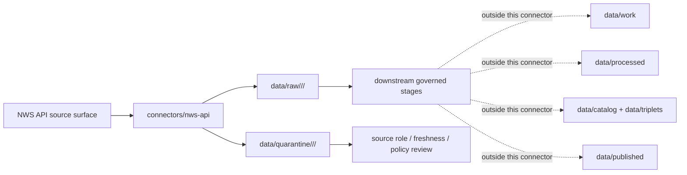

<!-- [KFM_META_BLOCK_V2]
doc_id: kfm://doc/connectors-nws-api-readme
title: connectors/nws-api/ — NOAA NWS API Connector Lane
type: readme
version: v0.1
status: draft
owners: OWNER_TBD — Connector steward · Source steward · NOAA steward · Hazards steward · Atmosphere steward · Data steward · Validation steward · Docs steward
created: 2026-06-20
updated: 2026-06-20
policy_label: public; life-safety-sensitive; contextual-only; source-admission-only
related:
  - ../README.md
  - ../noaa/README.md
  - ../../docs/doctrine/directory-rules.md
  - ../../docs/sources/catalog/noaa/README.md
  - ../../docs/sources/catalog/noaa/nws-api.md
  - ../../docs/sources/catalog/noaa/storm-events.md
  - ../../docs/sources/catalog/noaa/hms-fire-smoke.md
  - ../../docs/sources/catalog/noaa/hrrr-smoke.md
  - ../../docs/sources/catalog/noaa/noaa-uscrn.md
  - ../../docs/domains/hazards/README.md
  - ../../docs/domains/atmosphere/README.md
  - ../../docs/architecture/hazards-trust-membrane.md
  - ../../docs/architecture/source-roles.md
  - ../../data/registry/sources/
  - ../../data/raw/
  - ../../data/quarantine/
  - ../../data/receipts/
  - ../../data/proofs/
  - ../../policy/rights/
  - ../../policy/sensitivity/
  - ../../release/
tags: [kfm, connectors, nws-api, noaa, nws, hazards, atmosphere, alerts, warnings, watches, advisories, forecasts, cap, observations, source-admission, raw, quarantine, not-life-safety, governance]
notes:
  - "Connector lane for NOAA National Weather Service API source intake and admission helpers."
  - "Placement is draft / open: Directory Rules §7.3 lists noaa/ as canonical but does not settle this nws-api sibling versus a nested connectors/noaa/nws-api/ lane."
  - "NWS API is multi-component: forecasts are modeled, warnings/advisories/watches are regulatory-context and contextual-only, and station observations are observations."
  - "KFM is not an emergency alerting system and must not rebroadcast NWS messages as KFM-issued alerts."
  - "Issue time, expiry time, message id, geometry/zone, freshness state, official-source link, source URL, and digest are load-bearing."
  - "Connector output may enter raw or quarantine admission lanes only."
[/KFM_META_BLOCK_V2] -->

<a id="top"></a>

# NWS API Connector

> Draft source-specific intake and admission lane for NOAA National Weather Service API material used by KFM Hazards and Atmosphere workflows.

<p>
  
  
  
  
  
  
  
</p>

`connectors/nws-api/`

## Quick jumps

[Scope](#scope) · [Repo fit](#repo-fit) · [Component admission model](#component-admission-model) · [Lifecycle sketch](#lifecycle-sketch) · [Authority boundary](#authority-boundary) · [Inputs](#inputs) · [Exclusions](#exclusions) · [Admission posture](#admission-posture) · [Anti-collapse posture](#anti-collapse-posture) · [Validation](#validation) · [Definition of done](#definition-of-done)

---

## Scope

`connectors/nws-api/` is a draft connector lane for NOAA NWS API source intake and admission helpers.

This folder may contain connector-local documentation, source-admission helpers, request/client helpers, CAP/message parsers, forecast parsers, station-observation parsers, freshness helpers, official-source-link helpers, checksum/digest helpers, no-network fixture pointers, and raw/quarantine output adapters for NWS API material.

It must not become NOAA source-family truth, NWS API product doctrine, emergency alerting authority, KFM-issued alert authority, forecast truth, live warning state truth, station truth, policy authority, schema authority, catalog/triplet authority, proof authority, release authority, pipeline authority, public API behavior, or public UI behavior.

> [!IMPORTANT]
> **Status:** draft / `NEEDS VERIFICATION`  
> **Owner:** `OWNER_TBD`  
> **Path:** `connectors/nws-api/`  
> **Truth posture:** the path exists in the repository as this README; actual source descriptors, endpoints, rate limits, tests, fixtures, parser behavior, freshness behavior, rights posture, CI wiring, and release behavior remain `NEEDS VERIFICATION`.

---

## Repo fit

```text
connectors/
├── noaa/
│   └── README.md
└── nws-api/
    └── README.md
```

Related responsibility roots:

```text
connectors/noaa/                         # canonical NOAA connector-family lane
connectors/nws-api/                      # draft sibling NWS API connector lane
docs/sources/catalog/noaa/nws-api.md     # NWS API source-product doctrine
docs/sources/catalog/noaa/               # NOAA source-family/product docs
docs/domains/hazards/                    # hazards doctrine and trust membrane
docs/domains/atmosphere/                 # atmosphere / forecast / observation context
data/registry/sources/                   # source descriptors and activation state
data/raw/                                # raw staged source outputs by owning domain
data/quarantine/                         # held material requiring source/role/freshness/policy review
data/receipts/                           # ingest, freshness, transform, and review receipts
data/proofs/                             # EvidenceBundles and proof packs
policy/rights/                           # terms, attribution, and source-use review
policy/sensitivity/                      # life-safety, public-safety, and release rules
release/                                 # release decisions, manifests, rollback, correction state
```

> [!WARNING]
> `connectors/nws-api/` is a draft/open connector placement. Directory Rules §7.3 lists `connectors/noaa/` as the canonical NOAA connector family. Keep this lane as a draft sibling unless an ADR, migration note, or updated Directory Rules ratifies sibling placement or moves it under `connectors/noaa/nws-api/`.

---

## Component admission model

NWS API is multi-component. The connector must preserve component identity and source-role boundaries.

| Component | Default KFM posture | Required connector posture |
|---|---|---|
| Warnings / watches / advisories / alerts | `regulatory-context`, contextual-only, not KFM-issued. | Preserve NWS id, CAP/message fields, event type, severity/urgency/certainty where present, issue time, effective time, expiry time, zones/geometry, official-source link, freshness state, and digest. |
| Forecasts | `modeled`. | Preserve forecast office/grid/zone, issue/cycle time, lead time, valid time, geometry/zone, text/numeric fields, source URL, and digest. |
| Station observations | `observation`. | Preserve station id, timestamp, variable, value, units, quality flags where present, source URL, and digest. |
| Aggregates or rollups | `aggregate`. | Preserve aggregation receipt requirements, geometry scope, time window, component source links, and caveats. |
| Unknown or mixed component | `candidate` / quarantine. | Do not publish; require source-role and freshness review before promotion. |

---

## Lifecycle sketch



> [!CAUTION]
> Connector code admits source material. It does not issue alerts, provide life-safety instructions, decide current warning display, publish map layers, answer public claims, or decide release state. Promotion remains a governed state transition, not a file move.

---

## Authority boundary

```text
OUTPUT LIMIT:
  data/raw/<domain>/<source_id>/<run_id>/
  data/quarantine/<domain>/<source_id>/<run_id>/

NOT HERE:
  NOAA source-family truth
  NWS API product doctrine
  KFM-issued alert authority
  life-safety guidance
  current public warning state
  forecast truth
  station truth
  source descriptor authority
  rights or sensitivity policy
  processed hazard/atmosphere derivatives
  catalog records
  triplet records
  public map artifacts
  receipts/proofs as authority
  release decisions
  public API behavior
  public UI behavior
```

---

## Inputs

| Accepted item | Required posture |
|---|---|
| Request helper | Preserve endpoint, path, query parameters, headers needed for provenance, response status, retrieval time, and digest. |
| CAP/message parser | Preserve NWS message id, event type, status, severity/urgency/certainty where present, affected zones/geometry, issue/effective/expiry times, official-source link, and digest. |
| Forecast parser | Preserve forecast office/grid/zone, issue/cycle time, lead time, valid time, geometry/zone, values/text, source URL, and digest. |
| Observation parser | Preserve station id, timestamp, variable, value, units, quality flags, source URL, and digest. |
| Freshness helper | Compute state from issue/effective/expiry/retrieval times; stale operational context must not appear current downstream. |
| Policy flag helper | Mark not-for-life-safety, no KFM rebroadcast, official-source redirection, and review requirements. |
| Test references | Point to owning fixture/test roots; fixtures do not become source authority. |

---

## Exclusions

| Do not store here | Correct home |
|---|---|
| NOAA source-family doctrine | `docs/sources/catalog/noaa/README.md` or `docs/sources/catalog/noaa.md` |
| NWS API product doctrine | `docs/sources/catalog/noaa/nws-api.md` |
| Authoritative `SourceDescriptor` records | `data/registry/sources/` |
| Hazards or Atmosphere doctrine | `docs/domains/hazards/`, `docs/domains/atmosphere/` |
| Rights, sensitivity, safety, or release policy | `policy/`, `policy/sensitivity/`, `release/` |
| Processed hazard or atmosphere derivatives | `data/processed/` |
| Catalog or triplet records | `data/catalog/`, `data/triplets/` |
| Public map artifacts | `data/published/` after governed release |
| Receipts and proof packs as authority | `data/receipts/`, `data/proofs/` |
| Schemas or semantic contracts | `schemas/`, `contracts/` |
| Public API or UI behavior | `apps/governed-api/`, `apps/explorer-web/` |

---

## Admission posture

NWS API intake should preserve:

- source identity and source surface;
- active source descriptor reference or quarantine reason;
- component type and component-specific source role;
- endpoint/path/query, response status, retrieval time, source URL, and digest;
- NWS message id or forecast/station identifier where applicable;
- issue time, effective time, expiry time, valid time, forecast cycle, lead time, observation time, and freshness state where applicable;
- event type, severity/urgency/certainty, zone/geometry, forecast office/grid/zone, station id, variable, value, units, quality flags, and official-source link where applicable;
- not-for-life-safety and no-KFM-alert posture;
- rights/citation/sensitivity posture;
- raw/quarantine handoff envelope and receipt linkage.

---

## Anti-collapse posture

| Rule | Connector implication |
|---|---|
| NWS warning is not a KFM alert. | Admit as contextual evidence only; never repackage as KFM-issued alert. |
| Expired warning is not current warning state. | Preserve expiry and freshness; stale operational context routes away from current display. |
| Forecast is not observation. | Forecast components remain modeled. |
| Station observation is not regional truth. | Preserve station/time/quality context; downstream aggregation needs receipts. |
| Watch, warning, advisory, and alert are not interchangeable. | Preserve event type and message semantics. |
| Component roles must not collapse. | Forecast, warning context, observation, aggregate, and candidate states stay separate. |
| KFM display is not official source. | Any downstream released context must point users to the official NWS source for decisions. |
| Public display is downstream. | The connector must not build public tiles, UI panels, public alert surfaces, or release payloads. |

---

## Validation

Before relying on this connector, verify:

- connector placement is ratified or recorded in the drift/open-question register;
- active SourceDescriptors exist for each admitted NWS API component;
- current NWS API endpoint behavior, rate limits, message formats, and rights posture are verified;
- component-specific source-role handling is implemented;
- freshness, issue, effective, expiry, valid, cycle, and retrieval times are preserved;
- not-for-life-safety and no-KFM-alert policy flags are enforced;
- tests use no-network fixtures where practical;
- output paths are limited to raw/quarantine admission lanes;
- downstream receipts, proofs, catalog/triplet records, public map artifacts, and release records are produced only outside this connector;
- public products are released only through governed publication controls and never as life-safety guidance, KFM-issued alerts, or official-source substitutes.

---

## Definition of done

- [ ] Owners are confirmed and `OWNER_TBD` is replaced.
- [ ] Placement is ratified by ADR, migration note, or updated Directory Rules, or recorded as open drift.
- [ ] Actual connector contents are inventoried.
- [ ] NWS API component `SourceDescriptor` IDs and source-family activation are verified.
- [ ] Current endpoint behavior, message formats, rate limits, rights, citation, and freshness posture are documented.
- [ ] Parsers preserve component identity, source role, issue/effective/expiry/valid/retrieval times, zones/geometry, official-source links, and digests.
- [ ] Tests prevent silent conversion of NWS warnings into KFM-issued alerts, forecasts into observations, stale records into current state, or station observations into regional truth.
- [ ] Outputs are verified to enter only raw or quarantine admission lanes.
- [ ] No source-family, domain, processed, catalog, triplet, published, release, schema, policy, proof, receipt, registry, fixture, report, API, UI, tile, alerting, life-safety, official-source, or current-state authority lives here.
- [ ] Tests, fixtures, and CI behavior are verified or marked `NEEDS VERIFICATION`.

---

## Status summary

`connectors/nws-api/` is for NWS API source-admission code only. It is not NOAA source-family truth, NWS API product doctrine, KFM-issued alert authority, life-safety guidance, current warning-state authority, forecast truth, station truth, policy authority, schema authority, catalog/triplet authority, proof closure, release authority, public map authority, public API behavior, public UI behavior, or pipeline authority.

<p align="right"><a href="#top">Back to top</a></p>
