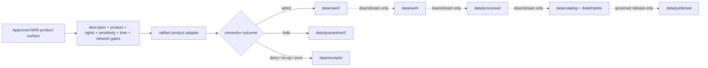

<!-- [KFM_META_BLOCK_V2]
doc_id: kfm://doc/connectors-nws-readme
title: connectors/nws/ — National Weather Service Connector Coordination Lane
type: readme
version: v0.2
status: draft
owners: OWNER_TBD — Connector steward · Source steward · NOAA steward · NWS steward · Hazards steward · Atmosphere steward · Safety reviewer · Rights reviewer · Sensitivity reviewer · Data steward · Migration steward · Validation steward · CI steward · Docs steward
created: 2026-06-20
updated: 2026-07-15
policy_label: public-doctrine; life-safety-sensitive; coordination-boundary; source-admission-only; not-alert-authority; no-network-by-default; descriptor-gated; rights-gated; sensitivity-gated; raw-quarantine-receipts-only; no-publication
current_path: connectors/nws/README.md
truth_posture: CONFIRMED target README and current path, Directory Rules connector responsibility, connectors root boundary, NOAA family boundary, NWS API sibling boundary, NWS context watcher README, NWS API product page, official NWS API documentation and FAQ checked 2026-07-15, official Service Change Notice surface, and current NWS API documentation update date / CONFLICTED canonical implementation topology across connectors/noaa, connectors/nws, and connectors/nws-api / UNKNOWN executable NWS connector code, active SourceDescriptors, accepted adapter home, import consumers, network configuration, tests, fixtures, schedules, emitted receipts, CI enforcement depth, deployment, and downstream release state / NEEDS VERIFICATION owners, topology ADR or migration note, source activation, non-API NWS product inventory, endpoint and product profiles, rights and attribution, parser contracts, fixture approval, validation bindings, correction propagation, deactivation, and rollback automation
evidence_snapshot:
  repository: bartytime4life/Kansas-Frontier-Matrix
  visibility: public
  base_ref: main
  base_commit: 1926d076eca443dfc64a8b43a5e532f1d67fcb9d
  prior_blob: 053b418bef11a06059cc9320c389d62b3e90ccf4
  related_repository_blobs:
    directory_rules: 2affb080e6f0043867c64c7f06c1ca52030fbd55
    connectors_root_readme: bdd50032bed62ac36964c79f16cf5541b21759a6
    noaa_family_readme: d57782414d5a7a3116f1a080b8048ae0c22f69bf
    nws_api_readme: 1f57afd9a21728a4e8ebb4c63342b051a8a6f18b
    nws_api_product_page: 3d310e7e5ac4d746f667838cffdeb03c48fe9855
    nws_context_watch_readme: fc158a4b8ccdbb3bae5a5738b89456d85ddb6cae
related:
  - ../README.md
  - ../noaa/README.md
  - ../nws-api/README.md
  - ../../tools/ingest/nws_context_watch/README.md
  - ../../docs/doctrine/directory-rules.md
  - ../../docs/sources/catalog/noaa/README.md
  - ../../docs/sources/catalog/noaa/nws-api.md
  - ../../docs/sources/catalog/noaa/storm-events.md
  - ../../docs/sources/catalog/noaa/hms-fire-smoke.md
  - ../../docs/sources/catalog/noaa/hrrr-smoke.md
  - ../../docs/sources/catalog/noaa/noaa-uscrn.md
  - ../../docs/domains/hazards/README.md
  - ../../docs/domains/atmosphere/README.md
  - ../../docs/architecture/hazards-trust-membrane.md
  - ../../docs/architecture/source-roles.md
  - ../../data/registry/sources/
  - ../../data/raw/
  - ../../data/quarantine/
  - ../../data/receipts/
  - ../../data/proofs/
  - ../../schemas/contracts/v1/source/
  - ../../policy/rights/
  - ../../policy/sensitivity/
  - ../../release/
tags: [kfm, connectors, nws, noaa, source-coordination, hazards, atmosphere, alerts, warnings, watches, advisories, forecasts, observations, cap, service-change, source-admission, raw, quarantine, receipts, no-network, not-life-safety, no-publication, governance]
notes:
  - "v0.2 applies the KFM GitHub Repository Documentation Implementation Agent v3.1 connector README profile."
  - "Directory Rules v1.4 §7.3 assigns source-specific fetch and admission behavior to connectors/. The current path is responsibility-root compliant, but canonical NOAA/NWS implementation topology remains conflicted because connectors/noaa/, connectors/nws/, and connectors/nws-api/ coexist."
  - "This lane is the broader NWS coordination and compatibility boundary. API-specific transport and parsing detail belongs in connectors/nws-api/ unless an accepted ADR or migration note changes the topology."
  - "The proposed tools/ingest/nws_context_watch/ lane emits review signals only; it is not a connector, current-warning authority, alert relay, or publisher."
  - "This revision does not move, rename, delete, deprecate, or supersede any connector path and does not authorize duplicate clients or parsers."
  - "NWS products remain NWS-issued. KFM may preserve approved material only as source-faithful, official-source-linked context and is never an alerting or life-safety authority."
  - "Connector and watcher activity is source admission or review signaling only and is never publication authority."
[/KFM_META_BLOCK_V2] -->

<a id="top"></a>

# NWS Connector Coordination Lane

> Governed coordination and compatibility boundary for National Weather Service source products, source-role separation, product-adapter routing, and RAW or QUARANTINE admission—without duplicating the API client, issuing alerts, or becoming a public-safety authority.

<p>
  
  
  
  
  
  
  
  
</p>

`connectors/nws/`

## Quick navigation

[Status](#status-and-evidence-boundary) · [Purpose](#purpose) · [Repository fit](#repository-fit-and-topology) · [Current state](#confirmed-current-state) · [NWS API relationship](#relationship-to-the-nws-api-lane) · [Watcher relationship](#relationship-to-the-nws-context-watcher) · [Product model](#nws-product-and-source-role-model) · [Life safety](#life-safety-and-official-source-boundary) · [Adapter contract](#product-adapter-and-transport-contract) · [Configuration](#authentication-configuration-and-network-posture) · [Time](#time-freshness-outages-and-false-all-clear-prevention) · [Lifecycle](#lifecycle-and-finite-connector-outcomes) · [Identity](#identity-hashing-deduplication-and-replay) · [Parsing](#parsing-and-preservation-contract) · [Receipts](#receipts-evidence-references-and-emitted-artifacts) · [Rights](#rights-sensitivity-and-data-minimization) · [Testing](#testing-and-no-network-fixtures) · [Resilience](#rate-limits-retries-timeouts-and-circuit-breaking) · [Watchers](#watchers-service-change-and-drift) · [Activation](#activation-and-promotion-gates) · [Rollback](#correction-deactivation-rollback-and-supersession) · [Directory map](#directory-map-and-topology-options) · [Done](#definition-of-done) · [Open](#verification-backlog) · [Evidence](#evidence-basis)

---

## Status and evidence boundary

> [!IMPORTANT]
> **Document lifecycle:** `draft`  
> **Component maturity:** documentation and coordination boundary; executable implementation not established  
> **Owner:** `OWNER_TBD`  
> **Path:** `connectors/nws/`  
> **Placement:** NWS source-specific connector work belongs under `connectors/` per [`Directory Rules` §7.3](../../docs/doctrine/directory-rules.md)  
> **Topology:** `CONFLICTED / NEEDS VERIFICATION` because `connectors/noaa/`, `connectors/nws/`, and `connectors/nws-api/` overlap as family, broader-NWS, and API-product boundaries  
> **Truth posture:** the README and current path are confirmed at the inspected base commit. Active source descriptors, executable code, package integration, accepted topology, non-API NWS product profiles, network configuration, tests, fixtures, schedules, emitted receipts, CI enforcement depth, and release behavior remain `UNKNOWN` or `NEEDS VERIFICATION`.

This README is an implementation-boundary document. It does not activate an NWS source, authorize network access, approve a product adapter, establish current warning state, issue a notification, assign source authority, approve rights, classify public sensitivity, close an `EvidenceBundle`, or authorize publication.

---

## Purpose

`connectors/nws/` defines the broader NWS coordination boundary inside the NOAA connector family.

It may coordinate:

- mapping NWS products to product-specific connector adapters;
- preserving the distinction between NWS-issued public-safety communications, forecasts, observations, administrative context, archives, and unknown material;
- documenting which active `SourceDescriptor` governs each approved product;
- product-neutral NWS admission rules that are not already owned by the NOAA family root;
- compatibility references while the repository resolves the flat-versus-family adapter topology;
- RAW, QUARANTINE, and connector-receipt handoff expectations;
- migration, deprecation, correction, replay, and rollback notes for NWS connector paths;
- no-network test expectations shared across approved NWS product adapters.

It must not become:

- an emergency-alert relay, notification system, siren, pager, messaging service, or protective-action engine;
- a KFM-issued warning, watch, advisory, forecast, observation, or regulatory determination;
- a duplicate `api.weather.gov` client, parser stack, fixture authority, or request profile parallel to `connectors/nws-api/`;
- NOAA, NWS, or NWS API product doctrine;
- the canonical source registry or source-activation authority;
- schema, contract, rights-policy, sensitivity-policy, review, or release authority;
- a scheduler, uncontrolled watcher, or direct service-health monitor;
- a processed hazards or atmosphere pipeline;
- a catalog, triplet, `EvidenceBundle`, proof-pack, publication, correction, or rollback authority;
- a direct MapLibre, tile, public API, public UI, search, graph, dashboard, export, automation, or AI-answer source.

---

## Repository fit and topology

Directory Rules establish `connectors/` as the implementation root for source-specific fetch and admission. That resolves the responsibility root. It does **not** resolve the current NOAA/NWS product topology.

```text
connectors/
├── README.md                         # connector-root contract
├── noaa/README.md                    # NOAA family boundary
├── nws/README.md                     # broader NWS coordination boundary; this file
└── nws-api/README.md                 # api.weather.gov product boundary

tools/
└── ingest/nws_context_watch/
    └── README.md                     # review-signal tooling boundary; not a connector
```

### Current topology determination

| Surface | Confirmed role | Current constraint |
|---|---|---|
| [`connectors/README.md`](../README.md) | Repository-wide connector boundary. | All connector work remains source admission only. |
| [`connectors/noaa/`](../noaa/) | NOAA family documentation and placeholder package boundary. | Product topology and executable adapters remain incomplete. |
| `connectors/nws/` | Broader NWS coordination and compatibility boundary. | Must not grow a duplicate product client or parser stack. |
| [`connectors/nws-api/`](../nws-api/) | API-specific documentation boundary for `api.weather.gov`. | Executable implementation home remains unratified. |
| [`tools/ingest/nws_context_watch/`](../../tools/ingest/nws_context_watch/) | Proposed review-signal tooling lane. | Watcher executable is not confirmed and cannot admit or publish. |
| [`docs/sources/catalog/noaa/nws-api.md`](../../docs/sources/catalog/noaa/nws-api.md) | NWS API product doctrine. | Does not prove endpoint activation or runtime behavior. |
| [`data/registry/sources/`](../../data/registry/sources/) | Canonical source identity and activation authority. | Active NWS descriptors remain `NEEDS VERIFICATION`. |

> [!WARNING]
> **Do not implement the same NWS behavior in multiple lanes.** Before adding executable code, an ADR or migration note must select or reconcile the adapter home, import path, compatibility behavior, test ownership, and rollback plan. This README does not silently choose between a broad NWS package, the flat API product lane, or an adapter inside the NOAA family package.

No move, rename, deletion, redirect, deprecation, or supersession is authorized by this update.

---

## Confirmed current state

At base commit `1926d076eca443dfc64a8b43a5e532f1d67fcb9d`:

| Item | Status | What the evidence proves | What it does not prove |
|---|---:|---|---|
| `connectors/nws/README.md` | `CONFIRMED` | The broader NWS README exists. | It does not prove executable code, source activation, tests, or runtime behavior. |
| Repository search for `connectors/nws/` | `CONFIRMED bounded result` | The search surfaced this README as the connector-lane file. | Search-result absence is not a complete recursive tree proof. |
| `connectors/noaa/README.md` | `CONFIRMED` | A rich NOAA family boundary exists. | It does not establish an executable NWS adapter. |
| NOAA package metadata | `CONFIRMED placeholder` through the family README | The family package is documented as version `0.0.0`, with an empty package initializer in its evidence snapshot. | Installability, dependencies, imports, or implemented clients are not established. |
| `connectors/nws-api/README.md` | `CONFIRMED v0.2` | The API-specific boundary documents current official service constraints and topology conflict. | It does not prove executable code or source activation. |
| `tools/ingest/nws_context_watch/README.md` | `CONFIRMED draft documentation` | The watcher boundary exists and is explicitly review-signal only. | The watcher executable, schedule, or reports are not established. |
| `docs/sources/catalog/noaa/nws-api.md` | `CONFIRMED draft documentation` | Product-role, freshness, and anti-collapse doctrine are recorded. | It does not prove current endpoint schemas, rights, rate behavior, or runtime implementation. |
| Active NWS descriptors | `NEEDS VERIFICATION` | Must be resolved in the canonical source registry. | Documentation does not activate a source. |
| Connector tests and no-network fixtures | `UNKNOWN` | No NWS-lane executable test inventory was verified. | This README is not test evidence. |
| Scheduled runs and emitted receipts | `UNKNOWN` | No current run, scheduler, receipt, or deployment evidence was inspected. | No ingestion, availability, or current-state claim is supported. |

---

## Relationship to the NWS API lane

`connectors/nws-api/` is the product-specific boundary for `api.weather.gov`. It is the current repository document that carries API transport, discovery, content-negotiation, cache, filtering, and endpoint-specific expectations.

This broader NWS lane must not repeat those details as a second implementation contract. It should reference and coordinate them.

| Concern | `connectors/nws/` | `connectors/nws-api/` |
|---|---|---|
| NWS-wide source-product coordination | Yes, documentation and compatibility only. | No; API product scope only. |
| `api.weather.gov` request behavior | Reference only. | Product-specific boundary of record, pending topology decision. |
| Required `User-Agent`, `Accept`, cache, linked discovery | Inherited by reference when the API adapter is used. | Documented in detail. |
| Alerts, forecasts, observations through the API | Role and authority coordination. | Endpoint-specific preservation contract. |
| Non-API NWS products | May be indexed only after source-product evidence and descriptor review. | Out of scope. |
| Executable HTTP client | Do not duplicate. | `NEEDS VERIFICATION`; topology ADR required before implementation. |
| Test fixtures | Shared expectations may be stated. | Product-specific fixtures belong with the ratified adapter/test home. |

> [!IMPORTANT]
> The broader lane does not turn every NWS product into an NWS API product. Each product requires its own source identity, source role, rights, cadence, format, temporal semantics, and activation decision.

---

## Relationship to the NWS context watcher

`tools/ingest/nws_context_watch/` is a tooling boundary for detecting review-worthy changes in approved NWS context surfaces.

The watcher may propose review work for:

- source metadata drift;
- CAP or message-identifier changes;
- issue, effective, onset, end, expiry, or sent-time changes;
- freshness or stale-state changes;
- forecast cycle or lead-time changes;
- station-observation summary changes;
- zone or geometry fingerprint changes;
- component-role ambiguity;
- official-source-link loss;
- service-change notice review.

The watcher must not:

- fetch source payloads as the connector of record;
- admit RAW or QUARANTINE material;
- establish current warning state;
- issue or rebroadcast alerts;
- provide protective-action guidance;
- mutate descriptors, schemas, policies, or product roles;
- close evidence, update catalogs, publish layers, or release artifacts.

A watcher result is a **review signal**, not an admission decision, public alert, current-state claim, or publication action.

---

## NWS product and source-role model

NWS is an issuing organization with heterogeneous products. The repository must preserve product identity and source-role distinctions.

| Product or material class | Default KFM posture | Required coordination rule |
|---|---|---|
| Warnings, watches, advisories, and alerts | `regulatory-context`; contextual only; NWS-issued. | Preserve issuer, identifier, product/event type, status, severity, urgency, certainty, response type, message type, official link, spatial scope, and all relevant time fields. Never reissue as KFM alerts. |
| Forecasts and forecast grids | `modeled`. | Preserve issuing office, grid or zone identity, issue/cycle time, lead time, valid period, units, nulls, caveats, and model-versus-observation distinction. |
| Station observations | `observation`. | Preserve station identity, observation time, receipt time, variables, units, quality-control fields, provider/upstream fields where available, and spatial support. Never promote one station to regional truth. |
| Product or service metadata | `administrative-context` or repository-approved equivalent. | Preserve product identity, service version, links, format, update notices, and activation state without turning metadata into observed weather truth. |
| Historical archives | `historical-context` or repository-approved equivalent. | Preserve archive authority, coverage, retrieval time, supersession, and non-current posture. |
| Aggregates or rollups | `aggregate`. | Require an aggregation receipt, input references, time window, spatial scope, method, missingness, and caveats. |
| Unknown, mixed, malformed, or unclassified material | `candidate` / QUARANTINE. | Do not publish or infer a role. Require source steward, domain steward, and policy review. |

Role names above remain subject to accepted repository contracts. The invariant is the separation of epistemic kinds, not any unverified enum spelling.

---

## Life-safety and official-source boundary

> [!CAUTION]
> **KFM is not an emergency alerting system.** NWS is the issuing authority for its products. This connector family may preserve source-faithful NWS material for governed context; it must not issue alerts, replace official channels, provide protective-action instructions, or imply that KFM has verified a safe or unsafe condition.

Required rules:

1. **NWS warning is not a KFM warning.** Issuer identity and official-source links remain visible.
2. **Unavailable data is not an all-clear.** Network failure, empty response, cache miss, parse failure, stale state, or delayed observations must never be interpreted as “no hazard.”
3. **Expired context is not current context.** Expiry, end, cancellation, supersession, and freshness states remain load-bearing.
4. **Forecast is not observation.** Modeled future conditions cannot be relabeled as measured current state.
5. **Station observation is not regional truth.** Spatial support and station quality remain visible.
6. **Watch, warning, advisory, statement, and alert are not interchangeable.** Preserve product and message semantics.
7. **KFM display is not the official service.** Any downstream released context must direct users to official NWS channels for decisions.
8. **Connector success is not public readiness.** Retrieval, parsing, or admission does not equal validation, policy approval, evidence closure, release, or publication.
9. **AI summaries are not safety instructions.** Generated language cannot replace the original NWS product or official guidance.

Finite safety posture for current public-safety questions should fail closed to official-source redirection, `ABSTAIN`, `DENY`, or `ERROR` under the accepted runtime contract.

---

## Product adapter and transport contract

No product adapter is active merely because this folder exists.

Every approved NWS product adapter must define:

| Concern | Required evidence |
|---|---|
| Product identity | Product name, issuing NWS office or center where applicable, source family, stable source id, and active descriptor. |
| Distribution surface | Approved endpoint, feed, archive, file, or service identifier; allowed host; path/query policy; access date. |
| Protocol and media type | HTTP or other protocol, negotiated format, content type, compression, encoding, and schema/specification reference. |
| Authentication or identification | Required headers, API key or credential posture if introduced, secret-handling boundary, and redaction rules. |
| Request bounds | Geography, time range, product type, field selection, pagination, redirects, timeout, retry, payload-size, and decompression limits. |
| Completeness | Expected pages, links, continuation tokens, date windows, zone lists, station lists, or explicit bounded-query receipt. |
| Temporal semantics | Issued, sent, effective, onset, ends, expires, valid, observation, source, retrieval, release, and correction times where material. |
| Source role | Product-specific role and anti-collapse rule. |
| Rights and attribution | Official terms, attribution, citation, redistribution, and derived-use posture. |
| Sensitivity and minimization | Requested fields, precision, location handling, logging limits, and downstream restrictions. |
| Integrity | Request fingerprint, response status, headers, content length, digest, canonical identity, and replay information. |
| Failure behavior | Finite outcomes, reason codes, retry classification, quarantine rules, stale-cache rules, and no-false-all-clear behavior. |
| Tests | No-network valid, invalid, stale, delayed, cancelled, superseded, rate-limited, unavailable, malformed, and role-collapse fixtures. |

NWS API-specific behavior is inherited from `connectors/nws-api/README.md` and must not be reimplemented here.

---

## Authentication, configuration, and network posture

The NWS coordination lane owns no credentials and authorizes no network access.

Configuration must be:

- explicit;
- non-secret unless a future product truly requires a credential;
- validated before network use;
- descriptor- and policy-gated;
- no-network by default for tests and documentation builds;
- separated from source payloads and receipts;
- redacted in logs and pull-request output;
- scoped to approved hosts, products, geographies, fields, and time windows.

For `api.weather.gov`, the API-specific sibling records the current official requirement for an identifying `User-Agent`, media negotiation, linked discovery, caching, and unpublished rate limits. This broader lane must not invent a second environment-variable vocabulary or embed personal contact information.

No README example should contain:

- a real personal email address;
- credentials, tokens, cookies, private endpoints, or internal hostnames;
- unrestricted bulk-query defaults;
- an implication that lack of authentication means unrestricted use;
- a retry loop without upper bounds;
- cache-busting query parameters;
- a fallback that silently changes the source product or authority.

---

## Time, freshness, outages, and false-all-clear prevention

NWS material is unusually time-sensitive. Preserve distinct time kinds rather than one generic timestamp.

Potentially load-bearing fields include:

- product generation time;
- message `sent` time;
- issue time;
- effective time;
- onset time;
- end time;
- expiry time;
- cancellation or supersession time;
- forecast cycle time;
- lead time;
- valid start and end;
- observation time;
- source ingest time;
- retrieval time;
- cache validation time;
- KFM release time;
- correction or withdrawal time.

Freshness must be component-specific.

| Condition | Required connector posture |
|---|---|
| Active, source-valid, within the approved window | May be admitted as source material; still not released or actionable by default. |
| Expired, ended, cancelled, or superseded | Preserve history and lineage; do not present as current. |
| Missing required time fields | QUARANTINE or `ABSTAIN`; do not infer currentness. |
| Delayed observation | Preserve delay and upstream caveat; do not relabel as latest current state. |
| API or source outage | Emit failure/health evidence; do not infer “no alerts” or “safe.” |
| Cached response | Preserve cache headers, age, validator result, retrieval time, and stale state. |
| Empty response | Distinguish a valid empty result from request failure, filtering error, partial result, or unavailable service. |
| Product changed after admission | Emit correction/supersession candidate; do not silently overwrite lineage. |

A freshness computation is a derived assessment and must be reproducible from preserved time fields and policy rules.

---

## Lifecycle and finite connector outcomes



Proposed connector-local outcomes, pending contract verification:

- `ADMIT_RAW`
- `QUARANTINE`
- `NO_CHANGE`
- `NOT_MODIFIED`
- `RATE_LIMITED`
- `DEFERRED`
- `ABSTAIN`
- `DENY`
- `ERROR`

Each outcome should carry:

- product and descriptor reference;
- request or input fingerprint;
- component class and proposed source role;
- retrieval or inspection time;
- freshness/time-window assessment;
- response status or local-input state;
- bytes or record counts where applicable;
- digest or prior digest;
- reason code;
- retryability;
- official-source link;
- output reference, if any;
- redacted error summary;
- tool or adapter version;
- correction or supersession reference when applicable.

These names remain `PROPOSED` until matched to accepted contracts. The required property is finite, auditable behavior—never silent success, silent partial results, or false all-clear.

---

## Identity, hashing, deduplication, and replay

Identity must be product-specific.

Possible deterministic ingredients include:

- source id;
- NWS product or message identifier;
- issuing office or center;
- component type;
- station, grid, zone, UGC, or other source-native identifier;
- issue/cycle/observation/valid time;
- canonical request path and sorted query parameters;
- negotiated media type and feature flags;
- normalized payload digest;
- source revision, amendment, cancellation, or supersession marker.

Required distinctions:

| Digest or identity | Purpose |
|---|---|
| Request fingerprint | Reproduce the approved request without storing secrets. |
| Raw payload digest | Prove the bytes received. |
| Parsed-record digest | Detect parser or normalization changes. |
| Metadata/header digest | Track schema, cache, link, and service metadata drift. |
| Semantic identity | Deduplicate the same NWS product revision across repeated retrievals. |
| Run id | Distinguish retrieval attempts even when content is unchanged. |

Deduplication must not erase:

- amendments;
- updates;
- cancellations;
- corrections;
- expiry transitions;
- source-link changes;
- geometry or zone changes;
- late observations;
- forecast-cycle changes;
- parser-version differences;
- policy or descriptor changes.

Replay must use pinned fixtures or captured approved bytes, pinned parser/config versions, and preserved request metadata. A successful replay proves determinism for the pinned inputs; it does not prove current service state.

---

## Parsing and preservation contract

Parsers must preserve source semantics before normalization.

### Alerts, watches, warnings, advisories, and related messages

Preserve, where present:

- source-native id;
- issuer and sender;
- message type and status;
- event/product type;
- category;
- severity;
- certainty;
- urgency;
- response type;
- headline, description, instruction, area description, and parameters without unsafe reinterpretation;
- sent, effective, onset, ends, and expires times;
- affected zones and geometry;
- references, prior messages, amendments, cancellations, and official-source links;
- language and media type;
- nulls, missing geometry, and source caveats.

Instruction text remains source content. KFM must not rewrite it into new protective-action guidance.

### Forecasts

Preserve:

- issuing office or center;
- grid, point, zone, or product identity;
- issue/cycle time;
- forecast periods;
- lead time;
- valid start and end;
- units and quantitative-value structure;
- text, nulls, quality/caveat fields, and update lineage;
- source links and media type.

Forecasts remain `modeled`, not observations.

### Observations

Preserve:

- station and provider identity;
- observation and retrieval times;
- coordinates and elevation where approved;
- variables, values, units, nulls, quality-control fields, and upstream caveats;
- raw and normalized values where transformation occurs;
- source links and parser version.

Observations remain station- and time-specific.

### Metadata, administrative, archive, or unknown material

Preserve product identity, version, issuing organization, coverage, time window, links, format, and role-candidate reason. Unknown or mixed material routes to QUARANTINE.

Parsers must reject or quarantine material that is:

- malformed;
- unexpectedly typed;
- missing load-bearing identity or time fields;
- incompatible with the negotiated media type;
- outside approved geography, product, or time scope;
- partial without an explicit partial-result disposition;
- oversized or decompression-unsafe;
- source-role ambiguous;
- rights- or sensitivity-unclear.

---

## Receipts, evidence references, and emitted artifacts

Connector evidence is not evidence closure.

A connector run may emit or reference:

- probe receipt;
- retrieval receipt;
- cache-validation or not-modified receipt;
- rate-limit or deferred receipt;
- no-op receipt;
- failure receipt;
- quarantine receipt;
- admission receipt;
- schema-drift report;
- source-metadata drift report;
- correction or supersession candidate;
- deactivation report.

A receipt should preserve:

- source/product/descriptor identity;
- adapter and tool version;
- request fingerprint and redacted configuration;
- retrieval or inspection time;
- response status and selected headers;
- content length and digest;
- record count and component-role summary;
- temporal/freshness assessment;
- output references;
- finite outcome and reason codes;
- retry decision;
- warnings and caveats;
- links to prior runs or corrected records.

Receipts may become inputs to downstream validation or `EvidenceBundle` construction. They are not, by themselves:

- proof that a warning is current;
- proof that a forecast is correct;
- proof that a station represents a region;
- policy approval;
- release approval;
- public authority;
- a substitute for the NWS-issued product.

---

## Rights, sensitivity, and data minimization

NWS material is publicly distributed, but connector use still requires product-specific verification of terms, attribution, citation, redistribution, derived-use, and downstream display posture.

Required controls:

- retrieve only approved products, fields, geography, and time range;
- preserve attribution and official-source links;
- do not collect contact or administrative fields without a defined need;
- do not log headers or configuration that may contain private values;
- do not infer that public availability authorizes every derived use or notification workflow;
- preserve exact-location sensitivity decisions for stations or operational infrastructure where policy requires review;
- avoid copying full message text into logs, test output, or PR descriptions when a digest and minimized fixture are sufficient;
- keep fixtures synthetic, minimized, expired/historical, redacted, or explicitly approved;
- route unclear rights, sensitivity, source role, or public-release posture to QUARANTINE or `DENY`;
- record redaction, generalization, aggregation, or field-removal transforms downstream with reasons and receipts.

This coordination lane carries policy signals forward. It does not decide policy.

---

## Testing and no-network fixtures

Deterministic tests must not depend on a live NWS service.

Minimum fixture families:

| Fixture class | Required behavior |
|---|---|
| Valid NWS-issued alert context | Preserve issuer, identifier, message type, times, zones/geometry, official link, and contextual-only posture. |
| Expired or ended context | Admit only as historical/stale context; never current. |
| Cancelled, updated, or superseded message | Preserve references and lineage; do not overwrite silently. |
| Forecast | Preserve modeled role, cycle, lead time, valid periods, units, nulls, and source links. |
| Observation | Preserve station/time/units/quality/provider fields and observation role. |
| Delayed observation | Preserve delay caveat and prevent false “latest” claims. |
| Empty valid result | Distinguish from outage, filter error, or partial response. |
| Missing load-bearing time or identifier | QUARANTINE or `ABSTAIN`. |
| Unknown or mixed component | QUARANTINE; no inferred role. |
| 400 invalid request | Non-retryable `ERROR` with minimized reason. |
| 403 identification/configuration failure | `DENY` or configuration `ERROR`; no uncontrolled retry. |
| 404 unknown resource | Non-retryable unless an approved discovery flow says otherwise. |
| 429 or rate-limit response | Bounded backoff or `DEFERRED`; no request storm. |
| 5xx or timeout | Bounded retry followed by `ERROR` or `DEFERRED`; no false all-clear. |
| Cache validation / not modified | Preserve validator and emit `NOT_MODIFIED` or `NO_CHANGE`. |
| Partial or truncated collection | Fail completeness checks; no silent admission as complete. |
| Schema or enum drift | Emit review candidate and QUARANTINE incompatible records. |
| Oversized or decompression-unsafe payload | `DENY` or `ERROR` before unsafe processing. |
| Role-collapse attempt | Test must fail when warning, forecast, observation, archive, or aggregate roles are merged. |
| Public-output attempt | Test must fail when connector or watcher code writes to PROCESSED, CATALOG, TRIPLET, PROOFS, RELEASE, or PUBLISHED authority. |

Live probes, when separately approved, must be clearly marked optional, bounded, descriptor-gated, non-publication, and excluded from deterministic test success.

---

## Rate limits, retries, timeouts, and circuit breaking

The broader NWS lane sets conservative shared behavior. Product-specific values belong in the ratified adapter configuration.

Required defaults:

- finite connect, read, and total timeouts;
- bounded retries;
- exponential backoff with jitter where appropriate;
- respect for `Retry-After` and cache validators when supplied;
- no retry for malformed requests, unsupported media types, or policy denials;
- careful retry classification for 403, 404, 409, 410, 429, and 5xx responses;
- request coalescing and cache use where safe;
- payload-size and decompression limits;
- pagination or linked-discovery completeness checks;
- circuit breaking after repeated failures;
- health evidence without source-payload leakage;
- no fallback that silently changes product, endpoint, issuer, source role, or authority;
- no service failure interpreted as “no warning” or “safe.”

The NWS API-specific sibling records that the official API rate limit is intentionally unpublished. Therefore no numeric limit should be invented in code or documentation without current official or observed, reviewed evidence.

---

## Watchers, service change, and drift

Watchers are non-publishers.

Approved watcher responsibilities may include:

- monitor official Service Change Notices;
- compare approved OpenAPI or product metadata;
- detect endpoint, format, enum, link, cache, or feature-flag drift;
- detect product-role or source-descriptor drift;
- detect stale, delayed, expired, cancelled, or superseded context;
- emit a review report or proposed work record;
- point to impacted descriptors, fixtures, schemas, parsers, and downstream releases.

Watchers must not:

- modify source descriptors automatically;
- activate endpoints or feature flags;
- rewrite schemas or contracts;
- change source roles;
- admit payloads as the connector of record;
- promote or publish;
- generate alerts, notifications, protective-action guidance, or current-warning claims;
- silently invalidate or delete released artifacts.

Any material change proceeds through review, validation, correction, and release workflows.

---

## Activation and promotion gates

A connector path or README is not source activation.

Before any NWS product adapter is active, verify:

1. ownership and reviewer roles;
2. accepted topology or migration plan;
3. product identity and active `SourceDescriptor`;
4. approved host, endpoint/feed/archive, product, geography, fields, and time window;
5. authentication/identification and secret posture;
6. rights, attribution, citation, and redistribution posture;
7. sensitivity, exact-location, life-safety, and data-minimization posture;
8. component source role and anti-collapse rules;
9. protocol, media type, schema/specification, and parser contract;
10. time, freshness, stale, cancellation, supersession, outage, and no-false-all-clear rules;
11. request bounds, pagination/discovery completeness, cache, timeout, retry, rate-limit, and circuit-breaker behavior;
12. deterministic identity, hashing, deduplication, and replay behavior;
13. valid, invalid, delayed, stale, denied, deferred, quarantined, drift, outage, and error fixtures;
14. accepted connector outcome and receipt schemas;
15. RAW, QUARANTINE, and receipt paths;
16. proof that connector and watcher code cannot publish or alert;
17. CI checks and current run evidence;
18. correction, deactivation, supersession, and rollback procedure;
19. downstream dependency and release-impact inventory.

Promotion from source admission remains outside this lane. A successful connector run does not authorize WORK, PROCESSED, CATALOG, TRIPLET, PROOFS, RELEASE, or PUBLISHED state.

---

## Correction, deactivation, rollback, and supersession

### Correction

When a source record is amended, cancelled, superseded, retracted, or discovered to be misparsed:

- preserve prior source bytes and lineage according to retention policy;
- create a new run or correction candidate rather than silently mutating history;
- link the old and new source identifiers or revisions;
- identify affected RAW, downstream candidates, evidence, catalogs, layers, exports, and releases;
- recompute freshness and currentness;
- prevent corrected or cancelled material from remaining current;
- record the reason, reviewer, decision, and rollback target.

### Deactivation

Deactivate or quarantine the adapter when:

- source identity or ownership is unresolved;
- topology would create duplicate active implementations;
- required identification or authentication changes;
- rights or sensitivity posture becomes unclear;
- endpoint or product semantics drift materially;
- load-bearing time fields disappear or become unreliable;
- completeness cannot be proven;
- rate limiting or instability creates unsafe behavior;
- parsing becomes incompatible;
- official-source links cannot be preserved;
- stale or unavailable data could be misrepresented as current;
- correction or rollback cannot be performed.

Deactivation must fail closed. It must not delete evidence or imply an all-clear.

### Rollback and supersession

Rollback options include:

- disable the product adapter;
- restore the last reviewed configuration or parser;
- route new material to QUARANTINE;
- withdraw affected downstream releases through release governance;
- rebuild from the last known-good pinned source and parser;
- revert this documentation change through normal Git history.

If topology is later resolved, preserve compatibility notes and migration receipts. Do not leave two active implementations after the migration window.

---

## Directory map and topology options

Current confirmed documentation surface:

```text
connectors/
├── README.md
├── noaa/
│   ├── README.md
│   ├── pyproject.toml                 # placeholder package per family README
│   ├── src/
│   │   └── noaa/
│   └── tests/
├── nws/
│   └── README.md                      # this coordination boundary
└── nws-api/
    └── README.md                      # API product boundary

tools/
└── ingest/
    └── nws_context_watch/
        └── README.md                  # proposed review-signal tooling boundary
```

Possible future resolutions:

1. **Documentation-only coordination lane.** Keep `connectors/nws/` as a boundary and implement product adapters under the accepted NOAA family package or flat product lanes.
2. **Nested NOAA product family.** Move or mirror NWS product adapters under `connectors/noaa/` with an ADR, imports migration, redirects, tests, deprecation window, and rollback.
3. **Broader NWS package.** Ratify `connectors/nws/` as a package family and place API and future product adapters beneath it, with explicit migration from existing paths.
4. **Flat product adapters.** Retain `connectors/nws-api/` and other reviewed flat product lanes while keeping `connectors/nws/` documentation-only.
5. **Retirement.** Remove the broad lane after all references and responsibilities are migrated, preserving a migration note and rollback path.

No option is selected by this README.

Before creating any executable path:

- inspect the full connector and package trees;
- inspect import and dependency conventions;
- inspect `CODEOWNERS`, ADRs, source descriptors, tests, workflows, and migration notes;
- avoid duplicating NOAA clients, NWS API parsers, watcher helpers, hashing, receipt, schema, or fixture utilities;
- choose the smallest coherent, reversible implementation slice.

---

## Definition of done

### Documentation boundary

- [x] Existing `doc_id` and `created` metadata are preserved.
- [x] Version and update date reflect a substantive revision.
- [x] Scope, responsibility root, current evidence, authority limits, and lifecycle handoffs are explicit.
- [x] Directory Rules placement is reconciled without treating path existence as source activation.
- [x] The NOAA/NWS/NWS API topology conflict is surfaced rather than silently resolved.
- [x] The broader lane is separated from the API-specific adapter and the watcher tooling lane.
- [x] NWS product/source-role anti-collapse is explicit.
- [x] Life-safety, official-source, no-false-all-clear, freshness, correction, and rollback rules are visible.
- [x] Configuration, transport, time, identity, parsing, receipts, minimization, tests, resilience, watchers, and activation gates are documented without invented credentials or numeric limits.
- [x] Connector and watcher activity is explicitly denied publication and alert authority.
- [x] Current implementation depth is bounded to inspected evidence.

### Connector implementation

- [ ] Owners are confirmed and `OWNER_TBD` is replaced through repository-approved evidence.
- [ ] The complete `connectors/nws/` tree is inventoried.
- [ ] An ADR or migration note resolves or constrains the NOAA/NWS/NWS API topology.
- [ ] One and only one active implementation home is selected for each product adapter.
- [ ] Active NWS product descriptors and activation decisions are verified.
- [ ] Product inventory, official distribution surfaces, rights, attribution, citation, and sensitivity posture are verified.
- [ ] Authentication/identification and configuration names are verified without exposing values.
- [ ] Product-specific protocol, media type, schema, time, freshness, completeness, cache, rate-limit, retry, timeout, and circuit-breaker behavior is implemented.
- [ ] Deterministic request, identity, hashing, deduplication, correction, and replay behavior is implemented.
- [ ] RAW, QUARANTINE, and receipt outputs use accepted contracts and verified paths.
- [ ] Valid, invalid, stale, delayed, cancelled, superseded, denied, deferred, quarantined, drift, outage, and error fixtures exist.
- [ ] Tests prevent warning-to-KFM-alert, forecast-to-observation, expired-to-current, outage-to-all-clear, and station-to-region collapse.
- [ ] Connector code cannot write to WORK, PROCESSED, CATALOG, TRIPLET, PROOFS, RELEASE, or PUBLISHED authority.
- [ ] Watcher code cannot admit, alert, promote, publish, or mutate source-role authority.
- [ ] CI checks and current run receipts are verified.
- [ ] Correction, deactivation, replay, migration, and rollback procedures are exercised.

---

## Verification backlog

| Verification item | Evidence that would settle it | Status |
|---|---|---:|
| Current files under `connectors/nws/` | Complete tree read at the implementation branch/ref. | `NEEDS VERIFICATION` |
| Current owners and review coverage | `CODEOWNERS`, team docs, or approved maintainer assignment. | `NEEDS VERIFICATION` |
| Canonical NOAA/NWS topology | Accepted ADR or migration note with one active adapter home per product. | `NEEDS VERIFICATION` |
| Active NWS product inventory | Source catalog and canonical descriptor records. | `NEEDS VERIFICATION` |
| Active descriptors and endpoints | Registry activation decisions and approved request profiles. | `NEEDS VERIFICATION` |
| Non-API NWS products in scope | Official product evidence plus product-specific KFM source docs. | `NEEDS VERIFICATION` |
| Rights and attribution | Current official terms and reviewed policy decision per product. | `NEEDS VERIFICATION` |
| Sensitivity and public precision | Product/field policy decisions and negative tests. | `NEEDS VERIFICATION` |
| Source-role enum bindings | Accepted contracts and validator behavior. | `NEEDS VERIFICATION` |
| Authentication and configuration | Reviewed configuration/secret-management contract. | `NEEDS VERIFICATION` |
| Parser and transport implementation | Repository code, package metadata, imports, and tests. | `NEEDS VERIFICATION` |
| Test framework and fixture homes | Repository files and passing no-network tests. | `NEEDS VERIFICATION` |
| Connector outcome and receipt schemas | Accepted source/admission contracts and schema validation. | `NEEDS VERIFICATION` |
| Watcher executable and schedule | Tool code, dry-run reports, workflow configuration, and review evidence. | `NEEDS VERIFICATION` |
| Connector-gate enforcement depth | Workflow code, logs, and failure fixtures that prove behavior beyond TODO checks. | `NEEDS VERIFICATION` |
| Emitted artifacts and receipts | Current run outputs with hashes and reachable provenance. | `NEEDS VERIFICATION` |
| Downstream dependency inventory | Catalog/proof/release lineage query or reviewed dependency manifest. | `NEEDS VERIFICATION` |
| Correction and rollback exercise | Recorded drill, correction notice, deactivation receipt, and restore verification. | `NEEDS VERIFICATION` |

---

## Evidence basis

| Evidence | Role | Status | Supports | Does not prove |
|---|---|---:|---|---|
| [`Directory Rules` v1.4 §7.3](../../docs/doctrine/directory-rules.md) | Placement doctrine | `CONFIRMED` repository document | Source-specific fetch/admission belongs under `connectors/`; connectors write RAW/QUARANTINE with checksums and receipts and do not publish. | Canonical NWS topology or implementation. |
| [`connectors/README.md`](../README.md) | Parent implementation-root contract | `CONFIRMED` repository document | Connector boundary, allowed handoffs, exclusions, finite failure posture, and no-publication rule. | Child implementation completeness. |
| [`connectors/noaa/README.md`](../noaa/README.md) | NOAA family boundary | `CONFIRMED` repository document | Family-level multi-role, no-network, descriptor-gated, fixture-first, and topology-conflict posture. | Working package, active source, or resolved adapter home. |
| [`connectors/nws-api/README.md`](../nws-api/README.md) | API-specific sibling boundary | `CONFIRMED v0.2` repository document | Current API-specific transport, cache, role, life-safety, testing, resilience, and rollback requirements. | Executable API client or activation. |
| [`tools/ingest/nws_context_watch/README.md`](../../tools/ingest/nws_context_watch/README.md) | Watcher tooling boundary | `CONFIRMED draft` repository document | Review-signal-only posture, material-change model, no-alert and no-publication boundary. | Watcher executable, schedule, or emitted reports. |
| [`docs/sources/catalog/noaa/nws-api.md`](../../docs/sources/catalog/noaa/nws-api.md) | Product doctrine | `CONFIRMED draft` repository document | Multi-component source roles, freshness, anti-collapse, official-source redirection. | Current service details or connector runtime. |
| [NWS API Web Service documentation](https://www.weather.gov/documentation/services-web-api) | Official external source | `CONFIRMED` checked 2026-07-15 | Official API purpose, cache-friendly design, base host, identification, formats, linked discovery, rate-limit framing, alerts window, outage and service-change guidance. | Repository activation or non-API NWS product inventory. |
| [NWS API General FAQs](https://weather-gov.github.io/api/general-faqs) | Official API guidance | `CONFIRMED` checked 2026-07-15 | REST/JSON framing, OpenAPI links, point-to-grid lookup, HTTP cache headers, no cache busting, `User-Agent` troubleshooting. | Repository configuration or exact runtime behavior. |
| [NWS Service Change Notices](https://www.weather.gov/notification) | Official change surface | `CONFIRMED` checked 2026-07-15 | Official service/product change monitoring surface. | Automatic approval or schema mutation authority. |
| Current `connectors/nws/README.md` at base commit | Target implementation evidence | `CONFIRMED` | The README and lane path exist. | Additional files, source activation, tests, CI, or emitted receipts. |

---

## Status summary

`connectors/nws/` is a governed coordination and compatibility boundary for National Weather Service source products. It may document product routing, source-role separation, descriptor requirements, RAW or QUARANTINE handoffs, receipt expectations, migration, correction, and rollback.

It is not the NWS API client of record, an emergency-alert relay, life-safety authority, source doctrine, source registry, domain truth, current-warning authority, forecast or observation truth, watcher implementation, policy or schema authority, `EvidenceBundle` closure, catalog/triplet authority, release authority, or public map/API/UI/AI surface.

**Connector and watcher activity is not publication or alert authority.**

<p align="right"><a href="#top">Back to top</a></p>
