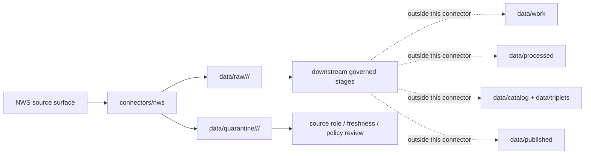

<!-- [KFM_META_BLOCK_V2]
doc_id: kfm://doc/connectors-nws-readme
title: connectors/nws/ — National Weather Service Connector Lane
type: readme
version: v0.1
status: draft
owners: OWNER_TBD — Connector steward · Source steward · NOAA steward · NWS steward · Hazards steward · Atmosphere steward · Data steward · Validation steward · Docs steward
created: 2026-06-20
updated: 2026-06-20
policy_label: public; life-safety-sensitive; contextual-only; source-admission-only
related:
  - ../README.md
  - ../noaa/README.md
  - ../nws-api/README.md
  - ../../docs/doctrine/directory-rules.md
  - ../../docs/sources/catalog/noaa/README.md
  - ../../docs/sources/catalog/noaa/nws-api.md
  - ../../docs/sources/catalog/noaa/storm-events.md
  - ../../docs/sources/catalog/noaa/noaa-uscrn.md
  - ../../docs/domains/hazards/README.md
  - ../../docs/domains/atmosphere/README.md
  - ../../docs/architecture/hazards-trust-membrane.md
  - ../../docs/architecture/source-roles.md
  - ../../data/registry/sources/
  - ../../data/raw/
  - ../../data/quarantine/
  - ../../data/receipts/
  - ../../data/proofs/
  - ../../policy/rights/
  - ../../policy/sensitivity/
  - ../../release/
tags: [kfm, connectors, nws, noaa, hazards, atmosphere, alerts, warnings, watches, advisories, forecasts, cap, observations, source-admission, raw, quarantine, not-life-safety, governance]
notes:
  - "Draft connector lane for National Weather Service source intake and admission helpers."
  - "Placement is draft / open: Directory Rules §7.3 lists noaa/ as canonical but does not settle this nws sibling versus a nested connectors/noaa/nws/ lane."
  - "The API-specific sibling lane connectors/nws-api/ exists for NWS API component intake; this README defines a broader NWS connector boundary and does not supersede it."
  - "NWS material is life-safety-sensitive. KFM is not an emergency alerting system and must not rebroadcast NWS content as KFM-issued alerts."
  - "NWS source material is multi-component: warnings/advisories/watches are regulatory-context and contextual-only, forecasts are modeled, station observations are observations, and unknown/mixed material is candidate/quarantine."
  - "Connector output may enter raw or quarantine admission lanes only."
[/KFM_META_BLOCK_V2] -->

<a id="top"></a>

# NWS Connector

> Draft source-specific intake and admission lane for National Weather Service source material under the broader NOAA source family.

<p>
  
  
  
  
  
  
  
</p>

`connectors/nws/`

## Quick jumps

[Scope](#scope) · [Repo fit](#repo-fit) · [Relationship to NWS API lane](#relationship-to-nws-api-lane) · [Component admission model](#component-admission-model) · [Lifecycle sketch](#lifecycle-sketch) · [Authority boundary](#authority-boundary) · [Inputs](#inputs) · [Exclusions](#exclusions) · [Admission posture](#admission-posture) · [Anti-collapse posture](#anti-collapse-posture) · [Validation](#validation) · [Definition of done](#definition-of-done)

---

## Scope

`connectors/nws/` is a draft connector lane for National Weather Service source intake and admission helpers.

This folder may contain connector-local documentation, source-admission helpers, product-family conventions, request/client helpers, message parsers, forecast parsers, station-observation parsers, freshness helpers, official-source-link helpers, checksum/digest helpers, no-network fixture pointers, and raw/quarantine output adapters for NWS source material.

It must not become NOAA source-family truth, NWS product doctrine, emergency alerting authority, KFM-issued alert authority, forecast truth, live warning state truth, station truth, policy authority, schema authority, catalog/triplet authority, proof authority, release authority, pipeline authority, public API behavior, or public UI behavior.

> [!IMPORTANT]
> **Status:** draft / `NEEDS VERIFICATION`  
> **Owner:** `OWNER_TBD`  
> **Path:** `connectors/nws/`  
> **Truth posture:** the path exists in the repository as this README; actual source descriptors, endpoints, product inventory, tests, fixtures, parser behavior, freshness behavior, rights posture, CI wiring, and release behavior remain `NEEDS VERIFICATION`.

---

## Repo fit

```text
connectors/
├── noaa/
│   └── README.md
├── nws-api/
│   └── README.md
└── nws/
    └── README.md
```

Related responsibility roots:

```text
connectors/noaa/                         # canonical NOAA connector-family lane
connectors/nws/                          # draft NWS connector lane
connectors/nws-api/                      # draft API-specific sibling lane
docs/sources/catalog/noaa/nws-api.md     # NWS API source-product doctrine
docs/sources/catalog/noaa/               # NOAA source-family/product docs
docs/domains/hazards/                    # hazards doctrine and trust membrane
docs/domains/atmosphere/                 # atmosphere / forecast / observation context
data/registry/sources/                   # source descriptors and activation state
data/raw/                                # raw staged source outputs by owning domain
data/quarantine/                         # held material requiring source/role/freshness/policy review
data/receipts/                           # ingest, freshness, transform, and review receipts
data/proofs/                             # EvidenceBundles and proof packs
policy/rights/                           # terms, attribution, and source-use review
policy/sensitivity/                      # life-safety, public-safety, and release rules
release/                                 # release decisions, manifests, rollback, correction state
```

> [!WARNING]
> `connectors/nws/` is a draft/open connector placement. Directory Rules §7.3 lists `connectors/noaa/` as the canonical NOAA connector family. Keep this lane as a draft sibling unless an ADR, migration note, or updated Directory Rules ratifies sibling placement or moves it under `connectors/noaa/nws/`.

---

## Relationship to NWS API lane

`connectors/nws-api/` is the API-specific source-admission lane for NOAA NWS API material. `connectors/nws/` is a broader draft NWS connector-family boundary that may eventually coordinate NWS-related product lanes if placement is ratified.

| Path | Status | Use |
|---|---|---|
| `connectors/noaa/README.md` | `CONFIRMED` parent family README | Canonical NOAA connector-family boundary. |
| `connectors/nws-api/README.md` | `CONFIRMED` sibling API lane | API-specific NWS component intake. |
| `connectors/nws/README.md` | `CONFIRMED` after this update | Draft broader NWS connector boundary; does not supersede `nws-api`. |

No move, delete, rename, redirect, or deprecation is implied by this README.

---

## Component admission model

NWS material is multi-component. The connector must preserve component identity and source-role boundaries.

| Component | Default KFM posture | Required connector posture |
|---|---|---|
| Warnings / watches / advisories / alerts | `regulatory-context`, contextual-only, not KFM-issued. | Preserve NWS id, event type, severity/urgency/certainty where present, issue time, effective time, expiry time, affected zones/geometry, official-source link, freshness state, and digest. |
| Forecasts | `modeled`. | Preserve forecast office/grid/zone, issue/cycle time, lead time, valid time, geometry/zone, text/numeric fields, source URL, and digest. |
| Station observations | `observation`. | Preserve station id, timestamp, variable, value, units, quality flags where present, source URL, and digest. |
| Aggregates or rollups | `aggregate`. | Preserve aggregation receipt requirements, geometry scope, time window, component source links, and caveats. |
| Unknown or mixed component | `candidate` / quarantine. | Do not publish; require source-role and freshness review before promotion. |

---

## Lifecycle sketch



> [!CAUTION]
> Connector code admits source material. It does not issue alerts, provide life-safety instructions, decide current warning display, publish map layers, answer public claims, or decide release state. Promotion remains a governed state transition, not a file move.

---

## Authority boundary

```text
OUTPUT LIMIT:
  data/raw/<domain>/<source_id>/<run_id>/
  data/quarantine/<domain>/<source_id>/<run_id>/

NOT HERE:
  NOAA source-family truth
  NWS product doctrine
  KFM-issued alert authority
  life-safety guidance
  current public warning state
  forecast truth
  station truth
  source descriptor authority
  rights or sensitivity policy
  processed hazard/atmosphere derivatives
  catalog records
  triplet records
  public map artifacts
  receipts/proofs as authority
  release decisions
  public API behavior
  public UI behavior
```

---

## Inputs

| Accepted item | Required posture |
|---|---|
| Request helper | Preserve endpoint/path, query parameters, response status, retrieval time, official-source URL, and digest. |
| Message parser | Preserve NWS id, event type, status, severity/urgency/certainty where present, affected zones/geometry, issue/effective/expiry times, official-source link, and digest. |
| Forecast parser | Preserve office/grid/zone, issue/cycle time, lead time, valid time, geometry/zone, values/text, source URL, and digest. |
| Observation parser | Preserve station id, timestamp, variable, value, units, quality flags, source URL, and digest. |
| Freshness helper | Compute state from issue/effective/expiry/retrieval/valid times; stale operational context must not appear current downstream. |
| Policy flag helper | Mark not-for-life-safety, no KFM rebroadcast, official-source redirection, and review requirements. |
| Test references | Point to owning fixture/test roots; fixtures do not become source authority. |

---

## Exclusions

| Do not store here | Correct home |
|---|---|
| NOAA source-family doctrine | `docs/sources/catalog/noaa/README.md` or `docs/sources/catalog/noaa.md` |
| NWS API product doctrine | `docs/sources/catalog/noaa/nws-api.md` |
| API-specific connector implementation | `connectors/nws-api/` unless ADR migrates it here |
| Authoritative `SourceDescriptor` records | `data/registry/sources/` |
| Hazards or Atmosphere doctrine | `docs/domains/hazards/`, `docs/domains/atmosphere/` |
| Rights, sensitivity, safety, or release policy | `policy/`, `policy/sensitivity/`, `release/` |
| Processed hazard or atmosphere derivatives | `data/processed/` |
| Catalog or triplet records | `data/catalog/`, `data/triplets/` |
| Public map artifacts | `data/published/` after governed release |
| Receipts and proof packs as authority | `data/receipts/`, `data/proofs/` |
| Schemas or semantic contracts | `schemas/`, `contracts/` |
| Public API or UI behavior | `apps/governed-api/`, `apps/explorer-web/` |

---

## Admission posture

NWS intake should preserve source identity, source descriptor reference, component type, source role, endpoint/path/query, response status, retrieval time, source URL, digest, NWS id or forecast/station identifier, issue time, effective time, expiry time, valid time, forecast cycle, lead time, observation time, freshness state, event type, zones/geometry, office/grid/zone, station id, variable, value, units, quality flags, official-source link, not-for-life-safety posture, no-KFM-alert posture, rights/citation posture, sensitivity posture, and quarantine reason when review is required.

---

## Anti-collapse posture

| Rule | Connector implication |
|---|---|
| NWS warning is not a KFM alert. | Admit as contextual evidence only; never repackage as KFM-issued alert. |
| Expired warning is not current warning state. | Preserve expiry and freshness; stale operational context routes away from current display. |
| Forecast is not observation. | Forecast components remain modeled. |
| Station observation is not regional truth. | Preserve station/time/quality context; downstream aggregation needs receipts. |
| Watch, warning, advisory, and alert are not interchangeable. | Preserve event type and message semantics. |
| Component roles must not collapse. | Forecast, warning context, observation, aggregate, and candidate states stay separate. |
| KFM display is not official source. | Any downstream released context must point users to the official NWS source for decisions. |
| Public display is downstream. | The connector must not build public tiles, UI panels, public alert surfaces, or release payloads. |

---

## Validation

Before relying on this connector, verify connector placement, active SourceDescriptors, current endpoint/product behavior, message formats, freshness fields, component-specific source-role handling, not-for-life-safety enforcement, no-KFM-alert enforcement, no-network tests, raw/quarantine-only output paths, downstream receipts/proofs, and release gates.

---

## Definition of done

- [ ] Owners are confirmed and `OWNER_TBD` is replaced.
- [ ] Placement is ratified by ADR, migration note, or updated Directory Rules, or recorded as open drift.
- [ ] Actual connector contents are inventoried.
- [ ] Relationship to `connectors/nws-api/` is accepted, migrated, or recorded as an open placement question.
- [ ] NWS component `SourceDescriptor` IDs and source-family activation are verified.
- [ ] Current endpoint/product behavior, message formats, rate limits, rights, citation, and freshness posture are documented.
- [ ] Parsers preserve component identity, source role, issue/effective/expiry/valid/retrieval times, zones/geometry, official-source links, and digests.
- [ ] Tests prevent silent conversion of NWS warnings into KFM-issued alerts, forecasts into observations, stale records into current state, or station observations into regional truth.
- [ ] Outputs are verified to enter only raw or quarantine admission lanes.
- [ ] No source-family, domain, processed, catalog, triplet, published, release, schema, policy, proof, receipt, registry, fixture, report, API, UI, tile, alerting, life-safety, official-source, or current-state authority lives here.
- [ ] Tests, fixtures, and CI behavior are verified or marked `NEEDS VERIFICATION`.

---

## Status summary

`connectors/nws/` is for NWS source-admission code only. It is not NOAA source-family truth, NWS product doctrine, KFM-issued alert authority, life-safety guidance, current warning-state authority, forecast truth, station truth, policy authority, schema authority, catalog/triplet authority, proof closure, release authority, public map authority, public API behavior, public UI behavior, or pipeline authority.

<p align="right"><a href="#top">Back to top</a></p>
