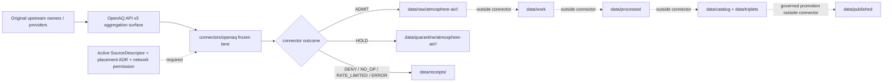

<!-- [KFM_META_BLOCK_V2]
doc_id: kfm://doc/connectors-openaq-readme
title: connectors/openaq/ — OpenAQ API Connector Lane
type: readme
version: v0.2
status: draft
owners: OWNER_TBD — Connector steward · Source steward · OpenAQ steward · Atmosphere steward · Data steward · Rights reviewer · Sensitivity reviewer · Validation steward · Migration steward · CI steward · Docs steward
created: 2026-06-20
updated: 2026-07-15
policy_label: public-doctrine; air-quality-aggregator; aggregate-source; not-regulatory-authority; source-admission-only; placement-frozen; descriptor-gated; rights-gated; sensitivity-gated; no-network-by-default; raw-quarantine-receipts-only; no-publication
current_path: connectors/openaq/README.md
truth_posture: CONFIRMED target README and current path, Directory Rules connector responsibility, connectors root boundary, OpenAQ source-family and product documentation, OPEN-DSC-14 DEFERRED status, official OpenAQ documentation checked 2026-07-15, API v3, HTTPS JSON service surface, X-API-Key authentication, page and limit pagination, documented rate-limit headers, ISO 8601 temporal guidance, WGS84 geospatial query rules, and attribution / third-party terms obligations / CONFLICTED canonical connector-family placement because connectors/openaq exists while OpenAQ is absent from Directory Rules §7.3 and OPEN-DSC-14 remains deferred / UNKNOWN executable connector code, package imports, active SourceDescriptors, accepted implementation topology, canonical API-key environment-variable name, approved endpoint allowlist, fixtures, tests, schedules, emitted receipts, CI enforcement, deployment, and downstream release state / NEEDS VERIFICATION owners, placement ADR, source activation, current provider coverage, endpoint schemas, feature flags, rights and redistribution per upstream provider, sensitivity classification, retry budgets, fixture approval, validation bindings, correction propagation, deactivation, rollback automation, and live-probe authorization
evidence_snapshot:
  repository: bartytime4life/Kansas-Frontier-Matrix
  visibility: public
  base_ref: main
  base_commit: 8f3f067b329cc19be85955f19ffb9d62c7266d45
  prior_blob: c6ab2b98f13a48c7c39e85f3b85b881a0272c648
  authoring_prompt_sha256: b061d3d8b153af8083cd1f62f447b389c396b5a882e590328ede7c3e3ff25e85
  related_repository_blobs:
    directory_rules: 2affb080e6f0043867c64c7f06c1ca52030fbd55
    connectors_root_readme: bdd50032bed62ac36964c79f16cf5541b21759a6
    openaq_family_readme: 085b80fd10cf2ad5b672244a8264009c188f3abb
    openaq_product_page: 9242a972147d734c4a00f6cc3488223bdf66c4d2
    source_open_questions: 573106a7666ce83790614560344c7613cf15a581
related:
  - ../README.md
  - ../../docs/doctrine/directory-rules.md
  - ../../docs/sources/catalog/OPEN-QUESTIONS.md
  - ../../docs/sources/catalog/openaq/README.md
  - ../../docs/sources/catalog/openaq/openaq.md
  - ../../docs/sources/catalog/RIGHTS-AND-SENSITIVITY-MAP.md
  - ../../docs/domains/atmosphere/README.md
  - ../../docs/architecture/source-roles.md
  - ../../data/registry/sources/
  - ../../data/raw/
  - ../../data/quarantine/
  - ../../data/receipts/
  - ../../data/proofs/
  - ../../schemas/contracts/v1/source/
  - ../../policy/rights/
  - ../../policy/sensitivity/
  - ../../release/
tags: [kfm, connectors, openaq, api-v3, air-quality, atmosphere-air, aggregator, aggregate-source, measurements, locations, sensors, providers, owners, licenses, attribution, pagination, rate-limits, temporal-semantics, geospatial, source-admission, raw, quarantine, receipts, no-network, no-publication, governance]
notes:
  - "v0.2 applies the KFM GitHub Repository Documentation Implementation Agent v3.1 connector README profile."
  - "Directory Rules v1.4 §7.3 assigns source-specific fetch and admission behavior to connectors/, but OpenAQ is not enumerated as a canonical connector family. OPEN-DSC-14 remains DEFERRED."
  - "This revision documents the existing path without ratifying it, activating it, or satisfying the OPEN-DSC-14 ADR gate."
  - "This revision does not create, move, rename, delete, deprecate, or supersede connector code, SourceDescriptors, policies, schemas, fixtures, tests, workflows, schedules, data, receipts, proofs, or release objects."
  - "Official OpenAQ documentation was rechecked 2026-07-15. Operational details remain version-sensitive and must be descriptor-pinned and reverified before activation."
  - "OpenAQ is an aggregation and distribution surface. Every admitted record must preserve the original upstream provider, owner, license, sensor, location, parameter, and temporal context available from the API."
  - "Connector and watcher activity is source admission only and is never evidence closure, promotion, publication, public-health guidance, or regulatory authority."
[/KFM_META_BLOCK_V2] -->

<a id="top"></a>

# OpenAQ API Connector Lane

> Governed, source-specific probe, retrieval, preservation, and admission support for the OpenAQ API, with strict aggregator anti-collapse, upstream-provider attribution, temporal and geospatial fidelity, deterministic receipts, and no connector-side publication authority.

<p>
  
  
  
  
  
  
  
  
</p>

`connectors/openaq/`

## Quick navigation

[Status](#status-and-evidence-boundary) · [Purpose](#purpose) · [Repository fit](#repository-fit-and-placement-conflict) · [Current state](#confirmed-current-state) · [Official service](#official-provider-and-api-surface) · [Authority](#source-role-and-authority-model) · [Authentication](#authentication-secrets-and-configuration) · [Endpoints](#endpoint-and-descriptor-allowlist) · [Pagination](#pagination-filtering-and-completeness) · [Time](#temporal-freshness-and-stale-state) · [Geometry](#geospatial-query-and-coordinate-posture) · [Lifecycle](#lifecycle-and-finite-connector-outcomes) · [Quarantine](#raw-admission-and-quarantine-reasons) · [Identity](#identity-hashing-deduplication-and-replay) · [Parsing](#parsing-and-preservation-contract) · [Validation](#normalization-and-validation-boundary) · [Receipts](#receipts-evidence-references-and-emitted-artifacts) · [Rights](#rights-terms-attribution-and-redistribution) · [Sensitivity](#sensitivity-and-data-minimization) · [Resilience](#rate-limits-retries-timeouts-and-circuit-breaking) · [Testing](#testing-and-no-network-fixtures) · [Watchers](#watchers-service-change-and-drift) · [Activation](#activation-and-promotion-gates) · [Rollback](#correction-deactivation-rollback-and-supersession) · [Directory map](#directory-map-and-implementation-freeze) · [Done](#definition-of-done) · [Open](#verification-backlog) · [Evidence](#evidence-basis)

---

## Status and evidence boundary

> [!IMPORTANT]
> **Document lifecycle:** `draft`
> **Connector activation:** `DENY / INACTIVE` while `OPEN-DSC-14` remains `DEFERRED`
> **Owner:** `OWNER_TBD`
> **Path:** `connectors/openaq/README.md`
> **Responsibility root:** `connectors/` is the KFM source-specific fetch and admission root
> **Placement:** `CONFLICTED / FROZEN` because the current path exists, but OpenAQ is not enumerated in Directory Rules §7.3 and no resolving ADR was verified
> **Truth posture:** this README, its current path, adjacent root and source documentation, and the official OpenAQ facts cited below were inspected for this revision. Executable code, active descriptors, approved secrets configuration, endpoint activation, tests, fixtures, schedules, emitted receipts, CI enforcement, deployment, and released outputs remain `UNKNOWN` or `NEEDS VERIFICATION`.

This README is an implementation-boundary document. It does not:

- ratify `connectors/openaq/` as a canonical connector-family root;
- resolve `OPEN-DSC-14`;
- activate an OpenAQ `SourceDescriptor`;
- authorize network access, credentials, schedules, or live probes;
- establish the current state of Kansas air quality;
- convert OpenAQ records into regulatory observations, public-health guidance, or AQI truth;
- close an `EvidenceBundle`, prove a claim, promote data, or authorize publication.

`OPEN-DSC-14` records OpenAQ among second-wave connector-derived families. Its status is `DEFERRED`; its resolution path is an ADR per family, gated on connector and registry companions. Existing OpenAQ source documentation also requires the connector to remain inactive until the disposition is resolved. This file therefore documents a **frozen boundary** and does not satisfy or bypass that gate.

---

## Purpose

An approved future OpenAQ connector may support source-faithful interaction with the OpenAQ API after placement, descriptor, rights, sensitivity, fixture, validation, receipt, and network gates pass.

Within that governed boundary, the connector may:

- call only descriptor-approved OpenAQ API v3 resources;
- authenticate with a runtime-provided API key without storing or logging the secret;
- preserve request parameters, response metadata, pagination state, timestamps, geometry, provider, owner, license, instrument, location, sensor, parameter, native unit, value, aggregation interval, and quality-related fields that the response provides;
- distinguish OpenAQ as the aggregator from the original upstream provider and owner;
- compute deterministic request and payload digests without incorporating secrets;
- emit probe, retrieval, no-op, rate-limit, denial, quarantine, and admission receipts using repository-approved contracts;
- hand source-faithful payloads to `data/raw/`, unresolved material to `data/quarantine/`, and connector-process evidence to `data/receipts/`;
- support deterministic no-network tests with minimized, synthetic, redacted, or explicitly approved fixtures.

This lane must not become:

- OpenAQ source-family or product doctrine;
- an original-observer, regulatory-monitor, regulatory-agency, AQI, or public-health authority;
- an implicit source activation or endpoint discovery mechanism;
- a second source registry, policy engine, schema home, contract home, fixture authority, or release system;
- a processed Atmosphere/Air pipeline, catalog emitter, graph/triplet writer, proof-pack builder, or publisher;
- a direct source for MapLibre, public APIs, public UI, dashboards, exports, search, graph answers, or AI responses;
- a mechanism for scraping OpenAQ visualizations or bypassing the sanctioned API and export surfaces;
- a service intended to substantially duplicate or compete with OpenAQ's core hosted offerings.

---

## Repository fit and placement conflict

Directory Rules establish `connectors/` as the implementation root for source-specific fetch and admission. That resolves the **responsibility root**. It does not resolve whether OpenAQ is an admitted top-level connector family.

```text
connectors/
├── README.md                    # connector-root contract
└── openaq/
    └── README.md                # this frozen boundary document

Adjacent authority surfaces:
docs/sources/catalog/openaq/     # human-facing source-family and product doctrine
docs/sources/catalog/OPEN-QUESTIONS.md
                                      # OPEN-DSC-14 numbering and disposition authority
data/registry/sources/           # SourceDescriptor and activation authority
schemas/contracts/v1/source/     # machine-checkable source shapes
policy/rights/                    # terms, attribution, and redistribution decisions
policy/sensitivity/               # coordinate and health-context exposure decisions
data/raw/                         # source-faithful admitted payloads
data/quarantine/                  # held material and reasons
data/receipts/                    # connector-process receipts
release/                          # release decisions outside connector ownership
```

### Placement determination

| Evidence | Status | Consequence |
|---|---|---|
| `connectors/openaq/README.md` exists at the inspected base commit. | `CONFIRMED` | The current path may be documented and corrected in place. |
| Directory Rules §7.3 lists canonical connector examples/families but does not list OpenAQ. | `CONFIRMED` | Folder existence does not ratify OpenAQ as a canonical connector family. |
| OpenAQ is recognized in the Atmosphere/Air source corpus as an aggregator family. | `CONFIRMED` at documentation/doctrine rank | Source relevance does not equal connector activation or placement authority. |
| `OPEN-DSC-14` includes OpenAQ and is `DEFERRED`. | `CONFIRMED` | New implementation, descriptor activation, schedules, and live network work remain frozen pending a resolving ADR and its gates. |
| No resolving OpenAQ placement ADR was verified in this task. | `NEEDS VERIFICATION` | This revision does not move, reparent, activate, or supersede the lane. |

> [!WARNING]
> Do not treat this README, a future code file, an API key, a successful probe, or a `200` response as source activation. Activation authority belongs to the governed source registry and its review path after the placement decision is settled.

---

## Confirmed current state

The current-session repository inspection proves only the documentation surfaces listed below.

| Surface | What was verified | What remains unproved |
|---|---|---|
| `connectors/openaq/README.md` | The target file exists and previously documented aggregate-source admission and raw/quarantine boundaries. | Executable code, imports, clients, parsers, tests, fixtures, schedules, and runtime behavior. |
| `connectors/README.md` | The connector-root contract limits connectors to source interaction and raw/quarantine/receipt handoff. | OpenAQ-specific implementation maturity or activation. |
| `docs/sources/catalog/openaq/README.md` | OpenAQ family documentation exists; it records the §7.3 conflict and `OPEN-DSC-14` dependency. | Current rights approval, SourceDescriptor activation, provider coverage, or endpoint health. |
| `docs/sources/catalog/openaq/openaq.md` | OpenAQ product documentation exists; it defines the aggregator anti-collapse posture. | Executable conformance to that posture. |
| `docs/sources/catalog/OPEN-QUESTIONS.md` | `OPEN-DSC-14` is the canonical deferred disposition question for OpenAQ and other second-wave families. | A resolving ADR or completed migration. |

The contents of `connectors/openaq/` beyond this README were not established by a complete tree inventory in this task. No statement in this document should be read as proof that a client, parser, package, test suite, fixture set, workflow, schedule, receipt, or downstream consumer exists.

---

## Official provider and API surface

The official OpenAQ documentation was checked on 2026-07-15 for this documentation revision. These facts are external and version-sensitive; an active `SourceDescriptor` must pin and reverify the operational contract before use.

| Concern | Current official documentation snapshot | Connector consequence |
|---|---|---|
| Provider | OpenAQ | Preserve OpenAQ as the aggregation/distribution surface, not the original publisher of every measurement. |
| Hosted API generation | API v3 | Do not implement or infer v1/v2 compatibility in this lane without a separately reviewed migration contract. |
| Base service | `https://api.openaq.org/v3/` | Base URL must be descriptor-pinned; do not accept caller-supplied alternate hosts. |
| Transport and common representation | HTTPS and JSON | Reject insecure transport; preserve raw response bytes and response headers needed for receipts. |
| Authentication | API key in the `X-API-Key` request header | Secrets come from an approved runtime secret reference; never source control, URLs, fixtures, receipts, or logs. |
| Pagination | `page`, `limit`, and response `meta`, including `found` | Traverse pages deterministically and prove completeness or emit an explicit incomplete result. |
| Main resource families | Locations, sensors, measurements, latest values, providers, owners, licenses, parameters, countries, instruments/manufacturers, flags, and documented aggregation resources | Admit only an explicit descriptor allowlist; resource presence in the provider docs is not automatic KFM approval. |
| Terms | OpenAQ service terms plus applicable upstream-provider terms and attribution | Preserve OpenAQ and original-source attribution; unresolved rights or redistribution posture routes to quarantine or denial. |
| Service stability | OpenAQ may change, suspend, or discontinue hosted services and provides data/services as-is | Build schema-drift detection, bounded failure behavior, and deactivation; do not promise availability or completeness. |

Canonical provider references are listed in [Evidence basis](#evidence-basis).

---

## Source role and authority model

OpenAQ is a source **aggregator**. The connector must preserve three distinct authority layers:

```text
original observer / monitor
  -> upstream owner or provider
  -> OpenAQ aggregation and distribution
  -> KFM connector admission
```

| Layer | What it may support | What it cannot prove by itself |
|---|---|---|
| Original monitor/instrument | A source-native measurement under its own method, calibration, quality, and operational context. | Regulatory status, finality, comparability, or fitness beyond the upstream source's own evidence. |
| Upstream owner/provider | Publishing authority, network identity, source terms, and source-role context when exposed by OpenAQ. | That every relayed record is regulatory, finalized, or suitable for health guidance. |
| OpenAQ | Aggregation, normalization/distribution metadata, identifiers, API delivery, and available attribution/license links. | Original observation authority, regulator status, official AQI, health guidance, or universal redistribution permission. |
| KFM connector | Proof that a descriptor-approved request occurred and a source-faithful payload was admitted, held, denied, or unchanged. | Evidence closure, domain truth, catalog closure, release, public interpretation, or policy approval. |

### Mandatory anti-collapse rules

1. `source_role` for the OpenAQ surface remains `aggregate` unless a governing source-role contract uses a different canonical label.
2. Preserve the original upstream provider and owner fields whenever the API exposes them.
3. Preserve provider, owner, license, instrument, sensor, location, parameter, unit, interval, timestamp, and coordinate distinctions; do not flatten them into an OpenAQ-only record.
4. A community sensor is not silently relabeled as a regulatory monitor.
5. A concentration is not AQI. The connector must not calculate, infer, or label AQI.
6. A latest value is not automatically current, validated, representative, or complete.
7. An aggregated hour/day/month/year value is not an instantaneous measurement.
8. A location or sensor identifier is not proof of a stable physical monitor across all time.
9. API normalization is not a KFM canonical-domain transform.
10. A successful retrieval is not permission to publish or redistribute.

---

## Authentication, secrets, and configuration

### Confirmed provider requirement

OpenAQ API access uses an API key supplied in the `X-API-Key` header. The official documentation treats the key as a password and supports key rotation through the OpenAQ account interface.

### KFM configuration contract

No canonical repository environment-variable name or runtime secret binding was verified for this lane. Until an accepted implementation and configuration contract establishes one, use the placeholder below only in documentation:

```text
<APPROVED_OPENAQ_API_KEY_ENV>
```

The future implementation must satisfy all of these controls:

- retrieve the secret through an approved runtime secret reference;
- never commit the key or a live key hash to the repository;
- never place the key in a URL, query string, fixture, example, exception, receipt, tracing span, or log;
- redact `X-API-Key` before canonical request hashing and diagnostic serialization;
- refuse network access when the secret reference is missing or unresolved;
- support key rotation without changing source identity or replay semantics;
- distinguish authentication failure from authorization, validation, rate-limit, transport, and provider failures;
- avoid echoing request headers in user-visible errors;
- document the exact approved environment-variable or secret-reference name in the future implementation README/config contract, not by guesswork here.

### Required non-secret configuration

| Configuration | Required posture |
|---|---|
| API base URL | Descriptor-pinned to the approved OpenAQ HTTPS host and API generation. |
| Endpoint allowlist | Explicit resource templates only; deny arbitrary paths and hosts. |
| Request timeout | Bounded and documented; exact budget `NEEDS VERIFICATION`. |
| Retry budget | Bounded by error class and receipt-visible; exact budget `NEEDS VERIFICATION`. |
| Page size | At or below the provider maximum; descriptor or run-spec pinned. |
| Date-window policy | Explicit for high-volume resources; no unbounded historical crawl. |
| User agent | Repository-approved identifier if required by KFM runtime conventions; exact value `NEEDS VERIFICATION`. |
| Output targets | Supplied by orchestration and restricted to raw, quarantine, and receipt roots. |
| Live network permission | Off by default; enabled only by explicit operator/workflow authorization after activation gates. |

---

## Endpoint and descriptor allowlist

A future connector must not discover and follow arbitrary links as authority. Every network operation must be represented by an active descriptor plus an allowlisted resource template.

### Candidate endpoint classes

The table describes provider-documented surfaces, not activated KFM endpoints.

| Resource class | Example provider path shape | Admission use | Required preservation |
|---|---|---|---|
| Locations | `/v3/locations` and `/v3/locations/{location_id}` | Location/provider/owner/license/instrument/sensor metadata and spatial selection. | Query filters, IDs, names, locality, country, coordinates, bounds, mobile/monitor posture, provider, owner, licenses, instruments, first/last datetimes. |
| Location sensors | `/v3/locations/{location_id}/sensors` | Enumerate sensors associated with one location. | Sensor ID, parameter, native unit, first/last datetimes, coverage counts/intervals/percentages, provider/location linkage. |
| Sensor measurements | `/v3/sensors/{sensor_id}/measurements` | Retrieve source measurements over an approved bounded interval. | Sensor ID, parameter, value, native unit, period bounds, UTC/local times, coordinates if returned, flags/summary metadata, page metadata. |
| Latest by parameter | `/v3/parameters/{parameter_id}/latest` | Candidate latest-value context under an explicit freshness policy. | Parameter ID, location/sensor/provider context, value/unit, timestamp, retrieval time, page metadata, stale-state determination. |
| Providers, owners, licenses | Documented metadata resources | Resolve attribution, network/provider identity, owner, and license references. | IDs, names, links, license attributes, retrieval time, digest. |
| Parameters and instruments | Documented metadata resources | Resolve parameter identity, units, instrument/manufacturer context. | Source-native IDs and text; no silent semantic substitution. |
| Aggregation resources | Documented hourly/daily/monthly/yearly or related aggregation surfaces | Retrieve provider-produced aggregates only when explicitly approved. | Aggregation period, time-ending semantics, parameter/unit, count/coverage fields, provider method/version where exposed. |

### Allowlist rules

- The descriptor must identify the API generation, base URL, resource templates, allowed methods, media types, query parameters, maximum page size, maximum date window, and expected response family.
- IDs are data, not path authority. Validate type/range before interpolation.
- Unknown query parameters, alternate hosts, redirects outside the allowlist, and undocumented endpoint families are denied or quarantined.
- A provider-documented endpoint remains inactive until the descriptor and tests approve it.
- Schema changes, renamed fields, missing required attribution, or unexpected media types produce a schema-drift or contract-drift outcome; do not silently coerce.
- Do not use browser HTML pages or visualization scraping as a fallback when the API fails.

---

## Pagination, filtering, and completeness

The official OpenAQ API documentation describes `page` and `limit` pagination, a default page size of 100, a maximum page size of 1,000, and response metadata including a `found` count. High-volume measurement and hourly queries should use bounded date windows; the provider documentation recommends windows no larger than one year for those resources.

A future implementation must:

1. pin the requested `limit` and starting `page` in the run specification;
2. persist the canonical query **without** the secret;
3. record response `meta`, including `page`, `limit`, and `found` when present;
4. request pages in deterministic numeric order;
5. stop only when the provider metadata or a contract-approved terminal condition proves completion;
6. detect repeated pages, missing pages, decreasing or contradictory totals, duplicate records, and unstable ordering;
7. avoid unbounded historical queries by splitting approved date windows deterministically;
8. preserve each page digest and the ordered page-manifest digest;
9. emit `COMPLETE`, `INCOMPLETE`, `TRUNCATED`, `UNSTABLE`, or `ERROR` completeness status in the run receipt;
10. route incomplete or unstable source runs to quarantine unless a reviewed policy explicitly permits partial contextual use.

> [!CAUTION]
> `200 OK` for one page does not prove a complete dataset. A connector run must either prove the bounded request is complete or label the result as incomplete and prevent silent promotion.

---

## Temporal, freshness, and stale state

OpenAQ's official temporal guidance uses ISO 8601 and distinguishes local and UTC timestamps. It describes timestamp values as **exclusive time-ending** for a represented interval: an hourly timestamp at `03:00`, for example, represents the preceding hour. When an input timestamp omits a time zone, OpenAQ treats it as local station time. Responses may include both UTC and local time plus the location time-zone identifier.

The connector must preserve, when available:

- measurement or aggregate period start and end;
- the provider's time-ending timestamp semantics;
- source-local timestamp and time-zone identifier;
- source UTC timestamp;
- location/sensor `datetimeFirst` and `datetimeLast`;
- retrieval time;
- response-generation or upstream update time when exposed;
- run start/end time;
- correction/supersession time downstream;
- whether the record is a source measurement, provider aggregate, or latest-value projection.

### Freshness contract

Freshness is resource-, provider-, parameter-, and use-specific. This README does not invent a universal threshold.

| State | Meaning | Connector action |
|---|---|---|
| `FRESH` | The record meets a descriptor-pinned freshness rule for the bounded use. | May enter raw if all other gates pass. |
| `STALE` | The record is older than the approved threshold or the provider metadata indicates no recent update. | Preserve and label; route to raw or quarantine according to policy, never present as current by omission. |
| `UNKNOWN` | Required time fields, time-zone context, or threshold are unresolved. | Quarantine or deny use requiring freshness. |
| `FUTURE_SKEW` | A source timestamp exceeds the approved clock-skew budget. | Quarantine and emit a temporal-validation receipt. |
| `OUT_OF_WINDOW` | The record falls outside the requested inclusive/exclusive interval contract. | Exclude with reason and record counts; do not silently retain. |

A `latest` endpoint response is only a source-provided latest candidate. KFM must still evaluate retrieval age, source timestamp, provider context, and the downstream use before any current-state claim.

---

## Geospatial query and coordinate posture

OpenAQ documents WGS84 longitude/latitude geospatial filters using either:

- a point plus radius; or
- a bounding box.

The filter forms are mutually exclusive. The documented maximum point radius is 25,000 metres, and invalid combinations may return a client-validation error such as `422`.

A future connector must:

- preserve the exact canonical query geometry, coordinate order, radius, and units;
- validate WGS84 longitude/latitude ranges before request emission;
- reject simultaneous bounding-box and point/radius filters;
- enforce the provider maximum and any stricter KFM descriptor limit;
- preserve source coordinates, bounds, coordinate precision, location ID, and mobile/monitor posture when returned;
- never infer a stable station solely from rounded coordinates and display name;
- distinguish fixed monitors from mobile locations when the source exposes that distinction;
- record any coordinate rounding, suppression, or generalization as a downstream transform receipt, not a connector-side invisible edit;
- quarantine coordinates or location metadata when sensitivity, rights, precision, or mobile-tracking posture is unresolved;
- keep exact internal geometry out of public products unless a governed release explicitly permits it.

---

## Lifecycle and finite connector outcomes



### Connector outcome vocabulary

| Outcome | Meaning | Allowed effects |
|---|---|---|
| `ADMIT` | Descriptor, placement, network, response, identity, integrity, rights, sensitivity, source-role, and bounded completeness checks permit raw admission. | Source-faithful raw payload/manifest plus receipt. |
| `HOLD` | Material may be useful but a check requires steward review or remediation. | Quarantine package plus reasoned receipt; no downstream promotion. |
| `DENY` | Policy, placement, descriptor, host, method, rights, sensitivity, schema, or other hard gate forbids the operation. | Denial receipt only; no data handoff except minimal safe diagnostics. |
| `NO_OP` | The approved conditional or digest comparison shows no material source change. | No-op receipt; no duplicate raw payload unless policy requires retention. |
| `RATE_LIMITED` | Provider returned or predicted a rate-limit condition. | Rate-limit receipt and delayed scheduling state; no busy retry. |
| `ERROR` | Transport, authentication, parsing, storage, or internal failure prevents a governed result. | Error receipt with secrets redacted; no unsafe fallback. |

Connectors do not emit `PUBLISHED`, `PROMOTED`, or `EVIDENCE_CONFIRMED` outcomes. Those belong to later governed systems.

---

## Raw admission and quarantine reasons

### Raw admission minimum

An `ADMIT` decision requires, at minimum:

- resolving placement/activation authority;
- an active `SourceDescriptor` referencing the approved API generation and endpoint class;
- explicit live-network authorization for the run;
- approved secret resolution;
- canonical request manifest without secrets;
- successful response and expected media type;
- source role and original provider/owner context preserved at the required granularity;
- source-native IDs and temporal/geospatial support sufficient for the resource class;
- payload and page-manifest digests;
- rights, attribution, and sensitivity decisions adequate for raw retention;
- schema/source-contract validation;
- bounded pagination/completeness status;
- an ingest/run receipt and raw target supplied by orchestration.

### Quarantine reason codes

The exact shared enum remains `NEEDS VERIFICATION`. A future implementation should map connector failures to repository-approved reason codes covering at least:

| Reason family | Examples |
|---|---|
| Placement / activation | `PLACEMENT_UNRESOLVED`, `SOURCE_INACTIVE`, `NETWORK_NOT_AUTHORIZED` |
| Descriptor / endpoint | `DESCRIPTOR_MISSING`, `HOST_NOT_ALLOWED`, `ENDPOINT_NOT_ALLOWED`, `METHOD_NOT_ALLOWED`, `API_GENERATION_DRIFT` |
| Authentication | `SECRET_UNRESOLVED`, `AUTH_REJECTED`, `KEY_ROTATION_REQUIRED` |
| Source role / attribution | `UPSTREAM_PROVIDER_MISSING`, `OWNER_MISSING`, `LICENSE_UNRESOLVED`, `AGGREGATE_ROLE_COLLAPSE` |
| Schema / parsing | `UNEXPECTED_MEDIA_TYPE`, `SCHEMA_DRIFT`, `REQUIRED_FIELD_MISSING`, `MALFORMED_PAGE_META` |
| Time / completeness | `TIMEZONE_UNKNOWN`, `FUTURE_TIMESTAMP`, `STALE_UNKNOWN`, `PAGE_GAP`, `TRUNCATED`, `UNSTABLE_ORDERING` |
| Geometry / sensitivity | `INVALID_WGS84`, `QUERY_GEOMETRY_CONFLICT`, `COORDINATE_PRECISION_UNRESOLVED`, `MOBILE_LOCATION_REVIEW` |
| Integrity / replay | `PAYLOAD_DIGEST_MISMATCH`, `DUPLICATE_ID_CONFLICT`, `REPLAY_DIVERGENCE` |
| Provider operations | `RATE_LIMITED`, `PROVIDER_UNAVAILABLE`, `RETRY_BUDGET_EXHAUSTED`, `CIRCUIT_OPEN` |

Quarantine preserves the source material and reason where permitted. It does not erase, relabel, or automatically repair evidence.

---

## Identity, hashing, deduplication, and replay

### Identity layers

Do not collapse these identities:

| Identity | Required basis |
|---|---|
| Source family | Governed OpenAQ family/source descriptor identity after activation. |
| API operation | API generation + base host + method + resource template + canonical non-secret query. |
| Provider/owner | Source-native provider and owner IDs plus names/links as supplied. |
| Location | OpenAQ location ID plus provider/owner context; coordinates/name alone are insufficient. |
| Sensor | OpenAQ sensor ID plus location and parameter context. |
| Parameter | OpenAQ parameter ID plus source-native name/unit. |
| Measurement/aggregate | Sensor or source-native identity + parameter + represented interval/timestamp + aggregation class + source-native discriminator when available. |
| Connector run | Source descriptor version + canonical request digest + run specification + retrieval attempt identity. |
| Raw artifact | SHA-256 or repository-approved content digest over preserved bytes plus artifact manifest. |

### Canonical request digest

A canonical request representation should include:

```text
api_generation
base_host
http_method
resource_template
resolved_non_secret_path_parameters
sorted_non_secret_query_parameters
accepted_media_type
source_descriptor_id_and_version
run_spec_version
```

It must exclude:

```text
X-API-Key value
secret-reference value
volatile authorization metadata
non-deterministic trace identifiers
```

### Deduplication rules

- Deduplicate raw bytes by digest only when the retention policy permits no-op reuse.
- Do not merge records merely because time, coordinates, parameter, and value match; provider, owner, location, sensor, interval, unit, quality, and source-native identifiers may differ.
- A reused OpenAQ ID with materially different identity fields is a conflict, not a silent update.
- Preserve correction and supersession lineage instead of rewriting prior admitted artifacts.
- Page-level duplicate detection does not replace record-level identity validation.

### Replay

A replay run must be able to reconstruct:

- the descriptor and run-spec versions;
- canonical request digest without secrets;
- page sequence and response metadata;
- payload/page digests;
- parser/normalizer version if any connector-local projection was emitted;
- outcome and reason codes;
- raw/quarantine/receipt references.

If the same pinned inputs produce a materially different connector projection, emit `REPLAY_DIVERGENCE` and hold the result. Provider-hosted data may legitimately change; that change must appear as a new source retrieval with a new payload digest, not be disguised as deterministic replay equivalence.

---

## Parsing and preservation contract

The connector preserves provider semantics before downstream normalization.

### Location and network metadata

Preserve when returned:

- OpenAQ location ID and name;
- locality and country/ISO context;
- monitor/mobile posture;
- coordinates, bounds, coordinate precision or availability state;
- provider ID/name and links;
- owner ID/name;
- license IDs/names/attribution metadata;
- instrument/manufacturer identity;
- sensor inventory;
- `datetimeFirst`, `datetimeLast`, and location time zone;
- response/resource links only as data, not automatic request authority.

### Sensor metadata

Preserve when returned:

- sensor ID and location link;
- parameter ID/name/display name;
- native unit and parameter type;
- first/last datetimes;
- coverage expected/observed counts, intervals, and percentages;
- instrument/provider context;
- any flags or summary metadata exposed by the response.

### Measurement or aggregate records

Preserve when returned:

- source-native record identity or deterministic candidate key inputs;
- sensor, location, provider, owner, and parameter references;
- value and native unit;
- represented period and aggregation class;
- UTC and local timestamps plus time-zone identifier;
- source coordinates when included;
- quality, flag, coverage, count, or summary fields;
- response page metadata;
- retrieval time, source URL template, request digest, payload digest, and raw artifact reference.

### Preservation rules

- Preserve null versus absent versus zero.
- Preserve source-native numeric precision; do not round silently.
- Preserve native units. Any unit conversion belongs to a reviewed downstream transform and receipt.
- Preserve provider/owner/license objects rather than reducing them to a display string.
- Preserve unrecognized fields in the raw artifact; parser projections may hold or warn rather than discard load-bearing drift.
- Reject non-finite numeric values unless the source contract explicitly defines their representation.
- Do not infer calibration, regulatory grade, finalized status, representativeness, or health significance.

---

## Normalization and validation boundary

Connector-local validation answers whether a source response is safe and complete enough for **admission**, not whether it is canonical domain truth.

### Connector validation may check

- approved host, method, endpoint class, and media type;
- HTTP status and provider error shape;
- pagination metadata and completeness;
- required identity, provider, owner, license, sensor, parameter, unit, timestamp, and geometry fields by resource class;
- WGS84 range and query-shape constraints;
- ISO 8601 parsing and UTC/local/time-zone consistency;
- native numeric and unit representation;
- duplicate/conflicting identities;
- payload/page-manifest integrity;
- source-role anti-collapse;
- rights, attribution, and sensitivity preconditions for raw retention;
- secret redaction and output-root restrictions.

### Connector validation must not

- assign regulatory grade or health meaning;
- calculate AQI;
- harmonize pollutants by silently changing parameter meaning;
- convert units without a downstream transform receipt;
- fill missing provider/owner/license fields by guesswork;
- generalize exact geometry without a recorded policy transform;
- declare source records canonical, evidenced, catalog-closed, released, or publishable;
- bypass quarantine because the response is syntactically valid.

---

## Receipts, evidence references, and emitted artifacts

The connector may emit **process evidence** using repository-approved object families. Names below describe required responsibilities; exact schema names and homes remain `NEEDS VERIFICATION` until implementation is inspected.

| Artifact responsibility | Minimum content | Authority limit |
|---|---|---|
| Probe receipt | Descriptor reference, approved operation class, start/end time, network permission, response/error class, redacted diagnostics. | Proves a governed probe attempt, not data quality or release. |
| Retrieval/run receipt | Canonical request digest, API generation, page manifest, status, counts, completeness, rate-limit state, payload digests, raw/quarantine references, outcome/reasons. | Proves connector process and handoff, not `EvidenceBundle` closure. |
| No-op receipt | Prior and current comparison basis, digest/conditional result, decision, source timestamp context. | Proves no material admitted change under the comparison rule only. |
| Rate-limit receipt | Status, relevant `x-ratelimit-*` headers when returned, reset interpretation, retry/defer decision, secret-redacted request identity. | Does not authorize immediate retry or broader quota. |
| Quarantine record | Reason codes, held artifact references, reviewer role, remediation requirements, retention posture. | Does not imply eventual admission. |
| Request/page manifest | Ordered non-secret request specification, page numbers, response metadata, page digests, total/completeness state. | Delivery/replay support only. |
| Connector projection manifest | Parser version, input digests, output digest, field-preservation report, warnings. | A derived admission aid, not canonical Atmosphere/Air truth. |

An `EvidenceRef` may point to admitted source artifacts for later resolution. The connector does not create a public-authority `EvidenceBundle` merely by retrieving data.

---

## Rights, terms, attribution, and redistribution

OpenAQ's official terms state that:

- programmatic API access requires an account/API key;
- sanctioned APIs or exports should be used rather than scraping visualizations;
- use of the hosted API must not substantially duplicate or compete with OpenAQ's core offerings;
- OpenAQ aggregates third-party data and users remain responsible for applicable upstream-provider conditions;
- original sources must be attributed when their terms require it, and OpenAQ must also be attributed when OpenAQ services are used;
- the service and data are provided as-is and may change or become unavailable.

### KFM rights posture

1. Do not encode one blanket OpenAQ redistribution conclusion for every record.
2. Preserve OpenAQ service attribution and the original provider/owner/license context available from each record/resource.
3. Resolve rights at the source/product/provider/license level required by the intended retention and downstream use.
4. Keep hosted-API access terms distinct from upstream data-license terms.
5. Do not scrape the Explorer or other visualization surfaces as a fallback.
6. Do not use the connector to mirror the full hosted service or build a competing API.
7. Block public release when provider attribution, license, redistribution, or derived-product rights are unresolved.
8. Record the checked terms snapshot, retrieval date, reviewer, and source links in the authoritative rights decision outside this connector.
9. Treat a provider/API change as a rights and source-contract re-verification trigger when material.

> [!IMPORTANT]
> API accessibility is not redistribution permission. Public release requires a separate rights, sensitivity, evidence, review, and release decision.

---

## Sensitivity and data minimization

Air-quality records can carry precise sensor or monitor coordinates, mobile-location traces, owner/provider context, operational freshness, and health-relevant interpretation pressure. Open availability does not eliminate KFM review obligations.

The connector must:

- request only fields and spatial/temporal scope needed for the approved source objective;
- avoid unbounded location or measurement harvesting;
- preserve whether a location is mobile when exposed;
- route mobile traces, unexpected private-location detail, excessive precision, or unclear coordinate rights to review;
- keep exact coordinates in governed internal lifecycle surfaces only when approved;
- never produce health guidance, exposure advice, compliance conclusions, or emergency recommendations;
- preserve stale/unknown state so downstream systems cannot present old readings as current;
- keep credentials, account details, operator identifiers, and sensitive runtime diagnostics out of payloads and receipts;
- apply any public generalization or field suppression downstream under policy with a transform/redaction receipt;
- deny publication when exact-location, upstream terms, attribution, or health-context risk is unresolved.

---

## Rate limits, retries, timeouts, and circuit breaking

The official OpenAQ documentation currently lists free-use limits of **60 requests per minute** and **2,000 requests per hour**, scoped to the API key. It documents `429 Too Many Requests` and rate-limit response headers including:

```text
x-ratelimit-used
x-ratelimit-reset
x-ratelimit-limit
x-ratelimit-remaining
```

These values are a checked external snapshot, not a permanent KFM entitlement. The active descriptor and runtime policy must reverify them.

### Error-class behavior

| Condition | Default connector behavior |
|---|---|
| `401` / `403` | Do not retry blindly. Emit authentication/authorization failure, redact headers, disable or hold the run, and require operator review. |
| `404` | Treat as missing resource or identity drift according to the endpoint contract; do not search arbitrary replacements. |
| `422` | Treat as request-contract failure; do not retry unchanged. Quarantine the run specification or emit `DENY`. |
| `429` | Honor provider reset guidance; emit `RATE_LIMITED`; do not busy-loop or increase concurrency. |
| `5xx` / transient transport | Bounded exponential backoff with jitter if policy permits; stop after the approved budget and emit `ERROR` or `HOLD`. |
| Timeout | Cancel the attempt, preserve safe diagnostics, apply bounded retry policy, and never leave partial output mislabeled complete. |
| Unexpected redirect / host | Deny unless the destination is explicitly approved; do not forward the API key to an unapproved host. |
| Schema/media drift | Stop normal admission, preserve raw response if policy permits, emit drift/quarantine receipt, and require review. |

### Operational controls

- Exact connect/read/total timeout values remain `NEEDS VERIFICATION` and must be pinned before activation.
- Retry count and elapsed-time budgets must be explicit, finite, and testable.
- Concurrency must stay below the provider and KFM budgets.
- Circuit breaking should open after an approved sequence of provider, authentication, schema, or storage failures and prevent schedule storms.
- The circuit state and recovery probe must be auditable.
- Repeated rate-limit violations must trigger deactivation review; the provider warns that repeated overuse may lead to a ban.
- Partial pages or files must never be promoted to a complete raw run after cancellation or retry exhaustion.

---

## Testing and no-network fixtures

Default tests must not require OpenAQ network access or a real API key.

### Minimum fixture matrix

| Fixture / test | Required proof |
|---|---|
| Valid location metadata | Provider, owner, licenses, instruments, sensors, coordinates, bounds, mobile posture, first/last times preserved. |
| Valid sensor metadata | Sensor/parameter/native-unit identity and coverage fields preserved. |
| Valid measurement page | Value, unit, represented interval, UTC/local/time-zone context, page metadata, and digest preserved. |
| Mixed upstream providers | OpenAQ aggregate role retained while provider/owner distinctions remain record-visible. |
| Pagination across multiple pages | Ordered traversal, `found` reconciliation, duplicate detection, and complete page manifest. |
| Truncated or unstable pagination | `INCOMPLETE`/`UNSTABLE` outcome and quarantine; no silent success. |
| `401` / `403` | No retry loop; secret redaction; operator-review outcome. |
| `422` invalid geospatial query | No unchanged retry; explicit request-contract failure. |
| `429` with headers | Reset/remaining headers parsed safely; `RATE_LIMITED` receipt; no busy retry. |
| `5xx` / timeout | Bounded retries, circuit behavior, and no partial-complete artifact. |
| Stale latest value | Stale state preserved; not presented as current. |
| Missing provider/owner/license | Hold or deny according to the approved source contract. |
| Community vs regulatory provider | No source-role collapse or regulatory inference. |
| AQI-shaped downstream temptation | Connector refuses AQI generation or labeling. |
| Time-ending interval | Correct exclusive time-ending interpretation and UTC/local preservation. |
| Time-zone ambiguity | `UNKNOWN`/quarantine outcome; no assumed UTC when source semantics say local. |
| Point/radius and bounding-box conflict | Client-side validation denies request before network. |
| Radius beyond provider maximum | Client-side validation denies or narrows only under explicit caller instruction; no silent change. |
| Mobile location / precision risk | Sensitivity hold and no public projection. |
| Duplicate ID with changed identity fields | Conflict/quarantine rather than overwrite. |
| Replay divergence | Mismatch receipt and hold. |
| Unexpected field/media/schema | Drift receipt and quarantine; raw preservation only if policy permits. |
| Secret leakage scan | No live key in repository, snapshots, errors, receipts, logs, or golden files. |
| Output-root enforcement | Writes outside approved raw/quarantine/receipt targets fail closed. |

### Live probes

Live probes, when eventually authorized, must be:

- manual or separately scheduled from default CI;
- descriptor-gated and secret-backed;
- bounded to a minimal endpoint, time range, page count, and spatial scope;
- clearly marked non-deterministic external checks;
- receipt-emitting;
- incapable of publication;
- disabled automatically when placement, terms, authentication, schema, provider, or sensitivity posture becomes unresolved.

---

## Watchers, service change, and drift

No active OpenAQ watcher, schedule, or emitted watcher receipt was verified in this task.

A future watcher must remain a **non-publisher**. It may observe provider/service changes and emit candidate events or receipts; it must not modify canonical data, catalog records, release state, or public products directly.

### Candidate drift signals

- API generation, base URL, endpoint, method, or media-type change;
- authentication or account-policy change;
- rate-limit value/header change;
- provider/owner/license schema change;
- location/sensor/parameter field change;
- timestamp, interval, or time-zone semantic change;
- geospatial filter rule change;
- pagination metadata or maximum-page-size change;
- terms, attribution, redistribution, or service-competition clause change;
- materially changed Kansas coverage, provider roster, parameter roster, or source quality context;
- repeated schema failures, rate limits, timeouts, or upstream removals.

A material drift event should:

1. emit a source/service drift receipt;
2. freeze affected live runs or route them to quarantine;
3. identify affected descriptor versions and prior raw artifacts;
4. open a review candidate or maintenance issue according to repository convention;
5. require explicit revalidation before reactivation;
6. never auto-publish an updated interpretation.

---

## Activation and promotion gates

The connector remains `DENY / INACTIVE` until all required gates pass. This README does not change that state.

| Gate | Required evidence | Current status |
|---|---|---|
| Placement | `OPEN-DSC-14` resolved for OpenAQ by accepted ADR or equivalent governing decision, including migration/rollback posture. | `FAIL / DEFERRED` |
| Ownership | Named connector, source, rights, sensitivity, validation, and operational owners. | `NEEDS VERIFICATION` |
| Source descriptor | Approved, active descriptor pins API generation, host, endpoint allowlist, source role, cadence, rights, sensitivity, citation, and deactivation conditions. | `UNKNOWN` |
| Secrets/config | Approved secret-reference/environment name, runtime binding, rotation, redaction, and no-secret tests. | `UNKNOWN` |
| Rights/attribution | OpenAQ terms and upstream provider/license/redistribution posture reviewed for intended use. | `NEEDS VERIFICATION` |
| Sensitivity | Location precision, mobile records, freshness, health-context, and public-generalization posture approved. | `NEEDS VERIFICATION` |
| Implementation topology | Accepted client/parser/package home avoids parallel connector, registry, schema, or fixture authority. | `UNKNOWN` |
| Endpoint contracts | Resource classes, parameters, date windows, pagination, media types, and schema expectations pinned. | `UNKNOWN` |
| Identity/integrity | Request, page, payload, record, deduplication, and replay rules implemented and tested. | `UNKNOWN` |
| Resilience | Rate-limit, retry, timeout, redirect, circuit-breaker, cancellation, and partial-output behavior tested. | `UNKNOWN` |
| Fixtures/tests | No-network valid/invalid fixtures cover anti-collapse, pagination, time, geometry, rights, sensitivity, errors, and secret leakage. | `UNKNOWN` |
| Receipts | Probe, retrieval, no-op, rate-limit, quarantine, and error receipts validate against approved contracts. | `UNKNOWN` |
| Output boundary | Tests prove only raw, quarantine, and receipt handoffs are possible. | `UNKNOWN` |
| Live probe | Minimal manually authorized probe succeeds without bypassing terms, rate, receipt, or quarantine controls. | `NOT RUN` |
| CI | Repository-native checks and negative paths enforce the connector contract. | `UNKNOWN` |
| Deactivation/rollback | Key revocation, schedule stop, descriptor disable, quarantine, correction, and code rollback are documented and testable. | `UNKNOWN` |

Even after connector activation, later lifecycle promotion remains separate:

```text
connector ADMIT
  != processed validation
  != EvidenceBundle closure
  != catalog/triplet closure
  != PromotionDecision
  != ReleaseManifest
  != public API/UI/AI authority
```

---

## Correction, deactivation, rollback, and supersession

### Deactivation triggers

- placement or descriptor authority withdrawn;
- terms, attribution, redistribution, or upstream-provider posture becomes unresolved;
- secret compromise, account suspension, or repeated authorization failure;
- repeated rate-limit violations or provider ban risk;
- schema/API-generation drift;
- provider/owner/license identity loss;
- material temporal/geospatial semantic drift;
- invalid or unsafe coordinate exposure;
- integrity, replay, or duplicate-identity conflict;
- tests/CI no longer enforce the boundary;
- downstream correction shows admitted records cannot support their intended use.

### Required deactivation behavior

1. disable schedules and live-network authorization;
2. revoke or rotate the API key when required;
3. mark the descriptor inactive or blocked through the governing registry process;
4. stop new raw admission and route in-flight material to quarantine or error receipts;
5. preserve prior raw artifacts, receipts, and lineage according to retention policy;
6. identify affected processed/catalog/published derivatives for downstream review;
7. emit correction, withdrawal, or supersession candidates through their owning systems;
8. keep public correction and rollback decisions outside the connector;
9. require reactivation gates to pass again before network use resumes.

### Documentation/code rollback

This README update is reversible by reverting its single commit. A code or documentation rollback must not:

- erase prior source artifacts or receipts;
- reactivate a descriptor;
- restore an invalid secret;
- suppress a known terms, sensitivity, or schema drift;
- rewrite correction lineage.

Rollback returns repository text/code to a prior state. It does not reverse the external provider, historical source data, or downstream release state by itself.

---

## Directory map and implementation freeze

### Current confirmed path

```text
connectors/openaq/README.md
```

### Frozen implementation posture

Until `OPEN-DSC-14` resolves, do not add or activate:

```text
connectors/openaq/src/
connectors/openaq/tests/
connectors/openaq/fixtures/
connectors/openaq/config/
connectors/openaq/schedules/
data/registry/sources/<openaq-record>
```

The path examples above are **not approved target paths**. They identify categories of work that must remain frozen, not a proposed scaffold.

When the disposition is resolved, the implementing PR must:

- re-run Directory Rules, ADR, drift-register, and duplicate-topology preflight;
- inspect the actual connector tree recursively;
- select the smallest responsibility-correct implementation home;
- avoid parallel clients, parsers, fixtures, schemas, descriptors, policies, and schedules;
- document every created/moved path and its owning root;
- include migration and rollback instructions if the current path changes;
- update this README and the source-family/product docs together when behavior materially changes.

---

## Definition of done

### Documentation revision acceptance

- [x] Existing strong aggregator, upstream-authority, and raw/quarantine boundaries are preserved.
- [x] The current path and base evidence snapshot are recorded without claiming implementation depth.
- [x] Directory Rules and `OPEN-DSC-14` placement conflict is explicit.
- [x] Connector activation is explicitly denied while the disposition is deferred.
- [x] Official API v3, authentication, pagination, rate-limit, temporal, geospatial, and terms surfaces are documented with current official references.
- [x] Source role, authority limits, rights, sensitivity, identity, receipts, testing, resilience, deactivation, and rollback are covered.
- [x] Network remains off by default and secrets are never stored in source control.
- [x] Connector/watchers are explicitly non-publishers.
- [x] No code, descriptor, schema, policy, fixture, test, workflow, schedule, data, or release artifact is created by this documentation change.

### Connector activation definition of done

- [ ] `OPEN-DSC-14` is resolved for OpenAQ and the accepted ADR/migration record is cited.
- [ ] Owners and separation-of-duty reviewers are named.
- [ ] The actual `connectors/openaq/` tree and duplicate client/parser surfaces are inventoried.
- [ ] An approved active `SourceDescriptor` pins the provider/API/role/rights/sensitivity/cadence contract.
- [ ] Secret name, runtime binding, rotation, and leakage tests are approved.
- [ ] Endpoint allowlist, schema expectations, page/date limits, geospatial rules, and media types are pinned.
- [ ] Upstream provider/owner/license and aggregate-role preservation is validated at record level.
- [ ] Deterministic request/page/payload/record identity and replay behavior is tested.
- [ ] No-network valid and invalid fixtures cover every load-bearing negative state.
- [ ] Rate-limit, retry, timeout, redirect, circuit-breaker, and partial-output behavior is tested.
- [ ] Raw/quarantine/receipt output-root enforcement passes.
- [ ] Receipt contracts and reason codes validate.
- [ ] Rights, attribution, redistribution, sensitivity, and data-minimization reviews pass.
- [ ] A bounded live probe is explicitly authorized, receipt-bearing, and non-publishing.
- [ ] CI calls repository-native validators and proves negative paths.
- [ ] Deactivation, key rotation/revocation, correction propagation, and rollback are tested.
- [ ] Downstream publication remains governed and separate.

---

## Verification backlog

| Item | Evidence needed | Status |
|---|---|---|
| OpenAQ placement disposition | Accepted OpenAQ-specific ADR or equivalent governing decision resolving `OPEN-DSC-14`. | `NEEDS VERIFICATION` |
| Current lane inventory | Recursive tree/file read, package manifests, imports, and duplicate-surface search. | `UNKNOWN` |
| Active SourceDescriptor | Registry record, activation decision, version, role, rights, sensitivity, endpoint allowlist, and deactivation state. | `UNKNOWN` |
| Canonical secret reference | Approved configuration/secret-store contract and leakage tests. | `UNKNOWN` |
| Current provider/API contract | Recheck official docs at activation; pin API generation, host, endpoints, media types, limits, terms, and schema snapshots. | `NEEDS VERIFICATION` |
| Kansas/provider coverage | Bounded provider/location/parameter inventory with retrieval date and fitness-for-use review. | `UNKNOWN` |
| Upstream rights | Provider/owner/license records and reviewed redistribution/attribution decisions for intended use. | `NEEDS VERIFICATION` |
| Sensitivity | Approved rule for fixed/mobile coordinates, precision, freshness, and health-context exposure. | `NEEDS VERIFICATION` |
| Parser/identity rules | Code, contracts, tests, page manifests, duplicate-conflict and replay fixtures. | `UNKNOWN` |
| Receipt vocabulary | Current schema/contract names, reason-code enum, validator binding, and emitted examples. | `UNKNOWN` |
| Retry/timeout/circuit budgets | Runtime config, tests, operational owner, and provider-safe budgets. | `UNKNOWN` |
| CI enforcement | Workflow/check evidence, negative fixtures, and target-branch results. | `UNKNOWN` |
| Correction/deactivation | Runbook, registry behavior, schedule stop, key rotation/revocation, downstream impact scan, and rollback drill. | `UNKNOWN` |

---

## Evidence basis

### Repository evidence pinned for this revision

| Evidence | Pinned identifier | Use |
|---|---|---|
| Repository base | `main@8f3f067b329cc19be85955f19ffb9d62c7266d45` | Immutable base for the documentation update. |
| Prior target blob | `c6ab2b98f13a48c7c39e85f3b85b881a0272c648` | No-loss comparison and concurrency guard. |
| Directory Rules | `2affb080e6f0043867c64c7f06c1ca52030fbd55` | Connector responsibility, lifecycle, placement, compatibility, and path-governance rules. |
| Connector root README | `bdd50032bed62ac36964c79f16cf5541b21759a6` | Root connector admission/output/authority contract. |
| OpenAQ family README | `085b80fd10cf2ad5b672244a8264009c188f3abb` | Source-family recognition, aggregate role, placement conflict, and activation freeze. |
| OpenAQ product page | `9242a972147d734c4a00f6cc3488223bdf66c4d2` | Product-specific anti-collapse, provider/owner/license, cadence, and pipeline-boundary context. |
| Source open-questions register | `573106a7666ce83790614560344c7613cf15a581` | Canonical `OPEN-DSC-14` status and resolution path. |
| Authoring prompt | SHA-256 `b061d3d8b153af8083cd1f62f447b389c396b5a882e590328ede7c3e3ff25e85` | v3.1 task, connector profile, validation, and delivery contract. |

### Official OpenAQ references checked 2026-07-15

- [OpenAQ documentation](https://docs.openaq.org/)
- [API quick start](https://docs.openaq.org/using-the-api/quick-start)
- [API key](https://docs.openaq.org/using-the-api/api-key)
- [Pagination](https://docs.openaq.org/using-the-api/pagination)
- [Rate limits](https://docs.openaq.org/using-the-api/rate-limits)
- [Dates and datetimes](https://docs.openaq.org/using-the-api/dates-datetimes)
- [Geospatial queries](https://docs.openaq.org/using-the-api/geospatial)
- [Terms](https://docs.openaq.org/about/terms)
- [Locations resource](https://docs.openaq.org/api/operations/locations_get_v3_locations_get)
- [Sensors for a location](https://docs.openaq.org/api/operations/sensors_get_v3_locations__locations_id__sensors_get)
- [Measurements for a sensor](https://docs.openaq.org/api/operations/measurements_get_v3_sensors__sensors_id__measurements_get)
- [Latest values by parameter](https://docs.openaq.org/api/operations/latest_get_v3_parameters__parameters_id__latest_get)

> [!NOTE]
> External documentation supports the provider/API statements in this README. It does not prove KFM implementation, activation, rights approval, source fitness, or publication state.

---

## Status summary

`connectors/openaq/README.md` now defines a governed, documentation-only boundary for a **frozen** OpenAQ API connector lane. OpenAQ remains an `aggregate` source surface whose upstream provider, owner, license, sensor, location, parameter, native unit, time, geometry, and quality context must stay visible. The connector may eventually support descriptor-approved probe and admission into raw/quarantine/receipt surfaces, but it cannot become regulatory authority, AQI or health guidance, evidence closure, catalog/release authority, or a public data path. Activation remains denied until `OPEN-DSC-14` and all source, rights, sensitivity, fixture, validation, receipt, resilience, deactivation, and rollback gates pass.

<p align="right"><a href="#top">Back to top</a></p>
