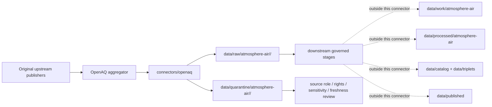

<!-- [KFM_META_BLOCK_V2]
doc_id: kfm://doc/connectors-openaq-readme
title: connectors/openaq/ — OpenAQ Connector Lane
type: readme
version: v0.1
status: draft
owners: OWNER_TBD — Connector steward · Source steward · OpenAQ steward · Atmosphere steward · Hazards steward · Agriculture steward · Data steward · Validation steward · Docs steward
created: 2026-06-20
updated: 2026-06-20
policy_label: public; air-quality-aggregator; aggregate-source; source-admission-only
related:
  - ../README.md
  - ../../docs/doctrine/directory-rules.md
  - ../../docs/sources/catalog/openaq/README.md
  - ../../docs/sources/catalog/openaq/openaq.md
  - ../../docs/sources/catalog/RIGHTS-AND-SENSITIVITY-MAP.md
  - ../../docs/sources/catalog/OPEN-QUESTIONS.md
  - ../../docs/domains/atmosphere/README.md
  - ../../docs/domains/hazards/README.md
  - ../../docs/domains/agriculture/atmosphere-stress.md
  - ../../docs/architecture/source-roles.md
  - ../../docs/architecture/smoke-atmosphere-hazards.md
  - ../../data/registry/sources/
  - ../../data/raw/
  - ../../data/quarantine/
  - ../../data/receipts/
  - ../../data/proofs/
  - ../../policy/rights/
  - ../../policy/sensitivity/
  - ../../release/
tags: [kfm, connectors, openaq, air-quality, atmosphere-air, aggregator, aggregate-source, sensors, monitors, upstream-publisher, role-authority, particulate, ozone, raw, quarantine, source-admission, governance]
notes:
  - "Connector lane for OpenAQ source intake and admission helpers."
  - "Placement is draft / ADR-class: OpenAQ is recognized in DOM-AIR but is not listed in Directory Rules §7.3 canonical connector roots; source docs track this as OPEN-DSC-14."
  - "OpenAQ source_role is aggregate, not observed and not regulatory. Original upstream publisher/source authority must be preserved on every record."
  - "OpenAQ data must not be relabeled as EPA/KDHE/AirNow/AQS/PurpleAir truth without explicit upstream provenance, source role, rights, sensitivity, and receipt checks."
  - "Connector output may enter raw or quarantine admission lanes only."
  - "This README defines a connector/source-admission boundary, not source-family truth, product doctrine, Air domain truth, regulatory air-quality authority, AQI authority, policy authority, schema authority, catalog/triplet authority, proof authority, release authority, public API behavior, or public UI behavior."
[/KFM_META_BLOCK_V2] -->

<a id="top"></a>

# OpenAQ Connector

> Draft source-specific intake and admission lane for OpenAQ air-quality aggregator material.

<p>
  
  
  
  
  
  
  
</p>

`connectors/openaq/`

## Quick jumps

[Scope](#scope) · [Repo fit](#repo-fit) · [Aggregator admission model](#aggregator-admission-model) · [Lifecycle sketch](#lifecycle-sketch) · [Authority boundary](#authority-boundary) · [Inputs](#inputs) · [Exclusions](#exclusions) · [Admission posture](#admission-posture) · [Anti-collapse posture](#anti-collapse-posture) · [Validation](#validation) · [Definition of done](#definition-of-done)

---

## Scope

`connectors/openaq/` is a draft connector lane for OpenAQ source intake and admission helpers.

This folder may contain connector-local documentation, source-admission helpers, request/client helpers, upstream-publisher preservation helpers, station/location metadata parsers, measurement parsers, parameter/unit normalization helpers, freshness helpers, checksum/digest helpers, no-network fixture pointers, and raw/quarantine output adapters for OpenAQ material.

It must not become OpenAQ source-family truth, OpenAQ product doctrine, Atmosphere/Air domain truth, regulatory air-quality authority, AQI authority, original-observer authority, policy authority, schema authority, catalog/triplet authority, proof authority, release authority, pipeline authority, public API behavior, or public UI behavior.

> [!IMPORTANT]
> **Status:** draft / `NEEDS VERIFICATION`  
> **Owner:** `OWNER_TBD`  
> **Path:** `connectors/openaq/`  
> **Truth posture:** the path exists in the repository as this README; actual source descriptors, endpoint behavior, API terms, upstream-publisher handling, station inventory, tests, fixtures, parser behavior, rights posture, sensitivity posture, CI wiring, and release behavior remain `NEEDS VERIFICATION`.

---

## Repo fit

```text
connectors/
└── openaq/
    └── README.md
```

Related responsibility roots:

```text
connectors/                               # source-specific fetch and admission code
connectors/openaq/                        # draft OpenAQ connector lane
docs/sources/catalog/openaq/README.md     # OpenAQ source-family doctrine
docs/sources/catalog/openaq/openaq.md     # OpenAQ product doctrine
docs/domains/atmosphere/                  # atmosphere-air domain context
docs/domains/hazards/                     # smoke/hazard adjacency and trust membrane
docs/domains/agriculture/                 # crop/heat/smoke/air-stress adjacency
data/registry/sources/                    # source descriptors and activation state
data/raw/                                 # raw staged source outputs by owning domain
data/quarantine/                          # held material requiring source/role/rights/sensitivity review
data/receipts/                            # ingest, checksum, source-role, transform, and review receipts
data/proofs/                              # EvidenceBundles and proof packs
policy/rights/                            # terms, attribution, and source-use review
policy/sensitivity/                       # station-location, health-context, and release rules
release/                                  # release decisions, manifests, rollback, correction state
```

> [!WARNING]
> `connectors/openaq/` is a draft/open connector placement. OpenAQ is recognized in Atmosphere/Air source doctrine, but it is not listed in Directory Rules §7.3 canonical connector roots. Keep this lane inactive unless an ADR, migration note, or updated Directory Rules ratifies placement and source activation.

---

## Aggregator admission model

OpenAQ must be handled as an aggregator. The connector must preserve the original upstream publisher and the fitness-for-use distinction for every record.

| Concern | Required connector posture |
|---|---|
| Aggregator identity | Preserve OpenAQ as the aggregation/distribution surface. |
| Original upstream publisher | Preserve the government agency, regulatory network, community network, or other source publisher per record when available. |
| Source role | Admit OpenAQ as `aggregate`; do not relabel as `observation` or `regulatory` without upstream record-level support. |
| Measurement identity | Preserve pollutant/parameter, value, units, averaging period, timestamp, location, sensor/station id, and coordinate metadata. |
| Quality and provenance | Preserve quality flags, source names, attribution fields, ingestion time, API/source URL, and digest when available. |
| Cadence/freshness | Preserve measurement time, last-updated time, retrieval time, and stale/changed status separately. |
| Rights and citation | Preserve both aggregator terms and upstream-publisher attribution/terms where required. |
| Sensitivity | Station/sensor coordinates and health-relevant air-quality context may require freshness banners, disclaimers, generalization, or review. |

---

## Lifecycle sketch



> [!CAUTION]
> Connector code admits source material. It does not turn OpenAQ into an original observer, regulatory authority, AQI authority, health guidance source, public map layer, public API response, or release artifact. Promotion remains a governed state transition, not a file move.

---

## Authority boundary

```text
OUTPUT LIMIT:
  data/raw/atmosphere-air/<source_id>/<run_id>/
  data/quarantine/atmosphere-air/<source_id>/<run_id>/

NOT HERE:
  OpenAQ source-family truth
  OpenAQ product doctrine
  original upstream authority decisions
  regulatory air-quality authority
  AQI or health-guidance authority
  Air domain object meaning
  source descriptor authority
  rights or sensitivity policy
  processed air-quality derivatives
  catalog records
  triplet records
  public map artifacts
  receipts/proofs as authority
  release decisions
  public API behavior
  public UI behavior
```

---

## Inputs

| Accepted item | Required posture |
|---|---|
| Request helper | Preserve endpoint, path, query parameters, response status, retrieval time, source URL, and digest. |
| Location/station parser | Preserve location id, station id where available, coordinates, locality, country, source names, and coordinate precision. |
| Measurement parser | Preserve parameter, value, units, averaging period, measurement time, last-updated time, source id/name, and quality fields where available. |
| Upstream-authority helper | Preserve original upstream publisher, network, instrument/provider class, and role-authority evidence where available. |
| Freshness helper | Preserve measurement time, last-updated time, retrieval time, stale state, and preliminary/final distinction where available. |
| Unit helper | Preserve native units and explicit conversion receipts if downstream conversion occurs. |
| Rights/citation helper | Preserve aggregator and upstream attribution/terms posture. |
| Test references | Point to owning fixture/test roots; fixtures do not become source authority. |

---

## Exclusions

| Do not store here | Correct home |
|---|---|
| OpenAQ source-family doctrine | `docs/sources/catalog/openaq/README.md` |
| OpenAQ product doctrine | `docs/sources/catalog/openaq/openaq.md` |
| Authoritative `SourceDescriptor` records | `data/registry/sources/` |
| Atmosphere/Air or Hazards doctrine | `docs/domains/atmosphere/`, `docs/domains/hazards/` |
| Rights, sensitivity, health-context, or release policy | `policy/`, `policy/sensitivity/`, `release/` |
| Processed air-quality records or derived rollups | `data/processed/` |
| Catalog or triplet records | `data/catalog/`, `data/triplets/` |
| Public map artifacts | `data/published/` after governed release |
| Receipts and proof packs as authority | `data/receipts/`, `data/proofs/` |
| Schemas or semantic contracts | `schemas/`, `contracts/` |
| Public API or UI behavior | `apps/governed-api/`, `apps/explorer-web/` |

---

## Admission posture

OpenAQ intake should preserve source identity, source descriptor reference, aggregator identity, original upstream publisher, source/network/provider fields, location id, station id, coordinates, coordinate precision, parameter, native units, value, averaging period, measurement time, last-updated time, retrieval time, response status, source URL, API path/query, digest, quality/provenance fields, rights/citation posture, sensitivity posture, stale/preliminary/final status where available, domain routing hint, and quarantine reason when review is required.

---

## Anti-collapse posture

| Rule | Connector implication |
|---|---|
| OpenAQ is aggregate, not original observation authority. | Preserve `source_role: aggregate` and original upstream publisher. |
| Aggregator data is not regulatory data by default. | Do not label as regulatory without upstream source authority and descriptor support. |
| Community sensor is not regulatory monitor. | Preserve network/provider class and fitness-for-use caveats. |
| AQI is not concentration. | Preserve parameter/value/units and do not convert to AQI without downstream receipts and policy checks. |
| Real-time is not finalized. | Preserve freshness/preliminary/final status where available; stale values must not appear current. |
| Coordinate precision matters. | Preserve or generalize station/sensor coordinates according to sensitivity policy. |
| Upstream attribution is load-bearing. | Do not collapse EPA/KDHE/AirNow/AQS/PurpleAir-like upstream sources into OpenAQ-only attribution. |
| Public display is downstream. | The connector must not build public tiles, UI panels, health claims, AQI claims, or release payloads. |

---

## Validation

Before relying on this connector, verify:

- connector placement is ratified or recorded in the drift/open-question register;
- active SourceDescriptors exist for OpenAQ and any admitted OpenAQ surfaces;
- current OpenAQ endpoint behavior, API terms, rate limits, metadata fields, and rights posture are verified;
- upstream publisher/source authority fields are captured and preserved;
- parameter/unit/averaging-period/freshness/quality fields are preserved;
- tests use no-network fixtures where practical;
- output paths are limited to raw/quarantine admission lanes;
- downstream receipts, proofs, catalog/triplet records, public map artifacts, and release records are produced only outside this connector;
- public products are released only through governed publication controls and never as regulatory, health-guidance, AQI, or original-observation truth without separate authority.

---

## Definition of done

- [ ] Owners are confirmed and `OWNER_TBD` is replaced.
- [ ] Placement is ratified by ADR, migration note, or updated Directory Rules, or recorded as open drift.
- [ ] Actual connector contents are inventoried.
- [ ] OpenAQ `SourceDescriptor` IDs and source-family activation are verified.
- [ ] Current endpoint behavior, API terms, rate limits, rights, citation, and upstream-attribution posture are documented.
- [ ] Parsers preserve aggregator identity, upstream publisher, source/network fields, location, parameter, value, units, averaging period, time fields, quality fields, source URL, and digest.
- [ ] Tests prevent silent conversion of OpenAQ records into regulatory observations, health guidance, AQI truth, station truth, or public release.
- [ ] Outputs are verified to enter only raw or quarantine admission lanes.
- [ ] No source-family, domain, processed, catalog, triplet, published, release, schema, policy, proof, receipt, registry, fixture, report, API, UI, tile, health-guidance, AQI, or regulatory authority lives here.
- [ ] Tests, fixtures, and CI behavior are verified or marked `NEEDS VERIFICATION`.

---

## Status summary

`connectors/openaq/` is for OpenAQ source-admission code only. It is not OpenAQ source-family truth, product doctrine, Atmosphere/Air domain truth, original-observer authority, regulatory air-quality authority, AQI authority, health guidance, policy authority, schema authority, catalog/triplet authority, proof closure, release authority, public map authority, public API behavior, public UI behavior, or pipeline authority.

<p align="right"><a href="#top">Back to top</a></p>
