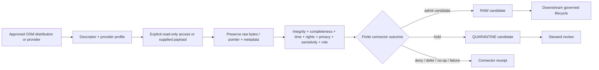

<!-- [KFM_META_BLOCK_V2]
doc_id: kfm://doc/connectors-openstreetmap-readme
title: connectors/openstreetmap/ — Governed OpenStreetMap Connector Boundary
type: readme
version: v0.2
status: draft
owners: OWNER_TBD — Connector steward · Source steward · OpenStreetMap steward · Roads-Rail-Trade steward · Settlements-Infrastructure steward · Spatial Foundation steward · Rights reviewer · Sensitivity reviewer · Privacy reviewer · Security steward · Data steward · Migration steward · Validation steward · CI steward · Docs steward
created: 2026-06-20
updated: 2026-07-15
policy_label: public-doctrine; connector-boundary; source-admission; read-only-upstream; no-network-by-default; descriptor-gated; provider-profile-gated; rights-gated; sensitivity-gated; privacy-minimized; raw-quarantine-receipts-only; anti-collapse; no-publication
current_path: connectors/openstreetmap/README.md
truth_posture: CONFIRMED target README and connector path, connectors responsibility root, merged source-root README v0.2, merged package README v0.2, merged test-boundary README v0.2, short-name osm alias lane, dedicated OpenStreetMap source-family standard, regional-extract product page, placeholder pyproject version 0.0.0, empty package initializer, bounded absence of package client.py, config.py, descriptors.py, test conftest.py, fixture README, import-safety test, descriptor-gate test, service-use test, and fixture-metadata test, and official OSMF API, raster-tile, vector-tile, Nominatim, attribution, copyright, and planet surfaces checked 2026-07-15 / CONFLICTED final naming and compatibility topology across connectors/openstreetmap and connectors/osm / UNKNOWN any additional uninspected implementation files, import consumers, active SourceDescriptors, approved provider profiles, endpoint allowlists, parser behavior, fixtures, executable tests, schedules, emitted receipts, deployment, and downstream release state / NEEDS VERIFICATION owners, alias-resolution ADR or migration note, source activation, provider selection, current provider terms, rights and attribution decisions, source-role bindings, privacy minimization rules, executable contracts, fixture approval, schema bindings, correction propagation, deactivation, and rollback automation
evidence_snapshot:
  repository: bartytime4life/Kansas-Frontier-Matrix
  visibility: public
  base_ref: main
  base_commit: 02eef370493144873dcf58eb5404580397c5e7da
  prior_blob: d1337c71e8bc6b0d421b5778179129406df6e2dc
  related_repository_blobs:
    directory_rules: 2affb080e6f0043867c64c7f06c1ca52030fbd55
    connectors_root_readme: bdd50032bed62ac36964c79f16cf5541b21759a6
    source_root_readme: 8364bfb259a248ca0f4266f59d9bbfb045871396
    package_readme: ad6e8f539a504b5687f66518edafdf3f36fa82f7
    tests_readme: 101635f61acd6556cb06cc530416212282b32d8d
    osm_alias_readme: 514dd57ee42ed18aa1615ae63dd50dbe2e8e914a
    source_family_readme: 3c3974c3cde209724058e0e9cd8af1087084dfbd
    regional_extracts_page: 947d2e6f915f385df1b1f4e3fd029a4bc418568f
    pyproject: db4ce6f276f31672c86d83df2fabaf06107960b7
    package_init: e69de29bb2d1d6434b8b29ae775ad8c2e48c5391
  bounded_path_checks:
    - connectors/openstreetmap/src/openstreetmap/__init__.py exists and is empty
    - connectors/openstreetmap/src/openstreetmap/client.py was not found
    - connectors/openstreetmap/src/openstreetmap/config.py was not found
    - connectors/openstreetmap/src/openstreetmap/descriptors.py was not found
    - connectors/openstreetmap/tests/conftest.py was not found
    - connectors/openstreetmap/tests/fixtures/README.md was not found
    - connectors/openstreetmap/tests/test_import_safety.py was not found
    - connectors/openstreetmap/tests/test_descriptor_gates.py was not found
    - connectors/openstreetmap/tests/test_service_use_guards.py was not found
    - connectors/openstreetmap/tests/test_fixture_metadata.py was not found
related:
  - ../README.md
  - ./pyproject.toml
  - ./src/README.md
  - ./src/openstreetmap/README.md
  - ./src/openstreetmap/__init__.py
  - ./tests/README.md
  - ../osm/README.md
  - ../../docs/doctrine/directory-rules.md
  - ../../docs/sources/catalog/openstreetmap/README.md
  - ../../docs/sources/catalog/openstreetmap/regional-extracts.md
  - ../../docs/sources/catalog/RIGHTS-AND-SENSITIVITY-MAP.md
  - ../../docs/sources/SOURCE_DESCRIPTOR_STANDARD.md
  - ../../docs/domains/roads-rail-trade/README.md
  - ../../docs/domains/roads-rail-trade/SOURCES.md
  - ../../docs/domains/roads-rail-trade/SOURCE_REGISTRY.md
  - ../../docs/domains/settlements-infrastructure/README.md
  - ../../docs/architecture/source-roles.md
  - ../../data/registry/sources/
  - ../../data/raw/
  - ../../data/quarantine/
  - ../../data/receipts/
  - ../../data/proofs/
  - ../../schemas/contracts/v1/source/
  - ../../policy/rights/
  - ../../policy/sensitivity/
  - ../../release/
tags: [kfm, connectors, openstreetmap, osm, connector-boundary, source-admission, read-only, no-network, provider-profiles, regional-extracts, planet, replication, overpass, nominatim, raster-tiles, vector-tiles, volunteered-geographic-information, odbl, attribution, privacy, sensitivity, anti-collapse, deterministic-replay, raw, quarantine, receipts, rollback, no-publication, governance]
notes:
  - "v0.2 applies the KFM GitHub Repository Documentation Implementation Agent v3.1 connector profile and reconciles the parent lane with the merged package, source-root, and test-boundary contracts."
  - "Directory Rules v1.4 §7.3 assigns source-specific fetch and admission behavior to connectors/. The existing openstreetmap lane is responsibility-root compliant; path presence does not activate OpenStreetMap or approve any service or provider."
  - "The lane remains implementation-light: package version 0.0.0, an empty initializer, and no bounded evidence of the expected client, configuration, descriptor, harness, fixture-governance, or lane-specific test files."
  - "Dedicated OpenStreetMap source-family and regional-extract documentation exist; this README coordinates implementation and admission boundaries and does not own source doctrine."
  - "connectors/osm/ remains a README-only short-name alias and must not become a duplicate connector, source tree, test lane, descriptor family, or release path."
  - "All upstream interaction is read-only, explicit, provider-profile-gated, resource-bounded, and subject to current service-specific terms. Upstream edits, changesets, automated website forms, identity evasion, tile scraping, and generic public geocoding are denied."
  - "Connector activity is source-admission support only and is never source authority, legal advice, cadastral truth, routing authority, EvidenceBundle closure, release approval, public-interface authority, or publication."
[/KFM_META_BLOCK_V2] -->

<a id="top"></a>

# Governed OpenStreetMap Connector Boundary

> Source-preserving, read-only, provider-profile-gated admission boundary for approved OpenStreetMap material—without turning community-edited geography, community-funded services, fixtures, or generated derivatives into official KFM truth.

<p>
  
  
  
  
  
  
  
  
</p>

`connectors/openstreetmap/`

## Quick navigation

[Status](#status-and-evidence-boundary) · [Purpose](#purpose) · [Repository fit](#repository-fit-and-naming-topology) · [Current state](#confirmed-current-state) · [Responsibility split](#responsibility-split) · [Authority](#authority-boundary) · [Admission](#admission-contract) · [Provider profiles](#provider-and-distribution-profile-model) · [Configuration](#configuration-identification-and-secrets) · [Network](#network-and-resource-boundary) · [Parsing](#source-native-preservation-contract) · [Completeness](#completeness-truncation-and-staleness) · [Time](#time-freshness-and-replication-continuity) · [Identity](#identity-hashing-deduplication-and-replay) · [Roles](#source-role-authority-and-anti-collapse) · [Rights](#rights-attribution-and-derivative-review) · [Privacy](#privacy-sensitivity-and-data-minimization) · [Lifecycle](#lifecycle-and-finite-connector-outcomes) · [Receipts](#receipts-evidence-references-and-handoff-artifacts) · [Testing](#testing-fixtures-and-ci-boundary) · [Resilience](#rate-limits-retries-timeouts-and-circuit-breaking) · [Drift](#service-policy-schema-and-provider-drift) · [Activation](#activation-and-promotion-gates) · [Rollback](#correction-deactivation-migration-and-rollback) · [Directory map](#directory-map-and-smallest-sound-implementation) · [Done](#definition-of-done) · [Open](#verification-backlog) · [Evidence](#evidence-basis)

---

## Status and evidence boundary

> [!IMPORTANT]
> **Document lifecycle:** `draft`  
> **Component maturity:** documentation-rich connector boundary; executable connector behavior not established  
> **Owner:** `OWNER_TBD`  
> **Path:** `connectors/openstreetmap/`  
> **Responsibility root:** source-specific external fetch and admission support under `connectors/`  
> **Package metadata:** `kfm-connector-openstreetmap`, version `0.0.0`  
> **Default network posture:** denied  
> **Upstream mutation posture:** denied  
> **Topology:** `CONFLICTED / NEEDS VERIFICATION` because `connectors/openstreetmap/` and the README-only `connectors/osm/` alias coexist  
> **Truth posture:** the lane, merged child READMEs, placeholder package metadata, empty initializer, source-family documentation, regional-extract page, alias boundary, and selected absent implementation/test paths are confirmed. Active descriptors, approved provider profiles, executable modules, fixtures, tests, schedules, receipts, deployment, and release state remain `UNKNOWN` or `NEEDS VERIFICATION`.

This README defines the coordinating connector boundary. It does not prove that OpenStreetMap is activated, that any endpoint may be contacted, that provider terms permit a proposed use, that an extract is complete, that an ODbL decision is resolved, that the package executes, that tests exist, or that any derivative can be published.

### Truth labels used here

| Label | Meaning |
|---|---|
| `CONFIRMED` | Verified in this session from repository evidence, merged artifacts, bounded path checks, official upstream material, or generated validation evidence. |
| `PROPOSED` | A design, identifier, file, profile, or workflow direction not established as current implementation. |
| `UNKNOWN` | Not proven by the inspected evidence. |
| `NEEDS VERIFICATION` | Checkable but unresolved for implementation, activation, or release decisions. |
| `DENY` | Disallowed by this connector boundary unless governing doctrine is deliberately changed. |

---

## Purpose

`connectors/openstreetmap/` coordinates source-specific OpenStreetMap intake and admission behavior.

A mature lane may:

- resolve an active source descriptor supplied by the source registry;
- resolve one approved provider or distribution profile for the run;
- fetch or accept approved read-only source material;
- preserve source-native identity, metadata, payload bytes, and provider context;
- evaluate integrity, completeness, freshness, rights, sensitivity, privacy, and source-role gates;
- return deterministic parse results or governed RAW, QUARANTINE, or connector-receipt candidates;
- support replay, correction, deactivation, and rollback;
- expose enough operational evidence for reviewers without claiming source or release authority.

The lane must not become:

- an OpenStreetMap editor, changeset client, automated website-form agent, or other upstream mutator;
- a generic wrapper around every OSM-related service;
- a standard tile scraper, cache warmer, offline-map downloader, or bulk-prefetch engine;
- an unrestricted public Nominatim client, autocomplete backend, systematic geocoder, POI enumerator, or public search proxy;
- a parallel implementation under `connectors/osm/`;
- OpenStreetMap source-family doctrine or product doctrine;
- the canonical `SourceDescriptor`, rights policy, sensitivity policy, schema, or semantic contract home;
- government, cadastral, parcel, ownership, legal-access, route-safety, emergency, current-operation, or complete-inventory truth;
- a normalizer, conflation authority, routing engine, geocoder of record, tile builder, or publication pipeline;
- a catalog, triplet, `EvidenceBundle`, proof pack, release, correction, or publication authority;
- a direct public API, UI, map layer, search surface, dashboard, export, AI-answer source, or automation surface;
- a credential, cookie, session, or secret store.

---

## Repository fit and naming topology

Directory Rules assign source-specific fetch and admission implementation to `connectors/`. The existing long-name lane therefore fits the responsibility root.

```text
connectors/
├── README.md
├── openstreetmap/
│   ├── README.md                    # this coordinating boundary
│   ├── pyproject.toml               # confirmed 0.0.0 placeholder
│   ├── src/
│   │   ├── README.md                # source-tree contract
│   │   └── openstreetmap/
│   │       ├── README.md            # detailed package contract
│   │       └── __init__.py          # confirmed empty
│   └── tests/
│       └── README.md                # test contract; executable suite not established
└── osm/
    └── README.md                    # short-name alias only
```

### Naming determination

| Question | Determination |
|---|---|
| Correct responsibility root | `CONFIRMED`: `connectors/`. |
| Existing implementation/documentation lane | `CONFIRMED`: `connectors/openstreetmap/`. |
| Short-name lane | `CONFIRMED`: `connectors/osm/` contains a README alias boundary. |
| Final canonical naming decision | `NEEDS VERIFICATION`: no accepted alias-resolution ADR or migration note was verified. |
| Parallel implementation permitted | `DENY`. |
| Move, rename, delete, deprecate, or redirect authorized by this README | No. |
| Source activation implied by path presence | No. |

> [!WARNING]
> No implementation, test, fixture, descriptor, receipt, or release path may be duplicated under `connectors/osm/`. A future naming migration must inventory imports, links, descriptors, fixtures, schedules, receipts, deployments, and rollback targets before changing either lane.

---

## Confirmed current state

| Surface | Status | What it proves | What it does not prove |
|---|---|---|---|
| Parent README | `CONFIRMED`, prior v0.1 | The connector documentation lane exists. | No runtime or source activation. |
| `pyproject.toml` | `CONFIRMED`, version `0.0.0` | A package metadata placeholder exists. | Installability, dependencies, entry points, or supported Python versions. |
| Source-root README v0.2 | `CONFIRMED merged` | Source-tree boundaries are documented. | Executable modules or imports. |
| Package README v0.2 | `CONFIRMED merged` | Detailed package behavior is documented. | Implemented client, parser, profiles, or receipts. |
| Package initializer | `CONFIRMED empty` | The namespace file exists. | Public API or import success. |
| Test README v0.2 | `CONFIRMED merged` | Test obligations are documented. | Executable tests, fixtures, markers, or coverage. |
| Source-family standard | `CONFIRMED present` | OSM governance doctrine has a dedicated documentation home. | An active descriptor or release decision. |
| Regional-extract product page | `CONFIRMED present` | Bulk extract posture has a dedicated product page. | Approved provider, cadence, or current extract. |
| `connectors/osm/README.md` | `CONFIRMED present` | Alias ambiguity is documented. | Accepted migration outcome. |
| Selected implementation and test paths | `CONFIRMED not found at bounded checks` | Expected placeholder paths were not present at the inspected locations. | Complete repository absence. |
| Active descriptors, profiles, schedules, receipts, deployment, releases | `UNKNOWN` | No claim made. | Nothing operational may be inferred. |

### Bounded absence statement

The following paths were checked and not found:

```text
connectors/openstreetmap/src/openstreetmap/client.py
connectors/openstreetmap/src/openstreetmap/config.py
connectors/openstreetmap/src/openstreetmap/descriptors.py
connectors/openstreetmap/tests/conftest.py
connectors/openstreetmap/tests/fixtures/README.md
connectors/openstreetmap/tests/test_import_safety.py
connectors/openstreetmap/tests/test_descriptor_gates.py
connectors/openstreetmap/tests/test_service_use_guards.py
connectors/openstreetmap/tests/test_fixture_metadata.py
```

This is not a complete tree inventory. It supports only the conclusion that the lane is implementation-light at those inspected paths.

---

## Responsibility split

| Surface | Owns | Must not own |
|---|---|---|
| `connectors/openstreetmap/README.md` | Connector coordination, provider-profile routing, activation prerequisites, handoff boundary, correction and rollback expectations. | Detailed parser API, source doctrine, policy, schemas, release decisions. |
| `connectors/openstreetmap/src/README.md` | Source-tree organization, import discovery, package placement, dependency discipline. | Source activation, policy, publication. |
| `connectors/openstreetmap/src/openstreetmap/README.md` | Detailed package behavior, provider profiles, parsing, identities, finite results, receipts. | Source doctrine, proof closure, release. |
| `connectors/openstreetmap/tests/README.md` | Deterministic test strategy, fixture governance, no-network enforcement, anti-collapse tests. | Source authority, rights approval, release evidence by itself. |
| `connectors/osm/README.md` | Short-name compatibility and migration pointer. | Duplicate implementation or authority. |
| `docs/sources/catalog/openstreetmap/` | Source-family and product doctrine. | Executable connector behavior. |
| `data/registry/sources/` | Source descriptors and activation state. | Connector implementation. |
| `policy/rights/`, `policy/sensitivity/` | Rights and sensitivity decisions. | Source fetching or parsing. |
| `schemas/contracts/`, `contracts/` | Machine shape and semantic meaning. | Source activation or provider operations. |
| `data/raw/`, `data/quarantine/`, `data/receipts/` | Governed connector handoff surfaces. | Automatic promotion. |
| Downstream lifecycle and `release/` | Normalization, validation, catalog, proof, release, correction, publication. | Upstream connector operation. |

---

## Authority boundary

### Allowed authority

The connector may establish evidence that:

- a configured profile and descriptor were supplied;
- an approved source interaction was attempted;
- a payload or pointer was received;
- a response or file matched recorded integrity expectations;
- a parser produced a deterministic result;
- a gate admitted, quarantined, denied, deferred, retried, or no-op’d a candidate;
- a receipt records what happened.

### Denied authority

The connector cannot establish that:

- an OSM feature is an official government record;
- a road, trail, path, bridge, gate, parcel, facility, or place is legally accessible;
- a name, operator, ownership, jurisdiction, designation, or address is legally authoritative;
- a route is safe, open, passable, emergency-ready, or appropriate;
- an absent feature is absent on the ground;
- a mapped feature is current, complete, surveyed, precise, or operational;
- an imported tag inherited the authority of its upstream origin;
- a fixture is activated source evidence;
- a receipt is an `EvidenceBundle`;
- a RAW or QUARANTINE candidate is processed, cataloged, proved, released, or published.

> [!CAUTION]
> Community edits, imports, historical tags, mapper conventions, and inferred geometries may be useful evidence. They remain bounded by source role, time, completeness, rights, sensitivity, and corroboration.

---

## Admission contract

Every live or file-based run must bind one explicit source descriptor and one explicit provider/distribution profile before access or admission.

Required run context, where applicable:

- descriptor reference and immutable descriptor revision;
- provider/distribution profile reference and revision;
- source family and product identity;
- source role assigned for the bounded object family;
- geographic and temporal scope;
- query, extract, file, sequence, tile, or distribution identity;
- retrieval or acceptance time;
- source date, snapshot date, replication sequence, or provider vintage;
- provider terms and policy review references;
- rights, attribution, privacy, and sensitivity posture;
- request identity and application identification posture;
- configured resource, timeout, response, retry, and redirect bounds;
- raw payload or immutable pointer;
- content digest and metadata digest;
- completeness, truncation, stale-state, and provider-lag state;
- parser and contract versions when implementation exists;
- finite outcome and reason;
- receipt destination supplied by orchestration;
- correction, deactivation, or supersession relationship when applicable.

### Fail-closed conditions

The run must not admit a RAW candidate when any load-bearing property is unresolved, including:

- descriptor or profile identity;
- source role;
- rights or attribution requirements;
- provider terms;
- sensitivity or privacy posture;
- geographic scope;
- source time or retrieval time;
- integrity;
- completeness or truncation state;
- replication continuity;
- parser/contract compatibility;
- output target;
- receipt lineage.

Unresolved material belongs in QUARANTINE, denial, deferral, or another finite non-admit outcome defined by accepted connector contracts.

---

## Provider and distribution profile model

There is no generic “OSM endpoint” permission. Each access surface has a separate purpose, policy, operational risk, and evidence burden.

| Profile class | Intended connector posture | Default |
|---|---|---|
| Governed regional extract | Preferred bulk snapshot posture when provider, geography, source date, rights, and digest are approved. | `DENY` until activated. |
| Planet snapshot or replication feed | Bulk/synchronization posture with sequence continuity, gap handling, large-file controls, and storage planning. | `DENY` until activated. |
| Main OSM editing API | Not a bulk read backend. Upstream edits, changesets, automated forms, and mutation are denied. Any exceptional read use requires a separately reviewed profile. | `DENY`. |
| Overpass-compatible provider | Bounded read-only query profile with provider-specific limits, query digest, result completeness, timeout, and truncation semantics. | `DENY` until activated. |
| Public Nominatim | Not a generic ingestion, autocomplete, enumeration, bulk-geocoding, public proxy, or AI-generated default. | `DENY`. |
| OSMF raster tiles | Display service, not source ingestion. Scraping, prefetch, offline archive creation, and cache bypass are denied. | `DENY` for connector intake. |
| OSMF vector tiles | Display service with separate policy/version behavior; not a substitute for source extracts. Bulk downloading is denied. | `DENY` for connector intake. |
| Third-party OSM-derived provider | Separate provider identity, contract, terms, cadence, attribution, completeness, and support posture. | `DENY` until activated. |
| Self-hosted approved service | May be considered only with explicit data provenance, update process, resource ownership, security, and operations evidence. | `DENY` until activated. |
| Synthetic or approved fixture | No-network test/replay material only. Never source activation or publication evidence by itself. | Allowed for tests after fixture review. |

### Core-service policy snapshot

Official OSMF material checked on `2026-07-15` establishes that:

- the main API is the editing API and is not intended as a general read-only bulk service;
- large or frequent data consumers should use bulk distributions or other appropriate providers;
- OSMF raster and vector tile services are capacity-limited, best-effort display services with identification, attribution, caching, and anti-scraping rules;
- public Nominatim is a limited public geocoding service, not a generic platform backend, autocomplete service, systematic enumerator, or bulk ingestion surface;
- OSMF service policies may change and access may be withdrawn or blocked;
- personal or confidential information must not be submitted to OSMF services.

These are access-dated operational facts. Provider profiles must preserve the checked policy revision or review date and must not convert this README into a timeless service contract.

---

## Configuration, identification, and secrets

### Configuration posture

Configuration must be explicit, typed, reviewable, and supplied by orchestration or an accepted configuration root.

A mature run configuration should reference:

- source descriptor;
- provider profile;
- network enablement decision;
- geographic and temporal bounds;
- query/extract/distribution identity;
- output target;
- timeout and resource budgets;
- retry and circuit-breaker policy;
- application identification;
- cache and conditional-request behavior;
- parser/contract versions;
- rights, privacy, and sensitivity review references.

This README does not define environment-variable names or default endpoints.

### Application identification

When a provider requires application identification:

- use a stable, truthful application identity;
- do not use a generic library default;
- do not impersonate another application, browser, proxy, or organization;
- do not randomize identity to evade limits;
- preserve the effective identity posture in the run receipt;
- keep operator contact details out of source code and fixture content.

### Secrets and sessions

- No credential, token, cookie, private session, or authentication material may be committed.
- Importing the package must not read secrets.
- Public read profiles should not silently acquire authenticated sessions.
- Secret references, when ever required by an approved third-party profile, belong in accepted secret-management surfaces.
- Logs and receipts must record secret reference metadata only when safe; never secret values.

---

## Network and resource boundary

Default behavior is no network.

A live provider adapter, when eventually implemented and activated, must enforce:

- scheme and host allowlists from the approved provider profile;
- TLS verification;
- redirect limits and redirect-target revalidation;
- DNS and private-network protections appropriate to the runtime;
- connection, read, total, and idle timeouts;
- maximum response bytes;
- bounded decompression and archive expansion;
- query/result limits;
- concurrency limits;
- retry budgets;
- conditional request and cache behavior;
- cancellation;
- safe streaming for large distributions;
- temporary-file cleanup;
- circuit breaking after provider or policy failures;
- safe logging and receipt emission.

### Upstream mutation denial

The connector must not:

- create or modify OSM elements;
- open, update, or close changesets;
- submit notes, forms, messages, account actions, or moderation actions;
- automate website-only workflows;
- upload traces or personal data;
- evade provider blocks or identity requirements;
- rotate addresses, identities, proxies, or credentials to bypass restrictions.

---

## Source-native preservation contract

The connector should preserve source-native material before domain interpretation.

### OSM object identity

When present, preserve:

- object type;
- object identifier;
- object version;
- changeset identifier only when necessary and policy-permitted;
- timestamp;
- visibility/deletion state;
- user/contributor metadata only when necessary, minimized, and permitted;
- tags exactly as received;
- node references for ways;
- ordered relation members and roles;
- bounds and source geometry;
- source payload format and encoding;
- provider/distribution identity;
- source URL or immutable distribution pointer;
- raw content digest.

### Geometry

The connector may preserve or parse geometry metadata, but it must not silently:

- repair topology;
- snap features;
- infer missing members;
- generalize or simplify;
- reproject;
- conflate;
- deduplicate semantically distinct features;
- turn a provider-generated geometry into surveyed truth.

Any transform requires an explicit downstream contract and transform receipt.

### Tags

Native tags are source evidence, not KFM domain objects.

Tests and implementation must preserve:

- unknown tags;
- repeated or conflicting semantics;
- language and script;
- case and Unicode;
- deprecated or historical conventions;
- import-source hints;
- conditional tags;
- lifecycle prefixes;
- access-related tags without converting them into legal permission.

---

## Completeness, truncation, and staleness

A successful HTTP response or readable extract is not necessarily a complete result.

The connector must distinguish, when applicable:

- complete response;
- partial response;
- truncated response;
- timed-out response;
- provider-side limit;
- query-too-large denial;
- stale snapshot;
- unknown source date;
- provider lag;
- replication gap;
- out-of-order sequence;
- missing referenced member;
- malformed payload;
- unsupported schema/format;
- integrity failure;
- rights or sensitivity hold.

### No false completeness

The connector must not:

- infer “no matching features” from a timed-out or truncated query;
- treat missing relation members as a valid complete relation;
- treat absent tags as proof of real-world absence;
- merge disjoint snapshots without recording temporal mismatch;
- skip replication sequences silently;
- promote stale material as current;
- report a partial parse as full admission.

---

## Time, freshness, and replication continuity

Keep distinct:

- source object time;
- changeset or edit time when retained and permitted;
- extract/snapshot time;
- replication sequence time;
- provider publication time;
- retrieval time;
- parser execution time;
- admission decision time;
- correction time;
- release time, outside this connector.

### Replication profile requirements

A replication-capable implementation must:

- pin the starting sequence;
- verify sequence continuity;
- stop or quarantine on a gap;
- record duplicate and out-of-order sequences;
- preserve state-file or sequence metadata;
- bind each applied diff to a digest;
- make restart and replay deterministic;
- never invent missing changes;
- prevent partial application from appearing complete;
- emit correction or rollback evidence when continuity is broken.

---

## Identity, hashing, deduplication, and replay

### Deterministic identifiers

Identity should be derived from stable inputs appropriate to the profile, such as:

- descriptor revision;
- provider profile revision;
- distribution identity;
- query digest;
- geographic/temporal scope;
- source date or replication sequence;
- payload digest;
- parser/contract revision.

Generated identifiers are `PROPOSED` until accepted schemas and contracts are verified.

### Hashing

Preserve separate digests for:

- request/query specification;
- response or file bytes;
- metadata manifest;
- decompressed member bytes when applicable;
- parsed source-native representation;
- admission candidate;
- fixture;
- receipt.

Do not claim that one digest proves all layers.

### Deduplication

Deduplication must not erase:

- provider identity;
- source time;
- version changes;
- tag changes;
- relation-member order;
- completeness state;
- rights or sensitivity state;
- correction lineage.

### Replay

A replay must be able to run without live network access from an approved payload or pointer plus pinned configuration and contract versions. Replay proves deterministic behavior for those inputs; it does not prove that the source was complete, current, authoritative, or releasable.

---

## Source role, authority, and anti-collapse

OpenStreetMap is not assigned one universal source role. Role is decided for a bounded object family through the governing source descriptor and admission process.

### Required posture

- Do not assign official or regulatory authority by convenience.
- Do not inherit authority from an upstream source named in an OSM import tag.
- Prefer the original authoritative source directly when a claim depends on that authority.
- Preserve conflict with official, local, state, federal, tribal, domain-specific, or first-party records.
- Preserve mapper-coverage and temporal caveats.
- Require downstream corroboration appropriate to consequence.

### Anti-collapse register

| Collapse risk | Connector requirement |
|---|---|
| Community edit → official record | Deny. Preserve OSM identity and source role. |
| Imported official data → inherited official authority | Deny. Resolve the upstream source directly. |
| Feature presence → legal access | Deny. |
| Access tag → permission or route safety | Deny. |
| Operator/owner tag → legal ownership | Deny. |
| Address tag → authoritative address | Deny unless corroborated through the owning authority. |
| Missing feature → absence on the ground | Deny. |
| Geometry → surveyed precision | Deny. |
| Fresh edit → current operational state | Deny. |
| Fixture success → source activation | Deny. |
| Receipt → proof closure | Deny. |
| RAW candidate → published truth | Deny. |

---

## Rights, attribution, and derivative review

OpenStreetMap data and OSMF-hosted services have distinct rights and usage surfaces.

### Connector obligations

The connector must preserve or reference:

- source and provider identity;
- data-license posture;
- attribution requirement;
- provider-specific terms;
- distribution-specific rights;
- source-use review;
- derivative-database review requirement;
- produced-work review requirement;
- release restriction or hold;
- review date and reviewer reference.

### Release boundary

This connector does not decide whether a derivative database, rendered map, tile archive, graph, geocoder output, routing artifact, ML artifact, export, catalog table, or other produced work satisfies ODbL or provider terms.

Before release, downstream governance must resolve:

- attribution placement and visibility;
- database versus produced-work classification;
- share-alike obligations;
- notice and link requirements;
- provider-specific restrictions;
- mixing/conflation implications;
- correction and takedown path;
- rollback target.

> [!IMPORTANT]
> Rights language here is operational governance, not legal advice. Ambiguity blocks release and may block admission.

---

## Privacy, sensitivity, and data minimization

### Privacy

Do not send personal or confidential material to OSMF or third-party services.

Minimize:

- contributor identity;
- changeset comments;
- user identifiers;
- request IP or session data;
- free-text query content;
- exact search histories;
- operator contact details;
- source URLs containing credentials or private parameters.

Retain contributor or changeset metadata only when necessary for provenance, correction, abuse review, or source interpretation and when allowed by policy.

### Sensitive geography

OSM may expose precise locations for:

- archaeology and cultural heritage;
- sacred or culturally sensitive places;
- rare or vulnerable species;
- critical infrastructure;
- shelters, protective facilities, or sensitive services;
- living-person residences or activity;
- land-access conflict;
- other policy-significant places.

Connector admission must not make these locations public. The package may flag, minimize, generalize, quarantine, or deny according to external policy. Transform decisions and reasons belong in receipts and downstream review records.

### Public-source fallacy

Publicly viewable source material is not automatically safe or appropriate for unrestricted republication, joining, enrichment, search, export, or AI retrieval.

---

## Lifecycle and finite connector outcomes



The exact outcome vocabulary is governed by accepted connector contracts and remains `NEEDS VERIFICATION` for this placeholder lane.

Required properties of any outcome:

- finite and machine-distinguishable;
- reason-bearing;
- descriptor- and profile-bound;
- digest-linked;
- safe to log;
- retry semantics explicit;
- no implicit promotion;
- correction and supersession capable.

### Direct-write boundary

Prefer returning results and handoff candidates to orchestration. If a future runner writes RAW, QUARANTINE, or receipt artifacts, the target must be explicit, governed, and receipt-linked. The connector must never write WORK, PROCESSED, CATALOG, TRIPLET, PROOF, RELEASE, PUBLISHED, public API, public UI, or tile outputs.

---

## Receipts, evidence references, and handoff artifacts

A connector receipt records source interaction and decision evidence.

A mature receipt may include:

- run identifier;
- descriptor and profile references;
- request/query/extract/distribution identity;
- source and retrieval times;
- response status and provider reason;
- bytes and object counts;
- completeness/truncation/stale state;
- sequence continuity;
- digests;
- parser/contract versions;
- rights, privacy, sensitivity, and role gate states;
- outcome and reason;
- retry/defer information;
- RAW or QUARANTINE candidate reference;
- prior receipt, correction, or supersession reference;
- redacted diagnostics.

### Evidence distinction

- A receipt is not an `EvidenceBundle`.
- An `EvidenceRef` is not resolved merely because a connector produced bytes.
- A source-native object is not a public claim.
- A successful admission does not close validation, corroboration, policy, or release review.

---

## Testing, fixtures, and CI boundary

The merged test README v0.2 defines the detailed test contract.

### Default test posture

- no live network;
- no OSMF core services;
- no third-party provider calls;
- no credentials, cookies, or private sessions;
- no upstream mutation;
- no lifecycle writes outside isolated temporary locations;
- no public maps, routes, search results, APIs, UIs, or release artifacts;
- deterministic time and randomness;
- explicit resource budgets;
- safe logging;
- fixture provenance and approval.

### Required test families

A mature suite should cover:

- import safety;
- constructor safety;
- descriptor and profile gates;
- host and redirect allowlists;
- provider-specific service rules;
- regional extract manifests;
- replication continuity and gaps;
- parser preservation for nodes, ways, relations, tags, and member order;
- malformed and adversarial payloads;
- decompression and archive limits;
- completeness and truncation;
- stale data;
- deterministic identity, hashing, deduplication, and replay;
- rights and attribution holds;
- privacy and sensitivity minimization;
- anti-collapse denials;
- finite outcomes;
- receipt redaction;
- correction, deactivation, alias migration, and rollback.

### Fixtures

Fixtures must be synthetic, minimized, redacted, or explicitly approved. Every non-synthetic fixture needs source/distribution/query identity, source date, retrieval date, digest, rights posture, sensitivity posture, minimization note, purpose, expected behavior, and correction history.

Fixture success does not prove source activation, provider availability, policy compliance, rights clearance, data completeness, or release readiness.

---

## Rate limits, retries, timeouts, and circuit breaking

Numeric limits belong in approved provider profiles, not this README.

### Required operational behavior

- respect provider-specific capacity and policy;
- use bounded concurrency;
- use bounded retries only for explicitly retryable failures;
- apply backoff and jitter where appropriate;
- honor provider retry guidance when trusted;
- do not retry denials, policy failures, malformed requests, rights holds, sensitivity holds, or unsupported formats as transient errors;
- stop after resource or policy budgets are exhausted;
- open a circuit after repeated provider, policy, schema, or integrity failures;
- emit one finite receipt rather than loop indefinitely;
- make partial progress and restart state explicit.

### No limit evasion

Do not:

- rotate identities;
- spoof clients;
- distribute requests to bypass limits;
- ignore block responses;
- retry through alternate hosts without an approved profile;
- split prohibited bulk work into apparently smaller calls;
- use caches or proxies to obscure responsibility.

---

## Service, policy, schema, and provider drift

Drift may occur in:

- upstream usage policies;
- provider terms;
- data formats;
- extract naming;
- replication sequence behavior;
- API or query semantics;
- tag conventions;
- tile versions;
- attribution guidance;
- privacy expectations;
- KFM descriptors, contracts, schemas, policies, and directory rules.

### Drift response

When drift is detected:

1. stop or narrow affected access;
2. preserve the triggering evidence;
3. emit a denial, deferral, failure, or quarantine receipt;
4. avoid destructive reinterpretation of prior RAW material;
5. open a review or change record;
6. update provider profiles, tests, docs, or adapters through review;
7. replay approved fixtures;
8. activate only after validation;
9. document correction and rollback implications.

A watcher may detect drift but cannot activate, publish, or approve a connector.

---

## Activation and promotion gates

### Connector activation gates

Before any live profile is activated, verify:

- owners and reviewers;
- accepted source descriptor;
- accepted provider/distribution profile;
- alias and identity consistency;
- current upstream policy/terms review;
- application identification;
- network and resource controls;
- rights and attribution review;
- privacy and sensitivity review;
- source-role assignment;
- parser and contract compatibility;
- no-network fixtures;
- executable tests;
- receipt schema and redaction;
- RAW/QUARANTINE targets;
- correction, deactivation, and rollback plan;
- observability without sensitive leakage;
- CI enforcement appropriate to risk.

### Downstream promotion gates

Connector activation is not lifecycle promotion.

RAW or QUARANTINE material still requires downstream normalization, validation, corroboration, catalog/triplet closure, evidence resolution, policy review, release review, correction path, and rollback target before publication.

---

## Correction, deactivation, migration, and rollback

### Correction

Do not silently overwrite source, descriptor, profile, fixture, parse, or receipt history.

A correction should preserve:

- prior identity;
- corrected identity;
- reason;
- affected source scope;
- affected run and artifact references;
- reviewer;
- effective time;
- replay requirement;
- downstream impact;
- rollback target.

### Deactivation triggers

Deactivate or deny a profile when:

- upstream terms or policy become incompatible;
- provider identity or ownership is unclear;
- rights or attribution cannot be satisfied;
- privacy or sensitivity risk changes;
- endpoint behavior drifts materially;
- parser compatibility fails;
- integrity or completeness cannot be established;
- rate-limit or abuse signals occur;
- receipts cannot be produced safely;
- alias duplication or split identity is detected;
- correction propagation cannot be bounded.

### Alias migration

A future `openstreetmap` versus `osm` decision must:

1. select one implementation home;
2. inventory imports, docs, descriptors, tests, fixtures, schedules, receipts, deployments, and releases;
3. prohibit split source identities;
4. update links and package configuration;
5. preserve compatibility or tombstones where needed;
6. verify rollback before deletion;
7. avoid rewriting shared history;
8. record supersession and correction relationships.

### Rollback

Before merge of a documentation-only change, close the PR or abandon the branch.

After merge, use a normal revert PR for the specific content commit. Do not force-push or rewrite shared history.

Operational rollback, when implementation exists, must separately address profile activation, scheduled jobs, partial payloads, RAW/QUARANTINE candidates, receipts, caches, replication state, downstream consumers, and published derivatives.

---

## Directory map and smallest sound implementation

### Confirmed current structure

```text
connectors/openstreetmap/
├── README.md
├── pyproject.toml
├── src/
│   ├── README.md
│   └── openstreetmap/
│       ├── README.md
│       └── __init__.py
└── tests/
    └── README.md
```

### Proposed smallest sound implementation slice

The following is a design direction, not current repository fact:

```text
connectors/openstreetmap/
├── pyproject.toml
├── src/openstreetmap/
│   ├── __init__.py
│   ├── model.py
│   ├── profiles.py
│   ├── integrity.py
│   ├── parsing.py
│   ├── outcomes.py
│   └── receipts.py
└── tests/
    ├── conftest.py
    ├── fixtures/
    │   └── README.md
    ├── test_import_safety.py
    ├── test_profile_gates.py
    ├── test_parsing_preservation.py
    ├── test_completeness.py
    ├── test_rights_privacy_sensitivity.py
    ├── test_outcomes_receipts.py
    └── test_anti_collapse.py
```

Directory Rules basis:

- connector implementation remains under `connectors/openstreetmap/`;
- source doctrine remains under `docs/sources/catalog/openstreetmap/`;
- descriptors remain under `data/registry/sources/`;
- schemas/contracts remain in their accepted roots;
- policy remains under `policy/`;
- lifecycle data remains in governed data roots;
- release and rollback authority remains under `release/`;
- no parallel implementation is created under `connectors/osm/`.

File names and module boundaries above are `PROPOSED` and require verification against accepted package conventions, schemas, contracts, tests, and ADRs before creation.

---

## Definition of done

### Documentation boundary

- [x] Parent connector authority and lifecycle boundary are explicit.
- [x] Merged source-root, package, and test contracts are linked.
- [x] Current placeholder maturity is stated without overclaiming.
- [x] Dedicated source-family and regional-extract documentation are recognized.
- [x] The `openstreetmap` / `osm` naming conflict is surfaced.
- [x] Provider and distribution profiles are separated.
- [x] Upstream mutation and public-service abuse patterns are denied.
- [x] Source-native preservation, completeness, time, identity, rights, privacy, sensitivity, receipts, correction, and rollback are documented.
- [x] Public, proof, release, and publication authority are denied.

### Operational readiness

- [ ] Owners and reviewers are confirmed.
- [ ] Alias disposition is accepted through an ADR, migration note, or equivalent governed decision.
- [ ] Active source descriptors are verified.
- [ ] Approved provider profiles are verified.
- [ ] Current upstream terms and service policies are reviewed and pinned.
- [ ] Package metadata is no longer a `0.0.0` placeholder.
- [ ] Import-safe executable modules exist.
- [ ] Read-only network and resource controls exist.
- [ ] Source-native parsers exist and are contract-bound.
- [ ] Completeness and replication behavior are executable.
- [ ] Rights, attribution, privacy, sensitivity, and source-role gates are executable.
- [ ] Finite outcomes and receipts are schema-bound.
- [ ] Governed fixtures exist.
- [ ] Default no-network tests exist.
- [ ] CI enforcement is verified.
- [ ] RAW/QUARANTINE handoffs are verified.
- [ ] Correction, deactivation, and rollback are exercised.
- [ ] No duplicate implementation or identity exists under `connectors/osm/`.
- [ ] Downstream release remains separately governed.

---

## Verification backlog

| Item | Status | Required evidence |
|---|---|---|
| Named ownership | `NEEDS VERIFICATION` | Accepted owners/CODEOWNERS or steward record. |
| Alias disposition | `NEEDS VERIFICATION` | ADR or migration note. |
| Complete repository inventory | `UNKNOWN` | Tree and import/reference scan. |
| Package installation and imports | `UNKNOWN` | Package metadata, environment matrix, tests. |
| Source descriptors | `UNKNOWN` | Active registry records and activation decisions. |
| Provider profiles | `UNKNOWN` | Approved profile records with policy review dates. |
| Regional extract provider | `UNKNOWN` | Provider identity, terms, cadence, geography, manifest. |
| Planet/replication posture | `UNKNOWN` | Sequence state, storage, continuity, tests. |
| Overpass posture | `UNKNOWN` | Provider, limits, completeness semantics, tests. |
| Nominatim posture | `DENY by default` | Explicit exceptional decision, if any. |
| Tile-service posture | `DENY for intake` | No connector ingestion profile expected. |
| Rights and attribution | `NEEDS VERIFICATION` | Recorded review and release requirements. |
| Privacy and sensitivity | `NEEDS VERIFICATION` | Policy bindings and minimization tests. |
| Source role | `NEEDS VERIFICATION` | Object-family descriptor decisions. |
| Parser behavior | `UNKNOWN` | Modules, contracts, fixtures, tests. |
| Finite outcomes and receipts | `UNKNOWN` | Schemas, implementation, examples, tests. |
| CI enforcement | `UNKNOWN for lane-specific behavior` | Workflow and job evidence. |
| Operational schedules | `UNKNOWN` | Scheduler/configuration evidence. |
| Deployment | `UNKNOWN` | Runtime/deployment evidence. |
| Published derivatives | `UNKNOWN` | Release manifests, policy decisions, rollback targets. |

---

## Evidence basis

### Repository evidence

This revision is grounded in:

- Directory Rules v1.4;
- the `connectors/` root contract;
- the prior parent README;
- merged OpenStreetMap source-root README v0.2;
- merged OpenStreetMap package README v0.2;
- merged OpenStreetMap test-boundary README v0.2;
- the short-name OSM alias README;
- the dedicated OpenStreetMap source-family standard;
- the regional-extract product page;
- placeholder package metadata;
- the empty package initializer;
- bounded path checks listed in the metadata block.

Repository documents prove boundaries and current documentation state. They do not prove executable behavior unless backed by implementation, tests, logs, receipts, or generated artifacts.

### Official external evidence checked 2026-07-15

- OSMF API Usage Policy;
- OSMF Tile Usage Policy;
- OSMF Vector Tile Usage Policy;
- OSMF Nominatim Usage Policy;
- OSMF Licence/Attribution Guidelines;
- OpenStreetMap copyright and licence page;
- Planet OSM bulk distribution surface.

These sources support the service-specific, read-only, identification, capacity, caching, anti-scraping, privacy, attribution, bulk-distribution, and policy-change posture. Provider activation still requires a KFM-side descriptor, profile, review, tests, and receipt path.

### Evidence limitations

Not verified in this session:

- full repository tree;
- all imports and references;
- active source descriptors;
- provider allowlists;
- executable connector modules;
- package installation;
- fixture inventory beyond bounded checks;
- lane-specific test execution;
- schedules;
- receipts;
- deployment;
- downstream release or publication state.

---

## Status summary

`connectors/openstreetmap/` is the governed coordinating boundary for potential read-only OpenStreetMap source admission. It is currently documentation-rich but implementation-light. It does not activate a source, approve a provider, authorize upstream mutation, establish official or legal truth, close evidence, release data, or publish a public map or answer.

<p align="right"><a href="#top">Back to top</a></p>
