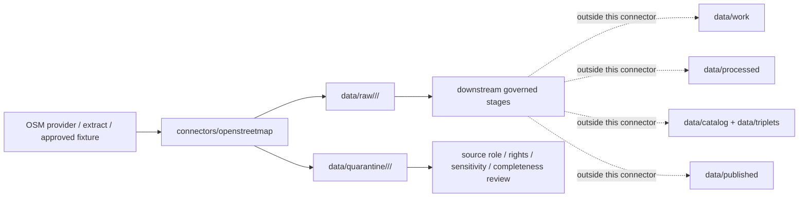

<!-- [KFM_META_BLOCK_V2]
doc_id: kfm://doc/connectors-openstreetmap-readme
title: connectors/openstreetmap/ — OpenStreetMap Connector Lane
type: readme
version: v0.1
status: draft
owners: OWNER_TBD — Connector steward · Source steward · OpenStreetMap steward · Roads-Rail-Trade steward · Settlements-Infrastructure steward · Spatial Foundation steward · Rights steward · Data steward · Validation steward · Docs steward
created: 2026-06-20
updated: 2026-06-20
policy_label: public; volunteered-geographic-information; attribution-required; source-admission-only
related:
  - ../README.md
  - ../../docs/doctrine/directory-rules.md
  - ../../docs/domains/roads-rail-trade/README.md
  - ../../docs/domains/roads-rail-trade/SOURCES.md
  - ../../docs/domains/roads-rail-trade/SOURCE_REGISTRY.md
  - ../../docs/domains/settlements-infrastructure/README.md
  - ../../docs/sources/catalog/README.md
  - ../../docs/sources/catalog/RIGHTS-AND-SENSITIVITY-MAP.md
  - ../../docs/sources/catalog/OPEN-QUESTIONS.md
  - ../../docs/architecture/source-roles.md
  - ../../data/registry/sources/
  - ../../data/raw/
  - ../../data/quarantine/
  - ../../data/receipts/
  - ../../data/proofs/
  - ../../policy/rights/
  - ../../policy/sensitivity/
  - ../../release/
tags: [kfm, connectors, openstreetmap, osm, volunteered-geographic-information, roads-rail-trade, settlements-infrastructure, spatial-foundation, places, roads, trails, poi, attribution, odbl, raw, quarantine, source-admission, governance]
notes:
  - "Replaces greenfield stub for OpenStreetMap connector documentation."
  - "Placement is draft / ADR-class: OpenStreetMap is not listed in Directory Rules §7.3 canonical connector roots unless later ratified by ADR, migration note, or updated Directory Rules."
  - "No dedicated docs/sources/catalog/openstreetmap product page was found during this edit; source-family and product doctrine are therefore NEEDS VERIFICATION."
  - "OpenStreetMap is volunteered geographic information and must not be treated as authoritative government source, legal-access truth, ownership truth, emergency-routing truth, infrastructure status truth, or complete inventory by default."
  - "OpenStreetMap rights, attribution, ODbL/share-alike implications, service usage policy, API/Overpass/planet/extract source choice, freshness, and derivative-database obligations must be reviewed before activation."
  - "Connector output may enter raw or quarantine admission lanes only."
[/KFM_META_BLOCK_V2] -->

<a id="top"></a>

# OpenStreetMap Connector

> Draft source-specific intake and admission lane for OpenStreetMap source material used as volunteered geographic information and contextual spatial evidence.

<p>
  
  
  
  
  
  
  
</p>

`connectors/openstreetmap/`

## Quick jumps

[Scope](#scope) · [Repo fit](#repo-fit) · [Source admission model](#source-admission-model) · [Lifecycle sketch](#lifecycle-sketch) · [Authority boundary](#authority-boundary) · [Inputs](#inputs) · [Exclusions](#exclusions) · [Admission posture](#admission-posture) · [Anti-collapse posture](#anti-collapse-posture) · [Validation](#validation) · [Definition of done](#definition-of-done)

---

## Scope

`connectors/openstreetmap/` is a draft connector lane for OpenStreetMap source intake and admission helpers.

This folder may contain connector-local documentation, source-admission helpers, provider/extract manifest builders, query helpers, extract metadata parsers, OSM element parsers, tag-preservation helpers, version helpers, rights/attribution helpers, service-usage guards, checksum/digest helpers, no-network fixture pointers, and raw/quarantine output adapters for OSM material.

It must not become OpenStreetMap source-family doctrine, Roads/Rail domain truth, Settlements/Infrastructure domain truth, Spatial Foundation truth, government authority, legal-access truth, ownership truth, routing truth, operational-status truth, completeness proof, policy authority, schema authority, catalog/triplet authority, proof authority, release authority, pipeline authority, public API behavior, or public UI behavior.

> [!IMPORTANT]
> **Status:** draft / `NEEDS VERIFICATION`  
> **Owner:** `OWNER_TBD`  
> **Path:** `connectors/openstreetmap/`  
> **Truth posture:** the path exists in the repository as this README; source catalog page, SourceDescriptors, provider choice, endpoint behavior, service usage limits, ODbL review, attribution handling, tests, fixtures, parser behavior, sensitivity posture, CI wiring, and release behavior remain `NEEDS VERIFICATION`.

---

## Repo fit

```text
connectors/
└── openstreetmap/
    └── README.md
```

Related responsibility roots:

```text
connectors/                               # source-specific fetch and admission code
connectors/openstreetmap/                 # draft OpenStreetMap connector lane
docs/domains/roads-rail-trade/            # roads, trails, routing-context, rail/trade adjacency
docs/domains/settlements-infrastructure/  # places, amenities, facilities, infrastructure context
docs/sources/catalog/                     # source-family/product doctrine; OSM page currently NEEDS VERIFICATION
data/registry/sources/                    # source descriptors and activation state
data/raw/                                 # raw staged source outputs by owning domain
data/quarantine/                          # held material requiring source/role/rights/sensitivity review
data/receipts/                            # ingest, checksum, query, transform, and review receipts
data/proofs/                              # EvidenceBundles and proof packs
policy/rights/                            # ODbL, attribution, share-alike, and source-use review
policy/sensitivity/                       # exact-location and release rules
release/                                  # release decisions, manifests, rollback, correction state
```

> [!WARNING]
> `connectors/openstreetmap/` is a draft/open connector placement. Directory Rules §7.3 does not list `openstreetmap/` in the canonical connector roots. Keep this lane inactive unless an ADR, migration note, or updated Directory Rules ratifies placement and source activation.

---

## Source admission model

OpenStreetMap must be handled as volunteered geographic information with rights and attribution obligations. The connector must preserve source context, element identity, and fitness-for-use caveats.

| Concern | Required connector posture |
|---|---|
| Source identity | Preserve OpenStreetMap as source surface and preserve the provider/extract source used. |
| Element identity | Preserve OSM element type, id, version, timestamp, tags, geometry, and relation membership where available. |
| Source role | Default to contextual/candidate unless a SourceDescriptor assigns a more specific role for a bounded use. |
| Attribution and license | Preserve attribution and license-review fields; ODbL/share-alike implications must be reviewed before publication or derivative database release. |
| Service usage | Preserve provider/source URL, query/extract method, retrieval time, user-agent posture, and usage-compliance evidence. |
| Completeness | Preserve completeness and mapper-coverage caveats; absence of an OSM feature is not proof of absence on the ground. |
| Sensitivity | Exact-location and sensitive-domain joins may require redaction, generalization, quarantine, or denial. |
| Cross-source comparison | Preserve conflict status when OSM differs from official local, state, federal, or domain-specific sources. |

---

## Lifecycle sketch



> [!CAUTION]
> Connector code admits source material. It does not validate OSM as authoritative ground truth, decide legal access, publish map layers, build routing guidance, answer public claims, or decide release state. Promotion remains a governed state transition, not a file move.

---

## Authority boundary

```text
OUTPUT LIMIT:
  data/raw/<domain>/<source_id>/<run_id>/
  data/quarantine/<domain>/<source_id>/<run_id>/

NOT HERE:
  OpenStreetMap source-family doctrine
  domain truth for roads / rail / settlements / infrastructure
  authoritative government record
  legal access or ownership truth
  routing authority
  completeness proof
  source descriptor authority
  rights or sensitivity policy
  processed spatial derivatives
  catalog records
  triplet records
  public map artifacts
  receipts/proofs as authority
  release decisions
  public API behavior
  public UI behavior
```

---

## Inputs

| Accepted item | Required posture |
|---|---|
| Provider/extract manifest | Preserve provider, extract URL, source date, geographic extent, query/extract method, retrieval time, file identity, size, and digest. |
| Query helper | Preserve query text, endpoint, parameters, timeout, response status, result count, retrieval time, and digest. |
| Planet/extract parser | Preserve source date, replication sequence where available, element type/id/version, timestamp, tags, geometry, and relation context. |
| Tag parser | Preserve native OSM tags without silently mapping them to KFM domain truth. |
| Geometry helper | Preserve geometry type, CRS, bounds, topology warnings, and simplification/generalization status. |
| Rights/attribution helper | Preserve OSM attribution, ODbL review, share-alike review, provider terms, and release restrictions. |
| Sensitivity helper | Flag exact-location and sensitive-domain review cases. |
| Test references | Point to owning fixture/test roots; fixtures do not become source authority. |

---

## Exclusions

| Do not store here | Correct home |
|---|---|
| OpenStreetMap source-family/product doctrine | `docs/sources/catalog/` after accepted placement |
| Authoritative `SourceDescriptor` records | `data/registry/sources/` |
| Roads/Rail, Settlements/Infrastructure, or Spatial Foundation doctrine | `docs/domains/` under owning domain lanes |
| Rights, sensitivity, attribution, or release policy | `policy/`, `policy/sensitivity/`, `release/` |
| Processed OSM-derived layers or conflation outputs | `data/processed/` |
| Catalog or triplet records | `data/catalog/`, `data/triplets/` |
| Public map artifacts | `data/published/` after governed release |
| Receipts and proof packs as authority | `data/receipts/`, `data/proofs/` |
| Schemas or semantic contracts | `schemas/`, `contracts/` |
| Public API or UI behavior | `apps/governed-api/`, `apps/explorer-web/` |

---

## Admission posture

OpenStreetMap intake should preserve source identity, source descriptor reference, provider/extract source, query text or extract manifest, geographic extent, source date, retrieval time, file identity, digest, OSM element type, OSM element id, version, timestamp, tags, geometry, relation membership, replication/source sequence where available, source URL, provider terms, attribution posture, ODbL/share-alike review status, source-role posture, completeness caveat, sensitivity posture, conflict status, and quarantine reason when review is required.

---

## Anti-collapse posture

| Rule | Connector implication |
|---|---|
| OSM is not government authority. | Do not treat volunteered edits as official roads, addresses, access, ownership, zoning, emergency, or regulatory truth. |
| OSM feature presence is not legal access. | Paths, roads, gates, facilities, and POIs do not prove permissions or current operation. |
| OSM absence is not absence on the ground. | Completeness varies by mapper coverage, topic, and time. |
| OSM tags are not KFM domain objects. | Preserve native tags; downstream mapping needs contracts and receipts. |
| OSM extract is not current by default. | Preserve source date, retrieval date, and replication/sequence metadata when available. |
| Sensitive-domain joins require review. | Exact-location or high-risk joins may need quarantine or generalization. |
| ODbL review is load-bearing. | Attribution and derivative-database obligations must be reviewed before release. |
| Public display is downstream. | The connector must not build public tiles, UI layers, routing claims, access claims, or release payloads. |

---

## Validation

Before relying on this connector, verify:

- connector placement is ratified or recorded in the drift/open-question register;
- a source catalog page and active SourceDescriptors exist for OSM use cases;
- current OSM licensing, attribution, ODbL/share-alike, and provider/service usage requirements are reviewed;
- provider/extract choice is governed and reproducible;
- source date, retrieval time, query/extract method, element id/version/tags/geometry, and digest are preserved;
- tests use no-network fixtures where practical;
- output paths are limited to raw/quarantine admission lanes;
- downstream receipts, proofs, catalog/triplet records, public map artifacts, and release records are produced only outside this connector;
- public products are released only through governed publication controls and never as access, ownership, routing, regulatory, current-operational, or complete-inventory truth without separate authority.

---

## Definition of done

- [ ] Owners are confirmed and `OWNER_TBD` is replaced.
- [ ] Placement is ratified by ADR, migration note, or updated Directory Rules, or recorded as open drift.
- [ ] Dedicated OSM source-family/product doctrine is created or an accepted source catalog reference is linked.
- [ ] Actual connector contents are inventoried.
- [ ] OpenStreetMap `SourceDescriptor` IDs and source-family activation are verified.
- [ ] Current OSM licensing, attribution, ODbL/share-alike, provider, endpoint/extract, and service usage posture are documented.
- [ ] Parsers preserve provider/extract source, query/manifest, source date, retrieval time, element type/id/version, tags, geometry, relation context, source URL, and digest.
- [ ] Tests prevent silent conversion of OSM records into access truth, ownership truth, official road truth, routing authority, completeness proof, or public release.
- [ ] Outputs are verified to enter only raw or quarantine admission lanes.
- [ ] No source-family, domain, processed, catalog, triplet, published, release, schema, policy, proof, receipt, registry, fixture, report, API, UI, tile, routing, access, ownership, regulatory, or sensitive-disclosure authority lives here.
- [ ] Tests, fixtures, and CI behavior are verified or marked `NEEDS VERIFICATION`.

---

## Status summary

`connectors/openstreetmap/` is for OpenStreetMap source-admission code only. It is not source-family doctrine, government authority, Roads/Rail truth, Settlements/Infrastructure truth, Spatial Foundation truth, legal-access truth, ownership truth, routing authority, completeness proof, policy authority, schema authority, catalog/triplet authority, proof closure, release authority, public map authority, public API behavior, public UI behavior, or pipeline authority.

<p align="right"><a href="#top">Back to top</a></p>
