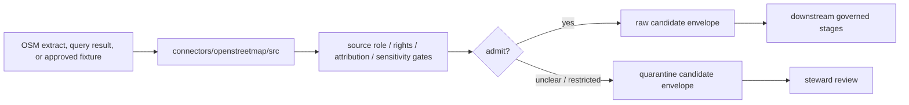

<!-- [KFM_META_BLOCK_V2]
doc_id: kfm://doc/connectors-openstreetmap-src-readme
title: connectors/openstreetmap/src/ — OpenStreetMap Connector Source Root
type: readme
version: v0.1
status: draft
owners: OWNER_TBD — Connector steward · Source steward · OpenStreetMap steward · Roads-Rail-Trade steward · Settlements-Infrastructure steward · Spatial Foundation steward · Rights steward · Data steward · Validation steward · Docs steward
created: 2026-06-20
updated: 2026-06-20
policy_label: public-doctrine; source-root; import-safe; no-network-default; source-admission-only
related:
  - ../README.md
  - ./openstreetmap/README.md
  - ../tests/README.md
  - ../../../docs/doctrine/directory-rules.md
  - ../../../docs/domains/roads-rail-trade/README.md
  - ../../../docs/domains/roads-rail-trade/SOURCES.md
  - ../../../docs/domains/roads-rail-trade/SOURCE_REGISTRY.md
  - ../../../docs/domains/settlements-infrastructure/README.md
  - ../../../docs/sources/catalog/README.md
  - ../../../docs/sources/catalog/RIGHTS-AND-SENSITIVITY-MAP.md
  - ../../../docs/sources/catalog/OPEN-QUESTIONS.md
  - ../../../docs/architecture/source-roles.md
  - ../../../data/registry/sources/
  - ../../../data/raw/
  - ../../../data/quarantine/
  - ../../../data/receipts/
  - ../../../data/proofs/
  - ../../../policy/rights/
  - ../../../policy/sensitivity/
  - ../../../release/
tags: [kfm, connectors, openstreetmap, osm, source-root, python, import-safe, no-network-default, volunteered-geographic-information, attribution, odbl, source-admission, raw, quarantine, governance]
notes:
  - "Source-code root for OpenStreetMap connector implementation under connectors/openstreetmap/."
  - "This README documents the source-root boundary only; actual package files, module names, tests, fixtures, package metadata, and CI wiring remain NEEDS VERIFICATION until inspected."
  - "Code below this root may prepare OpenStreetMap source material for raw or quarantine admission envelopes only."
  - "Importable package details belong in connectors/openstreetmap/src/openstreetmap/README.md."
  - "Import and module discovery must be side-effect-free: no live network calls, no secret reads, no lifecycle writes, no upstream edits, no publication, and no public claims."
  - "Rights, attribution, ODbL/share-alike, provider terms, source-role, freshness, completeness, and sensitivity gates must fail closed."
[/KFM_META_BLOCK_V2] -->

<a id="top"></a>

# OpenStreetMap Connector Source Root

> Source-code root for OpenStreetMap connector implementation under `connectors/openstreetmap/`.

<p>
  
  
  
  
  
  
</p>

`connectors/openstreetmap/src/`

## Scope

`connectors/openstreetmap/src/` is the source-code root for OpenStreetMap connector implementation code.

This source root may contain the importable `openstreetmap` package, package-local documentation, source-admission helper code, provider/extract manifest code, bounded request/client code, OSM element parser code, tag-preservation code, geometry metadata code, version/source-date helpers, rights/attribution helpers, service-use guards, sensitivity guards, digest helpers, finite connector errors, and raw/quarantine envelope builders.

It must not become OpenStreetMap source-family doctrine, domain truth, government authority, legal-access truth, ownership truth, routing truth, operational-status truth, completeness proof, rights policy authority, sensitivity policy authority, schema authority, catalog/triplet authority, proof authority, release authority, public API behavior, public UI behavior, or publication authority.

> [!IMPORTANT]
> **Status:** draft / `NEEDS VERIFICATION`  
> **Owner:** `OWNER_TBD`  
> **Path:** `connectors/openstreetmap/src/`  
> **Truth posture:** the path exists in the repository as this README; actual source files, modules, imports, package metadata, dependency wiring, tests, fixtures, and CI behavior remain `NEEDS VERIFICATION`.

---

## Repo fit

```text
connectors/
└── openstreetmap/
    ├── README.md
    ├── src/
    │   ├── README.md
    │   └── openstreetmap/
    │       └── README.md
    └── tests/
        └── README.md
```

Related responsibility roots:

```text
connectors/openstreetmap/                 # draft OpenStreetMap connector lane
connectors/openstreetmap/src/             # this source-code root
connectors/openstreetmap/src/openstreetmap/ # importable package boundary
connectors/openstreetmap/tests/           # connector test lane
docs/domains/roads-rail-trade/            # roads, trails, routing-context, rail/trade adjacency
docs/domains/settlements-infrastructure/  # places, amenities, facilities, infrastructure context
docs/sources/catalog/                     # source-family/product doctrine; OSM page currently NEEDS VERIFICATION
data/registry/sources/                    # source descriptors and activation state
data/raw/                                 # raw staged source outputs by owning domain
data/quarantine/                          # held material requiring source/role/rights/sensitivity review
data/receipts/                            # ingest, checksum, query, transform, and review receipts
data/proofs/                              # EvidenceBundles and proof packs
policy/rights/                            # ODbL, attribution, share-alike, and source-use review
policy/sensitivity/                       # exact-location and release rules
release/                                  # release decisions, manifests, rollback, correction state
```

---

## Source-root contract

Code below this root should be organized as connector implementation support. It may prepare source-admission envelopes, but it must not decide downstream truth or release.

Required behavior:

- importing modules is safe by default;
- no network calls at import time;
- no credential, token, cookie, or private session reads at import time;
- no upstream edits or other source-side side effects;
- no filesystem writes at import time;
- no lifecycle writes to raw, quarantine, work, processed, catalog, triplet, published, receipt, proof, release, API, UI, or tile stores at import time;
- live source access is explicit and descriptor-gated;
- parser functions accept supplied payloads or fixtures;
- raw/quarantine handoff envelopes include source references, digests, source role, rights posture, and review flags;
- policy, schema, descriptor, proof, and release authority remain external.

---

## Expected contents

Actual contents are **NEEDS VERIFICATION**. A future source root may include:

```text
connectors/openstreetmap/src/
├── README.md
└── openstreetmap/
    ├── README.md
    ├── __init__.py
    ├── config.py
    ├── client.py
    ├── descriptors.py
    ├── extracts.py
    ├── queries.py
    ├── elements.py
    ├── tags.py
    ├── geometry.py
    ├── freshness.py
    ├── rights.py
    ├── sensitivity.py
    ├── digest.py
    ├── envelope.py
    └── errors.py
```

Do not treat this layout as implementation proof until the repo tree, package metadata, imports, tests, and CI are inspected.

---

## Package responsibilities

| Area | Source-root responsibility |
|---|---|
| Provider/extract manifests | Preserve provider, extract URL, source date, geographic extent, query/extract method, retrieval time, file identity, size, and digest. |
| Query helpers | Preserve query text, endpoint, parameters, timeout, response status, result count, retrieval time, and digest. |
| Element parsing | Preserve OSM element type, id, version, timestamp, tags, geometry, and relation membership where available. |
| Tag preservation | Preserve native OSM tags without silently mapping them to KFM domain truth. |
| Geometry metadata | Preserve geometry type, bounds, topology warnings, and simplification/generalization status. |
| Rights and attribution | Preserve attribution, ODbL/share-alike review, provider terms, and release restrictions. |
| Sensitivity gates | Flag exact-location and sensitive-domain review cases. |
| Handoff envelopes | Build raw/quarantine candidate envelopes; do not write release products. |

---

## Lifecycle handoff



This source root should return handoff envelopes or finite errors. It should not write lifecycle stores directly unless a connector runner owns the write and records receipts.

---

## Anti-collapse rules

| Rule | Source-root implication |
|---|---|
| Import is not activation. | Importing code must not prove source activation or availability. |
| OSM is not government authority. | Code must not elevate OSM records into official truth. |
| OSM feature presence is not legal access. | Code must preserve source features without asserting permissions. |
| OSM absence is not absence on the ground. | Code must preserve completeness caveats. |
| OSM tags are not KFM objects. | Code must preserve native tags until downstream contracts map them. |
| ODbL review is load-bearing. | Code must flag rights/attribution review before release. |
| Policy and release are external. | Code may flag review needs but must not decide public release. |

---

## Validation

Before relying on this source root, verify actual source files, package metadata, import paths, dependency configuration, no-network import behavior, descriptor gates, rights and attribution gates, service-use guards, parser coverage, fixture approval, digest stability, raw/quarantine-only envelope creation, and CI wiring.

---

## Definition of done

- [ ] Owners are confirmed and `OWNER_TBD` is replaced.
- [ ] Actual source files and package/module names are inventoried.
- [ ] Importing source modules performs no network, secret, cache, upstream-side-effect, publication, or unsafe filesystem side effects.
- [ ] Source descriptors and activation decisions are required before live access.
- [ ] Rights, attribution, ODbL/share-alike, provider terms, source-role, freshness, completeness, and sensitivity gates fail closed.
- [ ] Parsers preserve source/extract/query metadata, element type/id/version, tags, geometry, relation context, source date, retrieval time, source URL, and digest.
- [ ] Output is limited to raw or quarantine admission envelopes.
- [ ] Tests cover no-network defaults, malformed inputs, stale extracts, role collapse, missing rights review, schema drift, and public-release misuse paths.
- [ ] CI behavior is verified or marked `NEEDS VERIFICATION`.

---

## Status summary

`connectors/openstreetmap/src/` is for OpenStreetMap connector source code only. It is not source-family doctrine, government authority, domain truth, access truth, ownership truth, routing authority, completeness proof, policy authority, schema authority, catalog/triplet authority, proof closure, release authority, public map authority, public API behavior, public UI behavior, or pipeline authority.

<p align="right"><a href="#top">Back to top</a></p>
