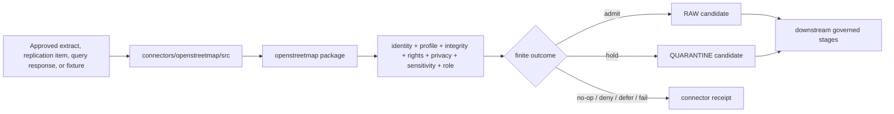

<!-- [KFM_META_BLOCK_V2]
doc_id: kfm://doc/connectors-openstreetmap-src-readme
title: connectors/openstreetmap/src/ — OpenStreetMap Connector Source Root
type: readme
version: v0.2
status: draft
owners: OWNER_TBD — Connector steward · Source steward · OpenStreetMap steward · Roads-Rail-Trade steward · Settlements-Infrastructure steward · Spatial Foundation steward · Rights reviewer · Sensitivity reviewer · Privacy reviewer · Security steward · Data steward · Migration steward · Validation steward · CI steward · Docs steward
created: 2026-06-20
updated: 2026-07-15
policy_label: public-doctrine; source-root; import-safe; read-only-upstream; no-network-by-default; descriptor-gated; provider-profile-gated; rights-gated; sensitivity-gated; privacy-minimized; raw-quarantine-receipts-only; no-publication
current_path: connectors/openstreetmap/src/README.md
truth_posture: CONFIRMED target README and source-root path, connectors responsibility root, OpenStreetMap parent boundary, merged package README v0.2, tests boundary, short-name osm alias lane, dedicated OpenStreetMap source-family standard, regional-extract product page, placeholder pyproject version 0.0.0, empty package initializer, bounded absence of package client.py, config.py, descriptors.py, and test_import_safety.py, and official OSMF API, raster-tile, vector-tile, Nominatim, attribution, copyright, and planet surfaces checked 2026-07-15 / CONFLICTED canonical naming and compatibility topology across connectors/openstreetmap and connectors/osm / UNKNOWN any additional uninspected source files, import consumers, active SourceDescriptors, approved provider profiles, network configuration, parser behavior, fixtures, executable tests, CI enforcement depth, schedules, emitted receipts, deployment, and downstream release state / NEEDS VERIFICATION owners, alias-resolution ADR or migration note, source activation, provider and endpoint allowlists, current provider terms, rights and attribution decisions, source-role bindings, privacy minimization, module contracts, fixture approval, schema bindings, correction propagation, deactivation, and rollback automation
evidence_snapshot:
  repository: bartytime4life/Kansas-Frontier-Matrix
  visibility: public
  base_ref: main
  base_commit: a8cf7411b3ba865495734fb0e9173a717585a488
  prior_blob: 3f63e451557e925d9fed0df2bb9df66faa481627
  related_repository_blobs:
    connectors_root_readme: bdd50032bed62ac36964c79f16cf5541b21759a6
    parent_connector_readme: d1337c71e8bc6b0d421b5778179129406df6e2dc
    package_readme: ad6e8f539a504b5687f66518edafdf3f36fa82f7
    tests_readme: a05e3f8b03ad7332b90a92c1a2ce08f88e971b32
    osm_alias_readme: 514dd57ee42ed18aa1615ae63dd50dbe2e8e914a
    source_family_readme: 3c3974c3cde209724058e0e9cd8af1087084dfbd
    regional_extracts_page: 947d2e6f915f385df1b1f4e3fd029a4bc418568f
    pyproject: db4ce6f276f31672c86d83df2fabaf06107960b7
    package_init: e69de29bb2d1d6434b8b29ae775ad8c2e48c5391
  bounded_path_checks:
    - connectors/openstreetmap/src/openstreetmap/__init__.py exists and is empty
    - connectors/openstreetmap/src/openstreetmap/client.py was not found
    - connectors/openstreetmap/src/openstreetmap/config.py was not found
    - connectors/openstreetmap/src/openstreetmap/descriptors.py was not found
    - connectors/openstreetmap/tests/test_import_safety.py was not found
related:
  - ../README.md
  - ./openstreetmap/README.md
  - ../tests/README.md
  - ../../osm/README.md
  - ../../../docs/doctrine/directory-rules.md
  - ../../../docs/sources/catalog/openstreetmap/README.md
  - ../../../docs/sources/catalog/openstreetmap/regional-extracts.md
  - ../../../docs/sources/catalog/RIGHTS-AND-SENSITIVITY-MAP.md
  - ../../../docs/sources/SOURCE_DESCRIPTOR_STANDARD.md
  - ../../../docs/domains/roads-rail-trade/README.md
  - ../../../docs/domains/roads-rail-trade/SOURCES.md
  - ../../../docs/domains/roads-rail-trade/SOURCE_REGISTRY.md
  - ../../../docs/domains/settlements-infrastructure/README.md
  - ../../../docs/architecture/source-roles.md
  - ../../../data/registry/sources/
  - ../../../data/raw/
  - ../../../data/quarantine/
  - ../../../data/receipts/
  - ../../../data/proofs/
  - ../../../schemas/contracts/v1/source/
  - ../../../policy/rights/
  - ../../../policy/sensitivity/
  - ../../../release/
tags: [kfm, connectors, openstreetmap, osm, source-root, python, src-layout, import-safe, read-only, no-network, provider-profiles, regional-extracts, planet, replication, overpass, nominatim, tiles, volunteered-geographic-information, odbl, attribution, privacy, raw, quarantine, receipts, rollback, no-publication, governance]
notes:
  - "v0.2 applies the KFM GitHub Repository Documentation Implementation Agent v3.1 source-root and connector profile."
  - "Directory Rules v1.4 §7.3 assigns source-specific fetch and admission behavior to connectors/. This existing src path is responsibility-root compliant; path presence does not activate OpenStreetMap or approve a provider."
  - "The merged child package README v0.2 is the detailed package contract. This source-root README governs organization, discovery, boundaries, and handoff across code below src/."
  - "The source root remains implementation-light: pyproject version 0.0.0, empty package initializer, and no bounded evidence of client, configuration, descriptor, or import-safety test modules."
  - "Dedicated OpenStreetMap source-family and regional-extract documentation now exist; source doctrine does not belong under src/."
  - "connectors/osm/ is a README-only alias lane and must not become a duplicate package or source tree."
  - "All upstream OSM interaction is read-only, explicit, provider-profile-gated, and subject to current service-specific terms."
  - "Source-root activity is source admission support only and is never source authority, legal advice, proof closure, routing authority, release, or publication authority."
[/KFM_META_BLOCK_V2] -->

<a id="top"></a>

# OpenStreetMap Connector Source Root

> Governed source-tree boundary for the importable OpenStreetMap connector package: import-safe, read-only upstream, no-network by default, provider-profile-gated, and limited to source-preserving RAW, QUARANTINE, or connector-receipt handoffs.

<p>
  
  
  
  
  
  
  
  
</p>

`connectors/openstreetmap/src/`

## Quick navigation

[Status](#status-and-evidence-boundary) · [Purpose](#purpose) · [Repository fit](#repository-fit-and-naming-topology) · [Current state](#confirmed-current-state) · [Responsibility split](#responsibility-split) · [Source-root contract](#source-root-contract) · [Import discovery](#import-discovery-and-side-effect-boundary) · [Package organization](#package-organization-and-module-placement) · [Provider profiles](#provider-profile-routing) · [Configuration](#configuration-secrets-and-identification) · [Parsing](#source-native-parsing-boundary) · [Completeness](#completeness-truncation-and-staleness) · [Identity](#identity-hashing-deduplication-and-replay) · [Rights](#rights-attribution-privacy-and-sensitivity) · [Lifecycle](#lifecycle-and-finite-outcomes) · [Receipts](#receipts-evidence-references-and-handoff-artifacts) · [Testing](#testing-fixtures-and-ci-boundary) · [Dependencies](#dependencies-packaging-and-public-api-discipline) · [Operations](#resilience-drift-and-operational-evidence) · [Activation](#activation-and-promotion-gates) · [Rollback](#correction-deactivation-migration-and-rollback) · [Directory map](#directory-map-and-smallest-sound-implementation) · [Done](#definition-of-done) · [Open](#verification-backlog) · [Evidence](#evidence-basis)

---

## Status and evidence boundary

> [!IMPORTANT]
> **Document lifecycle:** `draft`  
> **Component maturity:** documentation-rich source boundary; executable connector behavior not established  
> **Owner:** `OWNER_TBD`  
> **Path:** `connectors/openstreetmap/src/`  
> **Responsibility root:** source-specific connector implementation under `connectors/`  
> **Package metadata:** `kfm-connector-openstreetmap`, version `0.0.0`  
> **Canonical import namespace:** `openstreetmap` under this source root, subject to package verification  
> **Topology:** `CONFLICTED / NEEDS VERIFICATION` because `connectors/openstreetmap/` and the README-only `connectors/osm/` alias coexist  
> **Truth posture:** the source-root README, merged package README v0.2, package metadata, empty initializer, source-family docs, regional-extract page, tests boundary, alias boundary, and selected absent paths are confirmed. Active descriptors, provider profiles, executable modules, import consumers, fixtures, tests, schedules, receipts, deployment, and release state remain `UNKNOWN` or `NEEDS VERIFICATION`.

This README governs the organization and allowed behavior of code below `src/`. It does not prove that the package installs, imports in all supported environments, reaches an upstream service, parses OSM correctly, satisfies rights obligations, has approved fixtures, passes CI, or produces releasable data.

### Truth labels used here

| Label | Meaning |
|---|---|
| `CONFIRMED` | Verified in this session from repository content, bounded path checks, merged artifacts, or official upstream material. |
| `PROPOSED` | A design or file placement that is not established as current implementation. |
| `UNKNOWN` | Not proven by the inspected evidence. |
| `NEEDS VERIFICATION` | Checkable, but unresolved for implementation, activation, or release decisions. |
| `DENY` | Disallowed by this boundary unless governing doctrine is deliberately changed. |

---

## Purpose

`connectors/openstreetmap/src/` is the source-code root for the OpenStreetMap connector package.

Its responsibilities are to:

- provide one coherent Python source tree for the connector;
- preserve import and namespace stability;
- keep package discovery side-effect-free;
- route package-level detail to [`openstreetmap/README.md`](./openstreetmap/README.md);
- prevent implementation from spreading into the `connectors/osm/` alias lane;
- organize pure parsing, provider-profile, integrity, configuration, and admission-candidate code;
- keep OSM source-native identity, tags, relations, geometry, time, completeness, and provider context intact;
- keep network interaction explicit, read-only, bounded, and disabled by default;
- keep rights, attribution, sensitivity, privacy, source-role, and activation decisions external but mandatory;
- return finite results or handoff candidates rather than writing downstream truth;
- support deterministic replay and no-network tests.

It must not become:

- a source-family doctrine home;
- a second source registry;
- an upstream OSM editor or changeset client;
- an unbounded wrapper around OSMF or third-party services;
- a tile scraper, cache warmer, offline map downloader, or public geocoding backend;
- a routing, conflation, normalization, catalog, graph, or publication pipeline;
- a government, ownership, cadastral, access, route-safety, current-operation, surveyed-precision, or completeness authority;
- a rights, sensitivity, schema, contract, proof, release, or correction authority;
- a direct public map, API, UI, search, dashboard, export, notification, or AI-answer source;
- a secret or private-session store.

---

## Repository fit and naming topology

Directory Rules place source-specific fetch and admission code under `connectors/`. `src/` is therefore the correct responsibility sub-root for importable package code inside the existing connector lane. That placement does not activate OpenStreetMap or resolve the alias topology.

```text
connectors/
├── README.md
├── openstreetmap/
│   ├── README.md
│   ├── pyproject.toml
│   ├── src/
│   │   ├── README.md                  # this source-root boundary
│   │   └── openstreetmap/
│   │       ├── README.md              # merged detailed package contract v0.2
│   │       └── __init__.py            # confirmed empty
│   └── tests/
│       └── README.md                  # no-network test boundary
└── osm/
    └── README.md                      # short-name alias; no implementation
```

### Placement determination

| Question | Determination |
|---|---|
| Does source implementation belong under `connectors/`? | `CONFIRMED` by Directory Rules §7.3. |
| Is `connectors/openstreetmap/src/` responsibility-root compliant? | `CONFIRMED`. |
| Does this path activate an OSM source or provider? | No. Activation belongs to governed source records and review. |
| Is `connectors/osm/` a second package root? | No. It is a README-only alias boundary in the inspected state. |
| May executable modules be duplicated across both names? | `DENY`. One active implementation home only. |
| Does this README authorize a move, rename, import alias, or deletion? | No. That requires inventory, compatibility analysis, migration notes, tests, and rollback. |

> [!WARNING]
> New implementation must not be split between `connectors/openstreetmap/src/` and `connectors/osm/`. The latter remains a compatibility/documentation surface unless governance explicitly migrates the package.

---

## Confirmed current state

| Surface | Status | What it proves | What it does not prove |
|---|---:|---|---|
| `connectors/openstreetmap/src/README.md` | `CONFIRMED v0.1 before this revision` | A source-root boundary exists. | Executable maturity or completeness. |
| `connectors/openstreetmap/src/openstreetmap/README.md` | `CONFIRMED v0.2` | A detailed package contract is merged. | Implemented modules or passing imports. |
| `connectors/openstreetmap/src/openstreetmap/__init__.py` | `CONFIRMED empty` | The namespace marker exists. | Public API, exports, package initialization, or compatibility. |
| `connectors/openstreetmap/pyproject.toml` | `CONFIRMED placeholder` | Project name is `kfm-connector-openstreetmap`; version is `0.0.0`. | Dependencies, build backend, installability, entry points, supported Python, or release readiness. |
| `client.py` | `NOT FOUND in bounded check` | No client exists at that expected package path. | No client exists anywhere else. |
| `config.py` | `NOT FOUND in bounded check` | No configuration module exists at that expected path. | Configuration is absent repository-wide. |
| `descriptors.py` | `NOT FOUND in bounded check` | No descriptor helper exists at that expected path. | Descriptor logic is absent elsewhere. |
| `tests/test_import_safety.py` | `NOT FOUND in bounded check` | The expected import-safety test is not established at that path. | No import testing exists anywhere. |
| Parent connector README | `CONFIRMED v0.1` | The parent boundary exists. | That its stale placement/source-doc claims are current. |
| Tests README | `CONFIRMED v0.1` | A no-network test boundary is documented. | Executable tests, fixtures, markers, or coverage. |
| `connectors/osm/README.md` | `CONFIRMED alias boundary` | Short-name compatibility is documented. | Accepted migration or import alias behavior. |
| OSM source-family and regional-extract docs | `CONFIRMED` | Source doctrine and a bulk-extract product page exist. | Active descriptors, rights clearance, or runtime behavior. |
| Active OSM SourceDescriptors | `NEEDS VERIFICATION` | Must be resolved through canonical registry evidence. | Documentation is not activation. |
| Provider profiles and endpoint allowlists | `UNKNOWN` | No approved runtime profile was verified. | Official service existence does not authorize KFM access. |
| Emitted receipts, schedules, deployment, consumers | `UNKNOWN` | No runtime evidence was inspected. | No ingestion or release claim is supported. |

---

## Responsibility split

| Concern | Owning surface | Source-root responsibility |
|---|---|---|
| Connector-family boundary | [`../README.md`](../README.md) | Inherit source-admission and no-publication limits. |
| Source-tree organization | This README | Define module placement, discovery, import, and source-root boundaries. |
| Package behavior | [`openstreetmap/README.md`](./openstreetmap/README.md) | Defer detailed provider, parsing, privacy, rights, resilience, and outcome contracts. |
| Tests and fixtures | [`../tests/README.md`](../tests/README.md) | Make code testable; do not store fixture authority under `src/`. |
| Short-name compatibility | [`../../osm/README.md`](../../osm/README.md) | Prevent duplicate code and imports until migration is governed. |
| Source-family doctrine | [`../../../docs/sources/catalog/openstreetmap/README.md`](../../../docs/sources/catalog/openstreetmap/README.md) | Consume doctrine; do not restate it as code authority. |
| Regional extracts | [`../../../docs/sources/catalog/openstreetmap/regional-extracts.md`](../../../docs/sources/catalog/openstreetmap/regional-extracts.md) | Implement only through an approved descriptor/provider profile. |
| Source identity and activation | [`../../../data/registry/sources/`](../../../data/registry/sources/) | Resolve references; never own activation. |
| Machine shape and meaning | `schemas/` and `contracts/` | Bind accepted contracts; do not create package-local schema sovereignty. |
| Rights and sensitivity | `policy/rights/`, `policy/sensitivity/` | Carry decisions and fail closed; do not decide policy. |
| RAW/QUARANTINE/receipts | `data/raw/`, `data/quarantine/`, `data/receipts/` | Return candidates or use caller-supplied writers under orchestration. |
| Evidence closure | `data/proofs/` | Emit references only; do not close EvidenceBundles. |
| Release and rollback state | `release/` | Consume decisions; never publish directly. |

---

## Source-root contract

Every module below this source root must satisfy these invariants.

### Import invariants

- import performs no network request;
- import reads no token, cookie, credential, private session, or secret manager;
- import performs no provider discovery;
- import performs no filesystem write;
- import opens no database connection;
- import starts no thread, process, scheduler, watcher, event loop, or telemetry exporter;
- import writes no RAW, QUARANTINE, receipt, WORK, PROCESSED, CATALOG, TRIPLET, PROOF, RELEASE, or PUBLISHED artifact;
- import performs no upstream edit, changeset action, website-form submission, geocode request, tile request, Overpass request, or replication fetch;
- import does not infer source activation or provider availability;
- import does not register hidden global clients with live defaults.

### Invocation invariants

Explicit connector operations must:

- accept or resolve an active source descriptor;
- select one approved provider profile;
- remain read-only upstream;
- use explicit request and resource bounds;
- identify the application as required by the approved provider;
- preserve request, provider, response, and payload metadata;
- preserve source-native OSM identity and caveats;
- produce a finite typed outcome;
- fail closed on unresolved identity, rights, sensitivity, privacy, role, completeness, or integrity;
- never treat an empty response or outage as evidence of real-world absence;
- never promote or publish.

### Construction invariants

Constructors and factories must not:

- create network clients implicitly from ambient environment;
- fall back from a governed provider to an unapproved public service;
- infer endpoint URLs from package defaults that bypass descriptor review;
- read secrets merely to instantiate a parser;
- turn missing configuration into permissive behavior;
- share mutable global sessions across tests or runs.

---

## Import discovery and side-effect boundary

The current empty `__init__.py` establishes no public API. A future package must introduce exports deliberately.

Recommended posture:

```python
# Illustration only — not current implementation.
from openstreetmap.models import (
    AdmissionCandidate,
    ConnectorOutcome,
    ProviderProfile,
)
from openstreetmap.parsers import parse_osm_payload
```

The package initializer should expose only stable, provider-neutral, side-effect-free objects. It should not export a preconfigured network client, live endpoint constant, global session, default credential resolver, scheduler, or lifecycle writer.

### Public import review

Before adding an export:

1. identify the owning module;
2. confirm provider neutrality;
3. confirm import safety;
4. confirm the object does not encode policy authority;
5. confirm backward-compatibility expectations;
6. add no-network import tests;
7. document deprecation and rollback behavior.

### Import-time failure posture

Import failures should be deterministic and local:

- missing optional network dependency may disable an explicit adapter, not the pure parser surface;
- missing secret must not break import;
- unavailable provider must not break import;
- malformed runtime configuration must be reported only when the relevant operation is invoked;
- optional formats should use explicit capability checks rather than hidden imports with side effects.

---

## Package organization and module placement

The merged child README contains the detailed package contract. The following tree is **PROPOSED**, not implementation proof.

```text
connectors/openstreetmap/src/
├── README.md
└── openstreetmap/
    ├── README.md
    ├── __init__.py
    ├── models.py
    ├── outcomes.py
    ├── config.py
    ├── descriptors.py
    ├── providers/
    │   ├── __init__.py
    │   ├── profiles.py
    │   ├── extracts.py
    │   ├── planet.py
    │   ├── replication.py
    │   ├── overpass.py
    │   ├── nominatim.py
    │   └── tiles.py
    ├── transport/
    │   ├── __init__.py
    │   ├── client.py
    │   ├── bounds.py
    │   └── cache.py
    ├── parsers/
    │   ├── __init__.py
    │   ├── elements.py
    │   ├── relations.py
    │   ├── tags.py
    │   ├── geometry.py
    │   └── metadata.py
    ├── identity.py
    ├── freshness.py
    ├── completeness.py
    ├── rights.py
    ├── privacy.py
    ├── sensitivity.py
    ├── receipts.py
    ├── envelope.py
    └── errors.py
```

### Placement table

| Concern | PROPOSED module area | Boundary |
|---|---|---|
| Provider-neutral dataclasses and enums | `models.py`, `outcomes.py` | No network, policy, or persistence side effects. |
| Runtime configuration parsing | `config.py` | Names and structure only; no secrets committed and no implicit permissive defaults. |
| Descriptor reference validation | `descriptors.py` | Validate supplied references; do not own descriptor records. |
| Provider-profile definitions | `providers/profiles.py` | Bind reviewed service/distribution behavior without generic OSM access. |
| Regional extracts and bulk distributions | `providers/extracts.py`, `providers/planet.py` | Prefer reproducible bulk sources for bulk needs; preserve provider terms and snapshot identity. |
| Replication sequence handling | `providers/replication.py` | Preserve sequence continuity and gaps; never silently skip. |
| Overpass-compatible access | `providers/overpass.py` | Provider-specific limits and completeness; no generic public endpoint default. |
| Nominatim access | `providers/nominatim.py` | Explicitly governed, user-triggered or approved profile only; no autocomplete/systematic enumeration. |
| Tile access metadata | `providers/tiles.py` | Never a scraper/offline downloader; tile serving is outside connector source admission. |
| HTTP transport | `transport/` | Bounded, identifiable, cache-aware, read-only, and provider-profile-gated. |
| Native OSM parsing | `parsers/` | Preserve source-native structure before downstream interpretation. |
| Identity and replay | `identity.py` | Canonical request/payload/metadata digests and stable replay keys. |
| Rights/privacy/sensitivity signals | dedicated modules | Carry external decisions and review flags; no legal or policy authority. |
| Receipts and envelopes | `receipts.py`, `envelope.py` | Construct connector handoff objects; do not close evidence or release. |
| Finite errors | `errors.py` | Stable reason codes without secrets or uncontrolled payloads. |

Do not create a parallel package under `connectors/osm/src/` without an accepted migration decision.

---

## Provider-profile routing

“OpenStreetMap” is not one interchangeable endpoint. Source code must route through a provider/distribution profile whose terms, capabilities, bounds, attribution, privacy, and failure semantics are reviewed.

| Profile class | Intended use | Source-root rule |
|---|---|---|
| Regional extract | Reproducible bounded snapshot for bulk processing. | Preferred for bulk regional ingestion when approved; pin provider, area, snapshot date, size, digest, and terms. |
| Planet or bulk distribution | Whole-dataset or large-scale mirror workflows. | Externalized, resource-bounded, resumable, checksum-verified, and separately reviewed. |
| Replication diff | Incremental synchronization from a known sequence. | Preserve sequence, gap, lag, upstream timestamp, and recovery receipt. |
| Main OSM editing API | Editing-oriented service. | Read-only bulk use is denied; this package must not create changesets or edits. |
| Overpass-compatible provider | Bounded read-only query. | Explicit provider profile, timeout, size, result-completeness, and retry posture required. |
| Public Nominatim | Limited public geocoding service. | No generic backend, autocomplete, systematic enumeration, or hidden recurring bulk use. |
| OSMF raster/vector tiles | Interactive map tiles. | Not a connector ingestion surface; scraping, archive building, bulk prefetch, and offline packaging are denied. |
| Third-party OSM-derived provider | Contracted or public service. | Provider terms, rights, attribution, SLA, privacy, and endpoint profile must be reviewed independently. |
| Fixture | Deterministic offline test input. | Synthetic, minimized, redacted, or explicitly approved; never source authority. |

Official OSMF service policies were checked on **2026-07-15**. They are changeable operational constraints, not permanent constants. Code must not hard-code them as eternal policy. Instead, reviewed provider profiles should be versioned or digest-pinned and monitored for drift.

---

## Configuration, secrets, and identification

Configuration belongs outside source code values.

Source modules may define typed configuration shapes, but must not commit:

- credentials;
- OAuth tokens;
- cookies;
- private sessions;
- personal contact details;
- private URLs;
- unreviewed endpoint defaults;
- provider keys;
- internal proxies;
- production paths.

### Configuration layers

```text
canonical source descriptor
  -> approved provider profile
  -> non-secret runtime configuration
  -> secret reference supplied by runtime, if required
  -> explicit connector invocation
```

### Required configuration classes

A mature implementation should distinguish:

- source identity and activation reference;
- provider/distribution identity;
- endpoint allowlist;
- media/format expectations;
- application-identification posture;
- network enabled/disabled state;
- timeout and resource limits;
- retry and circuit-breaker policy;
- cache and conditional-request policy;
- geographic/query scope;
- fixture mode;
- rights, attribution, sensitivity, and privacy decision references;
- output handoff contract version.

Environment-variable names, config-file paths, and secret-reference conventions remain `NEEDS VERIFICATION`; this README does not invent them.

---

## Source-native parsing boundary

Parsers must preserve OSM-native meaning before downstream mapping.

### Minimum element preservation

Where present, preserve:

- element type: node, way, or relation;
- numeric source identifier;
- version;
- source timestamp;
- changeset identifier when included and approved for persistence;
- visible/deleted state;
- latitude/longitude for nodes;
- ordered node references for ways;
- ordered relation members with type, reference, and role;
- full native tag map;
- bounds or source geometry metadata;
- provider/distribution identity;
- source snapshot or sequence;
- retrieval time;
- raw-payload or content-addressed reference;
- payload digest;
- parser version and configuration digest.

### Tag posture

Tags are source claims, not KFM objects.

The parser must:

- preserve key/value strings without silently rewriting semantics;
- distinguish missing key from explicit value;
- preserve unknown tags;
- avoid converting access tags into legal access;
- avoid converting operator/brand tags into ownership;
- avoid converting `highway`, `railway`, `amenity`, `building`, or similar tags into authoritative domain classification;
- record any normalization or tag filtering as a transform with a receipt;
- quarantine schema or encoding ambiguity when preservation cannot be guaranteed.

### Relation posture

Relations require ordered, role-aware handling. A mature parser must preserve:

- relation identifier/version/timestamp;
- tags;
- member order;
- member type;
- member reference;
- member role, including empty role;
- unresolved member references;
- cycle or nesting warnings;
- geometry assembly status separate from native relation identity.

### Geometry posture

Source code may parse or assemble geometry only with explicit transform metadata. It must not imply:

- surveyed precision;
- cadastral accuracy;
- topology correctness;
- navigability;
- legal status;
- current passability;
- complete coverage.

Any reprojection, clipping, simplification, repair, ring orientation, relation assembly, or coordinate rounding requires an explicit transform record and before/after integrity linkage.

---

## Completeness, truncation, and staleness

A successful HTTP response is not necessarily a complete source result.

Code must represent, where applicable:

- complete;
- incomplete;
- truncated;
- timed out;
- provider-limited;
- query-limited;
- area-limited;
- snapshot-only;
- sequence-gap;
- stale;
- delayed;
- unknown completeness.

### Empty-result rule

An empty result may mean:

- no matching source records;
- invalid or too-narrow query;
- rate limiting;
- timeout;
- provider error;
- replication gap;
- stale extract;
- unsupported filter;
- incomplete mirror;
- parse failure.

Therefore:

> **An empty result must never be converted directly into “the feature does not exist.”**

### Staleness fields

Preserve distinct time kinds when present:

- source feature timestamp;
- source snapshot timestamp;
- replication sequence timestamp;
- provider publication timestamp;
- retrieval timestamp;
- validation timestamp;
- correction timestamp;
- release timestamp, outside this source root.

The source root may compute a candidate freshness state from approved rules, but downstream governance decides how that state affects use and publication.

---

## Identity, hashing, deduplication, and replay

Deterministic identity should be layered.

| Layer | Suggested identity inputs |
|---|---|
| Provider profile | provider id + profile version/digest |
| Request | method + normalized URL/operation + canonical parameters/body + relevant headers + descriptor ref |
| Distribution | provider + source URI + snapshot/sequence + declared size/checksum |
| Payload | raw bytes digest |
| Parsed element | provider/distribution + element type + id + version + payload digest |
| Handoff | descriptor ref + provider profile digest + request/distribution digest + payload digest + parser/config digest |
| Fixture | fixture bytes + fixture metadata digest |

Do not deduplicate solely by:

- feature geometry;
- tag subset;
- source id without element type;
- latest timestamp;
- URL without normalized parameters;
- filename;
- provider label.

### Replay contract

A replay operation must pin:

- captured bytes or immutable content-addressed pointer;
- provider/distribution profile version;
- source descriptor reference;
- request or extract manifest;
- parser version;
- configuration digest;
- rights/sensitivity/privacy decision references;
- expected finite outcome;
- prior receipt references.

Replay must not call the network unless a separate explicit refresh operation is requested and authorized.

---

## Rights, attribution, privacy, and sensitivity

The source root carries rights and policy decisions; it does not make them.

### Rights and attribution

OpenStreetMap data is associated with ODbL and attribution obligations. The exact KFM release posture remains governed by accepted source and policy decisions.

Source modules should preserve:

- upstream provider;
- OpenStreetMap contributor attribution requirement;
- license identifier/reference supplied by the descriptor;
- provider terms reference and review date;
- derivative-database review state;
- produced-work review state when relevant;
- share-alike review state;
- attribution text/reference;
- rights decision reference;
- release restriction flags.

This README is not legal advice.

### Privacy minimization

Do not persist contributor or request data merely because an upstream payload or log includes it.

Apply data minimization to:

- contributor display names or identifiers;
- changeset comments;
- user-agent contact details;
- requester IP or network metadata;
- query text that includes personal/confidential material;
- geocoding inputs;
- provider diagnostic payloads;
- full response headers;
- URLs containing secrets or sensitive parameters.

Any retained contributor-level field requires a defined purpose, rights/privacy review, minimization decision, retention posture, and downstream access control.

### Sensitivity

Exact-location material may require quarantine, redaction, generalization, staged access, delay, or denial, including:

- archaeology;
- sacred or culturally sensitive places;
- rare-species locations;
- critical infrastructure;
- living-person locations;
- private facilities;
- security-sensitive access points.

Source code must not weaken or bypass policy decisions through tag filtering, geometry transformation, or alternate provider fallback.

---

## Lifecycle and finite outcomes

The source root is upstream of governed lifecycle processing.



### Allowed finite outcomes

The package may return repository-approved equivalents of:

| Outcome | Meaning |
|---|---|
| `ADMIT_RAW` | Source-preserving candidate passed connector gates. |
| `QUARANTINE` | Material captured but unresolved or restricted. |
| `NO_OP` | Deterministic duplicate or unchanged source state. |
| `DENIED` | Policy, activation, provider, or operation explicitly disallowed. |
| `DEFERRED` | Review or dependency required before interaction/admission. |
| `RETRYABLE_FAILURE` | Bounded transient failure; no truth implication. |
| `TERMINAL_FAILURE` | Non-retryable malformed/configuration/integrity failure. |
| `SOURCE_DRIFT` | Provider policy, schema, format, or expected behavior changed. |
| `INCOMPLETE` | Result exists but completeness is not sufficient for requested use. |

These labels are semantic examples until bound to accepted contracts. Do not invent a second canonical outcome enum inside the package.

### Forbidden outcomes

The source root must not emit:

- `PUBLISHED`;
- `APPROVED_FOR_RELEASE`;
- `EVIDENCE_CLOSED`;
- `OFFICIAL`;
- `LEGAL_ACCESS_CONFIRMED`;
- `ROUTE_SAFE`;
- `CURRENT_OPERATION_CONFIRMED`;
- `COMPLETE_INVENTORY`.

---

## Receipts, EvidenceRefs, and handoff artifacts

Every live or replayed operation should be traceable.

A connector receipt should preserve, as applicable:

- run id;
- source descriptor reference;
- provider profile id and digest;
- operation type;
- request/distribution identity;
- network-enabled state;
- application-identification posture without leaking private values;
- start/end time;
- response status;
- cache validators;
- source snapshot/sequence;
- byte count;
- payload digest;
- parser/config digest;
- element counts by type;
- completeness state;
- freshness state;
- rights/privacy/sensitivity/source-role decision references;
- outcome and reason code;
- RAW or QUARANTINE candidate reference;
- correction or supersession linkage;
- redaction/minimization summary.

### Evidence boundary

A receipt is evidence of connector behavior. It is not:

- proof that OSM is correct;
- proof of legal access or ownership;
- proof of completeness;
- an EvidenceBundle by itself;
- a release approval;
- a public citation;
- authority to display precise sensitive geometry.

When a downstream claim depends on OSM material, its `EvidenceRef` should resolve through governed proof construction to an `EvidenceBundle`. The source root only provides traceable ingredients.

---

## Testing, fixtures, and CI boundary

Source code must be designed for no-network tests.

### Required test categories

A mature test suite should include:

- import safety;
- package discovery and public exports;
- no-network defaults;
- descriptor and provider-profile gates;
- read-only enforcement;
- endpoint allowlist behavior;
- application identification;
- timeout, retry, backoff, and circuit breaking;
- size, decompression, and memory limits;
- extract manifest parsing;
- checksum mismatch;
- replication continuity and sequence gaps;
- node/way/relation preservation;
- member order and role preservation;
- unknown tag preservation;
- malformed encodings and schema drift;
- incomplete and truncated results;
- empty-result ambiguity;
- deterministic hashing and replay;
- fixture metadata;
- rights and attribution fail-closed behavior;
- privacy minimization;
- sensitive geometry quarantine;
- prevention of access, ownership, routing, legal-status, precision, and completeness collapse;
- prevention of downstream lifecycle writes;
- correction and rollback behavior.

### Fixture boundary

Fixtures belong under the accepted test/fixture roots, not as hidden package data.

Each fixture should state:

- purpose;
- synthetic/redacted/approved-snapshot status;
- provider/distribution profile;
- source date and retrieval date;
- request/extract manifest;
- digest;
- rights/attribution posture;
- privacy/sensitivity posture;
- minimization/redaction note;
- expected parse result;
- expected finite outcome;
- reason repository storage is permitted.

Do not commit:

- credentials;
- cookies or private sessions;
- private endpoints;
- uncontrolled planet/regional extracts;
- unreviewed full responses;
- personal/confidential query inputs;
- precise restricted locations;
- scraped tile archives.

### Live tests

Live integration tests, if approved, must be:

- opt-in;
- excluded from default CI;
- descriptor- and provider-profile-gated;
- read-only;
- bounded;
- identifiable;
- rate-aware;
- non-mutating;
- unable to publish;
- accompanied by disposable receipts.

---

## Dependencies, packaging, and public API discipline

The current `pyproject.toml` proves only project name and version `0.0.0`.

Before adding dependencies or package metadata, verify:

- build backend and package discovery;
- supported Python versions;
- runtime versus optional dependencies;
- hashing and parser libraries;
- HTTP client selection;
- decompression/resource controls;
- XML/PBF/JSON format needs;
- license compatibility;
- supply-chain posture;
- import-time behavior;
- type checking and linting;
- entry-point ownership;
- versioning and changelog policy.

### Dependency rules

- prefer standard library or already-governed dependencies where practical;
- pin or constrain dependencies through repository conventions;
- do not bundle provider credentials or large data;
- avoid libraries that perform implicit network access on import;
- isolate format-specific extras;
- test decompression bombs and malformed input;
- record dependency additions in documentation and lock/config artifacts as required;
- run security and license checks.

### Public API rules

The package public API should be small and provider-neutral.

Do not expose:

- hard-coded public endpoints as authoritative defaults;
- preconfigured global sessions;
- secret loaders;
- direct lifecycle store writers;
- publication functions;
- raw policy bypass flags;
- provider-specific mutable globals.

---

## Resilience, drift, and operational evidence

### Resource controls

Every network or bulk-data operation needs explicit bounds for:

- connect timeout;
- read timeout;
- total operation duration;
- retries;
- backoff;
- concurrency;
- redirect count;
- response bytes;
- decompressed bytes;
- element count;
- geometry/member depth;
- query area/complexity;
- temporary storage;
- memory use.

Numeric values belong in reviewed provider profiles or configuration, not this README.

### Retry posture

Retry only when:

- the operation is read-only and idempotent;
- the failure is classified retryable;
- provider terms permit retry;
- total budget remains bounded;
- retry does not hide completeness or sequence gaps.

Do not retry:

- explicit denial;
- invalid activation;
- rights/sensitivity/privacy rejection;
- malformed deterministic input;
- checksum mismatch without a new fetch decision;
- unsupported schema drift;
- upstream mutation attempt.

### Circuit breaking

Circuit breakers should open on repeated:

- provider failures;
- rate limiting;
- policy or schema drift;
- invalid identification;
- integrity mismatch;
- sequence discontinuity;
- unexpectedly large responses;
- rights/profile expiration.

An open circuit produces a receipt and review signal. It does not imply source absence.

### Drift

Watch for:

- service policy changes;
- endpoint or hostname changes;
- format/schema changes;
- attribution guidance changes;
- provider terms changes;
- replication metadata changes;
- tile or geocoding restrictions;
- package contract/schema changes.

Watchers may propose review work. They must not mutate configuration, activate providers, change contracts, or publish automatically.

---

## Activation and promotion gates

Before any live operation is enabled, require evidence appropriate to the provider and use case.

### Source gate

- accepted source identity;
- active SourceDescriptor;
- bounded source role;
- authority limits;
- cadence/freshness posture;
- correction contact/path.

### Provider gate

- provider/distribution identity;
- endpoint/distribution allowlist;
- current terms and access method;
- application-identification requirements;
- usage/resource constraints;
- cache posture;
- outage/withdrawal posture;
- provider profile version/digest.

### Rights/privacy/sensitivity gate

- attribution decision;
- license/ODbL review;
- derivative-database/produced-work review as applicable;
- provider terms review;
- privacy minimization;
- sensitivity/public-precision decision;
- retention and access controls.

### Implementation gate

- package install/import evidence;
- no-network import tests;
- provider-profile validation;
- parser and integrity tests;
- fixture approval;
- deterministic replay;
- finite outcome binding;
- receipt contract binding;
- dependency/security checks;
- CI enforcement.

### Handoff gate

- RAW/QUARANTINE/receipt contract;
- explicit caller-owned output path;
- checksum and provenance;
- no direct downstream writes;
- rollback and correction linkage.

> [!CAUTION]
> Passing connector gates authorizes, at most, source interaction and admission-candidate creation. It does not authorize WORK, PROCESSED, CATALOG, TRIPLET, PROOF, RELEASE, or PUBLISHED state.

---

## Correction, deactivation, migration, and rollback

### Corrections

When source material, parsing, provider metadata, or rights posture changes:

1. preserve prior receipts and captured bytes;
2. emit a correction or supersession record;
3. identify affected handoffs and downstream lineage;
4. quarantine ambiguous descendants where required;
5. replay from pinned inputs under corrected code/configuration;
6. preserve before/after digests;
7. avoid in-place rewriting of historical evidence.

### Deactivation

Deactivate a provider/profile when:

- terms or policy cannot be satisfied;
- endpoint identity is uncertain;
- rights or sensitivity review expires or changes;
- privacy minimization fails;
- repeated integrity or schema failures occur;
- provider blocks or withdraws access;
- circuit breaker remains open;
- source activation is revoked.

Deactivation stops new live access. It does not erase historical receipts or automatically retract downstream releases; those require governed correction and release actions.

### Alias migration

Any move between `openstreetmap` and `osm` naming must include:

- accepted ADR or migration note;
- complete tree and import inventory;
- `CODEOWNERS` and workflow review;
- source descriptor and config references;
- package/import compatibility plan;
- deprecation window;
- redirect or shim policy;
- tests for old and new imports;
- fixture and documentation updates;
- rollback target;
- evidence that no duplicate implementation remains.

### README rollback

Before merge, close the PR or abandon its branch. After merge, use a normal revert PR for the content commit or merge commit. Do not rewrite shared history.

---

## Directory map and smallest sound implementation

The following is a **PROPOSED** implementation sequence, not proof of current files.

1. **Inventory**
   - confirm all source-root files and imports;
   - confirm package discovery and build metadata;
   - confirm consumers and workflows;
   - resolve alias topology.

2. **Pure contracts**
   - add provider-neutral models/outcomes;
   - bind accepted source/admission contracts;
   - add deterministic identity helpers;
   - add no-network import tests.

3. **Offline parser slice**
   - parse approved synthetic/minimized node, way, and relation fixtures;
   - preserve tags, member order, roles, timestamps, and metadata;
   - emit finite parse outcomes and digests.

4. **Regional-extract profile**
   - add manifest validation;
   - verify checksums and snapshot identity;
   - enforce resource limits;
   - produce RAW/QUARANTINE candidate plus receipt.

5. **Optional live profiles**
   - only after descriptor, provider, rights, privacy, sensitivity, and operational review;
   - keep profiles service-specific and independently disableable.

6. **Correction and rollback**
   - replay pinned fixture/capture;
   - test supersession;
   - exercise deactivation and restore.

The smallest useful first implementation is an offline, pure parser plus deterministic handoff builder. It should not begin with a live public API client.

---

## Definition of done

### Documentation boundary

- [x] Existing `doc_id` and `created` metadata are preserved.
- [x] Version and update date reflect a substantive revision.
- [x] Responsibility root, source-root scope, authority limits, and lifecycle handoffs are explicit.
- [x] Current package placeholder state is grounded in inspected repository evidence.
- [x] The merged package README v0.2 is recognized as the detailed child contract.
- [x] Dedicated source-family and regional-extract documentation are linked.
- [x] `openstreetmap` versus `osm` naming conflict is surfaced without creating duplicate implementation.
- [x] Import safety, read-only upstream behavior, no-network default, and no-publication posture are explicit.
- [x] Provider profiles, parsing, completeness, identity, rights, privacy, sensitivity, receipts, testing, resilience, correction, and rollback are documented.
- [x] Current implementation depth remains bounded.

### Source implementation

- [ ] Owners are confirmed and `OWNER_TBD` is replaced through repository-approved evidence.
- [ ] Complete source-root and import-consumer inventories are recorded.
- [ ] Alias topology is resolved or constrained by an accepted migration note.
- [ ] Package metadata defines build backend, discovery, dependencies, supported Python, and versioning.
- [ ] Package imports are proven side-effect-free.
- [ ] Public exports are provider-neutral and intentionally versioned.
- [ ] SourceDescriptor and provider-profile gates are implemented.
- [ ] Upstream operations are read-only, explicit, bounded, and identifiable.
- [ ] Regional extract, replication, Overpass, Nominatim, tile, and third-party profiles remain distinct.
- [ ] Parsers preserve native OSM identity, tags, relation members, geometry metadata, time, and completeness.
- [ ] Deterministic hashing, deduplication, and replay are implemented.
- [ ] Rights, attribution, privacy, sensitivity, and source-role gates fail closed.
- [ ] RAW, QUARANTINE, and receipt handoffs bind accepted contracts.
- [ ] No module can write WORK, PROCESSED, CATALOG, TRIPLET, PROOF, RELEASE, or PUBLISHED state.
- [ ] Fixtures are approved, minimized, and no-network.
- [ ] Tests cover import safety, service misuse, anti-collapse, drift, correction, deactivation, and rollback.
- [ ] CI enforcement and current run receipts are verified.
- [ ] Documentation is updated when behavior changes.

---

## Verification backlog

| Verification item | Evidence that would settle it | Status |
|---|---|---:|
| Complete source-root tree | Recursive tree read at implementation ref. | `NEEDS VERIFICATION` |
| Current owners | `CODEOWNERS`, team docs, or approved maintainer assignment. | `NEEDS VERIFICATION` |
| Package build/install behavior | Complete `pyproject.toml`, build logs, install/import test. | `NEEDS VERIFICATION` |
| Import consumers | Code search plus dependency/import graph. | `NEEDS VERIFICATION` |
| `openstreetmap` versus `osm` disposition | Accepted ADR or migration note. | `NEEDS VERIFICATION` |
| Active OSM descriptors | Canonical registry records and activation decisions. | `NEEDS VERIFICATION` |
| Approved provider profiles | Reviewed profiles with terms/access dates and endpoint allowlists. | `NEEDS VERIFICATION` |
| Rights and attribution | Current policy decision and release requirements. | `NEEDS VERIFICATION` |
| Privacy minimization | Accepted field-level minimization and retention rules. | `NEEDS VERIFICATION` |
| Sensitivity/public precision | Policy decisions and negative tests. | `NEEDS VERIFICATION` |
| Source-role bindings | Accepted contracts and validator behavior. | `NEEDS VERIFICATION` |
| Parser implementation | Source modules, fixtures, tests, and coverage. | `NEEDS VERIFICATION` |
| Provider-specific network behavior | Config, transport code, failure fixtures, and receipts. | `NEEDS VERIFICATION` |
| Outcome and receipt schemas | Accepted contracts plus schema validation. | `NEEDS VERIFICATION` |
| Fixture inventory | Approved fixture manifest and no-network tests. | `NEEDS VERIFICATION` |
| Connector-gate depth | Workflow code and failure tests proving enforcement. | `NEEDS VERIFICATION` |
| Emitted artifacts | Current RAW/QUARANTINE/receipt outputs with hashes and lineage. | `NEEDS VERIFICATION` |
| Downstream lineage | Reviewed catalog/proof/release dependency query. | `NEEDS VERIFICATION` |
| Correction/rollback exercise | Recorded drill and restore verification. | `NEEDS VERIFICATION` |

---

## Evidence basis

| Evidence | Role | Status | Supports | Does not prove |
|---|---|---:|---|---|
| [`Directory Rules` §7.3](../../../docs/doctrine/directory-rules.md) | Placement doctrine | `CONFIRMED repository document` | Connector and source-root responsibility; RAW/QUARANTINE/receipt boundary; no publication. | OSM activation or executable maturity. |
| [`connectors/README.md`](../../README.md) | Parent implementation-root contract | `CONFIRMED` | Connector trust membrane and finite handoff posture. | Child completeness. |
| [`connectors/openstreetmap/README.md`](../README.md) | Parent connector boundary | `CONFIRMED v0.1` | OSM connector scope and anti-collapse posture. | Current source-root implementation. |
| [`openstreetmap/README.md`](./openstreetmap/README.md) | Detailed package contract | `CONFIRMED v0.2 merged` | Provider profiles, package boundaries, parsing, rights, privacy, testing, resilience, and rollback requirements. | Executable code or source activation. |
| [`connectors/openstreetmap/tests/README.md`](../tests/README.md) | Test boundary | `CONFIRMED v0.1` | No-network fixture and anti-collapse expectations. | Test files or pass results. |
| [`connectors/osm/README.md`](../../osm/README.md) | Alias boundary | `CONFIRMED` | Short-name compatibility and no-parallel-implementation posture. | Accepted migration. |
| [`docs/sources/catalog/openstreetmap/README.md`](../../../docs/sources/catalog/openstreetmap/README.md) | Source-family doctrine | `CONFIRMED` | OSM family, rights, source-role, sensitivity, and lifecycle posture. | Activation or package behavior. |
| [`regional-extracts.md`](../../../docs/sources/catalog/openstreetmap/regional-extracts.md) | Product doctrine | `CONFIRMED draft` | Bulk snapshot product framing and governed lifecycle expectations. | Approved provider, cadence, or current extract. |
| `connectors/openstreetmap/pyproject.toml` | Package metadata | `CONFIRMED placeholder` | Name and version `0.0.0`. | Build backend, dependencies, installability, entry points. |
| `openstreetmap/__init__.py` | Package marker | `CONFIRMED empty` | Namespace marker exists. | Public API or initialization behavior beyond emptiness. |
| Bounded absent-path checks | Repository evidence | `CONFIRMED for named paths` | Expected client/config/descriptor/import-test modules were not found at inspected paths. | Complete recursive absence. |
| [OSMF API Usage Policy](https://operations.osmfoundation.org/policies/api/) | Official service policy | `CONFIRMED checked 2026-07-15` | Editing-API purpose, identification, read/bulk alternatives, privacy, changeable access. | KFM authorization. |
| [OSMF Tile Usage Policy](https://operations.osmfoundation.org/policies/tiles/) | Official service policy | `CONFIRMED checked 2026-07-15` | Caching, identification, no scraping/offline bulk, best-effort service. | Permission for KFM tile ingestion. |
| [OSMF Vector Tile Usage Policy](https://operations.osmfoundation.org/policies/vector/) | Official service policy | `CONFIRMED checked 2026-07-15` | Separate vector-tile constraints and versioning posture. | Stable permanent policy. |
| [OSMF Nominatim Usage Policy](https://operations.osmfoundation.org/policies/nominatim/) | Official service policy | `CONFIRMED checked 2026-07-15` | Restricted public geocoding posture, no autocomplete/systematic enumeration, privacy. | Approval to use public Nominatim. |
| [OSMF Attribution Guidelines](https://osmfoundation.org/wiki/Licence/Attribution_Guidelines) | Official rights guidance | `CONFIRMED checked 2026-07-15` | Attribution scenarios and review surface. | KFM-specific legal determination. |
| [OpenStreetMap copyright/licence page](https://www.openstreetmap.org/copyright) | Official rights surface | `CONFIRMED checked 2026-07-15` | ODbL and attribution context. | Derivative release approval. |
| [Planet OSM](https://planet.openstreetmap.org/) | Official distribution surface | `CONFIRMED checked 2026-07-15` | Bulk snapshots and replication surface. | Approved provider profile or completed ingest. |

---

## Status summary

`connectors/openstreetmap/src/` is the governed source root for the OpenStreetMap connector package. It organizes import-safe, provider-profile-gated, read-only source-admission implementation and routes detailed package behavior to the merged child package contract.

It is not source doctrine, source activation, government or cadastral truth, legal-access or ownership truth, route-safety authority, complete-inventory proof, a generic OSM service wrapper, an upstream editor, policy/schema authority, EvidenceBundle closure, catalog/triplet authority, release authority, or public map/API/UI/search/AI surface.

**Source-root and connector activity is not publication authority.**

<p align="right"><a href="#top">Back to top</a></p>
