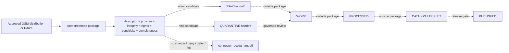

<!-- [KFM_META_BLOCK_V2]
doc_id: kfm://doc/connectors-openstreetmap-src-openstreetmap-readme
title: connectors/openstreetmap/src/openstreetmap/ — OpenStreetMap Connector Python Package Boundary
type: readme
version: v0.2
status: draft
owners: OWNER_TBD — Connector steward · Source steward · OpenStreetMap steward · Roads-Rail-Trade steward · Settlements-Infrastructure steward · Spatial Foundation steward · Rights reviewer · Sensitivity reviewer · Privacy reviewer · Security steward · Data steward · Migration steward · Validation steward · CI steward · Docs steward
created: 2026-06-20
updated: 2026-07-15
policy_label: public-doctrine; python-package; import-safe; read-only-upstream; no-network-by-default; descriptor-gated; provider-profile-gated; rights-gated; sensitivity-gated; privacy-minimized; raw-quarantine-receipts-only; no-publication
current_path: connectors/openstreetmap/src/openstreetmap/README.md
truth_posture: CONFIRMED target README and current package path, connectors responsibility root, OpenStreetMap parent and source-root boundaries, tests boundary, short-name osm alias lane, dedicated OpenStreetMap source-family standard, regional-extract product page, placeholder pyproject version 0.0.0, empty package initializer, bounded absence of client.py, config.py, descriptors.py, and test_import_safety.py, and official OSMF API, raster-tile, vector-tile, Nominatim, attribution, copyright, and planet surfaces checked 2026-07-15 / CONFLICTED canonical naming and compatibility topology across connectors/openstreetmap and connectors/osm / UNKNOWN any additional uninspected package files, import consumers, active SourceDescriptors, approved provider profiles, network configuration, parser behavior, fixtures, executable tests, CI enforcement depth, schedules, emitted receipts, deployment, and downstream release state / NEEDS VERIFICATION owners, alias-resolution ADR or migration note, source activation, provider and endpoint allowlists, current provider terms, rights and attribution decisions, source-role bindings, privacy minimization, parser contracts, fixture approval, schema bindings, correction propagation, deactivation, and rollback automation
evidence_snapshot:
  repository: bartytime4life/Kansas-Frontier-Matrix
  visibility: public
  base_ref: main
  base_commit: df4a37b0a6779827baa02e6cc99d9315154bb831
  prior_blob: 3d9df8a3278546472dc6572e9709c2d03c71676e
  related_repository_blobs:
    directory_rules: 2affb080e6f0043867c64c7f06c1ca52030fbd55
    connectors_root_readme: bdd50032bed62ac36964c79f16cf5541b21759a6
    parent_connector_readme: d1337c71e8bc6b0d421b5778179129406df6e2dc
    source_root_readme: 3f63e451557e925d9fed0df2bb9df66faa481627
    tests_readme: a05e3f8b03ad7332b90a92c1a2ce08f88e971b32
    osm_alias_readme: 514dd57ee42ed18aa1615ae63dd50dbe2e8e914a
    source_family_readme: 3c3974c3cde209724058e0e9cd8af1087084dfbd
    regional_extracts_page: 947d2e6f915f385df1b1f4e3fd029a4bc418568f
    pyproject: db4ce6f276f31672c86d83df2fabaf06107960b7
    package_init: e69de29bb2d1d6434b8b29ae775ad8c2e48c5391
  bounded_path_checks:
    - connectors/openstreetmap/src/openstreetmap/__init__.py exists and is empty
    - connectors/openstreetmap/src/openstreetmap/client.py was not found
    - connectors/openstreetmap/src/openstreetmap/config.py was not found
    - connectors/openstreetmap/src/openstreetmap/descriptors.py was not found
    - connectors/openstreetmap/tests/test_import_safety.py was not found
related:
  - ../../README.md
  - ../README.md
  - ../../tests/README.md
  - ../../../osm/README.md
  - ../../../../docs/doctrine/directory-rules.md
  - ../../../../docs/sources/catalog/openstreetmap/README.md
  - ../../../../docs/sources/catalog/openstreetmap/regional-extracts.md
  - ../../../../docs/sources/catalog/RIGHTS-AND-SENSITIVITY-MAP.md
  - ../../../../docs/sources/SOURCE_DESCRIPTOR_STANDARD.md
  - ../../../../docs/domains/roads-rail-trade/README.md
  - ../../../../docs/domains/roads-rail-trade/SOURCES.md
  - ../../../../docs/domains/roads-rail-trade/SOURCE_REGISTRY.md
  - ../../../../docs/domains/settlements-infrastructure/README.md
  - ../../../../docs/architecture/source-roles.md
  - ../../../../data/registry/sources/
  - ../../../../data/raw/
  - ../../../../data/quarantine/
  - ../../../../data/receipts/
  - ../../../../data/proofs/
  - ../../../../schemas/contracts/v1/source/
  - ../../../../policy/rights/
  - ../../../../policy/sensitivity/
  - ../../../../release/
tags: [kfm, connectors, openstreetmap, osm, python-package, import-safe, read-only, no-network, regional-extracts, planet, replication, overpass, nominatim, tiles, volunteered-geographic-information, odbl, attribution, privacy, source-admission, raw, quarantine, receipts, rollback, no-publication, governance]
notes:
  - "v0.2 applies the KFM GitHub Repository Documentation Implementation Agent v3.1 package and connector profile."
  - "Directory Rules v1.4 §7.3 assigns source-specific fetch and admission behavior to connectors/. This existing package path is responsibility-root compliant; path existence does not activate OpenStreetMap or approve a provider."
  - "Dedicated OpenStreetMap source-family and regional-extract documentation now exist and supersede the prior README claim that no source catalog page was found."
  - "The package is presently a documentation-rich placeholder: pyproject version 0.0.0, empty __init__.py, and no bounded evidence of client, configuration, descriptor, or import-safety test modules."
  - "connectors/osm/ is a README-only alias lane and must not become a duplicate implementation. Naming and migration remain governance decisions."
  - "OSMF core-service policies are service-specific and changeable. Every live access path must be represented by an approved provider profile rather than a generic OSM switch."
  - "The package is read-only with respect to upstream OSM. Editing, changeset creation, automated website-form submission, and other upstream mutation are denied."
  - "Package activity is source admission support only and is never source authority, legal advice, proof closure, release, routing authority, or publication authority."
[/KFM_META_BLOCK_V2] -->

<a id="top"></a>

# OpenStreetMap Connector Python Package Boundary

> Import-safe, read-only, provider-profile-gated package boundary for preserving approved OpenStreetMap source material and constructing governed RAW, QUARANTINE, or connector-receipt handoffs—without treating community-edited geography as official truth or turning community services into an unbounded backend.

<p>
  
  
  
  
  
  
  
  
</p>

`connectors/openstreetmap/src/openstreetmap/`

## Quick navigation

[Status](#status-and-evidence-boundary) · [Purpose](#purpose) · [Repository fit](#repository-fit-and-naming-topology) · [Current state](#confirmed-current-state) · [Authority](#authority-boundary) · [Import contract](#import-and-construction-contract) · [Provider profiles](#provider-and-distribution-profile-model) · [Configuration](#configuration-identification-and-secrets) · [Network](#network-and-resource-boundary) · [Completeness](#query-extract-and-completeness-contract) · [Parsing](#element-tag-relation-and-geometry-preservation) · [Time](#time-freshness-replication-and-staleness) · [Identity](#identity-hashing-deduplication-and-replay) · [Roles](#source-role-authority-and-anti-collapse) · [Rights](#rights-attribution-and-derivative-review) · [Privacy](#privacy-sensitivity-and-data-minimization) · [Lifecycle](#lifecycle-and-finite-package-outcomes) · [Receipts](#receipts-evidence-references-and-handoff-artifacts) · [Testing](#testing-and-no-network-fixtures) · [Resilience](#rate-limits-retries-timeouts-and-circuit-breaking) · [Drift](#service-policy-schema-and-provider-drift) · [Activation](#activation-and-promotion-gates) · [Rollback](#correction-deactivation-rollback-and-supersession) · [Directory map](#directory-map-and-smallest-sound-implementation) · [Done](#definition-of-done) · [Open](#verification-backlog) · [Evidence](#evidence-basis)

---

## Status and evidence boundary

> [!IMPORTANT]
> **Document lifecycle:** `draft`  
> **Component maturity:** documentation-rich placeholder; executable connector behavior not established  
> **Owner:** `OWNER_TBD`  
> **Path:** `connectors/openstreetmap/src/openstreetmap/`  
> **Responsibility root:** source-specific connector implementation under `connectors/`  
> **Package metadata:** `kfm-connector-openstreetmap`, version `0.0.0`  
> **Topology:** `CONFLICTED / NEEDS VERIFICATION` because `connectors/openstreetmap/` and the README-only `connectors/osm/` alias coexist  
> **Truth posture:** package path, README, placeholder metadata, empty initializer, source-family docs, regional-extract docs, test-boundary docs, and selected absent implementation paths are confirmed in this session. Active source descriptors, provider profiles, executable modules, import consumers, fixtures, tests, schedules, receipts, deployment, and release state remain `UNKNOWN` or `NEEDS VERIFICATION`.

This README defines a package boundary. It does not prove that OpenStreetMap is activated, that any upstream service may be queried, that a provider permits the intended use, that ODbL obligations are resolved, that a parser is correct, that a dataset is complete, or that any derivative is releasable.

### Truth labels used here

| Label | Meaning in this README |
|---|---|
| `CONFIRMED` | Verified in this session from repository content, bounded path checks, official OSMF material, or generated validation evidence. |
| `PROPOSED` | A design or implementation direction that is not established as current code. |
| `UNKNOWN` | Not proven by the evidence inspected in this session. |
| `NEEDS VERIFICATION` | Checkable, but not sufficiently resolved for implementation or release decisions. |
| `DENY` | Disallowed by this package boundary unless governing doctrine is explicitly changed through review. |

---

## Purpose

This package is the intended import namespace for OpenStreetMap connector implementation under the fuller `connectors/openstreetmap/` lane.

A mature implementation may provide pure or explicitly invoked helpers for:

- resolving an active source descriptor and approved provider profile;
- validating a regional extract, planet snapshot pointer, replication-diff pointer, approved read-only query response, or governed fixture;
- preserving provider, distribution, request, response, extract, sequence, and content metadata;
- parsing source-native OSM node, way, relation, tag, member, version, timestamp, bounds, and payload structures;
- preserving raw bytes or content-addressed pointers before interpretation;
- recording completeness, truncation, timeout, source-date, provider-lag, and schema-drift state;
- computing deterministic request, payload, metadata, fixture, and handoff digests;
- constructing finite RAW, QUARANTINE, no-op, denial, deferred, retryable-failure, or connector-receipt outcomes;
- minimizing contributor and request data before repository persistence;
- carrying rights, attribution, sensitivity, source-role, and review requirements without deciding them;
- supporting deterministic replay and no-network tests.

This package must not become:

- an OpenStreetMap editing client or automated upstream mutator;
- a generic wrapper around every OSM-related public service;
- a standard raster-tile scraper, offline tile downloader, cache warmer, or bulk-prefetch engine;
- an unrestricted public Nominatim client, autocomplete backend, bulk geocoder, or POI enumerator;
- a second implementation under the `connectors/osm/` alias lane;
- OpenStreetMap source-family or product doctrine;
- the canonical source registry, rights decision, sensitivity policy, schema authority, or contract authority;
- government, cadastral, ownership, legal-access, emergency-routing, current-operational, or completeness truth;
- a routing engine, geocoder of record, conflation authority, or domain normalization pipeline;
- a catalog, triplet, `EvidenceBundle`, proof-pack, release, correction, or publication authority;
- a direct public API, UI, MapLibre layer, tile service, search surface, dashboard, export, automation, or AI-answer source;
- a secret store or repository for private OSM sessions.

---

## Repository fit and naming topology

Directory Rules place source-specific fetch and admission code under `connectors/`. The existing package path is therefore responsibility-root compliant. The rules do not, by themselves, activate OSM or resolve the long-name versus short-name compatibility surface.

```text
connectors/
├── README.md
├── openstreetmap/
│   ├── README.md
│   ├── pyproject.toml
│   ├── src/
│   │   ├── README.md
│   │   └── openstreetmap/
│   │       ├── README.md          # this file
│   │       └── __init__.py        # confirmed empty
│   └── tests/
│       └── README.md
└── osm/
    └── README.md                  # short-name alias boundary; no parallel implementation
```

### Naming and compatibility determination

| Surface | Confirmed responsibility | Current constraint |
|---|---|---|
| [`connectors/README.md`](../../../README.md) | Repository-wide connector contract. | Allows source admission, not publication or downstream truth. |
| [`connectors/openstreetmap/`](../../) | Fuller OpenStreetMap connector lane. | Parent README is older than current source-family evidence and still contains stale placement/catalog statements. |
| [`connectors/openstreetmap/src/`](../) | Python source root. | Documentation boundary; executable depth is not established. |
| `connectors/openstreetmap/src/openstreetmap/` | Current import-package boundary. | Placeholder package with an empty initializer and no verified client stack. |
| [`connectors/openstreetmap/tests/`](../../tests/) | No-network connector-test boundary. | README exists; executable tests and fixtures were not established. |
| [`connectors/osm/`](../../../osm/) | Short-name alias/sibling lane. | Must remain README-only unless an ADR or migration chooses it. |
| [`docs/sources/catalog/openstreetmap/`](../../../../docs/sources/catalog/openstreetmap/) | OpenStreetMap source-family and product doctrine. | Documentation does not activate a connector or settle current provider terms. |
| [`data/registry/sources/`](../../../../data/registry/sources/) | Source identity and activation authority. | Active OSM descriptors remain `NEEDS VERIFICATION`. |

> [!WARNING]
> **Do not create duplicate implementations across `openstreetmap` and `osm`.** Before adding another package, import namespace, fixture tree, client, parser, or source descriptor, resolve the alias through an ADR or migration note with import compatibility, deprecation, rollback, and ownership.

No move, rename, delete, redirect, deprecation, or supersession is authorized by this README update.

---

## Confirmed current state

At base commit `df4a37b0a6779827baa02e6cc99d9315154bb831`:

| Item | Status | What the evidence proves | What it does not prove |
|---|---:|---|---|
| Package README | `CONFIRMED v0.1 before this revision` | The package boundary exists. | Working code, imports, tests, or activation. |
| `pyproject.toml` | `CONFIRMED placeholder` | Project name is `kfm-connector-openstreetmap`; version is `0.0.0`. | Build backend, dependencies, installability, entry points, or release readiness. |
| `openstreetmap/__init__.py` | `CONFIRMED empty` | The namespace marker exists and has no import-time behavior in that file. | Safety of uninspected future submodules or packaging behavior. |
| `openstreetmap/client.py` | `NOT FOUND in bounded check` | No client is established at that expected path. | No client exists anywhere else in the repository. |
| `openstreetmap/config.py` | `NOT FOUND in bounded check` | No package-local configuration module is established at that expected path. | No configuration exists elsewhere. |
| `openstreetmap/descriptors.py` | `NOT FOUND in bounded check` | No package-local descriptor adapter is established at that expected path. | No registry integration exists elsewhere. |
| `tests/test_import_safety.py` | `NOT FOUND in bounded check` | The expected import-safety test is not present at that path. | No tests exist under other names. |
| Dedicated source-family page | `CONFIRMED` | `docs/sources/catalog/openstreetmap/README.md` exists. | Current rights approval or source activation. |
| Regional-extract product page | `CONFIRMED draft` | A bulk-extract product posture is documented. | A selected provider, endpoint, cadence, or active descriptor. |
| `connectors/osm/README.md` | `CONFIRMED alias boundary` | A duplicate-name risk is documented. | A ratified migration or canonical alias mechanism. |
| Active OSM source descriptors | `NEEDS VERIFICATION` | Must be resolved from registry evidence. | README presence does not activate a source. |
| Executable package tests and fixtures | `UNKNOWN` | No complete inventory was proven. | CI behavior or parser correctness. |
| Live runs and receipts | `UNKNOWN` | No run, schedule, or emitted receipt evidence was inspected. | Current ingestion or freshness. |

---

## Authority boundary

```text
PACKAGE MAY RETURN:
  source-preserving parse result
  provider/extract/query manifest
  deterministic identity and digest material
  RAW admission candidate
  QUARANTINE admission candidate
  connector receipt candidate
  finite no-op / denial / deferred / retryable-failure result

PACKAGE MUST NOT OWN:
  OpenStreetMap source doctrine
  SourceDescriptor or activation authority
  provider approval or terms interpretation
  rights or sensitivity policy decisions
  upstream editing or changesets
  legal-access, ownership, zoning, cadastral, or road-status truth
  emergency-routing or current-operational truth
  conflation or domain normalization truth
  WORK / PROCESSED lifecycle promotion
  CATALOG / TRIPLET closure
  EvidenceBundle or proof closure
  release, correction, or rollback authority
  published maps, tiles, APIs, UIs, search, exports, or AI answers
```

A connector runner may persist an accepted package result only through repository-approved adapters and paths. The package itself should remain storage-agnostic and return explicit values rather than hide writes.

---

## Import and construction contract

Importing `openstreetmap` or any package submodule must be side-effect-free.

Required import behavior:

- no network or DNS calls;
- no OAuth, token, cookie, credential, secret-manager, environment-secret, or private-session reads;
- no automatic service discovery;
- no cache initialization that writes to disk;
- no filesystem, database, queue, object-store, registry, receipt, or lifecycle writes;
- no scheduler, watcher, background thread, telemetry exporter, or retry loop startup;
- no OpenStreetMap login, changeset, note, trace, or edit operation;
- no loading of full extracts or large fixtures;
- no publication, tile generation, routing graph construction, geocoding request, or public claim;
- deterministic and bounded object construction from explicit arguments.

Preferred construction pattern:

```python
profile = ProviderProfile.from_reviewed_config(config)
connector = OpenStreetMapConnector(profile=profile, transport=transport)
result = connector.ingest(request=request, descriptor=descriptor)
```

The actual symbols, module names, and contracts are `PROPOSED` until implemented and validated. The invariant is explicit dependency injection: provider profile, transport, descriptor, clock, limits, and output adapter must not be hidden globals.

---

## Provider and distribution profile model

“OpenStreetMap” is a source family, not one interchangeable endpoint. Every live or snapshot access path requires a product-specific, reviewed provider profile.

### Required profile classes

| Access class | Upstream posture | Package posture |
|---|---|---|
| Regional or thematic extract | Preferred bulk snapshot posture documented by KFM. | Validate provider, scope, source time, format, size, checksum, terms, and completeness before admission. |
| Planet snapshot or replication diff | OSMF bulk-distribution surface. | Stream and verify; preserve sequence, state, timestamps, and continuity; never load unbounded content implicitly. |
| Main OSM editing API | Core editing service, not a general read-only bulk API. | `DENY` as a routine ingest backend; any bounded read must be separately approved, identified, and policy-compliant. Upstream mutation remains denied. |
| Overpass-compatible endpoint | Read-only query ecosystem with provider-specific capacity and policy. | Treat each endpoint as a separate provider profile; bound query complexity, area, timeout, output size, and completeness. |
| Public Nominatim service | Limited public geocoding service with a dedicated policy. | Not a generic connector dependency. Require deliberate product approval, caching, identification, privacy review, and a replaceable endpoint. Autocomplete, systematic enumeration, and routine bulk use are denied. |
| Standard OSM raster or vector tile service | Rendered-map distribution, not canonical bulk source capture. | Excluded from connector ingestion. Do not scrape, prefetch, or build offline archives from community tile services. |
| Third-party OSM-derived provider | Independent service with its own terms, formats, SLAs, and update lag. | Preserve provider identity and terms separately from OSM data attribution; do not inherit OSMF service assumptions. |
| Governed fixture | Synthetic, minimized, redacted, or explicitly approved snapshot. | Default test input; never source authority or activation evidence. |

### Official OSMF service-policy snapshot

Official OSMF material was checked on **2026-07-15**:

- the core API policy states that the main API is the **editing API**, not the recommended backend for read-only projects or large/frequent downloads;
- large or frequent users are directed toward planet data, geographic extracts, or other providers;
- OSMF-run services require truthful application identification and may block harmful or non-compliant traffic;
- the OSMF raster and vector tile services are best-effort, require attribution and caching, and forbid bulk scraping/prefetch/offline archive construction;
- the public Nominatim service has a separate restrictive usage policy, requires application identification and attribution, and forbids autocomplete and systematic POI/address enumeration;
- OSMF policies may change and access can be withdrawn.

These are external, version-sensitive constraints—not package defaults. The accepted provider profile must pin the reviewed policy reference, access date, stricter local limits, and deactivation behavior.

---

## Configuration, identification, and secrets

The package must not invent configuration names or retrieve secrets implicitly.

A reviewed provider profile should define, as applicable:

- stable provider and distribution identifiers;
- base URL or content location allowlist;
- permitted methods and media types;
- approved application identification template;
- optional contact reference supplied by deployment configuration, never hard-coded personal data;
- authentication mode, if the selected third-party provider requires one;
- credential reference name, never the credential value;
- request, response, redirect, timeout, concurrency, retry, and payload limits;
- caching and conditional-request posture;
- query-language and complexity constraints;
- geographic and temporal scope;
- expected source cadence or snapshot semantics;
- rights, attribution, provider-terms, and sensitivity decision references;
- fixture-only versus live-enabled state;
- deactivation and fallback behavior.

> [!CAUTION]
> Public OSMF services generally rely on identification rather than an application API key, but third-party providers may require credentials. Do not generalize one provider’s authentication model across the source family.

Secrets and private sessions must remain in approved secret-management/runtime surfaces. They must never appear in fixtures, logs, receipts, digests, exception text, README examples, or committed configuration.

---

## Network and resource boundary

Network access is off by default and must be explicit, descriptor-gated, and provider-profile-gated.

### Request requirements

Every live request must:

- use an allowlisted HTTPS origin unless a reviewed exception exists;
- use a provider-approved method and path family;
- identify the application truthfully where required;
- avoid generic library-default or impersonated identification;
- apply bounded connect, read, total, and idle timeouts;
- enforce redirect count and redirect-host rules;
- enforce compressed and decompressed byte limits;
- stream large content instead of buffering it unboundedly;
- validate media type and, where available, length and checksum metadata;
- record sanitized request identity, response status, retrieval time, validators, and payload digest;
- classify policy denial, authentication failure, rate limit, timeout, truncation, schema drift, and service outage distinctly;
- avoid sending personal, confidential, or sensitive query material to public services;
- never mutate upstream OSM.

### Permanently denied upstream operations

This package must not:

- create or modify OSM elements;
- open, upload to, or close changesets;
- create automated notes, traces, diary entries, messages, or website-form submissions;
- automate account creation or login;
- impersonate another client;
- use the editing API as an unbounded read backend;
- bypass cache, rate, quota, or block controls;
- rotate identities to evade enforcement;
- scrape rendered tiles or build offline tile archives from restricted public services.

An upstream editing capability would require a separate purpose, authority analysis, security model, community-policy review, and ADR. It is outside this package boundary.

---

## Query, extract, and completeness contract

A successful HTTP response is not proof of complete source capture.

### Extract manifest requirements

For a file, snapshot, or replication stream, preserve when available:

- provider and distribution identity;
- canonical and resolved source URL;
- product or extract name;
- geographic scope and boundary version;
- declared source/snapshot time;
- retrieval start and completion time;
- format and compression;
- stated and observed byte size;
- checksum, signature, `ETag`, and `Last-Modified` metadata;
- replication sequence, state timestamp, and predecessor/successor relationship;
- provider update cadence and observed lag;
- license/attribution reference and provider terms reference;
- resume/range behavior;
- completeness and integrity decision;
- payload digest and manifest digest.

### Query manifest requirements

For a bounded query, preserve:

- provider profile and endpoint identity;
- normalized query text or content-addressed query reference;
- requested geographic and temporal bounds;
- output format and requested fields;
- declared timeout and resource limits;
- request digest;
- retrieval time and response status;
- response metadata and content digest;
- result count where meaningful;
- truncation, timeout, partial-result, remark, warning, or provider-error indicators;
- completeness classification;
- retry and pagination/continuation state;
- rights, sensitivity, and privacy review references.

### Completeness states

The package should return an explicit state compatible with the accepted contract, such as:

- complete for the declared distribution;
- complete for the bounded query as reported by the provider;
- partial;
- truncated;
- timed out;
- sequence gap;
- stale provider snapshot;
- unknown completeness;
- invalid or unverifiable.

These labels are semantic requirements, not a claim that a canonical enum already exists.

> [!WARNING]
> An empty result is not proof that no feature exists on the ground. It may reflect mapper coverage, query construction, provider lag, filtering, timeout, truncation, geometry errors, or data-model differences.

---

## Element, tag, relation, and geometry preservation

The package must preserve source-native meaning before downstream normalization.

### Element identity

Preserve, when provided and permitted:

- element type: node, way, or relation;
- numeric OSM element identifier;
- version;
- source timestamp;
- visibility/deletion state when represented by the distribution;
- changeset identifier only when required and approved;
- raw tags without silent semantic remapping;
- node references and their order for ways;
- relation member type, reference, role, and order;
- bounds or source geometry fields;
- provider and distribution identity;
- raw-record or payload digest.

Contributor display names, user identifiers, account metadata, and other living-person fields are **not admission defaults**. Preserve them only when a reviewed use case requires them and privacy policy allows it.

### Tag contract

Tag handling must:

- preserve original keys and values as source strings;
- preserve absent versus empty values where the source format distinguishes them;
- avoid converting tags directly into KFM domain objects;
- record any filtering, normalization, case conversion, decoding, or invalid-character handling;
- keep unknown tags unless a reviewed minimization rule removes them;
- preserve the raw payload digest so interpretations can be replayed;
- treat tag combinations as community assertions, not legal or operational determinations.

### Geometry contract

OSM element data and rendered/assembled geometry are not identical.

The package must distinguish:

- source-native node coordinates;
- way node-reference sequences;
- relation membership;
- geometry returned directly by a query service;
- geometry assembled locally from elements;
- polygon/multipolygon interpretation;
- topology repair;
- clipping;
- reprojection;
- simplification or generalization;
- centroid, envelope, or representative-point derivation.

Every geometry-producing transform requires an explicit transform record or receipt candidate containing algorithm/version, inputs, parameters, warnings, failures, output digest, and reversibility information. A connector-level parser should prefer preservation over repair.

---

## Time, freshness, replication, and staleness

Keep time kinds separate.

| Time kind | Meaning | Required handling |
|---|---|---|
| Element source time | Timestamp attached to the OSM element/version. | Preserve as source metadata; do not reinterpret as observed-on-the-ground time. |
| Snapshot or extract time | Provider’s declared data vintage. | Preserve separately from retrieval. |
| Replication state time | State associated with a replication sequence. | Preserve sequence and continuity evidence. |
| Retrieval time | When KFM obtained the payload. | Record from an injected clock. |
| Processing time | When a parser or transform ran. | Downstream receipt concern; do not overwrite source time. |
| Valid time | Period for a KFM claim. | Not inferred by the package from OSM timestamps. |
| Release/correction time | Governed publication lifecycle. | Outside package authority. |

Freshness must be product-specific. A current retrieval can contain an old snapshot; a recent element edit can still describe an outdated real-world condition; a replication sequence can be current while a third-party extract lags.

Required stale-state inputs include:

- expected provider cadence;
- declared source time;
- retrieval time;
- replication sequence and state time;
- predecessor continuity;
- provider update lag;
- local last-success and last-complete state;
- rights/policy profile version;
- parser/specification version.

Stale, delayed, sequence-gapped, or unknown-freshness material may be preserved in RAW or QUARANTINE with explicit state. It must not silently become “current” downstream.

---

## Identity, hashing, deduplication, and replay

Deterministic identity should be based on explicit source inputs, not local filenames alone.

### Suggested identity layers

| Layer | Identity inputs |
|---|---|
| Provider profile | Provider id + product/distribution id + reviewed profile version. |
| Request | Provider profile + method + normalized URL/path + normalized parameters/body + relevant representation headers. |
| Extract | Provider profile + canonical distribution identity + source/snapshot time + provider checksum or payload digest. |
| Replication item | Provider profile + sequence id + state timestamp + payload digest. |
| OSM element version | Provider profile + element type + element id + version + source timestamp where available. |
| Fixture | Fixture purpose + sanitized source metadata + fixture bytes digest + fixture-policy version. |
| Admission candidate | Descriptor ref + provider profile + request/extract identity + payload digest + parser version + policy refs. |

### Hashing requirements

- hash exact captured bytes before lossy parsing;
- hash canonical metadata using the repository’s accepted canonicalization contract;
- record algorithm identifiers;
- do not include secrets, cookies, authorization headers, personal contact values, or unstable local paths;
- distinguish compressed-byte and decompressed-content digests when both matter;
- preserve source checksums separately from KFM-computed digests;
- make deduplication decisions explainable and reversible.

### Replay requirements

A replay should be able to use captured bytes or an approved immutable pointer plus:

- provider profile version;
- descriptor reference;
- parser and dependency versions;
- query/extract manifest;
- configuration digest;
- clock/time assumptions;
- rights and sensitivity policy references;
- expected outcome and prior receipt reference.

Replay must not silently re-fetch a mutable live endpoint when captured evidence was expected.

---

## Source role, authority, and anti-collapse

OSM source role is assigned per admitted product and object family. It is not globally “authoritative,” “observed,” or “candidate.”

| Anti-collapse rule | Package requirement |
|---|---|
| OSM is not government authority. | Never upgrade a community-edited record into an official designation, regulation, cadastral fact, ownership record, or agency status. |
| An OSM import does not inherit upstream authority. | When an authoritative upstream source matters, ingest and cite that upstream source directly. |
| Feature presence is not legal access. | Do not infer permission, public access, road legality, navigability, or right-of-way from tags or geometry. |
| Feature presence is not current operation. | Do not infer that a bridge, road, facility, business, gate, trail, or service is open, safe, or operational. |
| Feature absence is not real-world absence. | Preserve coverage and completeness caveats. |
| Tags are not KFM domain objects. | Mapping to roads, places, infrastructure, hazards, or routing contracts occurs downstream with transform receipts. |
| Geometry is not surveyed precision. | Preserve source precision and do not invent positional accuracy. |
| Routeability is not route safety. | Graph construction and routing require downstream contracts, restrictions, validation, and policy. |
| A successful parser is not source activation. | Require active descriptor and provider profile. |
| A fixture is not evidence of current source state. | Fixtures prove code behavior only. |
| Connector admission is not publication. | Public clients use governed released interfaces, never this package directly. |

Conflict with official or higher-authority sources must be preserved as a conflict state. The package must not silently choose a winner.

---

## Rights, attribution, and derivative review

OpenStreetMap data is distributed under the Open Database License, and public use of OSM-derived produced works requires appropriate attribution. OSMF attribution guidance also distinguishes databases, interactive maps, geocoding, routing, machine learning, and other public-use contexts.

The package must not provide legal conclusions. It should preserve and emit review inputs:

- OSM data-source identity;
- provider identity and provider-specific terms;
- data-license reference and reviewed version/date;
- attribution text/reference candidate;
- ODbL notice/link candidate;
- derivative-database review requirement;
- produced-work review requirement;
- database versus rendered-work classification candidate;
- share-alike review state;
- third-party included-source notices when supplied;
- rights decision reference;
- denial or quarantine reason when unresolved.

> [!IMPORTANT]
> OSM data licensing, OSMF-hosted service policies, third-party provider terms, map-style licensing, and tile-service policies are separate surfaces. Do not collapse them into one “OSM license” flag.

Public release remains blocked until the owning rights and release processes approve the exact derivative and attribution placement. Internal package processing is not a waiver of later release obligations.

---

## Privacy, sensitivity, and data minimization

OSM payloads and service queries can expose more than geometry.

### Minimize by default

Do not persist unless required and approved:

- contributor display names or account identifiers;
- cookies, authorization headers, OAuth tokens, private session data, or account details;
- raw IP, referer, or request-identification values beyond a safe profile reference;
- free-text values containing personal information;
- private addresses or living-person associations unrelated to the governed purpose;
- query terms submitted by users;
- provider diagnostics containing internal or personal data.

### Sensitivity gates

Exact or highly precise locations may require quarantine, redaction, generalization, staged access, or denial for:

- archaeological and culturally sensitive sites;
- rare species or protected habitat;
- critical infrastructure;
- shelters, vulnerable populations, or security-sensitive facilities;
- private residences and living-person associations;
- tribal, sovereign, sacred, or restricted knowledge;
- operational hazards where stale community data could create risk.

The package may attach sensitivity candidates and minimization receipts. It must not make final public-release decisions.

Public geocoding or query services must not receive confidential, private, or sensitive search material. Use local/self-hosted or approved controlled alternatives where required.

---

## Lifecycle and finite package outcomes

The package sits at the source edge:



The package should use a finite outcome contract compatible with repository-wide connector semantics. Required semantic outcomes include:

| Outcome class | Meaning | Minimum evidence |
|---|---|---|
| Probe success | Provider/profile reachable or fixture readable; no admission implied. | Profile, time, sanitized response metadata, receipt digest. |
| No change | Approved validators or immutable identity show no new payload. | Prior identity, validator evidence, current time, no-op receipt. |
| Admission candidate | Payload passed package-level source-edge checks. | Descriptor ref, profile, manifest, payload digest, parser result, gate refs. |
| Quarantine candidate | Payload preserved but role, rights, sensitivity, completeness, schema, or integrity is unresolved. | Payload pointer/digest, reason code, review requirements. |
| Denied | Policy/profile forbids access or admission. | Decision ref and sanitized reason. |
| Deferred | Required descriptor, provider profile, policy, or dependency is unavailable. | Missing prerequisite and retry/review posture. |
| Rate limited | Provider requested slower access or quota was reached. | Status/headers where safe, retry posture, circuit state. |
| Retryable failure | Transient transport or provider failure within bounded policy. | Attempt count, category, timing, final receipt. |
| Permanent failure | Invalid request, unsupported format, integrity failure, or non-retryable denial. | Category, evidence pointer, quarantine/deny decision. |
| Drift detected | Schema, policy, provider, terms, or distribution behavior changed. | Old/new fingerprints and review work item. |

Names above are semantic requirements; bind them to accepted canonical enums rather than creating package-local authority.

The package must not directly advance lifecycle state. Promotion remains governed orchestration outside this namespace.

---

## Receipts, EvidenceRefs, and handoff artifacts

Every meaningful interaction should produce a connector receipt candidate or a caller-visible result sufficient to create one.

### Receipt fields

Preserve, when applicable:

- run/request id;
- connector and package version;
- source descriptor reference;
- provider-profile id and version;
- source/distribution identity;
- sanitized request or extract identity;
- source/snapshot/replication time;
- retrieval start/end time;
- response status and relevant validators;
- compressed and content digests;
- parser/spec version;
- element/result counts;
- completeness and freshness state;
- rights, attribution, sensitivity, and privacy-decision references;
- finite outcome and reason code;
- RAW or QUARANTINE candidate pointer;
- prior receipt or correction reference;
- warnings and review requirements.

### Evidence boundary

A connector receipt proves what this connector attempted, observed, preserved, denied, or handed off. It is not an `EvidenceBundle`, does not validate a downstream claim, and does not authorize publication.

Where downstream claims depend on OSM evidence, an `EvidenceRef` must resolve through governed proof construction to an `EvidenceBundle`. The package cannot manufacture that closure.

---

## Testing and no-network fixtures

Default tests must run without network, secrets, private sessions, external caches, or upstream side effects.

### Minimum fixture matrix

| Fixture class | Required cases |
|---|---|
| Package/import | Empty initializer, clean import, missing optional dependency, unsupported configuration. |
| Extract manifest | Valid snapshot, missing source time, checksum mismatch, size mismatch, stale extract, unknown provider. |
| Replication | Valid sequence, gap, duplicate sequence, out-of-order state, stale state, corrupt diff. |
| Query response | Valid bounded result, empty result, provider error, timeout, truncation, partial/remark response, unexpected media type. |
| Elements | Node, way, relation, nested relation, missing references, deleted/visibility state where represented, unknown fields. |
| Tags | Unicode, empty values, unknown keys, high-cardinality tags, sensitive/free-text values, lossless round trip. |
| Geometry | Node coordinates, way refs, relation members, assembled geometry marker, invalid topology, clipping/generalization metadata. |
| Rights | Missing attribution, unresolved ODbL review, third-party provider terms, tile/data-license non-collapse. |
| Privacy | Contributor metadata minimization, secret/header redaction, user-query redaction. |
| Sensitivity | Archaeology, critical infrastructure, private residence, exact-location quarantine/generalization. |
| Anti-collapse | Government authority, legal access, ownership, route safety, current operation, and completeness denials. |
| Outcomes | Admit, quarantine, deny, defer, no-op, rate limit, retryable failure, permanent failure, drift. |
| Replay | Stable digest and result from captured bytes and pinned config. |

### Fixture rules

Fixtures must be:

- synthetic, minimized, redacted, or explicitly approved;
- small enough for deterministic CI;
- accompanied by purpose, provenance, source-date, digest, rights, sensitivity, privacy, and expected-result metadata;
- stripped of credentials, cookies, private sessions, personal contact values, uncontrolled contributor data, and unnecessary exact locations;
- stored in the repository-approved fixture root, not invented inside this package without directory review.

### Negative tests

Tests must prove that the package cannot:

- make network calls during import;
- mutate upstream OSM;
- use an unapproved provider profile;
- treat the editing API as an unbounded read source;
- scrape or prefetch standard OSM tiles;
- use public Nominatim for autocomplete or systematic enumeration;
- bypass identification, caching, rate, timeout, or circuit controls;
- emit secrets or living-person metadata in logs/receipts;
- silently accept incomplete or stale material as complete/current;
- promote OSM to legal, ownership, government, routing-safety, or operational truth;
- write WORK, PROCESSED, CATALOG, TRIPLET, PROOFS, RELEASE, or PUBLISHED artifacts;
- create a public map, API response, UI state, or AI answer.

---

## Rate limits, retries, timeouts, and circuit breaking

Provider policy is a hard upper bound, not a target throughput.

Required behavior:

- local limits must be equal to or stricter than reviewed provider policy;
- concurrency must be explicit per provider profile;
- large distributions should use streaming and provider-recommended bulk surfaces;
- retries must be bounded, jittered where appropriate, and limited to idempotent read operations;
- honor `Retry-After` and provider-specific backoff signals when present;
- do not retry authentication, policy denial, invalid query, unsupported media type, checksum mismatch, or permanent schema rejection as transient failures;
- separate connect, read, total, idle, and processing timeouts;
- cap query area, complexity, result size, recursion, and relation expansion where applicable;
- open a circuit after repeated provider or policy failures;
- while a circuit is open, return a finite deferred/outage result rather than hiding the failure;
- do not rotate endpoints, proxies, or identities to evade limits;
- never interpret outage, rate limit, or empty result as proof of real-world absence.

Current OSMF policy snapshots include service-specific numeric constraints—for example, the editing API policy limits download threads and the public Nominatim policy states a strict public-service request ceiling. Those values must be access-dated and pinned in the relevant provider profile if those services are approved; they must not be copied into a generic family-wide configuration.

---

## Service-policy, schema, and provider drift

OSMF and third-party policies, formats, endpoints, and capacity can change.

A drift detector or watcher may compare:

- official policy page digest and review date;
- provider terms and attribution guidance digest;
- endpoint allowlist and TLS identity;
- media type and schema fingerprint;
- extract naming and directory layout;
- checksum/signature behavior;
- replication state format and cadence;
- error vocabulary and rate-limit headers;
- required identification behavior;
- deprecation or outage notices;
- source-family, descriptor, rights, or sensitivity decisions in KFM.

Watcher output is a proposed review signal only. It must not:

- edit package contracts automatically;
- enable a new endpoint or provider;
- change local limits silently;
- accept new fields as trusted semantics;
- modify rights or sensitivity decisions;
- publish, promote, or roll back data;
- treat upstream availability as real-world truth.

Material drift should move live access to deferred or quarantine posture until reviewed.

---

## Activation and promotion gates

Package presence is not activation.

Before live source access, require:

1. confirmed owner and reviewers;
2. accepted `openstreetmap` versus `osm` naming/migration posture;
3. active source descriptor for the exact product/use case;
4. reviewed provider profile and endpoint/distribution allowlist;
5. approved application-identification and optional credential-reference posture;
6. current service-policy and provider-terms review;
7. rights, attribution, derivative-database, and produced-work review references;
8. sensitivity and privacy-minimization decisions;
9. source-role and authority-scope decision per object family;
10. accepted request, manifest, parser, outcome, receipt, and handoff contracts;
11. deterministic no-network fixtures and passing negative tests;
12. bounded live probe, if allowed, with a retained receipt;
13. deactivation, correction, replay, and rollback procedures;
14. CI enforcement that proves imports are safe and outputs stay within connector handoff surfaces.

Before downstream promotion or publication, require the separate lifecycle, validation, catalog, proof, policy, review, release, correction, and rollback gates. This package cannot satisfy those gates by itself.

---

## Correction, deactivation, rollback, and supersession

Corrections must preserve history and provenance.

### Correction triggers

- upstream element version or deletion changes prior interpretation;
- extract or replication continuity was incomplete;
- wrong provider, snapshot, boundary, or query was used;
- parser bug altered tags, members, geometry, identity, or time fields;
- rights, attribution, provider terms, privacy, or sensitivity posture changed;
- a higher-authority source conflicts with an admitted OSM record;
- an OSM record was incorrectly presented as legal, official, current, complete, or route-safe;
- a fixture contained disallowed or sensitive data;
- a package or provider-profile version is compromised or invalidated.

### Required correction behavior

- stop affected live profiles when risk warrants;
- preserve original payload digest, receipts, and lineage;
- emit a correction/deactivation candidate through accepted contracts;
- identify affected RAW candidates and downstream dependencies;
- replay from captured evidence with the corrected parser/profile where permitted;
- quarantine unresolved outputs;
- do not rewrite or delete shared history as the normal correction mechanism;
- let downstream owners create correction notices, release supersession, and rollback decisions.

### Package rollback

A package rollback must identify:

- last known-good commit/package version;
- affected provider profiles and descriptors;
- import and dependency compatibility;
- receipt/parser/config versions to replay;
- migration or alias impacts;
- data candidates requiring invalidation or quarantine;
- validation proving network, rights, privacy, and lifecycle boundaries remain enforced after rollback.

A README-only revision can be reverted through a normal revert pull request. Do not rewrite shared history.

---

## Directory map and smallest sound implementation

### Confirmed surfaces

```text
connectors/openstreetmap/
├── README.md
├── pyproject.toml                    # confirmed 0.0.0 placeholder
├── src/
│   ├── README.md
│   └── openstreetmap/
│       ├── README.md                 # this boundary
│       └── __init__.py               # confirmed empty
└── tests/
    └── README.md

connectors/osm/
└── README.md                          # alias boundary; no duplicate code

docs/sources/catalog/openstreetmap/
├── README.md                          # source-family standard
└── regional-extracts.md               # bulk-extract product page
```

### Conditional implementation areas

New module paths are `PROPOSED` and must not be treated as repository facts. After naming, contract, and ownership review, the smallest coherent implementation would likely cover responsibilities such as:

- immutable provider-profile parsing;
- explicit transport abstraction;
- extract/query manifest validation;
- source-native element parsing;
- deterministic hashing;
- finite outcome construction;
- receipt-candidate construction;
- import-safety and no-network tests.

Before naming files:

- inspect the complete connector tree and current branch;
- inspect repository Python packaging conventions and shared connector contracts;
- inspect accepted schema and outcome homes;
- inspect `CODEOWNERS`, ADRs, migrations, workflows, and fixture conventions;
- verify that equivalent utilities do not already exist in shared packages;
- keep `connectors/osm/` free of parallel implementation;
- choose the smallest reversible slice.

This README authorizes no new path by itself.

---

## Definition of done

### Documentation boundary

- [x] Existing `doc_id` and `created` metadata are preserved.
- [x] Version and update date reflect a substantive revision.
- [x] Package status, evidence limits, authority, lifecycle handoffs, and import contract are explicit.
- [x] Directory Rules responsibility-root placement is reconciled without treating path presence as activation.
- [x] The `openstreetmap` versus `osm` alias conflict is surfaced.
- [x] Dedicated source-family and regional-extract docs replace the stale “not found” claim.
- [x] Current package placeholder evidence is recorded.
- [x] OSMF editing API, tile, Nominatim, attribution, and bulk-distribution surfaces are separated.
- [x] Upstream mutation, tile scraping, generic public geocoding, and duplicate alias implementation are denied.
- [x] Provider profiles, completeness, time, identity, parsing, rights, privacy, receipts, tests, resilience, drift, activation, correction, and rollback are documented.
- [x] Connector activity is explicitly denied publication and downstream truth authority.

### Executable package

- [ ] Owners are confirmed and `OWNER_TBD` is replaced through repository-approved evidence.
- [ ] The complete package and test trees are inventoried.
- [ ] An ADR or migration note resolves or constrains `openstreetmap` versus `osm` naming.
- [ ] Package metadata defines a reviewed build backend, Python constraints, dependencies, and import surface.
- [ ] Imports are proven side-effect-free by executable tests.
- [ ] Exactly one active implementation home exists.
- [ ] Active descriptors and reviewed provider profiles exist for each approved access class.
- [ ] No routine ingest uses the main editing API as a bulk read backend.
- [ ] Standard community tile services are excluded from connector ingestion and offline archive construction.
- [ ] Public Nominatim use, if any, is deliberate, replaceable, cached, privacy-reviewed, policy-compliant, and not autocomplete/systematic/bulk enumeration.
- [ ] Transport, limits, retries, timeouts, circuit breaking, and redaction are implemented.
- [ ] Extract/query completeness, source time, replication continuity, checksums, and provider lag are preserved.
- [ ] Parsers preserve source-native element, tag, relation, geometry, and raw-payload identity.
- [ ] Contributor and request personal data are minimized.
- [ ] Rights, attribution, provider terms, derivative review, source role, and sensitivity fail closed.
- [ ] Deterministic identities, digests, deduplication, and replay are implemented.
- [ ] RAW, QUARANTINE, and receipt candidates use accepted contracts and verified paths.
- [ ] No package code can write WORK, PROCESSED, CATALOG, TRIPLET, PROOFS, RELEASE, or PUBLISHED authority.
- [ ] Fixtures cover valid, malformed, stale, partial, sensitive, denied, rate-limited, drift, and anti-collapse cases.
- [ ] CI proves safety with negative tests, not TODO-only checks.
- [ ] Correction, deactivation, migration, replay, and rollback procedures are exercised.

---

## Verification backlog

| Verification item | Evidence that would settle it | Status |
|---|---|---:|
| Current owners and reviewers | `CODEOWNERS`, approved team registry, or maintainer assignment. | `NEEDS VERIFICATION` |
| Complete package tree | Recursive tree read at the implementation branch/ref. | `NEEDS VERIFICATION` |
| Complete tests and fixtures | Recursive test/fixture inventory and passing run. | `NEEDS VERIFICATION` |
| Canonical `openstreetmap` versus `osm` topology | Accepted ADR or migration note with compatibility and rollback. | `NEEDS VERIFICATION` |
| Active source descriptors | Canonical registry records and activation decisions. | `NEEDS VERIFICATION` |
| Approved regional extract provider | Descriptor/profile with provider terms, scope, cadence, checksums, and rights review. | `NEEDS VERIFICATION` |
| Planet/replication use | Reviewed profile, sequence contract, resource limits, and fixture-tested continuity. | `NEEDS VERIFICATION` |
| Overpass-compatible use | Approved endpoint profile, query limits, completeness semantics, and provider policy. | `NEEDS VERIFICATION` |
| Nominatim use | Deliberate product decision, policy review, replaceability, privacy review, and caching plan. | `NEEDS VERIFICATION` |
| Editing API use | Explicit denial or narrowly approved bounded-read profile; no upstream mutation. | `NEEDS VERIFICATION` |
| Tile-service posture | Tests/config proving standard tile services are not ingestion or offline-download backends. | `NEEDS VERIFICATION` |
| Rights and attribution | Current reviewed legal/policy decision for each derivative class. | `NEEDS VERIFICATION` |
| Privacy minimization | Accepted field policy and negative tests for contributor/request data. | `NEEDS VERIFICATION` |
| Source-role bindings | Accepted descriptor/contract values per product and object family. | `NEEDS VERIFICATION` |
| Parser contracts | Repository code, accepted schemas, fixtures, and round-trip tests. | `NEEDS VERIFICATION` |
| Outcome and receipt contracts | Accepted canonical contract/schema bindings. | `NEEDS VERIFICATION` |
| CI enforcement depth | Workflow code and failures proving network/import/lifecycle/rights boundaries. | `NEEDS VERIFICATION` |
| Emitted receipts and candidates | Current run artifacts with reachable provenance. | `NEEDS VERIFICATION` |
| Downstream dependency inventory | Catalog/proof/release lineage query or reviewed manifest. | `NEEDS VERIFICATION` |
| Correction and rollback exercise | Recorded drill with deactivation, replay, dependency impact, and restore validation. | `NEEDS VERIFICATION` |

---

## Evidence basis

| Evidence | Role | Status | Supports | Does not prove |
|---|---|---:|---|---|
| [`Directory Rules` v1.4 §7.3](../../../../docs/doctrine/directory-rules.md) | Placement doctrine | `CONFIRMED` repository document | Source-specific fetch/admission belongs under `connectors/`; lifecycle and no-publication boundary. | Source activation or exact module layout. |
| [`connectors/README.md`](../../../README.md) | Parent implementation-root contract | `CONFIRMED v0.3` | Connector handoffs, exclusions, finite outcomes, and fail-closed posture. | Child implementation completeness. |
| [`connectors/openstreetmap/README.md`](../../README.md) | Parent connector boundary | `CONFIRMED v0.1` | OSM anti-collapse, rights, sensitivity, and RAW/QUARANTINE boundary. | Current catalog inventory or corrected placement interpretation. |
| [`connectors/openstreetmap/src/README.md`](../README.md) | Source-root boundary | `CONFIRMED v0.1` | Import-safe/no-network source-root intent. | Executable modules. |
| [`connectors/openstreetmap/tests/README.md`](../../tests/README.md) | Test boundary | `CONFIRMED v0.1` | No-network and fixture governance expectations. | Actual tests, fixtures, or passing CI. |
| [`connectors/osm/README.md`](../../../osm/README.md) | Alias boundary | `CONFIRMED v0.1` | Short-name lane is not intended as a parallel implementation. | Ratified canonical naming. |
| [`docs/sources/catalog/openstreetmap/README.md`](../../../../docs/sources/catalog/openstreetmap/README.md) | Source-family standard | `CONFIRMED v1.1` | Dedicated OSM doctrine, per-object source-role decision, rights/sensitivity posture. | Active descriptor or current legal decision. |
| [`regional-extracts.md`](../../../../docs/sources/catalog/openstreetmap/regional-extracts.md) | Product page | `CONFIRMED draft v0.2` | Bulk snapshot extracts are the proposed canonical RAW capture posture; live query services are separate. | Provider selection, endpoint, cadence, or activation. |
| `connectors/openstreetmap/pyproject.toml` | Package metadata | `CONFIRMED` | Name and `0.0.0` placeholder version. | Installability or dependencies. |
| `connectors/openstreetmap/src/openstreetmap/__init__.py` | Package marker | `CONFIRMED empty` | No behavior in the initializer. | Other package behavior. |
| Bounded absent-path checks | Implementation evidence | `CONFIRMED for exact paths` | No `client.py`, `config.py`, `descriptors.py`, or `test_import_safety.py` at inspected paths. | Complete absence of equivalent behavior elsewhere. |
| [OSMF API Usage Policy](https://operations.osmfoundation.org/policies/api/) | Official service policy | `CONFIRMED` checked 2026-07-15 | Editing API purpose, identification, bounded downloads, bulk alternatives, mutability/policy risk. | KFM approval to use it. |
| [OSMF Tile Usage Policy](https://operations.osmfoundation.org/policies/tiles/) | Official service policy | `CONFIRMED` checked 2026-07-15 | Attribution, identification, caching, no scraping/prefetch/offline use, best-effort service. | Rights to use third-party tile providers. |
| [OSMF Vector Tile Usage Policy](https://operations.osmfoundation.org/policies/vector/) | Official service policy | `CONFIRMED` checked 2026-07-15 | Attribution, identification, caching, no bulk/offline downloading, best-effort and versioned service. | Rights to use third-party vector-tile providers. |
| [OSMF Nominatim Usage Policy](https://operations.osmfoundation.org/policies/nominatim/) | Official service policy | `CONFIRMED` checked 2026-07-15 | Limited public geocoding posture, identification, caching, no autocomplete/systematic enumeration. | Approval for KFM usage. |
| [OSMF Attribution Guidelines](https://osmfoundation.org/wiki/Licence/Attribution_Guidelines) | Official attribution guidance | `CONFIRMED` checked 2026-07-15 | Public attribution and context-specific safe-harbour guidance. | Legal advice or a KFM rights decision. |
| [OpenStreetMap copyright and licence page](https://www.openstreetmap.org/copyright) | Official source/licence surface | `CONFIRMED` checked 2026-07-15 | OSM data source and licence reference. | Derivative-specific release approval. |
| [Planet OSM](https://planet.openstreetmap.org/) | Official bulk-distribution surface | `CONFIRMED` checked 2026-07-15 | Bulk snapshot and replication distribution surface. | KFM provider selection or successful ingest. |

---

## Status summary

`connectors/openstreetmap/src/openstreetmap/` is a governed Python package boundary for read-only, provider-profile-gated OpenStreetMap source preservation and source-admission candidate construction.

It is currently a placeholder, not an operational connector. It is not the canonical source registry, OpenStreetMap doctrine, legal advice, government authority, ownership or access truth, current operational truth, completeness proof, routing authority, geocoding service, tile downloader, upstream editor, policy authority, schema authority, catalog/triplet closure, EvidenceBundle closure, release authority, public map/API/UI/search surface, or AI truth source.

**Package and connector activity is not publication authority.**

<p align="right"><a href="#top">Back to top</a></p>
