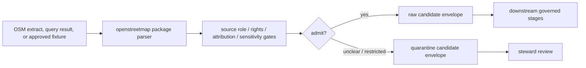

<!-- [KFM_META_BLOCK_V2]
doc_id: kfm://doc/connectors-openstreetmap-src-openstreetmap-readme
title: connectors/openstreetmap/src/openstreetmap/ — OpenStreetMap Connector Python Package Boundary
type: readme
version: v0.1
status: draft
owners: OWNER_TBD — Connector steward · Source steward · OpenStreetMap steward · Roads-Rail-Trade steward · Settlements-Infrastructure steward · Spatial Foundation steward · Rights steward · Data steward · Validation steward · Docs steward
created: 2026-06-20
updated: 2026-06-20
policy_label: public-doctrine; import-safe; no-network-default; source-admission-only
related:
  - ../../README.md
  - ../../tests/README.md
  - ../../../../docs/doctrine/directory-rules.md
  - ../../../../docs/domains/roads-rail-trade/README.md
  - ../../../../docs/domains/roads-rail-trade/SOURCES.md
  - ../../../../docs/domains/roads-rail-trade/SOURCE_REGISTRY.md
  - ../../../../docs/domains/settlements-infrastructure/README.md
  - ../../../../docs/sources/catalog/README.md
  - ../../../../docs/sources/catalog/RIGHTS-AND-SENSITIVITY-MAP.md
  - ../../../../docs/sources/catalog/OPEN-QUESTIONS.md
  - ../../../../docs/architecture/source-roles.md
  - ../../../../data/registry/sources/
  - ../../../../data/raw/
  - ../../../../data/quarantine/
  - ../../../../data/receipts/
  - ../../../../data/proofs/
  - ../../../../policy/rights/
  - ../../../../policy/sensitivity/
  - ../../../../release/
tags: [kfm, connectors, openstreetmap, osm, python-package, import-safe, no-network-default, volunteered-geographic-information, attribution, odbl, source-admission, raw, quarantine, governance]
notes:
  - "Importable Python package boundary for OpenStreetMap connector implementation code under connectors/openstreetmap/src/."
  - "This README documents the package boundary only; actual modules, imports, package metadata, tests, fixtures, and CI wiring remain NEEDS VERIFICATION until inspected."
  - "Package import must be side-effect-free: no live network calls, no secret reads, no lifecycle writes, no publication, no public claims, and no upstream edits."
  - "Code in this package may prepare OpenStreetMap source material for raw or quarantine admission envelopes only."
  - "OpenStreetMap source-family/product doctrine remains NEEDS VERIFICATION because no dedicated docs/sources/catalog/openstreetmap page was found during parent connector documentation."
  - "Rights, attribution, ODbL/share-alike, provider terms, source-role, freshness, completeness, and sensitivity gates must fail closed."
[/KFM_META_BLOCK_V2] -->

<a id="top"></a>

# OpenStreetMap Connector Python Package

> Importable package boundary for OpenStreetMap connector implementation code under `connectors/openstreetmap/src/openstreetmap/`.

<p>
  
  
  
  
  
  
</p>

`connectors/openstreetmap/src/openstreetmap/`

## Scope

`connectors/openstreetmap/src/openstreetmap/` is the proposed importable Python package boundary for OpenStreetMap connector code.

This package may contain implementation support for source-admission helpers, provider/extract manifest builders, bounded request helpers, query builders, OSM element parsers, tag-preservation helpers, geometry metadata helpers, version/source-date helpers, rights/attribution helpers, service-use guards, sensitivity guard helpers, digest helpers, finite connector errors, and raw/quarantine admission-envelope builders.

It must not become OpenStreetMap source-family doctrine, domain truth, government authority, legal-access truth, ownership truth, routing truth, operational-status truth, completeness proof, rights policy authority, sensitivity policy authority, schema authority, catalog/triplet authority, proof authority, release authority, public API behavior, public UI behavior, or publication authority.

> [!IMPORTANT]
> **Status:** draft / `NEEDS VERIFICATION`  
> **Owner:** `OWNER_TBD`  
> **Path:** `connectors/openstreetmap/src/openstreetmap/`  
> **Truth posture:** the path exists in the repository as this README; actual package files, imports, module names, dependency wiring, request clients, fixtures, tests, package metadata, and CI behavior remain `NEEDS VERIFICATION`.

---

## Repo fit

```text
connectors/
└── openstreetmap/
    ├── README.md
    ├── src/
    │   └── openstreetmap/
    │       └── README.md
    └── tests/
        └── README.md
```

Related responsibility roots:

```text
connectors/openstreetmap/                 # draft OpenStreetMap connector lane
connectors/openstreetmap/src/openstreetmap/ # importable package boundary
connectors/openstreetmap/tests/           # connector test lane
docs/domains/roads-rail-trade/            # roads, trails, routing-context, rail/trade adjacency
docs/domains/settlements-infrastructure/  # places, amenities, facilities, infrastructure context
docs/sources/catalog/                     # source-family/product doctrine; OSM page currently NEEDS VERIFICATION
data/registry/sources/                    # source descriptors and activation state
data/raw/                                 # raw staged source outputs by owning domain
data/quarantine/                          # held material requiring source/role/rights/sensitivity review
data/receipts/                            # ingest, checksum, query, transform, and review receipts
data/proofs/                              # EvidenceBundles and proof packs
policy/rights/                            # ODbL, attribution, share-alike, and source-use review
policy/sensitivity/                       # exact-location and release rules
release/                                  # release decisions, manifests, rollback, correction state
```

---

## Import contract

Importing this package or any submodule should be safe by default.

Required import behavior:

- no network calls at import time;
- no credential, token, cookie, or private session reads at import time;
- no source-side edits or upstream side effects;
- no filesystem writes at import time;
- no lifecycle writes to raw, quarantine, work, processed, catalog, triplet, published, receipt, proof, release, API, UI, or tile stores at import time;
- no routing output, access claims, ownership claims, public map artifacts, release artifacts, or public claims at import time;
- live source access only through explicit, reviewed function calls with descriptor gating;
- deterministic parser behavior for the same supplied payload and configuration.

---

## Expected module areas

Actual modules are **NEEDS VERIFICATION**. A future package layout may include:

```text
openstreetmap/
├── __init__.py
├── config.py
├── client.py
├── descriptors.py
├── extracts.py
├── queries.py
├── elements.py
├── tags.py
├── geometry.py
├── freshness.py
├── rights.py
├── sensitivity.py
├── digest.py
├── envelope.py
└── errors.py
```

| Module area | Responsibility |
|---|---|
| `config.py` | No-network defaults, live-access opt-in flags, timeout policy, and provider/extract feature flags. |
| `client.py` | Bounded non-mutating request helpers; no hidden live access. |
| `descriptors.py` | SourceDescriptor reference checks and activation gating; not descriptor authority. |
| `extracts.py` | Provider/extract manifests, source date, geographic scope, file identity, and digest support. |
| `queries.py` | Query text, endpoint, parameters, timeout, response status, retrieval time, and digest support. |
| `elements.py` | OSM element type/id/version/timestamp/relation handling. |
| `tags.py` | Native tag preservation without silent conversion into KFM domain truth. |
| `geometry.py` | Geometry type, bounds, CRS assumptions, topology warnings, and generalization status. |
| `freshness.py` | Source date, retrieval date, replication or sequence metadata, and stale-state helpers. |
| `rights.py` | Attribution, ODbL/share-alike, provider terms, and release-review helpers. |
| `sensitivity.py` | Exact-location and sensitive-domain review gates. |
| `digest.py` | Query, extract, response, fixture, and envelope digest helpers. |
| `envelope.py` | Raw/quarantine source-admission envelope construction. |
| `errors.py` | Finite connector errors safe for logs and review. |

---

## Lifecycle handoff



This package should return handoff envelopes or finite errors. It should not write lifecycle stores directly unless a connector runner owns the write and records receipts.

---

## Anti-collapse rules

| Rule | Package implication |
|---|---|
| Import is not activation. | Importing this package must not prove source activation or source availability. |
| OSM is not government authority. | Package code must not elevate OSM records into official truth. |
| OSM feature presence is not legal access. | Package code must preserve source features without asserting permissions. |
| OSM absence is not absence on the ground. | Package code must preserve completeness caveats. |
| OSM tags are not KFM objects. | Package code must preserve native tags until downstream contracts map them. |
| ODbL review is load-bearing. | Package code must flag rights/attribution review before release. |
| Policy and release are external. | The package may flag review needs but must not decide public release. |

---

## Validation

Before relying on this package, verify actual module files, import paths, dependency configuration, no-network import behavior, descriptor gates, rights and attribution gates, service-use guards, element parsers, fixture approval, digest stability, raw/quarantine-only envelope creation, and CI wiring.

---

## Definition of done

- [ ] Owners are confirmed and `OWNER_TBD` is replaced.
- [ ] Actual package files and module names are inventoried.
- [ ] Importing package modules performs no network, secret, cache, upstream-side-effect, publication, or unsafe filesystem side effects.
- [ ] Source descriptors and activation decisions are required before live access.
- [ ] Rights, attribution, ODbL/share-alike, provider terms, source-role, freshness, completeness, and sensitivity gates fail closed.
- [ ] Parsers preserve source/extract/query metadata, element type/id/version, tags, geometry, relation context, source date, retrieval time, source URL, and digest.
- [ ] Output is limited to raw or quarantine admission envelopes.
- [ ] Tests cover no-network defaults, malformed inputs, stale extracts, role collapse, missing rights review, schema drift, and public-release misuse paths.
- [ ] CI behavior is verified or marked `NEEDS VERIFICATION`.

---

## Status summary

`connectors/openstreetmap/src/openstreetmap/` is for importable OpenStreetMap connector source-admission code only. It is not source-family doctrine, government authority, domain truth, access truth, ownership truth, routing authority, completeness proof, policy authority, schema authority, catalog/triplet authority, proof closure, release authority, public map authority, public API behavior, public UI behavior, or pipeline authority.

<p align="right"><a href="#top">Back to top</a></p>
