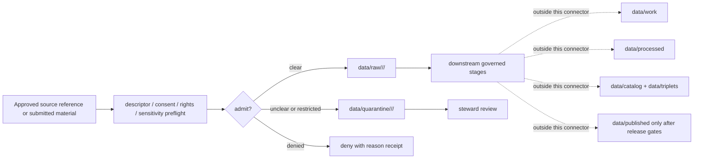

<!-- [KFM_META_BLOCK_V2]
doc_id: kfm://doc/connectors-people-dna-land-readme
title: connectors/people-dna-land/ — People / DNA / Land Connector Lane
type: readme
version: v0.1
status: draft
owners: OWNER_TBD — Connector steward · Source steward · People-DNA-Land steward · Rights steward · Consent steward · Sensitivity reviewer · Release steward · Data steward · Validation steward · Docs steward
created: 2026-06-20
updated: 2026-06-20
policy_label: restricted; highest-sensitivity; deny-by-default; consent-required; source-admission-only
related:
  - ../README.md
  - ../../docs/doctrine/directory-rules.md
  - ../../docs/domains/people-dna-land/README.md
  - ../../docs/domains/people-dna-land/SOURCE_FAMILIES.md
  - ../../docs/domains/people-dna-land/SOURCE_REGISTRY.md
  - ../../docs/domains/people-dna-land/DATA_LIFECYCLE.md
  - ../../docs/domains/people-dna-land/API_CONTRACTS.md
  - ../../docs/sources/catalog/ftdna/README.md
  - ../../docs/sources/catalog/ahgp/README.md
  - ../../data/registry/sources/
  - ../../data/raw/
  - ../../data/quarantine/
  - ../../data/receipts/
  - ../../data/proofs/
  - ../../policy/rights/
  - ../../policy/sensitivity/
  - ../../policy/consent/
  - ../../release/
tags: [kfm, connectors, people-dna-land, people, genealogy, dna, land, consent, rights, sensitivity, restricted, deny-by-default, raw, quarantine, source-admission, governance]
notes:
  - "Draft connector lane for People / DNA / Land source intake and admission helpers."
  - "Placement is draft / ADR-class: people-dna-land slug and connector placement are unsettled; Directory Rules §7.3 does not list this connector as a canonical root unless later ratified."
  - "This domain carries KFM's highest publication-sensitivity posture. Living-person fields, raw genetic material, and private person-land joins default to denied/restricted handling."
  - "Consent constrains access and rendering; it does not itself publish data. Release requires separate governed promotion, review, release manifest, and rollback/correction path."
  - "Connector output may enter quarantine by default and raw only when descriptor, consent, rights, sensitivity, and provenance gates are satisfied."
  - "This README defines a connector/source-admission boundary, not source-family truth, person truth, relationship truth, title truth, legal determination, consent authority, policy authority, schema authority, catalog/triplet authority, proof authority, release authority, public API behavior, or public UI behavior."
[/KFM_META_BLOCK_V2] -->

<a id="top"></a>

# People / DNA / Land Connector

> Draft source-admission boundary for People / DNA / Land source material. This lane is restricted, consent-aware, and deny-by-default.

<p>
  
  
  
  
  
  
  
</p>

`connectors/people-dna-land/`

## Quick jumps

[Scope](#scope) · [Repo fit](#repo-fit) · [Admission model](#admission-model) · [Lifecycle sketch](#lifecycle-sketch) · [Authority boundary](#authority-boundary) · [Inputs](#inputs) · [Exclusions](#exclusions) · [Admission posture](#admission-posture) · [Anti-collapse posture](#anti-collapse-posture) · [Validation](#validation) · [Definition of done](#definition-of-done)

---

## Scope

`connectors/people-dna-land/` is a draft connector lane for source intake and admission helpers for the People / DNA / Land domain.

This folder may contain connector-local documentation, source-admission helpers, source-reference manifest builders, consent/rights/sensitivity preflight helpers, provenance/digest helpers, no-network fixture pointers, and quarantine/raw handoff adapters for approved source material.

It must not become person truth, relationship truth, genetic truth, title truth, legal determination, consent authority, rights policy authority, sensitivity policy authority, schema authority, catalog/triplet authority, proof authority, release authority, public API behavior, public UI behavior, or publication authority.

> [!IMPORTANT]
> **Status:** draft / `NEEDS VERIFICATION`  
> **Owner:** `OWNER_TBD`  
> **Path:** `connectors/people-dna-land/`  
> **Truth posture:** the path exists in the repository as this README; actual connector code, source descriptors, consent sidecars, rights terms, sensitivity policy, tests, fixtures, parser behavior, CI wiring, and release behavior remain `NEEDS VERIFICATION`.

---

## Repo fit

```text
connectors/
└── people-dna-land/
    └── README.md
```

Related responsibility roots:

```text
connectors/people-dna-land/               # this draft connector lane
docs/domains/people-dna-land/             # domain doctrine and human-facing control surfaces
docs/sources/catalog/ftdna/               # example DNA-vendor source family doc
docs/sources/catalog/ahgp/                # example genealogy/heritage source family doc
data/registry/sources/                    # source descriptors and activation state
data/raw/                                 # raw staged source outputs only after gates clear
data/quarantine/                          # default holding area for unresolved/restricted material
data/receipts/                            # source, consent, rights, review, and transform receipts
data/proofs/                              # EvidenceBundles and proof packs
policy/rights/                            # rights and source-use review
policy/sensitivity/                       # sensitivity review and release constraints
policy/consent/                           # consent constraints and render gates
release/                                  # release decisions, manifests, rollback, correction state
```

> [!WARNING]
> `connectors/people-dna-land/` is a draft/open connector placement. The domain slug and related schema/policy homes are documented as unsettled in the domain registry. Do not activate this connector until placement, source descriptors, consent policy, rights policy, sensitivity policy, fixtures, and validation gates are accepted.

---

## Admission model

People / DNA / Land source material must be admitted source-role-first and policy-first.

| Concern | Required connector posture |
|---|---|
| Source identity | Preserve source family, source descriptor reference, source URL/reference, source date, rights posture, citation posture, and digest. |
| Source role | Preserve admission role; do not upgrade candidate, modeled, administrative, observed, regulatory, or aggregate material by promotion. |
| Consent | Require explicit consent metadata where the source family or record type requires it; missing consent routes to denial/quarantine. |
| Rights | Require rights and terms review before any raw admission or downstream use. |
| Sensitivity | Default to quarantine/deny for living-person, restricted genetic, and private person-land join classes. |
| Provenance | Preserve source vintage, collector/uploader context where approved, transform history, receipt linkage, and review state. |
| Publication | No connector output is public. Publication is a separate governed transition outside this folder. |

---

## Lifecycle sketch



> [!CAUTION]
> Connector code admits or rejects source material. It does not decide identity, kinship, title, consent sufficiency, public release, or legal meaning. Promotion remains a governed state transition, not a file move.

---

## Authority boundary

```text
DEFAULT OUTPUT:
  data/quarantine/<domain>/<source_id>/<run_id>/

CONDITIONAL OUTPUT ONLY AFTER GATES CLEAR:
  data/raw/<domain>/<source_id>/<run_id>/

NOT HERE:
  person truth
  relationship truth
  genetic truth
  title truth
  legal determination
  consent authority
  rights or sensitivity policy
  processed person/land/DNA records
  catalog records
  triplet records
  public map artifacts
  receipts/proofs as authority
  release decisions
  public API behavior
  public UI behavior
```

---

## Inputs

| Accepted item | Required posture |
|---|---|
| Source-reference manifest | Preserve source family, source descriptor reference, rights posture, sensitivity posture, source date, retrieval/import date, and digest. |
| Consent sidecar reference | Preserve consent scope, allowed use, revocation posture, expiration where applicable, and render-gate linkage. |
| Genealogy/tree import helper | Preserve modeled/candidate status, source owner/uploader context where approved, living-person flags, rights posture, and digest. |
| DNA-source reference helper | Preserve consent scope, vendor/source family reference, export/version metadata where approved, internal-only identifiers, and quarantine posture. |
| Land-instrument helper | Preserve instrument type, recording date, source office/reference, role basis, title-weight caveats, and digest. |
| Assessor/tax helper | Preserve administrative role, roll year, source reference, and explicit denial of title-truth collapse. |
| Geometry helper | Preserve source geometry vintage, derivation status, and explicit denial of title-boundary collapse. |
| Test references | Point to owning fixture/test roots; fixtures do not become source authority. |

---

## Exclusions

| Do not store here | Correct home |
|---|---|
| People / DNA / Land doctrine | `docs/domains/people-dna-land/` |
| Authoritative SourceDescriptor records | `data/registry/sources/` |
| Consent policy and render gates | `policy/consent/` |
| Rights or sensitivity rules | `policy/rights/`, `policy/sensitivity/` |
| Processed person, relationship, land, or DNA-derived records | `data/processed/` |
| Catalog or triplet records | `data/catalog/`, `data/triplets/` |
| Public artifacts | `data/published/` after governed release |
| Receipts and proof packs as authority | `data/receipts/`, `data/proofs/` |
| Schemas or semantic contracts | `schemas/`, `contracts/` |
| Public API or UI behavior | `apps/governed-api/`, `apps/explorer-web/` |

---

## Admission posture

People / DNA / Land intake should preserve source identity, source descriptor reference, consent reference when required, rights posture, sensitivity posture, source role, role basis, source date, import date, source URL/reference, citation fields, internal identifier handling, digest, review state, quarantine reason, and release-blocking flags.

---

## Anti-collapse posture

| Rule | Connector implication |
|---|---|
| Source role is fixed at admission. | Do not upgrade source role during fetch, staging, or promotion. |
| Consent is not publication. | Consent may constrain access, but release still requires governed review. |
| DNA hypothesis is not identity proof. | Relationship hypotheses remain modeled unless separately evidenced and reviewed. |
| Tree overlay is not authority. | GEDCOM/tree records remain modeled/candidate until promoted by evidence. |
| Assessor/tax record is not title. | Preserve administrative role and title-truth denial. |
| Geometry is not title boundary. | Preserve geometry-vintage and derivation caveats. |
| Sensitive joins fail closed. | Unclear joins route to quarantine or denial. |
| Public display is downstream. | The connector must not build public API/UI/map/release payloads. |

---

## Validation

Before relying on this connector, verify:

- placement is ratified or recorded in the drift/open-question register;
- source descriptors exist and validate;
- consent, rights, and sensitivity gates are implemented and fail closed;
- source-role mappings are enforced;
- tests use safe no-network fixtures;
- outputs are limited to quarantine by default and raw only after gates clear;
- downstream receipts, proofs, catalog/triplet records, public artifacts, and release records are produced only outside this connector;
- any public result has release approval, redaction/generalization where required, rollback path, and correction path.

---

## Definition of done

- [ ] Owners are confirmed and `OWNER_TBD` is replaced.
- [ ] Connector placement and lane slug are resolved by ADR, migration note, or Directory Rules update, or recorded as open drift.
- [ ] Actual connector contents are inventoried.
- [ ] SourceDescriptor IDs, source roles, rights, consent, sensitivity, and activation state are verified.
- [ ] Tests prevent role collapse, consent bypass, rights bypass, sensitivity bypass, title-truth collapse, relationship-truth collapse, and public-release misuse.
- [ ] Outputs are verified to enter quarantine by default and raw only after gates clear.
- [ ] No source-family, domain, processed, catalog, triplet, published, release, schema, policy, proof, receipt, registry, fixture, API, UI, or public-claim authority lives here.
- [ ] Tests, fixtures, and CI behavior are verified or marked `NEEDS VERIFICATION`.

---

## Status summary

`connectors/people-dna-land/` is for restricted People / DNA / Land source-admission code only. It is not person truth, relationship truth, genetic truth, title truth, legal determination, consent authority, policy authority, schema authority, catalog/triplet authority, proof closure, release authority, public map authority, public API behavior, public UI behavior, or pipeline authority.

<p align="right"><a href="#top">Back to top</a></p>
