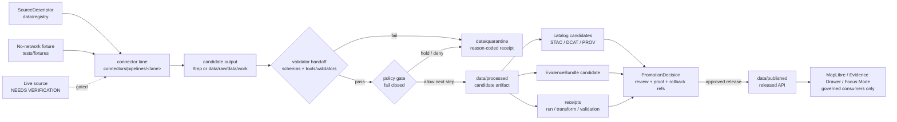

<!-- [KFM_META_BLOCK_V2]
doc_id: kfm://doc/NEEDS-VERIFICATION-connectors-pipelines-readme
title: Connectors Pipelines
type: standard
version: v1
status: draft
owners: NEEDS_VERIFICATION
created: 2026-04-29
updated: 2026-04-29
policy_label: NEEDS_VERIFICATION
related: [../../data/registry/README.md, ../../data/README.md, ../../schemas/README.md, ../../policy/README.md, ../../tools/validators/README.md, ../../tests/README.md, ../../docs/runbooks/README.md]
tags: [kfm, connectors, pipelines, ingestion, watchers, receipts]
notes: [doc_id owners policy_label and related links require mounted-repo verification; README-like directory doc for connectors/pipelines; ecology lane references are CI-fragment grounded but file presence still needs verification]
[/KFM_META_BLOCK_V2] -->

<a id="top"></a>

# Connectors Pipelines

Connector-local pipeline lanes for source-facing ingestion, fixture dry-runs, normalization, validation handoff, and receipt-bearing candidate generation.

> [!NOTE]
> **Status:** active  
> **Owners:** `NEEDS_VERIFICATION`  
> **Path:** `connectors/pipelines/README.md`  
> **Current posture:** `CONFIRMED` directory target from this documentation task · `INFERRED` repo fit from KFM doctrine · `NEEDS VERIFICATION` actual branch contents and owners  
>
> 
> 
> 
> 
> 
>
> **Quick jumps:** [Scope](#scope) · [Repo fit](#repo-fit) · [Inputs](#inputs) · [Exclusions](#exclusions) · [Directory tree](#directory-tree) · [Quickstart](#quickstart) · [Usage](#usage) · [Diagram](#diagram) · [Tables](#tables) · [Definition of done](#definition-of-done) · [FAQ](#faq) · [Appendix](#appendix)

---

## Scope

`connectors/pipelines/` is the connector-owned execution band for KFM lanes that touch source-facing ingestion or fixture-mode source simulation.

This directory should stay **close to source mechanics** but **subordinate to KFM governance**:

- source discovery and fetch preparation;
- no-network fixture ingestion;
- source-specific normalization into candidate artifacts;
- deterministic hash and manifest preparation;
- handoff to shared validators, policy, catalog, receipts, and promotion gates;
- lane-local README/runbook notes when they prevent operator confusion.

This directory is **not** a public truth surface. A connector may prepare a candidate; it may not make that candidate authoritative, public, or policy-safe by itself.

> [!IMPORTANT]
> KFM’s connector rule is simple: **source admission is not publication**. Unknown rights, unknown sensitivity, incomplete validation, missing receipts, or unresolved review state must route to hold, quarantine, denial, or abstention rather than quiet publication.

[Back to top](#top)

---

## Repo fit

### Path role

| Item | Value |
|---|---|
| Target path | `connectors/pipelines/README.md` |
| Parent surface | `connectors/` |
| Role | Source-facing connector pipeline index |
| Trust boundary | Between admitted source/fixture inputs and governed lifecycle outputs |
| Current implementation proof | `NEEDS VERIFICATION` in the mounted repo |
| Known lane signal | `connectors/pipelines/ecology/**` is referenced by an Ecology Timeslice CI fragment; actual file presence must be verified on the branch |

### Upstream surfaces

These are the governing surfaces this directory should read from, not replace.

| Surface | Expected path | Why it matters | Status |
|---|---:|---|---|
| Source descriptors | [`../../data/registry/README.md`](../../data/registry/README.md) | Source identity, cadence, rights, sensitivity, and role | `NEEDS VERIFICATION` |
| Data lifecycle | [`../../data/README.md`](../../data/README.md) | RAW / WORK / QUARANTINE / PROCESSED / CATALOG / PUBLISHED boundaries | `NEEDS VERIFICATION` |
| Contracts and schemas | [`../../schemas/README.md`](../../schemas/README.md) | Machine-checkable object shape and fixture expectations | `NEEDS VERIFICATION` |
| Policy | [`../../policy/README.md`](../../policy/README.md) | Fail-closed allow / hold / deny / abstain logic | `NEEDS VERIFICATION` |
| Runbooks | [`../../docs/runbooks/README.md`](../../docs/runbooks/README.md) | Operator flow, rollback, correction, and source refresh procedure | `NEEDS VERIFICATION` |

### Downstream surfaces

| Surface | Expected path | Connector responsibility | Status |
|---|---:|---|---|
| Validators | [`../../tools/validators/README.md`](../../tools/validators/README.md) | Hand off candidate artifacts for schema, source-role, rights, sensitivity, geo, temporal, and release checks | `NEEDS VERIFICATION` |
| Tests and fixtures | [`../../tests/README.md`](../../tests/README.md) | Exercise no-network fixture lanes first | `NEEDS VERIFICATION` |
| Receipts and proof objects | `../../data/receipts/`, `../../data/proofs/` | Emit or reference process memory and proof-bearing artifacts through governed paths | `NEEDS VERIFICATION` |
| Catalog closure | `../../data/catalog/` | Produce STAC/DCAT/PROV/internal catalog candidates after validation | `NEEDS VERIFICATION` |
| Public API / UI | app-specific governed API and shell paths | Consume only released public-safe artifacts and EvidenceBundle-backed responses | `NEEDS VERIFICATION` |

[Back to top](#top)

---

## Inputs

Material belongs in `connectors/pipelines/` when it is **source-facing**, **lane-local**, **execution-near**, and **not canonical governance law**.

| Accepted input | Example | Required posture |
|---|---|---|
| Source-facing ingest script | `connectors/pipelines/ecology/hls_landsat_ingest.py` | Must read from source descriptors or controlled fixtures |
| No-network fixture ingest | `--scene-manifest tests/fixtures/<lane>/.../scene_manifest.json` | Must be runnable without secrets or live network |
| Lane-local adapter | `connectors/pipelines/<lane>/adapters/<source>.py` | Must preserve source IDs, source role, citation text, and retrieval metadata |
| Normalization helper | `connectors/pipelines/<lane>/normalize/*.py` | Must preserve source values before canonical transformation |
| Watcher/diff helper | `connectors/pipelines/<lane>/watch/*.py` | Must emit deterministic identifiers and receipts; must not publish |
| Lane README or local operator note | `connectors/pipelines/<lane>/README.md` | Must link shared law instead of re-stating it loosely |

### Minimum connector input envelope

Every serious connector lane should know the following before it touches live source material:

| Field | Required? | Notes |
|---|---:|---|
| `source_descriptor_ref` | Yes | Points to the source registry entry |
| `source_role` | Yes | Observation, authoritative layer, regulatory overlay, model output, archive, steward-reviewed source, etc. |
| `rights_status` | Yes | Unknown rights block public release |
| `sensitivity_status` | Yes | Unknown sensitivity blocks public release |
| `retrieved_at` / `as_of` | Yes | Preserve temporal meaning |
| `valid_time` | When applicable | Required for time-aware claims |
| `source_ids` | Yes | Preserve upstream identity |
| `spec_hash` or candidate hash | Yes | Deterministic identity anchor |
| `citation_text` or citation ref | Yes | Needed for EvidenceBundle and cite-or-abstain behavior |

[Back to top](#top)

---

## Exclusions

The easiest way to weaken this directory is to let connector code become a second governance system.

| Keep out of `connectors/pipelines/` | Put it here instead | Why |
|---|---|---|
| Canonical source descriptors | `data/registry/` | Source identity and rights must be centrally inspectable |
| Shared JSON Schemas / contract law | `schemas/` or `contracts/` | Avoid lane-local schema drift |
| Rego / policy bundles | `policy/` | Keep admissibility and release logic centralized |
| Shared validators | `tools/validators/` | Reuse validation rules across lanes |
| Test fixtures and golden objects | `tests/fixtures/` | Keep CI fixtures discoverable |
| Generated raw/work/quarantine data | `data/raw/`, `data/work/`, `data/quarantine/` | Generated lifecycle artifacts are not source code |
| Processed/catalog/published artifacts | `data/processed/`, `data/catalog/`, `data/published/` | Publication state must remain governed |
| Runtime API routes | app/API surface | Connectors do not serve public clients |
| UI layer manifests or Evidence Drawer payloads | UI/app contract surfaces | Renderer state is downstream of trust |
| Secrets, tokens, local credentials | Never commit; use approved secret handling | Receipts and logs must not leak secrets |

> [!TIP]
> Link first, duplicate last. A connector README should point to shared contracts, registry, policy, and validators instead of inventing lane-local versions of them.

[Back to top](#top)

---

## Directory tree

### Current evidence-grounded reading

The branch contents are `NEEDS VERIFICATION` because the current documentation session did not expose a mounted KFM checkout. A visible CI fragment references an ecology connector lane, so this README treats ecology as a **referenced lane**, not as a fully verified directory inventory.

```text
connectors/
└── pipelines/
    ├── README.md
    └── ecology/                         # referenced by Ecology Timeslice CI; verify in checkout
        └── hls_landsat_ingest.py        # referenced script; file presence NEEDS VERIFICATION
```

### Recommended lane shape

```text
connectors/pipelines/<lane>/
├── README.md                            # lane-local purpose, inputs, outputs, gates
├── adapters/                            # source-specific access wrappers
├── normalize/                           # source-to-candidate transformations
├── watch/                               # polling, fingerprinting, diff planning
└── <source>_ingest.py                   # small CLI entrypoint when repo conventions allow
```

Generated outputs should go to `/tmp` during CI fixture runs or to governed lifecycle paths under `data/` when the run is explicitly permitted.

[Back to top](#top)

---

## Quickstart

### 1. Inspect the connector surface

```bash
find connectors/pipelines -maxdepth 4 -type f | sort
```

### 2. Verify adjacent law before changing a connector

```bash
sed -n '1,220p' data/registry/README.md
sed -n '1,220p' data/README.md
sed -n '1,220p' schemas/README.md
sed -n '1,220p' policy/README.md
sed -n '1,220p' tools/validators/README.md
sed -n '1,220p' tests/README.md
```

### 3. Run the ecology fixture ingest path if present

The following command is grounded in the Ecology Timeslice CI fragment. Run it only after verifying that the referenced script and fixture exist on the current branch.

```bash
mkdir -p /tmp/kfm-ecology-ingest

python connectors/pipelines/ecology/hls_landsat_ingest.py \
  --scene-manifest tests/fixtures/ecology/timeslice/pass/scene_manifest.json \
  --out-dir /tmp/kfm-ecology-ingest

python -m json.tool /tmp/kfm-ecology-ingest/ingest_manifest.json > /dev/null
python -m json.tool /tmp/kfm-ecology-ingest/qa_summary.json > /dev/null
python -m json.tool /tmp/kfm-ecology-ingest/tileset_metadata.json > /dev/null
```

### 4. Hand off to validators and policy

```bash
python tools/validators/ecology/validate_timeslice.py \
  --qa-summary /tmp/kfm-ecology-ingest/qa_summary.json \
  --tileset-metadata /tmp/kfm-ecology-ingest/tileset_metadata.json \
  --out /tmp/ecology_timeslice_qa_decision.json

opa parse policy/ecology/publication.rego
```

> [!WARNING]
> Do not treat successful fixture ingest as publication approval. Promotion still requires source-role checks, rights/sensitivity checks, catalog closure, proof objects, policy decision, review state, and rollback/correction readiness.

[Back to top](#top)

---

## Usage

### Connector lifecycle posture

A connector lane should follow this staged path:

1. **Discover** source identity from registry or fixture metadata.
2. **Fetch or simulate** source input without leaking secrets.
3. **Write candidate artifacts** to `/tmp`, `data/raw/`, or `data/work/` according to the run mode.
4. **Normalize** source data while preserving source IDs, time, CRS, units, QC flags, citation, and role.
5. **Emit receipts** for fetch, transform, validation, and policy steps where applicable.
6. **Validate** with shared schemas and validators.
7. **Route failure** to `data/quarantine/` or a reason-coded denial/hold path.
8. **Prepare catalog/proof candidates** only after validation and policy checks.
9. **Defer publication** to governed promotion, review, release, and rollback surfaces.

### Runtime outcomes

Connector-local scripts should use finite outcomes instead of ambiguous success prose.

| Outcome | Meaning |
|---|---|
| `PASS` | Candidate is valid for the next governed step, not necessarily publishable |
| `HOLD` | Candidate needs review or missing non-fatal evidence |
| `DENY` | Candidate fails an admissibility rule |
| `ERROR` | Tooling, I/O, schema, or environment failure prevented trustworthy evaluation |

For user-facing AI or Focus Mode envelopes, keep the runtime outcome vocabulary separate if the repo uses `ANSWER`, `ABSTAIN`, `DENY`, and `ERROR`.

[Back to top](#top)

---

## Diagram



This diagram is intentionally narrow. `connectors/pipelines/` prepares candidates; it does not own the full truth path.

[Back to top](#top)

---

## Tables

### Connector lane maturity labels

| Label | Use it when |
|---|---|
| `CONFIRMED` | The file, command, schema, test, or workflow was inspected in the mounted repo |
| `INFERRED` | The role follows from project doctrine or adjacent evidence but was not directly verified |
| `PROPOSED` | The item is recommended design or future work |
| `NEEDS VERIFICATION` | The claim depends on branch contents, current source terms, live endpoint behavior, owner review, or platform state |
| `UNKNOWN` | No reliable evidence is available in the current session |

### Proof-bearing expectations for serious connector lanes

| Object / artifact | Why it matters | Connector responsibility |
|---|---|---|
| `SourceDescriptor` | Defines source role, rights, cadence, sensitivity, and citation | Read and preserve; do not redefine locally |
| `RunReceipt` | Records execution context, inputs, outputs, hashes, and tool identity | Emit or hand off enough fields to generate |
| `ValidationReport` | Shows candidate passed or failed explicit checks | Produce validator inputs and preserve outputs |
| `PolicyDecision` | Records allow / hold / deny logic | Never bypass |
| `PromotionDecision` | Separates publication decision from file movement | Connector may reference candidate; promotion happens elsewhere |
| `EvidenceBundle` | Resolves claims to artifacts, provenance, review, and policy state | Provide evidence-bearing artifact refs |
| `ReleaseManifest` / `ProofPack` | Publication closure and proof surface | Downstream only; connector must not fake release state |
| `CorrectionNotice` / rollback refs | Preserve reversible change and public lineage | Include enough identity to support rollback |

### Placement matrix

| Material | Best home | Keep here? |
|---|---|---:|
| Source-specific fetch wrapper | `connectors/pipelines/<lane>/adapters/` | Yes |
| Lane-local normalization code | `connectors/pipelines/<lane>/normalize/` | Yes |
| Source descriptor | `data/registry/` | No |
| Shared schema | `schemas/` or `contracts/` | No |
| Shared validator | `tools/validators/` | No |
| Policy rule | `policy/` | No |
| Golden fixture | `tests/fixtures/` | No |
| Generated receipt | `data/receipts/` | No |
| Generated catalog object | `data/catalog/` | No |
| Published artifact | `data/published/` | No |
| Operator runbook | `docs/runbooks/` or lane README if very local | Sometimes |

[Back to top](#top)

---

## Definition of done

A connector-lane change is ready for review only when these gates are satisfied or explicitly marked `NEEDS VERIFICATION` with a reason.

- [ ] The lane README names its scope, accepted inputs, outputs, exclusions, and current truth posture.
- [ ] The source has a `SourceDescriptor` or a documented fixture-only status.
- [ ] Rights, sensitivity, source role, cadence, citation, and steward fields are present or fail closed.
- [ ] No secret, token, credential, or sensitive exact location is written to logs, receipts, or committed artifacts.
- [ ] No public payload references RAW, WORK, QUARANTINE, internal graph, direct model runtime, or unpublished candidate stores.
- [ ] Candidate artifacts include stable IDs, source IDs, temporal fields, hashes, and source-role metadata.
- [ ] No-network fixture tests pass before live source activation.
- [ ] Schema validation passes against repo-approved schema homes.
- [ ] Policy evaluation returns a finite outcome.
- [ ] Failure paths produce reason-coded hold, denial, error, or quarantine artifacts.
- [ ] Receipts are emitted or enough execution context is captured to generate receipts downstream.
- [ ] Catalog/proof closure is not claimed until STAC/DCAT/PROV/internal catalog requirements are satisfied.
- [ ] Promotion remains a governed decision, not a connector file move.
- [ ] Rollback or correction identity is available through `spec_hash`, release candidate ID, or equivalent stable reference.
- [ ] Documentation links to adjacent registry, schema, policy, validator, test, and runbook surfaces.

[Back to top](#top)

---

## FAQ

### Can a connector publish data?

No. A connector can prepare candidates and emit receipts. Publication requires governed promotion, proof objects, policy decision, review state, release manifest, and rollback/correction readiness.

### Can live source calls run in CI?

Default posture is **no-network fixture first**. Live source calls require source terms, cadence, quota, credentials, rights, sensitivity, and stewardship review before activation.

### Where should generated artifacts go?

Use `/tmp` for fixture CI output. Use governed `data/` lifecycle paths only when the run mode is approved. Do not write generated artifacts back into connector source directories.

### What if this repo also has a root `pipelines/` directory?

Treat root `pipelines/` as a related execution surface and verify branch conventions before moving files. This README governs only `connectors/pipelines/`.

### What if a connector discovers sensitive or rights-conflicted material?

Fail closed. Preserve allowed receipts and review artifacts, route material to quarantine or restriction, and do not expose exact locations or public payloads until policy and review permit it.

[Back to top](#top)

---

## Appendix

<details>
<summary><strong>Starter lane README outline</strong></summary>

```md
# <Lane> connector pipeline

One-line purpose.

## Scope

## Repo fit

## Accepted inputs

## Exclusions

## Source descriptors

## Fixture mode

## Live source mode

## Outputs

## Validation and policy gates

## Receipts and evidence refs

## Failure, quarantine, correction, and rollback

## Related schemas, policy, validators, fixtures, and runbooks

## Current truth posture
```

</details>

<details>
<summary><strong>Starter connector CLI contract</strong></summary>

```text
Required CLI behavior:

- accepts fixture inputs before live source inputs
- writes outputs to caller-provided --out-dir
- preserves source IDs and citation metadata
- emits JSON parseable manifests
- returns non-zero on ERROR or DENY
- never publishes
- never logs secrets
- never writes public artifacts directly
```

</details>

<details>
<summary><strong>Review prompts for maintainers</strong></summary>

- Does this connector preserve source identity, source role, time, CRS, units, and citation?
- Does it distinguish observation, model, regulatory overlay, archive, and authoritative layer?
- Does it emit or enable receipts?
- Does it fail closed on unknown rights or sensitivity?
- Does it avoid public paths for raw, work, quarantine, and candidate artifacts?
- Does it hand off to shared validators and policy instead of embedding private release logic?
- Does the lane remain reversible through stable hashes and rollback references?

</details>

[Back to top](#top)
