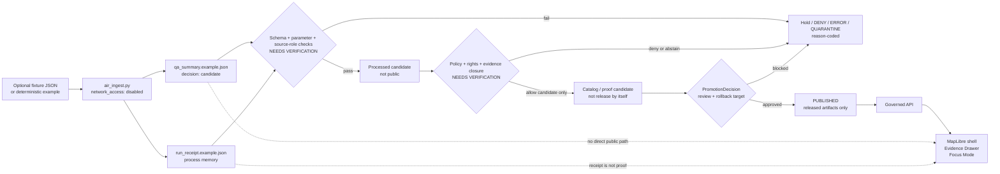

<!-- [KFM_META_BLOCK_V2]
doc_id: kfm://doc/NEEDS-VERIFICATION-connectors-pipelines-air-readme
title: Air Pipeline Connector
type: standard
version: v1
status: draft
owners: NEEDS_VERIFICATION
created: NEEDS_VERIFICATION-YYYY-MM-DD
updated: 2026-05-01
policy_label: NEEDS_VERIFICATION-public-or-restricted
related: [../README.md, ../../README.md, ../../../docs/domains/atmosphere_air/README.md, ../../../docs/domains/atmosphere_air/ARCHITECTURE.md, ../../../docs/domains/atmosphere_air/DATA_LIFECYCLE.md, ../../../docs/domains/atmosphere_air/API_CONTRACTS.md, ../../../docs/domains/atmosphere_air/PARAMETER_REGISTRY.md, ../../../docs/domains/atmosphere_air/SECURITY_AND_RIGHTS.md, ../../../data/processed/air/qa_summary.example.json, ../../../data/receipts/air/run_receipt.example.json]
tags: [kfm, connectors, pipelines, air, atmosphere-air, no-network, receipts, evidence, fail-closed]
notes: [Target file was confirmed present but empty before this revision; owners, created date, policy label, CODEOWNERS routing, CI wiring, and live-source authority require verification; air_ingest.py and example processed/receipt artifacts were confirmed in repo-visible evidence.]
[/KFM_META_BLOCK_V2] -->

<a id="top"></a>

# Air Pipeline Connector

No-network atmosphere/air connector lane for producing reviewable QA-summary candidates and run receipts without treating connector output as public truth.

<div align="center">


</div>

> [!NOTE]
> **Status:** `experimental`  
> **Owners:** `NEEDS_VERIFICATION`  
> **Path:** `connectors/pipelines/air/README.md`  
> **Repo fit:** child connector lane under [`../README.md`](../README.md), aligned to the source-facing boundary in [`../../README.md`](../../README.md).  
> **Implementation snapshot:** `air_ingest.py`, `data/processed/air/qa_summary.example.json`, and `data/receipts/air/run_receipt.example.json` are repo-visible. This README does **not** claim live source activation, public release, CI enforcement, or complete proof closure.

**Quick jumps:** [Scope](#scope) · [Repo fit](#repo-fit) · [Inputs](#accepted-inputs) · [Exclusions](#exclusions) · [Directory tree](#directory-tree) · [Quickstart](#quickstart) · [Flow](#flow) · [Gates](#validation--policy-gates) · [Air guardrails](#air-guardrails) · [Definition of done](#definition-of-done) · [Open verification](#open-verification)

---

## Scope

`connectors/pipelines/air/` is the connector-local lane for a **small, deterministic, no-network atmosphere/air ingest slice**.

The confirmed script in this lane writes:

| Artifact | Path | Role |
|---|---|---|
| QA summary candidate | [`../../../data/processed/air/qa_summary.example.json`](../../../data/processed/air/qa_summary.example.json) | Processed example candidate with `decision: candidate`, PM2.5 aggregation metadata, basic metrics, and evidence/receipt refs. |
| Run receipt | [`../../../data/receipts/air/run_receipt.example.json`](../../../data/receipts/air/run_receipt.example.json) | Process memory for the no-network run, including pipeline path, outputs, status, and `network_access: disabled`. |

This connector lane may prepare an air-quality candidate. It does **not** decide that the candidate is:

- canonical truth;
- public-safe;
- promoted;
- release-ready;
- valid for live operations;
- backed by complete EvidenceBundle closure; or
- suitable for MapLibre, Evidence Drawer, Focus Mode, export, or public API use.

> [!IMPORTANT]
> Connector success is not publication. A completed `air_ingest.py` run produces candidate artifacts and a receipt, not an authorized public air-quality layer or claim.

<p align="right"><a href="#top">Back to top ↑</a></p>

---

## Repo fit

### Local path role

| Item | Value |
|---|---|
| Target path | `connectors/pipelines/air/README.md` |
| Parent connector index | [`../README.md`](../README.md) |
| Parent connectors boundary | [`../../README.md`](../../README.md) |
| Domain doctrine | [`../../../docs/domains/atmosphere_air/README.md`](../../../docs/domains/atmosphere_air/README.md) |
| Primary script | [`air_ingest.py`](air_ingest.py) |
| Current posture | `CONFIRMED` no-network example script and example artifacts; `NEEDS_VERIFICATION` owners, CI, tests, source descriptors, policy wiring, and complete proof closure |

### Upstream surfaces

This lane should read from or align with these upstream governance surfaces. It must not redefine them locally.

| Surface | Path | Use |
|---|---|---|
| Connector pipeline rules | [`../README.md`](../README.md) | Explains connector-local pipeline scope, fixture-first behavior, and source-admission boundaries. |
| Connector edge rules | [`../../README.md`](../../README.md) | Explains descriptor-first source admission, connector gate posture, and no direct public path. |
| Atmosphere/air domain | [`../../../docs/domains/atmosphere_air/README.md`](../../../docs/domains/atmosphere_air/README.md) | Defines lane scope, knowledge characters, accepted inputs, exclusions, and domain trust posture. |
| Atmosphere architecture | [`../../../docs/domains/atmosphere_air/ARCHITECTURE.md`](../../../docs/domains/atmosphere_air/ARCHITECTURE.md) | Defines source-role, knowledge-character, release-only public delivery, and promotion boundaries. |
| Data lifecycle | [`../../../docs/domains/atmosphere_air/DATA_LIFECYCLE.md`](../../../docs/domains/atmosphere_air/DATA_LIFECYCLE.md) | Defines RAW, WORK, QUARANTINE, PROCESSED, CATALOG, PROOF, and PUBLISHED handling. |
| Parameter registry | [`../../../docs/domains/atmosphere_air/PARAMETER_REGISTRY.md`](../../../docs/domains/atmosphere_air/PARAMETER_REGISTRY.md) | Defines parameter/unit discipline and guards against AQI/concentration drift. |
| Security and rights | [`../../../docs/domains/atmosphere_air/SECURITY_AND_RIGHTS.md`](../../../docs/domains/atmosphere_air/SECURITY_AND_RIGHTS.md) | Blocks public release on unknown rights and forbids secrets in docs or public artifacts. |
| API contracts | [`../../../docs/domains/atmosphere_air/API_CONTRACTS.md`](../../../docs/domains/atmosphere_air/API_CONTRACTS.md) | Requires finite outcomes, source roles, knowledge characters, freshness, and EvidenceRefs in governed payloads. |

### Downstream surfaces

| Surface | Path | Connector responsibility |
|---|---|---|
| Processed candidate | [`../../../data/processed/air/qa_summary.example.json`](../../../data/processed/air/qa_summary.example.json) | Emit a parseable, deterministic candidate summary. |
| Receipt | [`../../../data/receipts/air/run_receipt.example.json`](../../../data/receipts/air/run_receipt.example.json) | Preserve process memory without turning it into release proof. |
| Public ops fixtures | `../../../tests/fixtures/air/public_ops/` | Exercise allow/deny/retraction-style public-operation candidates after test inventory is verified. |
| Public read-model fixtures | `../../../tests/fixtures/air/public_read_model/` | Exercise read-model publication constraints after test inventory is verified. |
| Catalog/proof/release | `../../../data/catalog/`, `../../../data/proofs/`, `../../../data/published/` | Downstream only; connector code must not silently write release state. |
| Governed API / UI | app-specific governed API and shell paths | Consume only released, EvidenceBundle-backed, policy-safe payloads. |

<p align="right"><a href="#top">Back to top ↑</a></p>

---

## Accepted inputs

Material belongs in this connector lane only when it is small, source-facing, reproducible, and safe to inspect.

| Input | Accepted? | Required handling |
|---|---:|---|
| No-network deterministic example | Yes | Default mode of `air_ingest.py`; must not imply real-world public truth. |
| Optional QA summary fixture JSON | Yes | Passed with `--fixture`; must be parseable JSON and treated as candidate material. |
| PM2.5 aggregation candidate | Yes | Preserve parameter, unit, averaging window, time window, and candidate status. |
| Run receipt fields | Yes | Must keep `network_access`, `pipeline`, `outputs`, `run_id`, `schema_version`, and `status` visible. |
| Source descriptors | Required before live-source expansion | Must carry source role, knowledge character, rights, cadence, and verification state. |
| Parameter registry values | Required before expanding parameters | Must preserve raw unit set, normalized unit, conversion rule, caveats, and allowed knowledge characters. |
| Live AirNow/AQS/OpenAQ/PurpleAir/model/smoke inputs | Not yet in this connector README | Require verified source descriptors, rights/terms, rate-limit behavior, source-role checks, and policy gates before activation. |

> [!WARNING]
> A fixture or no-network stub must never be marked as real public truth. Keep `decision: candidate` or an equivalent non-public posture until promotion, proof, and release gates pass.

<p align="right"><a href="#top">Back to top ↑</a></p>

---

## Exclusions

| Keep out of `connectors/pipelines/air/` | Put it here instead | Reason |
|---|---|---|
| Source descriptor authority | `../../../data/registry/` or repo-verified source registry | Source identity, rights, cadence, and verification status must be centrally inspectable. |
| Shared atmosphere schemas | `../../../schemas/contracts/v1/atmosphere/` or repo-verified schema home | Connector code should not become schema law. |
| Policy rules | `../../../policy/atmosphere/` or repo-verified policy home | Deny/allow logic must remain executable and reviewable outside the connector. |
| Public API routes | governed API surface | Connectors prepare candidates; they do not serve public clients. |
| Evidence Drawer or Focus payload authority | UI/API contract surfaces | Drawer and Focus surfaces require released evidence, not raw connector output. |
| Secrets, API keys, cookies, tokens, `.env` files | never commit | The no-network lane must remain inspectable and safe. |
| RAW, WORK, QUARANTINE bulk payloads | `../../../data/raw/`, `../../../data/work/`, `../../../data/quarantine/` | Lifecycle data belongs outside connector source directories. |
| Published artifacts | `../../../data/published/` or release surface | Publication is a governed decision, not an ingest side effect. |
| Claims that AQI is concentration | parameter registry / policy denial | AQI-like indexes and concentration values are different object types. |
| Claims that AOD or smoke masks prove surface PM2.5 exposure | model/fusion layers with recorded assumptions | Optical or classification products need explicit model support before exposure claims. |

<p align="right"><a href="#top">Back to top ↑</a></p>

---

## Directory tree

### Confirmed local lane shape

```text
connectors/pipelines/air/
├── README.md        # this file
└── air_ingest.py    # no-network candidate writer
```

### Confirmed example artifacts

```text
data/
├── processed/
│   └── air/
│       └── qa_summary.example.json
└── receipts/
    └── air/
        └── run_receipt.example.json
```

### Expected future expansion points

```text
connectors/pipelines/air/
├── README.md
├── air_ingest.py
├── adapters/                # PROPOSED: source wrappers after source descriptors are verified
├── normalize/               # PROPOSED: unit/time/source-role normalization helpers
├── watch/                   # PROPOSED: source drift/watch helpers after rights and cadence are verified
└── fixtures/                # PROPOSED only if repo convention keeps connector-local fixtures
```

> [!NOTE]
> Prefer shared fixture homes under `tests/fixtures/air/` unless a repo convention explicitly allows connector-local fixtures.

<p align="right"><a href="#top">Back to top ↑</a></p>

---

## Quickstart

Run from the repository root after confirming the checkout is clean enough for local artifact generation.

### 1. Inspect the lane

```bash
find connectors/pipelines/air -maxdepth 3 -type f | sort
sed -n '1,220p' connectors/pipelines/air/air_ingest.py
```

### 2. Run the default no-network candidate

```bash
python connectors/pipelines/air/air_ingest.py

python -m json.tool data/processed/air/qa_summary.example.json > /dev/null
python -m json.tool data/receipts/air/run_receipt.example.json > /dev/null
```

### 3. Run with an explicit fixture

```bash
python connectors/pipelines/air/air_ingest.py \
  --fixture tests/fixtures/air/NEEDS_VERIFICATION/qa_summary.fixture.json

python -m json.tool data/processed/air/qa_summary.example.json > /dev/null
python -m json.tool data/receipts/air/run_receipt.example.json > /dev/null
```

### 4. Inspect the expected output shape

```bash
python - <<'PY'
import json
from pathlib import Path

summary = json.loads(Path("data/processed/air/qa_summary.example.json").read_text())
receipt = json.loads(Path("data/receipts/air/run_receipt.example.json").read_text())

required_summary = {"aggregation", "decision", "flags", "metrics", "schema_version", "source", "time_window"}
required_receipt = {"network_access", "outputs", "pipeline", "run_id", "schema_version", "status"}

missing_summary = sorted(required_summary - set(summary))
missing_receipt = sorted(required_receipt - set(receipt))

if missing_summary or missing_receipt:
    raise SystemExit({"missing_summary": missing_summary, "missing_receipt": missing_receipt})

print("air connector no-network artifacts are structurally present")
PY
```

> [!CAUTION]
> These commands can overwrite the example output files. Use a clean branch or restore expected examples after local experiments if the repo treats them as golden fixtures.

<p align="right"><a href="#top">Back to top ↑</a></p>

---

## Flow



Reading rule: the connector prepares candidates and receipts. It does not replace schema validation, policy, catalog closure, EvidenceBundle resolution, promotion, release state, or public API governance.

<p align="right"><a href="#top">Back to top ↑</a></p>

---

## Artifact contract

### `qa_summary.example.json`

The current example summary is a no-network candidate with this practical shape:

| Field | Required here | Meaning |
|---|---:|---|
| `schema_version` | Yes | Example contract version. |
| `source.provider` | Yes | Current no-network provider label: `kfm_air_pipeline`. |
| `source.dataset` | Yes | Current no-network dataset label: `no_network_stub`. |
| `decision` | Yes | Current posture: `candidate`. |
| `aggregation.parameter` | Yes | Current parameter: `pm25`. |
| `aggregation.units` | Yes | Current normalized unit: `ug_m3`. |
| `aggregation.averaging_window` | Yes | Current aggregation label: `nowcast_hourly`. |
| `time_window.start` / `time_window.end` | Yes | Candidate time support. |
| `metrics` | Yes | Example nowcast/coverage metrics. |
| `flags.run_receipt_ref` | Yes | Points to the example run receipt. |
| `flags.evidence_bundle_ref` | Present in example | Referenced path still needs proof-closure verification before release use. |

### `run_receipt.example.json`

| Field | Required here | Meaning |
|---|---:|---|
| `schema_version` | Yes | Receipt schema version. |
| `run_id` | Yes | Stable run label for the example. |
| `pipeline` | Yes | Current pipeline path: `connectors/pipelines/air/air_ingest.py`. |
| `network_access` | Yes | Current value: `disabled`. |
| `outputs` | Yes | Expected candidate outputs. |
| `status` | Yes | Current value: `completed`. |

> [!IMPORTANT]
> The receipt records that a no-network script completed. It does not prove that the QA summary is release-ready, public-safe, source-authorized, or evidence-complete.

<p align="right"><a href="#top">Back to top ↑</a></p>

---

## Validation & policy gates

A future PR should wire this lane to repo-native validators and policy checks. Until that wiring is confirmed, use the table below as the review contract.

| Gate | Required check | Failure outcome |
|---|---|---|
| JSON structure | Summary and receipt parse as JSON | `ERROR` |
| No-network posture | Receipt keeps `network_access: disabled` for fixture mode | `DENY` if a fixture run uses live network |
| Candidate status | Summary keeps `decision: candidate` or equivalent non-public state | `DENY` if fixture is marked public truth |
| Parameter semantics | PM2.5 concentration, AQI, AOD, smoke mask, and advisory objects stay distinct | `DENY` or `ABSTAIN` |
| Source role | Source descriptor or artifact carries a source role before live expansion | `DENY` |
| Knowledge character | Artifact declares observed/model/report/mask/fusion/advisory context before interpretation | `DENY` |
| Rights | Unknown rights block public release | `DENY` |
| EvidenceRefs | Consequential claims require EvidenceRefs that resolve to EvidenceBundle | `ABSTAIN` or `DENY` |
| Receipt/proof split | RunReceipt remains process memory, not release proof | `DENY` if promoted as proof alone |
| Public boundary | No RAW, WORK, QUARANTINE, internal, or connector-private output is served directly | `DENY` |

### Atmosphere denial codes to preserve

Use or align to the atmosphere-air policy reason codes already documented for the lane:

| Reason code | Condition |
|---|---|
| `ATMOS_MISSING_KNOWLEDGE_CHARACTER` | Missing `knowledge_character`. |
| `ATMOS_MISSING_SOURCE_ROLE` | Missing source role. |
| `ATMOS_MISSING_RIGHTS` | Missing or unknown rights for public release. |
| `ATMOS_MISSING_EVIDENCE_REFS` | Consequential record lacks EvidenceRefs. |
| `ATMOS_PUBLIC_RELEASE_FALSE` | Source descriptor blocks public release. |
| `ATMOS_MODEL_AS_OBSERVED` | Model field labeled as observed. |
| `ATMOS_AQI_AS_CONCENTRATION` | AQI/report index treated as concentration. |
| `ATMOS_AOD_AS_PM25` | AOD treated as PM2.5 without governed model assumptions. |
| `ATMOS_PUBLIC_INTERNAL_ACCESS` | Public client attempts internal lifecycle access. |

<p align="right"><a href="#top">Back to top ↑</a></p>

---

## Air guardrails

Atmosphere/air work carries high overclaim risk because observations, public reports, models, masks, and fusion products can look similar in a map.

| Guardrail | Connector-level reading |
|---|---|
| PM2.5 concentration is not AQI | Keep concentration units and index/report semantics separate. |
| AQI / NowCast is a report/index object | Do not label it raw concentration unless a documented source method supports that interpretation. |
| AOD is not PM2.5 | Optical depth is visibility/aerosol context unless a governed model and assumptions support conversion. |
| Smoke plume masks are not exposure measurements | Treat masks as classification/support layers, not surface breathing concentration. |
| Model fields are not observations | Forecast, reanalysis, transport, or smoke-model output must remain modeled. |
| Fusion products are derived | Expose input EvidenceRefs, uncertainty, transform hash, and method. |
| Freshness matters | Stale or unknown source windows should block live-state claims. |
| Station health matters | Instrument outages, inactive sites, calibration changes, and siting caveats must stay visible downstream. |
| Public messaging is advisory context | Do not let this lane become an emergency alerting system or life-safety authority. |

<p align="right"><a href="#top">Back to top ↑</a></p>

---

## Definition of done

### README-level readiness

- [ ] KFM Meta Block values are verified or deliberately marked `NEEDS_VERIFICATION`.
- [ ] Owners are verified against CODEOWNERS or a maintainer-owned domain/connector stewardship rule.
- [ ] Relative links resolve from `connectors/pipelines/air/README.md`.
- [ ] The local directory tree matches the active branch.
- [ ] Confirmed artifacts and unverified expansion points are separated.
- [ ] No public release, CI, live source, or EvidenceBundle closure claim is made without proof.

### Connector-lane readiness

- [ ] `air_ingest.py` runs in no-network mode from a clean checkout.
- [ ] `--fixture` mode rejects malformed JSON or surfaces an explicit `ERROR`.
- [ ] `qa_summary.example.json` and `run_receipt.example.json` parse with `python -m json.tool`.
- [ ] The run receipt includes `network_access: disabled`.
- [ ] The QA summary remains a candidate, not public truth.
- [ ] Required air semantics are preserved: parameter, unit, time window, source, metrics, and flags.
- [ ] Missing rights, source role, knowledge character, or EvidenceRefs fail closed in downstream validators.
- [ ] Unknown or incomplete `evidence_bundle_ref` does not promote the artifact.
- [ ] The connector does not write directly to `data/published/`.
- [ ] A rollback/correction route is documented before publication-adjacent use.

### Expansion readiness

- [ ] Source descriptors exist before live AirNow/AQS/OpenAQ/PurpleAir/model/smoke sources are activated.
- [ ] Parameter registry coverage exists before new parameters are accepted.
- [ ] Unit conversion tests preserve raw and normalized values.
- [ ] Public ops and public read-model fixtures include pass, deny, stale, hash mismatch, retraction, and fixture-truth-denial cases.
- [ ] Policy and validator commands are repo-native and CI-backed.
- [ ] Evidence Drawer and Focus Mode use governed API envelopes only.

<p align="right"><a href="#top">Back to top ↑</a></p>

---

## FAQ

### Does `air_ingest.py` publish air-quality data?

No. It writes a candidate QA summary and a process receipt. Publication requires validation, rights, EvidenceBundle closure, catalog/proof closure, review, `PromotionDecision`, release manifest, and rollback target.

### Is the current QA summary a real public air-quality observation?

No. The example identifies `source.dataset` as `no_network_stub` and `decision` as `candidate`. Treat it as a fixture-like candidate unless later source descriptors, evidence, policy, and promotion prove a stronger status.

### Can this lane add live AirNow, AQS, OpenAQ, PurpleAir, model, or smoke sources?

Only after source descriptors, rights/terms, rate limits, knowledge characters, parameter semantics, fixtures, validators, policy gates, and rollback behavior are verified.

### Can Focus Mode answer questions from this connector output?

Not directly. Focus Mode should operate through governed API envelopes over admissible, EvidenceBundle-backed, policy-safe context and return `ANSWER`, `ABSTAIN`, `DENY`, or `ERROR`.

<p align="right"><a href="#top">Back to top ↑</a></p>

---

## Open verification

| Item | Status | Why it matters |
|---|---:|---|
| Connector owner | `NEEDS_VERIFICATION` | Required for review and source activation. |
| Created date | `NEEDS_VERIFICATION` | Target file existed but was blank before this revision. |
| Policy label | `NEEDS_VERIFICATION` | Determines whether this README is public-safe or restricted. |
| CODEOWNERS path for `connectors/pipelines/air/` | `NEEDS_VERIFICATION` | Parent connectors owner language may not be lane-specific. |
| `data/processed/air/evidence_bundle.example.json` | `NEEDS_VERIFICATION` | The QA summary references it, but proof closure is not established here. |
| Air schema home | `NEEDS_VERIFICATION` | Avoid duplicate authority between `contracts/`, `schemas/`, and domain docs. |
| Air policy engine and CI wiring | `NEEDS_VERIFICATION` | README cannot claim deny codes are enforced until tests/workflows prove it. |
| Live-source rights and terms | `UNKNOWN` | Public release must fail closed while rights remain unknown. |
| Public API and UI binding | `UNKNOWN` | Connector output should not be routed to public clients directly. |

<p align="right"><a href="#top">Back to top ↑</a></p>
