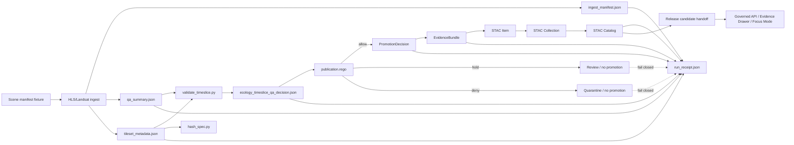

<!-- [KFM_META_BLOCK_V2]
doc_id: kfm://doc/TODO-uuid-connectors-pipelines-ecology-readme
title: Ecology Pipeline Connectors
type: standard
version: v1
status: draft
owners: TODO: ecology pipeline steward
created: NEEDS_VERIFICATION
updated: 2026-04-29
policy_label: TODO: public|restricted
related: [../../../.github/workflows/ecology-timeslice.yml, ../../../tools/validators/ecology/, ../../../policy/ecology/publication.rego, ../../../schemas/contracts/v1/ecology/, ../../../tests/fixtures/ecology/]
tags: [kfm, ecology, connectors, pipelines, timeslice]
notes: [doc_id owners created and policy_label require maintainer verification; current session could verify referenced workflow intent but not mounted repo file presence]
[/KFM_META_BLOCK_V2] -->

# Ecology Pipeline Connectors

Build ecology time-slice ingest artifacts that remain evidence-linked, policy-checkable, catalog-ready, and reversible.

<div align="center">

[](#status--impact)
[](#scope)
[](#policy--publication-gates)
[](#quickstart)

</div>

---

## Status & impact

| Field | Value |
|---|---|
| **Status** | `experimental` — implementation presence still **NEEDS VERIFICATION** in the mounted repository |
| **Owners** | `TODO: ecology pipeline steward` |
| **Target path** | `connectors/pipelines/ecology/README.md` |
| **Primary connector role** | HLS/Landsat ecology time-slice ingest and dry-run artifact production |
| **Trust posture** | Connector output is **not publication**. Promotion requires validation, policy, EvidenceBundle, catalog closure, receipt, and review state. |
| **Quick jumps** | [Scope](#scope) · [Repo fit](#repo-fit) · [Inputs](#accepted-inputs) · [Exclusions](#exclusions) · [Quickstart](#quickstart) · [Flow](#flow) · [Gates](#policy--publication-gates) · [Definition of done](#definition-of-done) |

> [!IMPORTANT]
> This directory must never become a shortcut around KFM’s governed lifecycle. It may prepare ecology time-slice candidates, but it does not decide public truth, policy admissibility, release state, or UI/AI claim authority.

[Back to top](#ecology-pipeline-connectors)

---

## Scope

This directory is for ecology pipeline connector code that prepares bounded, reviewable time-slice artifacts for downstream KFM governance.

**Currently evidenced connector intent:** an HLS/Landsat ingest command is referenced for `connectors/pipelines/ecology/hls_landsat_ingest.py`, using a fixture scene manifest and producing `ingest_manifest.json`, `qa_summary.json`, and `tileset_metadata.json`.

**Truth labels used in this README:**

| Label | Meaning here |
|---|---|
| **CONFIRMED** | Verified from current-session evidence or a directly retrieved project artifact. |
| **INFERRED** | Reasonable repo-doc placement or relationship inferred from referenced paths and KFM doctrine. |
| **PROPOSED** | Recommended behavior or structure not verified as implemented. |
| **UNKNOWN** | Not verifiable without the actual mounted repository, tests, logs, workflows, or runtime artifacts. |
| **NEEDS VERIFICATION** | Check before relying on the claim in implementation, CI, or publication. |

---

## Repo fit

This README is a directory landing page for:

```text
connectors/pipelines/ecology/
```

### Upstream

These paths are referenced or expected inputs to the ecology time-slice flow.

| Path from this README | Role | Status |
|---|---|---|
| [`../../../tests/fixtures/ecology/timeslice/pass/scene_manifest.json`](../../../tests/fixtures/ecology/timeslice/pass/scene_manifest.json) | Fixture scene manifest for the dry-run HLS/Landsat ingest | **CONFIRMED referenced / NEEDS VERIFICATION present** |
| [`../../../tests/fixtures/ecology/policy/`](../../../tests/fixtures/ecology/policy/) | Policy fixtures for allow, hold, and deny outcomes | **CONFIRMED referenced / NEEDS VERIFICATION present** |
| `source descriptors` | Required before live source activation, rights review, or public release | **PROPOSED / NEEDS VERIFICATION** |

### Peer governance surfaces

| Path from this README | Role | Status |
|---|---|---|
| [`../../../tools/validators/ecology/`](../../../tools/validators/ecology/) | QA validation, deterministic hashing, policy assertion, PromotionDecision, EvidenceBundle, and STAC helper tools | **CONFIRMED referenced / NEEDS VERIFICATION present** |
| [`../../../policy/ecology/publication.rego`](../../../policy/ecology/publication.rego) | Publication policy gate for ecology time-slice candidates | **CONFIRMED referenced / NEEDS VERIFICATION present** |
| [`../../../schemas/contracts/v1/ecology/`](../../../schemas/contracts/v1/ecology/) | Machine schemas for PromotionDecision, EvidenceBundle, STAC item, STAC collection, and STAC catalog | **CONFIRMED referenced / NEEDS VERIFICATION present** |
| [`../../../.github/workflows/ecology-timeslice.yml`](../../../.github/workflows/ecology-timeslice.yml) | CI orchestration for ecology time-slice validation | **CONFIRMED referenced / NEEDS VERIFICATION present** |

### Downstream

| Path from this README | Role | Status |
|---|---|---|
| [`../../../data/receipts/runs/dry-run/`](../../../data/receipts/runs/dry-run/) | Dry-run receipt destination referenced by the workflow | **CONFIRMED referenced / NEEDS VERIFICATION present** |
| `data/catalog/`, `data/proofs/`, `data/published/` | Catalog, proof, and publication surfaces for real releases | **PROPOSED unless repo evidence confirms exact homes** |
| Governed API / Evidence Drawer / Focus Mode | Consumers of released, evidence-backed outputs only | **PROPOSED integration / governed by KFM UI+AI doctrine** |

[Back to top](#ecology-pipeline-connectors)

---

## Accepted inputs

Only inputs that can be traced, validated, and safely reviewed belong here.

| Input | Belongs here? | Required handling |
|---|---:|---|
| Fixture scene manifests for ecology time-slice dry-runs | Yes | Must validate before artifact generation. |
| HLS/Landsat scene metadata and bounded test assets | Yes, after source admission | Must carry source role, time scope, checksums, and rights/citation context. |
| QA summaries and tileset metadata generated by this connector | Yes | Must be deterministic enough for validation and `spec_hash` checks. |
| Policy fixture JSON files | Yes, as test inputs | Must exercise allow, hold, and deny paths. |
| Live source pulls | Not yet | Require source descriptor, rights review, cadence, rollback path, and steward approval first. |

> [!WARNING]
> Do not use this connector directory to admit broad live ecology sources, sensitive species locations, or third-party occurrence data until source rights, geoprivacy, precision, and publication policy are verified.

---

## Exclusions

This directory does **not** own:

| Excluded responsibility | Goes instead |
|---|---|
| Publication policy law | [`../../../policy/ecology/publication.rego`](../../../policy/ecology/publication.rego) |
| Schema authority | [`../../../schemas/contracts/v1/ecology/`](../../../schemas/contracts/v1/ecology/) or repo-native schema home after ADR |
| EvidenceBundle, PromotionDecision, and STAC schema validation | [`../../../tools/validators/ecology/`](../../../tools/validators/ecology/) |
| Release proof packs, signatures, or attestations | `data/proofs/` or repo-native release-proof home |
| Public UI rendering | governed UI shell / Evidence Drawer surfaces |
| Focus Mode answers | governed API + EvidenceBundle resolution + finite runtime envelope |
| Direct publishing | promotion/release gate only |
| Canonical biological truth | flora, fauna, habitat, and source registries remain separate governed object families |

---

## Directory tree

Exact mounted contents were **not** verifiable in this session. This is the minimum target tree implied by the requested path and referenced workflow.

```text
connectors/pipelines/ecology/
├── README.md                 # this directory guide
└── hls_landsat_ingest.py     # referenced by ecology time-slice CI; presence NEEDS VERIFICATION
```

Related referenced surfaces:

```text
.github/workflows/ecology-timeslice.yml
policy/ecology/publication.rego
schemas/contracts/v1/ecology/
tests/fixtures/ecology/
tools/validators/ecology/
data/receipts/runs/dry-run/
```

> [!NOTE]
> Add additional files to this tree only after inspecting the real repo conventions. Do not duplicate schema, policy, validator, or proof authority inside connector code.

[Back to top](#ecology-pipeline-connectors)

---

## Quickstart

Run from the repository root after confirming that the paths exist.

### 1. Prepare dry-run artifact directories

```bash
mkdir -p /tmp/ecology-policy-assertions
mkdir -p /tmp/ecology-ingest
mkdir -p data/receipts/runs/dry-run
```

### 2. Run the HLS/Landsat ingest

```bash
python connectors/pipelines/ecology/hls_landsat_ingest.py \
  --scene-manifest tests/fixtures/ecology/timeslice/pass/scene_manifest.json \
  --out-dir /tmp/ecology-ingest

python -m json.tool /tmp/ecology-ingest/ingest_manifest.json > /dev/null
python -m json.tool /tmp/ecology-ingest/qa_summary.json > /dev/null
python -m json.tool /tmp/ecology-ingest/tileset_metadata.json > /dev/null
```

### 3. Validate the time-slice and identity

```bash
python tools/validators/ecology/validate_timeslice.py \
  --qa-summary /tmp/ecology-ingest/qa_summary.json \
  --tileset-metadata /tmp/ecology-ingest/tileset_metadata.json \
  --out /tmp/ecology_timeslice_qa_decision.json

python tools/validators/ecology/hash_spec.py \
  /tmp/ecology-ingest/tileset_metadata.json
```

### 4. Parse policy before promotion

```bash
opa parse policy/ecology/publication.rego
```

### 5. Treat CI as orchestration, not policy

The workflow should remain thin. The authoritative logic lives in validators, policy, schemas, and fixtures.

```bash
# The full CI-equivalent path should also:
# - assert policy decisions across allow/hold/deny fixtures
# - generate and validate PromotionDecision
# - build and validate EvidenceBundle
# - generate and validate STAC item, collection, and catalog
# - fail closed if required artifacts are missing or invalid
# - write a dry-run run_receipt
```

[Back to top](#ecology-pipeline-connectors)

---

## Usage

Use this connector when the intended output is an ecology time-slice candidate that can be handed to KFM validation and publication surfaces.

A connector run should produce or support the following artifact chain:

| Artifact | Example location | Meaning |
|---|---|---|
| `ingest_manifest.json` | `/tmp/ecology-ingest/ingest_manifest.json` | What was ingested, from which manifest, with what declared scope. |
| `qa_summary.json` | `/tmp/ecology-ingest/qa_summary.json` | QA result summary for the time-slice candidate. |
| `tileset_metadata.json` | `/tmp/ecology-ingest/tileset_metadata.json` | Candidate tile or layer metadata used for validation and catalog generation. |
| `ecology_timeslice_qa_decision.json` | `/tmp/ecology_timeslice_qa_decision.json` | Validator decision over QA and tileset metadata. |
| `promotion_decision.json` | `/tmp/promotion_decision.json` | PromotionDecision candidate generated only after policy allow. |
| `evidence_bundle.json` | `/tmp/evidence_bundle.json` | EvidenceBundle linking artifacts, policy, publication state, source role, and claim status. |
| `stac_item.json` | `/tmp/stac_item.json` | STAC item for the candidate asset. |
| `stac_collection.json` | `/tmp/stac_collection.json` | STAC collection for ecology time-slices. |
| `stac_catalog.json` | `/tmp/stac_catalog.json` | STAC catalog closure surface. |
| `run_receipt.json` | `data/receipts/runs/dry-run/run_receipt.json` | Process memory for replay, audit, and rollback review. |

---

## Flow



---

## Policy & publication gates

The policy fixture set should prove that the connector path can produce legitimate negative outcomes, not only successful artifacts.

| Policy fixture family | Expected outcome | Why it matters |
|---|---|---|
| `publication_allow_timeslice_pass` | `allow` | Baseline happy path for a valid ecology time-slice. |
| `publication_allow_with_fallback` | `allow` | Valid fallback behavior when explicit policy permits it. |
| `publication_hold_timeslice_review` | `hold` | Reviewable uncertainty must not be silently promoted. |
| `publication_deny_timeslice_reject` | `deny` | Failed QA or rejected candidates must fail closed. |
| `publication_deny_missing_receipt` | `deny` | Receipts are required process memory. |
| `publication_deny_missing_fallback` | `deny` | Missing fallback obligations block publication. |
| `publication_deny_incomplete_tiles_no_steward` | `deny` | Incomplete delivery without steward approval must not publish. |

> [!IMPORTANT]
> `allow` is not the same as publication. A real public release still needs catalog closure, evidence closure, release state, rollback target, and review policy appropriate to the artifact.

---

## Connector rules

1. **Keep connector code narrow.** It prepares artifacts; it does not own policy, schema, or release authority.
2. **Emit machine-readable JSON.** Every output used by a gate must be parseable with `python -m json.tool`.
3. **Preserve source/time scope.** Ecology time-slices must carry the time basis that makes the layer meaningful.
4. **Hash deterministic candidate metadata.** `spec_hash` checks should be stable across replay for the same candidate content.
5. **Fail closed.** Missing artifacts, missing policy assertions, unresolved rights, or validation failure should stop promotion and still produce auditable process memory where safe.
6. **Avoid live-source creep.** Live connectors need source descriptors, rights review, source cadence, steward review, and rollback before activation.
7. **Keep public clients downstream.** UI, exports, and Focus Mode consume governed release/evidence outputs, not raw connector outputs.

---

## Definition of done

A connector change is not done until the repo can demonstrate these checks.

- [ ] Target file presence and import path verified from a mounted repository.
- [ ] Fixture scene manifest runs without live-source assumptions.
- [ ] `ingest_manifest.json`, `qa_summary.json`, and `tileset_metadata.json` are emitted and valid JSON.
- [ ] `validate_timeslice.py` produces a QA decision.
- [ ] `hash_spec.py` produces a deterministic identity result for the candidate metadata.
- [ ] `policy/ecology/publication.rego` parses.
- [ ] Policy assertions cover allow, hold, and deny outcomes.
- [ ] `PromotionDecision` validates against `schemas/contracts/v1/ecology/promotion_decision.schema.json`.
- [ ] `EvidenceBundle` validates against `schemas/contracts/v1/ecology/evidence_bundle.schema.json`.
- [ ] STAC item, collection, and catalog validate against ecology contract schemas.
- [ ] Required dry-run artifacts are present, non-empty, and valid JSON.
- [ ] `run_receipt.json` records inputs, outputs, policy result, promotion decision, and catalog refs.
- [ ] No connector path reads from or writes to public release state directly.
- [ ] README links and target paths are rechecked after repo mount.

---

## FAQ

### Does this directory publish ecology layers?

No. It prepares candidates and supporting artifacts. Publication is a governed state transition that requires validation, policy, evidence closure, catalog closure, release state, and rollback target.

### Can this connector call live HLS/Landsat services?

Only after source admission is complete. The dry-run path should remain fixture-safe and reproducible. Live access requires source descriptors, rights and attribution checks, cadence expectations, checksum or content identity rules, and steward approval.

### Can Focus Mode summarize outputs from this pipeline?

Only after the output is released or otherwise admitted through the governed API path. Focus Mode must consume EvidenceBundle-backed context and return finite outcomes rather than free-form authority.

---

<details>
<summary>Appendix A — referenced command families</summary>

### Ingest

```bash
python connectors/pipelines/ecology/hls_landsat_ingest.py \
  --scene-manifest tests/fixtures/ecology/timeslice/pass/scene_manifest.json \
  --out-dir /tmp/ecology-ingest
```

### QA and identity

```bash
python tools/validators/ecology/validate_timeslice.py \
  --qa-summary /tmp/ecology-ingest/qa_summary.json \
  --tileset-metadata /tmp/ecology-ingest/tileset_metadata.json \
  --out /tmp/ecology_timeslice_qa_decision.json

python tools/validators/ecology/hash_spec.py \
  /tmp/ecology-ingest/tileset_metadata.json
```

### Policy assertion pattern

```bash
python tools/validators/ecology/assert_rego_decision.py \
  --policy policy/ecology \
  --input tests/fixtures/ecology/policy/publication_allow_timeslice_pass.json \
  --query data.ecology.publication.decision \
  --expected allow \
  --out /tmp/ecology-policy-assertions/publication_allow_timeslice_pass.assertion.json
```

### Promotion and evidence

```bash
python tools/validators/ecology/generate_promotion_decision.py \
  --policy-decision allow \
  --candidate kfm://tileset/ecology/example-pass \
  --receipt-ref kfm://receipt/run/ecology/dry-run \
  --evidence-bundle-url kfm://evidence/ecology/example-pass-timeslice \
  --out /tmp/promotion_decision.json

python tools/validators/ecology/build_evidence_bundle.py \
  --bundle-id kfm://evidence/ecology/example-pass-timeslice \
  --artifact ingest_manifest=/tmp/ecology-ingest/ingest_manifest.json \
  --artifact qa_summary=/tmp/ecology-ingest/qa_summary.json \
  --artifact tileset_metadata=/tmp/ecology-ingest/tileset_metadata.json \
  --artifact qa_decision=/tmp/ecology_timeslice_qa_decision.json \
  --artifact promotion_decision=/tmp/promotion_decision.json \
  --object-ref kfm://tileset/ecology/example-pass \
  --policy-id kfm://policy/ecology/publication \
  --surface public \
  --publication-state ready \
  --source-role AUTHORITATIVE_LAYER \
  --claim-status CONFIRMED \
  --catalog-closure \
  --no-exact-geometry-present \
  --public-geometry-policy allow_exact \
  --public-visibility public \
  --out /tmp/evidence_bundle.json
```

### Catalog closure

```bash
python tools/validators/ecology/generate_stac_item.py \
  --item-id kfm-ecology-example-pass \
  --collection kfm-ecology-timeslices \
  --tileset-metadata /tmp/ecology-ingest/tileset_metadata.json \
  --evidence-bundle kfm://evidence/ecology/example-pass-timeslice \
  --promotion-decision kfm://promotion/ecology/example-pass \
  --asset tileset=kfm://tileset/ecology/example-pass \
  --out /tmp/stac_item.json

python tools/validators/ecology/generate_stac_collection.py \
  --collection-id kfm-ecology-timeslices \
  --item /tmp/stac_item.json \
  --out /tmp/stac_collection.json

python tools/validators/ecology/build_stac_catalog.py \
  --catalog-id kfm-ecology-catalog \
  --collection /tmp/stac_collection.json \
  --out /tmp/stac_catalog.json
```

</details>

[Back to top](#ecology-pipeline-connectors)
