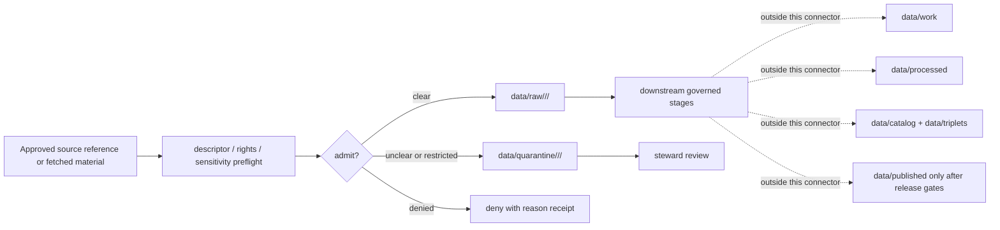

<!-- [KFM_META_BLOCK_V2]
doc_id: kfm://doc/connectors-settlements-infrastructure-readme
title: connectors/settlements-infrastructure/ — Settlements & Infrastructure Connector Lane
type: readme
version: v0.1
status: draft
owners: OWNER_TBD — Connector steward · Source steward · Settlements-Infrastructure steward · Infrastructure sensitivity reviewer · Rights steward · Data steward · Validation steward · Docs steward
created: 2026-06-20
updated: 2026-06-20
policy_label: public; infrastructure-sensitive; deny-by-default-for-sensitive-detail; source-admission-only
related:
  - ../README.md
  - ../../docs/doctrine/directory-rules.md
  - ../../docs/domains/settlements-infrastructure/README.md
  - ../../docs/domains/settlements-infrastructure/SOURCE_REGISTRY.md
  - ../../docs/domains/settlements-infrastructure/CANONICAL_PATHS.md
  - ../../docs/domains/settlements-infrastructure/FILE_SYSTEM_PLAN.md
  - ../../docs/domains/settlements-infrastructure/sublanes/infrastructure.md
  - ../../docs/runbooks/settlements-infrastructure/SOURCE_REFRESH_RUNBOOK.md
  - ../../docs/runbooks/settlements-infrastructure/PROMOTION_RUNBOOK.md
  - ../../docs/adr/ADR-0010-deny-by-default-for-dna-rare-species-archaeology-infrastructure.md
  - ../../docs/sources/catalog/hifld/hifld.md
  - ../../data/registry/sources/
  - ../../data/raw/
  - ../../data/quarantine/
  - ../../data/receipts/
  - ../../data/proofs/
  - ../../policy/rights/
  - ../../policy/sensitivity/
  - ../../release/
tags: [kfm, connectors, settlements-infrastructure, settlements, infrastructure, facilities, service-areas, operators, source-admission, sensitivity, deny-by-default, raw, quarantine, governance]
notes:
  - "Draft connector lane for Settlements & Infrastructure source intake and admission helpers."
  - "Placement is draft / ADR-class: settlements-infrastructure is a domain lane; Directory Rules §7.3 does not list this connector as a canonical connector root unless later ratified."
  - "Critical infrastructure detail defaults to restricted/denied handling in the domain registry and ADR-0010 doctrine."
  - "Connector output may enter raw or quarantine admission lanes only; sensitive or unresolved material routes to quarantine by default."
  - "This README defines a connector/source-admission boundary, not source-family truth, settlement truth, infrastructure truth, operator truth, condition truth, legal/regulatory determination, sensitivity policy, catalog/triplet authority, proof authority, release authority, public API behavior, or public UI behavior."
[/KFM_META_BLOCK_V2] -->

<a id="top"></a>

# Settlements & Infrastructure Connector

> Draft source-admission boundary for Settlements & Infrastructure source material, including settlement, facility, service-area, operator, condition, and dependency context.

<p>
  
  
  
  
  
  
</p>

`connectors/settlements-infrastructure/`

## Quick jumps

[Scope](#scope) · [Repo fit](#repo-fit) · [Admission model](#admission-model) · [Lifecycle sketch](#lifecycle-sketch) · [Authority boundary](#authority-boundary) · [Inputs](#inputs) · [Exclusions](#exclusions) · [Admission posture](#admission-posture) · [Anti-collapse posture](#anti-collapse-posture) · [Validation](#validation) · [Definition of done](#definition-of-done)

---

## Scope

`connectors/settlements-infrastructure/` is a draft connector lane for Settlements & Infrastructure source intake and admission helpers.

This folder may contain connector-local documentation, source-admission helpers, source-reference manifest builders, descriptor-gated client helpers, facility/service-area parsers, operator/source-role preservation helpers, condition-observation parsers, sensitivity preflight helpers, provenance/digest helpers, no-network fixture pointers, and raw/quarantine handoff adapters for approved source material.

It must not become settlement truth, facility truth, infrastructure truth, operator truth, condition truth, legal/regulatory determination, emergency guidance, sensitivity policy authority, rights policy authority, schema authority, catalog/triplet authority, proof authority, release authority, public API behavior, public UI behavior, public map authority, or publication authority.

> [!IMPORTANT]
> **Status:** draft / `NEEDS VERIFICATION`  
> **Owner:** `OWNER_TBD`  
> **Path:** `connectors/settlements-infrastructure/`  
> **Truth posture:** the path exists in the repository as this README; actual connector code, source descriptors, source terms, sensitivity policy, tests, fixtures, parser behavior, CI wiring, and release behavior remain `NEEDS VERIFICATION`.

---

## Repo fit

```text
connectors/
└── settlements-infrastructure/
    └── README.md
```

Related responsibility roots:

```text
connectors/settlements-infrastructure/     # this draft connector lane
docs/domains/settlements-infrastructure/   # domain doctrine and source registry
docs/runbooks/settlements-infrastructure/  # source refresh and promotion runbooks
docs/sources/catalog/                      # source-family/product doctrine
data/registry/sources/                     # source descriptors and activation state
data/raw/                                  # raw staged source outputs only after gates clear
data/quarantine/                           # holding area for unresolved/restricted material
data/receipts/                             # source, sensitivity, review, and transform receipts
data/proofs/                               # EvidenceBundles and proof packs
policy/rights/                             # rights and source-use review
policy/sensitivity/                        # infrastructure sensitivity and release constraints
release/                                   # release decisions, manifests, rollback, correction state
```

> [!WARNING]
> `connectors/settlements-infrastructure/` is a draft/open connector placement. Do not activate this connector until placement, source descriptors, rights policy, sensitivity policy, fixtures, and validation gates are accepted.

---

## Admission model

Settlements & Infrastructure source material must be admitted source-role-first and policy-first.

| Concern | Required connector posture |
|---|---|
| Source identity | Preserve source family, source descriptor reference, source URL/reference, source date, rights posture, citation posture, and digest. |
| Source role | Preserve admission role; do not upgrade candidate, administrative, observed, regulatory, modeled, or aggregate material by promotion. |
| Sensitivity | Apply fail-closed handling for precise or operational infrastructure detail until reviewed. |
| Rights | Require rights, attribution, and source-use review before downstream use. |
| Provenance | Preserve source vintage, retrieval/import time, transform history, receipt linkage, and review state. |
| Cross-lane joins | Do not re-admit roads, hydrology, hazards, people/land, archaeology, or biology sources here merely because they intersect settlement/infrastructure objects. |
| Publication | No connector output is public. Publication is a separate governed transition outside this folder. |

---

## Lifecycle sketch



> [!CAUTION]
> Connector code admits, quarantines, or rejects source material. It does not decide public suitability, emergency meaning, operational status, legal/regulatory meaning, or release state. Promotion remains a governed state transition, not a file move.

---

## Authority boundary

```text
DEFAULT OUTPUT:
  data/quarantine/<domain>/<source_id>/<run_id>/

CONDITIONAL OUTPUT AFTER GATES CLEAR:
  data/raw/<domain>/<source_id>/<run_id>/

NOT HERE:
  settlement truth
  infrastructure truth
  operator truth
  condition truth
  emergency guidance
  legal or regulatory determination
  rights or sensitivity policy
  processed settlement/infrastructure records
  catalog records
  triplet records
  public map artifacts
  receipts/proofs as authority
  release decisions
  public API behavior
  public UI behavior
```

---

## Inputs

| Accepted item | Required posture |
|---|---|
| Source-reference manifest | Preserve source family, descriptor reference, rights posture, sensitivity posture, source date, retrieval/import date, and digest. |
| Settlement/place parser | Preserve source role, name variants, source vintage, geometry scope, citation, and conflict status. |
| Facility/service-area parser | Preserve source identity, role, geometry scope, operator/source fields, freshness, and sensitivity flags. |
| Operator/source-role helper | Preserve whether a record is administrative, regulatory, observed, modeled, aggregate, or candidate. |
| Condition-observation helper | Preserve observation time, source authority, uncertainty, review state, and release-blocking flags. |
| Cross-lane reference helper | Preserve link-only relationships to other domain source registries without copying their authority. |
| Test references | Point to owning fixture/test roots; fixtures do not become source authority. |

---

## Exclusions

| Do not store here | Correct home |
|---|---|
| Settlements & Infrastructure doctrine | `docs/domains/settlements-infrastructure/` |
| Authoritative SourceDescriptor records | `data/registry/sources/` |
| Rights or sensitivity rules | `policy/rights/`, `policy/sensitivity/` |
| Processed settlement/infrastructure records | `data/processed/` |
| Catalog or triplet records | `data/catalog/`, `data/triplets/` |
| Public artifacts | `data/published/` after governed release |
| Receipts and proof packs as authority | `data/receipts/`, `data/proofs/` |
| Schemas or semantic contracts | `schemas/`, `contracts/` |
| Public API or UI behavior | `apps/governed-api/`, `apps/explorer-web/` |

---

## Admission posture

Settlements & Infrastructure intake should preserve source identity, source descriptor reference, rights posture, sensitivity posture, source role, role basis, source date, import date, source URL/reference, citation fields, geometry scope, operator/source fields, freshness state, digest, review state, quarantine reason, and release-blocking flags.

---

## Anti-collapse posture

| Rule | Connector implication |
|---|---|
| Source role is fixed at admission. | Do not upgrade role during fetch, staging, or promotion. |
| Infrastructure detail can be sensitive. | Unclear precision or operational detail routes to quarantine or denial. |
| Facility record is not condition truth. | Preserve condition observations separately from inventory records. |
| Operator label is not legal determination. | Preserve source context and do not infer legal responsibility. |
| Cross-lane joins do not copy authority. | Roads, hydrology, hazards, people/land, archaeology, fauna, and flora retain their own source registries. |
| Public display is downstream. | The connector must not build public API/UI/map/release payloads. |

---

## Validation

Before relying on this connector, verify:

- placement is ratified or recorded in the drift/open-question register;
- source descriptors exist and validate;
- rights and sensitivity gates are implemented and fail closed;
- source-role mappings are enforced;
- tests use safe no-network fixtures;
- outputs are limited to quarantine by default and raw only after gates clear;
- downstream receipts, proofs, catalog/triplet records, public artifacts, and release records are produced only outside this connector;
- any public result has release approval, redaction/generalization where required, rollback path, and correction path.

---

## Definition of done

- [ ] Owners are confirmed and `OWNER_TBD` is replaced.
- [ ] Connector placement is resolved by ADR, migration note, or Directory Rules update, or recorded as open drift.
- [ ] Actual connector contents are inventoried.
- [ ] SourceDescriptor IDs, source roles, rights, sensitivity, and activation state are verified.
- [ ] Tests prevent role collapse, rights bypass, sensitivity bypass, cross-lane authority collapse, and public-release misuse.
- [ ] Outputs are verified to enter quarantine by default and raw only after gates clear.
- [ ] No source-family, domain, processed, catalog, triplet, published, release, schema, policy, proof, receipt, registry, fixture, API, UI, or public-claim authority lives here.
- [ ] Tests, fixtures, and CI behavior are verified or marked `NEEDS VERIFICATION`.

---

## Status summary

`connectors/settlements-infrastructure/` is for Settlements & Infrastructure source-admission code only. It is not settlement truth, infrastructure truth, operator truth, condition truth, emergency guidance, legal/regulatory determination, policy authority, schema authority, catalog/triplet authority, proof closure, release authority, public map authority, public API behavior, public UI behavior, or pipeline authority.

<p align="right"><a href="#top">Back to top</a></p>
