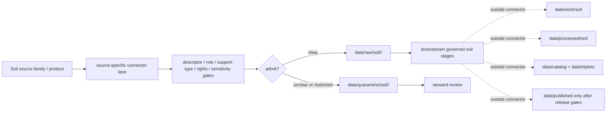

<!-- [KFM_META_BLOCK_V2]
doc_id: kfm://doc/connectors-soil-readme
title: connectors/soil/ — Soil Connector Coordination Lane
type: readme
version: v0.1
status: draft
owners: OWNER_TBD — Connector steward · Source steward · Soil steward · NRCS steward · Agriculture steward · Hydrology steward · Data steward · Validation steward · Docs steward
created: 2026-06-20
updated: 2026-06-20
policy_label: public; coordination-lane; multi-source; source-admission-only
related:
  - ../README.md
  - ../nrcs/README.md
  - ../nrcs/ssurgo/README.md
  - ../nrcs/gssurgo/README.md
  - ../nrcs/sda/README.md
  - ../nrcs/scan/README.md
  - ../nrcs-ssurgo/README.md
  - ../nrcs-scan/README.md
  - ../../docs/doctrine/directory-rules.md
  - ../../docs/domains/soil/README.md
  - ../../docs/domains/soil/ARCHITECTURE.md
  - ../../docs/domains/soil/CANONICAL_PATHS.md
  - ../../docs/sources/catalog/nrcs.md
  - ../../docs/sources/catalog/nrcs/ssurgo.md
  - ../../docs/sources/catalog/nrcs/gssurgo.md
  - ../../docs/sources/catalog/nrcs/soil-data-access.md
  - ../../docs/sources/catalog/nrcs/scan-soil-climate.md
  - ../../docs/sources/catalog/isric/isric-soilgrids.md
  - ../../docs/sources/catalog/nasa/nasa-smap.md
  - ../../docs/sources/catalog/kansas/kansas-mesonet.md
  - ../../data/registry/sources/
  - ../../data/raw/
  - ../../data/quarantine/
  - ../../data/receipts/
  - ../../data/proofs/
  - ../../policy/rights/
  - ../../policy/sensitivity/
  - ../../release/
tags: [kfm, connectors, soil, nrcs, ssurgo, gssurgo, sda, scan, soilgrids, smap, mesonet, source-admission, raw, quarantine, source-role, support-type, governance]
notes:
  - "Draft soil connector coordination lane."
  - "Placement is draft / ADR-class: soil is a domain lane, not a top-level authority root, and Directory Rules §7.3 does not list connectors/soil/ as a canonical connector root unless later ratified."
  - "Specific source intake should prefer source-specific connector lanes such as connectors/nrcs/, connectors/nrcs/ssurgo/, connectors/nrcs/gssurgo/, connectors/nrcs/sda/, connectors/nrcs/scan/, and other accepted source-family lanes."
  - "Soil source material is multi-source and support-type-specific; do not collapse SSURGO, SDA, gSSURGO, SCAN, SoilGrids, SMAP, Mesonet, or field/pedon sources into a single source role, cadence, scale, or release posture."
  - "Connector output may enter raw or quarantine admission lanes only."
  - "This README defines a connector coordination/source-admission boundary, not Soil domain doctrine, source-family truth, SourceDescriptor authority, soil-property truth, parcel truth, field verification, policy authority, schema authority, catalog/triplet authority, proof authority, release authority, public API behavior, or public UI behavior."
[/KFM_META_BLOCK_V2] -->

<a id="top"></a>

# Soil Connector Coordination Lane

> Draft coordination boundary for soil-related source-admission connectors. Specific source intake should remain source-family/product-specific.

<p>
  
  
  
  
  
  
</p>

`connectors/soil/`

## Quick jumps

[Scope](#scope) · [Repo fit](#repo-fit) · [Relationship to source-specific lanes](#relationship-to-source-specific-lanes) · [Admission model](#admission-model) · [Lifecycle sketch](#lifecycle-sketch) · [Authority boundary](#authority-boundary) · [Inputs](#inputs) · [Exclusions](#exclusions) · [Anti-collapse posture](#anti-collapse-posture) · [Validation](#validation) · [Definition of done](#definition-of-done)

---

## Scope

`connectors/soil/` is a draft coordination lane for soil-related source intake and admission helper conventions.

This folder may contain connector-local documentation, source-family index pointers, shared soil admission conventions, support-type vocabulary notes, handoff-envelope conventions, fixture pointers, and raw/quarantine output guidance for accepted soil sources.

It must not become Soil domain doctrine, NRCS source-family truth, product doctrine, SourceDescriptor authority, soil-property truth, parcel truth, field verification, conservation-compliance truth, legal-access truth, water-rights truth, policy authority, schema authority, catalog/triplet authority, proof authority, release authority, public API behavior, public UI behavior, or publication authority.

> [!IMPORTANT]
> **Status:** draft / `NEEDS VERIFICATION`  
> **Owner:** `OWNER_TBD`  
> **Path:** `connectors/soil/`  
> **Truth posture:** the path exists in the repository as this README; actual connector code, source descriptors, tests, fixtures, package metadata, CI wiring, source-family activation, and release behavior remain `NEEDS VERIFICATION`.

---

## Repo fit

```text
connectors/
├── nrcs/
│   ├── README.md
│   ├── ssurgo/
│   ├── gssurgo/
│   ├── sda/
│   └── scan/
├── nrcs-ssurgo/
├── nrcs-scan/
└── soil/
    └── README.md
```

Related responsibility roots:

```text
connectors/soil/                          # this draft coordination lane
connectors/nrcs/                          # canonical NRCS connector-family lane
connectors/nrcs/ssurgo/                   # NRCS SSURGO product connector lane
connectors/nrcs/gssurgo/                  # NRCS gSSURGO product connector lane
connectors/nrcs/sda/                      # NRCS Soil Data Access connector lane
connectors/nrcs/scan/                     # NRCS SCAN connector lane
docs/domains/soil/                        # soil domain doctrine and architecture
docs/sources/catalog/nrcs/                # NRCS product/source doctrine
docs/sources/catalog/isric/               # ISRIC / SoilGrids source doctrine
docs/sources/catalog/nasa/                # NASA / SMAP source doctrine
docs/sources/catalog/kansas/              # Kansas Mesonet source doctrine
data/registry/sources/                    # source descriptors and activation state
data/raw/                                 # raw staged source outputs by owning domain
data/quarantine/                          # held material requiring source/role/rights/sensitivity review
data/receipts/                            # ingest, checksum, transform, aggregation, and review receipts
data/proofs/                              # EvidenceBundles and proof packs
policy/rights/                            # terms, attribution, and source-use review
policy/sensitivity/                       # private-land, ecology, cultural, exact-location, and release rules
release/                                  # release decisions, manifests, rollback, correction state
```

> [!WARNING]
> `connectors/soil/` is a draft/open connector placement. Soil is a domain lane segment, not a top-level authority root. Do not move source-specific connector implementation into this folder unless an ADR, migration note, or updated Directory Rules ratifies a soil connector coordination/root pattern.

---

## Relationship to source-specific lanes

| Source/product lane | Existing or expected connector home | Boundary |
|---|---|---|
| NRCS family | `connectors/nrcs/` | Canonical NRCS connector family; source-specific fetch/admission only. |
| SSURGO | `connectors/nrcs/ssurgo/` and/or `connectors/nrcs-ssurgo/` | County-scale static survey source; keep separate from SDA/gSSURGO. |
| gSSURGO | `connectors/nrcs/gssurgo/` | Gridded derivative of SSURGO; preserve derivative lineage and MUKEY linkage. |
| Soil Data Access | `connectors/nrcs/sda/` | API/query surface over soil data; preserve query receipts and response digests. |
| SCAN | `connectors/nrcs/scan/` and/or `connectors/nrcs-scan/` | Station soil-climate observations; not a soil-map source. |
| SoilGrids | source-specific connector TBD | Modeled/global gridded soil product; do not collapse with SSURGO. |
| SMAP | source-specific connector TBD | Satellite soil-moisture product; observation/model support differs from station readings. |
| Kansas Mesonet | source-specific connector TBD | Station/network observations; keep separate from NRCS SCAN and SMAP. |

No move, delete, rename, redirect, or deprecation is implied by this README.

---

## Admission model

Soil source material must be admitted source-role-first and support-type-first.

| Concern | Required connector posture |
|---|---|
| Source identity | Preserve source family, product, descriptor reference, source URL/reference, source date, rights posture, citation posture, and digest. |
| Support type | Preserve whether material supports static soil survey, gridded derivative, station observation, satellite observation/model, pedon/profile, interpretation, suitability, or aggregate context. |
| Source role | Preserve admission role; do not upgrade observed, administrative, modeled, aggregate, regulatory, or candidate material by promotion. |
| Scale and geometry | Preserve map scale, grid resolution, point/station footprint, raster/vector form, geometry scope, and generalization status. |
| Temporal caveat | Preserve survey vintage, release date, retrieval time, observation time, forecast/model cycle, or refresh cadence as applicable. |
| Rights and sensitivity | Require rights, attribution, and sensitivity review before downstream use. |
| Publication | No connector output is public. Publication is a separate governed transition outside this folder. |

---

## Lifecycle sketch



> [!CAUTION]
> Connector code admits, quarantines, or rejects source material. It does not decide soil truth, field verification, parcel suitability, conservation compliance, legal access, water rights, public map release, or final interpretation. Promotion remains a governed state transition, not a file move.

---

## Authority boundary

```text
OUTPUT LIMIT:
  data/raw/soil/<source_id>/<run_id>/
  data/quarantine/soil/<source_id>/<run_id>/

NOT HERE:
  Soil domain doctrine
  NRCS / ISRIC / NASA / Kansas source-family truth
  SourceDescriptor authority
  soil-property truth
  parcel truth
  field verification
  conservation-compliance truth
  legal-access truth
  water-rights truth
  processed soil records
  catalog records
  triplet records
  public map artifacts
  receipts/proofs as authority
  release decisions
  public API behavior
  public UI behavior
```

---

## Inputs

| Accepted item | Required posture |
|---|---|
| Source-reference manifest | Preserve source family, product, descriptor reference, rights posture, sensitivity posture, source date, retrieval/import date, and digest. |
| Soil survey parser | Preserve map unit/component/horizon lineage, MUKEY/COKEY/CHKEY where applicable, source vintage, and intended scale. |
| Gridded derivative parser | Preserve raster/grid identity, resolution, source product, derivative lineage, source vintage, and join keys. |
| Query/API helper | Preserve query text, endpoint, parameters, response status, retrieval time, source URL, and digest. |
| Station observation helper | Preserve station id, timestamp, variable, value, units, depth where applicable, quality flags, source URL, and digest. |
| Satellite/model helper | Preserve product id, cycle/time, resolution, algorithm/model identity, uncertainty, and support-type caveats. |
| Interpretation helper | Preserve method, source attributes, assumptions, rating class, caveats, and receipt linkage. |
| Test references | Point to owning fixture/test roots; fixtures do not become source authority. |

---

## Exclusions

| Do not store here | Correct home |
|---|---|
| Soil domain doctrine | `docs/domains/soil/` |
| Source-family/product doctrine | `docs/sources/catalog/<family>/` |
| Authoritative SourceDescriptor records | `data/registry/sources/` |
| Rights or sensitivity rules | `policy/rights/`, `policy/sensitivity/` |
| Processed soil records or derived layers | `data/processed/` |
| Catalog or triplet records | `data/catalog/`, `data/triplets/` |
| Public map artifacts | `data/published/` after governed release |
| Receipts and proof packs as authority | `data/receipts/`, `data/proofs/` |
| Schemas or semantic contracts | `schemas/`, `contracts/` |
| Public API or UI behavior | `apps/governed-api/`, `apps/explorer-web/` |

---

## Anti-collapse posture

| Rule | Connector implication |
|---|---|
| Soil is a domain lane, not a connector authority root. | Prefer source-specific connector lanes and keep this folder coordination-only unless ratified. |
| SSURGO is not SDA. | Static survey snapshots and API query surfaces keep separate receipts and cadence. |
| gSSURGO is not SSURGO vector. | Gridded derivative lineage and raster caveats must be preserved. |
| SCAN is not a soil map. | Station observations do not become area-wide survey truth. |
| SoilGrids/SMAP are not SSURGO. | Modeled/global/satellite products keep model/scale/uncertainty caveats. |
| Geometry is not title or parcel truth. | Soil geometry does not prove ownership, access, or legal boundaries. |
| Suitability is interpretive. | Ratings require method, assumptions, and caveats. |
| Public display is downstream. | The connector must not build public API/UI/map/release payloads. |

---

## Validation

Before relying on this lane, verify:

- placement is ratified or recorded in the drift/open-question register;
- source-specific connector homes are accepted;
- source descriptors exist and validate;
- support-type and source-role gates are implemented;
- rights and sensitivity gates fail closed;
- tests use safe no-network fixtures;
- outputs are limited to raw or quarantine admission lanes;
- downstream receipts, proofs, catalog/triplet records, public artifacts, and release records are produced only outside connectors;
- any public result has release approval, caveats, rollback path, and correction path.

---

## Definition of done

- [ ] Owners are confirmed and `OWNER_TBD` is replaced.
- [ ] Connector placement is resolved by ADR, migration note, or Directory Rules update, or recorded as open drift.
- [ ] Actual connector contents are inventoried.
- [ ] Source-specific connector homes are verified and linked.
- [ ] SourceDescriptor IDs, source roles, support types, rights, sensitivity, and activation state are verified.
- [ ] Tests prevent source-role collapse, support-type collapse, source-family collapse, rights bypass, sensitivity bypass, and public-release misuse.
- [ ] Outputs are verified to enter raw or quarantine admission lanes only.
- [ ] No source-family, domain, processed, catalog, triplet, published, release, schema, policy, proof, receipt, registry, fixture, API, UI, or public-claim authority lives here.
- [ ] Tests, fixtures, and CI behavior are verified or marked `NEEDS VERIFICATION`.

---

## Status summary

`connectors/soil/` is a draft soil connector coordination lane. It is not Soil domain doctrine, source-family truth, SourceDescriptor authority, soil-property truth, parcel truth, field verification, conservation-compliance truth, legal-access truth, policy authority, schema authority, catalog/triplet authority, proof closure, release authority, public map authority, public API behavior, public UI behavior, or pipeline authority.

<p align="right"><a href="#top">Back to top</a></p>
