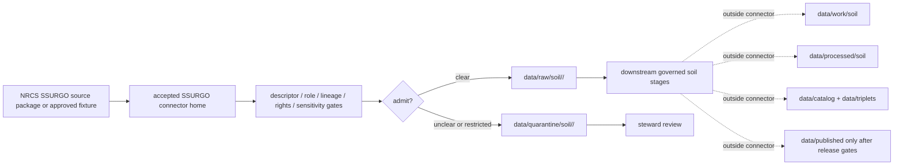

<!-- [KFM_META_BLOCK_V2]
doc_id: kfm://doc/connectors-ssurgo-readme
title: connectors/ssurgo/ — SSURGO Connector Alias Lane
type: readme
version: v0.1
status: draft
owners: OWNER_TBD — Connector steward · Source steward · Soil steward · NRCS steward · Data steward · Validation steward · Docs steward
created: 2026-06-20
updated: 2026-06-20
policy_label: public; alias-lane; soil-source; source-admission-only
related:
  - ../README.md
  - ../soil/README.md
  - ../nrcs/README.md
  - ../nrcs/ssurgo/README.md
  - ../nrcs-ssurgo/README.md
  - ../../docs/doctrine/directory-rules.md
  - ../../docs/domains/soil/README.md
  - ../../docs/domains/soil/ARCHITECTURE.md
  - ../../docs/domains/soil/CANONICAL_PATHS.md
  - ../../docs/sources/catalog/nrcs.md
  - ../../docs/sources/catalog/nrcs/ssurgo.md
  - ../../docs/sources/catalog/nrcs/soil-data-access.md
  - ../../docs/sources/catalog/nrcs/gssurgo.md
  - ../../data/registry/sources/
  - ../../data/raw/
  - ../../data/quarantine/
  - ../../data/receipts/
  - ../../data/proofs/
  - ../../policy/rights/
  - ../../policy/sensitivity/
  - ../../release/
tags: [kfm, connectors, ssurgo, nrcs, soil, alias-lane, authoritative-static-soil, source-admission, raw, quarantine, mukey, cokey, chkey, governance]
notes:
  - "Draft product-name SSURGO connector lane."
  - "This lane does not supersede connectors/nrcs/ssurgo/ or connectors/nrcs-ssurgo/; those existing NRCS-specific lanes remain the fuller connector boundaries until an ADR or migration settles canonical placement."
  - "Placement is draft / ADR-class: Directory Rules §7.3 lists nrcs/ as canonical connector family but does not list ssurgo/ as a standalone canonical root unless later ratified."
  - "SSURGO is distinct from SDA and gSSURGO; do not collapse snapshot/vector, API/query, and gridded derivative surfaces into one role, cadence, scale, or receipt path."
  - "Connector output may enter raw or quarantine admission lanes only."
  - "This README defines an alias/source-admission boundary, not NRCS product doctrine, Soil domain doctrine, SourceDescriptor authority, soil-property truth, parcel truth, field verification, policy authority, schema authority, catalog/triplet authority, proof authority, release authority, public API behavior, or public UI behavior."
[/KFM_META_BLOCK_V2] -->

<a id="top"></a>

# SSURGO Connector Alias Lane

> Draft product-name connector lane for USDA NRCS SSURGO source material. The fuller NRCS-specific connector boundaries are `connectors/nrcs/ssurgo/` and `connectors/nrcs-ssurgo/` until governance settles the canonical home.

<p>
  
  
  
  
  
  
</p>

`connectors/ssurgo/`

## Quick jumps

[Scope](#scope) · [Repo fit](#repo-fit) · [Relationship to NRCS lanes](#relationship-to-nrcs-lanes) · [Admission model](#admission-model) · [Lifecycle sketch](#lifecycle-sketch) · [Authority boundary](#authority-boundary) · [Inputs](#inputs) · [Exclusions](#exclusions) · [Anti-collapse posture](#anti-collapse-posture) · [Validation](#validation) · [Definition of done](#definition-of-done)

---

## Scope

`connectors/ssurgo/` is a draft product-name alias/sibling lane for SSURGO source-admission material.

This README exists to prevent ambiguity between standalone `ssurgo`, canonical NRCS family placement, and existing NRCS-specific SSURGO connector lanes. Unless and until an ADR or migration note chooses `connectors/ssurgo/` as canonical, implementation work should prefer `connectors/nrcs/ssurgo/` or the existing `connectors/nrcs-ssurgo/` lane.

This folder must not become a parallel connector implementation, NRCS product doctrine, Soil domain doctrine, SourceDescriptor authority, soil-property truth, parcel truth, field verification, policy authority, schema authority, catalog/triplet authority, proof authority, release authority, public API behavior, public UI behavior, or publication authority.

> [!IMPORTANT]
> **Status:** draft / `NEEDS VERIFICATION`  
> **Owner:** `OWNER_TBD`  
> **Path:** `connectors/ssurgo/`  
> **Truth posture:** the path exists in the repository as this README; whether it should remain an alias, redirect, tombstone, or canonical connector lane remains `NEEDS VERIFICATION` / ADR-class.

---

## Repo fit

```text
connectors/
├── nrcs/
│   ├── README.md
│   └── ssurgo/
│       └── README.md
├── nrcs-ssurgo/
│   └── README.md
├── soil/
│   └── README.md
└── ssurgo/
    └── README.md
```

Related responsibility roots:

```text
connectors/nrcs/                          # canonical NRCS connector-family lane
connectors/nrcs/ssurgo/                   # NRCS-specific SSURGO connector lane
connectors/nrcs-ssurgo/                   # sibling SSURGO connector lane, draft / possible migration target
connectors/soil/                          # soil coordination lane, not source authority
connectors/ssurgo/                        # this product-name alias/sibling lane
docs/domains/soil/                        # soil domain doctrine and architecture
docs/sources/catalog/nrcs/ssurgo.md       # SSURGO product doctrine
docs/sources/catalog/nrcs/soil-data-access.md # SDA product doctrine; distinct from SSURGO
docs/sources/catalog/nrcs/gssurgo.md      # gSSURGO product doctrine; distinct from SSURGO
data/registry/sources/                    # source descriptors and activation state
data/raw/                                 # raw staged source outputs by owning domain
data/quarantine/                          # held material requiring source/role/rights/sensitivity review
data/receipts/                            # ingest, checksum, transform, aggregation, and review receipts
data/proofs/                              # EvidenceBundles and proof packs
policy/rights/                            # terms, attribution, and source-use review
policy/sensitivity/                       # private-land, ecology, cultural, exact-location, and release rules
release/                                  # release decisions, manifests, rollback, correction state
```

---

## Relationship to NRCS lanes

| Path | Status | Use |
|---|---|---|
| `connectors/nrcs/README.md` | Existing NRCS connector-family README | Canonical NRCS family boundary. |
| `connectors/nrcs/ssurgo/README.md` | Existing NRCS-specific SSURGO README | Preferred nested SSURGO product connector boundary unless migration says otherwise. |
| `connectors/nrcs-ssurgo/README.md` | Existing sibling SSURGO README | Draft sibling lane that may need ADR/migration with nested NRCS layout. |
| `connectors/soil/README.md` | Existing soil coordination README | Coordination lane only; not source-specific SSURGO authority. |
| `connectors/ssurgo/README.md` | This README | Product-name alias/sibling boundary; not canonical until ratified. |

No move, delete, rename, redirect, or deprecation is implied by this README.

---

## Admission model

If this lane is ever activated, it must inherit SSURGO and NRCS connector rules.

| Concern | Required connector posture |
|---|---|
| Source identity | Preserve NRCS SSURGO product identity, descriptor reference, source URL/reference, survey area or package identity, source date, rights posture, citation posture, and digest. |
| Source role | Preserve `authoritative_static_soil` / observed-source posture within intended scale and coverage; do not upgrade or broaden by promotion. |
| Lineage | Preserve map unit, component, horizon, tabular joins, source vintage, and extraction/package provenance. |
| Keys | Preserve MUKEY, COKEY, CHKEY, and other source keys where applicable. |
| Geometry and scale | Preserve vector/snapshot identity, map scale, survey area, CRS/projection, geometry scope, and generalization status. |
| Distinct siblings | Keep SSURGO distinct from SDA live/query outputs and gSSURGO gridded derivatives. |
| Rights and sensitivity | Require rights, attribution, and sensitivity review before downstream use. |
| Publication | No connector output is public. Publication is a separate governed transition outside this folder. |

---

## Lifecycle sketch



> [!CAUTION]
> Connector code admits, quarantines, or rejects source material. It does not decide final soil truth, parcel suitability, legal boundary meaning, field verification, public map release, or final interpretation. Promotion remains a governed state transition, not a file move.

---

## Authority boundary

```text
OUTPUT LIMIT:
  data/raw/soil/<source_id>/<run_id>/
  data/quarantine/soil/<source_id>/<run_id>/

NOT HERE:
  NRCS product doctrine
  Soil domain doctrine
  SourceDescriptor authority
  soil-property truth
  parcel truth
  field verification
  conservation-compliance truth
  legal-access truth
  processed soil records
  catalog records
  triplet records
  public map artifacts
  receipts/proofs as authority
  release decisions
  public API behavior
  public UI behavior
```

---

## Inputs

| Accepted item | Required posture |
|---|---|
| Source-reference manifest | Preserve NRCS/SSURGO product identity, descriptor reference, rights posture, sensitivity posture, source date, retrieval/import date, survey area/package identity, and digest. |
| Spatial parser | Preserve vector snapshot identity, map unit polygons, MUKEY, CRS/projection, geometry scope, source vintage, and topology warnings. |
| Tabular parser | Preserve map unit, component, horizon, and interpretation tables with source keys and join lineage. |
| Join helper | Preserve MUKEY/COKEY/CHKEY joins and reject silent key loss or cross-product mixing. |
| Package digest helper | Preserve file identities, package manifest, size, checksum, retrieval time, and extraction receipt. |
| Rights helper | Preserve NRCS attribution, rights review, and source-use posture. |
| Test references | Point to owning fixture/test roots; fixtures do not become source authority. |

---

## Exclusions

| Do not store here | Correct home |
|---|---|
| SSURGO product doctrine | `docs/sources/catalog/nrcs/ssurgo.md` |
| NRCS source-family doctrine | `docs/sources/catalog/nrcs.md`, `docs/sources/catalog/nrcs/` |
| Soil domain doctrine | `docs/domains/soil/` |
| Authoritative SourceDescriptor records | `data/registry/sources/` |
| Rights or sensitivity rules | `policy/rights/`, `policy/sensitivity/` |
| Processed soil records or derived layers | `data/processed/` |
| Catalog or triplet records | `data/catalog/`, `data/triplets/` |
| Public map artifacts | `data/published/` after governed release |
| Receipts and proof packs as authority | `data/receipts/`, `data/proofs/` |
| Schemas or semantic contracts | `schemas/`, `contracts/` |
| Public API or UI behavior | `apps/governed-api/`, `apps/explorer-web/` |

---

## Anti-collapse posture

| Rule | Connector implication |
|---|---|
| SSURGO is an NRCS product. | Prefer NRCS-specific connector homes unless canonical placement changes. |
| SSURGO is not SDA. | Static survey snapshot and API query surfaces keep separate receipts and cadence. |
| SSURGO is not gSSURGO. | Vector source and gridded derivative keep separate lineage and caveats. |
| MUKEY lineage is load-bearing. | Key loss or ambiguous joins route to quarantine. |
| Geometry is not title or parcel truth. | Soil survey geometry does not prove ownership, access, or legal boundaries. |
| Survey scale matters. | Do not overstate precision beyond intended scale and source vintage. |
| Public display is downstream. | The connector must not build public API/UI/map/release payloads. |

---

## Validation

Before relying on this lane, verify:

- canonical SSURGO connector placement is ratified or recorded in the drift/open-question register;
- duplicate implementation does not exist across `ssurgo`, `nrcs/ssurgo`, and `nrcs-ssurgo` lanes;
- source descriptors exist and validate;
- source role, lineage, key preservation, rights, and sensitivity gates are implemented;
- tests use safe no-network fixtures;
- outputs are limited to raw or quarantine admission lanes;
- downstream receipts, proofs, catalog/triplet records, public artifacts, and release records are produced only outside connectors;
- any public result has release approval, caveats, rollback path, and correction path.

---

## Definition of done

- [ ] Owners are confirmed and `OWNER_TBD` is replaced.
- [ ] Canonical SSURGO connector placement is resolved by ADR, migration note, or Directory Rules update, or recorded as open drift.
- [ ] Actual connector contents are inventoried.
- [ ] Source-specific connector homes are verified and linked.
- [ ] SourceDescriptor IDs, source roles, SSURGO package identity, lineage keys, rights, sensitivity, and activation state are verified.
- [ ] Tests prevent source-role collapse, key loss, source-family collapse, SSURGO/SDA/gSSURGO collapse, rights bypass, sensitivity bypass, and public-release misuse.
- [ ] Outputs are verified to enter raw or quarantine admission lanes only.
- [ ] No source-family, product, domain, processed, catalog, triplet, published, release, schema, policy, proof, receipt, registry, fixture, API, UI, or public-claim authority lives here.
- [ ] Tests, fixtures, and CI behavior are verified or marked `NEEDS VERIFICATION`.

---

## Status summary

`connectors/ssurgo/` is a draft SSURGO product-name alias/sibling lane. It is not the canonical SSURGO connector home unless ratified. It is not NRCS product doctrine, Soil domain doctrine, SourceDescriptor authority, soil-property truth, parcel truth, field verification, policy authority, schema authority, catalog/triplet authority, proof closure, release authority, public map authority, public API behavior, public UI behavior, or pipeline authority.

<p align="right"><a href="#top">Back to top</a></p>
