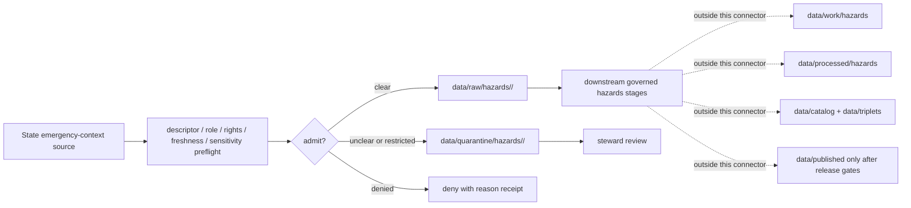

<!-- [KFM_META_BLOCK_V2]
doc_id: kfm://doc/connectors-state-emergency-context-readme
title: connectors/state-emergency-context/ — State Emergency Context Connector Lane
type: readme
version: v0.1
status: draft
owners: OWNER_TBD — Connector steward · Source steward · Hazards steward · State-context steward · Rights steward · Data steward · Validation steward · Docs steward
created: 2026-06-20
updated: 2026-06-20
policy_label: public-context; hazards-adjacent; not-life-safety; not-alert-authority; source-admission-only
related:
  - ../README.md
  - ../../docs/doctrine/directory-rules.md
  - ../../docs/architecture/hazards-trust-membrane.md
  - ../../docs/domains/hazards/SOURCE_ROLE_MATRIX.md
  - ../../docs/domains/hazards/SOURCE_REGISTRY.md
  - ../../docs/domains/hazards/PUBLICATION_AND_BOUNDARY.md
  - ../../docs/domains/hazards/SOURCES.md
  - ../../docs/sources/catalog/fema/openfema-disaster-declarations.md
  - ../../docs/runbooks/hazards/SOURCE_REFRESH_RUNBOOK.md
  - ../../docs/runbooks/hazards/PROMOTION_RUNBOOK.md
  - ../../data/registry/sources/
  - ../../data/raw/
  - ../../data/quarantine/
  - ../../data/receipts/
  - ../../data/proofs/
  - ../../policy/rights/
  - ../../policy/sensitivity/
  - ../../policy/release/
  - ../../release/
tags: [kfm, connectors, state-emergency-context, hazards, emergency-context, declarations, proclamations, administrative, not-alert-authority, not-life-safety, source-admission, raw, quarantine, governance]
notes:
  - "Draft connector lane for state emergency-context source intake and admission helpers."
  - "Placement is draft / ADR-class: state-emergency-context is not listed in Directory Rules §7.3 canonical connector roots unless later ratified."
  - "This lane is contextual only. KFM is not an emergency alert system, not a life-safety instruction surface, and not an official warning authority."
  - "State emergency-context records are typically administrative/context records; do not collapse declarations, proclamations, situation reports, or status summaries into observed hazard events."
  - "Connector output may enter raw or quarantine admission lanes only."
  - "This README defines a connector/source-admission boundary, not Hazards doctrine, state emergency authority, alert authority, life-safety guidance, regulatory/legal determination, SourceDescriptor authority, policy authority, schema authority, catalog/triplet authority, proof authority, release authority, public API behavior, or public UI behavior."
[/KFM_META_BLOCK_V2] -->

<a id="top"></a>

# State Emergency Context Connector

> Draft source-admission boundary for state-level emergency-context records used as hazards context, never as KFM-issued alerts or life-safety guidance.

<p>
  
  
  
  
  
  
</p>

`connectors/state-emergency-context/`

## Quick jumps

[Scope](#scope) · [Repo fit](#repo-fit) · [Admission model](#admission-model) · [Lifecycle sketch](#lifecycle-sketch) · [Authority boundary](#authority-boundary) · [Inputs](#inputs) · [Exclusions](#exclusions) · [Admission posture](#admission-posture) · [Anti-collapse posture](#anti-collapse-posture) · [Validation](#validation) · [Definition of done](#definition-of-done)

---

## Scope

`connectors/state-emergency-context/` is a draft connector lane for state-level emergency-context source intake and admission helpers.

This folder may contain connector-local documentation, source-admission helpers, source-reference manifest builders, descriptor-gated client helpers, declaration/proclamation parsers, situation/status context parsers, freshness/expiry helpers, official-source-link helpers, provenance/digest helpers, no-network fixture pointers, and raw/quarantine handoff adapters for approved source material.

It must not become Hazards doctrine, emergency alert authority, life-safety guidance, official current-warning surface, legal/regulatory determination, state emergency-management authority, SourceDescriptor authority, policy authority, schema authority, catalog/triplet authority, proof authority, release authority, public API behavior, public UI behavior, public map authority, or publication authority.

> [!IMPORTANT]
> **Status:** draft / `NEEDS VERIFICATION`  
> **Owner:** `OWNER_TBD`  
> **Path:** `connectors/state-emergency-context/`  
> **Truth posture:** the path exists in the repository as this README; actual connector code, source descriptors, state source inventory, endpoint behavior, terms, freshness rules, tests, fixtures, parser behavior, CI wiring, and release behavior remain `NEEDS VERIFICATION`.

---

## Repo fit

```text
connectors/
└── state-emergency-context/
    └── README.md
```

Related responsibility roots:

```text
connectors/state-emergency-context/        # this draft connector lane
docs/architecture/hazards-trust-membrane.md # hazards trust membrane and not-alert-authority doctrine
docs/domains/hazards/                      # hazards source-role, publication, and boundary doctrine
docs/sources/catalog/fema/                 # FEMA declaration context for related administrative records
data/registry/sources/                     # source descriptors and activation state
data/raw/                                  # raw staged source outputs by owning domain
data/quarantine/                           # held material requiring source/role/rights/sensitivity review
data/receipts/                             # ingest, checksum, source-role, freshness, and review receipts
data/proofs/                               # EvidenceBundles and proof packs
policy/rights/                             # terms, attribution, and source-use review
policy/sensitivity/                        # sensitive context and release constraints
policy/release/                            # hazards release gates and not-alert-authority controls
release/                                   # release decisions, manifests, rollback, correction state
```

> [!WARNING]
> `connectors/state-emergency-context/` is a draft/open connector placement. Do not activate this connector until placement, source descriptors, rights policy, freshness rules, source-role mapping, fixtures, and validation gates are accepted.

---

## Admission model

State emergency-context source material must be admitted source-role-first, freshness-first, and not-alert-authority-first.

| Concern | Required connector posture |
|---|---|
| Source identity | Preserve source agency, record family, descriptor reference, source URL/reference, source date, rights posture, citation posture, and digest. |
| Source role | Default to administrative/context unless the SourceDescriptor assigns another role; do not relabel as observed hazard event. |
| Event distinction | Preserve incident type, declaration/proclamation/status record identity, and explicit distinction from observed hazard observations. |
| Freshness | Preserve issue date, effective date, expiration/end date when present, retrieval time, and stale-state review. |
| Geography | Preserve jurisdiction, county/tribal/state scope, geometry source, and uncertainty; do not infer precise hazard extent from administrative coverage. |
| Official source link | Preserve official source URL and attribution so downstream surfaces can defer to the issuing authority. |
| Publication | No connector output is public. Publication is a separate governed transition outside this folder. |

---

## Lifecycle sketch



> [!CAUTION]
> Connector code admits, quarantines, or rejects source material. It does not decide life-safety meaning, current-warning status, official emergency action, public suitability, legal/regulatory meaning, or release state. Promotion remains a governed state transition, not a file move.

---

## Authority boundary

```text
OUTPUT LIMIT:
  data/raw/hazards/<source_id>/<run_id>/
  data/quarantine/hazards/<source_id>/<run_id>/

NOT HERE:
  emergency alert authority
  life-safety guidance
  current-warning authority
  official emergency-management authority
  observed hazard-event truth
  legal or regulatory determination
  Hazards domain doctrine
  SourceDescriptor authority
  rights, sensitivity, or release policy
  processed hazards records
  catalog records
  triplet records
  public map artifacts
  receipts/proofs as authority
  release decisions
  public API behavior
  public UI behavior
```

---

## Inputs

| Accepted item | Required posture |
|---|---|
| Source-reference manifest | Preserve source agency, descriptor reference, source URL, source date, retrieval/import date, rights posture, sensitivity posture, and digest. |
| Declaration/proclamation parser | Preserve record id, action type, incident type, issue/effective/end dates, jurisdiction scope, source URL, and administrative role. |
| Status/context parser | Preserve source context, timestamp, update cadence, stale-state fields, and attribution. |
| Geography helper | Preserve source geography, jurisdiction scope, county/state identifiers, geometry source, and caveats. |
| Freshness helper | Preserve issue/effective/end/retrieval times and flag stale or unclear state. |
| Official-source-link helper | Preserve display-ready attribution and deferral link without generating instructions. |
| Test references | Point to owning fixture/test roots; fixtures do not become source authority. |

---

## Exclusions

| Do not store here | Correct home |
|---|---|
| Hazards doctrine and trust membrane | `docs/domains/hazards/`, `docs/architecture/hazards-trust-membrane.md` |
| Source-family/product doctrine | `docs/sources/catalog/` |
| Authoritative SourceDescriptor records | `data/registry/sources/` |
| Rights, sensitivity, or release rules | `policy/rights/`, `policy/sensitivity/`, `policy/release/` |
| Processed hazards records or derived layers | `data/processed/` |
| Catalog or triplet records | `data/catalog/`, `data/triplets/` |
| Public map artifacts | `data/published/` after governed release |
| Receipts and proof packs as authority | `data/receipts/`, `data/proofs/` |
| Schemas or semantic contracts | `schemas/`, `contracts/` |
| Public API or UI behavior | `apps/governed-api/`, `apps/explorer-web/` |

---

## Admission posture

State emergency-context intake should preserve source identity, source descriptor reference, source agency, record id, action/status type, source role, role basis, incident type, issue/effective/end dates, retrieval time, jurisdiction scope, geometry source, official source URL, citation fields, digest, freshness state, review state, quarantine reason, and release-blocking flags.

---

## Anti-collapse posture

| Rule | Connector implication |
|---|---|
| KFM is not an alert authority. | Connector output must never become KFM-issued emergency guidance. |
| Administrative record is not observation. | Declarations and proclamations do not prove observed hazard extent or impact. |
| Context is not current warning. | Expired or unclear operational context must not appear current. |
| Jurisdiction is not impact geometry. | Administrative coverage does not equal physical hazard footprint. |
| State context is not FEMA context. | Preserve state/federal/local source identity and do not merge authorities silently. |
| Public display is downstream. | The connector must not build public API/UI/map/release payloads. |

---

## Validation

Before relying on this connector, verify:

- placement is ratified or recorded in the drift/open-question register;
- source descriptors exist and validate;
- source-role and freshness gates are implemented;
- rights, sensitivity, and release gates fail closed;
- tests use safe no-network fixtures;
- outputs are limited to raw or quarantine admission lanes;
- downstream receipts, proofs, catalog/triplet records, public artifacts, and release records are produced only outside this connector;
- public results preserve official-source deferral and not-alert-authority limitations.

---

## Definition of done

- [ ] Owners are confirmed and `OWNER_TBD` is replaced.
- [ ] Connector placement is resolved by ADR, migration note, or Directory Rules update, or recorded as open drift.
- [ ] Actual connector contents are inventoried.
- [ ] State source inventory, SourceDescriptor IDs, source roles, rights, freshness, sensitivity, and activation state are verified.
- [ ] Tests prevent alert-authority collapse, observation collapse, stale-current collapse, jurisdiction-as-impact collapse, rights bypass, sensitivity bypass, and public-release misuse.
- [ ] Outputs are verified to enter raw or quarantine admission lanes only.
- [ ] No source-family, domain, processed, catalog, triplet, published, release, schema, policy, proof, receipt, registry, fixture, API, UI, or public-claim authority lives here.
- [ ] Tests, fixtures, and CI behavior are verified or marked `NEEDS VERIFICATION`.

---

## Status summary

`connectors/state-emergency-context/` is for contextual state emergency source-admission code only. It is not alert authority, life-safety guidance, current-warning authority, official emergency-management authority, observed event truth, Hazards doctrine, policy authority, schema authority, catalog/triplet authority, proof closure, release authority, public map authority, public API behavior, public UI behavior, or pipeline authority.

<p align="right"><a href="#top">Back to top</a></p>
