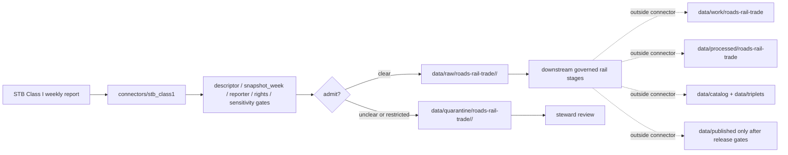

<!-- [KFM_META_BLOCK_V2]
doc_id: kfm://doc/connectors-stb-class1-readme
title: connectors/stb_class1/ — STB Class I Weekly Reports Connector Lane
type: readme
version: v0.1
status: draft
owners: OWNER_TBD — Connector steward · Source steward · STB steward · Roads-Rail-Trade steward · Freight/Rail steward · Data steward · Validation steward · Docs steward
created: 2026-06-20
updated: 2026-06-20
policy_label: public; rail-operational-context; weekly-snapshot; source-admission-only
related:
  - ../README.md
  - ../../docs/doctrine/directory-rules.md
  - ../../docs/sources/catalog/usdot/README.md
  - ../../docs/sources/catalog/usdot/stb-class1.md
  - ../../docs/sources/catalog/usdot/fra-gcis.md
  - ../../docs/sources/catalog/usdot/fra-form57.md
  - ../../docs/sources/catalog/usdot/ntad.md
  - ../../docs/domains/roads-rail-trade/README.md
  - ../../docs/domains/roads-rail-trade/SOURCE_REGISTRY.md
  - ../../data/registry/sources/
  - ../../data/raw/
  - ../../data/quarantine/
  - ../../data/receipts/
  - ../../data/proofs/
  - ../../policy/rights/
  - ../../policy/sensitivity/
  - ../../release/
tags: [kfm, connectors, stb, stb-class1, rail, class-i, weekly-reports, tabular, snapshot-week, operational-metrics, roads-rail-trade, source-admission, raw, quarantine, governance]
notes:
  - "Draft connector lane for STB Class I Weekly Reports source intake and admission helpers."
  - "Placement is draft / ADR-class: docs/sources/catalog/usdot/stb-class1.md links to connectors/stb_class1/, but the usdot family and this connector root are beyond Directory Rules §7.3 unless later ratified."
  - "STB Class I Weekly Reports are tabular weekly operational snapshots with no native geometry; joins to rail geometry must be downstream, receipted, and de-duplicated."
  - "Snapshot-week overlap discipline is load-bearing: every emitted record must preserve precise snapshot_week and downstream joins must not double-count overlapping weekly releases."
  - "STB is curator/publisher; the reporting Class I carrier is the substantive per-row reporter where applicable. Preserve both attribution tiers."
  - "Connector output may enter raw or quarantine admission lanes only."
  - "This README defines a connector/source-admission boundary, not STB product doctrine, USDOT family truth, rail truth, operational-status truth, regulatory/legal determination, SourceDescriptor authority, policy authority, schema authority, catalog/triplet authority, proof authority, release authority, public API behavior, or public UI behavior."
[/KFM_META_BLOCK_V2] -->

<a id="top"></a>

# STB Class I Weekly Reports Connector

> Draft source-admission boundary for Surface Transportation Board Class I weekly rail operational reports.

<p>
  
  
  
  
  
  
  
</p>

`connectors/stb_class1/`

## Quick jumps

[Scope](#scope) · [Repo fit](#repo-fit) · [Admission model](#admission-model) · [Snapshot-week discipline](#snapshot-week-discipline) · [Lifecycle sketch](#lifecycle-sketch) · [Authority boundary](#authority-boundary) · [Inputs](#inputs) · [Exclusions](#exclusions) · [Anti-collapse posture](#anti-collapse-posture) · [Validation](#validation) · [Definition of done](#definition-of-done)

---

## Scope

`connectors/stb_class1/` is a draft connector lane for STB Class I Weekly Reports source intake and admission helpers.

This folder may contain connector-local documentation, source-admission helpers, descriptor-gated client helpers, weekly snapshot manifest builders, tabular parsers, reporting-carrier attribution helpers, snapshot-week normalization helpers, overlap de-duplication helpers, provenance/digest helpers, no-network fixture pointers, and raw/quarantine handoff adapters for approved source material.

It must not become STB product doctrine, USDOT family truth, Roads/Rail/Trade domain truth, rail network truth, rail condition truth, operational-status truth, regulatory/legal determination, SourceDescriptor authority, policy authority, schema authority, catalog/triplet authority, proof authority, release authority, public API behavior, public UI behavior, public map authority, or publication authority.

> [!IMPORTANT]
> **Status:** draft / `NEEDS VERIFICATION`  
> **Owner:** `OWNER_TBD`  
> **Path:** `connectors/stb_class1/`  
> **Truth posture:** the path exists in the repository as this README; actual connector code, endpoint behavior, current metric schema, current carrier roster, source descriptors, rights terms, tests, fixtures, parser behavior, CI wiring, and release behavior remain `NEEDS VERIFICATION`.

---

## Repo fit

```text
connectors/
└── stb_class1/
    └── README.md
```

Related responsibility roots:

```text
connectors/stb_class1/                    # this draft connector lane
docs/sources/catalog/usdot/stb-class1.md  # STB Class I product doctrine
docs/sources/catalog/usdot/               # transportation source-family docs; placement open
docs/domains/roads-rail-trade/            # rail/trade domain doctrine
data/registry/sources/                    # source descriptors and activation state
data/raw/                                 # raw staged source outputs by owning domain
data/quarantine/                          # held material requiring source/role/rights/sensitivity review
data/receipts/                            # ingest, checksum, snapshot-week, transform, join, and review receipts
data/proofs/                              # EvidenceBundles and proof packs
policy/rights/                            # terms, attribution, and source-use review
policy/sensitivity/                       # carrier/operator-detail and join-sensitivity rules
release/                                  # release decisions, manifests, rollback, correction state
```

> [!WARNING]
> `connectors/stb_class1/` is a draft/open connector placement. The STB Class I product page points to this connector path, but the broader `usdot/` family and this connector root are beyond the canonical connector roots until accepted by ADR, migration note, or updated Directory Rules.

---

## Admission model

STB Class I Weekly Reports must be admitted snapshot-first, reporter-first, and source-role-first.

| Concern | Required connector posture |
|---|---|
| Source identity | Preserve STB product identity, descriptor reference, source URL/reference, retrieval date, rights posture, citation posture, and digest. |
| Snapshot identity | Preserve precise `snapshot_week`, reporting period convention, release date, and source vintage. |
| Reporter attribution | Preserve STB as curator/publisher and reporting carrier as substantive reporter where applicable. |
| Source role | Preserve observed operational-report posture at the per-carrier/per-metric/per-week level, pending SourceDescriptor confirmation. |
| Metric schema | Preserve metric names, units, carrier scope, system/terminal/segment scope where present, and schema version. |
| Geometry | Preserve that the product is tabular/no-native-geometry; rail geometry joins are downstream and separately receipted. |
| Sensitivity | Flag commercially or operationally sensitive joins for review before release. |
| Publication | No connector output is public. Publication is a separate governed transition outside this folder. |

---

## Snapshot-week discipline

STB Class I records are weekly snapshots. Overlap and cadence handling are load-bearing.

Required connector behavior:

- every admitted row carries a normalized `snapshot_week` or explicit quarantine reason;
- reporting period convention is preserved, not guessed;
- release date and retrieval date are preserved separately;
- duplicate or overlapping releases are detected and receipted;
- downstream joins must de-duplicate by snapshot identity and carrier/metric identity;
- missing or ambiguous snapshot week routes to quarantine;
- weekly operational metrics are not interpreted as real-time rail condition.

---

## Lifecycle sketch



> [!CAUTION]
> Connector code admits, quarantines, or rejects source material. It does not decide rail network truth, current operational status, regulatory/legal meaning, public suitability, or release state. Promotion remains a governed state transition, not a file move.

---

## Authority boundary

```text
OUTPUT LIMIT:
  data/raw/roads-rail-trade/<source_id>/<run_id>/
  data/quarantine/roads-rail-trade/<source_id>/<run_id>/

NOT HERE:
  STB product doctrine
  USDOT family truth
  rail network truth
  operational-status truth
  regulatory or legal determination
  SourceDescriptor authority
  metric schema authority
  geometry join authority
  rights or sensitivity policy
  processed rail records
  catalog records
  triplet records
  public map artifacts
  receipts/proofs as authority
  release decisions
  public API behavior
  public UI behavior
```

---

## Inputs

| Accepted item | Required posture |
|---|---|
| Source-reference manifest | Preserve STB product identity, descriptor reference, source URL, retrieval/import date, rights posture, sensitivity posture, and digest. |
| Weekly report parser | Preserve snapshot week, release date, reporting period convention, carrier identity, metric name, units, and raw value. |
| Carrier attribution helper | Preserve STB curator/publisher attribution and reporting-carrier attribution separately. |
| Metric schema helper | Preserve metric inventory, schema version, column names, units, and missing/changed-field diagnostics. |
| Overlap detector | Preserve duplicate/overlap comparison, snapshot-week key, row identity, and de-duplication receipt. |
| Join helper | Preserve carrier/reporting-week join keys and mark downstream geometry joins as separate transforms. |
| Test references | Point to owning fixture/test roots; fixtures do not become source authority. |

---

## Exclusions

| Do not store here | Correct home |
|---|---|
| STB Class I product doctrine | `docs/sources/catalog/usdot/stb-class1.md` |
| USDOT / transportation source-family doctrine | `docs/sources/catalog/usdot/` |
| Roads/Rail/Trade domain doctrine | `docs/domains/roads-rail-trade/` |
| Authoritative SourceDescriptor records | `data/registry/sources/` |
| Rights or sensitivity rules | `policy/rights/`, `policy/sensitivity/` |
| Processed rail records or derived joins | `data/processed/` |
| Catalog or triplet records | `data/catalog/`, `data/triplets/` |
| Public map artifacts | `data/published/` after governed release |
| Receipts and proof packs as authority | `data/receipts/`, `data/proofs/` |
| Schemas or semantic contracts | `schemas/`, `contracts/` |
| Public API or UI behavior | `apps/governed-api/`, `apps/explorer-web/` |

---

## Anti-collapse posture

| Rule | Connector implication |
|---|---|
| Weekly snapshot is not real-time state. | Preserve snapshot_week and stale-state caveats. |
| STB curator is not always substantive observer. | Preserve reporting carrier per row where applicable. |
| Tabular report is not rail geometry. | Geometry/network joins are downstream transforms with receipts. |
| Operational metric is not regulatory determination. | Preserve observed/administrative context without legal overclaim. |
| STB is not NTAD or FRA. | Keep STB operational reports separate from NTAD, GCIS, and Form 57. |
| Public display is downstream. | The connector must not build public API/UI/map/release payloads. |

---

## Validation

Before relying on this connector, verify:

- connector placement is ratified or recorded in the drift/open-question register;
- source descriptors exist and validate;
- current STB access path, metric schema, carrier roster, rights terms, and cadence are verified;
- snapshot-week normalization and overlap detection are tested;
- reporter attribution is preserved;
- tests use safe no-network fixtures;
- outputs are limited to raw or quarantine admission lanes;
- downstream receipts, proofs, catalog/triplet records, public artifacts, and release records are produced only outside this connector;
- public products preserve caveats, release approval, rollback path, and correction path.

---

## Definition of done

- [ ] Owners are confirmed and `OWNER_TBD` is replaced.
- [ ] Connector placement is resolved by ADR, migration note, or Directory Rules update, or recorded as open drift.
- [ ] Actual connector contents are inventoried.
- [ ] SourceDescriptor IDs, source roles, carrier attribution, metric schema, rights, sensitivity, cadence, and activation state are verified.
- [ ] Snapshot-week normalization and overlap de-duplication are implemented and tested.
- [ ] Tests prevent snapshot collapse, STB/carrier attribution collapse, geometry-join collapse, metric-schema drift, rights bypass, sensitivity bypass, and public-release misuse.
- [ ] Outputs are verified to enter raw or quarantine admission lanes only.
- [ ] No source-family, product, domain, processed, catalog, triplet, published, release, schema, policy, proof, receipt, registry, fixture, API, UI, or public-claim authority lives here.
- [ ] Tests, fixtures, and CI behavior are verified or marked `NEEDS VERIFICATION`.

---

## Status summary

`connectors/stb_class1/` is for STB Class I Weekly Reports source-admission code only. It is not STB product doctrine, USDOT family truth, rail network truth, operational-status truth, regulatory/legal determination, SourceDescriptor authority, metric schema authority, geometry join authority, policy authority, schema authority, catalog/triplet authority, proof closure, release authority, public map authority, public API behavior, public UI behavior, or pipeline authority.

<p align="right"><a href="#top">Back to top</a></p>
