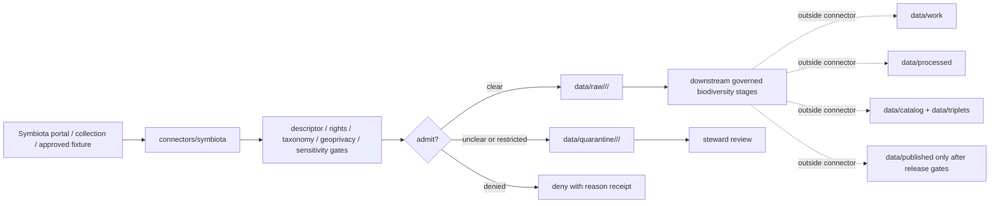

<!-- [KFM_META_BLOCK_V2]
doc_id: kfm://doc/connectors-symbiota-readme
title: connectors/symbiota/ — Symbiota Connector Lane
type: readme
version: v0.1
status: draft
owners: OWNER_TBD — Connector steward · Source steward · Flora steward · Fauna steward · Habitat steward · Biodiversity steward · Rights steward · Sensitivity reviewer · Data steward · Validation steward · Docs steward
created: 2026-06-20
updated: 2026-06-20
policy_label: public; biodiversity-occurrence; specimen-aggregator; geoprivacy-controlled; source-admission-only
related:
  - ../README.md
  - ../../docs/doctrine/directory-rules.md
  - ../../docs/sources/catalog/gbif/README.md
  - ../../docs/sources/catalog/kansas/kbs.md
  - ../../docs/domains/flora/README.md
  - ../../docs/domains/flora/modalities/README.md
  - ../../docs/domains/flora/modalities/M3-VOUCHER.md
  - ../../docs/domains/fauna/README.md
  - ../../docs/domains/habitat/README.md
  - ../../data/registry/sources/
  - ../../data/raw/
  - ../../data/quarantine/
  - ../../data/receipts/
  - ../../data/proofs/
  - ../../policy/rights/
  - ../../policy/sensitivity/
  - ../../release/
tags: [kfm, connectors, symbiota, biodiversity, specimen, occurrence, darwin-core, flora, fauna, habitat, herbarium, museum, geoprivacy, sensitivity, source-admission, raw, quarantine, governance]
notes:
  - "Draft connector lane for Symbiota biodiversity occurrence and specimen-collection source intake."
  - "Placement is draft / ADR-class: symbiota/ is not listed in Directory Rules §7.3 canonical connector roots unless later ratified."
  - "No dedicated docs/sources/catalog/symbiota product page was found during this edit; source-family/product doctrine remains NEEDS VERIFICATION."
  - "Repo evidence currently references Symbiota as part of the biodiversity stack alongside iDigBio and other specimen/occurrence sources, and KBS/KANU docs emphasize specimen-backed occurrence records and restricted-taxa quarantine."
  - "Symbiota records must preserve originating institution, collection, dataset, occurrence/specimen identity, license/rights, Darwin Core fields, taxonomic anchors, geoprivacy/sensitivity flags, and source digest."
  - "Connector output may enter raw or quarantine admission lanes only."
  - "This README defines a connector/source-admission boundary, not Symbiota source-family truth, specimen truth, taxonomic authority, occurrence verification, conservation-status authority, sensitivity policy, SourceDescriptor authority, schema authority, catalog/triplet authority, proof authority, release authority, public API behavior, or public UI behavior."
[/KFM_META_BLOCK_V2] -->

<a id="top"></a>

# Symbiota Connector

> Draft source-admission boundary for Symbiota biodiversity occurrence and specimen-collection source material.

<p>
  
  
  
  
  
  
</p>

`connectors/symbiota/`

## Quick jumps

[Scope](#scope) · [Repo fit](#repo-fit) · [Admission model](#admission-model) · [Lifecycle sketch](#lifecycle-sketch) · [Authority boundary](#authority-boundary) · [Inputs](#inputs) · [Exclusions](#exclusions) · [Admission posture](#admission-posture) · [Anti-collapse posture](#anti-collapse-posture) · [Validation](#validation) · [Definition of done](#definition-of-done)

---

## Scope

`connectors/symbiota/` is a draft connector lane for Symbiota biodiversity occurrence and specimen-collection source intake.

This folder may contain connector-local documentation, source-admission helpers, descriptor-gated client helpers, collection/dataset manifest builders, Darwin Core parsing helpers, occurrence/specimen identity helpers, taxonomic crosswalk helpers, geoprivacy/sensitivity preflight helpers, rights/attribution helpers, provenance/digest helpers, no-network fixture pointers, and raw/quarantine handoff adapters for approved source material.

It must not become Symbiota source-family doctrine, source descriptor authority, Flora domain truth, Fauna domain truth, Habitat domain truth, specimen verification authority, taxonomic authority, conservation-status authority, sensitivity policy authority, rights policy authority, schema authority, catalog/triplet authority, proof authority, release authority, public API behavior, public UI behavior, public map authority, or publication authority.

> [!IMPORTANT]
> **Status:** draft / `NEEDS VERIFICATION`  
> **Owner:** `OWNER_TBD`  
> **Path:** `connectors/symbiota/`  
> **Truth posture:** the path exists in the repository as this README; actual connector code, source descriptors, collection inventory, endpoint behavior, rights terms, geoprivacy transforms, tests, fixtures, parser behavior, CI wiring, and release behavior remain `NEEDS VERIFICATION`.

---

## Repo fit

```text
connectors/
└── symbiota/
    └── README.md
```

Related responsibility roots:

```text
connectors/symbiota/                      # this draft connector lane
docs/sources/catalog/gbif/                # biodiversity aggregator posture; mentions Symbiota in stack
docs/sources/catalog/kansas/kbs.md        # KBS/KANU specimen and restricted-taxa posture
docs/domains/flora/                       # flora domain doctrine and occurrence controls
docs/domains/fauna/                       # fauna domain doctrine and occurrence controls
docs/domains/habitat/                     # habitat context and derived-use boundaries
data/registry/sources/                    # source descriptors and activation state
data/raw/                                 # raw staged source outputs by owning domain
data/quarantine/                          # held material requiring source/role/rights/sensitivity review
data/receipts/                            # ingest, checksum, geoprivacy, transform, and review receipts
data/proofs/                              # EvidenceBundles and proof packs
policy/rights/                            # license, attribution, and source-use review
policy/sensitivity/                       # geoprivacy, restricted taxa, and release constraints
release/                                  # release decisions, manifests, rollback, correction state
```

> [!WARNING]
> `connectors/symbiota/` is a draft/open connector placement. Do not activate this connector until placement, source descriptors, rights policy, sensitivity policy, collection inventory, fixtures, and validation gates are accepted.

---

## Admission model

Symbiota source material must be admitted collection-first, rights-first, sensitivity-first, and source-role-first.

| Concern | Required connector posture |
|---|---|
| Source identity | Preserve Symbiota portal/source, originating institution, collection, dataset, descriptor reference, source URL/reference, source date, rights posture, citation posture, and digest. |
| Occurrence/specimen identity | Preserve occurrence id, catalog number where allowed, institution/collection codes, basis of record, event date, determination fields, and source version. |
| Source role | Preserve observed/specimen-backed, aggregate, candidate, or authority/context roles as assigned by SourceDescriptor; do not upgrade by promotion. |
| Darwin Core | Preserve native DwC fields and avoid silent remapping into KFM objects without contracts and receipts. |
| Taxonomy | Preserve supplied scientific name, taxon identifiers, determination history where allowed, and crosswalk status to accepted KFM taxonomy anchors. |
| Geoprivacy | Preserve supplied coordinate uncertainty, obscuration/generalization, restricted-taxa flags, and release-blocking review state. |
| Rights | Preserve license, attribution, dataset terms, and collection-level constraints before downstream use. |
| Publication | No connector output is public. Publication is a separate governed transition outside this folder. |

---

## Lifecycle sketch



> [!CAUTION]
> Connector code admits, quarantines, or rejects source material. It does not decide specimen verification, taxonomic authority, conservation status, public release, public map precision, or final occurrence truth. Promotion remains a governed state transition, not a file move.

---

## Authority boundary

```text
OUTPUT LIMIT:
  data/raw/<domain>/<source_id>/<run_id>/
  data/quarantine/<domain>/<source_id>/<run_id>/

NOT HERE:
  Symbiota source-family doctrine
  Flora / Fauna / Habitat domain truth
  specimen verification authority
  taxonomic authority
  conservation-status authority
  SourceDescriptor authority
  rights or sensitivity policy
  geoprivacy policy
  processed biodiversity records
  catalog records
  triplet records
  public map artifacts
  receipts/proofs as authority
  release decisions
  public API behavior
  public UI behavior
```

---

## Inputs

| Accepted item | Required posture |
|---|---|
| Source-reference manifest | Preserve portal/source, collection, dataset, descriptor reference, rights posture, sensitivity posture, source date, retrieval/import date, and digest. |
| Darwin Core archive or record parser | Preserve occurrence/specimen identity, basis of record, event date, locality fields, coordinate uncertainty, taxon fields, institution/collection fields, and source version. |
| Taxonomic helper | Preserve supplied names and identifiers while recording crosswalk status to KFM taxonomy anchors. |
| Geoprivacy helper | Preserve obscured/generalized coordinates, uncertainty, restriction flags, transform receipts, and release-blocking state. |
| Rights helper | Preserve license, attribution, dataset citation, collection terms, and derivative-use posture. |
| Collection inventory helper | Preserve collection code, institution, dataset id, update/cadence, and portal/source URL. |
| Test references | Point to owning fixture/test roots; fixtures do not become source authority. |

---

## Exclusions

| Do not store here | Correct home |
|---|---|
| Symbiota source-family/product doctrine | `docs/sources/catalog/` after accepted placement |
| Flora, Fauna, or Habitat doctrine | `docs/domains/flora/`, `docs/domains/fauna/`, `docs/domains/habitat/` |
| Authoritative SourceDescriptor records | `data/registry/sources/` |
| Rights, sensitivity, or geoprivacy rules | `policy/rights/`, `policy/sensitivity/` |
| Processed occurrence/specimen records | `data/processed/` |
| Catalog or triplet records | `data/catalog/`, `data/triplets/` |
| Public map artifacts | `data/published/` after governed release |
| Receipts and proof packs as authority | `data/receipts/`, `data/proofs/` |
| Schemas or semantic contracts | `schemas/`, `contracts/` |
| Public API or UI behavior | `apps/governed-api/`, `apps/explorer-web/` |

---

## Admission posture

Symbiota intake should preserve source identity, source descriptor reference, portal, originating institution, collection, dataset, occurrence/specimen identifiers, Darwin Core fields, source date, retrieval time, event date, taxon fields, taxonomic crosswalk state, geometry precision, coordinate uncertainty, geoprivacy transform state, rights/citation fields, digest, review state, quarantine reason, and release-blocking flags.

---

## Anti-collapse posture

| Rule | Connector implication |
|---|---|
| Aggregator is not originator. | Preserve originating institution and collection, not only portal identity. |
| Specimen-backed record is not final truth. | Preserve evidence and review state; downstream validation decides publication. |
| Taxon name is not accepted taxonomy. | Preserve supplied name and crosswalk status separately. |
| Coordinates are not automatically public. | Geoprivacy and restricted-taxa controls must fail closed. |
| DwC fields are not KFM contracts. | Preserve native fields until mapped by contracts and receipts. |
| Source role is fixed at admission. | Do not upgrade candidate/aggregate/observed roles during promotion. |
| Public display is downstream. | The connector must not build public API/UI/map/release payloads. |

---

## Validation

Before relying on this connector, verify:

- connector placement is ratified or recorded in the drift/open-question register;
- dedicated Symbiota source-family/product doctrine exists or an accepted source catalog reference is linked;
- source descriptors exist and validate;
- collection inventory, endpoint behavior, rights terms, and update cadence are verified;
- Darwin Core parsing preserves occurrence/specimen identity and native fields;
- taxonomy, geoprivacy, rights, and sensitivity gates fail closed;
- tests use safe no-network fixtures;
- outputs are limited to raw or quarantine admission lanes;
- downstream receipts, proofs, catalog/triplet records, public artifacts, and release records are produced only outside this connector;
- public products preserve attribution, sensitivity transforms, release approval, rollback path, and correction path.

---

## Definition of done

- [ ] Owners are confirmed and `OWNER_TBD` is replaced.
- [ ] Connector placement is resolved by ADR, migration note, or Directory Rules update, or recorded as open drift.
- [ ] Actual connector contents are inventoried.
- [ ] Dedicated Symbiota source-family/product doctrine is created or accepted by source stewards.
- [ ] SourceDescriptor IDs, source roles, collection inventory, rights, sensitivity, taxonomy, geoprivacy, and activation state are verified.
- [ ] Tests prevent originator collapse, source-role collapse, taxonomic collapse, geoprivacy bypass, rights bypass, sensitivity bypass, and public-release misuse.
- [ ] Outputs are verified to enter raw or quarantine admission lanes only.
- [ ] No source-family, product, domain, processed, catalog, triplet, published, release, schema, policy, proof, receipt, registry, fixture, API, UI, or public-claim authority lives here.
- [ ] Tests, fixtures, and CI behavior are verified or marked `NEEDS VERIFICATION`.

---

## Status summary

`connectors/symbiota/` is for Symbiota biodiversity occurrence and specimen-collection source-admission code only. It is not Symbiota source-family doctrine, Flora/Fauna/Habitat truth, specimen verification authority, taxonomic authority, conservation-status authority, SourceDescriptor authority, policy authority, schema authority, catalog/triplet authority, proof closure, release authority, public map authority, public API behavior, public UI behavior, or pipeline authority.

<p align="right"><a href="#top">Back to top</a></p>
