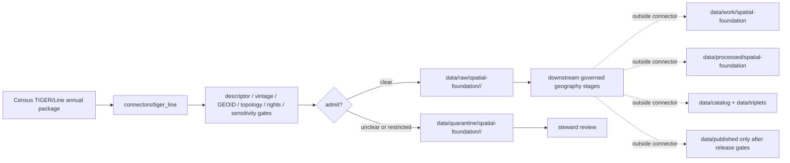

<!-- [KFM_META_BLOCK_V2]
doc_id: kfm://doc/connectors-tiger-line-readme
title: connectors/tiger_line/ — Census TIGER/Line Connector Alias Lane
type: readme
version: v0.1
status: draft
owners: OWNER_TBD — Connector steward · Source steward · Census steward · Spatial Foundation steward · Settlements-Infrastructure steward · Roads-Rail-Trade steward · Data steward · Validation steward · Docs steward
created: 2026-06-20
updated: 2026-06-20
policy_label: public; census-geography; administrative-geometry; vintage-controlled; source-admission-only
related:
  - ../README.md
  - ../../docs/doctrine/directory-rules.md
  - ../../docs/sources/catalog/census/README.md
  - ../../docs/sources/catalog/census/tiger-line.md
  - ../../docs/sources/catalog/census/acs-estimates.md
  - ../../docs/sources/catalog/census/decennial-microdata.md
  - ../../docs/sources/catalog/census/nhgis-compilations.md
  - ../../docs/domains/settlements-infrastructure/SOURCE_REGISTRY.md
  - ../../docs/domains/roads-rail-trade/ARCHITECTURE.md
  - ../../docs/sources/catalog/openstreetmap/README.md
  - ../../data/registry/sources/
  - ../../data/raw/
  - ../../data/quarantine/
  - ../../data/receipts/
  - ../../data/proofs/
  - ../../policy/rights/
  - ../../policy/sensitivity/
  - ../../release/
tags: [kfm, connectors, tiger-line, tiger_line, census, administrative-geometry, geoid, vintage, spatial-foundation, settlements-infrastructure, roads-rail-trade, source-admission, raw, quarantine, governance]
notes:
  - "Draft product-name connector lane for Census TIGER/Line Geography source intake and admission helpers."
  - "Placement is draft / ADR-class: tiger_line/ is not listed in Directory Rules §7.3 canonical connector roots unless later ratified; Census-family placement should be checked before activation."
  - "TIGER/Line is geometry, not Census attribute data. Attribute counts, estimates, and characteristics live in sibling Census products and join to TIGER by GEOID and matching vintage."
  - "Vintage handling is load-bearing. Cross-vintage joins require documented crosswalks and must not silently reuse a GEOID string across annual releases."
  - "TIGER/Line is distinct from Cartographic Boundary Files, cadastral/parcel geometry, legal boundary authority, GNIS names, authoritative hydrology, and canonical roads data."
  - "Connector output may enter raw or quarantine admission lanes only."
  - "This README defines a connector/source-admission boundary, not Census product doctrine, Spatial Foundation truth, legal-boundary truth, parcel/cadastral truth, hydrology truth, roads truth, SourceDescriptor authority, policy authority, schema authority, catalog/triplet authority, proof authority, release authority, public API behavior, or public UI behavior."
[/KFM_META_BLOCK_V2] -->

<a id="top"></a>

# Census TIGER/Line Connector Alias Lane

> Draft source-admission boundary for U.S. Census TIGER/Line geography source material.

<p>
  
  
  
  
  
  
</p>

`connectors/tiger_line/`

## Quick jumps

[Scope](#scope) · [Repo fit](#repo-fit) · [Relationship to Census lanes](#relationship-to-census-lanes) · [Admission model](#admission-model) · [Vintage discipline](#vintage-discipline) · [Lifecycle sketch](#lifecycle-sketch) · [Authority boundary](#authority-boundary) · [Inputs](#inputs) · [Exclusions](#exclusions) · [Anti-collapse posture](#anti-collapse-posture) · [Validation](#validation) · [Definition of done](#definition-of-done)

---

## Scope

`connectors/tiger_line/` is a draft product-name connector lane for Census TIGER/Line geography source intake and admission helpers.

This folder may contain connector-local documentation, source-admission helpers, descriptor-gated client helpers, annual-vintage manifest builders, shapefile/package inventory helpers, GEOID validation helpers, feature-class allow-list helpers, CRS/topology helpers, vintage-diff helpers, provenance/digest helpers, no-network fixture pointers, and raw/quarantine handoff adapters for approved source material.

It must not become Census product doctrine, Census family truth, Spatial Foundation truth, Settlements/Infrastructure truth, Roads/Rail truth, legal-boundary truth, parcel/cadastral truth, GNIS name authority, hydrology truth, road-network authority, SourceDescriptor authority, policy authority, schema authority, catalog/triplet authority, proof authority, release authority, public API behavior, public UI behavior, public map authority, or publication authority.

> [!IMPORTANT]
> **Status:** draft / `NEEDS VERIFICATION`  
> **Owner:** `OWNER_TBD`  
> **Path:** `connectors/tiger_line/`  
> **Truth posture:** the path exists in the repository as this README; actual connector code, Census-family placement, source descriptors, current pinned vintages, feature-class allow-lists, endpoints/access form, rights terms, tests, fixtures, parser behavior, CI wiring, and release behavior remain `NEEDS VERIFICATION`.

---

## Repo fit

```text
connectors/
└── tiger_line/
    └── README.md
```

Related responsibility roots:

```text
connectors/tiger_line/                    # this draft product-name connector lane
docs/sources/catalog/census/tiger-line.md # TIGER/Line product doctrine
docs/sources/catalog/census/              # Census source-family and sibling products
docs/domains/settlements-infrastructure/  # place / CDP / municipality consumers
docs/domains/roads-rail-trade/            # TIGER roads as one road-network input, not canonical road truth
docs/sources/catalog/openstreetmap/       # related non-Census road/place context source
data/registry/sources/                    # source descriptors and activation state
data/raw/                                 # raw staged source outputs by owning domain
data/quarantine/                          # held material requiring source/role/rights/sensitivity review
data/receipts/                            # ingest, checksum, vintage, topology, transform, and review receipts
data/proofs/                              # EvidenceBundles and proof packs
policy/rights/                            # terms, attribution, and source-use review
policy/sensitivity/                       # tribal, exact-location, infrastructure, and release rules
release/                                  # release decisions, manifests, rollback, correction state
```

> [!WARNING]
> `connectors/tiger_line/` is a draft/open connector placement. Do not activate this connector until placement, source descriptors, rights policy, vintage policy, feature-class allow-list, fixtures, and validation gates are accepted.

---

## Relationship to Census lanes

| Surface | Role | Connector implication |
|---|---|---|
| TIGER/Line | Detailed annual vector geometry keyed by GEOID and vintage. | This lane may admit geometry packages only after descriptor and vintage gates clear. |
| ACS estimates | Attribute estimates. | Do not fetch or store here; ACS joins to TIGER downstream by compatible GEOID/vintage. |
| Decennial counts / microdata | Census attribute products. | Do not collapse with TIGER geometry. |
| NHGIS compilations | Historical/compiled geography and data products. | Separate source-family/product posture; do not treat as modern TIGER. |
| Cartographic Boundary Files | Generalized thematic mapping geometries. | Separate product; do not mix with TIGER in the same join. |

No move, delete, rename, redirect, or deprecation is implied by this README.

---

## Admission model

TIGER/Line source material must be admitted geometry-first, vintage-first, and source-role-first.

| Concern | Required connector posture |
|---|---|
| Source identity | Preserve Census TIGER/Line product identity, descriptor reference, source URL/reference, package identity, release/vintage, rights posture, citation posture, and digest. |
| Feature class | Preserve Census feature class, layer name, intended use, geometry type, and allow-list status. |
| GEOID | Preserve GEOID fields and validation status; do not silently join across incompatible vintages. |
| Vintage | Preserve annual release year/vintage, retrieval date, package version, and vintage-diff receipt. |
| Geometry | Preserve CRS/projection, topology validation status, simplification/generalization status, and package-level geometry scope. |
| Source role | Preserve administrative-geometry posture and do not upgrade to legal-boundary, cadastral, hydrology, road-network, or name authority. |
| Rights and sensitivity | Require rights, attribution, and sensitivity review before downstream use, especially tribal/geographic surfaces. |
| Publication | No connector output is public. Publication is a separate governed transition outside this folder. |

---

## Vintage discipline

TIGER/Line vintage handling is load-bearing.

Required connector behavior:

- every admitted package carries a pinned TIGER/Line vintage or explicit quarantine reason;
- GEOID joins must match vintage or cite a documented crosswalk;
- skipped annual vintages must be detected and reviewed;
- feature-class schema drift routes to quarantine unless explicitly accepted;
- topology/CRS/projection uncertainty routes to quarantine;
- Cartographic Boundary Files and TIGER/Line must not be mixed silently;
- geometry generalization or simplification requires transform receipts;
- public products must be tied to release manifests and rollback targets.

---

## Lifecycle sketch



> [!CAUTION]
> Connector code admits, quarantines, or rejects source material. It does not decide legal boundary truth, cadastral/parcel truth, hydrology truth, road-network authority, public map release, or final geography interpretation. Promotion remains a governed state transition, not a file move.

---

## Authority boundary

```text
OUTPUT LIMIT:
  data/raw/<domain>/<source_id>/<run_id>/
  data/quarantine/<domain>/<source_id>/<run_id>/

NOT HERE:
  Census product doctrine
  Census family truth
  Spatial Foundation truth
  legal-boundary truth
  parcel/cadastral truth
  GNIS name authority
  hydrology truth
  road-network authority
  SourceDescriptor authority
  feature-schema authority
  rights or sensitivity policy
  processed geography records
  catalog records
  triplet records
  public map artifacts
  receipts/proofs as authority
  release decisions
  public API behavior
  public UI behavior
```

---

## Inputs

| Accepted item | Required posture |
|---|---|
| Source-reference manifest | Preserve Census/TIGER product identity, descriptor reference, source URL, package identity, vintage, retrieval/import date, rights posture, sensitivity posture, and digest. |
| Package inventory helper | Preserve archive contents, file identities, sizes, checksums, feature classes, and package receipt. |
| Feature-class parser | Preserve layer name, geometry type, schema, GEOID fields, feature count, and allow-list status. |
| GEOID validator | Preserve validation status, missing/invalid keys, vintage compatibility, and crosswalk requirement. |
| CRS/topology helper | Preserve projection/CRS, geometry validity, topology warnings, and repair/quarantine status. |
| Vintage-diff helper | Preserve prior/current vintage comparison, added/removed/changed features, and review state. |
| Generalization helper | Preserve simplification settings, scale profile, output intent, and transform receipt. |
| Test references | Point to owning fixture/test roots; fixtures do not become source authority. |

---

## Exclusions

| Do not store here | Correct home |
|---|---|
| TIGER/Line product doctrine | `docs/sources/catalog/census/tiger-line.md` |
| Census source-family doctrine | `docs/sources/catalog/census/` |
| Spatial Foundation, Settlements, or Roads doctrine | `docs/domains/` under owning domain |
| Authoritative SourceDescriptor records | `data/registry/sources/` |
| Rights or sensitivity rules | `policy/rights/`, `policy/sensitivity/` |
| Processed geography records or derived tiles | `data/processed/` |
| Catalog or triplet records | `data/catalog/`, `data/triplets/` |
| Public map artifacts | `data/published/` after governed release |
| Receipts and proof packs as authority | `data/receipts/`, `data/proofs/` |
| Schemas or semantic contracts | `schemas/`, `contracts/` |
| Public API or UI behavior | `apps/governed-api/`, `apps/explorer-web/` |

---

## Anti-collapse posture

| Rule | Connector implication |
|---|---|
| TIGER/Line is geometry, not Census attributes. | Keep counts/estimates/characteristics in sibling Census product lanes. |
| TIGER/Line is not CBF. | Detailed and generalized boundary products keep separate receipts and intended uses. |
| TIGER/Line is not cadastral. | Do not treat Census geometry as parcels, lots, ownership, or PLSS truth. |
| TIGER/Line is not legal-boundary authority. | Preserve administrative compilation posture and upstream legal-authority caveats. |
| TIGER hydrography is not hydrology authority. | Hydrology sources retain their own registries and roles. |
| TIGER roads are not canonical roads truth. | Roads/Rail uses TIGER as one input among several. |
| Vintage matters. | Do not join or publish across vintages without crosswalk and receipts. |
| Public display is downstream. | The connector must not build public API/UI/map/release payloads. |

---

## Validation

Before relying on this connector, verify:

- connector placement is ratified or recorded in the drift/open-question register;
- Census-family connector home is accepted;
- source descriptors exist and validate;
- current TIGER/Line access path, pinned vintage, feature-class allow-list, rights terms, and cadence are verified;
- GEOID, vintage, CRS, topology, and feature-schema gates are implemented;
- tests use safe no-network fixtures;
- outputs are limited to raw or quarantine admission lanes;
- downstream receipts, proofs, catalog/triplet records, public artifacts, and release records are produced only outside connectors;
- public products preserve vintage labels, caveats, release approval, rollback path, and correction path.

---

## Definition of done

- [ ] Owners are confirmed and `OWNER_TBD` is replaced.
- [ ] Connector placement is resolved by ADR, migration note, or Directory Rules update, or recorded as open drift.
- [ ] Actual connector contents are inventoried.
- [ ] SourceDescriptor IDs, source roles, pinned vintages, feature classes, rights, sensitivity, and activation state are verified.
- [ ] GEOID, vintage, CBF/TIGER separation, topology, CRS, schema-drift, rights, and sensitivity tests are implemented.
- [ ] Tests prevent Census-data/geometry collapse, CBF/TIGER collapse, legal-boundary collapse, cadastral collapse, hydrology collapse, roads collapse, rights bypass, sensitivity bypass, and public-release misuse.
- [ ] Outputs are verified to enter raw or quarantine admission lanes only.
- [ ] No source-family, product, domain, processed, catalog, triplet, published, release, schema, policy, proof, receipt, registry, fixture, API, UI, or public-claim authority lives here.
- [ ] Tests, fixtures, and CI behavior are verified or marked `NEEDS VERIFICATION`.

---

## Status summary

`connectors/tiger_line/` is for Census TIGER/Line geography source-admission code only. It is not Census product doctrine, Spatial Foundation truth, legal-boundary truth, cadastral/parcel truth, GNIS name authority, hydrology truth, road-network authority, SourceDescriptor authority, policy authority, schema authority, catalog/triplet authority, proof closure, release authority, public map authority, public API behavior, public UI behavior, or pipeline authority.

<p align="right"><a href="#top">Back to top</a></p>
