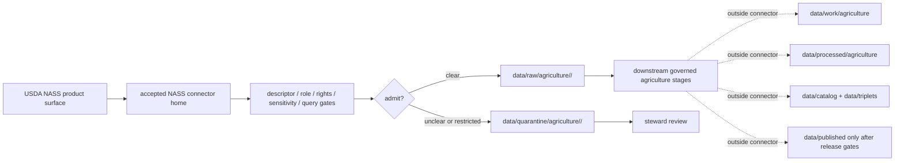

<!-- [KFM_META_BLOCK_V2]
doc_id: kfm://doc/connectors-usda-nass-readme
title: connectors/usda-nass/ — USDA NASS Connector Alias Lane
type: readme
version: v0.1
status: draft
owners: OWNER_TBD — Connector steward · Source steward · USDA steward · NASS steward · Agriculture steward · Data steward · Validation steward · Docs steward
created: 2026-06-20
updated: 2026-06-20
policy_label: public; alias-lane; agriculture-source; source-admission-only
related:
  - ../README.md
  - ../nass/README.md
  - ../../docs/doctrine/directory-rules.md
  - ../../docs/sources/catalog/usda/README.md
  - ../../docs/sources/catalog/usda/usda-nass-quickstats.md
  - ../../docs/sources/catalog/usda/usda-nass-cdl.md
  - ../../docs/domains/agriculture/SOURCE_REGISTRY.md
  - ../../docs/domains/agriculture/SOURCES.md
  - ../../docs/domains/agriculture/DATA_LIFECYCLE.md
  - ../../data/registry/sources/
  - ../../data/raw/
  - ../../data/quarantine/
  - ../../data/receipts/
  - ../../data/proofs/
  - ../../policy/rights/
  - ../../policy/sensitivity/
  - ../../release/
tags: [kfm, connectors, usda-nass, nass, usda, agriculture, quickstats, cdl, aggregate, crop, statistics, source-admission, raw, quarantine, source-role, governance]
notes:
  - "Draft USDA NASS connector alias/sibling lane."
  - "This lane does not supersede connectors/nass/; the existing NASS connector boundary currently lives there."
  - "Placement is draft / ADR-class: neither usda-nass/ nor nass/ is listed in Directory Rules §7.3 canonical connector roots unless later ratified."
  - "QuickStats is aggregate-only in KFM source-role posture; aggregate cells must not be joined to individual field, farm, or parcel truth."
  - "CDL and QuickStats are separate NASS products and must not collapse into one source role, cadence, geometry, or receipt path."
  - "Connector output may enter raw or quarantine admission lanes only."
  - "This README defines an alias/source-admission boundary, not USDA/NASS source-family truth, Agriculture doctrine, SourceDescriptor authority, crop truth, field truth, parcel truth, policy authority, schema authority, catalog/triplet authority, proof authority, release authority, public API behavior, or public UI behavior."
[/KFM_META_BLOCK_V2] -->

<a id="top"></a>

# USDA NASS Connector Alias Lane

> Draft short-name/source-family alias lane for USDA National Agricultural Statistics Service source material. The existing connector boundary is `connectors/nass/` unless governance settles a different canonical home.

<p>
  
  
  
  
  
  
</p>

`connectors/usda-nass/`

## Quick jumps

[Scope](#scope) · [Repo fit](#repo-fit) · [Relationship to `connectors/nass/`](#relationship-to-connectorsnass) · [Admission model](#admission-model) · [Aggregate-only discipline](#aggregate-only-discipline) · [Lifecycle sketch](#lifecycle-sketch) · [Authority boundary](#authority-boundary) · [Inputs](#inputs) · [Exclusions](#exclusions) · [Anti-collapse posture](#anti-collapse-posture) · [Validation](#validation) · [Definition of done](#definition-of-done)

---

## Scope

`connectors/usda-nass/` is a draft alias/sibling lane for USDA NASS source-admission material.

This README exists to prevent ambiguity between `usda-nass` naming and the existing `connectors/nass/` connector lane. Unless and until an ADR or migration note chooses `connectors/usda-nass/` as canonical, implementation work should prefer `connectors/nass/`.

This folder must not become a parallel connector implementation, USDA source-family doctrine, NASS product doctrine, Agriculture domain doctrine, SourceDescriptor authority, crop truth, field truth, parcel truth, policy authority, schema authority, catalog/triplet authority, proof authority, release authority, public API behavior, public UI behavior, or publication authority.

> [!IMPORTANT]
> **Status:** draft / `NEEDS VERIFICATION`  
> **Owner:** `OWNER_TBD`  
> **Path:** `connectors/usda-nass/`  
> **Truth posture:** the path exists in the repository as this README; whether it should remain an alias, redirect, tombstone, or canonical connector lane remains `NEEDS VERIFICATION` / ADR-class.

---

## Repo fit

```text
connectors/
├── nass/
│   └── README.md
└── usda-nass/
    └── README.md
```

Related responsibility roots:

```text
connectors/nass/                          # existing NASS connector lane
connectors/usda-nass/                     # this draft alias/sibling lane
docs/sources/catalog/usda/                # USDA/NASS product and source-family docs
docs/sources/catalog/usda/usda-nass-quickstats.md # QuickStats aggregate product doctrine
docs/sources/catalog/usda/usda-nass-cdl.md # Cropland Data Layer product doctrine
docs/domains/agriculture/                 # agriculture domain doctrine and source-role rules
data/registry/sources/                    # source descriptors and activation state
data/raw/                                 # raw staged source outputs by owning domain
data/quarantine/                          # held material requiring source/role/rights/sensitivity review
data/receipts/                            # ingest, checksum, query, aggregation, transform, and review receipts
data/proofs/                              # EvidenceBundles and proof packs
policy/rights/                            # terms, attribution, and source-use review
policy/sensitivity/                       # sensitive-join and release-safety rules
release/                                  # release decisions, manifests, rollback, correction state
```

---

## Relationship to `connectors/nass/`

| Path | Status | Use |
|---|---|---|
| `connectors/nass/README.md` | Existing NASS connector README | Current fuller connector boundary for USDA NASS intake. |
| `connectors/usda-nass/README.md` | This README | Alias/sibling boundary; not canonical until ratified. |

No move, delete, rename, redirect, or deprecation is implied by this README.

---

## Admission model

If this lane is ever activated, it must inherit the NASS connector rules.

| Concern | Required connector posture |
|---|---|
| Source identity | Preserve USDA NASS product identity, descriptor reference, source URL/reference, retrieval date, rights posture, citation posture, and digest. |
| Product separation | Preserve QuickStats, CDL, and any future NASS product as separate source surfaces with separate roles, cadences, schemas, and receipts. |
| Source role | Preserve aggregate, modeled/classified, administrative, or other assigned role from the SourceDescriptor; do not upgrade by promotion. |
| Query/API lineage | Preserve endpoint, parameters, response status, retrieval time, row count, pagination/chunking, and response digest for query surfaces. |
| Aggregation unit | Preserve geography, year/period, commodity, statistic, unit, aggregation scope, and series metadata. |
| Rights and sensitivity | Require rights, attribution, source-use, and sensitive-join review before downstream use. |
| Publication | No connector output is public. Publication is a separate governed transition outside this folder. |

---

## Aggregate-only discipline

NASS QuickStats is aggregate data in KFM posture.

Required connector behavior:

- aggregate cells must preserve aggregation unit, commodity, statistic, unit, year/period, geography, and source query;
- aggregate cells must not be interpreted as individual farm, field, parcel, person, or event records;
- joins from aggregate cells to individual field/parcel claims must be denied or quarantined;
- geometry joins must preserve aggregation scope and not imply finer precision;
- corrections or role changes require a new descriptor/correction path, not in-place role edits;
- AI/public surfaces must abstain from field-level claims derived only from NASS aggregates.

---

## Lifecycle sketch



> [!CAUTION]
> Connector code admits, quarantines, or rejects source material. It does not decide agricultural truth, field truth, parcel truth, crop truth, policy meaning, public suitability, or release state. Promotion remains a governed state transition, not a file move.

---

## Authority boundary

```text
OUTPUT LIMIT:
  data/raw/agriculture/<source_id>/<run_id>/
  data/quarantine/agriculture/<source_id>/<run_id>/

NOT HERE:
  USDA/NASS source-family truth
  NASS product doctrine
  Agriculture domain doctrine
  SourceDescriptor authority
  crop truth
  field truth
  parcel truth
  farm/person truth
  rights or sensitivity policy
  processed agriculture records
  catalog records
  triplet records
  public map artifacts
  receipts/proofs as authority
  release decisions
  public API behavior
  public UI behavior
```

---

## Inputs

| Accepted item | Required posture |
|---|---|
| Source-reference manifest | Preserve USDA/NASS product identity, descriptor reference, source URL, retrieval/import date, rights posture, sensitivity posture, and digest. |
| QuickStats query helper | Preserve endpoint, query parameters, row count, response status, retrieval time, pagination/chunking, aggregation unit, and response digest. |
| QuickStats row parser | Preserve commodity, statistic, unit, geography, year/period, aggregation unit, domain/category fields, and source query receipt. |
| CDL manifest/helper | Preserve product identity, raster vintage, classification/model caveats, resolution, source URL, rights posture, and digest. |
| Aggregate guard helper | Reject or quarantine field/parcel/person claims derived only from aggregate cells. |
| Material-change helper | Preserve source-head fields and change signals without publishing directly. |
| Test references | Point to owning fixture/test roots; fixtures do not become source authority. |

---

## Exclusions

| Do not store here | Correct home |
|---|---|
| USDA/NASS product doctrine | `docs/sources/catalog/usda/` |
| Agriculture domain doctrine | `docs/domains/agriculture/` |
| Authoritative SourceDescriptor records | `data/registry/sources/` |
| Rights or sensitivity rules | `policy/rights/`, `policy/sensitivity/` |
| Processed agriculture records or derived layers | `data/processed/` |
| Catalog or triplet records | `data/catalog/`, `data/triplets/` |
| Public artifacts | `data/published/` after governed release |
| Receipts and proof packs as authority | `data/receipts/`, `data/proofs/` |
| Schemas or semantic contracts | `schemas/`, `contracts/` |
| Public API or UI behavior | `apps/governed-api/`, `apps/explorer-web/` |

---

## Anti-collapse posture

| Rule | Connector implication |
|---|---|
| `usda-nass` is not a second canonical NASS lane. | Prefer `connectors/nass/` unless placement changes. |
| QuickStats is aggregate. | Do not use cells as individual field/farm/parcel records. |
| CDL is not QuickStats. | Keep raster/classification products separate from tabular aggregate statistics. |
| Aggregate geography is not parcel geometry. | Preserve aggregation scope and deny finer-grain overclaims. |
| Source role is fixed at admission. | Do not relabel aggregate/model/admin products by promotion. |
| Public display is downstream. | The connector must not build public API/UI/map/release payloads. |

---

## Validation

Before relying on this lane, verify:

- canonical NASS connector placement is ratified or recorded in the drift/open-question register;
- duplicate implementation does not exist across `nass` and `usda-nass` lanes;
- source descriptors exist and validate;
- product-specific source roles, rights, sensitivity, query lineage, and cadence are verified;
- aggregate-only guardrails are implemented for QuickStats;
- tests use safe no-network fixtures;
- outputs are limited to raw or quarantine admission lanes;
- downstream receipts, proofs, catalog/triplet records, public artifacts, and release records are produced only outside connectors;
- public products preserve aggregation caveats, release approval, rollback path, and correction path.

---

## Definition of done

- [ ] Owners are confirmed and `OWNER_TBD` is replaced.
- [ ] Canonical NASS connector placement is resolved by ADR, migration note, or Directory Rules update, or recorded as open drift.
- [ ] Actual connector contents are inventoried.
- [ ] Source-specific connector homes are verified and linked.
- [ ] SourceDescriptor IDs, source roles, product identities, aggregation units, rights, sensitivity, cadence, and activation state are verified.
- [ ] Tests prevent alias split, source-role collapse, QuickStats/CDL collapse, aggregate-to-field collapse, rights bypass, sensitivity bypass, and public-release misuse.
- [ ] Outputs are verified to enter raw or quarantine admission lanes only.
- [ ] No source-family, product, domain, processed, catalog, triplet, published, release, schema, policy, proof, receipt, registry, fixture, API, UI, or public-claim authority lives here.
- [ ] Tests, fixtures, and CI behavior are verified or marked `NEEDS VERIFICATION`.

---

## Status summary

`connectors/usda-nass/` is a draft USDA NASS alias/sibling lane. It is not the canonical NASS connector home unless ratified. It is not USDA/NASS source-family truth, NASS product doctrine, Agriculture domain doctrine, SourceDescriptor authority, crop truth, field truth, parcel truth, policy authority, schema authority, catalog/triplet authority, proof closure, release authority, public map authority, public API behavior, public UI behavior, or pipeline authority.

<p align="right"><a href="#top">Back to top</a></p>
