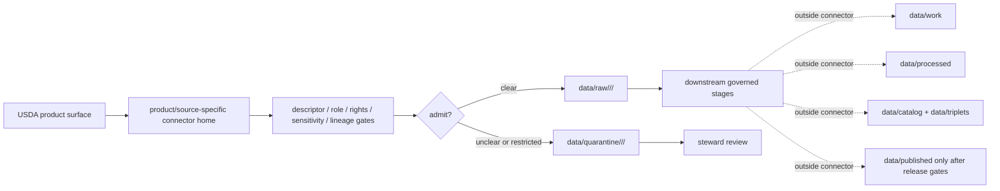

<!-- [KFM_META_BLOCK_V2]
doc_id: kfm://doc/connectors-usda-readme
title: connectors/usda/ — USDA Connector Coordination Lane
type: readme
version: v0.1
status: draft
owners: OWNER_TBD — Connector steward · Source steward · USDA steward · Agriculture steward · Flora steward · NRCS steward · NASS steward · PLANTS steward · Data steward · Validation steward · Docs steward
created: 2026-06-20
updated: 2026-06-20
policy_label: public; coordination-lane; multi-product; source-admission-only
related:
  - ../README.md
  - ../nass/README.md
  - ../usda-nass/README.md
  - ../usda-plants/README.md
  - ../nrcs/README.md
  - ../../docs/doctrine/directory-rules.md
  - ../../docs/sources/catalog/usda/README.md
  - ../../docs/sources/catalog/usda/usda-nass-quickstats.md
  - ../../docs/sources/catalog/usda/usda-nass-cdl.md
  - ../../docs/sources/catalog/usda/usda-plants.md
  - ../../docs/sources/catalog/nrcs.md
  - ../../docs/domains/agriculture/SOURCE_REGISTRY.md
  - ../../docs/domains/flora/SOURCE_REGISTRY.md
  - ../../data/registry/sources/
  - ../../data/raw/
  - ../../data/quarantine/
  - ../../data/receipts/
  - ../../data/proofs/
  - ../../policy/rights/
  - ../../policy/sensitivity/
  - ../../release/
tags: [kfm, connectors, usda, nrcs, nass, usda-nass, usda-plants, agriculture, flora, cdl, quickstats, plants, source-admission, raw, quarantine, source-role, governance]
notes:
  - "Draft USDA connector coordination lane."
  - "Placement is draft / ADR-class: usda/ is beyond Directory Rules §7.3 canonical connector roots unless later ratified; nrcs/ is a canonical connector family and is also a USDA sub-agency, so USDA/sub-agency boundaries remain open."
  - "Specific source intake should prefer product/source-specific connector lanes such as connectors/nass/, connectors/usda-nass/, connectors/usda-plants/, connectors/nrcs/, and accepted NRCS product sublanes."
  - "USDA products are multi-role and multi-domain: NASS QuickStats is aggregate agriculture data, CDL is crop/land-cover raster context, USDA PLANTS belongs to Flora, and NRCS lanes own soils/conservation source intake."
  - "Do not collapse USDA family membership into one source role, cadence, geometry, rights posture, sensitivity posture, or release path."
  - "Connector output may enter raw or quarantine admission lanes only."
  - "This README defines a connector coordination/source-admission boundary, not USDA source-family truth, NRCS truth, NASS truth, PLANTS truth, Agriculture doctrine, Flora doctrine, SourceDescriptor authority, policy authority, schema authority, catalog/triplet authority, proof authority, release authority, public API behavior, or public UI behavior."
[/KFM_META_BLOCK_V2] -->

<a id="top"></a>

# USDA Connector Coordination Lane

> Draft coordination boundary for USDA-related connector lanes. Specific intake should remain product- or source-family-specific.

<p>
  
  
  
  
  
  
</p>

`connectors/usda/`

## Quick jumps

[Scope](#scope) · [Repo fit](#repo-fit) · [Relationship to product lanes](#relationship-to-product-lanes) · [Admission model](#admission-model) · [Lifecycle sketch](#lifecycle-sketch) · [Authority boundary](#authority-boundary) · [Inputs](#inputs) · [Exclusions](#exclusions) · [Anti-collapse posture](#anti-collapse-posture) · [Validation](#validation) · [Definition of done](#definition-of-done)

---

## Scope

`connectors/usda/` is a draft coordination lane for USDA-related source intake and admission conventions.

This folder may contain connector-local documentation, product-lane pointers, shared USDA source-admission conventions, source-family index notes, fixture pointers, descriptor-gated coordination helpers, source-role preservation guidance, and raw/quarantine output guidance for accepted USDA source products.

It must not become USDA source-family doctrine, NRCS source-family truth, NASS product truth, USDA PLANTS product truth, Agriculture doctrine, Flora doctrine, soil/conservation truth, crop truth, taxonomic truth, SourceDescriptor authority, rights policy authority, sensitivity policy authority, schema authority, catalog/triplet authority, proof authority, release authority, public API behavior, public UI behavior, or publication authority.

> [!IMPORTANT]
> **Status:** draft / `NEEDS VERIFICATION`  
> **Owner:** `OWNER_TBD`  
> **Path:** `connectors/usda/`  
> **Truth posture:** the path exists in the repository as this README; actual connector code, source descriptors, canonical USDA/sub-agency placement, product activation, tests, fixtures, package metadata, CI wiring, and release behavior remain `NEEDS VERIFICATION`.

---

## Repo fit

```text
connectors/
├── nass/
├── nrcs/
├── usda/
│   └── README.md
├── usda-nass/
└── usda-plants/
```

Related responsibility roots:

```text
connectors/usda/                          # this draft coordination lane
connectors/nass/                          # existing NASS connector lane
connectors/usda-nass/                     # USDA NASS alias/sibling lane
connectors/usda-plants/                   # USDA PLANTS product connector lane
connectors/nrcs/                          # canonical NRCS connector-family lane
docs/sources/catalog/usda/                # USDA source-family and product doctrine
docs/sources/catalog/nrcs.md              # NRCS source-family doctrine
docs/domains/agriculture/                 # Agriculture domain doctrine and source-role rules
docs/domains/flora/                       # Flora domain doctrine and source-role rules
data/registry/sources/                    # source descriptors and activation state
data/raw/                                 # raw staged source outputs by owning domain
data/quarantine/                          # held material requiring source/role/rights/sensitivity review
data/receipts/                            # ingest, checksum, query, transform, and review receipts
data/proofs/                              # EvidenceBundles and proof packs
policy/rights/                            # terms, attribution, and source-use review
policy/sensitivity/                       # rare-plant, field/parcel, infrastructure, and release rules
release/                                  # release decisions, manifests, rollback, correction state
```

> [!WARNING]
> `connectors/usda/` is a draft/open connector placement. Do not move active source-specific intake here unless an ADR, migration note, or updated Directory Rules ratifies a USDA connector family/root pattern.

---

## Relationship to product lanes

| Product or family | Existing / preferred connector home | Boundary |
|---|---|---|
| NASS QuickStats | `connectors/nass/` or resolved NASS home | Aggregate agriculture statistics; not field/farm/parcel truth. |
| NASS Cropland Data Layer | NASS/CDL-specific home after placement decision | Annual crop/land-cover raster/classification product; not QuickStats. |
| USDA PLANTS | `connectors/usda-plants/` | Flora taxonomy/checklist and state/county distribution scaffold; not specimen evidence. |
| NRCS family | `connectors/nrcs/` | Canonical NRCS connector family already exists; USDA umbrella must not override it. |
| NRCS SSURGO/gSSURGO/SDA/SCAN | `connectors/nrcs/<product>/` | Soil/conservation source-specific lanes; do not collapse under generic USDA. |

No move, delete, rename, redirect, or deprecation is implied by this README.

---

## Admission model

USDA source material must be admitted product-first, source-role-first, and domain-first.

| Concern | Required connector posture |
|---|---|
| Source identity | Preserve USDA sub-agency, product, descriptor reference, source URL/reference, retrieval date, rights posture, citation posture, and digest. |
| Product separation | Preserve NASS QuickStats, NASS CDL, USDA PLANTS, NRCS products, and future USDA surfaces as separate source products. |
| Domain ownership | Preserve whether the source belongs to Agriculture, Flora, Soil, Hydrology, or another lane; USDA family membership does not decide domain truth. |
| Source role | Preserve aggregate, modeled/classified, administrative, observed, authority/checklist, or other assigned role from the SourceDescriptor; do not upgrade by promotion. |
| Query/package lineage | Preserve endpoint/package identity, parameters, retrieval time, response status, row count, file inventory, and digest as applicable. |
| Rights and sensitivity | Require product-specific rights, attribution, source-use, and sensitive-join review before downstream use. |
| Publication | No connector output is public. Publication is a separate governed transition outside this folder. |

---

## Lifecycle sketch



> [!CAUTION]
> Connector code admits, quarantines, or rejects source material. It does not decide crop truth, field truth, parcel truth, taxonomic truth, soil truth, conservation-compliance truth, legal meaning, public suitability, or release state. Promotion remains a governed state transition, not a file move.

---

## Authority boundary

```text
OUTPUT LIMIT:
  data/raw/<domain>/<source_id>/<run_id>/
  data/quarantine/<domain>/<source_id>/<run_id>/

NOT HERE:
  USDA source-family truth
  USDA product doctrine
  NRCS source-family truth
  NASS product truth
  PLANTS product truth
  Agriculture doctrine
  Flora doctrine
  Soil doctrine
  SourceDescriptor authority
  crop truth
  field truth
  parcel truth
  taxonomic truth
  rights or sensitivity policy
  processed records
  catalog records
  triplet records
  public map artifacts
  receipts/proofs as authority
  release decisions
  public API behavior
  public UI behavior
```

---

## Inputs

| Accepted item | Required posture |
|---|---|
| Source-reference manifest | Preserve USDA agency/sub-agency, product identity, descriptor reference, source URL, retrieval/import date, rights posture, sensitivity posture, and digest. |
| Product-lane index | Preserve product-specific connector home, status, owner, source role, domain owner, and placement decision. |
| Query/API helper convention | Preserve endpoint, query parameters, response status, retrieval time, pagination/chunking, row count, and response digest. |
| Package/download convention | Preserve file inventory, archive manifest, size, checksum, source vintage/snapshot, and extraction receipt. |
| Source-role guard | Reject or quarantine attempts to collapse QuickStats/CDL/PLANTS/NRCS products into one role. |
| Sensitive-join guard | Preserve rare-plant, field/parcel, exact-location, and land/operator sensitivity review state. |
| Test references | Point to owning fixture/test roots; fixtures do not become source authority. |

---

## Exclusions

| Do not store here | Correct home |
|---|---|
| USDA source-family/product doctrine | `docs/sources/catalog/usda/` |
| NRCS source-family/product doctrine | `docs/sources/catalog/nrcs*` |
| Agriculture, Flora, or Soil doctrine | `docs/domains/<domain>/` |
| Authoritative SourceDescriptor records | `data/registry/sources/` |
| Rights or sensitivity rules | `policy/rights/`, `policy/sensitivity/` |
| Processed domain records or derived layers | `data/processed/` |
| Catalog or triplet records | `data/catalog/`, `data/triplets/` |
| Public artifacts | `data/published/` after governed release |
| Receipts and proof packs as authority | `data/receipts/`, `data/proofs/` |
| Schemas or semantic contracts | `schemas/`, `contracts/` |
| Public API or UI behavior | `apps/governed-api/`, `apps/explorer-web/` |

---

## Anti-collapse posture

| Rule | Connector implication |
|---|---|
| USDA is an umbrella, not one source role. | Preserve sub-agency/product-specific roles and descriptors. |
| NRCS is already a canonical connector family. | Generic USDA must not override `connectors/nrcs/`. |
| NASS QuickStats is aggregate. | Do not use aggregate cells as field/farm/parcel truth. |
| NASS CDL is not QuickStats. | Keep raster/classification products separate from tabular aggregates. |
| USDA PLANTS is Flora. | Do not collapse PLANTS into Agriculture just because USDA owns it. |
| PLANTS checklist is not specimen evidence. | County/state presence remains distribution scaffold, not observation truth. |
| Source role is fixed at admission. | Do not relabel roles by promotion or umbrella grouping. |
| Public display is downstream. | The connector must not build public API/UI/map/release payloads. |

---

## Validation

Before relying on this lane, verify:

- canonical USDA connector placement is ratified or recorded in the drift/open-question register;
- product-specific connector homes are accepted and linked;
- no duplicate implementation conflicts with `nass`, `usda-nass`, `usda-plants`, or `nrcs` lanes;
- source descriptors exist and validate;
- product-specific source roles, rights, sensitivity, query/package lineage, cadence, and activation state are verified;
- tests use safe no-network fixtures;
- outputs are limited to raw or quarantine admission lanes;
- downstream receipts, proofs, catalog/triplet records, public artifacts, and release records are produced only outside connectors;
- public products preserve source-role caveats, release approval, rollback path, and correction path.

---

## Definition of done

- [ ] Owners are confirmed and `OWNER_TBD` is replaced.
- [ ] Canonical USDA connector placement is resolved by ADR, migration note, or Directory Rules update, or recorded as open drift.
- [ ] Actual connector contents are inventoried.
- [ ] Product-specific connector homes are verified and linked.
- [ ] SourceDescriptor IDs, source roles, product identities, domain owners, rights, sensitivity, cadence, and activation state are verified.
- [ ] Tests prevent umbrella-role collapse, USDA/NRCS boundary collapse, QuickStats/CDL collapse, PLANTS/Agriculture collapse, checklist/specimen collapse, rights bypass, sensitivity bypass, and public-release misuse.
- [ ] Outputs are verified to enter raw or quarantine admission lanes only.
- [ ] No source-family, product, domain, processed, catalog, triplet, published, release, schema, policy, proof, receipt, registry, fixture, API, UI, or public-claim authority lives here.
- [ ] Tests, fixtures, and CI behavior are verified or marked `NEEDS VERIFICATION`.

---

## Status summary

`connectors/usda/` is a draft USDA connector coordination lane. It is not the canonical home for all USDA intake unless ratified. It is not USDA source-family truth, NRCS truth, NASS truth, PLANTS truth, Agriculture doctrine, Flora doctrine, Soil doctrine, SourceDescriptor authority, policy authority, schema authority, catalog/triplet authority, proof closure, release authority, public map authority, public API behavior, public UI behavior, or pipeline authority.

<p align="right"><a href="#top">Back to top</a></p>
