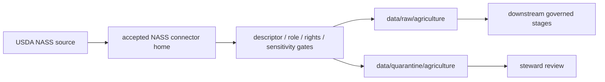

<!-- [KFM_META_BLOCK_V2]
doc_id: kfm://doc/connectors-usda-nass-nested-readme
title: connectors/usda/nass/ — USDA NASS Nested Connector Lane
type: readme
version: v0.1
status: draft
owners: OWNER_TBD — Connector steward · Source steward · USDA steward · NASS steward · Agriculture steward · Data steward · Validation steward · Docs steward
created: 2026-06-20
updated: 2026-06-20
policy_label: public; nested-lane; agriculture-source; aggregate-controlled; source-admission-only
related:
  - ../../README.md
  - ../README.md
  - ../../nass/README.md
  - ../../usda-nass/README.md
  - ../../../docs/sources/catalog/usda/README.md
  - ../../../docs/sources/catalog/usda/usda-nass-quickstats.md
  - ../../../docs/sources/catalog/usda/usda-nass-cdl.md
  - ../../../docs/domains/agriculture/SOURCE_REGISTRY.md
  - ../../../data/registry/sources/
  - ../../../data/raw/
  - ../../../data/quarantine/
  - ../../../policy/rights/
  - ../../../policy/sensitivity/
tags: [kfm, connectors, usda, nass, agriculture, quickstats, cdl, aggregate, source-admission, raw, quarantine, governance]
notes:
  - "Draft nested USDA NASS connector lane under connectors/usda/."
  - "This nested lane does not supersede connectors/nass/ or connectors/usda-nass/."
  - "Canonical placement remains NEEDS VERIFICATION / ADR-class."
  - "Connector output may enter raw or quarantine admission lanes only."
[/KFM_META_BLOCK_V2] -->

<a id="top"></a>

# USDA NASS Nested Connector Lane

> Draft nested connector boundary for USDA National Agricultural Statistics Service source material under the USDA connector family lane.

`connectors/usda/nass/`

## Scope

`connectors/usda/nass/` is a draft nested connector lane for USDA NASS source intake and admission helpers.

This folder may contain connector-local documentation, source-admission helpers, descriptor-gated request helpers, product-specific manifest helpers, parser notes, fixture pointers, provenance/digest helpers, and raw/quarantine handoff conventions for accepted USDA NASS products.

It must not become USDA/NASS product doctrine, Agriculture doctrine, SourceDescriptor authority, rights policy, sensitivity policy, schema authority, catalog/triplet authority, proof authority, release authority, public API behavior, public UI behavior, or publication authority.

## Repo fit

```text
connectors/
├── nass/
│   └── README.md
├── usda/
│   ├── README.md
│   └── nass/
│       └── README.md
└── usda-nass/
    └── README.md
```

## Relationship to sibling lanes

| Path | Status | Use |
|---|---|---|
| `connectors/usda/README.md` | Existing USDA coordination README | Umbrella coordination; not product implementation authority. |
| `connectors/usda/nass/README.md` | This README | Nested NASS lane candidate; not canonical until ratified. |
| `connectors/nass/README.md` | Existing NASS connector README | Current fuller connector boundary for NASS intake. |
| `connectors/usda-nass/README.md` | Existing flat alias/sibling README | USDA-prefixed NASS alias lane; valid draft boundary until placement is settled. |

No move, delete, rename, redirect, or deprecation is implied by this README.

## Admission model

If activated, this lane must preserve product identity, source descriptor reference, product separation, source role, query lineage, package lineage, aggregation scope, rights posture, sensitivity posture, and source digest.

QuickStats and Cropland Data Layer are separate NASS products. They must not collapse into one source role, cadence, geometry, schema, or receipt path.

## Aggregate-only discipline

QuickStats is aggregate data in KFM posture. Aggregate cells must preserve aggregation scope and must not be used as finer-grain truth. Joins that overstate precision must be denied or quarantined. Public or AI-facing claims must preserve aggregation caveats or abstain.

## Lifecycle sketch



Connector code admits, quarantines, or rejects source material. It does not decide agriculture truth, crop truth, public suitability, or release state. Promotion remains a governed state transition, not a file move.

## Authority boundary

```text
OUTPUT LIMIT:
  data/raw/agriculture/<source_id>/<run_id>/
  data/quarantine/agriculture/<source_id>/<run_id>/

NOT HERE:
  USDA/NASS product doctrine
  Agriculture doctrine
  SourceDescriptor authority
  rights or sensitivity policy
  processed records
  catalog records
  triplet records
  release decisions
  public API behavior
  public UI behavior
```

## Validation

Before relying on this lane, verify:

- nested vs flat vs short-name NASS placement is resolved or registered as open drift;
- duplicate implementation does not exist across `nass`, `usda-nass`, and `usda/nass` lanes;
- SourceDescriptors exist and validate;
- product-specific source roles, rights, sensitivity, lineage, and cadence are verified;
- aggregate-only guardrails are implemented;
- tests use safe no-network fixtures;
- outputs are limited to raw or quarantine admission lanes;
- release artifacts are produced only outside connectors.

## Definition of done

- [ ] Owners are confirmed and `OWNER_TBD` is replaced.
- [ ] Canonical connector placement is resolved or recorded as open drift.
- [ ] Actual connector contents are inventoried.
- [ ] SourceDescriptor IDs, product identities, roles, rights, sensitivity, cadence, and activation state are verified.
- [ ] Tests prevent split authority, source-role collapse, QuickStats/CDL collapse, aggregate overclaim, rights bypass, sensitivity bypass, and release misuse.
- [ ] Outputs are verified to enter raw or quarantine admission lanes only.

## Status summary

`connectors/usda/nass/` is a draft nested USDA NASS connector lane. It is not the canonical NASS connector home unless ratified. It is not USDA/NASS product doctrine, Agriculture doctrine, SourceDescriptor authority, policy authority, schema authority, catalog/triplet authority, proof closure, release authority, public map authority, public API behavior, public UI behavior, or pipeline authority.

<p align="right"><a href="#top">Back to top</a></p>
