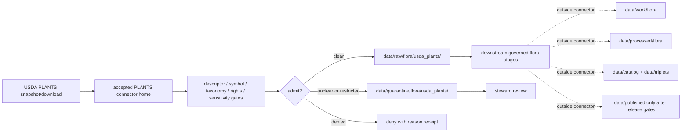

<!-- [KFM_META_BLOCK_V2]
doc_id: kfm://doc/connectors-usda-plants-nested-readme
title: connectors/usda/plants/ — USDA PLANTS Nested Connector Lane
type: readme
version: v0.1
status: draft
owners: OWNER_TBD — Connector steward · Source steward · USDA steward · PLANTS steward · Flora steward · Taxonomy steward · Rights steward · Sensitivity reviewer · Data steward · Validation steward · Docs steward
created: 2026-06-20
updated: 2026-06-20
policy_label: public; nested-lane; flora-taxonomy; federal-checklist; county-distribution; geoprivacy-controlled; source-admission-only
related:
  - ../../README.md
  - ../README.md
  - ../../usda-plants/README.md
  - ../../../docs/doctrine/directory-rules.md
  - ../../../docs/sources/catalog/usda/README.md
  - ../../../docs/sources/catalog/usda/usda-plants.md
  - ../../../docs/sources/catalog/usda/usda-nass-cdl.md
  - ../../../docs/sources/catalog/usda/usda-nass-quickstats.md
  - ../../../docs/domains/flora/README.md
  - ../../../docs/domains/flora/SOURCE_REGISTRY.md
  - ../../../docs/domains/flora/ARCHITECTURE.md
  - ../../../pipelines/watchers/plants/README.md
  - ../../../data/registry/sources/
  - ../../../data/raw/
  - ../../../data/quarantine/
  - ../../../data/receipts/
  - ../../../data/proofs/
  - ../../../policy/rights/
  - ../../../policy/sensitivity/
  - ../../../release/
tags: [kfm, connectors, usda, plants, usda-plants, nested-lane, flora, taxonomy, checklist, state-distribution, county-distribution, rare-plants, geoprivacy, source-admission, raw, quarantine, governance]
notes:
  - "Draft nested USDA PLANTS connector lane under connectors/usda/."
  - "This nested lane does not supersede connectors/usda-plants/; both remain draft until canonical placement is resolved."
  - "Placement is draft / ADR-class: usda/ and usda/plants/ are beyond Directory Rules §7.3 canonical connector roots unless later ratified."
  - "USDA PLANTS belongs to the Flora lane in KFM posture, not Agriculture, even though adjacent agriculture/landcover contexts may consume it downstream."
  - "PLANTS provides taxonomy/checklist and state/county distribution scaffolding; it is not specimen evidence, observation truth, conservation-status authority, rare-plant exact-location authority, or public-release approval."
  - "Connector output may enter raw or quarantine admission lanes only."
  - "This README defines a nested connector/source-admission boundary, not USDA PLANTS product doctrine, Flora doctrine, taxonomic truth closure, occurrence/specimen truth, conservation-status authority, SourceDescriptor authority, policy authority, schema authority, catalog/triplet authority, proof authority, release authority, public API behavior, or public UI behavior."
[/KFM_META_BLOCK_V2] -->

<a id="top"></a>

# USDA PLANTS Nested Connector Lane

> Draft nested connector boundary for USDA PLANTS Database source material under the USDA connector family lane.

<p>
  
  
  
  
  
  
</p>

`connectors/usda/plants/`

## Quick jumps

[Scope](#scope) · [Repo fit](#repo-fit) · [Relationship to sibling lane](#relationship-to-sibling-lane) · [Admission model](#admission-model) · [Identity and taxonomy discipline](#identity-and-taxonomy-discipline) · [Lifecycle sketch](#lifecycle-sketch) · [Authority boundary](#authority-boundary) · [Inputs](#inputs) · [Exclusions](#exclusions) · [Anti-collapse posture](#anti-collapse-posture) · [Validation](#validation) · [Definition of done](#definition-of-done)

---

## Scope

`connectors/usda/plants/` is a draft nested connector lane for USDA PLANTS Database source intake and admission helpers.

This folder may contain connector-local documentation, source-admission helpers, descriptor-gated client helpers, USDA-family placement notes, snapshot manifest builders, checklist/download parsers, `plants:symbol` identity helpers, state/county distribution parsers, taxonomy crosswalk helpers, rare-plant/geoprivacy preflight helpers, provenance/digest helpers, no-network fixture pointers, and raw/quarantine handoff adapters for approved source material.

It must not become USDA PLANTS product doctrine, USDA source-family doctrine, Flora domain doctrine, final taxonomy truth, accepted-name closure, occurrence/specimen truth, conservation-status authority, rare-plant exact-location authority, SourceDescriptor authority, policy authority, schema authority, catalog/triplet authority, proof authority, release authority, public API behavior, public UI behavior, public map authority, or publication authority.

> [!IMPORTANT]
> **Status:** draft / `NEEDS VERIFICATION`  
> **Owner:** `OWNER_TBD`  
> **Path:** `connectors/usda/plants/`  
> **Truth posture:** the path exists in the repository as this README; actual connector code, canonical placement, source descriptors, current endpoint/download behavior, pinned snapshots, rights terms, taxonomy-change handling, tests, fixtures, parser behavior, CI wiring, and release behavior remain `NEEDS VERIFICATION`.

---

## Repo fit

```text
connectors/
├── usda/
│   ├── README.md
│   └── plants/
│       └── README.md
└── usda-plants/
    └── README.md
```

Related responsibility roots:

```text
connectors/usda/                          # USDA coordination lane
connectors/usda/plants/                   # this draft nested PLANTS connector lane
connectors/usda-plants/                   # sibling flat PLANTS connector lane
docs/sources/catalog/usda/usda-plants.md  # USDA PLANTS product doctrine
docs/sources/catalog/usda/                # USDA source-family docs
docs/domains/flora/                       # Flora domain doctrine and source registry
pipelines/watchers/plants/                # material-change watcher context, not publisher
data/registry/sources/                    # source descriptors and activation state
data/raw/                                 # raw staged source outputs by owning domain
data/quarantine/                          # held material requiring source/role/rights/sensitivity review
data/receipts/                            # ingest, checksum, snapshot, taxonomy, transform, and review receipts
data/proofs/                              # EvidenceBundles and proof packs
policy/rights/                            # terms, attribution, and source-use review
policy/sensitivity/                       # rare-plant and exact-location release rules
release/                                  # release decisions, manifests, rollback, correction state
```

> [!WARNING]
> `connectors/usda/plants/` is a draft/open connector placement. Do not move active implementation between `connectors/usda/plants/` and `connectors/usda-plants/` without an ADR, migration note, or Directory Rules update.

---

## Relationship to sibling lane

| Path | Status | Use |
|---|---|---|
| `connectors/usda/README.md` | Existing USDA coordination README | Umbrella coordination; not product implementation authority. |
| `connectors/usda/plants/README.md` | This README | Nested product lane candidate; not canonical until ratified. |
| `connectors/usda-plants/README.md` | Existing flat product lane | Sibling product lane; remains valid draft boundary until placement is settled. |

No move, delete, rename, redirect, or deprecation is implied by this README.

---

## Admission model

If activated, this nested lane inherits the USDA PLANTS connector rules.

| Concern | Required connector posture |
|---|---|
| Source identity | Preserve USDA PLANTS product identity, descriptor reference, source URL/reference, snapshot identity, rights posture, citation posture, and digest. |
| Source role | Preserve the admitted source role from the SourceDescriptor; exact enum mapping for checklist/authority posture remains `NEEDS VERIFICATION`. |
| Identity | Preserve `plants:symbol`, scientific name with author, family, common names, and source-native identifiers. |
| Distribution | Preserve state and county distribution fields, FIPS/USPS keys, presence semantics, and snapshot vintage. |
| Taxonomy | Preserve source taxonomy, name changes, synonyms/accepted-name relationships where available, and downstream crosswalk status. |
| Flora attributes | Preserve native status, growth habit, wetland status, duration, and other PLANTS fields without converting them into occurrence evidence. |
| Rights and sensitivity | Require rights, attribution, source-use, rare-plant, exact-location, and sensitive-join review before downstream use. |
| Publication | No connector output is public. Publication is a separate governed transition outside this folder. |

---

## Identity and taxonomy discipline

USDA PLANTS identity handling is load-bearing.

Required connector behavior:

- every admitted taxon row preserves `plants:symbol` or routes to quarantine with reason;
- scientific name with author and family are preserved, not normalized away;
- taxonomy rename/synonym handling is receipted and never silently overwrites identity;
- state/county distribution records preserve snapshot and geographic keys;
- county presence is not treated as specimen-backed occurrence evidence;
- rare-plant or sensitive joins fail closed until policy review;
- downstream public products must preserve source attribution, snapshot, caveats, release manifest, rollback path, and correction path.

---

## Lifecycle sketch



> [!CAUTION]
> Connector code admits, quarantines, or rejects source material. It does not decide final taxonomy truth, specimen occurrence truth, rare-plant release, conservation status, public map precision, or final Flora interpretation. Promotion remains a governed state transition, not a file move.

---

## Authority boundary

```text
OUTPUT LIMIT:
  data/raw/flora/usda_plants/<snapshot>/
  data/quarantine/flora/usda_plants/<snapshot>/

NOT HERE:
  USDA PLANTS product doctrine
  USDA source-family doctrine
  Flora domain doctrine
  final taxonomy truth
  accepted-name closure
  occurrence or specimen truth
  conservation-status authority
  rare-plant exact-location authority
  SourceDescriptor authority
  rights or sensitivity policy
  processed flora records
  catalog records
  triplet records
  public map artifacts
  receipts/proofs as authority
  release decisions
  public API behavior
  public UI behavior
```

---

## Inputs

| Accepted item | Required posture |
|---|---|
| Source-reference manifest | Preserve USDA PLANTS product identity, descriptor reference, source URL, snapshot, retrieval/import date, rights posture, sensitivity posture, and digest. |
| Checklist parser | Preserve `plants:symbol`, scientific name with author, family, common names, native fields, growth habit, wetland status, and source row identity. |
| County/state distribution parser | Preserve state/county keys, FIPS/USPS values, presence semantics, source snapshot, and join caveats. |
| Taxonomy-change helper | Preserve renamed symbols, synonym/accepted-name fields where available, crosswalk status, and correction receipts. |
| Sensitive-join helper | Preserve rare-plant/exact-location blockers and route unclear joins to quarantine. |
| Rights helper | Preserve public-domain/attribution posture and source-use review state. |
| Placement helper | Preserve whether this nested lane or the flat sibling lane is accepted, deprecated, or redirected. |
| Test references | Point to owning fixture/test roots; fixtures do not become source authority. |

---

## Exclusions

| Do not store here | Correct home |
|---|---|
| USDA PLANTS product doctrine | `docs/sources/catalog/usda/usda-plants.md` |
| USDA source-family doctrine | `docs/sources/catalog/usda/` |
| Flora domain doctrine | `docs/domains/flora/` |
| Authoritative SourceDescriptor records | `data/registry/sources/` |
| Rights or sensitivity rules | `policy/rights/`, `policy/sensitivity/` |
| Processed flora records or derived layers | `data/processed/` |
| Catalog or triplet records | `data/catalog/`, `data/triplets/` |
| Public map artifacts | `data/published/` after governed release |
| Receipts and proof packs as authority | `data/receipts/`, `data/proofs/` |
| Schemas or semantic contracts | `schemas/`, `contracts/` |
| Public API or UI behavior | `apps/governed-api/`, `apps/explorer-web/` |

---

## Anti-collapse posture

| Rule | Connector implication |
|---|---|
| Nested lane is not automatically canonical. | Do not supersede `connectors/usda-plants/` without migration approval. |
| PLANTS is Flora, not Agriculture. | Keep canonical domain alignment to Flora; agriculture/landcover consumers are downstream context. |
| Checklist row is not specimen evidence. | County/state distribution is presence scaffolding, not a voucher or observation. |
| PLANTS distribution is not exact location. | Do not infer precise occurrence locations from county/state presence. |
| Taxon name is not final taxonomy closure. | Preserve source name and crosswalk status separately. |
| Conservation status is separate. | Do not treat PLANTS checklist data as NatureServe/KDWP status authority unless separately sourced. |
| Source role is fixed at admission. | Do not relabel source role by promotion. |
| Public display is downstream. | The connector must not build public API/UI/map/release payloads. |

---

## Validation

Before relying on this connector, verify:

- nested vs flat USDA PLANTS connector placement is ratified or recorded in the drift/open-question register;
- source descriptors exist and validate;
- current PLANTS access path, pinned snapshot, field inventory, rights terms, and cadence are verified;
- `plants:symbol`, scientific-name, family, state/county key, and taxonomy-change gates are implemented;
- rare-plant, exact-location, rights, and sensitivity gates fail closed;
- tests use safe no-network fixtures;
- outputs are limited to raw or quarantine admission lanes;
- downstream receipts, proofs, catalog/triplet records, public artifacts, and release records are produced only outside connectors;
- public products preserve attribution, snapshot labels, sensitivity transforms, release approval, rollback path, and correction path.

---

## Definition of done

- [ ] Owners are confirmed and `OWNER_TBD` is replaced.
- [ ] Nested vs flat connector placement is resolved by ADR, migration note, or Directory Rules update, or recorded as open drift.
- [ ] Actual connector contents are inventoried.
- [ ] SourceDescriptor IDs, source roles, snapshot identity, symbol keys, distribution keys, rights, sensitivity, taxonomy-change handling, and activation state are verified.
- [ ] Tests prevent nested/flat split authority, Flora/Agriculture home collapse, checklist/specimen collapse, distribution/exact-location collapse, taxonomic collapse, conservation-status collapse, rights bypass, sensitivity bypass, and public-release misuse.
- [ ] Outputs are verified to enter raw or quarantine admission lanes only.
- [ ] No source-family, product, domain, processed, catalog, triplet, published, release, schema, policy, proof, receipt, registry, fixture, API, UI, or public-claim authority lives here.
- [ ] Tests, fixtures, and CI behavior are verified or marked `NEEDS VERIFICATION`.

---

## Status summary

`connectors/usda/plants/` is a draft nested USDA PLANTS connector lane. It is not the canonical USDA PLANTS connector home unless ratified. It is not USDA PLANTS product doctrine, USDA source-family doctrine, Flora doctrine, final taxonomy truth, occurrence/specimen truth, conservation-status authority, SourceDescriptor authority, policy authority, schema authority, catalog/triplet authority, proof closure, release authority, public map authority, public API behavior, public UI behavior, or pipeline authority.

<p align="right"><a href="#top">Back to top</a></p>
