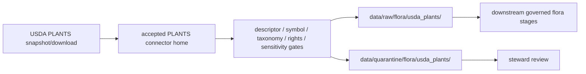

<!-- [KFM_META_BLOCK_V2]
doc_id: kfm://doc/connectors-usda-plants-underscore-readme
title: connectors/usda_plants/ — USDA PLANTS Underscore Alias Lane
type: readme
version: v0.1
status: draft
owners: OWNER_TBD — Connector steward · Source steward · USDA steward · PLANTS steward · Flora steward · Taxonomy steward · Rights steward · Sensitivity reviewer · Data steward · Validation steward · Docs steward
created: 2026-06-20
updated: 2026-06-20
policy_label: public; alias-lane; flora-taxonomy; federal-checklist; geoprivacy-controlled; source-admission-only
related:
  - ../README.md
  - ../usda-plants/README.md
  - ../usda/plants/README.md
  - ../../docs/doctrine/directory-rules.md
  - ../../docs/sources/catalog/usda/README.md
  - ../../docs/sources/catalog/usda/usda-plants.md
  - ../../docs/domains/flora/README.md
  - ../../docs/domains/flora/SOURCE_REGISTRY.md
  - ../../data/registry/sources/
  - ../../data/raw/
  - ../../data/quarantine/
  - ../../data/receipts/
  - ../../data/proofs/
  - ../../policy/rights/
  - ../../policy/sensitivity/
  - ../../release/
tags: [kfm, connectors, usda_plants, usda-plants, usda, plants, flora, taxonomy, checklist, county-distribution, rare-plants, source-admission, raw, quarantine, alias-lane, governance]
notes:
  - "Draft underscore alias lane for USDA PLANTS source admission."
  - "This lane does not supersede connectors/usda-plants/ or connectors/usda/plants/; all remain draft until canonical placement is resolved."
  - "Placement is draft / ADR-class: usda_plants/ is not listed in Directory Rules §7.3 canonical connector roots unless later ratified."
  - "USDA PLANTS belongs to the Flora lane in KFM posture, not Agriculture, even though adjacent agriculture/landcover contexts may consume it downstream."
  - "PLANTS provides taxonomy/checklist and state/county distribution scaffolding; it is not specimen evidence, observation truth, conservation-status authority, rare-plant exact-location authority, or public-release approval."
  - "Connector output may enter raw or quarantine admission lanes only."
  - "This README defines an alias/source-admission boundary, not USDA PLANTS product doctrine, Flora doctrine, taxonomic truth closure, occurrence/specimen truth, conservation-status authority, SourceDescriptor authority, policy authority, schema authority, catalog/triplet authority, proof authority, release authority, public API behavior, or public UI behavior."
[/KFM_META_BLOCK_V2] -->

<a id="top"></a>

# USDA PLANTS Underscore Alias Lane

> Draft underscore-name alias for USDA PLANTS source-admission work.

<p>
  
  
  
  
  
  
</p>

`connectors/usda_plants/`

## Quick jumps

[Scope](#scope) · [Repo fit](#repo-fit) · [Relationship to sibling lanes](#relationship-to-sibling-lanes) · [Admission model](#admission-model) · [Identity and taxonomy discipline](#identity-and-taxonomy-discipline) · [Lifecycle sketch](#lifecycle-sketch) · [Authority boundary](#authority-boundary) · [Validation](#validation) · [Definition of done](#definition-of-done)

---

## Scope

`connectors/usda_plants/` is a draft underscore alias lane for USDA PLANTS Database source intake and admission helpers.

This README exists to prevent naming drift between underscore, hyphenated, and nested connector layouts. Unless an ADR, migration note, or Directory Rules update chooses `connectors/usda_plants/` as canonical, implementation work should prefer the accepted USDA PLANTS connector home after placement is resolved.

This folder may contain connector-local documentation, placement notes, fixture pointers, descriptor-gated helper notes, and raw/quarantine handoff conventions. It must not become USDA PLANTS product doctrine, Flora domain doctrine, final taxonomy truth, occurrence/specimen truth, conservation-status authority, SourceDescriptor authority, policy authority, schema authority, catalog/triplet authority, proof authority, release authority, public API behavior, public UI behavior, or publication authority.

---

## Repo fit

```text
connectors/
├── usda_plants/
│   └── README.md
├── usda-plants/
│   └── README.md
└── usda/
    └── plants/
        └── README.md
```

Related responsibility roots:

```text
connectors/usda_plants/                   # this draft underscore alias lane
connectors/usda-plants/                   # flat hyphenated PLANTS draft lane
connectors/usda/plants/                   # nested USDA-family PLANTS draft lane
docs/sources/catalog/usda/usda-plants.md  # USDA PLANTS product doctrine
docs/domains/flora/                       # Flora domain doctrine and source registry
data/registry/sources/                    # source descriptors and activation state
data/raw/                                 # raw staged source outputs by owning domain
data/quarantine/                          # held material requiring review
policy/rights/                            # source-use and attribution review
policy/sensitivity/                       # rare-plant and exact-location release rules
release/                                  # release decisions and rollback state
```

---

## Relationship to sibling lanes

| Path | Status | Use |
|---|---|---|
| `connectors/usda_plants/README.md` | This README | Underscore alias candidate; not canonical until ratified. |
| `connectors/usda-plants/README.md` | Existing flat product lane | Hyphenated sibling product lane; valid draft boundary until placement is settled. |
| `connectors/usda/plants/README.md` | Existing nested product lane | Nested USDA-family product lane; valid draft boundary until placement is settled. |

No move, delete, rename, redirect, or deprecation is implied by this README.

---

## Admission model

If activated, this lane must preserve USDA PLANTS product identity, descriptor reference, source URL/reference, snapshot identity, rights posture, citation posture, digest, `plants:symbol`, scientific name with author, family, state/county distribution fields, taxonomy-change handling, and sensitivity review state.

No connector output is public. Publication is a separate governed transition outside this folder.

---

## Identity and taxonomy discipline

USDA PLANTS identity handling is load-bearing.

- Every admitted taxon row preserves `plants:symbol` or routes to quarantine with reason.
- Scientific name with author and family are preserved, not normalized away.
- Taxonomy rename/synonym handling is receipted and never silently overwrites identity.
- State/county distribution records preserve snapshot and geographic keys.
- County presence is not treated as specimen-backed occurrence evidence.
- Rare-plant or sensitive joins fail closed until policy review.

---

## Lifecycle sketch



Connector code admits, quarantines, or rejects source material. It does not decide final taxonomy truth, occurrence truth, rare-plant release, conservation status, public map precision, or final Flora interpretation.

---

## Authority boundary

```text
OUTPUT LIMIT:
  data/raw/flora/usda_plants/<snapshot>/
  data/quarantine/flora/usda_plants/<snapshot>/

NOT HERE:
  USDA PLANTS product doctrine
  Flora domain doctrine
  final taxonomy truth
  occurrence or specimen truth
  conservation-status authority
  SourceDescriptor authority
  rights or sensitivity policy
  catalog records
  triplet records
  release decisions
  public API behavior
  public UI behavior
```

---

## Validation

Before relying on this alias lane, verify:

- underscore vs hyphenated vs nested connector placement is resolved or recorded as open drift;
- duplicate implementation does not exist across `usda_plants`, `usda-plants`, and `usda/plants` lanes;
- SourceDescriptor records exist and validate;
- pinned snapshot, symbol keys, taxonomy-change handling, rights, sensitivity, and activation state are verified;
- outputs are limited to raw or quarantine admission lanes;
- release artifacts are produced only outside connectors.

---

## Definition of done

- [ ] Owners are confirmed and `OWNER_TBD` is replaced.
- [ ] Canonical connector placement is resolved or recorded as open drift.
- [ ] Actual connector contents are inventoried.
- [ ] SourceDescriptor IDs, source roles, snapshot identity, symbol keys, rights, sensitivity, and activation state are verified.
- [ ] Tests prevent split authority, Flora/Agriculture home collapse, checklist/specimen collapse, distribution/exact-location collapse, taxonomy collapse, rights bypass, sensitivity bypass, and release misuse.
- [ ] Outputs are verified to enter raw or quarantine admission lanes only.

---

## Status summary

`connectors/usda_plants/` is a draft underscore alias lane. It is not the canonical USDA PLANTS connector home unless ratified. It is not USDA PLANTS product doctrine, Flora doctrine, final taxonomy truth, occurrence/specimen truth, conservation-status authority, SourceDescriptor authority, policy authority, schema authority, catalog/triplet authority, proof closure, release authority, public map authority, public API behavior, public UI behavior, or pipeline authority.

<p align="right"><a href="#top">Back to top</a></p>
