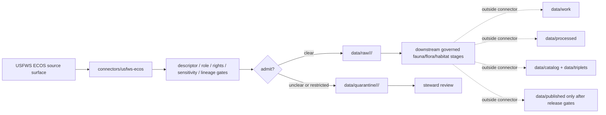

<!-- [KFM_META_BLOCK_V2]
doc_id: kfm://doc/connectors-usfws-ecos-readme
title: connectors/usfws-ecos/ — USFWS ECOS Connector Lane
type: readme
version: v0.1
status: draft
owners: OWNER_TBD — Connector steward · Source steward · USFWS steward · Fauna steward · Flora steward · Habitat steward · Rights steward · Sensitivity reviewer · Data steward · Validation steward · Docs steward
created: 2026-06-20
updated: 2026-06-20
policy_label: public; federal-regulatory; listed-species; critical-habitat; sensitivity-controlled; source-admission-only
related:
  - ../README.md
  - ../../docs/doctrine/directory-rules.md
  - ../../docs/sources/catalog/usfws_ecos/README.md
  - ../../docs/sources/catalog/usfws_ecos/species-profiles.md
  - ../../docs/sources/catalog/usfws_ecos/esa-listing-status.md
  - ../../docs/sources/catalog/usfws_ecos/critical-habitat.md
  - ../../docs/sources/catalog/usfws_ecos/ipac-project-lists.md
  - ../../docs/sources/catalog/kansas/kdwp.md
  - ../../docs/domains/fauna/SOURCE_FAMILIES.md
  - ../../docs/domains/flora/CANONICAL_PATHS.md
  - ../../docs/domains/habitat/README.md
  - ../../data/registry/sources/
  - ../../data/raw/
  - ../../data/quarantine/
  - ../../data/receipts/
  - ../../data/proofs/
  - ../../policy/rights/
  - ../../policy/sensitivity/
  - ../../release/
tags: [kfm, connectors, usfws, ecos, usfws-ecos, esa, listed-species, critical-habitat, ipac, fauna, flora, habitat, regulatory, source-admission, raw, quarantine, sensitivity, governance]
notes:
  - "Draft connector lane for USFWS ECOS source intake and admission helpers."
  - "Placement is draft / ADR-class: usfws-ecos/ is not listed in Directory Rules §7.3 canonical connector roots unless later ratified."
  - "ECOS is a federal regulatory/authority carrier for ESA listing/status, species profiles, critical habitat, and IPaC-related source material; Federal Register rules remain the legal source for designations."
  - "ECOS is not an observed-occurrence source and must not collapse with GBIF, iNaturalist, eBird, iDigBio, NatureServe, KDWP, or other state/federal ecological sources."
  - "Critical-habitat and listed-species geometries require sensitivity, generalization, and release controls before publication."
  - "Connector output may enter raw or quarantine admission lanes only."
  - "This README defines a connector/source-admission boundary, not USFWS ECOS source-family doctrine, ESA legal authority, species occurrence truth, conservation-status closure, sensitivity policy, SourceDescriptor authority, schema authority, catalog/triplet authority, proof authority, release authority, public API behavior, or public UI behavior."
[/KFM_META_BLOCK_V2] -->

<a id="top"></a>

# USFWS ECOS Connector Lane

> Draft source-admission boundary for U.S. Fish & Wildlife Service ECOS material used by KFM Fauna, Flora, and Habitat lanes.

<p>
  
  
  
  
  
  
</p>

`connectors/usfws-ecos/`

## Quick jumps

[Scope](#scope) · [Repo fit](#repo-fit) · [Admission model](#admission-model) · [Surface separation](#surface-separation) · [Lifecycle sketch](#lifecycle-sketch) · [Authority boundary](#authority-boundary) · [Inputs](#inputs) · [Exclusions](#exclusions) · [Anti-collapse posture](#anti-collapse-posture) · [Validation](#validation) · [Definition of done](#definition-of-done)

---

## Scope

`connectors/usfws-ecos/` is a draft connector lane for USFWS ECOS source intake and admission helpers.

This folder may contain connector-local documentation, descriptor-gated client helpers, species-profile parsers, ESA listing/status parsers, critical-habitat package or service manifest helpers, IPaC project-list intake helpers, source-role preservation helpers, geometry sensitivity preflight helpers, rights/attribution helpers, provenance/digest helpers, no-network fixture pointers, and raw/quarantine handoff adapters for approved source material.

It must not become USFWS ECOS source-family doctrine, ESA legal authority, species occurrence truth, final conservation-status closure, rare-species exact-location authority, habitat truth, SourceDescriptor authority, rights policy authority, sensitivity policy authority, schema authority, catalog/triplet authority, proof authority, release authority, public API behavior, public UI behavior, public map authority, or publication authority.

> [!IMPORTANT]
> **Status:** draft / `NEEDS VERIFICATION`  
> **Owner:** `OWNER_TBD`  
> **Path:** `connectors/usfws-ecos/`  
> **Truth posture:** the path exists in the repository as this README; actual connector code, source descriptors, current endpoints/services, rights terms, sensitivity gates, tests, fixtures, parser behavior, CI wiring, and release behavior remain `NEEDS VERIFICATION`.

---

## Repo fit

```text
connectors/
└── usfws-ecos/
    └── README.md
```

Related responsibility roots:

```text
connectors/usfws-ecos/                    # this draft connector lane
docs/sources/catalog/usfws_ecos/          # ECOS source-family and product doctrine
docs/domains/fauna/                       # fauna source roles and release posture
docs/domains/flora/                       # flora listed-plant context and controls
docs/domains/habitat/                     # habitat and critical-habitat context
data/registry/sources/                    # source descriptors and activation state
data/raw/                                 # raw staged source outputs by owning domain
data/quarantine/                          # held material requiring source/role/rights/sensitivity review
data/receipts/                            # ingest, checksum, transform, generalization, and review receipts
data/proofs/                              # EvidenceBundles and proof packs
policy/rights/                            # terms, attribution, and source-use review
policy/sensitivity/                       # listed-species, habitat, geometry, and release rules
release/                                  # release decisions, manifests, rollback, correction state
```

> [!WARNING]
> `connectors/usfws-ecos/` is a draft/open connector placement. Do not activate this connector until placement, source descriptors, rights policy, sensitivity policy, fixtures, and validation gates are accepted.

---

## Admission model

USFWS ECOS source material must be admitted source-role-first, surface-first, and sensitivity-first.

| Concern | Required connector posture |
|---|---|
| Source identity | Preserve USFWS ECOS product/surface identity, descriptor reference, source URL/reference, retrieval date, rights posture, citation posture, and digest. |
| Legal boundary | Preserve Federal Register rule references where available; ECOS services are a carrier, not the sovereign legal text. |
| Source role | Preserve regulatory/authority posture assigned by SourceDescriptor; do not convert ECOS to observed occurrence evidence. |
| Surface separation | Keep species profiles, ESA status, critical habitat, and IPaC lists as separate source surfaces. |
| Geometry | Preserve geometry source, scale, service layer, date, transform/generalization state, and sensitivity state. |
| Taxonomy | Preserve supplied names/identifiers and downstream crosswalk status to KFM taxonomic anchors. |
| Rights and sensitivity | Require rights, attribution, listed-species, geometry, and release review before downstream use. |
| Publication | No connector output is public. Publication is a separate governed transition outside this folder. |

---

## Surface separation

| ECOS surface | Connector rule |
|---|---|
| Species profiles | Preserve profile identity, status references, taxonomy fields, source date, and citation. |
| ESA listing/status | Preserve status, status date, authority, rule reference, and source-role metadata. |
| Critical habitat | Preserve layer identity, designation state, geometry lineage, sensitivity tier, and transform receipt. |
| IPaC project lists | Preserve project/list scope, retrieval date, official-source reference, and use restrictions; do not publish as general occurrence truth. |

---

## Lifecycle sketch



> [!CAUTION]
> Connector code admits, quarantines, or rejects source material. It does not decide legal designation meaning, occurrence truth, final sensitivity class, public map precision, or release state. Promotion remains a governed state transition, not a file move.

---

## Authority boundary

```text
OUTPUT LIMIT:
  data/raw/<domain>/<source_id>/<run_id>/
  data/quarantine/<domain>/<source_id>/<run_id>/

NOT HERE:
  USFWS ECOS source-family doctrine
  ESA legal authority
  species occurrence truth
  final conservation-status closure
  rare-species exact-location authority
  SourceDescriptor authority
  rights or sensitivity policy
  processed records
  catalog records
  triplet records
  public map artifacts
  receipts/proofs as authority
  release decisions
  public API behavior
  public UI behavior
```

---

## Inputs

| Accepted item | Required posture |
|---|---|
| Source-reference manifest | Preserve ECOS surface identity, descriptor reference, source URL, retrieval/import date, rights posture, sensitivity posture, and digest. |
| Species-profile helper | Preserve profile id, source fields, taxonomy fields, status references, citation, and retrieval date. |
| ESA status helper | Preserve status value, authority, rule reference, date fields, and source-role basis. |
| Critical-habitat helper | Preserve layer/service identity, geometry lineage, designation state, transform/generalization state, and sensitivity review state. |
| IPaC list helper | Preserve project/list scope, retrieval date, official-source reference, and downstream-use constraints. |
| Taxonomy helper | Preserve source names/identifiers and crosswalk status without overwriting source fields. |
| Test references | Point to owning fixture/test roots; fixtures do not become source authority. |

---

## Exclusions

| Do not store here | Correct home |
|---|---|
| ECOS source-family/product doctrine | `docs/sources/catalog/usfws_ecos/` |
| Fauna, Flora, or Habitat doctrine | `docs/domains/fauna/`, `docs/domains/flora/`, `docs/domains/habitat/` |
| Authoritative SourceDescriptor records | `data/registry/sources/` |
| Rights or sensitivity rules | `policy/rights/`, `policy/sensitivity/` |
| Processed domain records or derived layers | `data/processed/` |
| Catalog or triplet records | `data/catalog/`, `data/triplets/` |
| Public map artifacts | `data/published/` after governed release |
| Receipts and proof packs as authority | `data/receipts/`, `data/proofs/` |
| Schemas or semantic contracts | `schemas/`, `contracts/` |
| Public API or UI behavior | `apps/governed-api/`, `apps/explorer-web/` |

---

## Anti-collapse posture

| Rule | Connector implication |
|---|---|
| ECOS is regulatory/authority context, not observation. | Do not convert listing/status/critical-habitat records into occurrence evidence. |
| Federal Register rule outranks service geometry. | Preserve rule references and do not claim service geometry is legal text. |
| Critical habitat is not species presence. | Do not treat designated habitat geometry as proof of current occurrence. |
| IPaC list is project-scoped. | Preserve project/list scope and avoid generalizing beyond that scope. |
| Listed-species location sensitivity fails closed. | Route unclear precision/release conditions to quarantine or review. |
| Public display is downstream. | The connector must not build public API/UI/map/release payloads. |

---

## Validation

Before relying on this connector, verify:

- connector placement is ratified or recorded in the drift/open-question register;
- source descriptors exist and validate;
- ECOS source surfaces, endpoints/services, rights terms, and cadence/freshness are verified;
- source-role, geometry-lineage, taxonomy, rights, and sensitivity gates are implemented;
- tests use safe no-network fixtures;
- outputs are limited to raw or quarantine admission lanes;
- downstream receipts, proofs, catalog/triplet records, public artifacts, and release records are produced only outside connectors;
- public products preserve source-role caveats, sensitivity transforms, release approval, rollback path, and correction path.

---

## Definition of done

- [ ] Owners are confirmed and `OWNER_TBD` is replaced.
- [ ] Connector placement is resolved by ADR, migration note, or Directory Rules update, or recorded as open drift.
- [ ] Actual connector contents are inventoried.
- [ ] SourceDescriptor IDs, source roles, surface identities, rule references, rights, sensitivity, taxonomy crosswalks, and activation state are verified.
- [ ] Tests prevent regulatory/observation collapse, habitat/presence collapse, IPaC scope collapse, service/legal-text collapse, rights bypass, sensitivity bypass, and public-release misuse.
- [ ] Outputs are verified to enter raw or quarantine admission lanes only.
- [ ] No source-family, product, domain, processed, catalog, triplet, published, release, schema, policy, proof, receipt, registry, fixture, API, UI, or public-claim authority lives here.
- [ ] Tests, fixtures, and CI behavior are verified or marked `NEEDS VERIFICATION`.

---

## Status summary

`connectors/usfws-ecos/` is for USFWS ECOS source-admission code only. It is not ECOS source-family doctrine, ESA legal authority, species occurrence truth, conservation-status closure, sensitivity policy, SourceDescriptor authority, schema authority, catalog/triplet authority, proof closure, release authority, public map authority, public API behavior, public UI behavior, or pipeline authority.

<p align="right"><a href="#top">Back to top</a></p>
