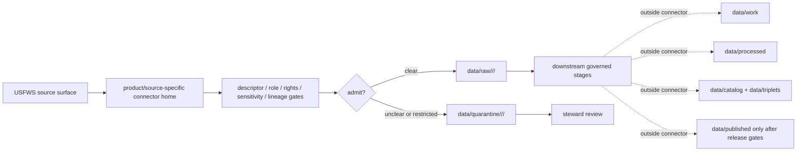

<!-- [KFM_META_BLOCK_V2]
doc_id: kfm://doc/connectors-usfws-readme
title: connectors/usfws/ — USFWS Connector Coordination Lane
type: readme
version: v0.1
status: draft
owners: OWNER_TBD — Connector steward · Source steward · USFWS steward · Fauna steward · Flora steward · Habitat steward · Rights steward · Sensitivity reviewer · Data steward · Validation steward · Docs steward
created: 2026-06-20
updated: 2026-06-20
policy_label: public; coordination-lane; federal-source; listed-species; habitat; sensitivity-controlled; source-admission-only
related:
  - ../README.md
  - ../usfws-ecos/README.md
  - ../../docs/doctrine/directory-rules.md
  - ../../docs/sources/catalog/usfws_ecos/README.md
  - ../../docs/sources/catalog/usfws_ecos/species-profiles.md
  - ../../docs/sources/catalog/usfws_ecos/esa-listing-status.md
  - ../../docs/sources/catalog/usfws_ecos/critical-habitat.md
  - ../../docs/sources/catalog/usfws_ecos/ipac-project-lists.md
  - ../../docs/domains/fauna/SOURCE_FAMILIES.md
  - ../../docs/domains/flora/CANONICAL_PATHS.md
  - ../../docs/domains/habitat/README.md
  - ../../data/registry/sources/
  - ../../data/raw/
  - ../../data/quarantine/
  - ../../data/receipts/
  - ../../data/proofs/
  - ../../policy/rights/
  - ../../policy/sensitivity/
  - ../../release/
tags: [kfm, connectors, usfws, usfws-ecos, ecos, fauna, flora, habitat, listed-species, critical-habitat, regulatory, source-admission, raw, quarantine, sensitivity, governance]
notes:
  - "Draft USFWS connector coordination lane."
  - "Placement is draft / ADR-class: usfws/ is not listed in Directory Rules §7.3 canonical connector roots unless later ratified."
  - "Specific source intake should prefer product/source-specific connector lanes such as connectors/usfws-ecos/ unless governance settles another canonical home."
  - "USFWS source families are multi-role: ECOS is regulatory/authority context for listings, profiles, critical habitat, and IPaC-style lists; other USFWS products require separate source descriptors and product lanes."
  - "Do not collapse USFWS family membership into one source role, cadence, geometry, rights posture, sensitivity posture, or release path."
  - "Connector output may enter raw or quarantine admission lanes only."
  - "This README defines a connector coordination/source-admission boundary, not USFWS source-family truth, ECOS product doctrine, ESA legal authority, species occurrence truth, conservation-status closure, sensitivity policy, SourceDescriptor authority, schema authority, catalog/triplet authority, proof authority, release authority, public API behavior, or public UI behavior."
[/KFM_META_BLOCK_V2] -->

<a id="top"></a>

# USFWS Connector Coordination Lane

> Draft coordination boundary for U.S. Fish & Wildlife Service connector lanes. Specific intake should remain product- or source-family-specific.

<p>
  
  
  
  
  
  
</p>

`connectors/usfws/`

## Quick jumps

[Scope](#scope) · [Repo fit](#repo-fit) · [Relationship to product lanes](#relationship-to-product-lanes) · [Admission model](#admission-model) · [Lifecycle sketch](#lifecycle-sketch) · [Authority boundary](#authority-boundary) · [Inputs](#inputs) · [Exclusions](#exclusions) · [Anti-collapse posture](#anti-collapse-posture) · [Validation](#validation) · [Definition of done](#definition-of-done)

---

## Scope

`connectors/usfws/` is a draft coordination lane for USFWS-related source intake and admission conventions.

This folder may contain connector-local documentation, product-lane pointers, shared USFWS source-admission conventions, source-family index notes, fixture pointers, descriptor-gated coordination helpers, source-role preservation guidance, rights/sensitivity preflight notes, and raw/quarantine output guidance for accepted USFWS source products.

It must not become USFWS source-family doctrine, ECOS product doctrine, ESA legal authority, species occurrence truth, final conservation-status closure, habitat truth, SourceDescriptor authority, rights policy authority, sensitivity policy authority, schema authority, catalog/triplet authority, proof authority, release authority, public API behavior, public UI behavior, public map authority, or publication authority.

> [!IMPORTANT]
> **Status:** draft / `NEEDS VERIFICATION`  
> **Owner:** `OWNER_TBD`  
> **Path:** `connectors/usfws/`  
> **Truth posture:** the path exists in the repository as this README; actual connector code, source descriptors, canonical USFWS placement, product activation, tests, fixtures, package metadata, CI wiring, and release behavior remain `NEEDS VERIFICATION`.

---

## Repo fit

```text
connectors/
├── usfws/
│   └── README.md
└── usfws-ecos/
    └── README.md
```

Related responsibility roots:

```text
connectors/usfws/                         # this draft coordination lane
connectors/usfws-ecos/                    # ECOS product/source-family connector lane
docs/sources/catalog/usfws_ecos/          # ECOS source-family and product doctrine
docs/domains/fauna/                       # fauna source roles and release posture
docs/domains/flora/                       # flora listed-plant context and controls
docs/domains/habitat/                     # habitat and critical-habitat context
data/registry/sources/                    # source descriptors and activation state
data/raw/                                 # raw staged source outputs by owning domain
data/quarantine/                          # held material requiring source/role/rights/sensitivity review
data/receipts/                            # ingest, checksum, transform, generalization, and review receipts
data/proofs/                              # EvidenceBundles and proof packs
policy/rights/                            # terms, attribution, and source-use review
policy/sensitivity/                       # listed-species, habitat, geometry, and release rules
release/                                  # release decisions, manifests, rollback, correction state
```

> [!WARNING]
> `connectors/usfws/` is a draft/open connector placement. Do not move active source-specific intake here unless an ADR, migration note, or updated Directory Rules ratifies a USFWS connector family/root pattern.

---

## Relationship to product lanes

| Product or family | Existing / preferred connector home | Boundary |
|---|---|---|
| USFWS ECOS | `connectors/usfws-ecos/` | Regulatory/authority carrier for ECOS surfaces; not observed occurrence evidence. |
| ECOS species profiles | Product-specific ECOS handling | Preserve profile identity, taxonomy fields, status references, and source citation. |
| ECOS listing/status | Product-specific ECOS handling | Preserve status, date, authority, and rule references. |
| ECOS critical habitat | Product-specific ECOS handling | Preserve geometry lineage, sensitivity state, and transform receipts. |
| IPaC-style project lists | Product-specific ECOS handling | Preserve project/list scope; do not generalize beyond source scope. |
| Other USFWS products | Separate source descriptor and product lane required | Do not route through generic USFWS until source role and policy posture are defined. |

No move, delete, rename, redirect, or deprecation is implied by this README.

---

## Admission model

USFWS source material must be admitted product-first, source-role-first, and sensitivity-first.

| Concern | Required connector posture |
|---|---|
| Source identity | Preserve USFWS program/product identity, descriptor reference, source URL/reference, retrieval date, rights posture, citation posture, and digest. |
| Product separation | Preserve ECOS profiles, ECOS status, ECOS habitat, IPaC-style lists, and future USFWS surfaces as separate source products. |
| Source role | Preserve regulatory, administrative, observed, modeled, candidate, or other assigned role from the SourceDescriptor; do not upgrade by promotion. |
| Legal context | Preserve rule and official-source references where present; service data is a carrier, not the legal text. |
| Geometry | Preserve geometry source, scale, service/layer identity, transform/generalization state, and sensitivity state. |
| Rights and sensitivity | Require product-specific rights, attribution, source-use, listed-species, location, geometry, and release review before downstream use. |
| Publication | No connector output is public. Publication is a separate governed transition outside this folder. |

---

## Lifecycle sketch



> [!CAUTION]
> Connector code admits, quarantines, or rejects source material. It does not decide legal meaning, occurrence truth, final sensitivity class, public map precision, public suitability, or release state. Promotion remains a governed state transition, not a file move.

---

## Authority boundary

```text
OUTPUT LIMIT:
  data/raw/<domain>/<source_id>/<run_id>/
  data/quarantine/<domain>/<source_id>/<run_id>/

NOT HERE:
  USFWS source-family truth
  ECOS product doctrine
  ESA legal authority
  species occurrence truth
  conservation-status closure
  SourceDescriptor authority
  rights or sensitivity policy
  processed records
  catalog records
  triplet records
  public map artifacts
  receipts/proofs as authority
  release decisions
  public API behavior
  public UI behavior
```

---

## Inputs

| Accepted item | Required posture |
|---|---|
| Source-reference manifest | Preserve USFWS program/product identity, descriptor reference, source URL, retrieval/import date, rights posture, sensitivity posture, and digest. |
| Product-lane index | Preserve product-specific connector home, status, owner, source role, domain owner, and placement decision. |
| ECOS coordination helper | Preserve ECOS surface identities without merging profiles, status, habitat, or IPaC-style outputs. |
| Geometry guard helper | Preserve service/layer identity, transform state, generalization state, and sensitivity review state. |
| Source-role guard | Reject or quarantine attempts to collapse regulatory/administrative/observed/modeled roles. |
| Test references | Point to owning fixture/test roots; fixtures do not become source authority. |

---

## Exclusions

| Do not store here | Correct home |
|---|---|
| USFWS or ECOS source-family/product doctrine | `docs/sources/catalog/` |
| Fauna, Flora, or Habitat doctrine | `docs/domains/fauna/`, `docs/domains/flora/`, `docs/domains/habitat/` |
| Authoritative SourceDescriptor records | `data/registry/sources/` |
| Rights or sensitivity rules | `policy/rights/`, `policy/sensitivity/` |
| Processed domain records or derived layers | `data/processed/` |
| Catalog or triplet records | `data/catalog/`, `data/triplets/` |
| Public map artifacts | `data/published/` after governed release |
| Receipts and proof packs as authority | `data/receipts/`, `data/proofs/` |
| Schemas or semantic contracts | `schemas/`, `contracts/` |
| Public API or UI behavior | `apps/governed-api/`, `apps/explorer-web/` |

---

## Anti-collapse posture

| Rule | Connector implication |
|---|---|
| USFWS is an umbrella, not one source role. | Preserve product-specific descriptors and roles. |
| ECOS is not observation evidence. | Do not convert listing/status/habitat records into occurrence evidence. |
| Habitat geometry is not species presence. | Do not treat designated habitat as proof of current occurrence. |
| Project lists are scoped. | Preserve project/list scope and avoid generalizing beyond source context. |
| Sensitive location review fails closed. | Route unclear precision/release conditions to quarantine or review. |
| Public display is downstream. | The connector must not build public API/UI/map/release payloads. |

---

## Validation

Before relying on this lane, verify:

- canonical USFWS connector placement is ratified or recorded in the drift/open-question register;
- product-specific connector homes are accepted and linked;
- no duplicate implementation conflicts with `usfws-ecos` or future USFWS lanes;
- source descriptors exist and validate;
- product-specific source roles, rights, sensitivity, lineage, cadence, and activation state are verified;
- tests use safe no-network fixtures;
- outputs are limited to raw or quarantine admission lanes;
- downstream receipts, proofs, catalog/triplet records, public artifacts, and release records are produced only outside connectors;
- public products preserve source-role caveats, sensitivity transforms, release approval, rollback path, and correction path.

---

## Definition of done

- [ ] Owners are confirmed and `OWNER_TBD` is replaced.
- [ ] Canonical USFWS connector placement is resolved by ADR, migration note, or Directory Rules update, or recorded as open drift.
- [ ] Actual connector contents are inventoried.
- [ ] Product-specific connector homes are verified and linked.
- [ ] SourceDescriptor IDs, source roles, product identities, domain owners, rights, sensitivity, cadence, and activation state are verified.
- [ ] Tests prevent umbrella-role collapse, ECOS/USFWS boundary collapse, regulatory/observation collapse, habitat/presence collapse, rights bypass, sensitivity bypass, and public-release misuse.
- [ ] Outputs are verified to enter raw or quarantine admission lanes only.
- [ ] No source-family, product, domain, processed, catalog, triplet, published, release, schema, policy, proof, receipt, registry, fixture, API, UI, or public-claim authority lives here.
- [ ] Tests, fixtures, and CI behavior are verified or marked `NEEDS VERIFICATION`.

---

## Status summary

`connectors/usfws/` is a draft USFWS connector coordination lane. It is not the canonical home for all USFWS intake unless ratified. It is not USFWS source-family truth, ECOS product doctrine, ESA legal authority, species occurrence truth, conservation-status closure, sensitivity policy, SourceDescriptor authority, schema authority, catalog/triplet authority, proof closure, release authority, public map authority, public API behavior, public UI behavior, or pipeline authority.

<p align="right"><a href="#top">Back to top</a></p>
