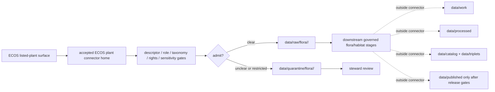

<!-- [KFM_META_BLOCK_V2]
doc_id: kfm://doc/connectors-usfws-ecos-plants-readme
title: connectors/usfws/ecos_plants/ — USFWS ECOS Plants Connector Lane
type: readme
version: v0.1
status: draft
owners: OWNER_TBD — Connector steward · Source steward · USFWS steward · ECOS steward · Flora steward · Habitat steward · Rights steward · Sensitivity reviewer · Data steward · Validation steward · Docs steward
created: 2026-06-20
updated: 2026-06-20
policy_label: public; nested-lane; listed-plants; federal-regulatory; flora; sensitivity-controlled; source-admission-only
related:
  - ../../README.md
  - ../README.md
  - ../../usfws-ecos/README.md
  - ../../../docs/doctrine/directory-rules.md
  - ../../../docs/sources/catalog/usfws_ecos/README.md
  - ../../../docs/sources/catalog/usfws_ecos/species-profiles.md
  - ../../../docs/sources/catalog/usfws_ecos/esa-listing-status.md
  - ../../../docs/sources/catalog/usfws_ecos/critical-habitat.md
  - ../../../docs/sources/catalog/usfws_ecos/ipac-project-lists.md
  - ../../../docs/domains/flora/README.md
  - ../../../docs/domains/flora/CANONICAL_PATHS.md
  - ../../../docs/domains/habitat/README.md
  - ../../../data/registry/sources/
  - ../../../data/raw/
  - ../../../data/quarantine/
  - ../../../data/receipts/
  - ../../../data/proofs/
  - ../../../policy/rights/
  - ../../../policy/sensitivity/
  - ../../../release/
tags: [kfm, connectors, usfws, ecos, ecos-plants, listed-plants, flora, habitat, esa, critical-habitat, regulatory, source-admission, raw, quarantine, sensitivity, governance]
notes:
  - "Draft nested connector lane for USFWS ECOS listed-plant source intake and admission helpers."
  - "This nested lane does not supersede connectors/usfws-ecos/ or connectors/usfws/; all remain draft until canonical placement is resolved."
  - "Placement is draft / ADR-class: usfws/ and usfws/ecos_plants/ are not listed in Directory Rules §7.3 canonical connector roots unless later ratified."
  - "ECOS listed-plant material is regulatory/authority context for Flora and Habitat, not specimen evidence, observation truth, exact occurrence authority, or public-release approval."
  - "Federal Register rules remain the legal source for listing and designated-habitat decisions; ECOS services are carriers."
  - "Connector output may enter raw or quarantine admission lanes only."
  - "This README defines a nested connector/source-admission boundary, not USFWS ECOS product doctrine, ESA legal authority, Flora doctrine, taxonomic truth closure, occurrence/specimen truth, conservation-status closure, sensitivity policy, SourceDescriptor authority, schema authority, catalog/triplet authority, proof authority, release authority, public API behavior, or public UI behavior."
[/KFM_META_BLOCK_V2] -->

<a id="top"></a>

# USFWS ECOS Plants Connector Lane

> Draft nested connector boundary for USFWS ECOS listed-plant source material under the USFWS connector family lane.

<p>
  
  
  
  
  
  
</p>

`connectors/usfws/ecos_plants/`

## Quick jumps

[Scope](#scope) · [Repo fit](#repo-fit) · [Relationship to sibling lanes](#relationship-to-sibling-lanes) · [Admission model](#admission-model) · [Plant-specific discipline](#plant-specific-discipline) · [Lifecycle sketch](#lifecycle-sketch) · [Authority boundary](#authority-boundary) · [Inputs](#inputs) · [Exclusions](#exclusions) · [Anti-collapse posture](#anti-collapse-posture) · [Validation](#validation) · [Definition of done](#definition-of-done)

---

## Scope

`connectors/usfws/ecos_plants/` is a draft nested connector lane for USFWS ECOS listed-plant source intake and admission helpers.

This folder may contain connector-local documentation, source-admission helpers, descriptor-gated client helpers, listed-plant profile parsers, ESA listing/status parsers filtered to plant taxa, critical-habitat manifest helpers for plant designations, taxonomy crosswalk helpers, sensitivity preflight helpers, rights/attribution helpers, provenance/digest helpers, no-network fixture pointers, and raw/quarantine handoff adapters for approved source material.

It must not become USFWS ECOS product doctrine, ESA legal authority, Flora domain doctrine, taxonomic truth closure, accepted-name closure, occurrence/specimen truth, rare-plant exact-location authority, final conservation-status closure, SourceDescriptor authority, rights policy authority, sensitivity policy authority, schema authority, catalog/triplet authority, proof authority, release authority, public API behavior, public UI behavior, public map authority, or publication authority.

> [!IMPORTANT]
> **Status:** draft / `NEEDS VERIFICATION`  
> **Owner:** `OWNER_TBD`  
> **Path:** `connectors/usfws/ecos_plants/`  
> **Truth posture:** the path exists in the repository as this README; actual connector code, canonical placement, source descriptors, current ECOS plant surfaces, rights terms, sensitivity gates, tests, fixtures, parser behavior, CI wiring, and release behavior remain `NEEDS VERIFICATION`.

---

## Repo fit

```text
connectors/
├── usfws/
│   ├── README.md
│   └── ecos_plants/
│       └── README.md
└── usfws-ecos/
    └── README.md
```

Related responsibility roots:

```text
connectors/usfws/                         # USFWS coordination lane
connectors/usfws/ecos_plants/             # this draft nested listed-plants lane
connectors/usfws-ecos/                    # flat ECOS connector lane
docs/sources/catalog/usfws_ecos/          # ECOS source-family and product doctrine
docs/domains/flora/                       # Flora listed-plant context and controls
docs/domains/habitat/                     # Habitat and critical-habitat context
data/registry/sources/                    # source descriptors and activation state
data/raw/                                 # raw staged source outputs by owning domain
data/quarantine/                          # held material requiring source/role/rights/sensitivity review
data/receipts/                            # ingest, checksum, transform, generalization, and review receipts
data/proofs/                              # EvidenceBundles and proof packs
policy/rights/                            # terms, attribution, and source-use review
policy/sensitivity/                       # listed-species, habitat, geometry, and release rules
release/                                  # release decisions, manifests, rollback, correction state
```

> [!WARNING]
> `connectors/usfws/ecos_plants/` is a draft/open connector placement. Do not move active implementation between this nested lane and `connectors/usfws-ecos/` without an ADR, migration note, or Directory Rules update.

---

## Relationship to sibling lanes

| Path | Status | Use |
|---|---|---|
| `connectors/usfws/README.md` | Existing USFWS coordination README | Umbrella coordination; not product implementation authority. |
| `connectors/usfws-ecos/README.md` | Existing ECOS connector README | Flat ECOS source-family lane for profiles, status, habitat, and IPaC-style material. |
| `connectors/usfws/ecos_plants/README.md` | This README | Nested plant-focused ECOS lane candidate; not canonical until ratified. |

No move, delete, rename, redirect, or deprecation is implied by this README.

---

## Admission model

USFWS ECOS listed-plant material must be admitted source-role-first, taxon-first, and sensitivity-first.

| Concern | Required connector posture |
|---|---|
| Source identity | Preserve USFWS ECOS surface identity, descriptor reference, source URL/reference, retrieval date, rights posture, citation posture, and digest. |
| Legal boundary | Preserve Federal Register rule references where available; ECOS services are carriers, not the sovereign legal text. |
| Flora alignment | Preserve listed-plant material as Flora/Habitat context, not Agriculture or specimen evidence. |
| Source role | Preserve regulatory/authority posture assigned by SourceDescriptor; do not convert ECOS listed-plant records to observed occurrence evidence. |
| Taxonomy | Preserve supplied plant names/identifiers and downstream crosswalk status to KFM taxonomic anchors. |
| Geometry | Preserve critical-habitat geometry source, scale, service/layer identity, transform/generalization state, and sensitivity state. |
| Publication | No connector output is public. Publication is a separate governed transition outside this folder. |

---

## Plant-specific discipline

- Listed-plant status is regulatory context, not occurrence evidence.
- Critical habitat is not proof of current plant presence.
- ECOS profile/status records do not replace USDA PLANTS taxonomy, herbarium vouchers, GBIF observations, KDWP records, or NatureServe/state heritage context.
- Taxonomy crosswalks preserve source names and do not silently overwrite KFM accepted-name anchors.
- Location and habitat precision must fail closed until release policy approves the transform and public precision.
- Public surfaces must preserve source-role caveats, sensitivity transforms, release approval, rollback path, and correction path.

---

## Lifecycle sketch



> [!CAUTION]
> Connector code admits, quarantines, or rejects source material. It does not decide legal designation meaning, plant occurrence truth, final taxonomy truth, final sensitivity class, public map precision, or release state. Promotion remains a governed state transition, not a file move.

---

## Authority boundary

```text
OUTPUT LIMIT:
  data/raw/flora/<source_id>/<run_id>/
  data/quarantine/flora/<source_id>/<run_id>/

NOT HERE:
  USFWS ECOS product doctrine
  ESA legal authority
  Flora domain doctrine
  species occurrence truth
  final taxonomy truth
  conservation-status closure
  rare-plant exact-location authority
  SourceDescriptor authority
  rights or sensitivity policy
  processed records
  catalog records
  triplet records
  public map artifacts
  release decisions
  public API behavior
  public UI behavior
```

---

## Inputs

| Accepted item | Required posture |
|---|---|
| Source-reference manifest | Preserve ECOS plant surface identity, descriptor reference, source URL, retrieval/import date, rights posture, sensitivity posture, and digest. |
| Listed-plant profile helper | Preserve profile id, taxonomy fields, status references, citation, and retrieval date. |
| ESA status helper | Preserve status, authority, rule reference, date fields, and source-role basis. |
| Critical-habitat helper | Preserve layer/service identity, geometry lineage, designation state, transform/generalization state, and sensitivity review state. |
| Taxonomy helper | Preserve source names/identifiers and crosswalk status without overwriting source fields. |
| Test references | Point to owning fixture/test roots; fixtures do not become source authority. |

---

## Exclusions

| Do not store here | Correct home |
|---|---|
| ECOS source-family/product doctrine | `docs/sources/catalog/usfws_ecos/` |
| Flora or Habitat doctrine | `docs/domains/flora/`, `docs/domains/habitat/` |
| Authoritative SourceDescriptor records | `data/registry/sources/` |
| Rights or sensitivity rules | `policy/rights/`, `policy/sensitivity/` |
| Processed flora/habitat records or derived layers | `data/processed/` |
| Catalog or triplet records | `data/catalog/`, `data/triplets/` |
| Public map artifacts | `data/published/` after governed release |
| Schemas or semantic contracts | `schemas/`, `contracts/` |
| Public API or UI behavior | `apps/governed-api/`, `apps/explorer-web/` |

---

## Anti-collapse posture

| Rule | Connector implication |
|---|---|
| Nested lane is not automatically canonical. | Do not supersede `connectors/usfws-ecos/` without migration approval. |
| ECOS plant status is not occurrence evidence. | Do not convert regulatory status to observed occurrence records. |
| Habitat geometry is not species presence. | Do not treat habitat as proof of current plant presence. |
| ECOS is not USDA PLANTS. | Keep federal listing/status context separate from USDA checklist taxonomy. |
| Taxon name is not final taxonomy closure. | Preserve source name and crosswalk status separately. |
| Public display is downstream. | The connector must not build public API/UI/map/release payloads. |

---

## Validation

Before relying on this connector, verify:

- nested vs flat ECOS placement is ratified or recorded in the drift/open-question register;
- source descriptors exist and validate;
- ECOS listed-plant surfaces, rights terms, source roles, and freshness are verified;
- source-role, taxonomy, geometry-lineage, rights, and sensitivity gates are implemented;
- tests use safe no-network fixtures;
- outputs are limited to raw or quarantine admission lanes;
- downstream receipts, proofs, catalog/triplet records, public artifacts, and release records are produced only outside connectors;
- public products preserve source-role caveats, sensitivity transforms, release approval, rollback path, and correction path.

---

## Definition of done

- [ ] Owners are confirmed and `OWNER_TBD` is replaced.
- [ ] Nested vs flat connector placement is resolved by ADR, migration note, or Directory Rules update, or recorded as open drift.
- [ ] Actual connector contents are inventoried.
- [ ] SourceDescriptor IDs, source roles, surface identities, rule references, rights, sensitivity, taxonomy crosswalks, and activation state are verified.
- [ ] Tests prevent nested/flat split authority, regulatory/occurrence collapse, habitat/presence collapse, ECOS/USDA-PLANTS collapse, taxonomy collapse, rights bypass, sensitivity bypass, and public-release misuse.
- [ ] Outputs are verified to enter raw or quarantine admission lanes only.
- [ ] No source-family, product, domain, processed, catalog, triplet, published, release, schema, policy, proof, receipt, registry, fixture, API, UI, or public-claim authority lives here.
- [ ] Tests, fixtures, and CI behavior are verified or marked `NEEDS VERIFICATION`.

---

## Status summary

`connectors/usfws/ecos_plants/` is a draft nested ECOS listed-plants connector lane. It is not the canonical ECOS connector home unless ratified. It is not USFWS ECOS product doctrine, ESA legal authority, Flora doctrine, final taxonomy truth, occurrence/specimen truth, conservation-status closure, sensitivity policy, SourceDescriptor authority, catalog/triplet authority, proof closure, release authority, public map authority, public API behavior, public UI behavior, or pipeline authority.

<p align="right"><a href="#top">Back to top</a></p>
