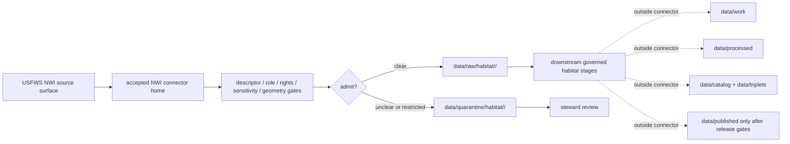

<!-- [KFM_META_BLOCK_V2]
doc_id: kfm://doc/connectors-usfws-nwi-readme
title: connectors/usfws/nwi/ — USFWS NWI Connector Lane
type: readme
version: v0.1
status: draft
owners: OWNER_TBD — Connector steward · Source steward · USFWS steward · NWI steward · Habitat steward · Hydrology steward · Wetlands steward · Rights steward · Sensitivity reviewer · Data steward · Validation steward · Docs steward
created: 2026-06-20
updated: 2026-06-20
policy_label: public; nested-lane; wetlands; habitat-context; geometry-controlled; source-admission-only
related:
  - ../../README.md
  - ../README.md
  - ../../usfws/README.md
  - ../../../docs/doctrine/directory-rules.md
  - ../../../docs/domains/habitat/SOURCE_REGISTRY.md
  - ../../../docs/domains/habitat/HABITAT_SOURCE_LEDGER.md
  - ../../../docs/domains/habitat/sublanes/land_cover.md
  - ../../../docs/domains/habitat/README.md
  - ../../../data/registry/sources/
  - ../../../data/raw/
  - ../../../data/quarantine/
  - ../../../data/receipts/
  - ../../../data/proofs/
  - ../../../policy/rights/
  - ../../../policy/sensitivity/
  - ../../../release/
tags: [kfm, connectors, usfws, nwi, wetlands, habitat, hydrology-context, geometry, source-admission, raw, quarantine, sensitivity, governance]
notes:
  - "Draft nested connector lane for USFWS National Wetlands Inventory source intake and admission helpers."
  - "Placement is draft / ADR-class: usfws/ and usfws/nwi/ are not listed in Directory Rules §7.3 canonical connector roots unless later ratified."
  - "No dedicated docs/sources/catalog/usfws-nwi page was found during this edit; NWI product doctrine remains NEEDS VERIFICATION."
  - "NWI wetland geometry is habitat/wetland context. It is not parcel truth, legal wetland delineation, water-right truth, jurisdictional determination, hydrology truth, or public-release approval."
  - "NWI is separate from USFWS ECOS listed-species and critical-habitat surfaces."
  - "Connector output may enter raw or quarantine admission lanes only."
  - "This README defines a nested connector/source-admission boundary, not USFWS/NWI product doctrine, Habitat doctrine, Hydrology doctrine, legal wetland authority, jurisdictional determination, SourceDescriptor authority, policy authority, schema authority, catalog/triplet authority, proof authority, release authority, public API behavior, or public UI behavior."
[/KFM_META_BLOCK_V2] -->

<a id="top"></a>

# USFWS NWI Connector Lane

> Draft nested connector boundary for USFWS National Wetlands Inventory source material under the USFWS connector family lane.

<p>
  
  
  
  
  
  
</p>

`connectors/usfws/nwi/`

## Quick jumps

[Scope](#scope) · [Repo fit](#repo-fit) · [Relationship to sibling lanes](#relationship-to-sibling-lanes) · [Admission model](#admission-model) · [Wetland-geometry discipline](#wetland-geometry-discipline) · [Lifecycle sketch](#lifecycle-sketch) · [Authority boundary](#authority-boundary) · [Inputs](#inputs) · [Exclusions](#exclusions) · [Anti-collapse posture](#anti-collapse-posture) · [Validation](#validation) · [Definition of done](#definition-of-done)

---

## Scope

`connectors/usfws/nwi/` is a draft nested connector lane for USFWS National Wetlands Inventory source intake and admission helpers.

This folder may contain connector-local documentation, source-admission helpers, descriptor-gated client helpers, NWI package or service manifest helpers, wetland-class parser notes, geometry lineage helpers, vintage/snapshot helpers, CRS/topology helpers, sensitivity preflight helpers, rights/attribution helpers, provenance/digest helpers, no-network fixture pointers, and raw/quarantine handoff adapters for approved source material.

It must not become USFWS/NWI product doctrine, Habitat domain doctrine, Hydrology doctrine, legal wetland authority, jurisdictional determination, parcel/cadastral truth, water-right truth, floodplain truth, final wetland classification truth, SourceDescriptor authority, rights policy authority, sensitivity policy authority, schema authority, catalog/triplet authority, proof authority, release authority, public API behavior, public UI behavior, public map authority, or publication authority.

> [!IMPORTANT]
> **Status:** draft / `NEEDS VERIFICATION`  
> **Owner:** `OWNER_TBD`  
> **Path:** `connectors/usfws/nwi/`  
> **Truth posture:** the path exists in the repository as this README; actual connector code, canonical placement, source descriptors, NWI access method, product doctrine, rights terms, sensitivity gates, tests, fixtures, parser behavior, CI wiring, and release behavior remain `NEEDS VERIFICATION`.

---

## Repo fit

```text
connectors/
├── usfws/
│   ├── README.md
│   └── nwi/
│       └── README.md
└── usfws-ecos/
    └── README.md
```

Related responsibility roots:

```text
connectors/usfws/                         # USFWS coordination lane
connectors/usfws/nwi/                     # this draft nested NWI connector lane
docs/domains/habitat/                     # habitat source registry and wetland context
docs/domains/habitat/SOURCE_REGISTRY.md   # habitat admission-control surface
data/registry/sources/                    # source descriptors and activation state
data/raw/                                 # raw staged source outputs by owning domain
data/quarantine/                          # held material requiring source/role/rights/sensitivity review
data/receipts/                            # ingest, checksum, transform, topology, and review receipts
data/proofs/                              # EvidenceBundles and proof packs
policy/rights/                            # terms, attribution, and source-use review
policy/sensitivity/                       # location, habitat, infrastructure, and release rules
release/                                  # release decisions, manifests, rollback, correction state
```

> [!WARNING]
> `connectors/usfws/nwi/` is a draft/open connector placement. Do not move active implementation into this lane until NWI product doctrine, SourceDescriptor records, rights policy, sensitivity policy, fixtures, and validation gates are accepted.

---

## Relationship to sibling lanes

| Path | Status | Use |
|---|---|---|
| `connectors/usfws/README.md` | Existing USFWS coordination README | Umbrella coordination; not product implementation authority. |
| `connectors/usfws/nwi/README.md` | This README | Nested NWI lane candidate; not canonical until ratified. |
| `connectors/usfws-ecos/README.md` | Existing ECOS connector README | Separate ECOS regulatory/listed-species/critical-habitat lane. |

No move, delete, rename, redirect, or deprecation is implied by this README.

---

## Admission model

USFWS NWI source material must be admitted product-first, geometry-first, and sensitivity-first.

| Concern | Required connector posture |
|---|---|
| Source identity | Preserve USFWS NWI product identity, descriptor reference, source URL/reference, retrieval date, rights posture, citation posture, and digest. |
| Product separation | Preserve NWI as separate from ECOS, critical habitat, IPaC-style lists, floodplain products, hydrology products, and parcel/cadastral sources. |
| Source role | Preserve source role assigned by SourceDescriptor; do not upgrade by promotion. |
| Geometry | Preserve geometry source, scale, service/layer or package identity, CRS, topology state, snapshot/vintage, and transform state. |
| Classification | Preserve source wetland class/code fields and confidence/caveat fields where available; do not silently remap classes into KFM contracts. |
| Rights and sensitivity | Require product-specific rights, attribution, source-use, geometry, infrastructure, and release review before downstream use. |
| Publication | No connector output is public. Publication is a separate governed transition outside this folder. |

---

## Wetland-geometry discipline

- NWI geometry is habitat/wetland context, not a jurisdictional wetland determination.
- NWI geometry is not parcel, ownership, PLSS, water-right, floodplain, or hydrologic truth.
- NWI classification fields must remain source fields until mapped by accepted contracts and receipts.
- Geometry simplification, repair, reprojection, or generalization requires transform receipts.
- Cross-domain joins to infrastructure, land ownership, rare species, or archaeology-sensitive contexts must fail closed until policy review.
- Public surfaces must preserve source caveats, transform receipts, release approval, rollback path, and correction path.

---

## Lifecycle sketch



> [!CAUTION]
> Connector code admits, quarantines, or rejects source material. It does not decide wetland legal status, jurisdictional status, hydrologic truth, public map precision, public suitability, or release state. Promotion remains a governed state transition, not a file move.

---

## Authority boundary

```text
OUTPUT LIMIT:
  data/raw/habitat/<source_id>/<run_id>/
  data/quarantine/habitat/<source_id>/<run_id>/

NOT HERE:
  USFWS/NWI product doctrine
  Habitat doctrine
  Hydrology doctrine
  legal wetland authority
  jurisdictional determination
  parcel or ownership truth
  water-right truth
  floodplain truth
  SourceDescriptor authority
  rights or sensitivity policy
  processed records
  catalog records
  triplet records
  public map artifacts
  release decisions
  public API behavior
  public UI behavior
```

---

## Inputs

| Accepted item | Required posture |
|---|---|
| Source-reference manifest | Preserve NWI product identity, descriptor reference, source URL, retrieval/import date, rights posture, sensitivity posture, and digest. |
| Package/service manifest | Preserve layer/package identity, file inventory, service URL, layer id, feature count, CRS, and digest. |
| Wetland-class helper | Preserve source class/code fields, class-system version, caveats, and mapping status. |
| Geometry helper | Preserve geometry validity, topology warnings, reprojection/generalization state, and transform receipts. |
| Vintage helper | Preserve snapshot/vintage, source date, retrieval date, and change-review state. |
| Test references | Point to owning fixture/test roots; fixtures do not become source authority. |

---

## Exclusions

| Do not store here | Correct home |
|---|---|
| NWI source-family/product doctrine | `docs/sources/catalog/` after accepted placement |
| Habitat or Hydrology doctrine | `docs/domains/habitat/`, `docs/domains/hydrology/` |
| Authoritative SourceDescriptor records | `data/registry/sources/` |
| Rights or sensitivity rules | `policy/rights/`, `policy/sensitivity/` |
| Processed habitat/wetland records or derived layers | `data/processed/` |
| Catalog or triplet records | `data/catalog/`, `data/triplets/` |
| Public map artifacts | `data/published/` after governed release |
| Schemas or semantic contracts | `schemas/`, `contracts/` |
| Public API or UI behavior | `apps/governed-api/`, `apps/explorer-web/` |

---

## Anti-collapse posture

| Rule | Connector implication |
|---|---|
| NWI is not ECOS. | Keep wetland inventory context separate from listed-species and critical-habitat regulatory surfaces. |
| NWI is not legal delineation. | Do not claim jurisdictional wetland status from connector output. |
| Wetland context is not hydrology truth. | Hydrology sources retain their own roles and receipts. |
| NWI is not cadastral. | Do not treat geometry as parcels, ownership, or PLSS truth. |
| Source class is not KFM contract truth. | Preserve source fields until mapped by accepted contracts and receipts. |
| Public display is downstream. | The connector must not build public API/UI/map/release payloads. |

---

## Validation

Before relying on this connector, verify:

- NWI source catalog/product doctrine exists or is accepted by source stewards;
- nested USFWS NWI placement is ratified or recorded in the drift/open-question register;
- source descriptors exist and validate;
- NWI access method, source roles, rights terms, source dates, and freshness cadence are verified;
- geometry, class mapping, rights, and sensitivity gates are implemented;
- tests use safe no-network fixtures;
- outputs are limited to raw or quarantine admission lanes;
- downstream receipts, proofs, catalog/triplet records, public artifacts, and release records are produced only outside connectors;
- public products preserve source caveats, transform receipts, release approval, rollback path, and correction path.

---

## Definition of done

- [ ] Owners are confirmed and `OWNER_TBD` is replaced.
- [ ] NWI product doctrine is authored or accepted and linked.
- [ ] Connector placement is resolved by ADR, migration note, or Directory Rules update, or recorded as open drift.
- [ ] Actual connector contents are inventoried.
- [ ] SourceDescriptor IDs, source roles, surface identities, rights, sensitivity, class mappings, geometry lineage, and activation state are verified.
- [ ] Tests prevent NWI/ECOS collapse, wetland/legal-status collapse, wetland/hydrology collapse, parcel/ownership collapse, rights bypass, sensitivity bypass, and public-release misuse.
- [ ] Outputs are verified to enter raw or quarantine admission lanes only.
- [ ] No source-family, product, domain, processed, catalog, triplet, published, release, schema, policy, proof, receipt, registry, fixture, API, UI, or public-claim authority lives here.
- [ ] Tests, fixtures, and CI behavior are verified or marked `NEEDS VERIFICATION`.

---

## Status summary

`connectors/usfws/nwi/` is a draft nested USFWS NWI connector lane. It is not the canonical NWI connector home unless ratified. It is not NWI product doctrine, Habitat doctrine, Hydrology doctrine, legal wetland authority, jurisdictional determination, SourceDescriptor authority, policy authority, schema authority, catalog/triplet authority, proof closure, release authority, public map authority, public API behavior, public UI behavior, or pipeline authority.

<p align="right"><a href="#top">Back to top</a></p>
