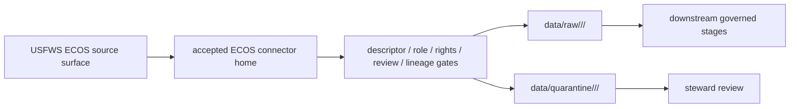

<!-- [KFM_META_BLOCK_V2]
doc_id: kfm://doc/connectors-usfws-ecos-underscore-readme
title: connectors/usfws_ecos/ — USFWS ECOS Underscore Alias Lane
type: readme
version: v0.1
status: draft
owners: OWNER_TBD — Connector steward · Source steward · USFWS steward · ECOS steward · Fauna steward · Flora steward · Habitat steward · Data steward · Validation steward · Docs steward
created: 2026-06-20
updated: 2026-06-20
policy_label: public; alias-lane; federal-source; source-admission-only
related:
  - ../README.md
  - ../usfws-ecos/README.md
  - ../usfws/README.md
  - ../usfws/ecos_plants/README.md
  - ../../docs/sources/catalog/usfws_ecos/README.md
  - ../../docs/sources/catalog/usfws_ecos/species-profiles.md
  - ../../docs/sources/catalog/usfws_ecos/esa-listing-status.md
  - ../../docs/sources/catalog/usfws_ecos/critical-habitat.md
  - ../../docs/sources/catalog/usfws_ecos/ipac-project-lists.md
  - ../../data/registry/sources/
  - ../../data/raw/
  - ../../data/quarantine/
tags: [kfm, connectors, usfws_ecos, usfws-ecos, usfws, ecos, source-admission, raw, quarantine, alias-lane, governance]
notes:
  - "Draft underscore alias lane for USFWS ECOS source admission."
  - "This lane does not supersede connectors/usfws-ecos/, connectors/usfws/, or connectors/usfws/ecos_plants/."
  - "Canonical placement remains NEEDS VERIFICATION / ADR-class."
  - "Connector output may enter raw or quarantine admission lanes only."
[/KFM_META_BLOCK_V2] -->

<a id="top"></a>

# USFWS ECOS Underscore Alias Lane

`connectors/usfws_ecos/` is a draft underscore alias lane for USFWS ECOS source-admission work.

This lane exists to prevent naming drift between underscore, hyphenated, and nested connector layouts. It does **not** replace `connectors/usfws-ecos/`, `connectors/usfws/`, or `connectors/usfws/ecos_plants/`. Until an ADR, migration note, or Directory Rules update chooses a canonical home, those sibling lanes remain valid draft boundaries.

## Scope

This folder may contain connector-local documentation, placement notes, fixture pointers, descriptor-gated helper notes, and raw/quarantine handoff conventions.

It must not become USFWS ECOS source-family doctrine, legal authority, occurrence truth, conservation-status closure, SourceDescriptor authority, rights policy, sensitivity policy, schema authority, catalog/triplet authority, proof authority, release authority, public API behavior, public UI behavior, or publication authority.

## Repo fit

```text
connectors/
├── usfws_ecos/
│   └── README.md
├── usfws-ecos/
│   └── README.md
└── usfws/
    └── ecos_plants/
        └── README.md
```

## Relationship to sibling lanes

| Path | Status | Use |
|---|---|---|
| `connectors/usfws_ecos/README.md` | This README | Underscore alias candidate; not canonical until ratified. |
| `connectors/usfws-ecos/README.md` | Existing flat ECOS lane | Hyphenated ECOS lane; valid draft boundary until placement is settled. |
| `connectors/usfws/README.md` | Existing USFWS coordination lane | Umbrella coordination; not product implementation authority. |
| `connectors/usfws/ecos_plants/README.md` | Existing nested plant-focused lane | Valid draft boundary until placement is settled. |

No move, delete, rename, redirect, or deprecation is implied by this README.

## Admission model

If activated, this alias lane must preserve source identity, descriptor reference, source URL/reference, retrieval date, rights posture, citation posture, digest, source role, rule references, taxonomy fields, geometry lineage, review state, and transform receipts.

No connector output is public. Publication is a separate governed transition outside this folder.

## Surface separation

| ECOS surface | Connector rule |
|---|---|
| Species profiles | Preserve profile identity, status references, taxonomy fields, source date, and citation. |
| ESA listing/status | Preserve status, status date, authority, rule reference, and source-role metadata. |
| Critical habitat | Preserve layer identity, designation state, geometry lineage, review tier, and transform receipt. |
| IPaC project lists | Preserve project/list scope, retrieval date, official-source reference, and use restrictions. |

## Lifecycle sketch



Connector code admits, quarantines, or rejects source material. It does not decide legal meaning, occurrence truth, public map precision, or release state.

## Authority boundary

```text
OUTPUT LIMIT:
  data/raw/<domain>/<source_id>/<run_id>/
  data/quarantine/<domain>/<source_id>/<run_id>/

NOT HERE:
  source-family doctrine
  legal authority
  occurrence truth
  SourceDescriptor authority
  rights or sensitivity policy
  catalog records
  triplet records
  release decisions
  public API behavior
  public UI behavior
```

## Validation

Before relying on this alias lane, verify:

- underscore vs hyphenated vs nested ECOS placement is resolved or recorded as open drift;
- duplicate implementation does not exist across `usfws_ecos`, `usfws-ecos`, and `usfws/ecos_plants` lanes;
- SourceDescriptor records exist and validate;
- source surfaces, rule references, rights, review state, taxonomy, geometry lineage, and activation state are verified;
- outputs are limited to raw or quarantine admission lanes;
- release artifacts are produced only outside connectors.

## Definition of done

- [ ] Owners are confirmed and `OWNER_TBD` is replaced.
- [ ] Canonical connector placement is resolved or recorded as open drift.
- [ ] Actual connector contents are inventoried.
- [ ] SourceDescriptor IDs, surface identities, source roles, rights, review state, taxonomy crosswalks, and activation state are verified.
- [ ] Tests prevent split authority, role collapse, habitat/presence collapse, service/legal-text collapse, rights bypass, review bypass, and release misuse.
- [ ] Outputs are verified to enter raw or quarantine admission lanes only.

## Status summary

`connectors/usfws_ecos/` is a draft underscore alias lane. It is not the canonical ECOS connector home unless ratified. It is not source-family doctrine, legal authority, occurrence truth, SourceDescriptor authority, catalog/triplet authority, proof closure, release authority, public map authority, public API behavior, public UI behavior, or pipeline authority.

<p align="right"><a href="#top">Back to top</a></p>
