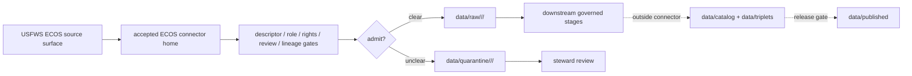

<!-- [KFM_META_BLOCK_V2]
doc_id: kfm://doc/connectors-usfws-ecos-underscore-readme
title: connectors/usfws_ecos/ — USFWS ECOS Underscore Alias Lane
type: readme
version: v0.2
status: draft
owners: OWNER_TBD — Connector steward · Source steward · USFWS steward · ECOS steward · Fauna steward · Flora steward · Habitat steward · Data steward · Validation steward · Docs steward
created: 2026-06-20
updated: 2026-06-20
policy_label: public; alias-lane; federal-source; source-admission-only
related:
  - ../README.md
  - ../usfws-ecos/README.md
  - ../usfws/README.md
  - ../usfws/ecos_plants/README.md
  - ../../docs/doctrine/directory-rules.md
  - ../../docs/sources/catalog/usfws_ecos/README.md
  - ../../docs/sources/catalog/usfws_ecos/species-profiles.md
  - ../../docs/sources/catalog/usfws_ecos/esa-listing-status.md
  - ../../docs/sources/catalog/usfws_ecos/critical-habitat.md
  - ../../docs/sources/catalog/usfws_ecos/ipac-project-lists.md
  - ../../docs/domains/fauna/SOURCE_FAMILIES.md
  - ../../docs/domains/flora/CANONICAL_PATHS.md
  - ../../docs/domains/habitat/README.md
  - ../../data/registry/sources/
  - ../../data/raw/
  - ../../data/quarantine/
  - ../../data/receipts/
  - ../../data/proofs/
  - ../../policy/rights/
  - ../../policy/sensitivity/
  - ../../release/
tags: [kfm, connectors, usfws_ecos, usfws-ecos, usfws, ecos, source-admission, raw, quarantine, alias-lane, governance]
notes:
  - "v0.2 applies the repository Markdown authoring standard supplied in the 2026-06-20 prompt attachment."
  - "Draft underscore alias lane for USFWS ECOS source admission."
  - "This lane does not supersede connectors/usfws-ecos/, connectors/usfws/, or connectors/usfws/ecos_plants/."
  - "Canonical placement remains NEEDS VERIFICATION / ADR-class."
  - "Connector output may enter raw or quarantine admission lanes only."
[/KFM_META_BLOCK_V2] -->

<a id="top"></a>

# USFWS ECOS Underscore Alias Lane

> Draft underscore-name alias for USFWS ECOS source-admission work. This README prevents naming drift; it does not create a new canonical connector home.

<p>
  
  
  
  
  
  
</p>

`connectors/usfws_ecos/`

## Quick jumps

[Status](#status) · [Scope](#scope) · [Repo fit](#repo-fit) · [Relationship to sibling lanes](#relationship-to-sibling-lanes) · [Accepted inputs](#accepted-inputs) · [Exclusions](#exclusions) · [Admission model](#admission-model) · [Surface separation](#surface-separation) · [Lifecycle sketch](#lifecycle-sketch) · [Authority boundary](#authority-boundary) · [Evidence basis](#evidence-basis) · [Validation](#validation) · [Rollback](#rollback) · [Definition of done](#definition-of-done)

---

## Status

> [!IMPORTANT]
> **Status:** `draft` / `NEEDS VERIFICATION`  
> **Owner:** `OWNER_TBD`  
> **Path:** `connectors/usfws_ecos/`  
> **Mode:** alias lane, not canonical source intake  
> **Truth posture:** `CONFIRMED` file path and README content; connector implementation, tests, descriptors, fixtures, CI wiring, and release behavior remain `NEEDS VERIFICATION`.

---

## Scope

`connectors/usfws_ecos/` is a draft underscore alias lane for USFWS ECOS source-admission work.

This lane exists to prevent naming drift between underscore, hyphenated, and nested connector layouts. It does **not** replace `connectors/usfws-ecos/`, `connectors/usfws/`, or `connectors/usfws/ecos_plants/`. Until an ADR, migration note, or Directory Rules update chooses a canonical home, those sibling lanes remain valid draft boundaries.

This folder may contain connector-local documentation, placement notes, fixture pointers, descriptor-gated helper notes, source-surface crosswalk notes, and raw/quarantine handoff conventions.

It must not become USFWS ECOS source-family doctrine, legal authority, occurrence truth, conservation-status closure, SourceDescriptor authority, rights policy, sensitivity policy, schema authority, catalog/triplet authority, proof authority, release authority, public API behavior, public UI behavior, public map authority, or publication authority.

---

## Repo fit

```text
connectors/
├── usfws_ecos/
│   └── README.md          # this underscore alias lane
├── usfws-ecos/
│   └── README.md          # flat ECOS lane
└── usfws/
    ├── README.md          # USFWS coordination lane
    ├── ecos_plants/
    │   └── README.md      # nested plant-focused ECOS lane
    └── nwi/
        └── README.md      # nested NWI lane
```

Related responsibility roots:

```text
docs/sources/catalog/usfws_ecos/          # ECOS source-family and product doctrine
docs/domains/fauna/                       # fauna source roles and release posture
docs/domains/flora/                       # flora listed-plant context and controls
docs/domains/habitat/                     # habitat and critical-habitat context
data/registry/sources/                    # source descriptors and activation state
data/raw/                                 # raw staged source outputs by owning domain
data/quarantine/                          # held material requiring review
data/receipts/                            # ingest, checksum, transform, and review receipts
data/proofs/                              # EvidenceBundles and proof packs
policy/rights/                            # source-use and attribution review
policy/sensitivity/                       # release and precision review
release/                                  # release decisions and rollback state
```

---

## Relationship to sibling lanes

| Path | Status | Use |
|---|---|---|
| `connectors/usfws_ecos/README.md` | This README | Underscore alias candidate; not canonical until ratified. |
| `connectors/usfws-ecos/README.md` | Existing flat ECOS lane | Hyphenated ECOS lane; valid draft boundary until placement is settled. |
| `connectors/usfws/README.md` | Existing USFWS coordination lane | Umbrella coordination; not product implementation authority. |
| `connectors/usfws/ecos_plants/README.md` | Existing nested plant-focused lane | Valid draft boundary until placement is settled. |
| `connectors/usfws/nwi/README.md` | Existing nested wetland lane | Separate USFWS product lane; do not collapse with ECOS. |

No move, delete, rename, redirect, or deprecation is implied by this README.

---

## Accepted inputs

| Accepted item | Required posture |
|---|---|
| Placement notes | Record whether underscore, hyphenated, or nested placement is accepted, deprecated, or redirected. |
| Source-surface pointer notes | Link to ECOS catalog pages and sibling connector lanes without duplicating source-family doctrine. |
| Descriptor-gated helper notes | Preserve the requirement that source activation depends on accepted `SourceDescriptor` records. |
| Fixture pointers | Point to safe fixture homes; fixtures do not become source authority. |
| Raw/quarantine handoff notes | Preserve the boundary that connector output enters only raw or quarantine admission lanes. |
| Review notes | Track open placement, rights, source-role, and release questions without implying implementation. |

---

## Exclusions

| Do not store here | Correct home |
|---|---|
| ECOS source-family/product doctrine | `../../docs/sources/catalog/usfws_ecos/` |
| Fauna, Flora, or Habitat doctrine | `../../docs/domains/fauna/`, `../../docs/domains/flora/`, `../../docs/domains/habitat/` |
| Authoritative SourceDescriptor records | `../../data/registry/sources/` |
| Rights or sensitivity rules | `../../policy/rights/`, `../../policy/sensitivity/` |
| Receipts or proof packs as authority | `../../data/receipts/`, `../../data/proofs/` |
| Catalog or triplet records | `../../data/catalog/`, `../../data/triplets/` |
| Public artifacts | `../../data/published/` after governed release |
| Public API or UI behavior | governed application roots after verification |

---

## Admission model

If activated, this alias lane must preserve source identity, descriptor reference, source URL/reference, retrieval date, rights posture, citation posture, digest, source role, rule references, taxonomy fields, geometry lineage, review state, and transform receipts.

No connector output is public. Publication is a separate governed transition outside this folder.

---

## Surface separation

| ECOS surface | Connector rule |
|---|---|
| Species profiles | Preserve profile identity, status references, taxonomy fields, source date, and citation. |
| ESA listing/status | Preserve status, status date, authority, rule reference, and source-role metadata. |
| Critical habitat | Preserve layer identity, designation state, geometry lineage, review tier, and transform receipt. |
| IPaC project lists | Preserve project/list scope, retrieval date, official-source reference, and use restrictions. |

---

## Lifecycle sketch



Connector code admits, quarantines, or rejects source material. It does not decide legal meaning, occurrence truth, public map precision, release state, or final domain interpretation.

---

## Authority boundary

```text
OUTPUT LIMIT:
  data/raw/<domain>/<source_id>/<run_id>/
  data/quarantine/<domain>/<source_id>/<run_id>/

NOT HERE:
  source-family doctrine
  legal authority
  occurrence truth
  SourceDescriptor authority
  rights or sensitivity policy
  receipts / proofs as authority
  catalog records
  triplet records
  release decisions
  public API behavior
  public UI behavior
```

---

## Evidence basis

| Source | Status | Supports | Limits |
|---|---|---|---|
| Uploaded KFM Markdown authoring standard | `CONFIRMED` | README structure, meta block, visual GitHub Markdown, truth-label and repo-unavailable rules. | Does not prove current connector implementation. |
| `connectors/usfws_ecos/README.md` before this edit | `CONFIRMED` | Existing compact alias posture and sibling lane references. | Was intentionally compact after prior safety-check limits. |
| `docs/sources/catalog/usfws_ecos/` references | `CONFIRMED path references` | ECOS source-family/product docs exist in repo search/fetch context. | Does not make this alias lane canonical. |
| `connectors/usfws-ecos/README.md` and nested USFWS README lanes | `CONFIRMED path references` | Sibling connector lanes exist and should not be silently superseded. | Does not settle canonical placement. |

---

## Validation

Before relying on this alias lane, verify:

- underscore vs hyphenated vs nested ECOS placement is resolved or recorded as open drift;
- duplicate implementation does not exist across `usfws_ecos`, `usfws-ecos`, and `usfws/ecos_plants` lanes;
- SourceDescriptor records exist and validate;
- source surfaces, rule references, rights, review state, taxonomy, geometry lineage, and activation state are verified;
- outputs are limited to raw or quarantine admission lanes;
- receipts, proofs, catalog/triplet records, and release artifacts are produced only outside connectors;
- public clients do not read this connector output directly.

---

## Rollback

Rollback is required if this README is later found to create parallel authority, misstate canonical connector placement, weaken source-role separation, imply public release, or conflict with an accepted ADR.

Rollback target: the prior compact README at content SHA `3454827b3bfad69fccb56a762a34b96e820c40e3`.

---

## Definition of done

- [ ] Owners are confirmed and `OWNER_TBD` is replaced.
- [ ] Canonical connector placement is resolved or recorded as open drift.
- [ ] Actual connector contents are inventoried.
- [ ] SourceDescriptor IDs, surface identities, source roles, rights, review state, taxonomy crosswalks, and activation state are verified.
- [ ] Tests prevent split authority, role collapse, habitat/presence collapse, service/legal-text collapse, rights bypass, review bypass, and release misuse.
- [ ] Outputs are verified to enter raw or quarantine admission lanes only.
- [ ] Adjacent READMEs link consistently to whichever ECOS connector home is accepted.

---

## Status summary

`connectors/usfws_ecos/` is a draft underscore alias lane. It is not the canonical ECOS connector home unless ratified. It is not source-family doctrine, legal authority, occurrence truth, SourceDescriptor authority, catalog/triplet authority, proof closure, release authority, public map authority, public API behavior, public UI behavior, or pipeline authority.

<p align="right"><a href="#top">Back to top</a></p>
