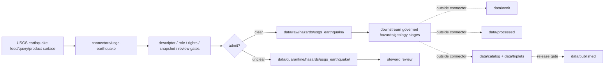

<!-- [KFM_META_BLOCK_V2]
doc_id: kfm://doc/connectors-usgs-earthquake-readme
title: connectors/usgs-earthquake/ — USGS Earthquake Connector Lane
type: readme
version: v0.1
status: draft
owners: OWNER_TBD — Connector steward · Source steward · USGS steward · Hazards steward · Geology steward · Rights steward · Sensitivity reviewer · Data steward · Validation steward · Docs steward
created: 2026-06-20
updated: 2026-06-20
policy_label: public; hazards; geology; seismicity; real-time-catalog; source-admission-only; not-alerting
related:
  - ../README.md
  - ../../docs/doctrine/directory-rules.md
  - ../../docs/sources/catalog/usgs/README.md
  - ../../docs/sources/catalog/usgs/earthquake-catalog.md
  - ../../docs/domains/hazards/SOURCE_ROLE_MATRIX.md
  - ../../docs/domains/hazards/SOURCE_REGISTRY.md
  - ../../docs/domains/hazards/SOURCES.md
  - ../../docs/domains/hazards/DATA_LIFECYCLE.md
  - ../../docs/runbooks/hazards/SOURCE_REFRESH_RUNBOOK.md
  - ../../data/registry/sources/
  - ../../data/raw/
  - ../../data/quarantine/
  - ../../data/receipts/
  - ../../data/proofs/
  - ../../policy/rights/
  - ../../policy/sensitivity/
  - ../../release/
tags: [kfm, connectors, usgs, earthquake, earthquakes, seismicity, hazards, geology, event-versioning, observed, modeled, dyfi, pager, shakemap, source-admission, raw, quarantine, governance]
notes:
  - "Draft connector lane for USGS Earthquake Catalog source intake and admission helpers."
  - "Placement is draft / ADR-class: usgs-earthquake/ is not listed in Directory Rules §7.3 canonical connector roots unless later ratified."
  - "USGS earthquake events are source-role heterogeneous: origin records are observed, magnitude estimates and products such as PAGER/ShakeMap/focal mechanisms are modeled, and DYFI reports are observed/crowdsourced context."
  - "USGS earthquake events refine over time; KFM must preserve immutable per-update snapshots rather than overlaying prior event records in place."
  - "This connector is not an earthquake alerting system, emergency warning authority, life-safety instruction path, or public safety notification path."
  - "Connector output may enter raw or quarantine admission lanes only."
  - "This README defines a connector/source-admission boundary, not USGS product doctrine, Hazards doctrine, Geology doctrine, emergency authority, public alerting behavior, SourceDescriptor authority, policy authority, schema authority, catalog/triplet authority, proof authority, release authority, public API behavior, or public UI behavior."
[/KFM_META_BLOCK_V2] -->

<a id="top"></a>

# USGS Earthquake Connector Lane

> Draft source-admission boundary for USGS Earthquake Catalog material used by KFM Hazards and Geology lanes. This is a connector lane, not an alerting or life-safety surface.

<p>
  
  
  
  
  
  
</p>

`connectors/usgs-earthquake/`

## Quick jumps

[Status](#status) · [Scope](#scope) · [Repo fit](#repo-fit) · [Admission model](#admission-model) · [Sub-product separation](#sub-product-separation) · [Event-versioning discipline](#event-versioning-discipline) · [Lifecycle sketch](#lifecycle-sketch) · [Authority boundary](#authority-boundary) · [Accepted inputs](#accepted-inputs) · [Exclusions](#exclusions) · [Anti-collapse posture](#anti-collapse-posture) · [Validation](#validation) · [Rollback](#rollback) · [Definition of done](#definition-of-done)

---

## Status

> [!IMPORTANT]
> **Status:** `draft` / `NEEDS VERIFICATION`  
> **Owner:** `OWNER_TBD`  
> **Path:** `connectors/usgs-earthquake/`  
> **Mode:** source-admission connector lane  
> **Truth posture:** `CONFIRMED` file path and README content; connector code, source descriptors, endpoint configuration, fixtures, tests, CI wiring, emitted receipts, and release behavior remain `NEEDS VERIFICATION`.

---

## Scope

`connectors/usgs-earthquake/` is a draft connector lane for USGS Earthquake Catalog source intake and admission helpers.

This folder may contain connector-local documentation, descriptor-gated client helpers, read-only feed/query helpers, event-snapshot manifest helpers, event-origin parsers, PAGER/ShakeMap/DYFI/focal-mechanism product pointers, source-role preservation helpers, event-versioning helpers, provenance/digest helpers, no-network fixture pointers, and raw/quarantine handoff adapters for approved source material.

It must not become USGS product doctrine, Hazards domain doctrine, Geology domain doctrine, emergency authority, operational alerting, life-safety instructions, final event truth, final impact truth, SourceDescriptor authority, rights policy authority, sensitivity policy authority, schema authority, catalog/triplet authority, proof authority, release authority, public API behavior, public UI behavior, public map authority, or publication authority.

> [!CAUTION]
> This connector may support historical and contextual hazard evidence after governed admission. It must not be used as a public emergency-warning, notification, evacuation, or life-safety decision surface.

---

## Repo fit

```text
connectors/
└── usgs-earthquake/
    └── README.md
```

Related responsibility roots:

```text
connectors/usgs-earthquake/               # this draft connector lane
docs/sources/catalog/usgs/earthquake-catalog.md # USGS earthquake product doctrine
docs/sources/catalog/usgs/                # USGS source-family docs
docs/domains/hazards/                     # hazards source roles, registry, lifecycle, and boundaries
docs/domains/geology/                     # geology context for seismicity after verification
docs/runbooks/hazards/                    # hazards source refresh and steward-review context
data/registry/sources/                    # source descriptors and activation state
data/raw/                                 # raw staged source outputs by owning domain
data/quarantine/                          # held material requiring source/role/rights/sensitivity review
data/receipts/                            # ingest, checksum, query, event-update, transform, and review receipts
data/proofs/                              # EvidenceBundles and proof packs
policy/rights/                            # terms, attribution, and source-use review
policy/sensitivity/                       # hazards, location, infrastructure, and release rules
release/                                  # release decisions, manifests, rollback, correction state
```

---

## Admission model

USGS earthquake source material must be admitted event-first, source-role-first, and snapshot-first.

| Concern | Required connector posture |
|---|---|
| Source identity | Preserve USGS product identity, descriptor reference, source URL/reference, retrieval time, rights posture, citation posture, and digest. |
| Event identity | Preserve USGS `event_id`, origin time, update time, magnitude, depth, geometry, product links, and source version/update metadata. |
| Source role | Preserve source role per sub-product; observed origin records are not the same as modeled derivatives. |
| Event versioning | Store event updates as immutable snapshots; do not silently overwrite earlier event states. |
| Product separation | Keep origin records, PAGER, ShakeMap, focal mechanism/moment tensor, and DYFI reports distinct. |
| Geometry | Preserve point/raster/polygon/product geometry lineage, CRS, uncertainty, and transform/generalization state. |
| Publication | No connector output is public. Publication is a separate governed transition outside this folder. |

---

## Sub-product separation

| USGS earthquake surface | Connector rule |
|---|---|
| Event origin record | Preserve observed event identity, origin/update timestamps, location, depth, magnitude, and uncertainty where available. |
| Magnitude estimate | Preserve method/model/update context; do not treat estimates as final physical truth without evidence state. |
| PAGER | Preserve modeled impact/loss estimate identity, run/update time, uncertainty/caveats, and source role. |
| ShakeMap | Preserve modeled ground-motion product identity, raster/grid lineage, uncertainty/caveats, and transform receipt. |
| Focal mechanism / moment tensor | Preserve modeled fault-parameter product identity, method, update time, and uncertainty/caveats. |
| DYFI | Preserve report aggregation and crowdsourced context without treating it as instrumented ground motion. |

---

## Event-versioning discipline

USGS earthquake events may refine after the first publication.

Required connector behavior:

- preserve both `origin_time` and `update_time` where available;
- treat each fetched update as a distinct event snapshot with digest and receipt;
- preserve the link between sub-products and the parent `event_id`;
- never overwrite prior snapshots without a correction record and rollback target;
- do not collapse modeled products into observed origin records;
- do not publish real-time context as life-safety guidance.

---

## Lifecycle sketch



Connector code admits, quarantines, or rejects source material. It does not decide emergency meaning, final event truth, final impact truth, public alerting behavior, public map precision, or release state.

---

## Authority boundary

```text
OUTPUT LIMIT:
  data/raw/hazards/usgs_earthquake/<run_id>/
  data/quarantine/hazards/usgs_earthquake/<run_id>/

NOT HERE:
  USGS product doctrine
  Hazards doctrine
  Geology doctrine
  emergency authority
  public alerting behavior
  life-safety instructions
  SourceDescriptor authority
  rights or sensitivity policy
  processed records
  catalog records
  triplet records
  receipts / proofs as authority
  release decisions
  public API behavior
  public UI behavior
```

---

## Accepted inputs

| Accepted item | Required posture |
|---|---|
| Source-reference manifest | Preserve USGS earthquake product identity, descriptor reference, source URL, retrieval/import time, rights posture, review posture, and digest. |
| Feed/query helper | Preserve endpoint/query parameters, time window, response status, retrieval time, row/event count, and response digest. |
| Event parser | Preserve USGS `event_id`, origin/update timestamps, magnitude, depth, geometry, uncertainty fields, and source version. |
| Product-link parser | Preserve PAGER, ShakeMap, DYFI, and focal-mechanism product identities separately from event origin. |
| Snapshot helper | Preserve immutable per-update event snapshots and rollback targets. |
| Test references | Point to owning fixture/test roots; fixtures do not become source authority. |

---

## Exclusions

| Do not store here | Correct home |
|---|---|
| USGS earthquake product doctrine | `../../docs/sources/catalog/usgs/earthquake-catalog.md` |
| Hazards or Geology doctrine | `../../docs/domains/hazards/`, `../../docs/domains/geology/` |
| Authoritative SourceDescriptor records | `../../data/registry/sources/` |
| Rights or sensitivity rules | `../../policy/rights/`, `../../policy/sensitivity/` |
| Processed hazard/geology records | `../../data/processed/` |
| Catalog or triplet records | `../../data/catalog/`, `../../data/triplets/` |
| Public artifacts | `../../data/published/` after governed release |
| Public API or UI behavior | governed application roots after verification |

---

## Anti-collapse posture

| Rule | Connector implication |
|---|---|
| Event origin is observed. | Preserve event origin as observed source material with update state. |
| Magnitude and derivative products may be modeled. | Preserve model identity and caveats; do not relabel as direct observation. |
| PAGER is not measured loss. | Cite as modeled impact estimate only. |
| ShakeMap is not a recorded value everywhere. | Preserve interpolation/model caveats and product lineage. |
| DYFI is crowdsourced context. | Preserve aggregation/reporting caveats and do not treat as instrumented ground motion. |
| Real-time data is not public alerting. | Keep connector output out of life-safety and emergency notification paths. |
| Public display is downstream. | The connector must not build public API/UI/map/release payloads. |

---

## Evidence basis

| Source | Status | Supports | Limits |
|---|---|---|---|
| `docs/sources/catalog/usgs/earthquake-catalog.md` | `CONFIRMED` | Product identity, sub-products, source-role heterogeneity, event update discipline, global scope, and pointer posture. | Does not prove connector implementation exists. |
| `docs/domains/hazards/SOURCE_ROLE_MATRIX.md` | `CONFIRMED` | Hazards source-role anti-collapse, earthquake role mapping, and non-alert posture. | Per-source assignments remain governed by SourceDescriptor admission. |
| `connectors/usgs-earthquake/README.md` before this edit | `CONFIRMED` | Target file existed but was blank. | No implementation proof. |

---

## Validation

Before relying on this connector, verify:

- connector placement is ratified or recorded in the drift/open-question register;
- SourceDescriptor records exist and validate;
- current USGS earthquake feeds, query surfaces, product packages, rights terms, and cadence/freshness rules are verified;
- event identity, update-time, source-role, product-separation, rights, and sensitivity gates are implemented;
- tests use safe no-network fixtures;
- outputs are limited to raw or quarantine admission lanes;
- downstream receipts, proofs, catalog/triplet records, public artifacts, and release records are produced only outside connectors;
- public products preserve source-role caveats, event-update snapshots, release approval, rollback path, and correction path.

---

## Rollback

Rollback is required if this README creates parallel authority, misstates canonical connector placement, weakens source-role separation, implies public alerting behavior, or conflicts with an accepted ADR.

Rollback target: initial blank file content SHA `8b137891791fe96927ad78e64b0aad7bded08bdc`.

---

## Definition of done

- [ ] Owners are confirmed and `OWNER_TBD` is replaced.
- [ ] Connector placement is resolved by ADR, migration note, or Directory Rules update, or recorded as open drift.
- [ ] Actual connector contents are inventoried.
- [ ] SourceDescriptor IDs, source roles, product identities, event IDs, update timestamps, rights, sensitivity, cadence, and activation state are verified.
- [ ] Tests prevent observed/modeled/crowdsourced collapse, PAGER/loss collapse, ShakeMap/measurement collapse, real-time/alerting collapse, rights bypass, sensitivity bypass, and public-release misuse.
- [ ] Outputs are verified to enter raw or quarantine admission lanes only.
- [ ] No source-family, product, domain, processed, catalog, triplet, published, release, schema, policy, proof, receipt, registry, fixture, API, UI, or public-claim authority lives here.
- [ ] Tests, fixtures, and CI behavior are verified or marked `NEEDS VERIFICATION`.

---

## Status summary

`connectors/usgs-earthquake/` is a draft USGS earthquake source-admission lane. It is not the canonical USGS earthquake connector home unless ratified. It is not USGS product doctrine, Hazards doctrine, Geology doctrine, emergency authority, public alerting behavior, SourceDescriptor authority, policy authority, schema authority, catalog/triplet authority, proof closure, release authority, public map authority, public API behavior, public UI behavior, or pipeline authority.

<p align="right"><a href="#top">Back to top</a></p>
