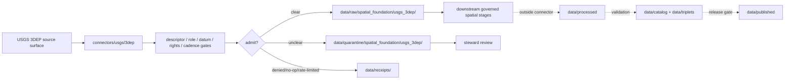

<!-- [KFM_META_BLOCK_V2]
doc_id: kfm://doc/connectors-usgs-3dep-readme
title: connectors/usgs/3dep/ — USGS 3DEP Connector Lane
type: readme
version: v0.1
status: draft
owners: OWNER_TBD — Connector steward · Source steward · USGS steward · 3DEP steward · Spatial Foundation steward · Data steward · Validation steward · Docs steward
created: 2026-06-20
updated: 2026-06-20
policy_label: public; nested-lane; elevation; lidar; terrain; source-admission-only; datum-gated; raw-quarantine-only
related:
  - ../README.md
  - ../../../docs/sources/catalog/usgs/README.md
  - ../../../docs/sources/catalog/usgs/3dep-elevation.md
  - ../../../data/registry/sources/
  - ../../../data/raw/
  - ../../../data/quarantine/
  - ../../../data/receipts/
  - ../../../data/proofs/
  - ../../../policy/rights/
  - ../../../policy/sensitivity/
  - ../../../release/
tags: [kfm, connectors, usgs, 3dep, elevation, lidar, laz, ept, copc, dem, terrain, spatial-foundation, source-admission, raw, quarantine, source-role, vertical-datum, governance]
notes:
  - "Draft nested connector lane for USGS 3D Elevation Program source intake and admission helpers."
  - "Placement is draft / ADR-class: usgs/3dep/ product sublane convention remains NEEDS VERIFICATION unless ratified by Directory Rules or ADR."
  - "Confirmed product-page path for this edit is docs/sources/catalog/usgs/3dep-elevation.md."
  - "3DEP source-role posture is heterogeneous: LAZ point clouds are observed source material, EPT/COPC are analytic delivery derivatives, DEMs are modeled derivatives, and hillshade/slope/aspect/uncertainty are second-order modeled derivatives."
  - "Horizontal CRS, vertical datum, geoid model, units, nodata, and overviews are gate-critical before analysis or publication."
  - "Connector output may enter raw or quarantine admission lanes only."
[/KFM_META_BLOCK_V2] -->

<a id="top"></a>

# USGS 3DEP Connector Lane

> Draft nested connector boundary for USGS 3D Elevation Program material. This lane admits source material; it does not decide terrain truth, public map precision, or release state.

<p>
  
  
  
  
  
  
</p>

`connectors/usgs/3dep/`

## Quick jumps

[Status](#status) · [Scope](#scope) · [Repo fit](#repo-fit) · [Accepted inputs](#accepted-inputs) · [Exclusions](#exclusions) · [Admission model](#admission-model) · [Source-role discipline](#source-role-discipline) · [Datum and geometry discipline](#datum-and-geometry-discipline) · [Lifecycle sketch](#lifecycle-sketch) · [Authority boundary](#authority-boundary) · [Validation](#validation) · [Definition of done](#definition-of-done)

---

## Status

> [!IMPORTANT]
> **Status:** `draft` / `NEEDS VERIFICATION`  
> **Owner:** `OWNER_TBD`  
> **Path:** `connectors/usgs/3dep/`  
> **Mode:** nested product connector lane  
> **Truth posture:** `CONFIRMED` file path and README content; connector code, source descriptors, endpoint configuration, fixtures, tests, CI wiring, emitted receipts, and release behavior remain `NEEDS VERIFICATION`.

---

## Scope

`connectors/usgs/3dep/` is a draft nested connector lane for USGS 3DEP source intake and admission helpers.

This folder may contain connector-local documentation, descriptor-gated client helpers, upstream STAC discovery helpers, package manifest helpers, LAZ/EPT/COPC/DEM inventory helpers, datum/CRS/unit preflight helpers, source-role preservation helpers, provenance/digest helpers, no-network fixture pointers, and raw/quarantine handoff adapters for approved 3DEP source material.

It must not become USGS 3DEP product doctrine, terrain truth, vertical-datum policy, SourceDescriptor authority, rights policy authority, sensitivity policy authority, schema authority, catalog/triplet authority, proof authority, release authority, public API behavior, public UI behavior, public map authority, tile authority, or publication authority.

---

## Repo fit

```text
connectors/
└── usgs/
    ├── README.md
    └── 3dep/
        └── README.md
```

Related responsibility roots:

```text
connectors/usgs/                          # USGS connector-family coordination lane
connectors/usgs/3dep/                     # this draft 3DEP product connector lane
docs/sources/catalog/usgs/3dep-elevation.md # confirmed 3DEP product page path
data/registry/sources/                    # source descriptors and activation state
data/raw/                                 # raw staged source outputs by owning domain
data/quarantine/                          # held material requiring review
data/receipts/                            # ingest, checksum, package, transform, and review receipts
data/proofs/                              # EvidenceBundles and proof packs
policy/rights/                            # source-use and attribution review
policy/sensitivity/                       # precision and release review
release/                                  # release decisions and rollback state
```

> [!NOTE]
> The confirmed product-page path observed in this edit is `docs/sources/catalog/usgs/3dep-elevation.md`. If adjacent docs point to another path variant, treat that as documentation drift to reconcile, not proof of a second product authority.

---

## Accepted inputs

| Accepted item | Required posture |
|---|---|
| Source-reference manifest | Preserve USGS 3DEP product identity, descriptor reference, source URL, retrieval/import time, rights posture, review posture, and digest. |
| Upstream STAC pointer | Preserve upstream item/collection identity, asset roles, timestamps, geometry, CRS, projection, pointcloud/raster metadata, and digest. |
| Package manifest | Preserve package identity, file inventory, source URL, acquisition/vintage fields, CRS, vertical datum, units, and digest. |
| LAZ inventory helper | Preserve point-cloud identity, quality level, acquisition/vintage, point count where available, CRS, vertical datum, units, and digest. |
| EPT/COPC helper | Preserve analytic-delivery lineage back to LAZ source material. |
| DEM/derivative helper | Preserve model/derivative lineage, resolution, caveats, nodata, overviews, CRS, vertical datum, and digest. |
| Test references | Point to owning fixture/test roots; fixtures do not become source authority. |

---

## Exclusions

| Do not store here | Correct home |
|---|---|
| USGS 3DEP product doctrine | `../../../docs/sources/catalog/usgs/3dep-elevation.md` |
| USGS source-family doctrine | `../../../docs/sources/catalog/usgs/` |
| Authoritative SourceDescriptor records | `../../../data/registry/sources/` |
| Rights or sensitivity rules | `../../../policy/rights/`, `../../../policy/sensitivity/` |
| Receipts or proof packs as authority | `../../../data/receipts/`, `../../../data/proofs/` |
| Processed records or terrain delivery artifacts | `../../../data/processed/` or release-specific published roots after gates |
| Catalog or triplet records | `../../../data/catalog/`, `../../../data/triplets/` |
| Public artifacts | `../../../data/published/` after governed release |
| Public API or UI behavior | governed application roots after verification |

---

## Admission model

USGS 3DEP source material must be admitted product-first, source-role-first, datum-first, rights-first, and volume-aware.

| Concern | Required connector posture |
|---|---|
| Source identity | Preserve USGS 3DEP product identity, descriptor reference, source URL/reference, retrieval time, rights posture, citation posture, and digest. |
| Product separation | Keep LAZ, EPT/COPC, 1 m DEM, coarser DEMs, and second-order derivatives separate. |
| Source role | Preserve observed vs modeled roles by sub-product; do not upgrade by promotion. |
| Datum and units | Preserve horizontal CRS, vertical datum, geoid model where available, units, nodata, and overview behavior. |
| Cadence and volume | Preserve package/item identity, acquisition/vintage, quality level, tile bounds, run scope, no-op state, and rate-limit outcome. |
| Publication | No connector output is public. Publication is a separate governed transition outside this folder. |

---

## Source-role discipline

3DEP is source-role heterogeneous.

| 3DEP surface | Connector rule |
|---|---|
| LAZ point clouds | Treat as observed source material; preserve source identity, quality level, CRS, vertical datum, units, and digest. |
| EPT/COPC | Treat as analytic delivery derived from point clouds; preserve lineage to LAZ source material. |
| 1 m DEM | Treat as modeled derivative; preserve model caveats and source lineage. |
| Coarser DEMs | Treat as modeled coarser derivatives or mosaics; preserve aggregation/resampling caveats. |
| Hillshade, slope, aspect, uncertainty | Treat as second-order modeled derivatives; preserve recipe, inputs, units, and nodata behavior. |

---

## Datum and geometry discipline

- Horizontal CRS and vertical datum must be explicit before analysis or promotion.
- Vertical units must not be silently mixed.
- Geoid model, where applicable, must be preserved or marked `NEEDS VERIFICATION`.
- Analysis CRS and web-delivery CRS remain separate.
- Nodata behavior must remain consistent through overviews and derived surfaces.
- Any repair, reprojection, resampling, pyramid, tiling, COG, PMTiles, or terrain tileset generation belongs downstream and requires transform receipts.

---

## Lifecycle sketch



Connector code admits, quarantines, denies, or records source probes. It does not decide final terrain truth, public map precision, delivery artifacts, or release state.

---

## Authority boundary

```text
OUTPUT LIMIT:
  data/raw/spatial_foundation/usgs_3dep/<run_id>/
  data/quarantine/spatial_foundation/usgs_3dep/<run_id>/
  data/receipts/<run_id>/              # run/probe evidence, not proof closure

NOT HERE:
  USGS 3DEP product doctrine
  terrain truth
  vertical-datum policy
  SourceDescriptor authority
  rights or sensitivity policy
  processed records
  catalog records
  triplet records
  delivery artifact release authority
  receipts / proofs as publication authority
  release decisions
  public API behavior
  public UI behavior
```

---

## Validation

Before relying on this connector, verify:

- nested `connectors/usgs/3dep/` placement is ratified or recorded in the drift/open-question register;
- SourceDescriptor records exist and validate;
- current 3DEP STAC/package surfaces, endpoint behavior, access constraints, cadence/freshness, and rights terms are verified;
- datum/CRS/geoid/units/nodata gates are implemented;
- LAZ/EPT/COPC/DEM/derivative source-role separation is enforced;
- no-network fixtures exist for tests;
- run receipts are emitted for successful, failed, denied, skipped, no-op, and rate-limited probes;
- outputs are limited to raw or quarantine admission lanes;
- downstream processed, catalog, triplet, proof, delivery, and release artifacts are produced only outside connectors;
- public clients do not read connector outputs directly.

---

## Definition of done

- [ ] Owners are confirmed and `OWNER_TBD` is replaced.
- [ ] Connector placement and product sublane convention are resolved or recorded as open drift.
- [ ] Actual connector contents are inventoried.
- [ ] SourceDescriptor IDs, product identities, source roles, rights, sensitivity, cadence, endpoint/rate-limit behavior, and activation state are verified.
- [ ] Tests prevent LAZ/EPT/COPC/DEM collapse, observed/modeled collapse, datum/units bypass, nodata/overview drift, rights bypass, sensitivity bypass, and release misuse.
- [ ] Outputs are verified to enter raw or quarantine admission lanes only.
- [ ] Run receipts exist for successful, failed, denied, skipped, no-op, and rate-limited source probes.
- [ ] No source-family, product, domain, processed, catalog, triplet, published, release, schema, policy, proof, registry, fixture, API, UI, or public-claim authority lives here.
- [ ] Tests, fixtures, and CI behavior are verified or marked `NEEDS VERIFICATION`.

---

## Status summary

`connectors/usgs/3dep/` is a draft nested USGS 3DEP source-admission lane. It is not the canonical 3DEP connector home unless ratified. It is not USGS 3DEP product doctrine, terrain truth, vertical-datum policy, SourceDescriptor authority, policy authority, schema authority, catalog/triplet authority, proof closure, release authority, public map authority, public API behavior, public UI behavior, or pipeline authority.

<p align="right"><a href="#top">Back to top</a></p>
