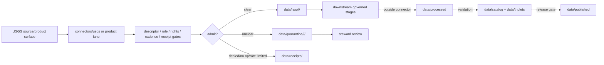

<!-- [KFM_META_BLOCK_V2]
doc_id: kfm://doc/connectors-usgs-readme
title: connectors/usgs/ — USGS Connector Coordination Lane
type: readme
version: v0.1
status: draft
owners: OWNER_TBD — Connector steward · Source steward · USGS steward · Hydrology steward · Spatial Foundation steward · Geology steward · Hazards steward · Rights steward · Sensitivity reviewer · Data steward · Validation steward · Docs steward
created: 2026-06-20
updated: 2026-06-20
policy_label: public; coordination-lane; multi-product; federal-source; source-admission-only
related:
  - ../README.md
  - ../usgs-earthquake/README.md
  - ../../docs/doctrine/directory-rules.md
  - ../../docs/sources/catalog/usgs/README.md
  - ../../docs/sources/catalog/usgs/earthquake-catalog.md
  - ../../docs/sources/catalog/usgs/usgs-3dep-elevation.md
  - ../../docs/sources/catalog/usgs/usgs-mrds.md
  - ../../docs/sources/catalog/usgs/usgs-ngmdb.md
  - ../../docs/sources/catalog/usgs/nwis-water.md
  - ../../docs/domains/hazards/SOURCE_ROLE_MATRIX.md
  - ../../docs/domains/hazards/SOURCE_REGISTRY.md
  - ../../data/registry/sources/
  - ../../data/raw/
  - ../../data/quarantine/
  - ../../data/receipts/
  - ../../data/proofs/
  - ../../policy/rights/
  - ../../policy/sensitivity/
  - ../../release/
tags: [kfm, connectors, usgs, earthquake, 3dep, nwis, water-data, mrds, ngmdb, geology, hydrology, hazards, spatial-foundation, source-admission, raw, quarantine, source-role, governance]
notes:
  - "Expanded from greenfield stub: endpoints, rate limits, descriptors, and ingest receipts are retained as verification gates."
  - "USGS is a multi-product source family. Each sub-source needs a SourceDescriptor, role, rights, cadence, sensitivity, and activation decision."
  - "connectors/usgs/ is the coordination/root lane. Source-specific connector lanes such as connectors/usgs-earthquake/ may exist beside it until placement is settled."
  - "Connector output may enter raw or quarantine admission lanes only."
  - "This README defines a connector coordination/source-admission boundary, not USGS source-family doctrine, product doctrine, domain doctrine, SourceDescriptor authority, policy authority, schema authority, catalog/triplet authority, proof authority, release authority, public API behavior, or public UI behavior."
[/KFM_META_BLOCK_V2] -->

<a id="top"></a>

# USGS Connector Coordination Lane

> Draft coordination boundary for U.S. Geological Survey connector work. Specific USGS products keep their own source roles, descriptors, cadence, rights posture, sensitivity posture, and downstream release gates.

<p>
  
  
  
  
  
  
</p>

`connectors/usgs/`

## Quick jumps

[Status](#status) · [Scope](#scope) · [Repo fit](#repo-fit) · [Relationship to product lanes](#relationship-to-product-lanes) · [Accepted inputs](#accepted-inputs) · [Exclusions](#exclusions) · [Admission model](#admission-model) · [Source-role discipline](#source-role-discipline) · [Lifecycle sketch](#lifecycle-sketch) · [Authority boundary](#authority-boundary) · [Evidence basis](#evidence-basis) · [Validation](#validation) · [Rollback](#rollback) · [Definition of done](#definition-of-done)

---

## Status

> [!IMPORTANT]
> **Status:** `draft` / `NEEDS VERIFICATION`  
> **Owner:** `OWNER_TBD`  
> **Path:** `connectors/usgs/`  
> **Mode:** connector-family coordination lane  
> **Truth posture:** `CONFIRMED` file path and README content; connector code, source descriptors, endpoint configuration, rate-limit policy, fixtures, tests, CI wiring, emitted receipts, and release behavior remain `NEEDS VERIFICATION`.

---

## Scope

`connectors/usgs/` is the draft connector-family coordination lane for USGS source-admission work.

This folder may contain connector-local documentation, shared USGS source-admission conventions, descriptor-gated helper notes, endpoint/rate-limit verification notes, product-lane pointers, fixture pointers, source-role guardrails, provenance/digest helpers, and raw/quarantine handoff conventions for approved USGS source material.

It must not become USGS source-family doctrine, USGS product doctrine, Hydrology doctrine, Spatial Foundation doctrine, Geology doctrine, Hazards doctrine, SourceDescriptor authority, rights policy authority, sensitivity policy authority, schema authority, catalog/triplet authority, proof authority, release authority, public API behavior, public UI behavior, public map authority, or publication authority.

The original stub requested endpoints, rate limits, descriptors, and ingest receipts. This README preserves that intent as governance work: those items are required verification gates, not confirmed implementation.

---

## Repo fit

```text
connectors/
├── usgs/
│   └── README.md
└── usgs-earthquake/
    └── README.md
```

Related responsibility roots:

```text
docs/sources/catalog/usgs/                # USGS source-family and product doctrine
docs/sources/catalog/usgs/earthquake-catalog.md # USGS earthquake product doctrine
docs/domains/hydrology/                   # water-data, hydrography, and watershed context
docs/domains/spatial-foundation/          # terrain, elevation, names, boundaries, base geography
docs/domains/geology/                     # geology and natural-resource source context
docs/domains/hazards/                     # hazards source roles, lifecycle, and boundaries
data/registry/sources/                    # source descriptors and activation state
data/raw/                                 # raw staged source outputs by owning domain
data/quarantine/                          # held material requiring review
data/receipts/                            # ingest, checksum, query, run, transform, and review receipts
data/proofs/                              # EvidenceBundles and proof packs
policy/rights/                            # source-use and attribution review
policy/sensitivity/                       # release and precision review
release/                                  # release decisions and rollback state
```

---

## Relationship to product lanes

| Product or family | Existing / preferred connector home | Boundary |
|---|---|---|
| USGS Earthquakes | `connectors/usgs-earthquake/` or accepted sublane | Seismic event catalog and derivative products; not public alerting. |
| USGS 3DEP | product-specific USGS sublane after placement decision | Terrain/LiDAR/DEM products; observed and modeled sub-products stay separate. |
| USGS Water Data / NWIS | product-specific USGS sublane after placement decision | Gauge/sensor values and aggregates; endpoint migration/cadence needs verification. |
| USGS MRDS | product-specific USGS sublane after placement decision | Mineral-resource occurrence/prospect records; natural-resource and sensitivity posture needs descriptor review. |
| USGS NGMDB / geologic maps | product-specific USGS sublane after placement decision | Compiled geologic-map context; do not treat all compiled maps as direct observations. |
| GNIS / names | product-specific USGS sublane after placement decision | Administrative place-name authority; not observation of a place event. |
| The National Map / Science Data Catalog | carrier or access surfaces | Treat as discovery/download carriers unless a product-specific descriptor says otherwise. |

No move, delete, rename, redirect, or deprecation is implied by this README.

---

## Accepted inputs

| Accepted item | Required posture |
|---|---|
| Source-family placement notes | Track whether a USGS sub-source belongs under `connectors/usgs/`, a sibling lane, or a product sublane. |
| Product-lane pointer notes | Link to product READMEs and catalog pages without duplicating product doctrine. |
| Endpoint/rate-limit verification notes | Record endpoint, cadence, and rate-limit checks as `NEEDS VERIFICATION` until tested. |
| Descriptor-gated helper notes | Preserve the requirement that activation depends on accepted `SourceDescriptor` records. |
| Event/run receipt notes | Preserve pre-RAW run evidence, no-op, deny, rate-limit, and failure auditability. |
| Fixture pointers | Point to safe fixture homes; fixtures do not become source authority. |
| Raw/quarantine handoff notes | Preserve the boundary that connector output enters only raw or quarantine admission lanes. |

---

## Exclusions

| Do not store here | Correct home |
|---|---|
| USGS source-family/product doctrine | `../../docs/sources/catalog/usgs/` |
| Hydrology, Spatial Foundation, Geology, or Hazards doctrine | `../../docs/domains/<domain>/` |
| Authoritative SourceDescriptor records | `../../data/registry/sources/` |
| Rights or sensitivity rules | `../../policy/rights/`, `../../policy/sensitivity/` |
| Receipts or proof packs as authority | `../../data/receipts/`, `../../data/proofs/` |
| Processed records | `../../data/processed/` |
| Catalog or triplet records | `../../data/catalog/`, `../../data/triplets/` |
| Public artifacts | `../../data/published/` after governed release |
| Public API or UI behavior | governed application roots after verification |

---

## Admission model

USGS source material must be admitted product-first, source-role-first, rights-first, and cadence-aware.

| Concern | Required connector posture |
|---|---|
| Source identity | Preserve USGS program/product identity, descriptor reference, source URL/reference, retrieval time, rights posture, citation posture, and digest. |
| Product separation | Keep water data, hydrography, terrain, earthquakes, geologic maps, mineral-resource records, names, and carrier surfaces distinct. |
| Source role | Preserve observed, modeled, aggregate, administrative, candidate, or other assigned roles from each SourceDescriptor. |
| Endpoint and cadence | Preserve endpoint identity, query/package parameters, retrieval time, response status, cadence expectations, and rate-limit outcome. |
| Receipt discipline | Preserve event/run receipts even for failed, denied, rate-limited, or no-op source probes. |
| Rights and sensitivity | Require product-specific rights, attribution, source-use, precision, join, and release review before downstream use. |
| Publication | No connector output is public. Publication is a separate governed transition outside this folder. |

---

## Source-role discipline

USGS is a source family, not a single source role.

| Anti-collapse risk | Required guardrail |
|---|---|
| Federal source treated as automatically regulatory | Do not relabel USGS products as regulatory just because they are federal. |
| Modeled derivative treated as observation | Preserve model identity, run metadata, uncertainty, and EvidenceBundle linkage. |
| Aggregate value treated as record-level truth | Preserve aggregation unit and deny over-precise joins. |
| Carrier surface treated as content source | The National Map or Science Data Catalog may be access machinery; per-asset role still controls. |
| Product page treated as SourceDescriptor | Catalog pages orient humans; descriptors and activation records govern admission. |
| Connector treated as publisher | Connector output is raw/quarantine only; release happens elsewhere. |

---

## Lifecycle sketch



Connector code admits, quarantines, denies, or records source probes. It does not decide final domain truth, public map precision, public suitability, or release state.

---

## Authority boundary

```text
OUTPUT LIMIT:
  data/raw/<domain>/<source_id>/<run_id>/
  data/quarantine/<domain>/<source_id>/<run_id>/
  data/receipts/<run_id>/              # run/probe evidence, not proof closure

NOT HERE:
  USGS source-family doctrine
  USGS product doctrine
  domain doctrine
  SourceDescriptor authority
  rights or sensitivity policy
  processed records
  catalog records
  triplet records
  receipts / proofs as publication authority
  release decisions
  public API behavior
  public UI behavior
```

---

## Evidence basis

| Source | Status | Supports | Limits |
|---|---|---|---|
| Existing `connectors/usgs/README.md` stub | `CONFIRMED` | Target file existed; stub named endpoints, rate limits, descriptors, and ingest receipts as needed connector concerns. | Stub did not provide governance boundaries or implementation proof. |
| `docs/sources/catalog/usgs/README.md` | `CONFIRMED` | USGS is a source family; `connectors/usgs/` is a named connector home; each sub-source needs identity, role, domain lane, rights, sensitivity, freshness, and admission status. | Does not prove connector implementation exists. |
| `docs/sources/catalog/usgs/earthquake-catalog.md` | `CONFIRMED` | Earthquake product has heterogeneous observed/modeled/crowdsourced surfaces and append-only event-update discipline. | Product page does not activate connector code. |
| `docs/domains/hazards/SOURCE_ROLE_MATRIX.md` | `CONFIRMED` | Source role is set at admission, preserved through promotion, and hazards fail closed on role collapse. | Per-source assignments remain governed by SourceDescriptor admission. |

---

## Validation

Before relying on this connector-family lane, verify:

- canonical USGS connector placement and product sublane conventions are resolved or recorded as open drift;
- duplicate implementation does not conflict with `connectors/usgs-earthquake/` or future product lanes;
- SourceDescriptor records exist and validate for each activated USGS sub-source;
- endpoints, package surfaces, rate limits, cadence, rights, sensitivity, and access requirements are verified per product;
- no-network fixtures exist for tests;
- event/run receipts are emitted for successful, failed, denied, no-op, and rate-limited probes;
- outputs are limited to raw or quarantine admission lanes;
- processed, catalog, triplet, proof, and release artifacts are produced only outside connectors;
- public clients do not read connector outputs directly.

---

## Rollback

Rollback is required if this README creates parallel source-family authority, misstates canonical connector placement, weakens source-role separation, implies product activation, or conflicts with an accepted ADR.

Rollback target: prior greenfield stub at content SHA `67d1e59d79e31d3147afafc37f9d7429424e0b64`.

---

## Definition of done

- [ ] Owners are confirmed and `OWNER_TBD` is replaced.
- [ ] Canonical connector placement and product sublane convention are resolved or recorded as open drift.
- [ ] Actual connector contents are inventoried.
- [ ] SourceDescriptor IDs, product identities, source roles, rights, sensitivity, cadence, endpoint/rate-limit behavior, and activation state are verified.
- [ ] Tests prevent source-role collapse, product/carrier collapse, aggregate overclaim, modeled/observed collapse, rights bypass, sensitivity bypass, and release misuse.
- [ ] Outputs are verified to enter raw or quarantine admission lanes only.
- [ ] Event/run receipts exist for successful, failed, denied, no-op, and rate-limited source probes.
- [ ] No source-family, product, domain, processed, catalog, triplet, published, release, schema, policy, proof, registry, fixture, API, UI, or public-claim authority lives here.
- [ ] Tests, fixtures, and CI behavior are verified or marked `NEEDS VERIFICATION`.

---

## Status summary

`connectors/usgs/` is a draft USGS connector coordination lane. It is not USGS source-family doctrine, product doctrine, SourceDescriptor authority, policy authority, schema authority, catalog/triplet authority, proof closure, release authority, public map authority, public API behavior, public UI behavior, or pipeline authority. It preserves the original stub's implementation concerns — endpoints, rate limits, descriptors, and ingest receipts — as explicit verification gates.

<p align="right"><a href="#top">Back to top</a></p>
