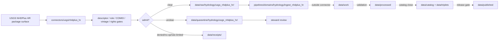

<!-- [KFM_META_BLOCK_V2]
doc_id: kfm://doc/connectors-usgs-nhdplus-hr-readme
title: connectors/usgs/nhdplus_hr/ — USGS NHDPlus HR Connector Lane
type: readme
version: v0.1
status: draft
owners: OWNER_TBD — Connector steward · Source steward · USGS steward · NHDPlus HR steward · Hydrology steward · Spatial Foundation steward · Data steward · Validation steward · Docs steward
created: 2026-06-20
updated: 2026-06-20
policy_label: public; nested-lane; hydrography; network-topology; source-admission-only; raw-quarantine-only
related:
  - ../README.md
  - ../../../docs/sources/catalog/usgs/README.md
  - ../../../docs/sources/catalog/usgs/nhdplus-hr.md
  - ../../../pipelines/domains/hydrology/ingest_nhdplus_hr/README.md
  - ../../../docs/domains/hydrology/README.md
  - ../../../docs/domains/hydrology/source-role-matrix.md
  - ../../../docs/domains/hydrology/CROSSWALK_RULES.md
  - ../../../data/registry/sources/
  - ../../../data/raw/
  - ../../../data/quarantine/
  - ../../../data/receipts/
  - ../../../data/proofs/
  - ../../../policy/rights/
  - ../../../policy/sensitivity/
  - ../../../release/
tags: [kfm, connectors, usgs, nhdplus-hr, nhd, 3dhp, hydrography, hydrology, spatial-foundation, comid, vaa, network-topology, observed-geometry, modeled-attributes, source-admission, raw, quarantine, governance]
notes:
  - "Draft nested connector lane for USGS NHDPlus High Resolution source intake and admission helpers."
  - "Placement is draft / ADR-class: usgs/nhdplus_hr/ product sublane convention remains NEEDS VERIFICATION unless ratified by Directory Rules or ADR."
  - "NHDPlus HR source-role posture is heterogeneous: digitized hydrography geometry is observed/digitized source material; VAAs and topology attributes are modeled."
  - "COMID identity, WBD package scope, release vintage, upstream/downstream topology, VAA method lineage, geometry lineage, and receipt lineage must be preserved."
  - "NHDPlus HR is informational hydrography context, not NFHL, not observed streamflow, not a regulatory flood determination, not engineering certification, and not current safety guidance."
  - "Connector output may enter raw or quarantine admission lanes only."
[/KFM_META_BLOCK_V2] -->

<a id="top"></a>

# USGS NHDPlus HR Connector Lane

> Draft nested connector boundary for USGS NHDPlus High Resolution material. This lane admits hydrography source packages; it does not decide hydrologic truth, regulatory flood status, engineering suitability, or release state.

<p>
  
  
  
  
  
  
</p>

`connectors/usgs/nhdplus_hr/`

## Quick jumps

[Status](#status) · [Scope](#scope) · [Repo fit](#repo-fit) · [Accepted inputs](#accepted-inputs) · [Exclusions](#exclusions) · [Admission model](#admission-model) · [Source-role discipline](#source-role-discipline) · [Network and identity discipline](#network-and-identity-discipline) · [Lifecycle sketch](#lifecycle-sketch) · [Authority boundary](#authority-boundary) · [Evidence basis](#evidence-basis) · [Validation](#validation) · [Rollback](#rollback) · [Definition of done](#definition-of-done)

---

## Status

> [!IMPORTANT]
> **Status:** `draft` / `NEEDS VERIFICATION`  
> **Owner:** `OWNER_TBD`  
> **Path:** `connectors/usgs/nhdplus_hr/`  
> **Mode:** nested product connector lane  
> **Truth posture:** `CONFIRMED` file path and README content; connector code, source descriptors, endpoint/package configuration, fixtures, tests, CI wiring, emitted receipts, and release behavior remain `NEEDS VERIFICATION`.

---

## Scope

`connectors/usgs/nhdplus_hr/` is a draft nested connector lane for USGS NHDPlus HR source intake and admission helpers.

This folder may contain connector-local documentation, descriptor-gated client helpers, package manifest helpers, COMID inventory helpers, WBD package-scope helpers, NHDFlowline/NHDArea/NHDWaterbody pointer notes, VAA table pointer notes, network topology lineage helpers, release-vintage helpers, provenance/digest helpers, no-network fixture pointers, and raw/quarantine handoff adapters for approved NHDPlus HR source material.

It must not become NHDPlus HR product doctrine, Hydrology doctrine, Spatial Foundation doctrine, hydrologic truth, observed streamflow authority, flood-zone/regulatory authority, engineering certification, SourceDescriptor authority, rights policy authority, sensitivity policy authority, schema authority, catalog/triplet authority, proof authority, release authority, public API behavior, public UI behavior, public map authority, or publication authority.

---

## Repo fit

```text
connectors/
└── usgs/
    ├── README.md
    ├── 3dep/
    │   └── README.md
    └── nhdplus_hr/
        └── README.md
```

Related responsibility roots:

```text
connectors/usgs/                          # USGS connector-family coordination lane
connectors/usgs/nhdplus_hr/               # this draft NHDPlus HR product connector lane
docs/sources/catalog/usgs/nhdplus-hr.md   # NHDPlus HR product page
docs/domains/hydrology/                   # hydrology source roles, identity, crosswalk, lifecycle
data/registry/sources/                    # source descriptors and activation state
data/raw/                                 # raw staged source outputs by owning domain
data/quarantine/                          # held material requiring review
data/receipts/                            # ingest, checksum, package, transform, and review receipts
data/proofs/                              # EvidenceBundles and proof packs
policy/rights/                            # source-use and attribution review
policy/sensitivity/                       # precision, joins, and release review
release/                                  # release decisions and rollback state
```

---

## Accepted inputs

| Accepted item | Required posture |
|---|---|
| Source-reference manifest | Preserve USGS NHDPlus HR identity, descriptor reference, source URL, retrieval/import time, rights posture, review posture, and digest. |
| Package manifest | Preserve geodatabase/package identity, file inventory, WBD/HU scope, release vintage, CRS, and digest. |
| Geometry pointer | Preserve NHDFlowline, NHDArea, and NHDWaterbody identity separately. |
| COMID inventory helper | Preserve COMID identity, feature class, WBD package scope, and downstream crosswalk status. |
| VAA helper | Preserve VAA table identity, method lineage, modeled-role posture, and link to COMID. |
| Network topology helper | Preserve upstream/downstream linkage, level path, flow direction, and topology caveats. |
| Test references | Point to owning fixture/test roots; fixtures do not become source authority. |

---

## Exclusions

| Do not store here | Correct home |
|---|---|
| NHDPlus HR product doctrine | `../../../docs/sources/catalog/usgs/nhdplus-hr.md` |
| USGS source-family doctrine | `../../../docs/sources/catalog/usgs/` |
| Hydrology or Spatial Foundation doctrine | `../../../docs/domains/hydrology/`, `../../../docs/domains/spatial-foundation/` |
| Authoritative SourceDescriptor records | `../../../data/registry/sources/` |
| Rights or sensitivity rules | `../../../policy/rights/`, `../../../policy/sensitivity/` |
| Executable hydrology normalization pipeline | `../../../pipelines/domains/hydrology/ingest_nhdplus_hr/` |
| Receipts or proof packs as authority | `../../../data/receipts/`, `../../../data/proofs/` |
| Processed hydrology records | `../../../data/processed/` |
| Catalog or triplet records | `../../../data/catalog/`, `../../../data/triplets/` |
| Public artifacts | `../../../data/published/` after governed release |
| Public API or UI behavior | governed application roots after verification |

---

## Admission model

NHDPlus HR source material must be admitted package-first, COMID-first, source-role-first, rights-first, and vintage-aware.

| Concern | Required connector posture |
|---|---|
| Source identity | Preserve USGS NHDPlus HR product identity, descriptor reference, source URL/reference, retrieval time, rights posture, citation posture, and digest. |
| Package scope | Preserve WBD/HU package scope, release vintage, package inventory, and source digest. |
| COMID identity | Preserve COMID identifiers and feature identity across geometry, VAA tables, and topology records. |
| Source role | Preserve observed/digitized geometry separately from modeled VAAs and network topology. |
| Network topology | Preserve upstream/downstream linkage, flow direction, level path, and topology caveats. |
| Publication | No connector output is public. Publication is a separate governed transition outside this folder. |

---

## Source-role discipline

NHDPlus HR is source-role heterogeneous.

| Surface | Connector rule |
|---|---|
| NHDFlowline / NHDArea / NHDWaterbody geometry | Treat as observed/digitized hydrography geometry; preserve geometry lineage and COMID linkage. |
| Value-Added Attributes | Treat as modeled; preserve method lineage and never cite as measured reach values. |
| Network topology | Treat as modeled/derived topology; preserve derivation caveats and upstream/downstream lineage. |
| WBD package scope | Treat as package/accounting scope; do not turn package boundary into hydrography truth. |
| 3DHP successor context | Track separately; do not silently replace NHDPlus HR without descriptor and migration review. |

---

## Network and identity discipline

- COMID is load-bearing and must survive admission, quarantine, validation, and downstream normalization.
- Geometry alone is insufficient; topology and VAA linkage are part of the evidence shape.
- WBD/HU package scope must be preserved as packaging scope, not hydrologic truth.
- VAAs such as drainage area, mean annual flow, velocity, and stream order are modeled context, not observed streamflow.
- NHDPlus HR is not FEMA NFHL and must not be cited as a regulatory flood determination.
- NHDPlus HR is not USGS Water Data/NWIS measured gauge readings.
- Release-vintage and successor-track context must be carried forward.

---

## Lifecycle sketch



Connector code admits, quarantines, denies, or records source probes. It does not decide hydrologic truth, engineering suitability, regulatory status, public map precision, or release state.

---

## Authority boundary

```text
OUTPUT LIMIT:
  data/raw/hydrology/usgs_nhdplus_hr/<run_id>/
  data/quarantine/hydrology/usgs_nhdplus_hr/<run_id>/
  data/receipts/<run_id>/              # run/probe evidence, not proof closure

NOT HERE:
  NHDPlus HR product doctrine
  hydrologic truth
  observed streamflow authority
  flood-zone/regulatory authority
  engineering certification
  SourceDescriptor authority
  rights or sensitivity policy
  executable pipeline authority
  processed records
  catalog records
  triplet records
  receipts / proofs as publication authority
  release decisions
  public API behavior
  public UI behavior
```

---

## Evidence basis

| Source | Status | Supports | Limits |
|---|---|---|---|
| `docs/sources/catalog/usgs/nhdplus-hr.md` | `CONFIRMED` | Product identity, COMID/network topology, heterogeneous source-role posture, VAA caution, release vintage, and non-regulatory disclaimer. | Does not prove connector implementation exists. |
| `pipelines/domains/hydrology/ingest_nhdplus_hr/README.md` | `CONFIRMED` | Downstream executable pipeline boundary, anti-collapse rules, COMID/WBD/vintage/VAA lineage, and non-public posture. | Pipeline README does not make connector active. |
| `connectors/usgs/nhdplus_hr/README.md` before this edit | `CONFIRMED` | Target file existed but was blank. | No implementation proof. |

---

## Validation

Before relying on this connector, verify:

- nested `connectors/usgs/nhdplus_hr/` placement is ratified or recorded in the drift/open-question register;
- SourceDescriptor records exist and validate;
- current NHDPlus HR package surfaces, endpoint behavior, access constraints, cadence/freshness, and rights terms are verified;
- COMID, WBD package scope, release vintage, geometry lineage, VAA lineage, and topology gates are implemented;
- observed geometry vs modeled VAA/topology separation is enforced;
- no-network fixtures exist for tests;
- run receipts are emitted for successful, failed, denied, skipped, no-op, and rate-limited probes;
- outputs are limited to raw or quarantine admission lanes;
- downstream work, processed, catalog, triplet, proof, and release artifacts are produced only outside connectors;
- public clients do not read connector outputs directly.

---

## Rollback

Rollback is required if this README creates parallel product authority, misstates canonical connector placement, weakens source-role separation, implies endpoint activation without tests, or conflicts with an accepted ADR.

Rollback target: initial blank file content SHA `8b137891791fe96927ad78e64b0aad7bded08bdc`.

---

## Definition of done

- [ ] Owners are confirmed and `OWNER_TBD` is replaced.
- [ ] Connector placement and product sublane convention are resolved or recorded as open drift.
- [ ] Actual connector contents are inventoried.
- [ ] SourceDescriptor IDs, product identities, source roles, rights, sensitivity, cadence, endpoint/package behavior, and activation state are verified.
- [ ] Tests prevent geometry/VAA/topology collapse, COMID loss, WBD package-scope overclaim, NHDPlus/NWIS collapse, NHDPlus/NFHL collapse, rights bypass, sensitivity bypass, and release misuse.
- [ ] Outputs are verified to enter raw or quarantine admission lanes only.
- [ ] Run receipts exist for successful, failed, denied, skipped, no-op, and rate-limited source probes.
- [ ] No source-family, product, domain, processed, catalog, triplet, published, release, schema, policy, proof, registry, fixture, API, UI, or public-claim authority lives here.
- [ ] Tests, fixtures, and CI behavior are verified or marked `NEEDS VERIFICATION`.

---

## Status summary

`connectors/usgs/nhdplus_hr/` is a draft nested USGS NHDPlus HR source-admission lane. It is not the canonical NHDPlus HR connector home unless ratified. It is not NHDPlus HR product doctrine, hydrologic truth, observed streamflow authority, flood-zone/regulatory authority, SourceDescriptor authority, policy authority, schema authority, catalog/triplet authority, proof closure, release authority, public map authority, public API behavior, public UI behavior, or pipeline authority.

<p align="right"><a href="#top">Back to top</a></p>
